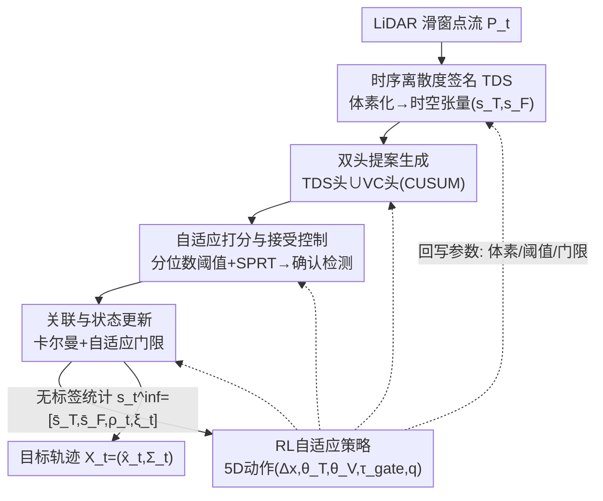

# Adaptive 3D Perception for Small Aerial Targets Under Sparse Sampling via Reinforcement Learning

**会议**: CVPR 2026  
**论文**: [CVF Open Access](https://openaccess.thecvf.com/content/CVPR2026/html/Yuan_Adaptive_3D_Perception_for_Small_Aerial_Targets_Under_Sparse_Sampling_CVPR_2026_paper.html)  
**代码**: 待确认  
**领域**: 3D视觉  
**关键词**: LiDAR小目标感知, 反无人机, 强化学习自适应, 时序离散度, 闭环感知控制

## 一句话总结
针对远距 LiDAR 下小型空中目标（鸟、无人机）点云极度稀疏且随运动剧烈抖动的问题，A3PRL 用一个轻量 5 维强化学习策略，根据无标签的稀疏度/接受率/轨迹连续性统计量，在线联合调节体素分辨率、检测阈值和关联门限，把"固定参数感知流水线"改造成"闭环自适应感知-控制系统"，在 MMAUD 跨场景测试上把 3D 定位误差降低约 19%。

## 研究背景与动机

**领域现状**：反无人机（anti-UAV）感知用过视觉、热成像、雷达、声学、射频等多种模态，但每种都绑定特定工况（光照、杂波、载荷、频谱），泛化性差。LiDAR 因为提供几何丰富、光照无关的距离信息、体积小成本中等，是有吸引力的选择。然而主流 LiDAR 3D 检测器（PointPillars、CenterPoint、VoxelNet 等）都是为自动驾驶的稠密近距点云设计的。

**现有痛点**：当目标又小又远、且采样密度随时间剧烈变化时，固定体素化 + 静态分数/门限阈值会直接失效。论文点名三个叠加难题：(i) 远距稀疏让运动估计不可靠；(ii) 太阳眩光和大气干扰扭曲距离测量；(iii) 场景相关阈值导致检测和跟踪不稳定。更糟的是，运动本身让点分布非均匀——快速目标每帧只回几个点，悬停目标却堆出稠密团簇，同一套固定参数没法两头兼顾。

**核心矛盾**：感知参数（体素大小、检测灵敏度、关联门限）的最优值随场景稀疏度和目标运动状态实时漂移，但传统流水线把它们写死了。手工自适应方法要么只调单个检测器设置、不耦合下游跟踪反馈，要么依赖人工准则、对每个新 LiDAR 配置都要重调。

**本文目标**：把远距稀疏 LiDAR 的 SAT 感知，从"固定参数的前馈检测"重新建模为"闭环自适应感知-控制"，让系统根据在线场景反馈自己调参；同时要做到推理时完全无标签。

**切入角度**：作者观察到运动会在体素内留下可量化的"时空离散度"指纹——快速/短寿命目标和稳定背景在时间紧致度、帧占用率上有截然不同的统计特征。如果把这些无标签统计量喂给一个 RL 控制器，它就能在不见真值的情况下推断"现在 LiDAR 变稀了 / 轨迹开始碎了"，进而协调地调参。

**核心 idea**：用一个轻量 RL 策略，基于无标签的时空离散度 + 接受率 + 轨迹连续性，在流式"检测器-跟踪器"回路里联合调节体素缩放、检测阈值和关联门限——训练时用特权真值轨迹塑形奖励，测试时纯靠 LiDAR 派生统计量运行。

## 方法详解

### 整体框架

A3PRL 把问题建模为主动感知（active perception）：在长度 $W$ 的滑动窗口内观测 LiDAR 流 $P_t$，把工作空间离散成基分辨率 $(\delta_x,\delta_y,\delta_z)$ 的体素，目标是在线估计单个活动空中目标的状态 $X_t=(\hat{x}_t,\Sigma_t)$（位置+速度+协方差），要求新目标低延迟出现、误报有界、轨迹连续。

整条流水线是五段串联 + 一条 RL 反馈回路：① 把窗口内点云体素化成时空张量，提取**时序离散度签名 TDS**；② 用 **TDS 头 + 速度变化（VC）头**双路并行生成候选体素；③ 对候选做**自适应融合打分 + 接受控制**（分位数动态阈值 + 序贯检验），输出确认检测；④ 用轻量**关联与状态更新**（卡尔曼 + 自适应门限）维护单目标轨迹；⑤ **RL 策略**观测无标签统计量 $s_t^{\text{inf}}=[\bar{s}_T,\bar{s}_F,\rho_t,\xi_t]$，输出 5 维连续动作 $a_t=(\Delta x_t,\theta_T,\theta_V,\tau_{\text{gate}},q)$，回写给前面各阶段的参数，形成闭环。关键在于：体素缩放 $\Delta x_t$、提案阈值 $(\theta_T,\theta_V)$、关联门限 $\tau_{\text{gate}}$、动态分位数 $q$ 不再是常数，而是每步由策略根据场景动态吐出。

### 关键设计

**1. 时序离散度签名 TDS：把"运动稀疏"编码成体素级时空张量**

痛点很直接：远距 LiDAR 下，光看每帧点数没法区分"快速 UAV（少点）"和"背景噪声（也少点）"，单纯的密度统计不足以刻画运行状态（消融里只用密度 RMSE 高达 2.80 m）。作者的做法是给每个体素 $v$ 维护两个时间统计量——最新/最早时间戳 $\tau_{\max}(v),\tau_{\min}(v)$ 和帧占用计数 $O(v)$（窗口内观测到该体素的不同帧数），再定义时间离散度 $\Delta T(v)=\tau_{\max}-\tau_{\min}$ 和填充率 $\kappa(v)=O(v)/(W/\delta_t)$。由此得到两个归一化特征：

$$s_T(v)=1-\frac{\Delta T(v)}{W},\qquad s_F(v)=1-\kappa(v),$$

其中 $s_T\in[0,1]$ 衡量时间紧致度，$s_F\in[0,1]$ 反映帧稀疏度。快速移动或短寿命的目标会产生高 $(s_T,s_F)$。整个窗口被映射成一个 $N_x\times N_y\times N_z\times 2$ 的 4D 时空张量，两个通道分别存 $(s_T,s_F)$。之所以有效：它直接从异步 LiDAR 回波里编码运动线索、不依赖稠密点统计；而且用环形缓冲 + 单调双端队列维护 $\tau_{\min/\max}$，每帧摊还 $O(1)$ 更新，足够轻量在线跑。全局平均池化后得到 $\bar{s}_T,\bar{s}_F$，既当提案线索又当 RL 状态分量。

**2. 双头提案 + 序贯接受控制：让候选既抓"瞬态"又抓"突变运动"，并统计性地确认**

固定阈值在稀疏场景容易要么漏要么爆。作者用两个并行头互补：**TDS 头**对时空离散度打原始分 $\phi_T(v)=w_T s_T(v)+w_F s_F(v)$，超过 $\theta_T$ 的体素入候选集 $C_T$，专门捞短寿命/稀疏占用的体素；**VC（速度变化）头**先用最近 $L$ 帧线性拟合出短时速度 $u_\tau(v)$，算速度变化量 $\delta v_\tau(v)=\|u_\tau-u_{\tau-1}\|_2$，超过 $\theta_V$ 的进 $C_V$，并对每个体素维护一个单边 CUSUM 累积量 $G_\tau(v)=\max\{0,G_{\tau-1}(v)+(\delta v_\tau(v)-\nu)\}$，当 $G_\tau\ge h$ 报警——这让它对"缓慢但持续的运动"也敏感，而不是只看单帧抖动。两头取并集 $C_t=C_T\cup C_V$ 后做 6 邻域连接和 $3\times3\times3$ 形态学闭运算扩成 3D 区域。

接受控制是这个设计的统计核心：先对所有体素算融合置信 $\psi(v)=\alpha s_T+\beta s_F+\gamma s_V+\delta s_S$（四项分别是时间紧致、帧稀疏、速度一致性 $s_V$、空间稳定性 $s_S$，后者是邻域 IoU），再用背景体素 $B_t=V\setminus C_t$ 的分位数 $\hat{\tau}_\psi(t)=Q_q(\{\psi(v)\,|\,v\in B_t\})$ 当动态阈值——分位数 $q$ 本身是 RL 动作之一，所以阈值随密度自适应。最后对伯努利序列 $\{y_{t_m}(v)\}$ 跑 **log-SPRT 序贯概率比检验**，累积 $S_k=\sum_m \log\frac{P(y|H_1)}{P(y|H_0)}$，$S_k\ge a$ 接受为真目标、$S_k\le b$ 拒绝、否则继续采样（$a,b$ 由 Type-I/II 误差预算 $\alpha_{\text{err}}=\beta_{\text{err}}=0.05$ 决定）。这套序贯统计顺带产出**无标签前景接受率** $\rho_t=|D_t|/\max(1,|C_t|)$，正好喂回 RL。消融显示去掉 TDS 头掉点最狠（1.17→2.84 m），去掉 VC 头到 1.92 m，去掉 $\rho_t$ 到 1.78 m——三者确实各司其职、不可互换。

**3. RL 自适应策略：用无标签统计量在线联合调五个耦合超参**

这是把流水线变成闭环的"大脑"。痛点是体素大小、检测阈值、关联门限这些参数最优值会随场景漂移，但它们彼此耦合（"LiDAR 变稀"和"轨迹开始碎"是联动的），手工很难协调。作者用一个轻量 MLP 策略 $\pi_\phi:S\to A$，观测 4 维无标签状态 $s_t^{\text{inf}}=[\bar{s}_T,\bar{s}_F,\rho_t,\xi_t]$（$\xi_t$ 是轨迹连续性分数，由轨迹是否在门限内收到有效观测更新、并按马氏距离调制得到，作为时序一致性的无标签代理），输出 5 维连续动作 $a_t=(\Delta x_t,\theta_T,\theta_V,\tau_{\text{gate}},q)$，一次前向就协调地给出体素缩放、两个提案阈值、关联门限和动态分位数。

策略用 PPO 优化期望回报 $\mathbb{E}_{\pi_\phi}[\sum_t\gamma^t r_t]$，奖励为

$$r_t=-\big(\lambda_1\,\varepsilon_t+\lambda_2(1-\xi_t)+\lambda_3|\rho_t-\tau_\rho|\big),$$

三项分别惩罚几何误差 $\varepsilon_t$、时序不连续 $(1-\xi_t)$、接受率偏离目标 $\tau_\rho=0.6$，从而在精度、稳定性、计算效率间平衡。部署时对预测动作做指数滑动平均（EMA）让调参平滑。关键在于它有效不是靠堆容量——消融把 MLP 从 1 层加到 4 层，1.486→1.328→1.171→1.174，3 层就饱和，说明增益主要来自观测/动作设计本身。

**4. 特权训练、无标签推理：训练用真值塑形奖励，测试纯靠 LiDAR 统计**

痛点是反无人机部署现场拿不到标签，但只用无标签信号又难训出好策略。作者用混合方案：训练时观测里追加特权统计量 $s_t^{\text{train}}=[\bar{s}_T,\bar{s}_F,\rho_t,\xi_t,\varepsilon_t]$，其中 $\varepsilon_t$ 是用真值轨迹算的几何误差，用来塑形奖励；推理时砍掉 $\varepsilon_t$，策略只吃 4 维 LiDAR 派生统计量 $s_t^{\text{inf}}$，对五个耦合超参做单次连续决策、全程零标签。为增强对未见域的鲁棒性，还做了域随机化：从 MCD 数据集取语义标注的 LiDAR 噪声（近似太阳干扰），独立缩放旋转后合成进训练序列，只在训练特权策略时用。这个"训练时偷看、测试时盲跑"的设计，正是它能 train-on-V1 / test-on-unseen-V2/V3 还保持精度的原因。

### 损失函数 / 训练策略
策略用 PPO 训练，目标即上文奖励 $r_t$（几何精度 + 时序连续 + 接受率正则三项加权），配合奖励归一化、熵正则、PPO 裁剪稳定训练；部署用动作 EMA 平滑。关联部分的代价权重 $(\lambda_p,\lambda_T,\lambda_v)$ 离线在训练集上调好、推理固定，不属于 RL 动作。训练在噪声增强的 MMAUD V1 上做，测试在未见的 V2/V3。

## 实验关键数据

数据集用 MMAUD（目前唯一同时提供 LiDAR/雷达/音频/视觉 + 测绘级 3D 真值的 SAT 监测数据集），train-on-V1、test-on-unseen-V2/V3（≤100 m 远距飞行，含真实阳光、风、眩光），指标为 3D 定位 RMSE（米，越低越好），并分昼/夜报告。

### 主实验（跨场景 MMAUD V2/V3，RMSE↓）

| 方法 | 模态 | 监督方式 | Day RMSE (m) | Night RMSE (m) |
|------|------|----------|--------------|----------------|
| YOLOv5s | 视觉 | 监督 | 3.18 | 10.42 |
| RTDETR | 视觉 | 监督 | 2.78 | 9.72 |
| TAME | 音频 | 自监督 | 4.74 | 4.74 |
| PointPillars | LiDAR | 监督 | 9.32 | 9.32 |
| U3DTE | LiDAR | 无监督 | 1.76 | 1.76 |
| **A3PRL (w/o RL)** | LiDAR | 无监督 | 1.45 | 1.45 |
| **A3PRL (full)** | LiDAR | 混合 | **1.17** | **1.17** |

> 视觉方法白天好（1.5–3.2 m）但夜间崩到 10+ m；监督 LiDAR 检测器在远距稀疏下整体崩（9–12 m），因为依赖稠密体素占用；启发式无监督 U3DTE 做到 1.76 m 但缺自适应。A3PRL 整体 1.17 m，比无 RL 版本 1.45 m 相对降约 19%，昼夜一致、超过所有 LiDAR baseline 并比肩多模态方法。

### 消融实验：观测集 + 动作空间（MMAUD V2/V3）

| 变体 | 观测集 | 动作集 | RMSE (m) |
|------|--------|--------|----------|
| (A) 仅密度 | $\{\bar{s}_T\}$ | 仅体素 | 2.80 |
| (B) +连续性 | $\{\bar{s}_T,\xi_t\}$ | 仅体素 | 2.55 |
| (C) +接受率 | $\{\bar{s}_T,\xi_t,\rho_t\}$ | 仅体素 | 2.33 |
| (D) 完整观测 | $\{\bar{s}_T,\bar{s}_F,\xi_t,\rho_t\}$ | 仅体素 | 2.12 |
| (E) +检测阈值 | 完整观测 | 体素+阈值 | 1.95 |
| (F) +关联门限 | 完整观测 | 体素+阈值+门限 | 1.72 |
| (G) 完整(本文) | 完整观测 | 5D 全动作 | **1.17** |

### 模块消融 + 策略深度

| 模块消融 | RMSE↓ | 策略 MLP 深度 | RMSE↓ |
|----------|-------|--------------|-------|
| Full | 1.17 | 1 层（线性读出） | 1.486 |
| w/o TDS | 2.84 | 2 层 | 1.328 |
| w/o VC | 1.92 | 3 层（本文） | **1.171** |
| w/o $\rho_t$ | 1.78 | 4 层 | 1.174 |

### 关键发现
- **观测/动作逐步加全单调下降**（2.80→2.55→2.33→2.12→1.95→1.72→1.17），说明四个统计量都有用、且让策略联合控制体素+阈值+门限缺一不可：只调分辨率不够（D 的 2.12 m），必须能随密度松紧前景阈值（E 到 1.95 m）和关联门限（F 到 1.72 m）。
- **TDS 头是最强线索**：去掉它误差从 1.17 飙到 2.84 m，证实短窗口时间离散度是主导信号。
- **增益来自设计而非容量**：1 层线性策略就到 1.48 m（说明观测设计本身已携带判别信息），3 层饱和到 1.17 m，4 层不再改善——四维观测向量的信息含量被榨干了。

## 亮点与洞察
- **把"调参"变成 RL 动作空间**：传统流水线里体素大小/阈值/门限是工程师手调的常数，本文让一个 4→5 维的轻量策略每步在线吐出，且证明 1 层线性策略就有大半增益，思路非常可迁移——任何"参数随场景漂移"的感知流水线都能套这个闭环。
- **无标签代理统计量设计巧妙**：接受率 $\rho_t$（确认检测/候选之比）和轨迹连续性 $\xi_t$ 都是纯 LiDAR 派生、可在线算，却能当几何精度的代理喂回策略，绕开了"部署时无真值"的死结。
- **特权训练 + 无标签推理**：训练偷看真值塑形奖励、测试盲跑，是把"难以无标签训练"和"部署无标签"两个约束同时满足的干净解法。
- **TDS 用环形缓冲 + 单调双端队列做 O(1) 摊还更新**，是一个能直接复用到任何流式体素统计的工程 trick。

## 局限与展望
- **只跟单个活动目标**：状态 $X_t$ 是单假设（single-hypothesis），多目标/密集集群场景没覆盖，扩展到多目标关联（如 MHT/JPDA）需要重新设计门限与状态管理。
- **特权奖励依赖真值轨迹**：训练阶段仍需测绘级 3D 真值，换到没有高精度真值的新平台，奖励塑形会受限。⚠️ 论文未给出真值缺失时的退化表现。
- **评测局限于 MMAUD 系**：虽然声称能迁移到其他 SAT 数据集，但主表只在 MMAUD V2/V3 上量化，跨更异质扫描模式的数值证据较少。
- **改进思路**：把 $\xi_t$ 从单目标连续性推广到多目标轨迹图的连续性；或把域随机化的噪声从 MCD 静态合成换成可学习的对抗噪声，进一步逼近真实眩光分布。

## 相关工作与启发
- **vs 监督 LiDAR 检测器（PointPillars / CenterPoint / VoxelNet）**：它们假设稠密稳定点分布，目标少于 5–10 点就崩（远距 SAT 误差 9–12 m）；本文用时空离散度 + 自适应参数专攻稀疏，1.17 m，差距来自"放弃稠密占用假设、改用运动诱导的稀疏指纹"。
- **vs 无监督启发式 U3DTE**：U3DTE 靠全局-局部聚类做到 1.76 m 但参数固定、缺自适应；本文把同类无监督思路 + RL 闭环调参，降到 1.17 m，核心区别是"在线随场景调参 vs 一套参数走到底"。
- **vs 既有 RL 自适应感知**：以往 RL 感知/控制多是重分配 LiDAR 光束或调扫描布局、只在帧级优化感知效用、忽略下游跟踪反馈；本文的策略同时条件于时空稀疏、检测接受、跟踪连续，在流式检测器-跟踪器回路里联合调多参，把空间采样、目标涌现、时序一致性一起优化。

## 评分
- 新颖性: ⭐⭐⭐⭐ 把远距稀疏 LiDAR 感知重构成闭环 RL 控制问题，TDS + 无标签代理统计的组合较新。
- 实验充分度: ⭐⭐⭐⭐ 跨场景泛化设定扎实，观测/动作/深度/模块多角度消融且趋势单调，但仅限 MMAUD 系定量。
- 写作质量: ⭐⭐⭐⭐ 公式完整、消融解释清楚，问题动机递进自然。
- 价值: ⭐⭐⭐⭐ 反无人机部署导向强，闭环调参思路可迁移到其他稀疏/动态感知流水线。

<!-- RELATED:START -->

## 相关论文

- [\[CVPR 2026\] Long-SCOPE: Fully Sparse Long-Range Cooperative 3D Perception](long_scope_fully_sparse_long_range_cooperative_3d_perception.md)
- [\[CVPR 2026\] HeroGS: Hierarchical Guidance for Robust 3D Gaussian Splatting under Sparse Views](herogs_hierarchical_guidance_for_robust_3d_gaussian_splatting_under_sparse_views.md)
- [\[CVPR 2026\] Revisiting Pose Sensitivity in Splat-based Computed Tomography under Sparse-view Reconstruction](revisiting_pose_sensitivity_in_splat-based_computed_tomography_under_sparse-view.md)
- [\[CVPR 2026\] PE3R: Perception-Efficient 3D Reconstruction](pe3r_perception-efficient_3d_reconstruction.md)
- [\[CVPR 2026\] ESAM++: Efficient Online 3D Perception on the Edge](esam_efficient_online_3d_perception_on_the_edge.md)

<!-- RELATED:END -->
