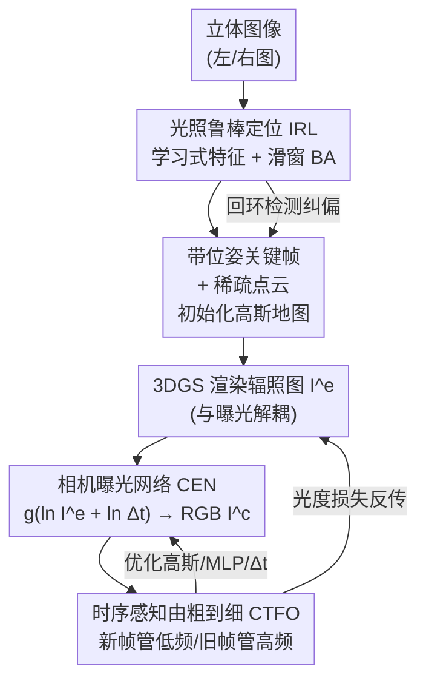

# AERGS-SLAM: Auto-Exposure-Robust Stereo 3D Gaussian Splatting SLAM

**会议**: CVPR 2026  
**论文**: [CVF Open Access](https://openaccess.thecvf.com/content/CVPR2026/html/Zhou_AERGS-SLAM_Auto-Exposure-Robust_Stereo_3D_Gaussian_Splatting_SLAM_CVPR_2026_paper.html)  
**代码**: https://github.com/zzy-2021/AERGS-SLAM  
**领域**: 3D视觉  
**关键词**: 3D高斯泼溅, SLAM, 自动曝光, 相机响应函数, 解耦定位  

## 一句话总结
针对真实场景里相机自动曝光（AE）导致的图像外观漂移破坏 3DGS 光度一致性的问题，AERGS-SLAM 用一个把"渲染辐照图"和"曝光过程"解耦的相机曝光网络（CEN）+ 学习式光照鲁棒特征定位 + 时序感知的由粗到细优化，做出第一个抗曝光变化的解耦式 3DGS SLAM，在定位精度和高保真重建上都超过现有 baseline，且渲染比 HDR-GS 快近 10 倍。

## 研究背景与动机

**领域现状**：3DGS 用各向异性高斯椭球显式表示场景几何与外观，已成为 SLAM 里主流的可微渲染表征。3DGS-based SLAM 分两类：耦合式（如 MonoGS，定位与建图共用一套高斯地图与可训练外观参数，精度高但实时性和鲁棒性差）和解耦式（如 Photo-SLAM，用传统 ORB-SLAM3 做定位、另起一线程做 3DGS 建图，保证实时）。

**现有痛点**：绝大多数 3DGS SLAM 假设输入图严格满足光度一致性。但真实相机靠 AE 算法自动调节进光量，这会引入与视角无关的外观变化，直接破坏 3DGS 赖以优化的多视图光度一致性。已有的补救各有短板：MonoGS 只用两个曝光参数调亮度，建模不了复杂 AE；SEGS-SLAM 用"视角相关的外观嵌入"去补偿，可 AE 引起的变化本质是视角无关的（来自相机曝光机制），用视角相关嵌入治标不治本；HDR-NeRF / HDR-GS 虽然用相机响应函数（CRF）建模曝光，但把"每点/每高斯辐照→颜色"的映射和渲染过程耦合在了一起。

**核心矛盾**：HDR-GS 这类方法的 CRF 作用在每个高斯上（radiance-to-color per-Gaussian），导致曝光估计和渲染过程相互纠缠——既拉低外观重建质量，又让计算量随高斯数量暴涨。与此同时，解耦式定位线程沿用 ORB 等手工特征，对 AE 引起的光照变化不鲁棒，定位精度在曝光变化场景下明显退化；且现有由粗到细加速只用固定的低→高频进度，忽略了 SLAM 关键帧的时序动态。

**本文目标**：做一个对 AE 鲁棒的解耦式 3DGS SLAM，同时拿下（a）曝光变化下可靠的定位、（b）可控曝光的高保真建图。

**切入角度**：作者观察到 AE 过程可以由 CRF 建模，而 CRF 只需作用在"每张图的辐照图"上、不必下沉到每个高斯——于是把渲染和曝光彻底解耦；定位端则换成学习式光照鲁棒特征。

**核心 idea**：用一个作用在整张辐照图上的相机曝光网络（CEN）取代 per-Gaussian 的 CRF 映射，把曝光从渲染里剥离出来，再配上光照鲁棒定位和时序感知由粗到细，统一解决"AE 破坏一致性"和"曝光变化下定位退化"两个问题。

## 方法详解

### 整体框架
AERGS-SLAM 是一个双线程解耦系统：**定位线程**用学习式光照鲁棒特征的视觉 SLAM 处理立体图像，输出带位姿的关键帧和稀疏点云，用来初始化高斯地图；**建图线程**先用 3DGS 渲染出一张与曝光无关的"辐照图（radiance map）"$\mathbf{I}^e$，再把它连同曝光时间 $\Delta t$ 喂进相机曝光网络 CEN，得到最终 RGB 图 $\mathbf{I}^c$，与真值算光度损失。这个损失同时反向优化三样东西：高斯参数、CEN 的 MLP、以及曝光时间 $\Delta t$。回环检测则在定位侧建立时序远但空间近的关键帧约束，纠正轨迹漂移、反过来再提升建图精度。三个核心贡献模块——光照鲁棒定位（IRL）、相机曝光网络（CEN）、时序感知由粗到细优化（CTFO）——分别对应"定位准、外观对、细节清"。

### 关键设计

**1. 相机曝光网络 CEN：把曝光从渲染里彻底剥离，让复杂度不再随高斯数膨胀**

这一块针对的是 HDR-GS 的"曝光-渲染耦合"痛点。3DGS 的高斯椭球由位置 $\mathbf{P}$、协方差 $\mathbf{\Sigma}$、球谐 $\mathbf{S}$（用于恢复辐照 $\mathbf{e}$）和不透明度 $\alpha$ 参数化，标准 $\alpha$-blending 渲染为 $\mathbf{I}=\sum_{i\in N}\mathbf{e}_i G'_i \alpha_i \prod_{j=1}^{i-1}(1-G'_j\alpha_j)$。HDR-GS 把 CRF 作用在每个高斯的辐照 $\mathbf{e}_i$ 上得到颜色 $\mathbf{c}_i$，曝光因此和渲染绑死。作者反其道而行：让 3DGS 只渲染出**整张图的辐照图** $\mathbf{I}^e$，再让 CEN 学 CRF 把 $\mathbf{I}^e\Delta t$ 映射到 RGB：$\mathbf{I}^c = f(\mathbf{I}^e\Delta t)$。沿用 Debevec–Malik 的 CRF 标定，假设 $f$ 单调可逆并转到对数辐照域，得到 $\ln f^{-1}(\mathbf{I}^c)=\ln\mathbf{I}^e+\ln\Delta t$；记 $g(\cdot)=(\ln f^{-1}(\cdot))^{-1}$，则

$$\mathbf{I}^c = g\!\Big(\ln\sum_{i\in N}\mathbf{e}_i G'_i \alpha_i \prod_{j=1}^{i-1}(1-G'_j\alpha_j) + \ln\Delta t\Big),$$

其中 $g(\cdot)$ 用三个独立 MLP 分别建模 RGB 三通道。这样做有两个直接好处：一是辐照图渲一次就能反复调/估曝光，不用重算渲染方程；二是算法复杂度只取决于网络结构和图像分辨率，**与高斯数量无关**——这正是它比 HDR-GS 快近 10 倍（3700 FPS vs 416 FPS）的根因。光度损失 $\mathcal{L}_c=(1-\lambda)|\mathbf{I}^c-\mathbf{I}^c_{\text{gt}}|_1+\lambda(1-\text{SSIM})$ 同时优化高斯、MLP 和 $\Delta t$；再加一项来自 HDR-NeRF 的单位曝光损失 $\mathcal{L}_u=\|g(0)-C_0\|_2^2$（$C_0$ 取像素中值，用来锁定辐照图的尺度），总损失 $\mathcal{L}=\mathcal{L}_c+\lambda_u\mathcal{L}_u$。

**2. 光照鲁棒定位 IRL：换掉手工特征，让 BA 的残差在曝光变化下不再失真**

这一块解决的是解耦式 SLAM 定位线程对 AE 不鲁棒的问题。定位用滑窗联合优化位姿和路标：给定含 $K$ 个关键帧的窗口，每帧 $F_k$ 有 $m_k$ 个 2D-3D 匹配，旋转 $\mathcal{R}$、平移 $\mathcal{T}$、路标 $\mathcal{X}$ 通过局部 BA 求解 $\arg\min\sum_k\sum_j\rho(E(k,j))$，其中重投影残差 $E(k,j)=\|\mathbf{p}_{kj}-\pi(\mathbf{R}_k\mathbf{P}_{kj}+\mathbf{t}_k)\|^2$。关键洞察是：残差的可靠性由特征匹配精度直接决定，而 AE 引起的外观变化会让 ORB 等手工特征匹配失准、$E(k,j)$ 退化，进而毁掉位姿与路标估计。作者改用 AirSLAM 的学习式光照鲁棒特征做检测与匹配（论文 Fig.3 直观对比：ORB 在光照变化场景检不稳，学习特征稳得多），让 BA 在曝光变化下也能解得准。优化后的关键帧集 $\mathcal{F}$ 和路标集 $\{\mathbf{P}_{kj}\}$ 直接当作建图的训练视角和初始高斯椭球——也就是说，定位的鲁棒性会顺着初始化一路传导到建图质量。

**3. 时序感知由粗到细优化 CTFO：按关键帧"驻留时间"分配频率监督，吃进 SLAM 的时序动态**

这一块针对现有由粗到细加速的盲点：它们对整个场景用固定的低→高频进度，忽略了 SLAM 关键帧"有新有旧、携带不同时序信息"这一事实。新关键帧场景尚未重建完整，适合监督低频结构；老关键帧信息更全，适合监督高频外观细节。作者据此设计滑窗内的图像采样策略：窗口含 $L$ 个按观测先后排序的关键帧 $\{F_l\}$，每帧有驻留时间 $N_l$，用缩放函数算下采样尺度 $\alpha_l=h(N_l)$——老帧 $N_l$ 大则 $\alpha_l$ 小（保留高频细节），新帧 $\alpha_l$ 大（做低频监督）。窗口内逐帧优化 $F_l:\arg\min\mathcal{L}(\mathbf{I}^l_r,\text{sample}(\mathbf{I}^l_{\text{gt}},\alpha_l))$，监督随滑窗动态推进。实现上 $h(N_l)=-0.065N_l+8$（$N_l\le100$），$N_l>100$ 时固定为 1.5。

### 损失函数 / 训练策略
建图总损失为光度损失 + 单位曝光损失 $\mathcal{L}=\mathcal{L}_c+\lambda_u\mathcal{L}_u$，对高斯参数、CEN 的 MLP 和曝光时间 $\Delta t$ 联合优化。关键超参：$\lambda=0.4$、$\lambda_u=0.5$、$C_0=0.73$；MLP 学习率 0.001、曝光时间学习率 0.02；定位沿用 AirSLAM 默认设置，高斯学习率沿用 Photo-SLAM。全系统用 C++ 与 LibTorch 实现，定位与建图线程并行。

## 实验关键数据

数据集：因为没有公开 SLAM 数据集专门评测 AE 鲁棒性，作者（a）对 EuRoC MAV 用 $V_{out}=AV_{int}$（$A\sim\mathcal{U}[0.5,1.5]$ 逐图随机）人工注入曝光变化；（b）用 ZED 2i 立体相机自采 6 段真实序列，并以 DROID-SLAM 轨迹作参考位姿、记录真实曝光时间。指标：定位用 ATE 的 RMSE，建图用 PSNR/SSIM/LPIPS，曝光用估计的相对曝光时间。

### 主实验

定位（RMSE↓，挑选代表性序列；'X' 为运行失败）：

| 方法 | MH01 | V103 | V203 | S4 | S5 |
|------|------|------|------|------|------|
| ORB-SLAM3 | 0.044 | X | 1.522 | 2.481 | 3.423 |
| MonoGS（耦合） | 0.089 | 0.745 | X | 16.975 | 32.227 |
| Photo-SLAM（解耦） | 0.029 | X | 1.001 | 2.500 | 3.553 |
| SEGS-SLAM（解耦） | 0.037 | 0.288 | X | 2.473 | 3.633 |
| **Ours** | **0.021** | **0.024** | **0.215** | **0.132** | **0.523** |

要点：手工特征基线（Photo-SLAM/SEGS-SLAM）在多个曝光变化序列上直接跑挂（X），AERGS-SLAM 全序列跑通且精度最优，验证了学习式光照鲁棒特征的价值；同时所有解耦方法都明显优于耦合的 MonoGS。

建图（novel view synthesis，挑选代表性序列）：

| 方法 | V102 PSNR↑ | V103 PSNR↑ | V102 SSIM↑ | V102 LPIPS↓ |
|------|------|------|------|------|
| MonoGS | 15.32 | 14.90 | 0.750 | 0.472 |
| Photo-SLAM | 11.34 | X | 0.577 | 0.588 |
| SEGS-SLAM | 14.98 | 15.51 | 0.730 | 0.327 |
| Ours + HDR-GS | 20.31 | 18.03 | 0.787 | 0.317 |
| **Ours** | **23.55** | **22.93** | **0.832** | **0.204** |

要点：CEN 全面超过无曝光机制的 Photo-SLAM、用外观嵌入的 SEGS-SLAM、用可学习曝光参数的 MonoGS；尤其把自家 CEN 换成 HDR-GS（Ours+HDR-GS 这一行）后 PSNR 明显下滑，说明"作用在辐照图上的整图 CRF"比"per-Gaussian CRF"更能处理曝光变化。曝光估计上，CEN 的估计曲线比 HDR-GS 更贴近真值，且渲染速度 3700 FPS vs HDR-GS 416 FPS（快约 9 倍）。

### 消融实验

在处理后的 EuRoC 与自采数据集上报告平均 RMSE 与平均 PSNR（行 (1) 即原始 Photo-SLAM）：

| 配置 | EuRoC PSNR↑ | EuRoC RMSE↓ | Self PSNR↑ | Self RMSE↓ |
|------|------|------|------|------|
| (1) w/o CTFO+CEN+IRL（=Photo-SLAM） | 11.76 | 0.164 | 18.32 | 1.754 |
| (2) w/o CTFO+CEN（+IRL） | 14.76 | 0.072 | 19.59 | 0.199 |
| (3) w/o CEN（+IRL+CTFO） | 15.10 | 0.051 | 19.69 | 0.214 |
| (4) w/o CTFO（+IRL+CEN） | 20.48 | 0.077 | 20.05 | 0.199 |
| (5) Ours（全） | **21.11** | **0.049** | 20.06 | 0.233 |

### 关键发现
- **IRL 是定位精度的主推手**：(1)→(2) 加上 IRL 后 EuRoC RMSE 从 0.164 砍到 0.072、自采从 1.754 砍到 0.199；且定位变准会顺带把 PSNR 抬上去（更准的位姿/初始高斯让建图更好），印证了"定位→初始化→建图"的传导链。
- **CEN 对建图质量贡献最大**：(2)→(4) 加上 CEN，EuRoC PSNR 一口气涨了 5 dB 以上（14.76→20.48）。由于 CEN/CTFO 只作用于建图线程，它们带来的 RMSE 波动不反映其真实贡献。
- **CTFO 稳定提升细节**：(2)→(3) 与 (4)→(5) 两组对照里 PSNR 都有提升，说明按驻留时间分配频率监督确实改善了高保真重建。
- **CEN 既快又准**：复杂度与高斯数解耦，使其在更高保真的同时把渲染速度拉到 HDR-GS 的近 10 倍。

## 亮点与洞察
- **"解耦"解耦得更彻底**：别人把定位/建图解耦，本文进一步把"渲染"和"曝光"也解耦——让 CRF 作用在整张辐照图而非每个高斯，一举既提质又把复杂度从 $O(\text{高斯数})$ 降到只依赖图像分辨率，这个"换作用对象"的视角很巧。
- **抓住了 AE 的本质属性**：作者明确指出 AE 引起的外观变化是"视角无关"的，因此用视角相关的外观嵌入（SEGS-SLAM）天然治不好——这个判断直接决定了用 CRF 而非 embedding 的技术路线。
- **把 SLAM 的时序结构喂进由粗到细**：用关键帧"驻留时间"区分新旧帧、分别监督低/高频，是把通用的 coarse-to-fine 思路针对 SLAM 场景做的具体化，可迁移到其他在线重建任务。
- **可控曝光是副产物也是卖点**：因为显式建了 CRF 和 $\Delta t$，系统不仅能去曝光抖动，还能反过来按指定 $\Delta t$ 渲染、甚至恢复每帧真实曝光时间。

## 局限与展望
- 论文未给出端到端的速度/显存与 baseline 的系统级对比（只报了渲染 FPS），实时整体表现需看补充材料；⚠️ 具体数值以原文/补充为准。
- AE 模拟基于线性亮度缩放 $V_{out}=AV_{int}$，与真实非线性 CRF 仍有差距，处理后的 EuRoC 结果可能偏理想化；真实泛化主要靠自采数据集佐证。
- 自采数据集的定位"真值"用 DROID-SLAM 轨迹近似而非真值位姿，绝对精度评估带有参考系误差。
- 方法依赖立体输入和学习式特征，单目/纯几何弱纹理场景下的表现未讨论。

## 相关工作与启发
- **vs HDR-GS / HDR-NeRF**：它们用 CRF 做 per-point/per-Gaussian 的辐照→颜色映射，曝光与渲染耦合；本文用 CEN 把 CRF 作用在整图辐照图上、与渲染解耦，质量更高且复杂度与高斯数无关（渲染快近 10 倍）。
- **vs MonoGS（耦合）**：MonoGS 用两个曝光参数调亮度、定位建图共用一套地图，建模不了复杂 AE 且实时性差；本文解耦双线程 + CEN，定位与建图都更鲁棒。
- **vs SEGS-SLAM / Photo-SLAM（解耦）**：Photo-SLAM 无曝光机制、SEGS-SLAM 用视角相关外观嵌入（对视角无关的 AE 治标不治本），且都沿用 ORB 手工特征；本文用学习式光照鲁棒特征 + CEN，定位全序列跑通、建图质量更高。
- **vs AirSLAM / DROID-SLAM**：这些学习式 SLAM 聚焦几何鲁棒性却忽略外观建图；本文把光照鲁棒定位与高保真可控曝光建图统一进一个 3DGS 框架。

## 评分
- 新颖性: ⭐⭐⭐⭐ 首个抗曝光的解耦式 3DGS SLAM，"渲染-曝光解耦的整图 CRF"视角扎实且实用。
- 实验充分度: ⭐⭐⭐⭐ 公开+自采双数据集、定位/建图/曝光三类指标、模块逐项消融，较完整。
- 写作质量: ⭐⭐⭐⭐ 动机链清晰、公式推导完整，图文对照到位。
- 价值: ⭐⭐⭐⭐ 直击真实相机 AE 这一普遍痛点，已开源，对落地 SLAM/重建有实用意义。

<!-- RELATED:START -->

## 相关论文

- [\[CVPR 2026\] ODGS-SLAM: Omnidirectional Gaussian Splatting SLAM](odgs-slam_omnidirectional_gaussian_splatting_slam.md)
- [\[CVPR 2026\] VarSplat: Uncertainty-aware 3D Gaussian Splatting for Robust RGB-D SLAM](varsplat_uncertainty-aware_3d_gaussian_splatting_for_robust_rgb-d_slam.md)
- [\[CVPR 2026\] Flow4DGS-SLAM: Optical Flow-Guided 4D Gaussian Splatting SLAM](flow4dgs-slam_optical_flow-guided_4d_gaussian_splatting_slam.md)
- [\[CVPR 2026\] Unblur-SLAM: Dense Neural SLAM for Blurry Inputs](unblur-slam_dense_neural_slam_for_blurry_inputs.md)
- [\[CVPR 2026\] SGAD-SLAM: Splatting Gaussians at Adjusted Depth for Better Radiance Fields in RGBD SLAM](sgad-slam_splatting_gaussians_at_adjusted_depth_for_better_radiance_fields_in_rg.md)

<!-- RELATED:END -->
