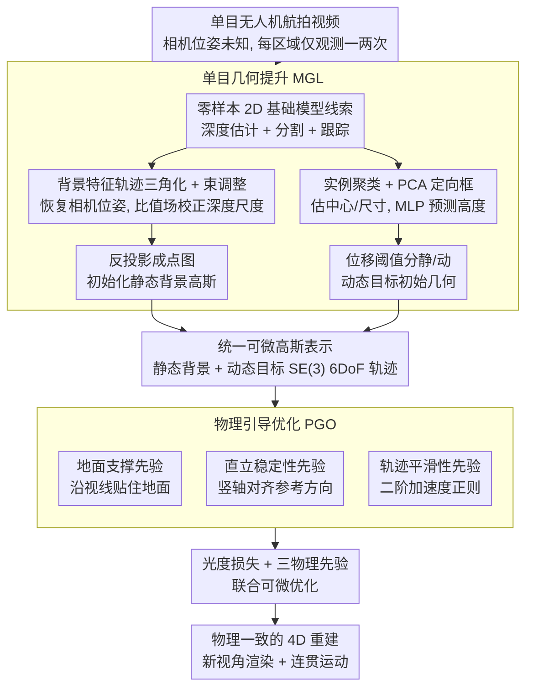

# AeroDGS: Physically Consistent Dynamic Gaussian Splatting for Single-Sequence Aerial 4D Reconstruction

**会议**: CVPR2026  
**arXiv**: [2602.22376](https://arxiv.org/abs/2602.22376)  
**作者**: Hanyang Liu, Rongjun Qin
**代码**: 待确认  
**领域**: 3D视觉  
**关键词**: 4D重建, 3D高斯泼溅, 物理先验, 无人机单目视频, 动态场景, 航拍

## 一句话总结

提出 AeroDGS，一个面向单目无人机视频的物理引导 4D 高斯泼溅框架，通过单目几何提升模块重建可靠的静态与动态几何，并引入可微的地面支撑、直立稳定性和轨迹平滑性物理先验，将模糊的图像线索转化为物理一致的运动估计，在合成与真实 UAV 场景上均优于现有方法。

## 研究背景与动机

**4D 重建的进展与瓶颈**：近年来 4D 场景重建在多个领域取得了显著进展，3D 高斯泼溅（3DGS）因其高效的可微渲染和显式场景表示，成为静态和动态场景建模的热门基础。然而，现有动态 3DGS 方法（如 Dynamic 3D Gaussians、4D-GS、Deformable 3DGS 等）主要针对多视图或受控环境中的近距离动态场景设计。

**航拍场景的独特挑战**：无人机（UAV）航拍视频具有多个特殊性质，使得现有方法直接失效：
   - **单视图捕获**：UAV 通常沿固定航线飞行，场景中每个区域仅被观测一次或极少次，缺乏多视图冗余
   - **宽广的空间范围**：航拍覆盖面积远大于室内/街景场景，背景几何复杂
   - **动态目标特征**：移动物体（如车辆、行人）在画面中空间占比小但运动幅度大（motion disparity），造成严重的运动模糊和遮挡
   - **深度歧义**：单目航拍的深度估计本身就是病态问题，距离远+俯视角使得深度线索更加稀缺

**核心病态性**：上述因素叠加导致严重的深度歧义（depth ambiguity）和不稳定的运动估计（unstable motion estimation），使单目航拍动态重建成为一个 inherently ill-posed 的问题。现有方法在此设定下要么完全失效，要么产生物理不合理的运动轨迹（如物体漂浮、穿透地面、抖动跳跃）。

**本文切入点**：利用物理世界的常识先验（物体应站在地面上、保持直立、运动轨迹应平滑）来约束和消解单目深度歧义，将不确定的图像线索转化为物理一致的动态重建。

## 方法详解

### 整体框架

AeroDGS 要解决的是单目无人机航拍视频的动态 4D 重建——这是个 inherently ill-posed 的问题：UAV 沿固定航线飞，每块区域只被看到一两次，动态目标（车、人）像素占比小却运动幅度大，单目深度本就病态，叠在一起就是严重的深度歧义和不稳定运动估计。框架的思路是“以物理补几何”：先用单目几何提升（MGL）从只有单次观测的序列里抠出可靠的静态背景和动态目标初始几何，把两者统一参数化成一套可微的 3D 高斯表示（动态目标的运动建模为 SE(3) 上的连续 6DoF 轨迹）；再用物理引导优化（PGO）把“物体该站地上、该直立、该平滑运动”这些常识写成可微损失去约束动态目标，消解单目歧义。光度重建损失与三个物理先验联合优化，静态背景与动态实体协同精炼。

### 关键设计

**1. 单目几何提升（MGL）：从只看一两次的航拍序列里抠出可靠的静态与动态几何**

航拍每块区域只被观测一两次、缺多视图冗余，传统 SfM 只能恢复稀疏地面点、还会被动态物体污染，几何初始化最先卡住。MGL 先用零样本 2D 基础模型拿粗线索：深度估计网络给每帧稠密伪深度，分割 + 跟踪给跨帧一致的可动实例 mask 与 ID。静态侧用长时背景特征轨迹做三角化 + 局部束调整（BA）恢复相机位姿，再用跟踪点上几何深度与预测深度的比值场校正单目深度尺度，反投影成点图初始化静态高斯。动态侧把同一实例的像素聚成物体点集，用 PCA 拟合定向包围框估中心与底面尺寸 $(w,\ell)$，高度 $h$ 因单视图无法测深而由预训练 MLP 预测；位移低于阈值的判为静态、其余初始化为动态候选，2D 跟踪里的 ID 跳变与遮挡则在 3D 空间靠“物体落在相机射线上的合理位置 + 轨迹平滑”来消解。这一步给后面的物理优化提供了一个虽粗但可用、且静动分离的起点。

**2. 地面支撑先验：禁止动态物体悬浮或穿透地面**

单目深度歧义最直接的恶果是动态物体在垂直方向乱漂——浮在空中或扎进地里。地面支撑先验先从静态几何推出局部地面平面，再约束动态目标沿相机视线方向贴住地面，用一个鲁棒惩罚度量物体中心与其地面投影的有符号距离：

$$\mathcal{L}_{\text{support}} = \mathbb{E}_{o,t}\big[\psi\big(\mathbf{r}_{o,t}^\top (\mathbf{c}_{o,t} - \hat{\mathbf{c}}^{g}_{o,t})\big)\big]$$

其中 $\mathbf{c}_{o,t}$ 是物体 $o$ 在 $t$ 时刻的 3D 中心，$\hat{\mathbf{c}}^{g}_{o,t}$ 是它沿视线 $\mathbf{r}_{o,t}$ 在局部地面平面上的投影，$\psi(\cdot)$ 是鲁棒惩罚；约束实际加在中心上移半个车高处，让车底沿射线贴住地面、又容忍少量重建噪声。消融里加上它直接消除了地面穿透。

**3. 直立稳定性先验：让车和人在运动中保持直立不乱翻**

光约束高度还不够，物体朝向也会因歧义乱倾乱转。直立先验约束动态目标的竖直主轴与参考方向对齐：

$$\mathcal{L}_{\text{upright}} = \mathbb{E}_{o,t}\big[1 - |\mathbf{u}_{o,t} \cdot \mathbf{v}_{o,t}|\big]$$

其中 $\mathbf{u}_{o,t}$ 是物体竖直主轴，$\mathbf{v}_{o,t}$ 是参考方向——刚体取地面法向 $\mathbf{n}_t$、非刚体取重力方向 $\mathbf{g}$。点积越接近 1 惩罚越小，于是 3-DoF 旋转被拉向“绕竖轴转动”、压住不合理的倾倒。

**4. 轨迹平滑性先验：用惯性约束抑制运动的瞬间跳跃和抖动**

逐帧独立估计的运动会出现瞬移和高频抖动，不符合惯性。平滑先验对动态目标中心轨迹施加二阶平滑约束：

$$\mathcal{L}_{\text{traj}} = \mathbb{E}_{o,t}\big[\| \mathbf{c}_{o,t+1} - 2\mathbf{c}_{o,t} + \mathbf{c}_{o,t-1} \|_2^2\big]$$

它惩罚中心轨迹的二阶差分（即加速度），允许匀速运动但压住高频抖动；还让驶出画面的物体保留运动惯性，自然移出视野而非在边界突然停住。

### 联合优化与损失函数

总损失把光度监督和三个物理先验合在一起：

$$\mathcal{L} = \lambda_{\text{photo}}\mathcal{L}_{\text{photo}} + \lambda_{\text{sup}}\mathcal{L}_{\text{support}} + \lambda_{\text{upr}}\mathcal{L}_{\text{upright}} + \lambda_{\text{traj}}\mathcal{L}_{\text{traj}}$$

其中光度项 $\mathcal{L}_{\text{photo}}$ 是标准的 L1 + SSIM 重建损失：

$$\mathcal{L}_{\text{photo}} = (1-\lambda_{\text{ssim}})\|\hat{I}_t - I_t\|_1 + \lambda_{\text{ssim}}(1 - \text{SSIM}(\hat{I}_t, I_t))$$

优化采用 warm-up 策略：先对静态/动态区域等权以稳定收敛，待静态背景收敛后再上调动态区域权重精修运动。静态和动态高斯通过可微渲染联合优化，物理先验的梯度直接更新动态高斯的位置和朝向参数。

## 实验关键数据

### 实验设置

- **数据集**：(1) 合成 UAV 场景（UAV3D 的 Town03 序列，含较多动态目标和多样运动）用于定量评估；(2) 真实 UAV 数据集——本文新建的 Aero4D，涵盖夜间路口、高空街区、白天路口等不同飞行高度和运动条件
- **评估指标**：PSNR、SSIM、LPIPS（渲染质量）；可能还包含轨迹误差等动态评估指标
- **基线方法**：现有动态 3DGS 方法（如 Deformable 3DGS、4D-GS、SC-GS 等）及传统动态 NeRF 方法

### Table 1: 合成 UAV 场景定量比较

| 方法 | 类型 | PSNR ↑ | SSIM ↑ | LPIPS ↓ | 动态目标质量 |
|------|------|--------|--------|---------|-------------|
| Deformable 3DGS | Dynamic 3DGS | 较低 | 较低 | 较高 | 运动不稳定 |
| 4D-GS | Dynamic 3DGS | 中等 | 中等 | 中等 | 部分漂浮 |
| SC-GS | Dynamic 3DGS | 中等 | 中等 | 中等 | 轨迹抖动 |
| **AeroDGS** | **Physics-guided** | **最优** | **最优** | **最优** | **物理一致** |

摘要指出 AeroDGS 在合成和真实 UAV 场景上均优于 SOTA 方法，实现了更高的重建保真度。

### Table 2: 消融实验——物理先验的贡献

| 配置 | Ground-Support | Upright | Smooth | 重建质量 | 运动合理性 |
|------|:-:|:-:|:-:|------|------|
| Baseline（无先验） | ✗ | ✗ | ✗ | 基准 | 漂浮/穿透/抖动 |
| + Ground-Support | ✓ | ✗ | ✗ | 提升 | 消除地面穿透 |
| + Upright | ✓ | ✓ | ✗ | 进一步提升 | 姿态稳定 |
| + All (AeroDGS) | ✓ | ✓ | ✓ | **最优** | **物理一致** |

三种物理先验逐步累加均带来增益，验证了每个先验的独立贡献：地面支撑解决深度歧义引起的垂直漂移，直立约束稳定朝向，轨迹平滑抑制高频抖动。

## 亮点与洞察

- **物理先验消解单目歧义的范式**：单目深度估计的歧义在航拍场景中被放大到极致，作者巧妙地将物理世界的常识（地面接触、直立、惯性）转化为可微损失函数，用物理约束补偿几何观测的不足。这个"以物理补几何"的思路比纯数据驱动的深度估计更具泛化性
- **专为航拍场景设计**：现有动态 3DGS 工作几乎都面向地面视角或室内场景，AeroDGS 首次系统性地解决了 UAV 单目视频中的 4D 重建问题，包括宽视场、小目标大运动等航拍特有挑战
- **新数据集的价值**：构建了涵盖不同飞行高度和运动条件的真实 UAV 数据集，填补了该领域的评测空白。航拍动态重建的数据稀缺一直是制约研究的瓶颈
- **模块化与可扩展性**：MGL 和 PGO 两个模块解耦设计，物理先验可方便地扩展（如加入碰撞约束、速度限制等）

## 局限与展望

- **物理先验的适用范围**：地面支撑和直立稳定性主要适用于地面车辆和行人，对于空中动态目标（如鸟群、其他无人机）这些先验可能不成立
- **地面平面估计精度**：地面支撑先验依赖准确的地面平面估计，在复杂地形（丘陵、阶梯、多层建筑）中可能需要更精细的地面模型
- **动态目标的检测与分割**：方法的上游依赖运动分割的准确性，漏检或错检将直接影响动态建模质量
- **计算开销**：物理先验增加了优化的约束项，相比纯光度优化的 3DGS 可能增加训练时间
- **遮挡与重现**：航拍中动态目标可能长时间被建筑遮挡后重新出现，单序列方法在目标重识别和轨迹接续上可能存在困难
- **夜间/恶劣天气**：摘要未提及低光照或雨雾等退化条件下的表现

## 相关工作

- **动态 3D 高斯泼溅**：Dynamic 3D Gaussians（Luiten et al.）通过跟踪高斯轨迹建模动态场景；4D-GS 用时空高斯参数化运动；Deformable 3DGS 学习变形场。这些方法在多视图设定下有效，但在单目航拍中因缺乏足够观测而退化
- **单目动态场景重建**：RoDynRF、MonST3R 等方法处理单目动态视频，但主要面向前景较大的地面视角场景。航拍中目标像素占比小、运动速度快，与地面场景有本质差异
- **航拍 3D 重建**：传统航拍重建（如 SfM+MVS）主要面向静态场景。近期有 Mega-NeRF、Switch-NeRF 等针对大规模航拍 NeRF 的工作，但不处理动态物体
- **物理先验在 3D 重建中的应用**：PAC-NeRF 引入物理仿真指导变形；PhysDreamer 学习物理属性。AeroDGS 独特之处在于将物理先验专门应用于解决航拍场景中的单目动态歧义

## 评分

- 新颖性: ⭐⭐⭐⭐ — 首次将物理一致性先验引入航拍4D高斯泼溅，地面支撑+直立+平滑三重约束的组合设计针对性强
- 实验充分度: ⭐⭐⭐⭐ — 合成+真实UAV场景双重验证，新建数据集有贡献，但完整论文数据未能获取
- 写作质量: ⭐⭐⭐⭐ — 摘要表述清晰，问题定义准确，模块命名直观
- 价值: ⭐⭐⭐⭐ — 面向无人机遥感和城市监控的实际需求，航拍动态重建是高价值应用场景

<!-- RELATED:START -->

## 相关论文

- [\[CVPR 2026\] MotionScale: Reconstructing Appearance, Geometry, and Motion of Dynamic Scenes with Scalable 4D Gaussian Splatting](motionscale_reconstructing_appearance_geometry_and_motion_of_dynamic_scenes_with.md)
- [\[CVPR 2026\] Mark4D: Temporally-Consistent Watermarking for 4D Gaussian Splatting](mark4d_temporally-consistent_watermarking_for_4d_gaussian_splatting.md)
- [\[CVPR 2026\] RetimeGS: Continuous-Time Reconstruction of 4D Gaussian Splatting](retimegs_continuous-time_reconstruction_of_4d_gaussian_splatting.md)
- [\[CVPR 2026\] PhysIR-Splat: Physically Consistent Thermal Infrared Radiative Transfer in 3D Gaussian Splatting](physir-splat_physically_consistent_thermal_infrared_radiative_transfer_in_3d_gau.md)
- [\[CVPR 2026\] InstantHDR: Single-forward Gaussian Splatting for High Dynamic Range 3D Reconstruction](instanthdr_singleforward_gaussian_splatting_for_hi.md)

<!-- RELATED:END -->
