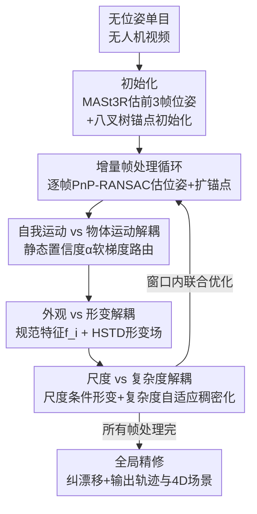

# AeroGS: Scale-Aware Gaussian Splatting for Pose-Free Dynamic UAV Scene Reconstruction

**会议**: CVPR 2026  
**论文**: [CVF Open Access](https://openaccess.thecvf.com/content/CVPR2026/html/Li_AeroGS_Scale-Aware_Gaussian_Splatting_for_Pose-Free_Dynamic_UAV_Scene_Reconstruction_CVPR_2026_paper.html)  
**代码**: 未公开  
**领域**: 3D视觉  
**关键词**: 高斯泼溅, 无位姿重建, 动态场景, 无人机视频, 尺度感知  

## 一句话总结
AeroGS 用一种"尺度感知时空锚点"（S2A-Anchors）从无位姿的单目无人机视频里，**同时**估计相机轨迹并重建含运动物体的动态 4D 场景，靠三套解耦机制（自我运动 vs 物体运动、外观 vs 形变、尺度 vs 复杂度）稳住联合优化，在 VisDrone/UAVDT/KITTI 上把渲染 PSNR 和轨迹精度都刷到了 SOTA。

## 研究背景与动机
**领域现状**：从单目视频重建动态 3D 场景是 VR/AR、机器人感知的核心问题。无人机（UAV）视角覆盖面广、特别适合大场景重建，但 3D Gaussian Splatting（3DGS）默认要先有准确的相机位姿（通常来自 SfM/COLMAP）。

**现有痛点**：无人机素材有三个要命的特性。其一，单目拍摄对深度/几何严重欠约束；其二，画面里有大量小运动体（行人、车辆），常常只占几个像素，造成跨越数量级的**极端尺度变化**——高空粗尺度、低空细尺度；其三，长航迹、低纹理、卷帘快门让 SfM/SLAM 频繁失败，位姿漂移或干脆解不出来。

**核心矛盾**：动态场景建模**需要**准确位姿，而恢复位姿**又需要**场景是静态/刚性的。现有方法只能二选一——要么做"无位姿但假设场景静态"的重建（把运动物体当 outlier 抛掉，污染位姿和几何），要么做"已知位姿的动态重建"（一旦 SfM 失败就用不了）。更深层的麻烦是：单目视频里一个动态物体的像素位移，是它自身运动和相机自我运动（ego-motion）的**混合**，两者纠缠在一起，优化器会把运动错误归因、收敛到退化解。

**本文目标**：在**不给位姿**的前提下，从长无人机视频里联合解出相机轨迹 + 同时重建刚性与非刚性动态。

**切入角度**：作者认为问题的本质是三组量被耦合在了一起——自我运动 / 物体运动、静态外观 / 时变形变、空间尺度 / 形变复杂度。只要把它们系统地拆开，联合优化就能稳下来。

**核心 idea**：提出尺度感知时空锚点 S2A-Anchors 作为统一基元，用三套解耦机制把上述三组耦合量分别拆开，在一个增量式滑动窗口里把位姿和动态场景一起优化。

## 方法详解

### 整体框架
AeroGS 的输入是一段无位姿的单目无人机视频 $\{I_t\}_{t=1}^{T}$，输出是相机轨迹 $\{P_t\}$ 加一个高保真的 4D 动态场景。它建在八叉树锚点（octree anchor）之上，核心基元是 S2A-Anchor：每个锚点 $A_i$ 携带一个时间不变的 32 维规范特征 $f_i$（编码外观+几何）、运动参数 $\theta_{dyn,i}$（参数化速度 $v_i(t)$）、一个可学习的静态置信度 $\alpha_i\in[0,1]$，以及它在八叉树上的尺度 $s_i$。

整个流程是**增量式**逐帧处理，分三个阶段：（i）**初始化**——对前 $N_{init}=3$ 帧用 MASt3R 估位姿，并从它的点云+深度先验初始化 S2A-Anchors；（ii）**增量帧处理循环**——对每个新帧 $I_t$ 先用 PnP-RANSAC 估位姿再光度精修，扩展锚点，并在一个局部滑动窗口 $W$ 内联合优化位姿与场景，这一步里三套解耦机制全部生效；（iii）**全局精修**——处理完所有帧后对全部位姿和锚点做一次全局优化，纠正漂移、保证一致性。三套解耦机制最终由一个联合损失统一优化。

### 关键设计

**1. 自我运动 vs 物体运动解耦：用静态置信度做"软梯度路由"**

这是全篇的地基，直接对付"像素位移把相机运动和物体运动搅在一起"这个根本痛点。作者给每个锚点配一个轻量 Anchor Filter 网络，输入规范特征、位置编码和时间编码，预测一个静态置信度 $\alpha_i = \mathrm{MLP}_{filter}(f_i, \gamma(\mu_i), \gamma(t))$，让模型自己学"这个锚点是不是静态背景"。

关键在于**软梯度路由**：位姿只该被静态结构约束，于是把重建损失 $L_{recon}=L_{photo}+\lambda_d L_d$ 按 $\alpha_i$ 加权得到静态损失

$$L_{static}=\sum_{t\in W}\sum_{i\in A}\alpha_i\cdot L_{recon}(t,A_i),$$

这样位姿梯度 $\nabla_{P_t}L_{static}=\sum_i \alpha_i\cdot\nabla_{P_t}L_{recon}$ 几乎只由高置信度（静态）锚点主导，得到"无动态污染"的位姿梯度。反过来，动态锚点的 3D 运动流 $v_i(t)$ 用自监督的**时间循环一致性损失**约束：把规范位置 $\mu_i$ 用速度前推 $\Delta t$、再用新位置查到的速度回推，惩罚回不到原点的误差

$$L_{cycle,i}(t,\Delta t)=\bigl\lVert \mu_i-(\mu_i+v_i(t)\Delta t - v'_{pred}\Delta t)\bigr\rVert_2^2,$$

按 $(1-\alpha_i)$ 加权成 $L_{motion}$，且其梯度从位姿变量上 detach。再加一个熵正则 $L_{entropy}=\mathbb{E}_i[\alpha_i(1-\alpha_i)]$ 逼 $\alpha_i$ 走向二值化（非黑即白的静/动判定）。这套"谁该管位姿、谁该管运动"的分工，正是联合优化不退化的核心——朴素地把无位姿位姿估计和 4DGS 拼起来（CF-3DGS+4DGS）会直接优化失败。

**2. 外观 vs 形变解耦：规范特征只管外观，时变全交给 HSTD 形变场**

针对的痛点是：现有方法在特征层把静态和动态信息混在一起，动态形变会"污染"静态外观的学习，也限制了动态表达力。AeroGS 在**表示层**彻底分开二者——规范特征 $f_i$ 只负责外观，经一个轻量 MLP 解码器映射成逐帧高斯属性 $\{c_t,o_t,s_t,q_t\}=D(f_i,t)$（颜色/不透明度/尺度/旋转），所有时间依赖一律建模成空间形变。

时变形变 $\Delta\mu_i(t)$ 由 **HSTD（Hierarchical Spatio-Temporal Deformation，分层时空形变）** 模块预测，它在设计 1 给出的速度 $v_i$ 这个粗运动先验的引导下学高频形变，由三件套构成：用 B-spline 时间基 $B(t_{norm})$ 避免频率编码退化；用 $L$ 级多尺度控制点，每级 $\Delta\mu^{(l)}_{base}(t)=\sum_j b_j(t_{norm})\cdot p^{(l)}_{i,j}$ 聚合成基形变；以及运动引导调制——调制网络 $F_{mod}$ 由 $(f_i,v_i)$ 预测 $m_i\in[-1,1]^3$ 去缩放基形变 $\Delta\mu_{mod}(t)=\Delta\mu_{base}(t)\odot(1+\lambda_{mod}m_i)$，让运动先验给高频形变"开闸/关闸"、防止过拟合。最后用静态置信度做**可微软混合**得到最终锚点位置 $\tilde\mu_i(t)=\mu_i+(1-\alpha_i)\cdot\Delta\mu_{mod}(t)$：静态锚点（$\alpha_i\to1$）几乎不动，动态锚点（$\alpha_i\to0$）完全采用形变后位置。这样就实现了"监督层（设计 1 的分损失）+ 表示层（这里的特征-运动分离）"的双层解耦。

**3. 尺度 vs 复杂度解耦：尺度条件形变 + 复杂度自适应稠密化**

无人机尺度跨越数量级，而 HSTD 网络容量是固定的，一刀切会出两个问题：粗尺度锚点容量过剩、把噪声拟合成虚假的非刚性运动；细尺度锚点容量不足、抓不住精细形变。作者用两个互补机制解决。**尺度条件形变**——每个锚点在八叉树第 $l_i$ 层的尺度 $s_i=2^{-l_i}\cdot s_{root}$，把控制点网络改成尺度感知 $P^{(l)}_i=F^{(l)}_{ctrl}(f_i,\gamma(t_{norm}),\gamma(s_i))$，于是网络能在粗尺度隐式压制非刚性分量、在细尺度释放全部容量（自上而下约束形变先验）。**复杂度自适应稠密化**——即便同一尺度，静/动区域所需复杂度也天差地别，于是用时间形变方差定义运动复杂度

$$\mathrm{complexity}(A_i)=\frac{1}{|W_t|}\sum_{t\in W_t}\bigl\lVert\Delta\mu_{mod,i}(t)-\overline{\Delta\mu}_{mod,i}\bigr\rVert_2^2,$$

一旦超过阈值 $\tau_{complex}$ 就在 $l_i+1$ 层 spawn 八个子锚点（继承父锚的 $f_i,\alpha_i$，但重置动态参数学精细残差形变，自下而上按观测到的运动分配容量）。两者协同：尺度条件管"先验该多大"，复杂度稠密化管"容量往哪堆"，从而既高效覆盖巨大尺度跨度，又不在粗尺度过拟合。

### 损失函数 / 训练策略
端到端联合损失统一三套机制：

$$L_{total}=L_{static}+\lambda_{motion}L_{motion}+\lambda_{entropy}L_{entropy}+\lambda_{sparse}L_{sparse},$$

其中稀疏损失 $L_{sparse}=\sum_i(1-\alpha_i)$ 鼓励尽量少用动态锚点、促成简约表示。增量循环里该损失在局部窗口内施加，全局阶段则全局施加。实现上基于 LongSplat，每个 S2A-Anchor 32 维规范特征，HSTD 用 3 级、每级 5 个 B-spline 控制点；$N_{init}=3$，局部优化 $K_\ell=400$ 迭代、每 $N_{sync}=10$ 帧全局同步 $K_g=900$ 迭代、最终精修 $K_r=10000$ 迭代；权重 $\lambda_{motion}=0.1,\lambda_{entropy}=0.1,\lambda_d=0.01,\lambda_{sparse}=0.3$，单张 RTX 3090。最终精修阶段把 base 速度梯度 detach（$\theta_{dyn,i}$ 固定），$L_{motion}$ 改为基于 HSTD 预测位置 $\tilde\mu_i(t)$ 前后向流的循环一致性损失。

## 实验关键数据

### 主实验
四个数据集：VisDrone（8 段城市无人机序列，COLMAP 位姿）、UAVDT（6 段，PI3 位姿）、Au-air（多高度航拍）、KITTI Odometry（4 段驾驶序列，做轨迹精度）。对比含**已知位姿**的动态重建方法（4DGS/Grid4D/PVG/DeSiRe-GS/AD-GS 等）和**无位姿**方法（CF-3DGS/HT-3DGS/LongSplat）。AeroGS 全程 Preq=×（不需要输入位姿）。

| 数据集 | 指标 | AeroGS | 之前最强 | 提升 |
|--------|------|--------|----------|------|
| VisDrone 重建 | PSNR↑ | **29.40** | DeSiRe-GS 28.31 | +1.09 dB |
| VisDrone NVS | PSNR↑ | **28.56** | DeSiRe-GS 26.99 | +1.57 dB |
| UAVDT 重建 | PSNR↑ | **27.77** | PVG 25.06 | +2.71 dB |
| UAVDT NVS | PSNR↑ | **26.07** | DeSiRe-GS 23.91 | +2.16 dB |
| UAVDT NVS | SSIM↑ / LPIPS↓ | **0.786 / 0.223** | 0.700 / 0.306 | +0.095 / −0.083 |

KITTI 上联合考核渲染+轨迹（ATE/RPE）：

| 方法 | PSNR↑ | LPIPS↓ | RPEt↓ | RPEr↓ | ATE↓ |
|------|-------|--------|-------|-------|------|
| CF-3DGS | 21.76 | 0.239 | 1.790 | 2.824 | 0.017 |
| CF-3DGS+4DGS（朴素拼接） | 19.03 | 0.410 | 1.333 | 5.306 | 0.060 |
| LongSplat | 23.43 | 0.220 | 0.512 | 1.966 | 0.014 |
| **AeroGS** | **26.10** | **0.139** | **0.143** | **0.292** | **0.006** |

相比 LongSplat，ATE 降 57%、RPEt 降 72%、PSNR 升 +2.67 dB。朴素拼接 CF-3DGS+4DGS 直接优化失败（PSNR 跌到 19.03、ATE 涨到 0.060），印证"显式解耦对稳定优化是必需的"。

### 消融实验
损失消融（Au-air，逐项累加）：

| 配置 | PSNR↑ | SSIM↑ | LPIPS↓ | 说明 |
|------|-------|-------|--------|------|
| 仅 $L_{static}$ | 28.14 | 0.821 | 0.263 | 光度基线 |
| + $L_{motion}$ | 30.21 | 0.862 | 0.192 | 动态锚点关键监督，+2.07 dB |
| + $L_{entropy}$ | 30.83 | 0.874 | 0.186 | 静/动判定更干净二值 |
| + $L_{sparse}$（full） | **31.35** | **0.896** | **0.175** | 简约表示防过拟合 |

模块消融（UAVDT，逐模块累加）：

| 配置 | PSNR↑ | SSIM↑ | LPIPS↓ | 说明 |
|------|-------|-------|--------|------|
| 仅 Ego-Obj 解耦 | 24.59 | 0.824 | 0.216 | 分开相机/物体运动，但动态物体不够清晰 |
| + HSTD（外观-形变） | 27.37 | 0.841 | 0.198 | 几何保真大涨 |
| + Scale-Comp（尺度-复杂度） | **27.77** | **0.852** | **0.185** | 完整模型，压制粗尺度过拟合 |

> ⚠️ 模块消融表原文三行的 Ego-Obj/HSTD/Scale-Comp 勾选与数值对应关系（24.59→26.16→27.37→27.77）在文本中略有错位，此处按"逐步累加、full=27.77"的语义整理，具体以原文 Tab.4 为准。

### 关键发现
- **三套解耦缺一不可、且贡献递进**：Ego-Obj 解决"动静混淆"这个最底层问题（不解耦直接优化失败）；HSTD（外观-形变）贡献最大的单步渲染提升（UAVDT +2.78 dB）；Scale-Comp 在尺度变化剧烈的高/低空场景收益尤其明显（UAVDT 的总提升远大于 VisDrone）。
- **无位姿反超有位姿**：AeroGS 不用 GT 位姿，却在所有数据集上超过需要 GT 位姿的 DeSiRe-GS/PVG，说明联合优化能有效缓解位姿不确定性、而非被它拖累。
- **静/动分解干净**：可视化里 PVG/DeSiRe-GS 出现动态"鬼影"（运动车辆渗进静态层）和静态元素（停车线）误入动态层，AeroGS 的软梯度路由能干净隔离，直接证明自我/物体运动解耦成立。

## 亮点与洞察
- **软梯度路由（soft gradient routing）**：用一个可学习标量 $\alpha_i$ 同时充当"静态分类器"和"梯度阀门"——位姿梯度按 $\alpha_i$ 加权、运动损失按 $(1-\alpha_i)$ 加权且互相 detach，一个置信度优雅地把"谁约束位姿、谁约束运动"分开，是这套联合优化能稳住的关键，思路可迁移到任何"位姿×动态"耦合的重建任务。
- **3D 流的自监督循环一致性**：不依赖外部光流标注，靠"前推-回推应回到原点"在 3D 锚点速度上自监督，把 2D 诱导光流的思想搬到了 3D 锚点速度场。
- **尺度当成一等公民**：把八叉树层级换算成的物理尺度 $\gamma(s_i)$ 直接喂进形变网络，让网络在粗尺度自动"克制"、细尺度"放开"，对无人机这种数量级尺度跨越特别对症；再叠加按运动复杂度方差触发的稠密化，形成"自上而下约束 + 自下而上分配容量"的双向自适应。

## 局限与展望
- 作者承认：假设运动相对平滑，**极快动态或高度杂乱场景**会掉点；高斯泼溅本身计算开销大，妨碍实时/大规模部署。
- 自己发现：方法依赖 MASt3R 做初始化、PnP-RANSAC 估增量位姿，前 3 帧或低纹理段若初始化失败，后续增量优化可能整体漂移（论文未单独消融初始化鲁棒性）。
- 改进思路：把全局精修的 10000 次迭代做成可中断/在线版本，朝作者展望的实时方向走；或引入语义先验辅助 Anchor Filter，降低对纯外观判静/动的依赖。

## 相关工作与启发
- **vs 无位姿静态 3DGS（CF-3DGS / LongSplat / HT-3DGS）**：它们联合优化位姿+静态几何，但**假设场景刚性**，把运动物体当 outlier，导致位姿和几何双双偏掉。AeroGS 用静态置信度显式建模动态、软路由保护位姿，在 KITTI 上 ATE/RPE 大幅领先 LongSplat。
- **vs 已知位姿动态重建（4DGS / PVG / DeSiRe-GS）**：它们建模复杂形变能拿高保真，但**强依赖 SfM/SLAM 位姿**，在低纹理长基线无人机序列里 SfM 一失败就用不了。AeroGS 不需要输入位姿，反而在 VisDrone/UAVDT 上超过这些有位姿基线。
- **vs 动态 SLAM（如 ProDyG）**：实时跟踪+运动分离，但多依赖 RGB-D/短基线特征匹配，渲染保真度和大场景鲁棒性受限；AeroGS 走离线高保真路线，专攻长无位姿无人机序列。
- **vs 朴素拼接（CF-3DGS+4DGS）**：把无位姿位姿估计和动态重建简单组合会直接优化失败（PSNR 19.03、ATE 0.060），反衬出本文"显式三重解耦"的必要性。

## 评分
- 新颖性: ⭐⭐⭐⭐⭐ 首个从无位姿无人机视频联合估轨迹+重建刚性/非刚性动态的框架，三重解耦设计自洽
- 实验充分度: ⭐⭐⭐⭐ 四数据集、渲染+轨迹双维度、双消融齐全，但缺初始化鲁棒性与运行时/速度的量化分析
- 写作质量: ⭐⭐⭐⭐ 动机-方法-实验逻辑清晰，仅模块消融表数值对应略有错位
- 价值: ⭐⭐⭐⭐⭐ 直击无人机/航拍重建的位姿+动态痛点，软梯度路由与尺度感知设计可迁移性强

<!-- RELATED:START -->

## 相关论文

- [\[CVPR 2026\] E2EGS: Event-to-Edge Gaussian Splatting for Pose-Free 3D Reconstruction](e2egs_event-to-edge_gaussian_splatting_for_pose-free_3d_reconstruction.md)
- [\[CVPR 2026\] ManifoldNeuS: Manifold-aware View Optimizability for Pose-Free Neural Surface Reconstruction](manifoldneus_manifold-aware_view_optimizability_for_pose-free_neural_surface_rec.md)
- [\[CVPR 2026\] Point4Cast: Streaming Dynamic Scene Reconstruction and Forecasting](point4cast_streaming_dynamic_scene_reconstruction_and_forecasting.md)
- [\[CVPR 2026\] MotionScale: Reconstructing Appearance, Geometry, and Motion of Dynamic Scenes with Scalable 4D Gaussian Splatting](motionscale_reconstructing_appearance_geometry_and_motion_of_dynamic_scenes_with.md)
- [\[CVPR 2026\] $L^{2}DGS$: Low-Light Dynamic Gaussian Splatting](l2dgs_low-light_dynamic_gaussian_splatting.md)

<!-- RELATED:END -->
