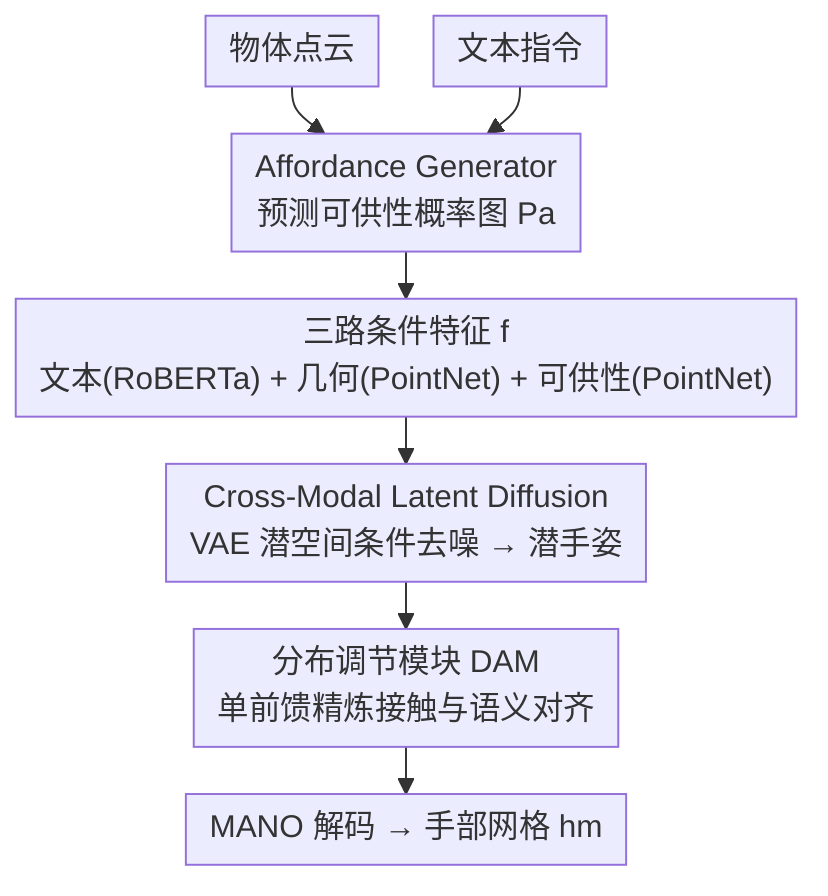

# AffordGrasp: Cross-Modal Diffusion for Affordance-Aware Grasp Synthesis

**会议**: CVPR 2026  
**arXiv**: [2603.08021](https://arxiv.org/abs/2603.08021)  
**代码**: [Project Page](https://affordgrasp.github.io/)  
**领域**: 3D Vision / Hand-Object Interaction  
**关键词**: 抓取生成, 可供性, 跨模态扩散, 手物交互, 语义指令

## 一句话总结
AffordGrasp 提出了一个基于扩散的跨模态框架，通过可供性引导的潜空间扩散和分布调节模块（DAM），从文本指令和物体点云生成物理可行且语义一致的人手抓取姿态，在四个基准上显著超越现有方法。

## 研究背景与动机
**领域现状**：语义抓取生成旨在根据用户指令合成与物体交互的手部姿态，是 AR/VR 和具身智能的关键能力。

**现有痛点**：
   - 3D 几何与自然语言之间存在巨大的模态鸿沟，直接融合难以实现细粒度的几何-语义对齐（如区分"握把手"和"握杯口"）；
   - 现有扩散管线缺乏显式的空间和语义约束，常产生物理不合理或语义不一致的抓取。

**核心矛盾**：如何在保证物理可行性的同时，让生成的抓取姿态精确对应语言指令所描述的交互意图？

**本文切入角度**：引入物体可供性（affordance）作为跨模态桥梁，将语言语义与3D几何通过可供性区域连接，辅以分布调节模块在采样后强制物理和语义一致性。

**核心 idea**：可供性驱动的潜空间扩散 + 分布调节模块 = 物理可行 + 语义精确。

## 方法详解

### 整体框架
这篇论文要解决的是「按指令抓物体」：给一个物体点云和一句话（如"握住杯子的把手"），生成一只物理上不穿模、语义上抓对地方的人手姿态。难点在于 3D 几何和自然语言之间隔着一条模态鸿沟，硬把两者塞进一个扩散模型，往往既抓不准位置又会穿透物体。

AffordGrasp 的思路是先把这条鸿沟拆成两段：用一个 Affordance Generator 把"该抓哪里"从语言里先解出来，落成物体表面上的一张可供性概率图 $P_a$；再让一个跨模态潜空间扩散模型在手部姿态的潜码上做条件生成，条件就是文本、物体几何、可供性这三路特征 $f = \{f_I, f_{pg}, f_{pa}\}$；最后用一个分布调节模块（DAM）对扩散采出的潜码做一次轻量精炼，补上扩散输出在接触和语义上没对齐的部分，再经 MANO 层解码成手部网格 $h_m$。

### 关键设计

**1. Affordance Generator：把"抓哪里"从语言里先解出来，再喂给生成模型**

直接做语言到手姿的端到端映射，模型既要理解"把手"指的是哪块几何、又要同时摆出合理手型，跨模态对齐的负担太重。AffordGrasp 的做法是先只回答一个更窄的问题——指令对应物体表面的哪些点。生成器基于 LASO 架构，预测点云上每个点与当前指令相关的可供性概率，得到一张可供性图 $P_a$ 作为显式的中间表示。训练上先在带标注的 AffordPose 上初始化，再通过自训练循环把伪标签扩展到本身缺可供性标注的 OakInk 和 GRAB，缓解标注稀缺；正负样本严重不平衡（可供区只占物体一小块），所以用 Focal Loss 加 Dice Loss 联合监督：$\mathcal{L} = \mathcal{L}_{\text{focal}} + \lambda_1 \mathcal{L}_{\text{dice}}$。这样一来，"在哪里抓"的空间信息被提前从语言里剥离出来，后面的扩散模型只需在已知交互区域的前提下决定具体手型，跨模态融合的难度大幅下降。

**2. Cross-Modal Latent Diffusion Model：在压缩过的手姿潜空间里做条件扩散，而不是在原始顶点上**

人手网格有 778 个顶点（$h_v^{gt} \in \mathbb{R}^{778 \times 3}$），直接在这个高维顶点空间上跑扩散既低效，又容易破坏手指之间的结构约束。AffordGrasp 先用一个预训练 VAE 把手部网格压成紧凑潜码 $h_z$，扩散全程在潜空间进行。前向过程按标准方式加噪：

$$z^t = \sqrt{\alpha_t}\, z^0 + \sqrt{1 - \alpha_t}\, \epsilon$$

条件 U-Net 学习从带噪潜码预测噪声，损失为 $L_{LDM} = \mathbb{E}\|\epsilon - \epsilon_\theta(z^t, f, t)\|_2^2$；条件特征 $f = \{f_I, f_{pg}, f_{pa}\}$ 中，文本 $f_I$ 由 RoBERTa 编码，物体几何 $f_{pg}$ 和可供性图 $f_{pa}$ 各由一个独立 PointNet 编码。把生成放到潜空间，既省算力，又因为 VAE 已经学到了合理手型的流形，采样结果更容易保持手部姿态的空间结构。

**3. Distribution Adjustment Module (DAM)：扩散采完不直接出手，先做一次单前馈的物理与语义校正**

扩散模型的去噪输出在整体姿态上合理，但在接触约束（指尖是否真的贴住物体）和语义细节（是否精确对应指令）上常常差一口气；若靠基于梯度的采样修正去补，每步都要反传，开销很大。DAM 改成在采样末端做一次前馈精炼。它先从噪声预测反解出潜手部表示：

$$\hat{h}_z = \frac{1}{\sqrt{\alpha_t}}\left(z^t - \sqrt{1-\alpha_t}\,\epsilon_\theta(z^t, f, t)\right)$$

再把物体几何与可供性两路空间特征融进来 $f_{\text{spatial}} = \text{Norm}(f_{pg} + f_{pa}) + \hat{h}_z$，用多头注意力让它和指令特征交互对齐 $f_{\text{align}} = \text{Attention}(f_I, f_{\text{spatial}}, f_{\text{spatial}}) + f_I$，最后经一次带残差的 MLP 输出精炼潜码 $\tilde{h}_z = \text{Norm}(\text{MLP}(f_{\text{align}}) + \hat{h}_z)$。两处残差让 DAM 只在扩散结果上做"微调"而非推倒重来，既保住了扩散输出的主体结构，又把接触和语义这两块短板在单次前馈里补齐——消融里去掉 DAM，语义准确率从 80.08% 掉到 79.11%，正印证了它的修正作用。

### 一个完整示例：握住马克杯的把手

以指令"hold the mug by the handle"配一只马克杯的点云为例走一遍：Affordance Generator 先在杯身点云上点亮把手区域，输出的 $P_a$ 把概率质量集中在杯柄那一圈，而不是杯口或杯底；这张图连同文本和整杯几何一起编码成三路条件 $f$。扩散模型从随机潜码出发，在 $f$ 的引导下逐步去噪到一个潜手姿 $\hat{h}_z$——此时手大致探向把手，但可能指尖略微穿进杯壁、或抓握点偏向杯身。DAM 接手：把把手区域的空间特征与指令"by the handle"做注意力对齐，把潜码往"贴住杯柄、不穿模"的方向拉一下，输出 $\tilde{h}_z$。最后 MANO 解码成手部网格，得到一只手指环住杯柄、与杯壁接触而不穿透的抓取。

### 损失函数 / 训练策略
两阶段训练：先训练扩散模型（此时冻结 DAM），再反过来冻结扩散模型、单独训练 DAM。DAM 阶段的损失为 $\mathcal{L} = \mathcal{L}_{\text{recon}}(h_v, h_p, h_v^{gt}, h_p^{gt}) + \lambda_2 \mathcal{L}_{\text{physical}}(h_m, h_m^{gt}, P_g)$，其中重建损失同时约束 MANO 参数和顶点对齐，物理损失则惩罚手与物体的穿透以及接触不一致。

## 实验关键数据

### 主实验

| 数据集 | 方法 | 穿透体积↓ | 位移↓ | 接触率↑ | 语义准确率↑ |
|--------|------|----------|-------|---------|-----------|
| OakInk | FastGrasp | 7.88 | 2.27 | 88% | 78.05% |
| OakInk | **AffordGrasp** | **7.31** | **1.43** | **98%** | **80.08%** |
| GRAB | FastGrasp | 4.61 | 1.20 | 94% | 61.50% |
| GRAB | **AffordGrasp** | **3.06** | 1.66 | **94%** | **62.50%** |
| HO-3D (OOD) | D-VQVAE | 13.12 | 2.33 | 95% | 64.00% |
| HO-3D (OOD) | **AffordGrasp** | **7.38** | **2.33** | **97%** | **72.00%** |

### 消融实验

| 配置 | 穿透体积↓ | 接触率↑ | 语义准确率↑ | 说明 |
|------|----------|---------|-----------|------|
| w/o affordance | 8.27 | 97% | 76.56% | 去掉可供性，穿透增加 |
| w/o DAM | 8.12 | 97% | 79.11% | 去掉 DAM，语义略降 |
| 完整管线 | **7.31** | **98%** | **80.08%** | 两个模块协同最优 |

### 关键发现
- 跨域泛化能力突出：在 GRAB 上训练的模型在 HO-3D 和 AffordPose 上零样本表现远超基线
- 可供性区域有效降低了穿透体积（物体-手碰撞减少），证明空间引导的重要性
- DAM 的双残差机制保留了扩散输出的核心结构，同时有效修正局部细节

## 亮点与洞察
- **可供性作为跨模态桥梁**的思路简洁有效，避免了 VLM 多轮推理的不稳定性
- 自训练循环标注管线解决了可供性标注数据稀缺的问题
- DAM 作为轻量后处理模块，可推广到其他条件生成任务

## 局限与展望
- 未显式建模物理先验（重力、摩擦），某些真实场景效果可能受限
- AffordPose 因缺少 MANO 参数被排除在训练外，限制了物体多样性
- 推理阶段仍需多步 DDIM 采样，实时性有待提升

## 相关工作与启发
- 与 SemGrasp 相比，避免了 2D 投影遮挡问题，直接在 3D 空间操作
- DAM 的思路类似于 ControlNet 的后处理精炼，但无需重训练基础模型

## 评分
- 新颖性: ⭐⭐⭐⭐ 可供性引导+DAM 的组合设计精巧
- 实验充分度: ⭐⭐⭐⭐⭐ 四个数据集+域内域外+丰富消融+物理仿真验证
- 写作质量: ⭐⭐⭐⭐ 结构清晰，图表质量高
- 价值: ⭐⭐⭐⭐ 对具身智能中的语义抓取有实际推动作用

<!-- RELATED:START -->

## 相关论文

- [\[CVPR 2026\] HAMMER: Harnessing MLLMs via Cross-Modal Integration for Intention-Driven 3D Affordance Grounding](hammer_harnessing_mllms_via_cross-modal_integration_for_intention-driven_3d_affo.md)
- [\[CVPR 2026\] Geometry-Aware Cross-Modal Graph Alignment for Referring Segmentation in 3D Gaussian Splatting](geometry-aware_cross-modal_graph_alignment_for_referring_segmentation_in_3d_gaus.md)
- [\[CVPR 2026\] Bidirectional Cross-Modal Prompting for Event-Frame Asymmetric Stereo](bidirectional_cross-modal_prompting_for_event-frame_asymmetric_stereo.md)
- [\[CVPR 2025\] GEAL: Generalizable 3D Affordance Learning with Cross-Modal Consistency](../../CVPR2025/3d_vision/geal_generalizable_3d_affordance_learning_with_cross-modal_consistency.md)
- [\[CVPR 2026\] Bi-CMPStereo: Bidirectional Cross-Modal Prompting for Event-Frame Asymmetric Stereo](bi_cmpstereo_bidirectional_cross_modal_prompting_for_event_frame_asymmetric_stereo.md)

<!-- RELATED:END -->
