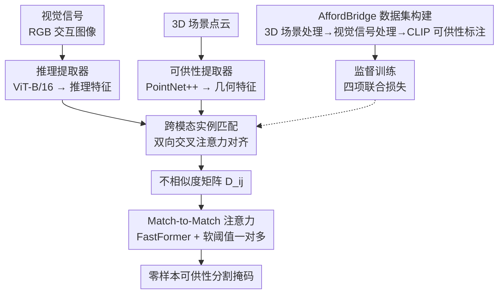

# AffordMatcher: Affordance Learning in 3D Scenes from Visual Signifiers

**会议**: CVPR 2026  
**arXiv**: [2603.27970](https://arxiv.org/abs/2603.27970)  
**代码**: [Project Page](https://aioz-ai.github.io/AffordMatcher/)  
**领域**: 3D Vision / Scene Understanding  
**关键词**: 可供性学习, 3D 场景理解, 视觉信号, 跨模态对齐, 零样本分割

## 一句话总结
AffordMatcher 提出了一种从视觉信号（RGB 图像中的人物交互）定位 3D 场景中可供性区域的方法，通过大规模 AffordBridge 数据集和基于不相似度矩阵的 Match-to-Match 注意力机制，在零样本可供性分割上达到 53.4 mAP，超越次优方法 7.8 个点。

## 研究背景与动机
**领域现状**：可供性学习旨在识别环境中的"交互机会"（Gibson），是机器人操作、视觉导航和 AR 的基础能力。

**现有痛点**：
   - 现有方法主要聚焦单模态（纯图像或纯点云），跨模态可供性学习缺乏统一方案；
   - 图像和点云之间特征分布差异大，跨模态匹配困难；
   - 现有数据集规模小、模态有限（大多 <40K 样本，<25 种动作），无法训练端到端的跨模态模型。

**核心矛盾**：如何从 2D 视觉信号（如"一个人推门"的图像）精确定位 3D 场景中的可操作区域？

**本文切入角度**：构建大规模 2D-3D 配对可供性数据集 AffordBridge（291K 标注），设计跨模态语义对应匹配方法。

**核心 idea**：通过不相似度矩阵量化 2D-3D 特征匹配程度，用 FastFormer 注意力优化匹配，实现零样本可供性分割。

## 方法详解

### 整体框架
AffordMatcher 要回答一个很具体的问题：给定一张"人正在和物体交互"的 RGB 图像（视觉信号），如何在 3D 场景点云里精确圈出对应的可操作区域。它把这件事拆成两条并行的特征通路再做匹配——3D 分支（可供性提取器，PointNet++）把体素化后的高分辨率场景点云编码成几何特征，2D 分支（推理提取器，ViT-B/16）把视觉信号编码成包含动作语义的推理特征。两路特征送进跨模态实例匹配模块做双向注意力对齐，再用一个不相似度矩阵量化"哪些 2D 推理单元和哪些 3D 几何单元真正匹配"，最后经 Match-to-Match 注意力优化匹配结构，输出零样本的可供性分割掩码。整条链路的关键不是某个单模态网络多强，而是 2D 与 3D 之间那层匹配做得够细够鲁棒。

### 关键设计

**1. AffordBridge 数据集：先把"训得动跨模态模型"的数据缺口补上**

跨模态可供性学习一直缺一个够大、够多样、且 2D-3D 严格配对的训练集——已有数据集大多不到 4 万样本、动作类别不足 25 种，根本撑不起端到端的跨模态模型，这是阻碍整个方向的硬瓶颈。作者因此构建了 AffordBridge：317,844 个配对样本、685 个室内场景、291,637 个体积可供性掩码，覆盖 157 类物体和 61 种动作，规模与多样性都远超既有数据集。标注不是人工硬标，而是一条三步流水线自动生成：先做 3D 场景处理（体素化 + 视角过滤，把场景对齐到统一表示），再做视觉信号处理（从图像里提取人物交互、生成精细的动作描述），最后做可供性标注（用 CLIP 把动作语义与 3D 区域对齐、映射到 3D 实例）。正是这套数据让后面的跨模态匹配有了可学的监督信号。

**2. 跨模态实例匹配：用双向注意力把 2D 推理和 3D 几何拽到同一个空间**

图像特征和点云特征天然分布在两个差异巨大的空间里，直接算距离匹配不上。这里用双向交叉注意力让两边互相"看"对方：一个方向让视觉信号去查询 3D 点云、把空间几何信息聚合进来，

$$W^{(M)} = \text{softmax}(Q^{(I)} K^{(P)\top}) V^{(P)}$$

另一个方向反过来让 3D 点云去查询视觉特征、把动作推理信息反馈回去，

$$W^{(R)} = \text{softmax}(Q^{(P)} K^{(I)\top}) V^{(I)}$$

双向的好处是两路特征互相增强而不是单向投影：视觉信号引导"该往场景哪里定位"，3D 几何又反过来约束"这个推理是否落在合理的物体上"，对齐后的 $W^{(M)}$ 与 $W^{(R)}$ 就处在可以逐元素比对的共享空间里。

**3. 不相似度量化与 Match-to-Match 注意力：把"匹不匹配"做成可学习、可一对多的结构**

有了对齐后的两组注意力输出，还需要一个稳健的判据来衡量第 $i$ 个推理单元和第 $j$ 个几何单元到底匹不匹配。作者用归一化后的余弦相似度构造不相似度矩阵，

$$D_{ij} = 1 - \max\Big\{0,\ \frac{W_i^{(M)} \cdot W_j^{(R)}}{\|W_i^{(M)}\|_2 \|W_j^{(R)}\|_2}\Big\}$$

$D_{ij}$ 越小代表这一对越该匹配。直接拿原始特征距离去比并不鲁棒，于是把矩阵展平投影后送进 FastFormer 自注意力——它的加法式注意力能在低开销下学到全局匹配模式，而不是只看局部相似度。匹配还做了软阈值处理来支持一对多对应：当 $D_{ij} < 0.2$ 时允许一个推理单元向多个几何区域传播，这对"一个动作覆盖多块区域"（如"坐"激活整个座面）很关键。举例来说，"推门"这个视觉信号经匹配后会同时对门把手和门板两块 3D 区域给出低不相似度，软阈值让二者都被激活，而不是被迫只选一块。

**4. 跨模态可供性学习目标：用四项损失把对齐、匹配、不相似度一起约束住**

整个匹配链路靠四部分损失联合优化，

$$\mathcal{L}_{\text{total}} = \mathcal{L}_{\text{embed}} + \lambda \mathcal{L}_{\text{align}} + \gamma \mathcal{L}_{\text{bidir}} + \eta \mathcal{L}_{\text{dissim}}$$

其中 $\mathcal{L}_{\text{embed}}$ 负责嵌入归一化与正则化、稳住特征空间；$\mathcal{L}_{\text{align}}$ 让 FastFormer 的输出向 S-CLIP 生成的伪目标对齐、把语义监督灌进来；$\mathcal{L}_{\text{bidir}}$ 约束两个方向投影的一致性、防止双向注意力各自漂移；$\mathcal{L}_{\text{dissim}}$ 直接最小化跨模态注意力的不相似度、把该匹配的对拉近。四项分别盯住对齐质量、双向一致性和匹配紧致度，缺一项匹配就容易松垮（消融里逐项叠加带来累积 16.1 mAP 增益）。

### 损失函数 / 训练策略
- 推理提取器使用 ViT-B/16，可供性提取器使用 PointNet++
- 训练 100 epochs，batch size 16，学习率 $10^{-4}$，每 30 epochs 衰减 0.5
- 3D 场景体素化为 $64^3$ 网格

## 实验关键数据

### 主实验（零样本可供性分割）

| 方法 | mAP | mAP@0.25 | mAP@0.50 | 参数量 | 推理速度 |
|------|-----|----------|----------|--------|---------|
| Mask3D-F | 41.2 | 58.6 | 47.1 | 19.0M | 126.2ms |
| OpenMask3D-F | 45.6 | 62.1 | 51.0 | 39.7M | 315.1ms |
| LASO | 37.5 | 54.2 | 42.6 | 21.4M | 130.4ms |
| **AffordMatcher** | **53.4** | **69.7** | **59.5** | 20.7M | **112.5ms** |

### 消融实验

| 配置 | mAP | 说明 |
|------|-----|------|
| 去掉 RGB 输入 | 37.3 | 视觉信号至关重要 |
| 去掉人物交互（inpaint） | 40.9 | 动作语义对推理有显著贡献 |
| 使用 PIAD 物体级数据 | 45.3 | 场景级训练优于物体级 |
| 完整 AffordMatcher | **53.4** | 各组件协同最优 |

### 关键发现
- 视觉信号中的人物交互线索是性能的核心驱动力（去掉后 mAP 降 16.1 点）
- 四部分损失逐步叠加带来累积 16.1 mAP 增益
- t-SNE 可视化显示视觉推理产生更紧凑、分离更好的可供性聚类

## 亮点与洞察
- **AffordBridge 数据集**是该领域最大规模的 2D-3D 配对可供性数据集，具有长期复用价值
- Match-to-Match 注意力设计高效（112.5ms/样本），适合实时应用
- 同一物体上不同动作（如椅子的"坐"vs"拉"）激活不同区域的可视化非常直观

## 局限与展望
- 高详细度场景中内存和计算开销较大
- 重叠可供性和模糊动作场景下存在消歧困难
- 目前仅支持静态场景，未扩展到时序和动态交互

## 相关工作与启发
- 与 SceneFun3D 相比，支持视觉信号输入而非仅文本
- 不相似度矩阵+FastFormer 的组合可迁移到其他跨模态匹配任务

## 评分
- 新颖性: ⭐⭐⭐⭐ 数据集+方法双贡献，视觉信号驱动3D可供性定位是新方向
- 实验充分度: ⭐⭐⭐⭐ 全面的消融和可视化，数据集统计详尽
- 写作质量: ⭐⭐⭐⭐ 论文结构清晰，图表丰富
- 价值: ⭐⭐⭐⭐⭐ 数据集和方法对3D场景理解和机器人领域有重要价值

<!-- RELATED:START -->

## 相关论文

- [\[CVPR 2026\] Affostruction: 3D Affordance Grounding with Generative Reconstruction](affostruction_3d_affordance_grounding_with_generative_reconstruction.md)
- [\[CVPR 2025\] GEAL: Generalizable 3D Affordance Learning with Cross-Modal Consistency](../../CVPR2025/3d_vision/geal_generalizable_3d_affordance_learning_with_cross-modal_consistency.md)
- [\[CVPR 2026\] AffordGrasp: Cross-Modal Diffusion for Affordance-Aware Grasp Synthesis](affordgrasp_cross-modal_diffusion_for_affordance-aware_grasp_synthesis.md)
- [\[CVPR 2026\] HAMMER: Harnessing MLLMs via Cross-Modal Integration for Intention-Driven 3D Affordance Grounding](hammer_harnessing_mllms_via_cross-modal_integration_for_intention-driven_3d_affo.md)
- [\[CVPR 2025\] Grounding 3D Object Affordance with Language Instructions, Visual Observations and Interactions](../../CVPR2025/3d_vision/grounding_3d_object_affordance_with_language_instructions_visual_observations_an.md)

<!-- RELATED:END -->
