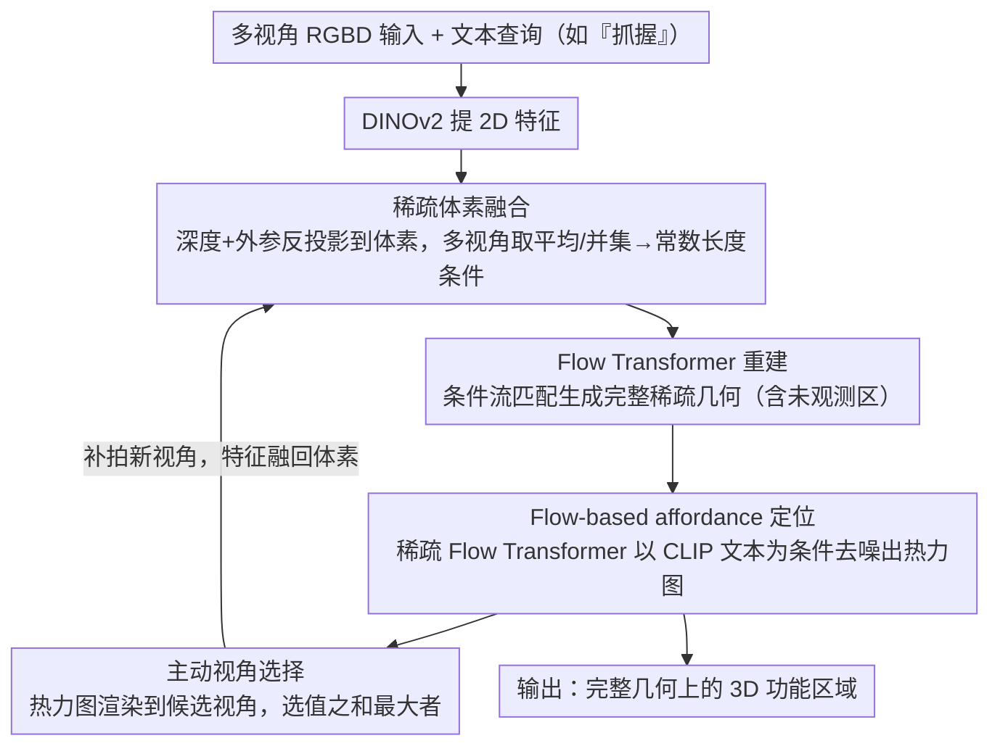

# Affostruction: 3D Affordance Grounding with Generative Reconstruction

**会议**: CVPR 2026  
**arXiv**: [2601.09211](https://arxiv.org/abs/2601.09211)  
**代码**: [项目页面](https://chrockey.github.io/Affostruction/)  
**领域**: 三维视觉 / 机器人感知  
**关键词**: 3D功能可供性, 生成式重建, 稀疏体素融合, Flow Matching, 主动视角选择

## 一句话总结

提出Affostruction，通过稀疏体素融合的生成式重建完成物体几何（包括未观测区域），并用Flow Matching建模功能可供性的多模态分布，在完整3D形状上实现功能区域定位，重建IoU提升54.8%、affordance aIoU提升40.4%。

## 研究背景与动机

机器人操作需要理解物体的功能可供性——"哪里可以抓握"。但现实中机器人只能从有限视角的RGBD相机观测物体，存在大量遮挡。现有方法只能在可见表面预测affordance，而机器人需要在未观测区域（如杯子背面的手柄）也能推理功能属性。这要求同时完成几何补全和affordance预测。

核心洞察：TRELLIS等3D生成模型有强大的几何先验但不支持深度输入和功能预测；affordance方法只在完整点云或可见表面上工作。Affostruction用稀疏体素融合扩展TRELLIS支持多视角RGBD输入，并新增Flow-based affordance模块。

## 方法详解

### 整体框架

这篇论文要解决的是一个现实困境：机器人只能从几个有限视角拿到带遮挡的 RGBD，却要在物体的**完整**几何（包括没拍到的那一面）上回答"哪里能抓"。Affostruction 把这件事拆成一条闭环流水线来转——先把多视角 RGBD 喂给 DINOv2 拿到 2D 特征，再借深度和相机参数把这些特征反投影到 3D，落进体素里融成一份"看到了什么"的条件信号；这份信号驱动一个 Flow Transformer 把整个物体的稀疏结构（含未观测区域）生成出来；接着第二个稀疏 Flow Transformer 在这份重建几何上、以 CLIP 文本（如"抓握"）为条件去噪出 affordance 热力图；最后系统把当前热力图渲染到候选视角，挑一个最能补全功能区域的角度去补拍，回到第一步再走一轮。整条链路因此形成"感知 → 重建 → 定位 → 选视角"的循环，而不是一次前向就结束。

### 关键设计

**1. 稀疏体素融合：把任意多视角压成常数长度的 3D 条件，让重建模型不挑视角数**

直接把每个视角的特征都拼给 Transformer，token 数会随视角线性膨胀，1 个视角和 8 个视角就成了两种输入分布，模型很难统一处理。Affostruction 的做法是先把每个视角的 DINOv2 特征用深度 + 相机外参反投影到 3D 世界坐标，落到体素网格上；同一个体素被多个视角命中时取特征平均，没被命中的体素取并集补进来，再叠一层 3D 正弦位置编码。这样无论来了几个视角，融合后送进 Flow Transformer 的都是一组"体素 token"，长度只跟被占用的体素数有关、不随视角数增长（即 $O(1)$ 量级），于是同一个模型可以平滑地吃 1 到 8 个视角。这正是它能在 TRELLIS 那套只接受单张 RGB 的几何先验之上，扩出"多视角 RGBD 可用"能力的关键。

**2. Flow-based affordance 定位：用生成式去噪而非回归，去匹配 affordance 天生的多模态分布**

affordance 不是一对一的：一句"抓握"在一个物体上往往对应好几处都合理的区域，用 MSE 直接回归一张热力图会把这些模式平均成一坨糊掉的响应。Affostruction 改成训一个稀疏 Flow Transformer，在 CLIP 文本嵌入的条件下，从噪声逐步去噪出 affordance 的 logits，这样采样出来的是分布里的一个有效模式而不是均值。同时把监督从 MSE 换成 BCE + Dice 的 mask 损失——affordance 本质是个二值的"是/不是交互区"问题，mask 损失比逐点回归更贴合这种稀疏二值标注，也更不容易被大片背景体素稀释。关键是这个模块跑在第一步生成出来的**完整**几何上，所以它能给杯子背面这种从没拍到的区域也标出手柄。

**3. Affordance 驱动的主动视角选择：让"下一步看哪"由功能区域来决定，而不是几何覆盖**

视角预算有限时，按几何均匀补拍并不划算——很多新视角拍到的是无关表面。Affostruction 用当前这一轮估出的 affordance 热力图来挑下一个视角：把热力图渲染到每个候选视角的 2D 成像上，算每个候选视角里热力图值之和，选和最大的那个去补拍，等于优先把相机对准"最可能是功能区、但现在还看不清"的地方。实验里这一招让一次额外视角就能拿到约两倍于顺序采样的提升，因为补拍的信息直接喂回第一步的体素融合，重建和定位都跟着变准。

### 一个完整示例

设想机器人初始只从正面拍到一个杯子，查询是"抓握"。第一轮：单张 RGBD 经 DINOv2 + 深度反投影融成体素条件，Flow Transformer 生成出包含背面的完整杯身，第二个 Flow Transformer 在完整几何上去噪出热力图——正面把手附近有响应，但背面把手因为初始重建不确定，响应弱而散。主动视角选择此时把这张热力图渲染到一圈候选视角上，发现"绕到背面 30° 那个角度"框住的热力图值之和最大（因为那里既有疑似功能区又没被观测），于是补拍这一帧。第二轮：把新视角的特征融回体素（重叠体素与第一帧平均、新体素并入），重建把背面把手补实，热力图在背面收敛成清晰的抓握区。如表中所示，正是这一次"按 affordance 选角度"的额外视角，把 aIoU 从顺序采样的 4.7 推到 9.2。

### 损失函数 / 训练策略

重建阶段用 Rectified Flow 的条件流匹配（CFM）损失；affordance 阶段用 BCE + Dice 的 mask 损失替代 MSE（二值 affordance 更适合 mask 损失）。训练时每次迭代随机采 1–8 个视角（随机多视角训练），逼模型适应可变数量的输入——消融显示若只用单视角训练，模型在推理时给多视角也几乎不涨点。

## 实验关键数据

### 3D重建（Toky4K）

| 方法 | IoU↑ | CD↓ | 是否用深度 |
|------|------|-----|----------|
| TRELLIS | 19.49 | 0.3694 | ✗ |
| MCC | 21.11 | 0.3299 | ✓ |
| Affostruction | 32.67 | 0.2427 | ✓ |

### 部分观测Affordance定位

| 方法 | aIoU↑ | aCD↓ |
|------|-------|------|
| MCC + Espresso-3D | 4.74 | 0.1354 |
| Affostruction | 9.26 | 0.1044 |

### 主动视角选择

| 策略 | 1次额外视角aIoU | 4次额外视角aIoU |
|------|-----------------|-----------------|
| 顺序 | 4.7 | 9.1 |
| 随机 | 6.2 | 11.0 |
| Affordance驱动 | 9.2 | 12.4 |

### 关键发现

- 随机多视角训练至关重要：单视角训练的模型给多视角输入时几乎无提升
- BCE+Dice mask损失优于MSE用于affordance预测
- 生成式方法在aIoU上大幅超越判别式方法（19.1 vs 13.6），即使不微调编码器

## 亮点与洞察

- 首次将3D生成式重建与affordance预测统一到一个框架
- 稀疏体素融合实现了O(1)复杂度的多视角聚合
- Flow Matching建模affordance的多模态分布是优雅的设计
- 主动视角选择形成"感知→重建→定位→选择"的闭环

## 局限与展望

- 严重遮挡下初始重建可能有误差，传播到affordance预测
- 初始affordance估计错误会误导主动视角选择
- 当前仅支持单物体场景，多物体需结合SAM3D
- 未在真实机器人上验证操作可行性

## 相关工作与启发

- **vs OpenAD/PointRefer/Espresso-3D**: 仅预测可见表面affordance；Affostruction在完整重建几何上预测
- **vs TRELLIS**: 单RGB输入无深度无affordance；Affostruction扩展支持多视角RGBD+affordance
- **vs MCC**: 判别式重建仅恢复观测表面；Affostruction生成式外推未见区域

## 评分

- 新颖性: ⭐⭐⭐⭐⭐ 生成式重建+affordance定位+主动视角的统一框架首创
- 实验充分度: ⭐⭐⭐⭐ 重建/affordance/主动视角均有定量评估，消融完整
- 写作质量: ⭐⭐⭐⭐⭐ 问题定义清晰，方法模块化，失败案例分析诚实
- 价值: ⭐⭐⭐⭐⭐ 对机器人操作的affordance理解具有直接应用价值

<!-- RELATED:START -->

## 相关论文

- [\[CVPR 2026\] HAMMER: Harnessing MLLMs via Cross-Modal Integration for Intention-Driven 3D Affordance Grounding](hammer_harnessing_mllms_via_cross-modal_integration_for_intention-driven_3d_affo.md)
- [\[CVPR 2026\] AffordMatcher: Affordance Learning in 3D Scenes from Visual Signifiers](affordmatcher_affordance_learning_in_3d_scenes_from_visual_signifiers.md)
- [\[CVPR 2026\] Scene Grounding In the Wild](scene_grounding_in_the_wild.md)
- [\[CVPR 2025\] Grounding 3D Object Affordance with Language Instructions, Visual Observations and Interactions](../../CVPR2025/3d_vision/grounding_3d_object_affordance_with_language_instructions_visual_observations_an.md)
- [\[CVPR 2026\] ORD: Object-Relation Decoupling for Generalized 3D Visual Grounding](ord_object-relation_decoupling_for_generalized_3d_visual_grounding.md)

<!-- RELATED:END -->
