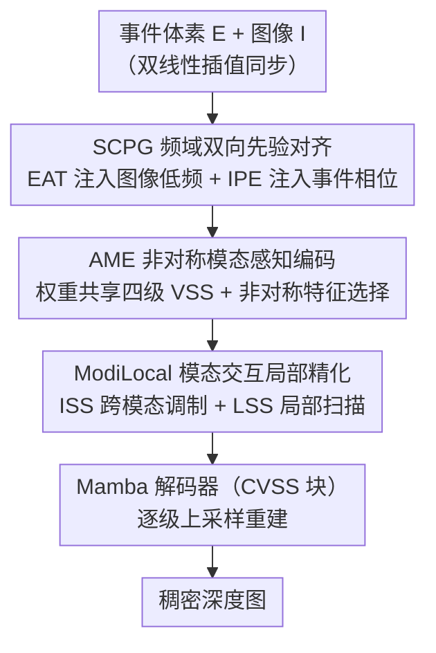

# AIMDepth: Asymmetric Image-Event Mamba for Monocular Depth Estimation

**会议**: CVPR 2026  
**论文**: [CVF Open Access](https://openaccess.thecvf.com/content/CVPR2026/html/Jing_AIMDepth_Asymmetric_Image-Event_Mamba_for_Monocular_Depth_Estimation_CVPR_2026_paper.html)  
**代码**: 无（论文未提供）  
**领域**: 3D视觉  
**关键词**: 单目深度估计, 事件相机, 图像-事件融合, Mamba/状态空间模型, 跨模态对齐

## 一句话总结
AIMDepth 把 Mamba（状态空间模型）首次用到图像-事件融合的单目深度估计上，并在融合前先做两级模态对齐——频域的双向先验注入（SCPG）做输入级对齐、非对称特征选择编码器（AME）做特征级对齐，再用模态交互局部精化模块（ModiLocal）融合，在 MVSEC / DENSE 上以仅 8.69 GFLOPs 的开销拿到 SOTA。

## 研究背景与动机
**领域现状**：单目深度估计里，图像提供稠密纹理但在运动模糊、极端光照下崩坏；事件相机异步记录像素亮度变化，时间分辨率高、动态范围大，在快速运动和弱光场景鲁棒，但数据稀疏、只有边缘信息，单用结构不完整。两者天然互补，于是"图像+事件融合"成了做鲁棒深度估计的主流方向。

**现有痛点**：现有融合方法的骨干要么是 CNN，感受野有限、建不了全局依赖；要么是 Transformer，自注意力是序列长度的平方复杂度，深度估计这种长序列任务上算力吃不消。更关键的是融合本身——绝大多数方法直接在特征层把两路特征拼/加在一起，**完全没处理事件（稀疏、动态）和图像（稠密、静态）之间的域差异**，导致语义偏置、表征次优，深度精度被拖累。

**核心矛盾**：建模能力 / 算力 / 模态对齐三者难以兼得。Transformer 能建全局但太贵；CNN 便宜但看不远；而无论哪种骨干，"先对齐再融合"这一步几乎都被跳过，融合质量受限于未消除的模态 gap。

**本文目标**：(1) 找一个全局建模能力强、又是线性复杂度的骨干；(2) 在融合之前显式消除事件-图像的域差异，分别在输入级和特征级对齐。

**切入角度**：Mamba/SSM 对序列长度是线性复杂度且擅长全局上下文建模，正好补 CNN/Transformer 的短板；而模态对齐可以拆成"输入级"和"特征级"两个层次分别处理——输入级在频域做（图像富含低频结构、事件富含高频/相位动态，可互补注入），特征级靠编码器对不同模态用不同深度的特征。

**核心 idea**：构建首个基于状态空间模型的图像-事件融合深度估计框架，用"频域双向先验（输入级对齐）+ 非对称特征选择（特征级对齐）+ 模态交互局部精化（融合）"这条层次化对齐管线，把模态 gap 在融合前就压下去。

## 方法详解

### 整体框架
AIMDepth 是一个 U-Net 形状、编码器和解码器全用状态空间模型搭的网络。输入是同步好的一对：事件体素栅格 $E_{raw}$（先双线性插值成图像状的 $E\in\mathbb{R}^{K\times H\times W}$，$K$ 是时间分箱数）和图像 $I\in\mathbb{R}^{C\times H\times W}$。整条管线分四步：

1. **SCPG（输入级对齐）**：在频域对 $E,I$ 做双向先验注入，输出对齐后的 $\tilde E,\tilde I$；
2. **AME（特征级对齐）**：权重共享的四级 VSS（Visual State Space）编码器分别编码 $\tilde I,\tilde E$，得到多级特征 $F_I,F_E$，再按模态特性各取一部分层级特征；
3. **ModiLocal（融合）**：把选出的图像/事件特征做跨模态交互 + 局部空间精化，产出融合特征 $F_{fused}$；
4. **Mamba 解码器**：用 CVSS（Channel-Aware VSS）块逐级上采样 $F_{fused}$ 恢复分辨率，最后一个卷积输出层给出稠密深度图。

### 关键设计

**1. SCPG：在频域做双向先验注入，把模态 gap 压在输入端**

直接拼接事件和图像会引入语义偏置，根源是两者分布差异太大。SCPG 不在特征层硬融，而是借助二者互补的频域特性，在输入端就把对齐做掉，由两个互补子模块组成。先对每个模态做二维离散傅里叶变换 $F(x)$，拆成幅度 $F_A(x)$ 和相位 $F_P(x)$。

*EAT（Event-targeted Amplitude Transfer，图像→事件）*：图像的低频幅度里藏着全局轮廓、空间布局这类结构信息，而事件因稀疏/边缘驱动恰好缺这些。EAT 用一个中心低频方形掩码 $M_\beta$（由比例 $\beta\in(0,1)$ 决定大小，$|h|\le\beta H$ 且 $|w|\le\beta W$ 时为 1）把事件的低频幅度**部分替换**成图像的：

$$F'_A(E_c) = M_\beta\cdot F_A(I) + (1-M_\beta)\cdot F_A(E_c)$$

再用事件自身的相位逆变换重建 $\tilde E_c = F^{-1}\big(F'_A(E_c)\cdot e^{jF_P(E_c)}\big)$。这样事件拿到了图像的低频结构先验，又保留了自身高频时间动态。

*IPE（Image-targeted Phase Enhancement，事件→图像）*：相位谱保留了精确的边缘和运动边界信息，而静态图像缺时间敏感性。IPE 先挑出全局幅度响应最大的两个事件通道 $\{E_{c1},E_{c2}\}$（即 $\arg\max_c\lVert F_A(E_c)\rVert_1$），取它们的相位图与原图像拼接：$\tilde I = \text{Concat}(I, F_P(E_{c1}), F_P(E_{c2}))$，给图像补上运动感知线索。直接在频域操作让这种输入级对齐自然、可解释，也和 Mamba 的序列建模契合。

**2. AME：用非对称特征选择做特征级对齐，靠"图像浅层、事件深层"分工**

即便输入对齐了，两模态在信息密度和语义结构上仍有本质差异：图像稠密、纹理丰富，浅层网络就能抓到局部边缘和空间细节；事件稀疏、编码动态变化，需要深层网络抽象时空语义。AME 据此在一个**权重共享**的编码器里做模态特异的特征增强。编码器是四级 VSS 块（每块含 SS2D 模块做四方向全局扫描），级间下采样、空间减半通道翻倍，分别处理 $\tilde I,\tilde E$ 得到各四级特征。关键在融合前的**非对称选择**：

$$F'_I = \{F^1_I, F^2_I, F^3_I\},\qquad F'_E = \{F^2_E, F^3_E, F^4_E\}$$

图像保留浅层（1–3 级）的空间细节，事件保留深层（2–4 级）的语义/时间信息。共享权重让参数紧凑，层级特异化让两模态在特征空间天然对齐——这是它做"特征级对齐"的核心机制，而非另搭一套对齐网络。

**3. ModiLocal：跨模态交互（ISS）+ 局部空间精化（LSS）完成层次化融合**

选出的 $F'_I,F'_E$ 各自先过线性投影和深度卷积增强局部结构敏感度，然后进 ModiLocal 做两段处理。

*ISS（Interactive Selective Scan）*：核心是一个"交叉模态调制"——让每个模态在**对方的引导**下演化自己的隐状态。两路 SSM 的状态更新把调制矩阵 $B$ 和残差通路 $D$ 在模态间互换：

$$h^t_I = A_I h^{t-1}_I + B_E x^t_I,\quad y^t_I = C_I h^t_I + D_E x^t_I$$
$$h^t_E = A_E h^{t-1}_E + B_I x^t_E,\quad y^t_E = C_E h^t_E + D_I x^t_E$$

也就是说，状态转移 $A$ 和读出 $C$ 各管各的（保持模态内部状态不被改写），但输入到状态的写入路径 $B$ 和输入到输出的残差 $D$ 来自另一模态，从而互相引导语义动态、又彼此解耦。两路结果通过逐元素相乘 + 残差相加融合。

*LSS（Local Spatial Selective Scan）*：稠密深度估计需要细粒度空间细节，而 SS2D 只做全局四方向扫描。LSS 构造重叠的局部窗口，在窗口内做有向状态传播——四个扫描方向里两个全局（反向水平、反向垂直）、两个局部（正/反向水平），既抓局部变化又保留更大空间上下文，精修物体边界和深度不连续。最后过 SE 块按通道自适应重加权、线性投影还原维度，得到 $F_{fuse}$。

### 损失函数 / 训练策略
网络预测的是归一化后的对数深度而非原始度量深度（对数编码把大深度范围压到紧凑区间、改善数值稳定性）。度量深度由 $\hat D_{m,k}=D_{max}\cdot\exp(-\alpha(1-\hat D_k))$ 还原，残差 $R_k = D^*_k - \hat D_{m,k}$。总损失在所有有效像素集 $V$ 上结合绝对误差与平方误差：

$$\text{Loss} = \frac{1}{|V|}\sum_{k\in V}\big(|R_k| + R_k^2\big)$$

实现细节：AdamW（weight decay 0.8，lr $2\times10^{-4}$），训练 30 epoch，batch 16，单卡 RTX 4090；事件体素通道 $B=5$，低频比例 $\beta=0.01$。

## 实验关键数据

数据集与指标：真实场景 MVSEC（Outdoor day2 训练，day1/night1 测试）+ 合成 DENSE（Towns 01–05 训练，Town 10 测试）。指标为绝对相对误差 A↓、对数 RMSE R↓、阈值精度 $\delta_n<1.25^n$（$\delta_1,\delta_2,\delta_3$，↑）。

### 主实验

MVSEC 平均（day1 与 night1 的平均）对比，本文在 5 项里 4 项最优（仅 A 略逊 UniCT）：

| 方法 | A↓ | R↓ | δ1↑ | δ2↑ | δ3↑ |
|------|----|----|-----|-----|-----|
| HMNet-B3 | 0.284 | 0.397 | 0.610 | 0.786 | 0.887 |
| UniCT | **0.266** | 0.392 | 0.603 | 0.788 | 0.886 |
| SRFNet | 0.285 | 0.454 | 0.550 | 0.741 | 0.855 |
| **AIMDepth (Ours)** | 0.306 | **0.371** | **0.622** | **0.804** | **0.905** |

DENSE（Town10）上更明显，A/R/δ1 最优，δ2/δ3 第二；相比最优 baseline，R 降 16.2%、δ1 升 9.9%：

| 方法 | A↓ | R↓ | δ1↑ | δ2↑ | δ3↑ |
|------|----|----|-----|-----|-----|
| EReFormer | 0.172 | 0.335 | 0.747 | 0.839 | 0.908 |
| ER-F2D | 0.229 | 0.333 | 0.725 | **0.891** | **0.949** |
| UniCT | 0.180 | 0.360 | 0.703 | 0.844 | 0.905 |
| **AIMDepth (Ours)** | **0.178** | **0.269** | **0.821** | 0.895 | 0.947 |

计算复杂度（Tab. 3）：AIMDepth 仅 **8.69 GFLOPs**（全场最低），参数 45.07M（中等）。对比 UniCT 的 59.22G/55.73M、RAMNet 因 RNN 结构高达 119.89G，本文在精度-效率权衡上明显占优。

### 消融实验

模块消融（MVSEC 平均 A↓，baseline 为三模块全关）：

| 配置 | A↓ | R↓ | δ1↑ | 说明 |
|------|----|----|-----|------|
| baseline（全关） | 0.539 | 0.520 | 0.500 | 直接编码无对齐无融合 |
| 仅 AME | 0.300 | 0.421 | 0.559 | 特征级对齐单独增益最大（按 A） |
| 仅 SCPG | 0.323 | 0.405 | 0.524 | 输入级对齐，跨昼夜最稳 |
| 仅 ModiLocal | 0.385 | 0.472 | 0.511 | 单用提升有限 |
| AME+ModiLocal | 0.314 | 0.381 | 0.628 | A 较 baseline 降 41.7% |
| SCPG+ModiLocal | 0.305 | 0.384 | 0.616 | A 较 baseline 降 43.4% |
| **三模块全开** | 0.306 | **0.371** | 0.622 | R/δ 最优，综合最佳 |

子模块消融：SCPG 里 EAT+IPE 同开最好（A 0.323），去掉任一都掉点、全关 0.539，二者频域先验互补；ModiLocal 里 ISS+LSS 同开最好（A 0.306），**ISS 是主要贡献者**（仅 ISS 0.309，仅 LSS 0.324）。

### 关键发现
- **"先对齐再融合"是关键**：ModiLocal 单用几乎无效（A 0.385），但叠在 SCPG 或 AME 之上立刻大涨（A 降到 ~0.30），印证了"先把模态 gap 压下去、融合模块才发挥得出来"的设计哲学。
- **模块有场景互补性**：AME 在白天最强（纹理清晰利于细节提取），但夜间纹理退化时不稳；ModiLocal 通过跨模态交互从主导模态选信息，能在弱光下把 AME 稳住。SCPG 则昼夜都稳健。
- ⚠️ 一个值得注意的细节：按平均 A 指标，**仅 AME（0.300）甚至略优于三模块全开（0.306）**；全模型的优势主要体现在 R/δ1/δ2/δ3 上。论文未单独讨论这一点，读者需留意"全开 ≠ 每个单指标都最好"。

## 亮点与洞察
- **把模态对齐从"特征层硬融"提前到"输入级频域"**：用 DFT 的幅度/相位分解，让图像低频结构补给事件、事件相位动态补给图像——这种频域双向注入既物理上可解释，又几乎不增算力，是个能迁到其他"稠密+稀疏"模态对的可复用 trick。
- **ISS 的 B/D 互换是巧设计**：在 SSM 里只交换输入写入路径 $B$ 和残差 $D$、保留 $A$（状态转移）和 $C$（读出）不动，做到"互相引导又彼此解耦"，比直接拼接/相加的融合更克制。
- **非对称特征选择几乎零成本**：共享权重编码器只是对图像取浅层、对事件取深层（$F'_I$ 取 1–3 级、$F'_E$ 取 2–4 级），就把"图像管细节、事件管语义"的先验编进了网络，参数不增。
- **Mamba 让深度估计这种长序列任务真正划算**：8.69 GFLOPs 比 Transformer 混合骨干低近一个量级，验证了 SSM 在事件-图像任务上的潜力。

## 局限与展望
- 论文未提供代码，复现门槛较高；EAT 取低频比例 $\beta=0.01$ 极小，对这种敏感超参缺少充分的 sensitivity 分析。
- 仅在 MVSEC（户外驾驶）和 DENSE（合成）两个数据集验证，室内/更多样场景的泛化未知；δ2/δ3 在 DENSE 上仍是第二，说明对最难像素的精度还有空间。
- ⚠️ 自身发现：消融里"全模型按 A 指标不如仅 AME"暗示三模块之间存在轻微的指标权衡，融合策略或许还能进一步调优；IPE 固定取"幅度响应最大的两个事件通道"是否对所有场景最优也未消融。
- 改进思路：可探索自适应 $\beta$ / 自适应通道选择，并把这套"频域两级对齐"推广到事件-图像的其他稠密预测任务（光流、分割）。

## 相关工作与启发
- **vs RAMNet / SRFNet（CNN 融合）**：它们靠 ConvGRU / 注意力融合模块，但感受野有限、建不了全局，RAMNet 还因 RNN 结构 FLOPs 极高（119.89G）；本文用 SSM 线性复杂度建全局，8.69G 就够。
- **vs ER-F2D / UniCT / HMNet（Transformer/混合融合）**：它们用自注意力或多级记忆抓全局，但平方复杂度限制了长序列扩展，且**都没显式处理模态域差异**；本文核心区别就是融合前先做输入级（SCPG）+ 特征级（AME）两级对齐。
- **vs VMamba / Vim（视觉 Mamba 骨干）**：本文沿用其双向/交叉扫描的 VSS/SS2D 思路，但首次把状态空间建模用到图像-事件融合深度估计，并新设计了跨模态版的选择扫描（ISS）和局部扫描（LSS）。

## 评分
- 新颖性: ⭐⭐⭐⭐ 首个把 SSM 用于图像-事件融合深度估计，频域双向对齐 + ISS 的 B/D 互换都是有想法的设计
- 实验充分度: ⭐⭐⭐⭐ 两数据集 + 完整三层消融 + 复杂度对比，但数据集偏少、个别指标权衡未深究
- 写作质量: ⭐⭐⭐⭐ 动机-方法-实验脉络清晰，公式完整；少量拼写/记号小瑕疵
- 价值: ⭐⭐⭐⭐ 8.69 GFLOPs 拿 SOTA，对资源受限的事件相机深度估计很实用，频域对齐思路可迁移

<!-- RELATED:START -->

## 相关论文

- [\[CVPR 2026\] Depth Hypothesis Guided Iterative Refinement for Event-Image Monocular Depth Estimation](depth_hypothesis_guided_iterative_refinement_for_event-image_monocular_depth_est.md)
- [\[CVPR 2026\] Bidirectional Cross-Modal Prompting for Event-Frame Asymmetric Stereo](bidirectional_cross-modal_prompting_for_event-frame_asymmetric_stereo.md)
- [\[CVPR 2026\] Iris: Integrating Language into Diffusion-based Monocular Depth Estimation](iris_integrating_language_into_diffusion-based_monocular_depth_estimation.md)
- [\[CVPR 2026\] ARES: Unifying Asymmetric RGB-Event Stereo for Probabilistic Scene Flow Estimation](ares_unifying_asymmetric_rgb-event_stereo_for_probabilistic_scene_flow_estimatio.md)
- [\[CVPR 2026\] Iris: Bringing Real-World Priors into Diffusion Model for Monocular Depth Estimation](iris_bringing_realworld_priors_into_diffusion_model_for_monocular_depth_estimation.md)

<!-- RELATED:END -->
