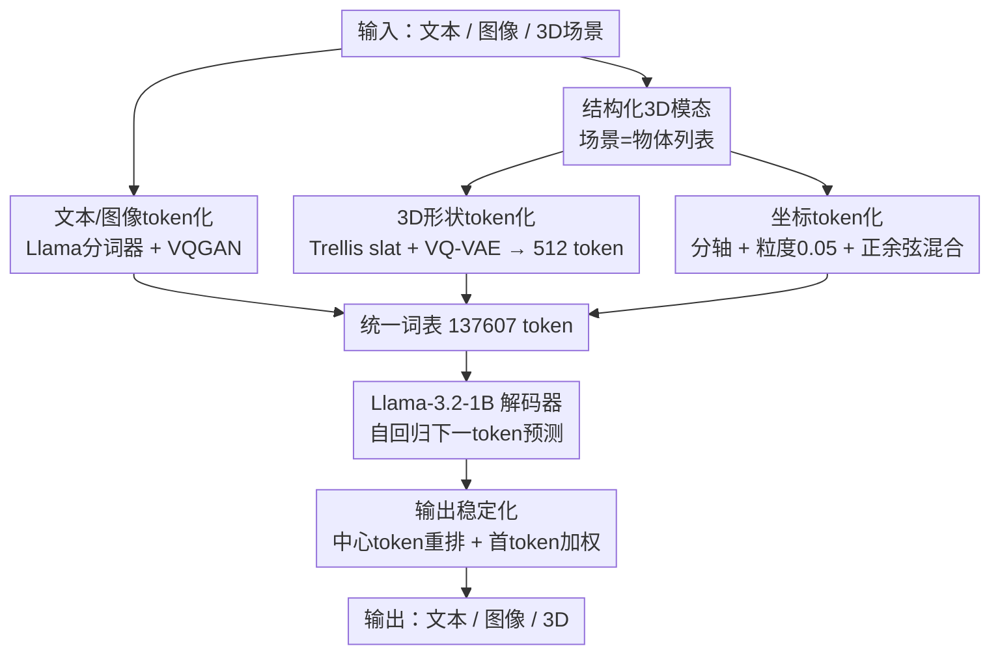

# Aligning Text, Images and 3D Structure Token-by-Token

**会议**: CVPR 2026  
**论文**: [CVF Open Access](https://openaccess.thecvf.com/content/CVPR2026/html/Sahoo_Aligning_Text_Images_and_3D_Structure_Token-by-Token_CVPR_2026_paper.html)  
**代码**: https://glab-caltech.github.io/kyvo （项目页，承诺开源代码与数据）  
**领域**: 3D视觉  
**关键词**: 结构化3D模态, 自回归多模态LLM, 3D token化, 单图3D重建, 统一token空间

## 一句话总结
本文提出 Kyvo——一个把"结构化 3D 场景"当作第三种模态、和文本/图像放进同一 token 空间的 decoder-only 自回归 LLM（基于 Llama-3.2-1B），并通过一本"cookbook"系统给出 3D 形状 token 化、坐标编码、序列设计等关键配方，使单个模型就能做渲染、单图 3D 重建/识别、指令编辑、问答四类 3D 任务。

## 研究背景与动机
**领域现状**：融合文本与图像的 LLM/VLM 已经能做图像描述、文生图等任务，自回归"下一 token 预测"范式被证明在语言和图像上都很能打。但这些模型几乎只把图像当输入，**对 3D 几何与空间关系的建模仍然很弱**。

**现有痛点**：已有"LLM + 3D"工作大多把场景当成一团**整体**的点云/NeRF 特征（如 3D-LLM 用全局点云做 captioning/QA），或只针对**单个 asset** 做生成（如 SAR3D、AToken）。这类表示要么无法对单个物体做精确的形状/位姿预测，要么 token 数爆炸——SAR3D 每个 asset 要 2040 个 token、AToken 超过 2 万个，根本塞不进一个多物体场景的自回归序列里。

**核心矛盾**：3D 场景天然是"多物体 + 每个物体有几何/位置/姿态"的结构，而把它塞进 LLM 的统一 token 空间，需要同时满足**紧凑**（token 数可自回归解码）和**结构化**（能逐物体、逐属性对齐语言与视觉）两个互相拉扯的要求；同时 LLM 又众所周知**不擅长数字**，坐标编码稍有不慎空间精度就崩。

**本文目标**：(1) 设计一种能和文本/图像无缝拼接的结构化 3D 模态；(2) 搞清楚训练这种 3D 对齐 LLM 的全部关键设计选择（数据表示、token 化、序列顺序、损失），并以 cookbook 形式沉淀。

**切入角度**：从一个语言预训练的 transformer 出发，把 3D 当作"再加一种语言"来扩展，期望**复用 LLM 已有的推理与泛化能力**——作者后面用实验（FFT 远胜 LoRA、指令微调 backbone 更好）确认了这个假设。

**核心 idea**：把场景表示成"物体列表"，每个物体的形状/类型/位置/姿态/尺寸都用**专用 token**逐个编码，再配上一个把复杂 3D 形状压到 512 个 token 的 VQ-VAE，让 3D 像文字一样被逐 token 对齐、生成。

## 方法详解

### 整体框架
Kyvo 的骨干是 decoder-only 的 Llama-3.2-1B-Instruct（从纯语言预训练权重初始化），核心改造只有两处：给图像和结构化 3D 模态各加一个 **modality-specific tokenizer**，并相应改造输入 embedding 与输出投影。三种模态——文本、图像、3D 场景——全部被转成离散 token 序列，拼进一个 137,607 大小的**统一词表**，然后纯靠"下一 token 预测"训练。因为输入输出都是同一套 token，所以**任何模态都能当输入或输出**：3D→图像（渲染）、图像→3D（重建/识别）、(图像,3D,文本)→(图像,3D)（指令编辑）、(图像,3D,问题)→答案（QA）都在同一个模型里完成。

下图给出统一 token 化的整体数据流：文本和图像走各自的标准 tokenizer，3D 场景走"结构化 3D 模态"这条贡献链路（内含形状 token 化与坐标 token 化两个子设计），三路 token 汇入统一词表后由 Llama 自回归解码，输出端再经"输出稳定化"修正首 token 偏置后产出目标模态。



### 关键设计

**1. 结构化 3D 模态：把场景写成"物体列表"逐属性 token 化**

针对"整体点云无法逐物体精确对齐"的痛点，Kyvo 把一个 3D 场景显式编码为**物体的列表**，每个物体由形状、类型、位置、尺寸、颜色、材质等属性组成，每个属性都用一个**可学习的专用 token** 标记（如 `[SHAPE]`、`[LOCATION]`、`[POSE]`），取值可以是文本（"car"、"yellow"）、数字（尺寸/坐标）或学到的 3D 形状嵌入。物体用 `[OBJECT-START]`/`[OBJECT-END]` 包裹，整场景用 `[SCENE-START]`/`[SCENE-END]` 包裹，例如：

```
[SCENE-START][OBJECT-START][SHAPE]<v1...v512>[LOCATION]-0.15 1.05 0.00
[POSE]0.00 0.00 3.00[OBJECT-END]...[SCENE-END]
```

这种逐物体、逐属性的结构让 3D 序列能和图像 token、文本 token 自然拼接，每个属性都成为可被语言模型直接预测/条件化的单元，从而支持形状预测、位姿预测、物体级编辑等精细任务——这正是"holistic 点云"做不到的。作者还发现**模态顺序有讲究**：把图像放在 3D 之前 `(I,3D,T)` 比反过来更好（指令任务 0.8666 vs 0.8350，QA 0.4980 vs 0.4720），因为后面的 3D token 能 attend 到完整的前置图像 token，条件更充分。

**2. 3D 形状 token 化：Trellis slat 经 VQ-VAE 压到 512 token + 多视图像素辅助损失**

复杂物体的几何与纹理是结构化模态最难塞进自回归序列的部分。Kyvo 采用 Trellis 把几何+纹理编码为**稀疏体素特征 slat** $z=\{(z_i,p_i)\}_{i=1}^L$，其中 $z_i\in\mathbb{R}^8$ 是局部特征、$p_i$ 是 $N^3$ 网格里的活跃体素索引。但 $N{=}64$ 时 $L\approx 20k$，直接自回归不可行。于是作者训练一个 **3D VQ-VAE**，把 slat 从 $64^3\times 8$ 压成稠密的 $8^3\times 128$ 隐表示，再用 8192 大小的码本向量量化，最终**每个物体只用 512 个离散 token**——约 40× 的压缩，且比 SAR3D 的 2040 token 还少约 4×、重建质量却更好（人评 Mean Rank 1.395 vs 1.605）。

关键发现是：**只在 slat 隐空间做重建损失不够**——即便隐空间损失相近，解码出的形状质量也很差。作者额外在**解码后的像素空间**加一个辅助重建损失（沿用 Trellis 的 L1 + D-SSIM + LPIPS），并且对 asset 做**多视图**（从 150 个视角随机采样）而非单一固定视角的重建监督，重建质量显著提升（Mean Rank：无辅助损失 2.828 → 固定单视图 1.672 → 多视图 1.500）。直觉上，像素空间 + 多视图监督逼着隐 token 真正编码出能在各个角度都立得住的几何，而不是只满足隐空间的数值对齐。

**3. 坐标 token 化：分轴离散 + 粒度分箱 + 正余弦混合嵌入**

LLM 不擅长数字，而位置/朝向恰恰是 3D 空间推理的命脉。Kyvo 把每个物体的 $x,y,z$ **拆成独立 token** 分别编码（让模型为每个坐标学独立 embedding），并用**等距分箱**按某个粒度离散化坐标值。粒度是决定性的：太粗则空间不准，太细则 token 暴涨、每个 bin 训练样本太少学不动——CLEVR 上扫描显示 0.05 全面优于 0.5（太粗）和 0.005（太细）（识别 0.9212 vs 0.2352 vs 0.5707）。这套分轴离散还顺带把序列**显著压短**：标准 Llama 分词器会把 "0.000" 切成 "0"/"."/"000" 这种碎片，平均序列长 271.4 token，而本文方案降到 93.2 token（2.91× 压缩）。

此外，单纯为坐标 token 学 embedding 无法表达数字的**有序性**（2 在 1 和 3 之间）。作者比较了三种方案：固定正余弦编码、从零学的 embedding、以及**两者混合**（学习的 embedding 上叠加正余弦）。结论是高数据量下三者持平，但**低数据量下纯固定/纯学习都会崩**，只有混合方案在各数据规模都稳，故采用混合编码。

**4. 输出稳定化：中心 token 重排 + 首 token 加权损失**

自回归生成图像时出现了一个隐蔽 bug：训练损失很低，推理却经常**整张图跑飞**。根因是"用信息量低的条件（3D 规格）去预测信息量高的输出（图像）"，而问题集中在**第一个 token**——CLEVR 图像左上角因为背景统一是灰色，首 token 高度集中在少数几个码上（超过 25% 的图共享同一个首 token），一旦推理时首 token 预测错，后续解码就连锁发散。任何背景偏均匀的图像（图形设计、真实场景）都有这毛病。

作者用两招治它：其一是**中心 token 重排**，把序列起点从"左上角背景块"改成**从图像中心 token 出发、再向外交替跳跃**展开，让首 token 落在有代表性的内容上、把首位的 token 分布拉平；其二是**首 token 加权损失**，对输出图像序列**前 5 个 token 的损失乘 10.0**，强约束模型把开头预测对。两者结合时渲染 Mean Rank 从 2.66 直降到 1.00（只用重排 3.56、只用加权 2.78，单用反而更差，必须配合）。

### 损失函数 / 训练策略
- 主目标是统一词表上的**下一 token 预测**交叉熵；输出图像序列对前 5 个 token 施加 10.0 的 loss 权重。
- 3D VQ-VAE 用标准 VQ-VAE 损失（隐空间重建）+ 解码像素空间的多视图辅助重建损失（L1/D-SSIM/LPIPS）单独训练。
- 主模型从语言预训练权重做**全参微调（FFT）**：实验显示 FFT 远胜 LoRA 和从零训，说明跨模态迁移在新模态上有效而 LoRA 不适配全新模态。整套 cookbook 基于训练 **307 个模型**得出。

## 实验关键数据

### 主实验
真实世界 3D 物体识别（Jaccard Index，越高越好），对比 SOTA 检测器 Cube R-CNN：

| 数据集 | Cube R-CNN (ResNet-34) | Cube R-CNN (DLA-34) | Kyvo (本文) |
|--------|------|------|------|
| Objectron | 0.3276 | 0.4012 | **0.4784** |
| ARKitScenes | 0.2043 | 0.2208 | 0.2118 |

Kyvo 在 Objectron 上显著超过专用检测器，在更难、标注更噪的 ARKitScenes 上与之持平——一个通用自回归框架能逼平/超过任务专用视觉专家。3D 形状 token 化人评对比：

| 3D Tokenizer | Mean Rank ↓ | token/物体 |
|--------------|------|------|
| SAR3D | 1.605 | 2040 |
| Kyvo 3D VQ-VAE | **1.395** | **512** |

### 消融实验
| 模块 | 配置 | 关键指标 | 说明 |
|------|------|---------|------|
| 形状辅助损失 | 无 / 单视图 / 多视图 | Mean Rank 2.828 / 1.672 / **1.500** | 像素空间 + 多视图监督最关键 |
| 坐标粒度 | 0.005 / **0.05** / 0.5 | 识别 0.5707 / **0.9212** / 0.2352 | 太粗太细都差，0.05 最佳 |
| 输出稳定化 | 无 / 仅重排 / 仅加权 / **两者** | 渲染 Mean Rank 2.66 / 3.56 / 2.78 / **1.00** | 必须重排+加权配合 |
| 训练配方 | Scratch / LoRA / **FFT** | 识别 0.6265 / 0.8684 / **0.9212** | 全参微调最优，LoRA 不适配新模态 |
| backbone | 1B / **1B-Instruct** / 3B | 识别 0.8948 / **0.9212** / 0.8626 | 指令微调有益，3B 无增益甚至更差 |

### 关键发现
- **跨模态迁移真实存在**：从纯语言权重 FFT 出来的模型，在预训练完全没见过的图像/3D 模态上反而最强，说明语言先验能迁移到 3D，呼应了"3D 当第三种语言"的假设。
- **1B 足矣**：从 1B 加到 3B 没有显著收益、QA 还掉点（0.4980→0.2345），说明数据复杂度被 1B 充分捕获，更大模型反而过拟合。
- **首 token 是自回归图像生成的命门**：一个看似工程的细节（首 token 偏置）会导致灾难性发散，重排+加权两招缺一不可。
- **泛化有边界**：识别 Jaccard 从 CLEVR 的 0.9212 掉到复杂 ObjaWorld 的 0.6415，反映场景复杂度的代价；但 Llama3.2-V 用 in-context 提示几乎为 0，凸显结构化 3D 模态的价值。

## 亮点与洞察
- **"把 3D 当第三种语言"的统一 token 空间**：让一个模型用同一套权重做渲染/重建/识别/编辑/QA，且任意模态可作输入输出——这是相比"3D 当独立分支"最优雅的地方。
- **40× 压缩的 3D 形状 token**：Trellis slat + VQ-VAE + 多视图像素辅助损失，把单物体压到 512 token 还超过 SAR3D，是让多物体场景能进自回归序列的关键工程突破，可迁移到任何需要把 3D asset 序列化的生成模型。
- **首 token 偏置的诊断与修复**：揭示了"低信息条件预测高信息输出"时自回归图像生成的脆弱点，中心 token 重排这一招对任何背景偏均匀的图像生成都有借鉴意义。
- **cookbook 范式**：训练 307 个模型把数据表示/token 化/序列顺序/损失的设计空间系统扫了一遍，结论本身就是给后来者的工程指南。

## 局限与展望
- 作者承认**核心瓶颈是 3D 数据稀缺**：能在适中数据量下做到域内泛化，但**跨域泛化需要更大、现成不可得的数据集**；展望是引入混合训练数据扩展到新域。
- 评测大量依赖**模板化指令/问答**与合成数据集（CLEVR/ObjaWorld），真实世界只验证了识别一项任务；指令编辑/QA 在真实场景的表现未充分展示。⚠️
- 渲染评测因标准图像指标（L2/SSIM/FID/PSNR）抓不住物体位置/属性而改用**人评 Mean Rank**，可比性与可复现性受限。
- 改进思路：把 3D token 化扩展到开放词汇/任意几何、引入真实 3D 监督数据、以及把"图像在前"等序列设计在更长上下文/更多模态混排下重新验证。

## 相关工作与启发
- **vs 3D-LLM**：3D-LLM 用**整体**点云做 captioning/QA，本文把场景**分解为物体**做逐物体对齐，从而能做单图形状+位姿预测、3D 条件图像生成，这些是整体表示做不到的。
- **vs SceneScript**：SceneScript 从视频自回归预测 3D box + 全场景点云，本文则把**图像**与结构化 3D 物体/场景表示对齐，并支持图像生成方向。
- **vs SAR3D / AToken（3D token 化）**：SAR3D 用 triplane、AToken 基于 Trellis 训联合 tokenizer，但都面向**单 asset 生成**且 token 数巨大（2040 / 20k+）；本文专为**多物体场景**优化紧凑性，512 token 即可，能塞进统一词表与图像/文本共存。
- **vs 主流 VLM**：现代 VLM 只把图像当输入、3D 推理弱，本文证明纯自回归 + 结构化 3D 模态能逼平甚至超过专用 3D 检测器（Cube R-CNN）。

## 评分
- 新颖性: ⭐⭐⭐⭐⭐ 首次把结构化 3D 场景作为第三模态塞进统一 token 空间并系统化设计选择
- 实验充分度: ⭐⭐⭐⭐⭐ 4 任务 × 4 数据集、训练 307 个模型的 cookbook，消融详尽
- 写作质量: ⭐⭐⭐⭐ cookbook 式叙述清晰，但部分发现散落、真实世界任务覆盖偏窄
- 价值: ⭐⭐⭐⭐⭐ 为 3D 对齐多模态 LLM 提供了可复用的 token 化与训练配方

<!-- RELATED:START -->

<div class="related-papers" markdown="1">

## 相关论文

- [\[CVPR 2026\] SceneTok: A Compressed, Diffusable Token Space for 3D Scenes](scenetok_a_compressed_diffusable_token_space_for_3d_scenes.md)
- [\[CVPR 2026\] Geometry-Guided 3D Visual Token Pruning for Video-Language Models](geometry-guided_3d_visual_token_pruning_for_video-language_models.md)
- [\[CVPR 2026\] TokenHand: Discrete Token Representation for Efficient Hand Mesh Reconstruction](tokenhand_discrete_token_representation_for_efficient_hand_mesh_reconstruction.md)
- [\[CVPR 2026\] Fast SceneScript: Fast and Accurate Language-Based 3D Scene Understanding via Multi-Token Prediction](fast_scenescript_fast_and_accurate_language-based_3d_scene_understanding_via_mul.md)
- [\[CVPR 2026\] Revisiting Token Compression for Accelerating ViT-based Sparse Multi-View 3D Object Detectors](revisiting_token_compression_for_accelerating_vit-based_sparse_multi-view_3d_obj.md)

</div>

<!-- RELATED:END -->
