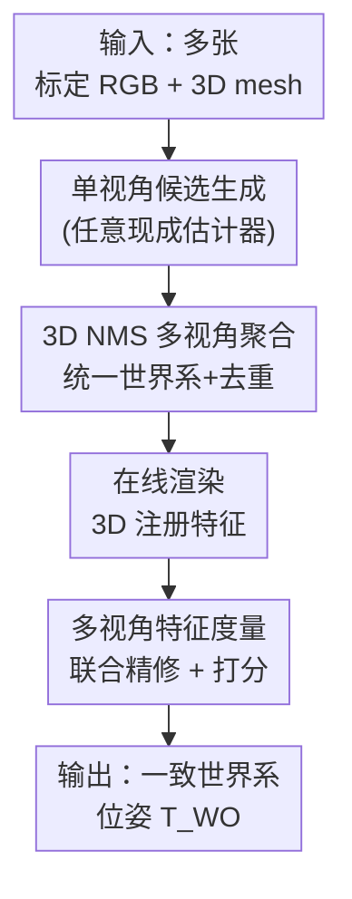

# AlignPose: Generalizable 6D Pose Estimation via Multi-view Feature-metric Alignment

**会议**: CVPR2026  
**arXiv**: [2512.20538](https://arxiv.org/abs/2512.20538)  
**代码**: https://mikestikova.github.io/alignpose/ (项目主页)  
**领域**: 3D视觉 / 6D物体位姿估计  
**关键词**: 多视角位姿估计, 特征度量精修, 免训练泛化, 工业检测, BOP benchmark

## 一句话总结
AlignPose 把多张已标定 RGB 视图里各自单视角估出的物体位姿候选，先用 3D NMS 聚合成唯一候选，再用一个跨所有视图同时最小化「在线渲染特征 vs 观测图像特征」差异的多视角特征度量精修，求出一个全局一致的世界坐标系位姿；整个过程不需要任何针对物体的训练或对称性标注，在工业级无纹理/反光/透明物体数据集上比已有方法领先 14% 以上。

## 研究背景与动机

**领域现状**：基于模型的 6D 物体位姿估计（已知物体 3D mesh，求其在相机/世界坐标系下的旋转+平移）是 AR、机器人抓取、工业检测的核心环节。近年的 RGB-only 学习方法（如 MegaPose、FoundPose、GigaPose）已经能泛化到训练时没见过的新物体，靠的是在大规模仿真数据上训练 + 借用视觉基础模型（DINOv2）的特征。

**现有痛点**：这些方法都是**单视角**的，天生受三类问题困扰——深度尺度歧义、杂乱遮挡、外观歧义（例如一个把手被挡住的杯子）。深度相机能更精确，但对反光/透明物体失效且工业深度相机昂贵。多视角 RGB 本该是出路，可是现有多视角方法要么假设太强、会直接丢掉有效的候选位姿（如 CosyPose 的 RANSAC 聚合，几个视角对不上就整个物体丢掉），要么需要**针对具体物体训练**（如 DPODv2 要学数据集专属特征，训练几小时到几天），失去了泛化性。

**核心矛盾**：「多视角带来的鲁棒性」与「免训练的泛化性」难以兼得——想用多视角融合提精度，现有套路要么牺牲召回（硬性几何一致性筛掉候选），要么牺牲泛化（学物体专属特征）。

**本文目标**：设计一个多视角 6D 位姿估计方法，既能消解单视角的深度/遮挡歧义，又**不需要任何物体专属训练或对称性标注**，对新物体零样本可用。

**切入角度**：作者注意到「特征度量精修」（feature-metric refinement）在相机定位、SfM bundle adjustment 里已被验证非常有效——用深度特征代替光度、再配非线性求解器去对齐。但这些都是相机/场景级、且是单视角或预渲染模板。作者把这个原则**重新表述到以物体为中心的位姿问题**，并推广到多视角联合。

**核心 idea**：用冻结的基础模型特征，把多视角物体位姿估计写成一个**联合的多视角特征度量图像对齐**问题——同时在所有视图上最小化「按当前位姿在线渲染出的物体特征」与「图像观测特征」的差异，优化出单一一致的世界坐标系位姿；因为特征来自冻结的基础模型，所以天然泛化到新物体、无需训练。

## 方法详解

### 整体框架

输入是同一场景的多张已标定 RGB 图像（已知相机内参 + 各相机相对世界坐标系的外参 $\bm{T}_{CW}$）和物体的 3D mesh，输出是该物体在世界坐标系下的单一一致位姿 $\bm{T}_{WO}^{r}\in SE(3)$。整条管线分三步走：先让任意现成的单视角估计器在每个视图独立产出若干带置信度的位姿候选；再把候选统一到世界坐标系、用 3D NMS 去重，得到每个物体一个粗位姿候选；最后对每个候选做多视角特征度量精修，让它在所有视图上同时和图像特征对齐，并用对齐残差给出置信打分。关键在于第三步——它把「物体位姿」当作唯一优化变量，世界位姿通过运动学链 $\bm{T}_{CO}=\bm{T}_{CW}\bm{T}_{WO}$ 投射到每个相机，使得多视角的证据天然耦合到同一个 $\bm{T}_{WO}$ 上。

### 关键设计

**1. 3D NMS 多视角聚合：把跨视图冲突的候选收成每个物体一个干净候选**

单视角估计器在每个视图各自给出一堆候选位姿，一旦用相机外参把它们都搬到同一个世界坐标系，同一个物理物体就会冒出大量重叠的候选——既冗余又互相矛盾。CosyPose 用 RANSAC 在位姿层面找跨视图一致的对应再聚合，问题是几个视角对不上时它会把整个物体丢掉，召回受损。AlignPose 改用一个简单但有效的 **3D 非极大值抑制**：把每个候选用其位姿和 3D 模型转成一个 3D 包围盒，以单视角估计器给的置信度为分数，按 3D IoU 超过阈值就抑制重叠盒子。这样既去掉了重复检测，又不要求跨视图严格几何一致——只要物体在至少一个有效视图被检到，它就能进入后续精修，这是 AlignPose 比 CosyPose 鲁棒得多的根源

**2. 在线渲染的 3D 注册特征：用冻结基础模型特征换来免训练泛化**

精修需要把「物体模型该长什么样」和「图像里实际看到什么」对齐，关键是怎么表示模型侧的外观。AlignPose 给每个视图准备两份固定表示：一是 **query 2D 特征图**——把图像里（大致）含物体的区域裁到标准尺寸、过一遍特征提取器（DINOv2）；二是 **3D 注册特征** $\mathcal{F}_{CO}=\{\mathbf{p}_i,\mathbf{x}_i\}$——以当前粗位姿为每个视图在线渲染彩色和深度帧，从彩色渲染提特征、再借渲染深度把特征「抬」回物体坐标系，得到一团带特征描述子 $\mathbf{p}_i$ 的 3D 表面点 $\mathbf{x}_i$。与 FoundPose 离线预渲染一大堆模板特征不同，这里**每个视图在线渲染一份**，用的就是该视图的真实内参和初始视角，作者推测这让模板特征质量更高（消融 Tab 7 也证实在线优于离线）。因为所有特征都来自冻结的视觉基础模型，整个方法对新物体零样本可用，无需训练

**3. 多视角特征度量联合精修与打分：在所有视图上同时对齐，求唯一一致位姿**

有了两份特征，精修的目标是让「3D 注册特征投影到图像后的位置」处采样到的 query 特征，尽量等于该 3D 点自带的注册特征。单视图损失定义为

$$\mathcal{L}^{C}_{\text{FE}}(\bm{T}_{CO})=\sum_{(\mathbf{p}_i,\mathbf{x}_i)\in\mathcal{F}_{CO}}\rho\!\left(\mathbf{p}_i-\mathbf{F}_q\!\left(\pi_C(\bm{T}_{CO}\mathbf{x}_i)\right)\right),$$

即把物体点 $\mathbf{x}_i$ 经 $\bm{T}_{CO}$ 转到相机系、用投影 $\pi_C$ 投到图像、在 query 特征图 $\mathbf{F}_q$ 上双线性插值取特征，与注册特征 $\mathbf{p}_i$ 作差，再过 Barron 的鲁棒代价函数 $\rho(\cdot)$。多视角对齐的核心是：**只优化一个世界系位姿 $\bm{T}_{WO}$**，把它通过运动学链 $\bm{T}_{CO}=\bm{T}_{CW}\bm{T}_{WO}$ 投到每个相机，最小化所有视图损失之和

$$\bm{T}_{WO}^{r}=\arg\min_{\bm{T}_{WO}}\sum_{C\in\mathcal{C}}\mathcal{L}^{C}_{\text{FE}}(\bm{T}_{CW}\bm{T}_{WO}),$$

用 Levenberg-Marquardt 迭代到收敛或最多 30 步。最后用平均特征度量残差给出归一化置信分 $s(\bm{T}_{WO}^{r})=1-\frac{1}{|\mathcal{C}|}\sum_{C}\mathcal{L}^{C}_{\text{FE}}(\bm{T}_{CW}\bm{T}_{WO}^{r})\in[0,1]$，分越高表示位姿和所有视图的视觉证据越一致。和单视角或预渲染模板方法相比，这里所有视角的几何约束被显式耦合进同一个变量，深度/遮挡歧义可以被其他视角补上

### 损失函数 / 训练策略
方法**完全免训练**：没有任何针对物体或数据集的网络学习，所有可学组件都来自冻结的 DINOv2-L（默认取第 18 层，与 FoundPose 对齐以便公平比较）。优化目标就是上面的多视角特征度量损失，求解器用 Levenberg-Marquardt（最多 30 次迭代）。鲁棒代价 $\rho$ 采用 Barron 的通用鲁棒函数以抑制外点。

## 实验关键数据

在 6 个数据集上按 BOP 协议评测：BOP-Classic 的 YCB-V（有纹理家居物）、T-LESS（无纹理工业物、重度杂乱）；BOP-Industrial 的 IPD、XYZ-IBD、ITODD-MV（小、金属、反光、灰度）；以及 HouseCat6D（含金属餐具、透明玻璃）。指标为 6D 定位的平均召回 AR 和 6D 检测的平均精度 AP（AP 更严格）。主对比基线是 CosyPose 多视角——目前唯一公开、开源、能对未见物体做多视角 RGB 精修的方法。

### 主实验

YCB-V / T-LESS 上，对四种单视角输入（FoundPose / GigaPose / MegaPose / Co-op）分别用 CosyPose MV 和本文精修，本文全面大幅领先：

| 数据集 | 单视角输入 | 单视角 AR/AP | +CosyPose MV AR/AP | +Ours AR/AP |
|--------|-----------|--------------|---------------------|-------------|
| YCB-V | FoundPose | 69.0 / 63.0 | 79.2 / 76.1 | **83.9 / 83.2** |
| YCB-V | Co-op | 69.7 / 69.5 | 81.0 / 79.2 | **83.8 / 83.3** |
| T-LESS | FoundPose | 57.0 / 57.0 | 66.4 / 63.0 | **84.1 / 88.6** |
| T-LESS | Co-op | 68.2 / 68.9 | 78.7 / 78.9 | **89.6 / 92.4** |

工业数据集（只报 AP，输入用 FoundPose 候选）上优势更夸张，超出基线 14% 以上：

| 数据集 | FoundPose AP | +CosyPose MV AP | +Ours AP |
|--------|--------------|------------------|----------|
| IPD | 31.4 | 36.7 | **79.8** |
| XYZ-IBD | 32.5 | 52.4 | **66.5** |
| ITODD-MV | 41.2 | 54.5 | **76.8** |

HouseCat6D 的金属子集尤其能体现鲁棒性：整体 AR/AP 从 CosyPose 的 86.7/86.6 提到 88.9/89.6，而金属子集从 25.8/27.1 跳到 **43.5/46.5**。即便在「已见物体」设置（T-LESS，与需物体专属训练的 DPODv2/CenDerNet/CosyPose 比），免训练的本文也全面领先，synt 数据下 AR/AP 达 85.5/89.2（CosyPose MV 仅 72.8/70.6）。

### 消融实验

逐步加组件（YCB-V / T-LESS，Co-op 单视角输入）：

| 配置 | YCB-V AR/AP | T-LESS AR/AP | 说明 |
|------|-------------|--------------|------|
| 1 view | 69.7 / 69.5 | 68.2 / 68.9 | 单视角输入 |
| 4 views 聚合 | 63.7 / 33.9 | 69.5 / 48.6 | 直接搬到世界系，冗余候选拉垮 AP |
| 4 views 聚合 + refine | 84.5 / 38.0 | 77.7 / 39.9 | 精修提 AR 但 AP 仍被冗余拖累 |
| 4 views 聚合 + NMS | 63.0 / 62.3 | 73.1 / 80.2 | NMS 去冗余，AP 大幅恢复 |
| 4 views 聚合 + NMS + refine（Full） | **83.8 / 83.3** | **89.6 / 92.4** | 完整管线 |

特征描述子消融（Tab 6）：DINOv2 各型号/各层之间 AR/AP 只差几个点，DINOv2-L 第 18 层取 83.8/83.3（YCB-V）；换成稠密 SIFT 仍能精修但比基础模型低 7% 以上。

### 关键发现
- **NMS 是精度的命门**：只聚合不去重时 AP 暴跌（YCB-V 69.5→33.9），加上 NMS 才把 AP 拉回（62.3），再加精修才到 83.3——说明「去冗余」和「特征对齐」是互补的两块，缺一不可。
- **精修主要救 AR、NMS 主要救 AP**：精修能把召回从 63 提到 84，但若不先 NMS，冗余候选会让检测精度（AP）始终上不去。
- **对特征选择极其鲁棒**：换不同 DINOv2 型号/层只差几个点，关键是用语义丰富的基础模型特征而非低层梯度/关键点特征（SIFT 掉 7%+）。
- **在线渲染优于离线模板**：用与 query 相同内参和初始视角在线渲染，特征质量更高，精度高于 FoundPose 式离线检索最近模板。

## 亮点与洞察
- **「至少一个有效视图就能救」的鲁棒性**：3D NMS 不要求跨视图几何一致，绕开了 CosyPose RANSAC「几个视角对不上就整个物体丢掉」的失败模式，工业反光/无纹理场景下召回稳得多——这是 14%+ 提升的主因。
- **把相机定位里的特征度量 BA 迁移到物体位姿**：核心 trick 是只优化单一世界系位姿、用运动学链把它投到每个相机，使多视角约束天然耦合，而不是各视图独立精修再投票。这个「单变量 + 多视角损失求和」的范式可迁移到任何带已知外参的多视角对齐任务。
- **免训练泛化来自冻结特征**：所有可学部分都外包给冻结 DINOv2，方法本身零参数可学，因此换物体、换数据集都不用重训，5 分钟内即可 onboard 新物体（BOP 未见物体设置）。

## 局限与展望
- **依赖已知相机外参**：方法假设多相机外参由一次性离线标定给出（不像 CosyPose 能联合估相机位姿），外参不准时精修会被带偏；适用场景偏向固定多相机工业台/机器人。
- **依赖单视角候选的质量**：聚合和精修都建立在现成单视角估计器产出的候选上，若所有视图的初始候选都严重偏离，精修（LM 局部优化，最多 30 步）可能收敛到错误局部极小。
- **在线渲染开销**：每视图在线渲染彩色+深度并提特征，相比预渲染模板可能更省显存但增加每次推理的计算量，论文未给端到端时延对比。
- **改进方向**：联合优化相机外参以放宽标定假设；引入多假设/全局搜索缓解 LM 局部极小；探索对透明/高反光物体更鲁棒的渲染-特征管线。

## 相关工作与启发
- **vs CosyPose [26]**：两者都是「聚合 + 精修」框架，但 CosyPose 用位姿级 RANSAC 聚合（几个视图对不上就丢物体）+ bundle adjustment 精修，且需要对称性标注、联合估相机位姿；本文用 3D NMS 聚合（只要一个有效视图就保留）+ 特征度量精修，免对称标注、假设外参已知。结果在所有数据集全面领先，工业集尤甚。
- **vs FoundPose [42]**：FoundPose 是单视角、用基础模型特征对齐预渲染离线模板；本文把它推广到多视角联合、在线渲染注册特征，并显式耦合到单一世界系位姿，解决了单视角的深度/遮挡歧义。
- **vs DPODv2 [50] / CenDerNet [12]**：这些多视角方法需物体专属训练（学 NOCS 或数据集专属特征）；本文完全免训练，却在 T-LESS 已见物体设置上仍全面超越它们，说明冻结基础模型特征 + 多视角特征度量对齐的范式足够强。
- **vs 特征度量 BA（SfM/相机定位 [32,47]）**：本文受其启发但目标不同——不需要 SfM 的匹配关键点、也不止于预渲染模板，而是以物体为中心、跨视角在线对齐。

## 评分
- 新颖性: ⭐⭐⭐⭐ 把特征度量精修重述为「免训练多视角物体位姿联合对齐」并配 3D NMS 聚合，组合清晰有效，单组件多为已有思想的巧妙迁移。
- 实验充分度: ⭐⭐⭐⭐⭐ 6 数据集、4 种单视角输入、已见/未见双设置、组件与特征双消融，覆盖工业反光/透明等硬场景。
- 写作质量: ⭐⭐⭐⭐ 问题动机和公式交代清楚，pipeline 易懂；部分实现细节（时延、渲染开销）留在附录。
- 价值: ⭐⭐⭐⭐⭐ 工业多相机场景即插即用、免训练免对称标注，AP 提升巨大，落地价值高。

<!-- RELATED:START -->

## 相关论文

- [\[CVPR 2026\] Exploring 6D Object Pose Estimation with Deformation](exploring_6d_object_pose_estimation_with_deformation.md)
- [\[CVPR 2026\] Generalizable Human Gaussian Splatting via Multi-view Semantic Consistency](generalizable_human_gaussian_splatting_via_multi-view_semantic_consistency.md)
- [\[CVPR 2026\] ComPose: A Unified Completion-Pose Framework for Robust Category-Level Object Pose Estimation](compose_a_unified_completion-pose_framework_for_robust_category-level_object_pos.md)
- [\[CVPR 2026\] DMAligner: Enhancing Image Alignment via Diffusion Model Based View Synthesis](dmaligner_enhancing_image_alignment_via_diffusion_model_based_view_synthesis.md)
- [\[CVPR 2026\] Breaking the 3D Dataset Bottleneck: Fast Scalable Generation of Aligned 3D Assets from Scratch for Category 6D Pose Estimation and Robotic Grasping](breaking_the_3d_dataset_bottleneck_fast_scalable_generation_of_aligned_3d_assets.md)

<!-- RELATED:END -->
