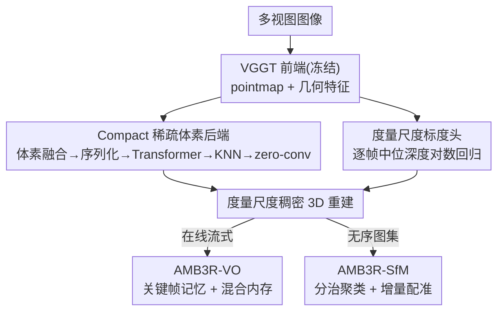

# AMB3R: Accurate Feed-forward Metric-scale 3D Reconstruction with Backend

**会议**: CVPR 2026  
**论文**: [CVF Open Access](https://openaccess.thecvf.com/content/CVPR2026/html/Wang_AMB3R_Accurate_Feed-forward_Metric-scale_3D_Reconstruction_with_Backend_CVPR_2026_paper.html)  
**代码**: https://hengyiwang.github.io/projects/amber （开源代码/权重/评测工具）  
**领域**: 3D视觉  
**关键词**: 前馈3D重建, 度量尺度, 稀疏体素后端, 视觉里程计, Structure-from-Motion  

## 一句话总结
AMB3R 在冻结的 VGGT 前端之上挂一个「稀疏但紧凑」的体素后端做显式 3D 几何推理，再加一个轻量标度头恢复度量尺度，仅用约 80 H100 GPU 时训练就在 7 个任务/13 个数据集上刷到 SOTA；配套的 AMB3R-VO / AMB3R-SfM 两条免训练管线，让前馈模型首次在 VO/SLAM 与 SfM 上超过了基于优化的传统系统。

## 研究背景与动机
**领域现状**：DUSt3R 之后，pointmap（每个像素回归一个 3D 坐标，2D-3D 一一对应）成了 3D 基础模型的基石。Spann3R、VGGT 等把它从两视图扩到多视图，用一个网络统一解决相机位姿、深度、稠密重建等多种任务。

**现有痛点**：作者点出一个被忽略的根本问题——「2D 像素到 3D 场景点真的是一一对应吗？」实际上不是。由于视角重叠，多个像素常对应同一个 3D 点，这种「多对一」的对应关系（correspondence）才是 3D 视觉几十年研究的核心。传统/隐式方法（KinectFusion 的 TSDF、NeRF、NeuralRecon 的特征体素）都靠一个共同性质把这些多重观测融合成一致几何：**空间紧凑性**（spatial compactness，即同一个 3D 坐标只能有唯一属性）。而 VGGT/Spann3R 这类前馈模型虽然输出空间隐式鼓励对应像素落到同一 3D 点，但网络本身只在 2D 网格上算注意力，**没有任何显式的几何推理或空间紧凑性约束**。

**核心矛盾**：纯 2D-to-3D 回归缺少「把同一场景点的多重观测在 3D 空间里真正融合」的机制，因此几何一致性受限；同时 VGGT 这类全局多视图 Transformer 是 $O(T^2)$ 复杂度、只能离线处理有限帧数，无法做在线 VO 或大规模 SfM。

**本文目标**：(1) 给前馈 pointmap 模型补上一个带空间紧凑性的显式 3D 推理后端；(2) 恢复度量尺度；(3) 在不微调、不做测试时优化的前提下，把同一个模型扩展到任意帧数的在线 VO 和大规模 SfM。

**核心 idea**：用一个**稀疏体素后端**当 VGGT 的「外挂大脑」——把前端预测的点和特征塞进体素、序列化成 1D 序列用 Transformer 在紧凑 3D 空间里推理、再插值灌回冻结的前端解码器，从而在复用预训练权重的同时获得空间紧凑性；并发现 pointmap 模型「预测都在参考帧坐标系下、只差一个未知尺度」这一先验，可直接拼出免优化的 VO/SfM。

## 方法详解

### 整体框架
AMB3R 的核心是一个「前端 + 后端」的前馈模型：**前端**用冻结的 VGGT 编码图像、预测每帧 pointmap 和几何特征；**后端**把这些预测融进稀疏体素、做显式 3D 推理后再灌回前端，输出更准的几何；同时一个**轻量标度头**从前端冻结特征里恢复度量尺度。训练只动后端（约 50–80 H100 GPU 时），前端权重和它学到的置信度完全保留。在这个训练好的核心模型之上，作者再叠两条**免训练**管线：AMB3R-VO 做在线视觉里程计、AMB3R-SfM 做无序图集的大规模重建——两者都靠同一套「关键帧即记忆 + 混合内存」设计，把多视图网络扩到任意帧数。

下图给出从图像到各下游任务的整体流向（核心模型 + 两条免训练管线）：

### 关键设计

**1. Compact 稀疏体素后端：给 2D 前馈模型补上空间紧凑性**

这是论文最核心的贡献，直接针对「VGGT 只在 2D 网格上算、缺显式几何推理」的痛点。给定前端预测的 pointmap $\{P_t^{(1)}\}$ 和几何特征 $\{G_t\}$（由编码器+解码器特征拼接后过两层 MLP 得到），后端先把它们对齐分辨率并体素化成一个稀疏体素网格 $V$，每个体素的特征是落入其中的所有像素特征的均值：

$$H_i = \frac{1}{|\mathcal{P}_i|}\sum_{(t,u)\in\mathcal{P}_i} G_t[u],\quad \mathcal{P}_i=\{(t,u)\mid P_t^{(1)}[u]\in V_i\}$$

这一步就是把「多对一对应」显式做掉了——同一个 3D 体素里来自不同视角的多重观测被平均融合，天然获得空间紧凑性。体素尺寸设为归一化空间下的 0.01，因此分辨率会随场景尺度自适应。然后用**空间填充曲线**（Hilbert 曲线，能在遍历 3D 空间时保持局部性）把稀疏体素序列化成 1D 序列，交给 Point Transformer v3 处理，再反序列化回体素空间：

$$\{\hat H_i\} = (\mathcal{S}^{-1}\circ f_\theta \circ \mathcal{S})(\{H_i\})$$

推理后的体素特征通过 KNN 插值回到每个像素 $\tilde G_t[u]=\mathrm{KNN}(P_t^{(1)}[u],\{\hat H\})$，最后用 **zero-convolution**（初始化为 0 的卷积）把这些特征逐层灌回冻结前端的解码器。zero-conv 是关键：它让训练初期后端输出为 0、不破坏前端已学好的注意力和置信度，避免灾难性遗忘，从而能复用预训练权重、把训练成本压到学术级（仅约 80 H100 GPU 时）。

**2. 度量尺度标度头：逐帧中位深度的对数回归，而非全局尺度回归**

VGGT 输出的 pointmap 是按所有帧的中位距离归一化的，暗示它隐式编码了度量线索。一个直觉做法是用 ROE solver 回归预测与真值之间的**全局**尺度差，但这个全局尺度依赖所有帧，需要聚合全部解码器特征，作者发现它**难训练且容易过拟合**——全局尺度差对帧的组合和排列很敏感。

作者改成回归一个「逐帧、内蕴」的量：对每帧，回归其**中位预测深度对应像素**的度量对数深度（log depth）。这是一个能从单帧编码器特征恢复的内在属性，把尺度预测和模型的全局预测解耦，任务因此简单得多；并把解码器深度特征和编码器特征拼接起来提升估计。推理时用每帧的中位预测深度和度量深度算出逐帧尺度，再取它们的中位数把全局重建鲁棒地对齐到度量空间。消融（Tab 4）也显示这种 log-depth 回归整体优于直接回归尺度差。

**3. AMB3R-VO：利用「参考帧坐标系」先验做免优化的在线里程计**

多视图 Transformer 的 $O(T^2)$ 复杂度和离线限制让它无法直接做在线 VO/SLAM。已有方法（如 VGGT-SLAM）用滑动子图 + Kabsch–Umeyama 估相对变换和尺度，但对齐会引入不可忽略的漂移，于是又得靠优化后端兜底。作者指出这忽略了 pointmap 模型的一个强先验：**预测本身就表达在参考帧坐标系下、只差一个未知尺度**，所以根本不需要显式估变换来做坐标对齐。

基于此，AMB3R-VO 用「关键帧即记忆」的混合内存实现**每帧 $O(1)$** 复杂度。位姿距离衡量两帧远近：

$$D_{i,j} = \arccos\!\left(\frac{\mathrm{Tr}(R_j R_i^T)-1}{2}\right) + \lambda\|\tau'_i - \tau'_j\|_2$$

具体地：维护一小撮采样关键帧作 **active memory**（喂给基础网络前向），另维护一个存显式几何的 **global memory**（做坐标对齐和融合）；用最小位姿距离阈值 $\eta_d=0.15$ 迭代挑高置信度帧当关键帧，每个映射窗口处理 $N_w=8$ 帧。新窗口的尺度靠共享关键帧用 ROE 估出 $s^w=\mathrm{ROE}(P_k^{(1)},P_k^{(1),w})$，global memory 按置信度加权的滑动平均更新点、尺度、平移和四元数（旋转用 slerp）。active memory 满 $N_{max}=10$ 时重采样到 $N_{min}=7$，并引入后向搜索窗 $\eta_b=0.4$ 主动拉回最早的关键帧来**促成回环（loop closure）**。坐标对齐时不联合估尺度+变换，而是先把 global map 投到 local 坐标系 $P_k^{(k_0)}=T_{k_0}^{-1}P_k^{(1)}$ 再估尺度，绕开了显式 Kabsch–Umeyama。为省推理成本，只有当前端置信度低于阈值时才跑后端，否则按置信度和一致性在两者间选择或融合。

**4. AMB3R-SfM：分治聚类 + 增量配准，做无序图集的大规模重建**

复用与 VO 相同的先验和记忆设计，AMB3R-SfM 用**分治**策略处理无序图集：先对每帧提取描述子 $\bar F_t$、做特征白化、构距离矩阵 $D_F$，再用最远点采样（FPS）配合迭代切分/合并把图像聚成每簇 $N_{cmin}$–$N_{cmax}$ 张的小簇。**粗配准**从最高置信度簇初始化，按「找特征距离最近的 top-k 未映射簇 → 用现有关键帧映射 → 用最高置信度簇更新全局图」增量建图，关键帧超过 $N_{kmax}$ 时按位姿距离切子簇以提升配准精度，低置信度帧标为未配准、待配准结束后重映射。最后**全局映射**做两阶段精修：先对每个关键帧找 $\eta_r=1.5$ 内的 top-k 近邻映射，再用置信度优先的 BFS 遍历整个关键帧图，最后对每个非关键帧用 top-k 近邻精修。整条管线**无需任何 BA/测试时优化**。

## 实验关键数据

评测覆盖 **7 个任务、13 个数据集**：单目深度、相机位姿、多视图（度量）深度、3D 重建、视频深度、VO/SLAM、SfM。深度/重建除度量任务外都用中位尺度对齐，轨迹用 ATE RMSE（单位 cm）。

### 主实验

多视图深度（RMVDB，无位姿，越低/越高越好）——在一个数量级更少的训练资源下超过并发工作 π³ 与 MapAnything：

| 方法 | rel↓ (avg) | δ1.03↑ (avg) | 备注 |
|------|-----------|--------------|------|
| Spann3R | 5.0 | 57.1 | 增量式前馈 |
| VGGT | 2.4 | 81.3 | 前端基线 |
| π³ ‡ | 1.8 | 85.6 | 并发工作 |
| MapAnything ‡ | 3.6 | 66.0 | 并发工作 |
| **AMB3R** | **1.7** | **87.3** | 本文 |

多视图 3D 重建（cm，rel/Acc/Cp 越低越好）——室内外、物体级全面 SOTA：

| 方法 | ETH3D rel↓ | DTU rel↓ | 7-Scenes rel↓ | 模式 |
|------|-----------|----------|---------------|------|
| CUT3R | 18.83 | 9.11 | 6.32 | 在线 |
| VGGT | 6.02 | 0.83 | 5.51 | 离线 |
| π³ ‡ | 5.82 | 1.57 | 5.92 | 离线 |
| **AMB3R** | **4.64** | **0.81** | **4.70** | 离线 |

视觉里程计（TUM RGB，ATE RMSE cm，AVG 列）——首次让免标定前馈 VO 超过基于优化的方法：

| 方法 | 类型 | TUM AVG↓ |
|------|------|----------|
| DROID-VO | 稠密 | 11.4 |
| GlORIE-VO | 稠密 | 9.3 |
| Spann3R | 免标定前馈 | 47.9 |
| MUSt3R⋆ | 免标定前馈 | 5.5 |
| **AMB3R (KF)** | 免标定前馈 | **2.7** |

作者还报告：TUM 上把前 SOTA 的 7.1cm 降到 3.2cm，ETH3D 上 11.2cm 降到 2.6cm；SfM 在 ETH3D 上平均 RRA@5 达 **98.2**（MASt3R-SfM 81.2、VGGSfM 65.4），且全程无 BA。

### 消融实验

后端消融（Tab 14，3D 重建 rel↓/Acc↓/Cp↓）：

| 配置 | ETH3D rel↓ | ETH3D Cp↓ | 说明 |
|------|-----------|-----------|------|
| w/o backend (VGGT) | 6.02 | 11.89 | 仅前端 |
| w 2D backend | 5.32 | 12.78 | 用交替注意力的 2D 后端 |
| w/o $(\mathcal{S}^{-1}\!\circ\! f_\theta\!\circ\!\mathcal{S})$ | 4.47 | 11.37 | 去掉序列化 Transformer |
| **Full** | **4.64** | **9.69** | 完整 3D 后端 |

VO 管线消融（Tab 15，TUM ATE↓）：

| 配置 | ATE↓ | 说明 |
|------|------|------|
| w/o backend (VGGT) | 3.6 | 仅前端（已优于 VGGT-SLAM 的 5.3） |
| w/o keyframe management | OOM | 内存爆炸 |
| w/o backward search (loop) | 3.8 | 去掉回环 |
| **Full** | **3.1** | 完整 |

### 关键发现
- **3D 后端显著强于 2D 后端**：把同样的融合改用交替注意力的 2D 后端，ETH3D 重建反而更差，证明「稀疏但紧凑的 3D 表示 + 显式几何推理」才是涨点关键，而非单纯多加一个模块。
- **管线设计本身就值钱**：AMB3R-VO 即便底座只用原版 VGGT（w/o backend），也已超过 VGGT-SLAM（3.6 vs 5.3）——说明充分利用「参考帧坐标系」先验比挂一个优化后端更有效。
- **关键帧管理是在线可行性的命门**：去掉它直接 OOM；回环（后向搜索）和最大位姿阈值各贡献一部分精度。
- **度量尺度**：逐帧 log-depth 回归整体优于直接回归全局尺度差；DTU 上误差偏大的场景多是白桌深背景上的玩具建筑，被部分模型误判成真实结构。
- **泛化与动态**：未在动态数据上专门微调，视频深度仍稳超 VGGT、接近训练时见过动态场景的 π³，为动态环境下的 VO 打基础。

## 亮点与洞察
- **「2D-3D 是否一一对应」的反问很漂亮**：把整篇论文的动机锚定在一个被前馈范式忽视的老问题（correspondence/空间紧凑性）上，再用稀疏体素显式补回来，逻辑闭环且站得住。
- **zero-conv + 冻结前端**是低成本扩展 3D 基础模型的可复用范式：既保住前端的注意力与置信度不被破坏，又把训练压到约 80 H100 时，对算力有限的学术团队极友好。
- **「预测都在参考帧坐标系、只差未知尺度」这一先验**是把离线多视图网络改成在线 VO 的钥匙——它让坐标对齐退化成只估一个标量尺度，绕开易漂移的 Kabsch–Umeyama，可迁移到任何 pointmap 类底座（model-agnostic）。
- 关键帧即记忆 + active/global 双内存的设计，把 $O(T^2)$ 离线模型变成每帧 $O(1)$ 的在线系统，且带回环——这套内存管理思路本身可单独迁移到其他流式重建任务。

## 局限与展望
- **强依赖前端质量**：后端冻结 VGGT，前端的系统性偏差（如把白桌玩具建筑误判为真实结构）后端不一定能纠正。
- **未针对动态专门训练**：动态场景靠的是泛化而非设计，作者也只说「为动态 VO 打基础」，真·动态 SLAM 仍是未来工作。
- **VO/SfM 含较多手工阈值**：$\eta_d,\eta_b,\eta_{max},N_w,N_{max}$ 等超参偏多，跨域稳健性与自适应化值得进一步验证（⚠️ 论文未给跨数据集的阈值敏感性分析）。
- **度量尺度依赖中位深度像素**：在深度分布极端（大量天空/远景）或单帧可观测性差的场景下，逐帧 log-depth 的鲁棒性有待更多压力测试。

## 相关工作与启发
- **vs VGGT**：VGGT 是纯 2D-to-3D 的全局多视图 Transformer，作为本文前端被冻结使用；AMB3R 在其上加 3D 后端和标度头，几何特征改善带来纯增益（位姿、深度、重建全面超过 VGGT），并把它从离线扩到在线 VO。
- **vs Spann3R**：Spann3R 用因果记忆做增量稀疏化以处理长序列，但精度有限；AMB3R-VO 同样「记忆驱动」，却把记忆设计成关键帧 + 显式全局几何，并利用参考帧先验做对齐，VO 精度高一个量级（TUM 47.9→2.7）。
- **vs VGGT-SLAM / MASt3R-SLAM**：它们把稠密先验和优化后端（BA/Kabsch）组合；AMB3R-VO/SLAM 在免标定设置下免优化即超过它们，甚至胜过带已知标定的 MASt3R-SLAM。
- **vs MASt3R-SfM / VGGSfM**：这些 SfM 仍需基于优化的 BA；AMB3R-SfM 用分治聚类 + 增量配准纯前馈完成，在 ETH3D 无序图集上旋转精度大幅领先。

## 评分
- 新颖性: ⭐⭐⭐⭐⭐ 「稀疏体素后端补空间紧凑性 + 参考帧先验做免优化 VO/SfM」两点都切中前馈 3D 范式的真实盲区。
- 实验充分度: ⭐⭐⭐⭐⭐ 7 任务 13 数据集全面对比，VO/SfM/重建均 SOTA，消融到位。
- 写作质量: ⭐⭐⭐⭐⭐ 以一个反问串起动机，前端/后端/管线层次清晰，公式与设计对应明确。
- 价值: ⭐⭐⭐⭐⭐ 约 80 H100 时即可复现的低成本统一前馈 3D 感知系统，且开源代码/权重/评测工具。

<!-- RELATED:START -->

## 相关论文

- [\[CVPR 2026\] VGG-T3: Offline Feed-Forward 3D Reconstruction at Scale](vgg-t3_offline_feed-forward_3d_reconstruction_at_scale.md)
- [\[CVPR 2026\] Reliev3R: Relieving Feed-forward 3D Reconstruction from Multi-View Geometric Annotations](reliev3r_relieving_feed-forward_3d_reconstruction_from_multi-view_geometric_annot.md)
- [\[CVPR 2026\] Speed3R: Sparse Feed-forward 3D Reconstruction Models](speed3r_sparse_feed-forward_3d_reconstruction_models.md)
- [\[CVPR 2026\] PanoVGGT: Feed-Forward 3D Reconstruction from Panoramic Imagery](panovggt_feed-forward_3d_reconstruction_from_panoramic_imagery.md)
- [\[CVPR 2026\] Cross-View Splatter: Feed-Forward View Synthesis with Georeferenced Images](cross-view_splatter_feed-forward_view_synthesis_with_georeferenced_images.md)

<!-- RELATED:END -->
