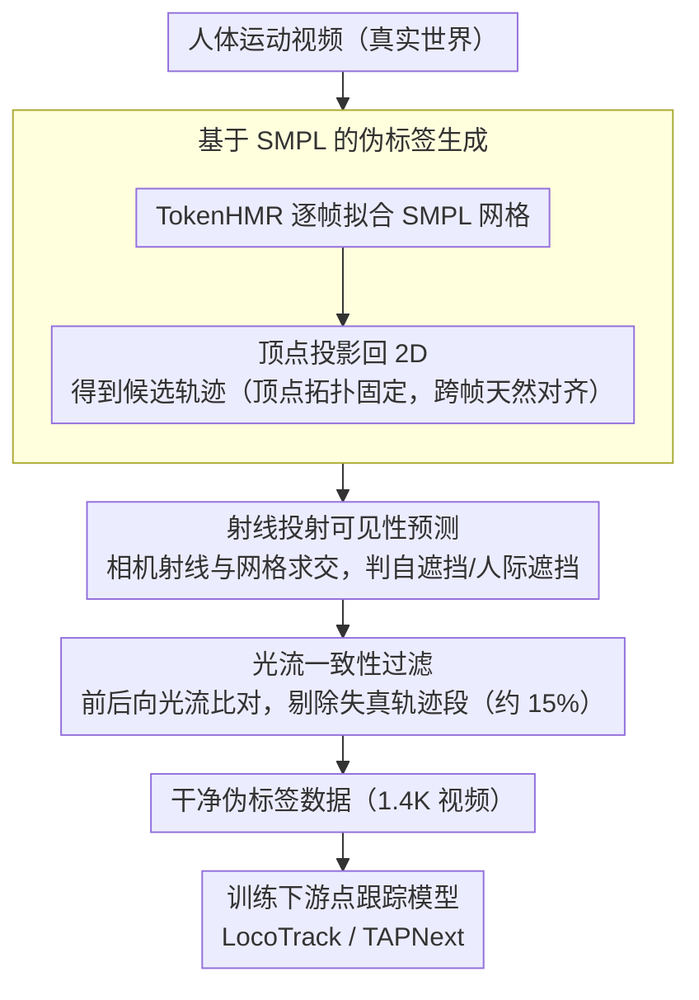

# AnthroTAP: Learning Point Tracking with Real-World Motion

**会议**: CVPR 2026  
**arXiv**: [2507.06233](https://arxiv.org/abs/2507.06233)  
**代码**: [Project Page](https://cvlab-kaist.github.io/AnthroTAP/)  
**领域**: 3D Vision / Point Tracking  
**关键词**: 点跟踪, 人体运动, 伪标签, SMPL, 光流一致性

## 一句话总结
AnthroTAP 提出了一种自动化管线，从真实人体运动视频中通过 SMPL 拟合和光流过滤生成大规模伪标签点跟踪数据，仅用 1.4K 视频 + 4 GPU 一天训练即达到TAP-Vid 基准的 SOTA 性能，超越使用 15M 视频的 BootsTAPIR。

## 研究背景与动机
**领域现状**：点跟踪（tracking any point）是计算机视觉的基础任务，广泛用于机器人、3D 重建、视频编辑等。

**现有痛点**：
   - 大规模训练数据几乎全靠合成（如 Kubric），但合成数据无法捕获真实世界的复杂视觉特征；
   - 手动标注点轨迹极其耗时耗力，无法规模化；
   - 自训练方法（BootsTAPIR、CoTracker3）需要海量视频（15M+）和大规模计算（256 GPU），且存在确认偏差。

**核心矛盾**：真实世界数据对泛化至关重要，但获取标注成本极高。如何高效获得高质量的真实世界点跟踪训练数据？

**本文切入角度**：人体运动天然包含非刚性形变、关节运动、频繁遮挡等复杂现象，且 SMPL 模型可自动建立点对应关系。

**核心 idea**：利用 SMPL 人体模型从真实视频自动生成伪标签轨迹 + 光流一致性过滤 = 高质量、低成本的真实世界训练数据。

## 方法详解

### 整体框架
AnthroTAP 想解决的是：真实世界点跟踪数据既贵又难标，而合成数据（如 Kubric）又缺真实纹理与运动。它的思路是把"标注"这件事外包给一个现成的人体模型——既然 SMPL 网格的每个顶点都对应一个固定的解剖位置，那么只要在视频里把人重建出来，顶点的运动轨迹就天然是一组已对齐、时间一致的伪标签，根本不用人手标。

整条管线是一个纯自动化的数据工厂：一段人体运动视频先送进 HMR 模型（TokenHMR）逐帧拟合出 SMPL 网格，网格顶点投影回 2D 得到一批候选轨迹；再用射线投射判断每个点在每帧是被自己或别人挡住、还是露在外面，给出可见性标签；最后用光流一致性把那些因拟合误差或场景遮挡而失真的轨迹段剔掉，剩下的就是干净的伪标签数据，直接喂给任意下游点跟踪模型训练。

### 关键设计

**1. 基于 SMPL 的伪标签生成：让人体网格自己当标注器**

手动标点轨迹无法规模化，合成数据又不真实，这一步要的是"从真实视频里零成本拿到对齐的轨迹"。做法是对每帧检测到的人用预训练 TokenHMR 拟合一个 SMPL 网格，得到 $N_v$ 个 3D 顶点，再投影到图像平面 $\mathbf{x}_{p,t,j} = \Pi(\mathbf{v}_{p,t,j})$ 作为该点的 2D 位置。关键在于 SMPL 的顶点拓扑是固定的——第 $j$ 个顶点在每一帧都对应同一处解剖位置（比如左肩某点始终是左肩那个点），所以跨帧的对应关系不需要额外匹配，天然成立。之所以选人体，是因为 SMPL 把复杂的非刚性人体运动压成了低维的姿态+形状参数，HMR 即便在运动模糊、关节大幅扭动这类极端情形下也能稳定重建，从而把"难标注"的真实运动转化成"可参数化"的可靠轨迹源。

**2. 射线投射可见性预测：用几何遮挡关系判断每个点露不露脸**

光有 2D 位置还不够——点跟踪模型必须知道某点这帧到底可不可见，错误的可见性标签会直接污染监督信号。AnthroTAP 从相机中心向目标顶点 $\mathbf{v}_{p,t,j}$ 发一条射线，用 Möller–Trumbore 算法检测它是否先撞上了任何人体网格三角面；一旦被挡，就置 $v_{p,t,j} = 0$。因为重建出的是带完整 3D 几何的网格，这种基于射线-三角求交的判定能精确处理自遮挡（手挡住躯干）和人际遮挡（一个人挡住另一个人）。它的边界也很明确：射线只和人体网格求交，所以家具、桌椅这类非人物体造成的遮挡它看不见——这个盲区正是下一步光流过滤要补的。

**3. 光流一致性过滤：用图像里真实的运动去捉 SMPL 的谎**

SMPL 只建模人、不建模场景，当一个人走到桌子后面被挡住时，SMPL 照样会"脑补"出他在桌后的正常位置，于是产生一段看似正常实则错误的轨迹；拟合本身的误差也会留下零散的坏点。光流不依赖任何人体先验，反映的是图像上真实发生的位移，因此可以拿它当裁判。具体做法是先算相邻帧的前向-后向光流并做一致性校验，圈出可信的光流区域；再把 SMPL 预测的逐帧位移和光流位移逐点比对，位移发散超过阈值的过渡帧标为不可靠。最后按轨迹粒度统计这种坏帧的比例：比例过高说明整条轨迹已经不可信，直接丢弃；比例不高则只切掉那几个不一致的帧、保留其余可靠段。实测约 15% 的轨迹被这一步剔除，换来的是显著更干净的监督。

### 损失函数 / 训练策略
- 不引入新损失，直接套用下游点跟踪模型（LocoTrack / TAPNext）原有的训练目标
- 数据规模：仅 1,400 段视频生成的伪标签（对照 BootsTAPIR 用的 15M 视频）
- 训练成本：4 GPU × 1 天

## 实验关键数据

### 主实验（TAP-Vid 基准, 256×256 分辨率）

| 方法 | 训练数据 | DAVIS First AJ | DAVIS Strided AJ | Kinetics First AJ | 说明 |
|------|---------|---------------|-----------------|-------------------|------|
| LocoTrack | Kubric | 63.0 | 67.8 | 52.9 | 合成数据基线 |
| BootsTAPIR | Kubric+15M | 61.4 | 66.2 | **54.6** | 15M 视频自训练 |
| **Anthro-LocoTrack** | Kubric+1.4K | **64.8** | **69.0** | 53.9 | 仅1.4K 真实视频 |
| TAPNext | Kubric | 62.4 | 65.4 | - | 基线 |
| BootsTAPNext | Kubric+15M | 65.2 | 68.9 | - | 自训练 |
| **Anthro-TAPNext** | Kubric+1.4K | **66.1** | **71.4** | - | 超越 10000× 数据量 |

### 消融实验

| 配置 | DAVIS AJ | 说明 |
|------|---------|------|
| 仅 Kubric | 63.0 | 合成数据基线 |
| + SMPL 轨迹（无过滤） | 63.5 | 带噪声的提升有限 |
| + 射线投射可见性 | 64.1 | 可见性标签重要 |
| + 光流过滤 | **64.8** | 完整管线最优 |

### 关键发现
- 人体运动伪标签仅 1.4K 视频即超越 15M 视频的自训练方法
- 在通用（非人体）物体跟踪基准（DAVIS、Kinetics 含动物、车辆等）上同样 SOTA
- 光流过滤是关键：约 15% 的轨迹被移除，但显著提升质量
- 人体运动的复杂性度量（轨迹复杂度和多样性）远高于 DriveTrack 等驾驶数据

## 亮点与洞察
- **核心发现引人深思**：人体运动的结构化复杂性是通用点跟踪的最佳训练信号
- 数据效率极高：用 11× 更少的视频超越 CoTracker3，10000× 更少帧超越 BootsTAPIR
- 管线简单有效：仅用 off-the-shelf 组件（HMR + 光流）组合
- 数据集非专有，可公开贡献给社区

## 局限与展望
- 仅利用人体运动，可能遗漏其他有价值的运动类型（如动物、流体）
- SMPL 不建模手部和面部细节，丢失了这些区域的精细轨迹
- HMR 模型对拥挤场景和极端遮挡的鲁棒性仍有限

## 相关工作与启发
- 与 DriveTrack（驾驶场景伪标签）互补：驾驶运动简单（主要刚体），人体运动复杂
- 思路可扩展：任何有参数化模型的物体（如动物用 SMAL）均可生成伪标签

## 评分
- 新颖性: ⭐⭐⭐⭐⭐ 人体运动作为通用点跟踪的训练信号是优雅的洞察
- 实验充分度: ⭐⭐⭐⭐⭐ 多基准×多跟踪器×丰富消融×与多个SOTA对比
- 写作质量: ⭐⭐⭐⭐⭐ 动机清晰，管线设计逻辑严密
- 价值: ⭐⭐⭐⭐⭐ 高效、可复现、有长期影响力的工作

<!-- RELATED:START -->

## 相关论文

- [\[CVPR 2026\] Learning a Particle Dynamics Model with Real-world Videos](learning_a_particle_dynamics_model_with_real-world_videos.md)
- [\[CVPR 2026\] Learning 3D Shape Fidelity Metric from Real-world Distortions](learning_3d_shape_fidelity_metric_from_real-world_distortions.md)
- [\[CVPR 2026\] KV-Tracker: Real-Time Pose Tracking with Transformers](kv-tracker_real-time_pose_tracking_with_transformers.md)
- [\[CVPR 2026\] OLATverse: A Large-scale Real-world Object Dataset with Precise Lighting Control](olatverse_a_large-scale_real-world_object_dataset_with_precise_lighting_control.md)
- [\[CVPR 2026\] Tracking by Predicting 3-D Gaussians Over Time](tracking_by_predicting_3-d_gaussians_over_time.md)

<!-- RELATED:END -->
