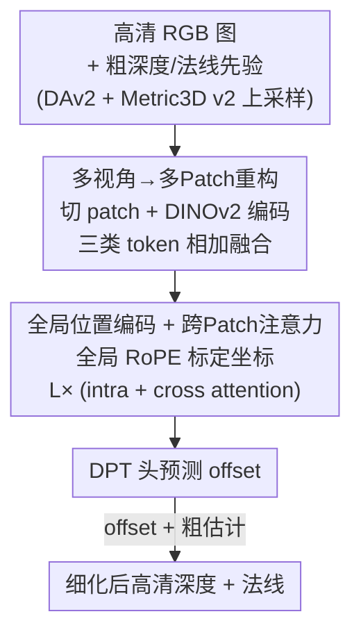

# Any Resolution Any Geometry: From Multi-View To Multi-Patch

**会议**: CVPR 2026  
**论文**: [CVF Open Access](https://openaccess.thecvf.com/content/CVPR2026/html/Cui_Any_Resolution_Any_Geometry_From_Multi-View_To_Multi-Patch_CVPR_2026_paper.html)  
**代码**: https://dreamaker-mrc.github.io/Any-Resolution-Any-Geometry （项目页）  
**领域**: 3D视觉  
**关键词**: 高分辨率深度估计, 表面法线, 多Patch Transformer, 跨Patch注意力, VGGT

## 一句话总结
把单张超高清图像拆成一堆 patch、当作 VGGT 里的"虚拟多视角"来联合处理，配上跨 patch 注意力做全局一致性推理，从而在一次前向里同时输出锐利且全局连贯的高分辨率深度图和表面法线，在 UnrealStereo4K 上把 AbsRel 从 0.0582 降到 0.0291。

## 研究背景与动机
**领域现状**：高分辨率深度/法线估计对 3D 重建、场景理解是刚需，但主流的联合深度-法线模型（GeoWizard、Metric3D v2）受显存和算力约束，只能在较低输入分辨率下跑，直接喂 4K/8K 图会明显糊掉细节。

**现有痛点**：为了上高分辨率，社区转向 patch-based 细化（PatchFusion、PatchRefiner、PRO 等），把图切块分别预测再拼回。但这条路有两个老毛病：① PatchRefiner 这类方法逐块**孤立**细化，相邻 patch 之间没有信息交换，拼缝处出现深度跳变和块状 artifact；② 这些 pipeline 基本只为**单纯深度**设计，很难扩展成联合深度-法线，无法在大尺度下同时保证两者几何一致。

**核心矛盾**：高分辨率几何预测本质上要同时满足两个相互拉扯的目标——既要保住物体边界、细杆等**局部细节**（要求小感受野、看局部），又要维持整图深度/法线场的**全局一致**（要求大感受野、看全局）。切 patch 解决了细节和显存，却牺牲了全局；不切 patch 保住全局，又喂不进高分辨率。

**切入角度**：作者注意到多视角 Transformer（DUSt3R、VGGT）已经证明"把一堆视角塞进统一 backbone、用注意力做全局信息传播"能很好地扩展几何预测。那么——能不能把**单张高分辨率图的各个 patch 当成"虚拟多视角"**？patch 之间的关系，恰好对应多视角之间的关系。

**核心 idea**：把"multi-view"范式迁移成"multi-patch"——一张高清图切成 patch，在一个共享 backbone 里联合处理，用跨 patch 注意力替代视角间注意力，从而既保住每块的局部细节、又通过全局 token 通信强制整图一致。基于此提出 Ultra Resolution Geometry Transformer (URGT)。

## 方法详解

### 整体框架
URGT 是一个**几何细化器（refiner）**：输入一张高分辨率 RGB 图 $I \in \mathbb{R}^{3 \times H \times W}$，先用现成基础模型（Depth-Anything v2 出粗深度 $D^{coarse}$、Metric3D v2 出粗法线 $n^{coarse}$）拿到低分辨率粗估计并双线性上采样对齐；然后把图和粗估计一起切成 patch，喂进一个统一 Transformer，输出**相对粗估计的 offset**，加回粗图得到细化后的高分辨率深度和法线。整条管线一次前向完成，关键在于让模型在 patch **内部**（局部细节）和 patch **之间**（全局一致）都能推理。

具体地，第 $k$ 个 RGB patch $J_k$ 及其对齐的粗深度 crop、粗法线 crop 各自经 DINOv2 编码成视觉 token、深度 token、法线 token，三者**逐元素相加**融合成几何感知表示 $t^{joint}_k = t_{J_k} + t_{D^{coarse}_k} + t_{n^{coarse}_k}$。所有 patch 的融合 token 拼成一条统一序列，过 $L$ 个交替「intra-patch attention + cross-patch attention」的 block，最后用轻量 DPT-style 预测头分别出深度 offset $\Delta^{Depth}_k$ 和法线 offset $\Delta^{Normal}_k$，得到 $D^{refined}_k = D^{coarse}_k + \Delta^{Depth}_k$、$n^{refined}_k = n^{coarse}_k + \Delta^{Normal}_k$。

> 训练侧另有两个设计——**GridMix 采样**（决定每次迭代怎么切 patch）和**几何一致监督**（用 GT 深度反推伪法线约束两个头），它们不在前向 pipeline 里，但是模型能学好的关键，放在关键设计 3、4 讲。

### 关键设计

**1. 多视角→多Patch重构：把单图 patch 当作虚拟视角联合处理**

这一条直接针对"切 patch 就丢全局"的痛点。作者复用 VGGT 这套为多视角设计的统一 Transformer，但把语义从"多视角"换成"多 patch"——一张高清图切出的各 patch 不再各自为政，而是像多个视角一样被塞进**同一个序列、同一个 backbone** 联合处理。每个 patch 不光带 RGB，还带上对齐的粗深度/粗法线 crop，三路经 DINOv2 编码后逐元素相加成 $t^{joint}_k$，让 token 一开始就是"几何感知"的（既知道长什么样，又知道大概多深、朝哪）。这样做的好处是：模型不是从零预测绝对深度，而是在一个还不错的粗先验上**学残差 offset**，任务更简单、更稳；同时把 patch 当虚拟视角，使后续的跨 patch 注意力成为天然可行的全局通信机制。

**2. 全局位置编码 + 跨Patch注意力：在保细节的同时强制全局一致**

切 patch 后，每个 patch 内部坐标都是从自己左上角 (0,0) 数起的，模型分不清两个 patch 里"同一物理位置"的 token，拼接时就会错位。作者给每个 patch $J_k$ 记一个在原图里的全局原点 $(x_k, y_k)$，把 patch 内局部坐标 $p_i=(u_i,v_i)$ 映射回全局坐标 $p^g_i = (u_i + x_k, v_i + y_k)$，再用这个全局坐标做 RoPE 编码 query/key（value 不变）。这样描述同一物理区域的 token 在不同 patch 间被一致对齐。

在此之上交替两种注意力：**intra-patch attention** 只在同一 patch 内部做 self-attention（$\text{softmax}(\tilde Q_c \tilde K_c^\top/\sqrt{d})\tilde V_c$），专注打磨局部细节和边界；**cross-patch attention** 在所有 patch 拼接后的全序列上做（$\text{softmax}(\tilde Q \tilde K^\top/\sqrt{d})\tilde V$），让每个 token 不仅看自己 patch，还能 attend 到所有其它 patch 的 token。一层先收敛局部、一层再全图交换，反复 $L$ 次。消融显示这是性能命门：去掉跨 patch 注意力 AbsRel 直接从 0.0500 恶化到 0.0678，拼缝重新冒出来；用局部 RoPE 替代全局 RoPE，一致性误差 CE 从 0.0635 暴涨到 0.2830。两者共同把"局部细节"和"全局连贯"这对矛盾解开。

**3. GridMix 采样：用概率化的多种切块方式当数据增强**

高分辨率训练数据稀缺，固定一种切法（比如永远 4×4）会让模型只见过一种 patch 布局、泛化差。GridMix 固定 patch 尺寸 $\frac{H}{4}\times\frac{W}{4}$，但每次迭代按预设概率分布 $P(\text{config}=M\times M)=p_M$（$\sum_{M=1}^4 p_M=1$）从四种配置里随机选一种：$M=1$ 随机采一个 patch、$M\in\{2,3\}$ 随机采一个 $M\times M$ 网格、$M=4$ 覆盖整图的固定 $4\times4$ 网格（采样时绿色合法区域保证网格不越界）。这相当于在"看局部一小块"和"看整图"之间提供多种粒度的训练样本，作为增强逼模型适应任意切块方式。消融里 $(p_1,p_2,p_3,p_4)=(0.1,0.2,0.3,0.4)$ 最优（AbsRel 0.0295），明显优于纯 1×1（0.0500）或纯 4×4（0.0321 但 CE 偏高 0.0635），印证混合粒度既保细节又保一致。

**4. 几何一致监督：用 GT 深度反推伪法线，把两个头绑在同一套几何上**

联合预测深度和法线若各管各的，两者可能互相打架（深度平滑但法线乱、或反之）。作者让两个头被**同一套底层几何**约束：从 GT 深度 $D^{gt}$ 用局部最小二乘反推一个伪法线场 $n^{pseudo}$ 作为法线监督。深度损失 $L_{depth}=L_{MSE}(D^{refined},D^{gt})+\lambda_{grad}L_{grad}(\cdot)$ 同时约束数值准确（MSE）和边界锐利（梯度项）；法线损失 $L_{normal}=L_{angle}(n^{refined},n^{pseudo})+\lambda_{mse}L_{MSE}(\cdot)$ 同时约束朝向和逐像素对齐；总损失 $L_{total}=\lambda_{depth}L_{depth}+\lambda_{normal}L_{normal}$。由于 $n^{pseudo}$ 完全由 GT 深度决定，深度头和法线头最终被同一几何约束，预测自然趋于几何自洽。模型还支持只开一个损失做"separate"训练（只预测深度或只预测法线）。实验表明 joint 训练比 separate 略好（AbsRel 0.0295→0.0291），印证深度-法线耦合带来互益。

### 损失函数 / 训练策略
见关键设计 4：深度损失（MSE + 梯度）、法线损失（角度 + MSE，监督来自 GT 深度反推的伪法线）、按 $\lambda$ 加权求和；训练时用 GridMix 概率化采样切块。粗先验由冻结的 Depth-Anything v2 / Metric3D v2 提供。

## 实验关键数据

### 主实验
UnrealStereo4K 上的深度与法线联合评测（4K 图，单图推理时间）：

| 方法 | 推理时间↓ | AbsRel↓ | δ1↑ | RMSE↓ | CE↓ |
|------|----------|---------|-----|-------|-----|
| Depth-Anything v2 | – | 0.0812 | 0.924 | 2.86 | – |
| PatchRefiner (p=16) | 1.02s | 0.0633 | 0.950 | 2.28 | 0.0753 |
| PatchRefiner (p=49) | 4.12s | 0.0582 | 0.956 | 2.17 | 0.0715 |
| PRO | 1.88s | 0.0771 | 0.927 | 2.73 | 0.0549 |
| **Ours (Separate)** | 0.94s | 0.0295 | 0.982 | 1.38 | 0.0418 |
| **Ours (Joint)** | 0.97s | **0.0291** | **0.983** | **1.31** | 0.0415 |

法线估计（UnrealStereo4K，角度误差）：

| 方法 | Mean↓ | Median↓ | RMSE↓ | <5°↑ | <11.25°↑ | <30°↑ |
|------|-------|---------|-------|------|----------|-------|
| Metric3D v2 | 23.36 | 33.15 | 13.90 | 11.74 | 44.96 | 79.77 |
| **Ours (Joint)** | **18.51** | **28.83** | **9.60** | **29.37** | **59.43** | **85.06** |

相比 PatchRefiner，AbsRel 降超 49%、RMSE 降超 35%，且推理只要 0.97s（PatchRefiner p=49 要 4.12s），又快又准。法线 Mean 角度误差从 23.36° 降到 18.51°。

零样本跨域泛化（在 Booster / ETH3D / Middlebury2014 上直接测，AbsRel↓）：

| 方法 | Booster | ETH3D | Middlebury2014 |
|------|---------|-------|----------------|
| DepthAnythingV2 | 0.0274 | 0.0507 | 0.0307 |
| PatchRefiner (p=49) | 0.0382 | 0.0577 | 0.0376 |
| PRO | 0.0287 | 0.0448 | 0.0287 |
| **Ours (Joint)** | **0.0248** | **0.0434** | **0.0280** |

### 消融实验
| 配置 | 关键指标 | 说明 |
|------|---------|------|
| GridMix (0.1,0.2,0.3,0.4) | AbsRel 0.0295 / CE 0.0418 | 混合粒度最优 |
| 纯 1×1 (1,0,0,0) | AbsRel 0.0500 / CE 0.0648 | 只看小块，细节有但全局差 |
| 纯 4×4 (0,0,0,1) | AbsRel 0.0321 / CE 0.0635 | 覆盖整图但一致性差 |
| Global RoPE | AbsRel 0.0321 / CE 0.0635 | 全局位置编码 |
| Local RoPE | AbsRel 0.0343 / CE **0.2830** | 局部编码 → 跨 patch 严重错位 |
| w/ Cross-Patch Attn | AbsRel 0.0500 / RMSE 2.01 | 完整模型 |
| w/o Cross-Patch Attn | AbsRel 0.0678 / RMSE 2.51 | 去掉后拼缝跳变明显 |

### 关键发现
- **跨 patch 注意力是命门**：去掉它 AbsRel 从 0.0500 恶化到 0.0678、RMSE 从 2.01 到 2.51，offset 图上 patch 拼缝重新变得明显——全局 token 通信对无缝高分辨率几何不可或缺。
- **全局 RoPE 对一致性的作用远大于对精度**：换成局部 RoPE，AbsRel 只小升（0.0321→0.0343），但 CE 从 0.0635 暴增到 0.2830，说明全局位置编码主要解决的是跨 patch 几何对齐，而非单块精度。
- **混合切块优于任何单一切法**：纯小块（1×1）保细节但 CE 差、纯整图（4×4）一致但 AbsRel 差，概率混合 (0.1,0.2,0.3,0.4) 两头兼顾。
- **joint 优于 separate**：深度-法线耦合带来互益，joint 在深度和零样本指标上都略胜 separate，且能一并输出高质量法线。
- **可扩展到 8K**：自适应多 patch 框架无需按分辨率重训，就能处理 in-the-wild 8K 图，保住细杆/高频纹理同时维持全局一致。

## 亮点与洞察
- **"patch = 虚拟视角"的范式迁移很优雅**：把成熟的多视角 Transformer（VGGT）几乎原样搬来解单图高分辨率问题，只换了语义和位置编码，省去从头设计高分辨率架构——这种"换个角度复用强 backbone"的思路可迁移到其它"需要全局推理但输入太大"的任务。
- **预测 offset 而非绝对值**：站在冻结基础模型的粗先验上学残差，把难任务降维成细化任务，既稳又能直接吃现成模型的泛化红利。
- **全局 RoPE 的妙处**：用一个简单的全局坐标偏移就把"各 patch 各自坐标系"统一，让标准 RoPE 自动具备跨 patch 对齐能力，零额外参数解决拼缝错位。
- **GridMix 把"怎么切图"变成数据增强**：训练时随机化切块粒度，本质是让模型见过各种 patch 布局，提升对任意分辨率/任意切法的鲁棒性，这个增强思路可复用到任何 patch-based 高分辨率 pipeline。

## 局限与展望
- **强依赖外部粗先验**：粗深度来自 Depth-Anything v2、粗法线来自 Metric3D v2，URGT 是 refiner 而非端到端预测器；若基础模型在某域整体崩了，残差细化也救不回来。
- **法线监督是"伪标签"**：$n^{pseudo}$ 由 GT 深度局部最小二乘反推，本身带噪，法线上限受制于深度 GT 质量与反推算法；⚠️ 正文 4.2 文字给的法线数值（mean 18.27 / RMS 9.42 / 5° 29.88%）与表 1 略有出入（18.51 / 9.60 / 29.37%），以表 1 为准。
- **计算/显存随 patch 数增长**：跨 patch 注意力是全序列 attention，patch 越多序列越长，8K 下的实际开销、能否再上更高分辨率，正文未给完整 scaling 曲线。
- **GridMix 概率是超参**：$(p_1,p_2,p_3,p_4)$ 需手调，最优值可能随数据/分辨率变化，缺乏自适应方案。

## 相关工作与启发
- **vs PatchRefiner / PatchFusion**：它们逐 patch 孤立细化，靠 test-time ensemble / 启发式融合 / 一致性损失事后补拼缝，代价是推理变慢；本文用跨 patch 注意力在**一次前向内**做全局通信，既快（0.97s vs 4.12s）又把一致性误差压得更低，且把方法从"只做深度"扩到"深度+法线"。
- **vs PRO**：PRO 联合处理分组的重叠 patch、引入 patch-consistency 监督，缓解局部不连续，但受限于 patch group 的有限感受野，全局一致仍不够；本文的全图跨 patch 注意力感受野是整张图，零样本指标全面超过 PRO。
- **vs Metric3D v2 / GeoWizard**：它们是低分辨率的联合深度-法线基础模型（Metric3D v2 用 canonical camera + 学习的深度-法线优化模块，GeoWizard 用扩散先验但慢）；本文不与之竞争"出粗先验"，而是站在它们肩上做高分辨率细化，法线角度误差较 Metric3D v2 大幅下降。
- **vs VGGT / DUSt3R**：源头是多视角 3D 重建的统一 Transformer；本文最大启发是把"多视角集合推理"重解释为"单图多 patch 推理"，证明 set-based geometry reasoning 不止适用于真·多视角。

## 评分
- 新颖性: ⭐⭐⭐⭐ "patch 当虚拟视角"把多视角范式迁移到单图高分辨率，角度新颖且自洽，但 backbone 与基础先验都是复用。
- 实验充分度: ⭐⭐⭐⭐⭐ 主实验 + 零样本三数据集 + GridMix/RoPE/跨patch注意力三组消融 + 8K 扩展，覆盖全面。
- 写作质量: ⭐⭐⭐⭐ 动机清晰、图文对照好，但正文与表格法线数值有小出入。
- 价值: ⭐⭐⭐⭐ 又快又准的高分辨率联合深度-法线细化器，可直接接在现成基础模型后，实用性强。

<!-- RELATED:START -->

## 相关论文

- [\[CVPR 2026\] ClipGStream: Clip-Stream Gaussian Splatting for Any Length and Any Motion Multi-View Dynamic Scene Reconstruction](clipgstream_clip-stream_gaussian_splatting_for_any_length_and_any_motion_multi-v.md)
- [\[CVPR 2026\] Block-Sparse Global Attention for Efficient Multi-View Geometry Transformers](block-sparse_global_attention_for_efficient_multi-view_geometry_transformers.md)
- [\[CVPR 2026\] SplatSuRe: Selective Super-Resolution for Multi-view Consistent 3D Gaussian Splatting](splatsure_selective_super-resolution_for_multi-view_consistent_3d_gaussian_splat.md)
- [\[CVPR 2026\] VGGT-Det: Mining VGGT Internal Priors for Sensor-Geometry-Free Multi-View Indoor 3D Object Detection](vggt-det_mining_vggt_internal_priors_for_sensor-geometry-free_multi-view_indoor_.md)
- [\[CVPR 2026\] Multi-view Pyramid Transformer: Look Coarser to See Broader](multi-view_pyramid_transformer_look_coarser_to_see_broader.md)

<!-- RELATED:END -->
