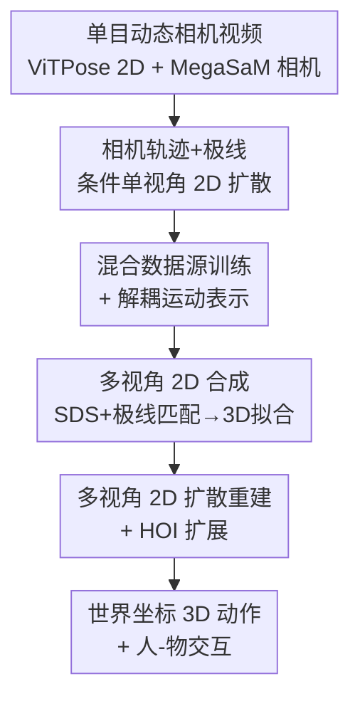

# AnyLift: Scaling Motion Reconstruction from Internet Videos via 2D Diffusion

**会议**: CVPR 2026  
**arXiv**: [2604.17818](https://arxiv.org/abs/2604.17818)  
**代码**: 项目页有视频结果（论文未给出明确仓库链接）  
**领域**: 3D视觉 / 人体动作重建 / 扩散模型  
**关键词**: 动作重建, 人物交互(HOI), 2D扩散先验, 动态相机, 多视角合成

## 一句话总结
AnyLift 用「先合成多视角 2D 运动数据、再训相机条件多视角 2D 扩散模型」的两阶段框架，把互联网单目动态相机视频里的 2D 关键点抬升成世界坐标系下的 3D 人体动作与人-物交互（HOI），无需任何 3D 监督就能重建体操、武术等 MoCap 里罕见的动作。

## 研究背景与动机

**领域现状**：大规模 3D 人体动作与 HOI 数据对动画、仿真、人形机器人策略学习都是刚需，但 MoCap 采集成本高、动作多样性差。从单目视频估计 3D 动作是更可扩展的替代路线，目前分两派——一派（WHAM、GVHMR）用 AMASS 这类 MoCap 做 3D 监督训练，另一派（ElePose、MAS、MVLift）只用领域内 2D 关键点做弱监督。

**现有痛点**：3D 监督派对分布内动作精度高，但对体操、武术这类 MoCap 罕见的剧烈动作泛化极差，因为这类动作的 3D 数据几乎无法采集；弱监督派里最接近本文的 MVLift 虽然能只靠 2D 恢复全局 3D 运动，却**假设训练和推理都是静态固定相机**，而真实互联网视频普遍是动态运镜、视角覆盖很窄。此外，把这套框架扩展到真实视频里的世界坐标 HOI 重建一直是开放问题。

**核心矛盾**：要规模化就得用海量互联网视频，但互联网视频天然带着「动态相机 + 视角覆盖不足」这两个 MVLift 框架处理不了的硬约束——动态相机让 2D 根节点平移的全局信息被相机运动污染，单一前向视角又让模型学不到跨视角一致性。

**本文目标**：(1) 让动态相机视频可用于训练和重建；(2) 在训练视角覆盖不足时仍能学到可靠的 2D 运动先验；(3) 把人体动作和 HOI 统一进同一个重建框架。

**切入角度**：沿用 MVLift「学 2D 运动先验来做 3D 重建」的思路（因为它能突破 MoCap 的动作多样性上限、且天然能把 HOI 纳入同一框架），但把条件从「无相机」升级为「相机轨迹 + 极线」，并补一套混合数据源策略来救视角覆盖。

**核心 idea**：用相机轨迹和极线作为 2D 扩散模型的条件，让模型在动态相机下也能学到全局 2D 平移与跨视角几何一致，再用「视频全局 2D + 现成估计器重投影局部 2D」的混合训练补足视角覆盖。

## 方法详解

### 整体框架
AnyLift 的输入是单目动态相机视频抽出的单视角 2D 关键点序列 $\mathbf{X}\in\mathbb{R}^{T\times K\times 2}$（用 ViTPose 抽 2D 姿态、MegaSaM 估相机运动），输出是世界坐标系下的 3D 人体动作 $\mathcal{H}$（SMPL 参数：根平移 $\mathbf{r}_t$、全局朝向 $\bm{\phi}_t$、身体姿态 $\bm{\Theta}_t$）以及（HOI 时）物体运动 $\mathcal{O}$。整条管线分两阶段：**Stage 1 合成多视角 2D 训练数据**——因为没有现成的多视角监督，先训一个条件单视角 2D 扩散模型当先验，用 SDS 把单视角"脑补"成多视角，再拟合成 3D 后重投影出干净的多视角 2D；**Stage 2 多视角 2D 扩散重建**——在合成数据上训一个带跨视角注意力的多视角扩散模型，推理时直接从真实单视角 2D 输入生成一致的多视角 2D，进而恢复世界坐标 3D 动作与 HOI。人体动作和 HOI 共用这套两阶段结构，区别只在 Stage 1 合成数据的来源：人体动作用互联网视频抽 2D，HOI 则把已有 3D HOI MoCap 序列在多样相机轨迹下重投影。

### 关键设计

**1. 相机轨迹 + 极线条件的单视角 2D 扩散：让动态相机不再是噪声而是信号**

MVLift 的扩散先验默认相机静止，一旦相机在动，2D 根节点平移里就混进了相机运动，模型分不清是人在走还是镜头在推。AnyLift 给单视角 2D 扩散模型加两组条件来拆开这个纠缠：**相机轨迹** $\mathbf{C}=\{\mathbf{C}_t\}_{t=1}^T$（每帧外参 $\mathbf{C}_t\in\mathbb{R}^{4\times 3}$，并减去首帧相机变换做归一化），让模型感知全局视角随时间的运动，从而在动态相机下学到正确的 2D 根平移；**极线** $\bm{l}=(a,b,c)^{\mathrm{T}}$（满足 $ax+by+c=0$），对每帧每个关键点配一条过该点与对应极点的极线，构成条件矩阵 $\mathbf{L}_t\in\mathbb{R}^{K\times 3}$，编码视角间的成对几何约束、鼓励跨视角一致。模型沿用 DDPM，前向加噪 $q(\mathbf{X}_n|\mathbf{X}_{n-1})=\mathcal{N}(\mathbf{X}_n;\sqrt{1-\beta_n}\mathbf{X}_{n-1},\beta_n\mathbf{I})$，反向用 Transformer 骨干直接预测干净样本 $\mathbf{X}_0$，条件 $\mathbf{C},\mathbf{L}$ 沿特征维与噪声序列拼接后经 MLP 编码送入，主损失是 $L_1$ 重建 $\mathcal{L}=\mathbb{E}_{\mathbf{X}_0,n}\|\mathbf{X}_0-\mathbf{X}_\theta(\mathbf{X}_n,n,\mathbf{C},\mathbf{L})\|_1$，再加一项极线匹配损失 $\mathcal{L}_{\text{line}}=\sum_{t=1}^T\langle\mathbf{L}_t,(\hat{\mathbf{X}}_t,\mathbf{1})\rangle$ 把去噪后的 2D 点拉到对应极线上。训练时按采样外参模拟若干固定极点，推理时极点由配对视角间的相对相机变换决定

**2. 混合数据源训练 + 解耦运动表示：把"视角太窄"用现成估计器的局部姿态补满**

体操这类互联网视频通常只有少数前向视角，不像 AIST++ 那样视角均匀，导致视角覆盖严重不足、先验学不到侧后方姿态。AnyLift 混合两路 2D 数据：(1) 真实视频抽出的全局 2D 关键点；(2) 用现成估计器（GVHMR）重建 3D 后重投影出的局部 2D $\mathbf{X}^{\text{proj}}$。由于这类估计器只在局部姿态上可靠，作者只取它们「根节点对齐到图像中心」的局部投影、丢掉全局平移。但直接混入 $\mathbf{X}^{\text{proj}}$ 会让模型偏向「几乎没有全局平移」的运动模式，于是把每段 2D 运动**解耦**为根平移 $\mathbf{X}^{\text{r}}\in\mathbb{R}^{T\times 2\times 2}$（两个髋关节表示）和局部姿态 $\mathbf{X}^{\text{l}}\in\mathbb{R}^{T\times(K-2)\times 2}$，全局运动 $\mathbf{X}^{\text{g}}$ 由「平均根平移 + 局部姿态」重组得到；扩散损失照 Eq.2 算，极线匹配只施加在全局运动 $\mathbf{X}^{\text{g}}$ 上。对重投影数据只在局部姿态上算扩散损失：$\mathcal{L}^{\text{proj}}=\mathbb{E}_{\mathbf{X}_0,n}\|\mathbf{M}\odot\mathbf{X}_0-\mathbf{M}\odot\mathbf{X}_\theta(\mathbf{X}_n^{\text{proj}},n,\mathbf{C},\mathbf{L})\|_1$，其中二值掩码 $\mathbf{M}$ 把两个髋关节排除在损失外，且不对 $\mathbf{X}^{\text{proj}}$ 施加极线匹配——这样既借了估计器的多视角局部姿态、又不让它污染全局平移先验

**3. 多视角 2D 合成：SDS 脑补 + 极线匹配收紧 + 3D 拟合产出干净监督**

有了上面的单视角 2D 先验，就用它把单视角序列"扩"成多视角。具体用 score distillation sampling，沿输入相机周围一圈均匀分布的视角额外优化 $V-1$ 个 2D 关键点序列 $\{\mathbf{X}_v\}_{v=1}^V$，SDS 梯度 $\nabla_{\mathbf{X}_v}\mathcal{L}_{\text{SDS}}=\mathbb{E}_{n,\epsilon}[w(n)(\epsilon_\theta(\mathbf{X}_{v,n},n,\mathbf{C},\mathbf{L})-\epsilon)]$ 让每个视角都服从学到的扩散先验。同时对任意两视角 $u,v$，用 $\mathbf{X}_u$ 和相对相机变换算出视角 $v$ 里的极线 $\mathbf{L}^{u\to v}$，施加 $\mathcal{L}^{u\to v}_{\text{line}}=\sum_{t=1}^T\langle\mathbf{L}^{u\to v}_t,(\mathbf{X}^{\text{g}}_{v,t},\mathbf{1})\rangle$ 强制几何一致；与 MVLift 不同，这里只在相邻视角之间、以及每个视角与输入视角之间算极线匹配，省计算。拿到大致一致的多视角 2D 后，先最小化多视角重投影误差恢复 3D 关节，再用 VPoser 拟合 SMPL 得到全身 3D 动作，最后把拟合好的 3D 重投影到四个均匀分布的相机，产出几何一致的多视角 2D 训练数据——这一步把"带噪的脑补结果"洗成"干净的多视角监督"，是 Stage 2 训练能成立的关键

**4. 多视角 2D 扩散重建 + HOI 扩展：一个模型同时吐人和物**

Stage 2 在 Stage 1 合成的多视角数据上训一个多视角 2D 扩散模型，从单视角输入直接生成多视角 2D 序列。它沿用 Stage 1 的相机条件嵌入方式，在 Transformer 骨干上增加**跨视角注意力**层增强多视角感知（沿 MVLift）。对 HOI，物体用人工设计的 2D 关键点 $\mathbf{O}\in\mathbb{R}^{T\times M\times 2}$ 表示（对应规范物体网格上的 3D 点 $\mathbf{P}=\{\mathbf{p}_i\}_{i=1}^M$），与人体关键点 $\mathbf{X}$ 拼成统一表示一起扩散；训练时随机 mask 掉部分 $\mathbf{O}$ 以应对遮挡和跟踪失败。推理真实视频时人体关键点与相机同前，物体关键点用 DELTA 跟踪、物体 3D 网格用手持扫描仪扫得高保真几何。最终人体 SMPL 由 Stage 1 同款优化得到，物体则先最小化多视角重投影误差恢复 3D 关键点 $\mathbf{Q}$，再结合规范关键点 $\mathbf{P}$ 估物体位姿 $\mathcal{O}_t=\{\mathbf{r}_t,\mathbf{t}_t,s\}$（$\mathbf{r}_t\in\mathbb{R}^6$ 是 6D 旋转、$\mathbf{t}_t\in\mathbb{R}^3$ 平移、$s$ 全局尺度）——这样人和物在统一框架里联合预测，避免了分别重建后对不齐

### 损失函数 / 训练策略
- 单视角扩散主损失：$L_1$ 重建 $\mathcal{L}$（Eq.2，直接预测 $\mathbf{X}_0$）。
- 极线匹配损失：$\mathcal{L}_{\text{line}}$（Eq.3，施加在全局 2D 运动 $\mathbf{X}^{\text{g}}$ 上）。
- 重投影局部损失：$\mathcal{L}^{\text{proj}}$（Eq.4，掩码 $\mathbf{M}$ 排除髋关节，不加极线匹配）。
- 多视角合成阶段：SDS 损失（Eq.5）+ 跨视角极线匹配 $\mathcal{L}^{u\to v}_{\text{line}}$（Eq.6，仅相邻视角与输入视角）。

## 实验关键数据

### 主实验

AIST++（J 类为像素误差、越低越好；FID/Troot/MPJPE/PA-MPJPE/FS 均越低越好），上半为静态相机、下半为合成动态相机：

| 设置 | 方法 | J2D | J2D^C | FID | Troot | MPJPE | PA-MPJPE | FS |
|------|------|-----|-------|-----|-------|--------|----------|-----|
| 静态 | WHAM (用AMASS) | 75.5 | 22.1 | 3.1 | 164.3 | 104.8 | 75.1 | 0.579 |
| 静态 | GVHMR (用AMASS) | 106.4 | 20.3 | 2.9 | 143.0 | 97.6 | 64.4 | 0.547 |
| 静态 | MVLift | 17.5 | 14.3 | 2.2 | 67.6 | 110.7 | 79.2 | 0.471 |
| 静态 | **AnyLift** | **16.6** | **13.3** | **2.1** | **64.9** | 108.0 | 82.3 | 0.475 |
| 动态 | MVLift | 18.0 | 14.9 | 2.1 | 64.9 | 122.1 | 94.3 | 0.487 |
| 动态 | **AnyLift** | **16.7** | **13.7** | **2.0** | **64.2** | **109.3** | **83.0** | **0.446** |

要点：静态下 AnyLift 在 2D 误差与根平移上全面超 MVLift，3D 关节误差与靠 AMASS 训练的 WHAM/GVHMR 相当但根平移大幅更优；动态相机下 AnyLift 几乎不掉点（MPJPE 108.0→109.3），而 MVLift 的 MPJPE 从 110.7 恶化到 122.1，体现对动态相机的鲁棒性。

自采互联网视频（体操 / 武术，越低越好）：

| 方法 | 体操 J2D | 体操 J2D^C | 体操 FID | 武术 J2D | 武术 J2D^C | 武术 FID |
|------|----------|------------|----------|----------|------------|----------|
| GVHMR | 71.5 | 18.8 | 13.0 | 66.3 | 15.9 | 6.0 |
| MVLift | 33.1 | 17.0 | 11.2 | 24.6 | 12.0 | 4.6 |
| **AnyLift** | **21.6** | **11.4** | **10.9** | **15.1** | **9.8** | **3.6** |

在 MoCap 罕见的剧烈动作上，AnyLift 把体操 J2D 从 MVLift 的 33.1 降到 21.6、武术从 24.6 降到 15.1，优势最明显。

HOI（BEHAVE，节选 box / table，越低越好；Troot^O、O-MPJPE 是物体指标）：

| 设置 | 方法 | box Troot | box MPJPE | box O-MPJPE | table Troot | table MPJPE | table O-MPJPE |
|------|------|-----------|-----------|-------------|-------------|-------------|---------------|
| 静态 | VisTracker | 51.72 | 54.40 | 359.50 | 65.18 | 85.51 | 540.96 |
| 静态 | **AnyLift** | **24.61** | **42.68** | **32.98** | **26.05** | **48.34** | **51.28** |
| 动态 | SMPLify | 82.21 | 126.12 | 185.48 | 77.19 | 119.42 | 149.91 |
| 动态 | **AnyLift** | **29.99** | **43.60** | **33.96** | **28.09** | **54.60** | **56.97** |

物体指标差距尤其悬殊：table 的 O-MPJPE 从 VisTracker 的 540.96 降到 51.28（约 1/10），且静态→动态几乎不退化，说明统一框架对动态相机 HOI 的泛化很强。300 人感知研究（2AFC）中，参与者在「地面接触」和「动作质量」上一致偏好 AnyLift（vs MVLift 61.3% / 65.4%，vs SMPLify 84.2% / 85.0%）。

### 消融实验

| 配置 | 体操 J2D | 体操 J2D^C | 体操 FID | 武术 J2D | 武术 J2D^C | 武术 FID |
|------|----------|------------|----------|----------|------------|----------|
| w/o Hybrid（仅视频2D） | 36.1 | 18.7 | 11.2 | 25.2 | 12.7 | 4.3 |
| **Full（含混合训练）** | **21.6** | **11.4** | **10.9** | **15.1** | **9.8** | **3.6** |

### 关键发现
- 混合数据源训练是窄视角场景的命门：去掉它体操 J2D 从 21.6 暴涨到 36.1、武术从 15.1 涨到 25.2，证明「现成估计器的多视角局部 2D」对补足视角覆盖至关重要。
- 动态相机鲁棒性是核心卖点：无论 AIST++ 还是 BEHAVE，AnyLift 静态→合成动态的退化都很小，而把 MVLift 适配到动态相机后明显掉点。
- HOI 物体指标的提升量级远大于人体指标，说明 VisTracker/SMPLify 主要败在物体位姿（对称物体抖动、深度歧义），而统一扩散框架联合预测人和物更稳。

## 亮点与洞察
- **把相机轨迹和极线当"条件"而非"待消除的干扰"**：MVLift 视动态相机为不可用，AnyLift 反过来把相机外参序列和极线喂进扩散模型当条件，直接解锁了海量互联网动态相机视频——这是从"回避问题"到"利用问题"的视角转换。
- **解耦根平移与局部姿态来安全地混入弱数据**：现成估计器局部准、全局烂，作者用掩码只取局部、丢全局，既蹭到估计器的多视角局部姿态、又不污染全局平移先验，是一个可迁移到任何"强弱数据混训"场景的干净 trick。
- **用 SDS + 3D 拟合自举出干净的多视角监督**：没有多视角真值就用单视角先验脑补、再经 3D 拟合洗成干净监督来训下一阶段，这种"先验自举数据"的两阶段范式可迁到其他缺多视角监督的 4D 重建任务。
- **人和物统一进同一扩散序列**：把物体 2D 关键点和人体关键点拼成统一表示一起扩散，并用随机 mask 模拟遮挡，避免分别重建后人物对不齐。

## 局限与展望
- 物体表示依赖人工设计的 2D 关键点和预扫描的规范 3D 网格，对未见过的、无法预扫的物体类别难以即插即用，HOI 仍按类别（box/chair/table）分别训模型。
- 整条管线重度依赖现成组件——ViTPose 抽 2D、MegaSaM 估相机、GVHMR 出局部姿态、DELTA 跟物体，任一环节失败都会向下游传播误差，论文未系统分析这种级联误差。
- 互联网视频部分仍是分类别训练（体操、武术各一个模型），尚未做到「一个模型吃所有动作类别」，真正的开放域规模化还有距离。
- Stage 1 的 SDS 优化逐序列进行，合成多视角训练数据的开销与可扩展性论文未给出量化分析。

## 相关工作与启发
- **vs MVLift**：本文直接构建在 MVLift 之上但补了三处关键缺口——MVLift 假设静态相机、无法用动态相机视频训练，AnyLift 用相机轨迹+极线条件解锁动态相机；MVLift 视角覆盖不足时会崩，AnyLift 用混合数据源+解耦表示救场；MVLift 的 HOI 依赖预先从 MoCap 重投影的 2D、不处理真实视频，AnyLift 扩展到真实视频里用 DELTA 跟踪的物体关键点。
- **vs WHAM / GVHMR（3D 监督派）**：它们靠 AMASS 等 MoCap 做 3D 监督，分布内精度高但对体操/武术泛化差；AnyLift 只学 2D 先验、不需 3D 监督，在 MoCap 罕见动作上反超，且根平移精度明显更好。
- **vs VisTracker（HOI）**：VisTracker 用可见性感知网络从单 RGB 联合跟踪人/物/接触，但假设静态相机、关注相对运动且对对称物体抖动；AnyLift 在世界坐标下联合重建人与物、支持动态相机，物体指标大幅领先。
- **vs SMPLify**：纯 2D 重投影优化、无训练，易陷局部最优、深度歧义大；AnyLift 用学到的扩散先验消歧，重建更稳更真。

## 评分
- 新颖性: ⭐⭐⭐⭐ 把相机轨迹/极线作为 2D 扩散条件、并用解耦混合训练救视角覆盖，是对 MVLift 的实质性升级，但整体仍是该路线的延伸。
- 实验充分度: ⭐⭐⭐⭐ 覆盖 AIST++/自采互联网视频/BEHAVE，含静态与动态相机、300 人感知研究，唯消融较单薄（主要消融混合训练一项）。
- 写作质量: ⭐⭐⭐⭐ 两阶段结构清晰、公式完整，人体与 HOI 分支讲得分明。
- 价值: ⭐⭐⭐⭐ 直指「用互联网视频规模化 3D 动作/HOI 数据」这一刚需，动态相机鲁棒性与 HOI 物体重建提升显著。

<!-- RELATED:START -->

## 相关论文

- [\[CVPR 2026\] DuoMo: Dual Motion Diffusion for World-Space Human Reconstruction](duomo_dual_motion_diffusion_for_world-space_human_reconstruction.md)
- [\[CVPR 2026\] Motion 3-to-4: 3D Motion Reconstruction for 4D Synthesis](motion_3-to-4_3d_motion_reconstruction_for_4d_synthesis.md)
- [\[CVPR 2026\] Learning Explicit Continuous Motion Representation for Dynamic Gaussian Splatting from Monocular Videos](learning_explicit_continuous_motion_representation_for_dynamic_gaussian_splattin.md)
- [\[CVPR 2026\] PAD-Hand: Physics-Aware Diffusion for Hand Motion Recovery](pad-hand_physics-aware_diffusion_for_hand_motion_recovery.md)
- [\[CVPR 2026\] Lifting Unlabeled Internet-level Data for 3D Scene Understanding](lifting_unlabeled_internet-level_data_for_3d_scene_understanding.md)

<!-- RELATED:END -->
