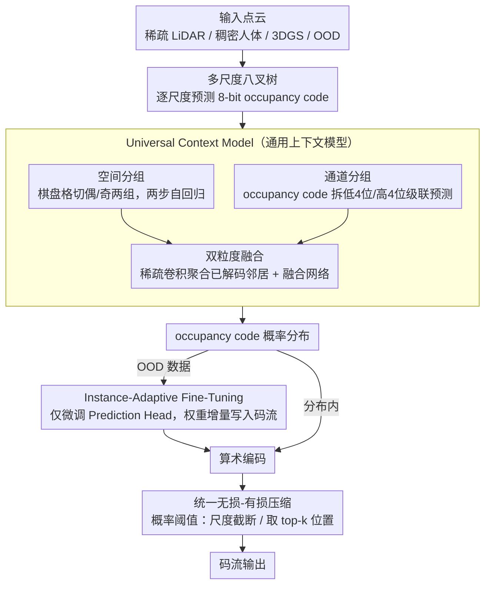

# AnyPcc: Compressing Any Point Cloud with a Single Universal Model

**会议**: CVPR 2026  
**arXiv**: [2510.20331](https://arxiv.org/abs/2510.20331)  
**代码**: [anypcc.github.io](https://anypcc.github.io)  
**领域**: 3D视觉  
**关键词**: point cloud compression, universal context model, instance-adaptive fine-tuning, occupancy code, lossless/lossy compression

## 一句话总结

提出 AnyPcc，通过 Universal Context Model（融合空间+通道双粒度先验）和 Instance-Adaptive Fine-Tuning（实例自适应微调）策略，用单一模型在 15 个多样化数据集上实现 SOTA 点云几何压缩，相比 G-PCC v23 获得 ~12% 的码率增益。

## 研究背景与动机

**点云压缩需求迫切**：自动驾驶、VR 等 3D 应用大规模普及，点云作为标准 3D 数据格式，高效几何压缩对降低存储和传输成本至关重要。

**现有方法泛化能力差**：已有学习方法在标准 benchmark 上表现好，但在真实场景中性能急剧下降，面对不同密度（稀疏 LiDAR vs. 稠密重建）和分布外（OOD）数据束手无策。

**上下文模型密度敏感**：已有 spatial-prior 方法（如 Unicorn）在稀疏场景下不可靠，而 channel-wise 方法（如 RENO）虽然对稀疏数据鲁棒，但忽略了粗粒度结构信息，两类方法各有偏科。

**OOD 数据是核心瓶颈**：即使 Unicorn-U 等号称通用的模型，在医学扫描、3D Gaussian Splats、Dust3R/VGGT 重建等新型点云上仍然崩溃，因为缺乏高效的分布外适应机制。

**隐式压缩太慢**：INR 方法（每个实例从头训练一个网络）泛化能力强但编码时间不可接受，无法实际部署。

**缺乏统一框架**：现有方法要么针对稠密物体、要么针对稀疏 LiDAR，没有一个单一模型能同时处理所有类型点云并支持无损/有损压缩。

## 方法详解

### 整体框架

AnyPcc 要回答的问题是：能不能用**一个**模型把从稀疏 LiDAR 到稠密人体、再到从没见过的 3D Gaussian Splat 全都压好？它的做法是把点云组织成多尺度八叉树(octree)，于是几何压缩就变成一个逐尺度的概率预测任务——从最粗的尺度往最细的尺度走，每个体素是否被占据由一个 8-bit 的 occupancy code 描述，模型只要把每个 code 的概率分布预测准，算术编码器就能据此把码流压到接近熵的下界。

整条管线由三件事串起来：**Universal Context Model (UCM)** 从粗到细逐尺度吐出 occupancy code 的概率，负责把"上下文"建得足够强、且对密度不敏感；**Instance-Adaptive Fine-Tuning (IAFT)** 在编码每个实例时临时微调几个参数，专治分布外(OOD)点云；最后一个概率阈值机制让同一个无损模型顺手也能做有损压缩。编码时，UCM 预测概率 → 算术编码；遇到 OOD 数据，IAFT 再补一轮微调并把权重增量塞进码流。解码端镜像执行即可还原几何。

### 关键设计

**1. Universal Context Model：让一个上下文模型同时吃透稀疏和稠密点云**

已有方法在这里是"偏科"的：Unicorn 这类靠**空间先验**（看邻居体素）的模型在稠密物体上很准，但点一稀疏邻居就没了、预测立刻崩；RENO 这类靠**通道先验**（把 occupancy code 自己的比特拆开预测）的模型对稀疏数据鲁棒，却丢掉了粗粒度的结构信息。UCM 的思路是把两种先验在每个尺度上都用上，并让它们互相补位。

具体分两条线。**空间分组**把当前尺度的 occupancy code 按 3D 棋盘格切成两组——坐标和为偶数的一组、为奇数的一组，构成一个两步自回归：先编/解第一组，预测第二组时就能用上第一组刚解出来的邻居。**通道分组**则把每个 8-bit 的 occupancy code 沿比特维拆成低 4 位、高 4 位两个子符号，做级联预测：先猜低 4 位，再以它为条件猜高 4 位，等于在不依赖空间邻居的前提下也能榨出一层上下文。两条线在"预测第二空间组"时汇合——用稀疏卷积把第一组已解码 code 的特征聚合过来，再经一个融合网络和原始上下文拼在一起，让粗、细两种粒度的信息深度交互。

之所以敢这么拼，是因为作者给了两条理论支撑。Theorem 1 证明沿通道维做自回归和在空间子体素上做自回归在信息论上是等价的，所以通道分组并不是"额外的 trick"，而是空间建模的另一种写法；Theorem 2 证明直接在 occupancy code 空间做稀疏卷积，其感受野等效于在更细的体素空间做 2 倍核宽的卷积——这对稀疏点云尤其值钱，因为它用更小的算力换到了更大的有效视野。这也解释了消融里那个反直觉的现象：单独开通道分组几乎没用（CR-Gain 只有 +0.13%），它必须和空间先验配合，等价关系才能真正兑现成压缩增益。

**2. Instance-Adaptive Fine-Tuning：用几秒微调把"通用模型"临时变成"专用模型"**

UCM 再通用，碰到训练时完全没见过的点云（医学扫描、VGGT/Dust3R 重建、3DGS）还是会吃力。两条老路各有死穴：INR 给每个实例从零训一个网络，泛化最好但编码要几十分钟，没法部署；固定的预训练模型编码快，却对 OOD 数据无能为力。IAFT 取中间——只在编码这一个实例时，临时微调 UCM 里极少的一部分参数，再把这点权重增量也写进码流，解码端拿到后就能复现这个"临时专用模型"。

关键在于"只动哪几个参数"。UCM 被切成冻结部分 $\Theta_{\text{frozen}}$（特征提取 + 稀疏卷积，占了绝大多数参数）和可调部分 $\Theta_{\text{tune}}$（仅 Prediction Head 的线性层）。编码时先跑一次前向、把冻结部分的输出缓存下来，之后的迭代就只在缓存特征上优化 $\Theta_{\text{tune}}$，所以 ~200 次迭代几秒就能收敛，而不用反复跑整个骨干。优化完的权重经均匀标量量化后用 DeepCABAC 编码进码流。这笔账非常划算：在 GS 数据集上权重传输只多花 0.319 bpp，却让几何编码省下 1.883 bpp，净赚 1.564 bpp。

**3. 统一的无损-有损压缩：一个概率阈值机制覆盖两种场景**

无损框架本身就能顺手做有损，靠的是在概率预测上加一道阈值，对两类点云分别处理。稀疏 LiDAR 点云直接省略最细 $n$ 个尺度的编码，用尺度截断换码率。稠密点云则更巧：编码器只额外传一个目标尺度的真实点数 $k$，解码端按 UCM 预测的概率从高到低挑出 $k$ 个位置重建几何。两种模式共用同一套权重、不需要再训练，这让"一个模型打通无损/有损"成为可能。

## 损失函数与训练策略

- **预训练阶段**：在大规模混合数据集（KITTI, Ford, 8iVFB, MVUB, ScanNet, GausPcc-1K, Thuman 等）上训练 UCM，损失为 occupancy code 的负对数似然（交叉熵）。
- **IAFT 阶段**：实例级微调损失 = 负对数似然 + λ_L1 · ||Θ_tune||₁，L1 正则促进权重稀疏以减少传输开销。
- **两个版本**：Ours（按数据类别分别训练专用模型）和 Ours-U（单一统一模型训练，同一权重应用于所有测试集）。

## 实验关键数据

**表1：15 个数据集无损压缩性能 (bpp↓)**

| 数据集 | 难度 | OOD | RENO | SparsePCGC | OctAttention | TopNet | GPCC v23 | **Ours** | **Ours-U** |
|--------|------|-----|------|------------|--------------|--------|----------|----------|------------|
| 8iVFB | E | ✗ | 0.70 | 0.57 | 0.68 | 0.59 | 0.76 | **0.54** | 0.57 |
| MVUB | E | ✗ | 1.00 | 0.69 | 0.76 | 0.69 | 0.94 | **0.67** | 0.75 |
| Thuman | E | ✗ | 1.64 | 1.70 | 2.31 | 2.20 | 2.00 | **1.58** | 1.64 |
| KITTI | E | ✗ | 7.06 | 6.80 | 7.21 | 6.85 | 8.19 | **6.18** | 6.45 |
| GS | M | ✗ | 13.89 | 15.82 | 11.31 | 10.95 | 14.46 | **11.65** | 11.74 |
| VGGT | M | ✓ | 8.24 | 7.84 | 8.22 | 7.83 | 7.33 | 7.30 | **7.06** |
| S3DIS | M | ✓ | 13.06 | 11.88 | 11.52 | 10.84 | 10.66 | 10.93 | **10.79** |
| CS | H | ✓ | 3.94 | 4.94 | 3.40 | 3.21 | 3.23 | 3.18 | **3.08** |
| **CR-Gain vs GPCC** | | | 2.96% | 2.07% | 1.32% | -4.04% | 0% | **-11.93%** | -10.75% |

**表2：UCM 消融实验（各组件贡献）**

| 配置 | 空间卷积(SC) | 空间分组(SG) | 通道分组(CG) | CR-Gain | 参数量(M) |
|------|:-----------:|:-----------:|:-----------:|---------|----------|
| Baseline | ✗ | ✗ | ✗ | 0.00% | 5.15 |
| 仅 SG | ✗ | ✓ | ✗ | -6.56% | 5.68 |
| 仅 CG | ✗ | ✗ | ✓ | +0.13% | 5.15 |
| SC+SG | ✓ | ✓ | ✗ | -7.74% | 9.78 |
| SC+CG | ✓ | ✗ | ✓ | -5.33% | 7.19 |
| **全部 (Ours)** | ✓ | ✓ | ✓ | **-9.88%** | 9.77 |

关键发现：单独使用 CG（如 RENO 的做法）几乎无效（+0.13%），必须与 SC/SG 协同才能释放潜力。

**表3：IAFT 对 GS 数据集的码率分解**

| 指标 | 仅 UCM | UCM + IAFT |
|------|--------|------------|
| 熵编码 bpp | 13.307 | 11.424 |
| 权重传输 bpp | 0 | 0.319 |
| **总 bpp** | 13.307 | **11.743** |

权重传输仅增加 0.319 bpp，但几何编码节省 1.883 bpp，净减 1.564 bpp。

## 亮点与洞察

1. **理论与实践统一**：通过两个定理严格证明了通道-空间建模的等价性和感受野优势，再据此设计 UCM，理论指导实践非常扎实。
2. **显式-隐式压缩的优雅融合**：IAFT 巧妙地将 INR 的实例适配能力嫁接到预训练模型上，编码仅需几秒而非从头训练的几十分钟，实用性极强。
3. **单一模型的通用性**：Ours-U 用同一套权重处理 15 个跨度极大的数据集（稀疏 LiDAR / 稠密人体 / 3DGS / 噪声点云），在 OOD 数据上甚至优于专用模型。
4. **极全面的评测**：构建了包含 15 个数据集的 benchmark，涵盖标准集和极端场景（噪声/dropout/形变），远超同领域常见评测规模。
5. **解码效率优异**：解码时间与最快基线 RENO 相当（0.46s vs 0.23s），编码时间可通过调节 IAFT 迭代数在 0.44s-2.84s 间灵活控制。

## 局限性

1. **编码时间开销**：启用 IAFT 后编码时间从 0.44s 增至 ~12s（800 次迭代），在实时性要求高的场景（如 live streaming）可能不够快。
2. **参数量偏大**：完整模型 68.39M 参数，虽然 Ours-U 仅 9.77M，但相比 RENO（9.03M）并无明显优势，且 IAFT 需要在编码端进行梯度反传。
3. **有损压缩策略较朴素**：稠密点云的有损方案（选概率最高的 k 个位置）缺乏率失真优化，可能不是最优的 R-D 权衡。
4. **训练数据依赖**：UCM 的泛化能力仍依赖于训练数据的多样性，对完全未见类型的点云（如分子结构）效果有待验证。

## 相关工作与启发

- **Unicorn/Unicorn-U**：最接近的竞争者，尝试统一架构但仍依赖非统一的注意力+卷积混合设计，OOD 泛化差。AnyPcc 用纯卷积 UCM + IAFT 彻底解决。
- **RENO**：channel-wise occupancy code 预测的先驱，但消融实验表明单独使用通道分组几乎无效，必须与空间先验协同。
- **INR 压缩（NeRF/3DGS 相关）**：IAFT 可以看作 INR 的"轻量化"版本，仅微调最后一层而非整个网络，启发：parameter-efficient fine-tuning 在压缩领域也大有可为。
- **DeepCABAC**：用于权重编码的上下文自适应二进制算术编码，是将网络参数本身作为数据高效传输的关键技术，值得在其他 model-in-the-loop 场景借鉴。

## 评分

- **新颖性**: ⭐⭐⭐⭐ — 空间-通道双粒度上下文融合和 IAFT 显式-隐式融合策略都是领域首创，理论证明加分
- **实验充分度**: ⭐⭐⭐⭐⭐ — 15 个数据集、6 个基线、完整消融、无损+有损、时间/参数分析，非常全面
- **写作质量**: ⭐⭐⭐⭐ — 结构清晰，理论推导严谨，图表信息量大，动机论述到位
- **价值**: ⭐⭐⭐⭐ — 单一模型通用压缩是实际部署的刚需，IAFT 策略可推广到其他 3D 数据压缩任务

<!-- RELATED:START -->

## 相关论文

- [\[ECCV 2024\] SegPoint: Segment Any Point Cloud via Large Language Model](../../ECCV2024/3d_vision/segpoint_segment_any_point_cloud_via_large_language_model.md)
- [\[CVPR 2026\] Deformation-based In-Context Learning for Point Cloud Understanding](deformation-based_in-context_learning_for_point_cloud_understanding.md)
- [\[CVPR 2026\] APC: Transferable and Efficient Adversarial Point Counterattack for Robust 3D Point Cloud Recognition](apc_adversarial_point_counterattack.md)
- [\[CVPR 2026\] Adapting Point Cloud Analysis via Multimodal Bayesian Distribution Learning](adapting_point_cloud_analysis_via_multimodal_bayesian_distribution_learning.md)
- [\[CVPR 2026\] QD-PCQA: Quality-Aware Domain Adaptation for Point Cloud Quality Assessment](qd-pcqa_quality-aware_domain_adaptation_for_point_cloud_quality_assessment.md)

<!-- RELATED:END -->
