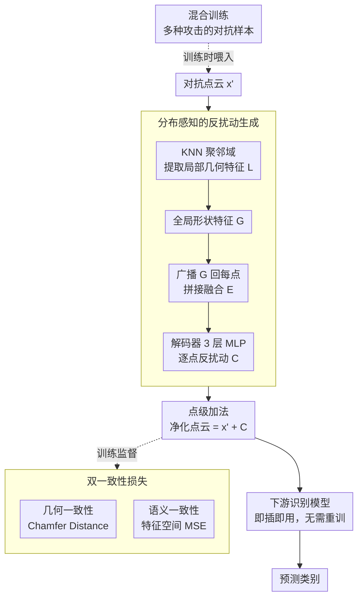

# APC: Transferable and Efficient Adversarial Point Counterattack for Robust 3D Point Cloud Recognition

**会议**: CVPR 2026  
**arXiv**: [2604.15708](https://arxiv.org/abs/2604.15708)  
**代码**: [https://github.com/gyjung975/APC](https://github.com/gyjung975/APC)  
**领域**: 3D视觉  
**关键词**: 对抗防御, 3D点云, 反扰动, 跨模型迁移, 输入级净化

## 一句话总结

APC 提出一种轻量级输入级净化模块，通过生成逐点反扰动来中和对抗攻击，同时在几何一致性和语义一致性双重约束下训练，实现了跨攻击和跨模型的强鲁棒性。

## 研究背景与动机

**领域现状**：3D 点云识别中的对抗防御方法分为两类——输入级防御（直接操作输入数据，如 SOR、IF-Defense）和模型级防御（如对抗训练、混合训练）。

**现有痛点**：输入级防御方法因在数据空间操作而具有天然的跨模型迁移性，但防御效果较弱；模型级防御效果强但缺乏迁移性，每个模型都需要从头重新训练。两类方法在鲁棒性和迁移性之间存在明显的 trade-off。

**核心矛盾**：现有输入级防御只是间接地通过数据操作（如去除离群点、重建表面）来恢复干净样本，而没有利用显式的防御目标来学习如何精确地逆转攻击扰动。

**本文目标**：设计一种同时具备强鲁棒性和高迁移性的防御方法。

**切入角度**：将对抗防御视为"反攻击"——不是被动地去噪/重建，而是主动生成一个"反扰动"来中和攻击扰动。

**核心 idea**：训练一个轻量级编码器-解码器模块，输入对抗样本后生成逐点的反扰动，通过点级加法将对抗样本净化为接近干净样本的形式。

## 方法详解

### 整体框架

APC 要解决的问题是：怎样让一个防御模块既能强力中和攻击、又能直接迁移到任意识别模型上而不必重训。它的答案是把防御从"被动去噪/重建"改成"主动反攻击"——训练一个轻量级编码器-解码器，吃进一份对抗点云 $x'$，吐出一份逐点的反扰动 $C \in \mathbb{R}^{N \times 3}$，然后用最朴素的点级加法把两者合并：

$$\tilde{x}' = x' + C$$

得到的 $\tilde{x}'$ 就是净化后接近干净样本的点云，再喂给下游识别模型。整个模块只在数据空间里操作，与具体识别网络解耦，所以一旦训好就能挂在任何受害模型前面。训练时用成对的干净-对抗样本，让网络学会"看到什么样的扰动该回填什么样的修正"，监督信号同时落在几何坐标和高层语义两个空间上。

### 关键设计

**1. 分布感知的反扰动生成：让每个点的修正既看邻域又看全局形状**

把"逆转攻击"交给网络去学，最大的风险是它只盯着单点坐标做局部回填，结果抹平了物体整体结构。APC 的编码器因此设计成局部-全局-融合三段递进。先用 KNN 把每个点和它的近邻聚到一起，提取抑制局部噪声的局部几何特征 $L = g^{local}([\text{repeat}_k(x'); P])$；再在 $L$ 之上抽取刻画整体轮廓的全局形状特征 $G = g^{global}(L)$；最后把全局特征广播回每个点、与局部特征拼接做融合 $E = g^{fusion}([L; \text{repeat}_N(G)])$。解码器是一个 3 层 MLP（GeLU 激活），把融合特征映射成每点的 3D 反扰动。这样生成的 $C$ 对每个点都是"针对性"的：局部分支负责压住该点被攻击注入的抖动，全局分支保证修正后不破坏物体形状的一致性。

**2. 双一致性损失：几何和语义两条线一起把净化样本拉回干净分布**

只在坐标层面把点拉回原位，未必能把识别模型真正读到的高层语义也修好——攻击的本意就是让特征空间里的类别表示发生偏移。APC 因此用两个互补的约束同时监督。几何一致性用 Chamfer Distance 约束净化点云与干净点云的坐标距离 $\mathcal{L}_{geo}$，负责修复被扰动打乱的局部几何；语义一致性用 MSE 约束净化样本与干净样本在受害模型特征空间里的全局特征相似 $\mathcal{L}_{sem}$，负责把被攻击拽偏的高层表示拉回来。再加上保证分类正确的交叉熵项，总损失写成：

$$\mathcal{L} = \mathcal{L}_{ce} + \alpha \cdot \mathcal{L}_{geo} + \beta \cdot \mathcal{L}_{sem}$$

消融实验里两项缺一都明显掉点，正说明几何修坐标、语义修表示，是两件不能互相替代的事。

**3. 混合训练：用多种攻击的对抗样本喂一个 APC，换来跨攻击泛化**

一个现实陷阱是：只拿单一攻击（如只用 PGD）的对抗样本训练，APC 会过拟合到那种扰动模式上，遇到别的攻击就失灵——论文实验里单攻击训练在跨攻击场景下掉到 76.5。原因很直接，不同攻击（Add、Cluster、Perturb、KNN、PGD、HiT 等）注入的扰动结构差异很大。APC 的做法是把这些攻击产生的对抗样本混在一起训练，逼网络学到一种更通用的"消除扰动"能力，而不是记住某一种攻击的指纹，从而对训练时见过和没见过的攻击都能防。

### 损失函数 / 训练策略

最终目标是交叉熵、几何一致性 $\mathcal{L}_{geo}$、语义一致性 $\mathcal{L}_{sem}$ 三项按 $\alpha$、$\beta$ 加权的组合，对抗样本从多种攻击类型中混合采样。APC 训练完成后参数固定，推理阶段只需一次前向传播即可净化输入，计算开销极小，也正是它能即插即用挂到任意模型前的原因。

## 实验关键数据

### 主实验

| 防御方法 | 类型 | PointNet Avg | PointNet++ Avg | DGCNN Avg |
|---------|------|-------------|---------------|-----------|
| No Defense | - | 6.0 | 41.4 | 26.2 |
| SOR | 输入级 | 65.8 | 75.1 | 69.3 |
| IF-Defense | 输入级 | 80.6 | - | - |
| HT | 模型级 | 80.1 | - | - |
| **APC** | **输入级** | **84.7** | **85.6** | **85.3** |

### 消融实验

| 配置 | ModelNet40 Avg |
|------|---------------|
| APC（完整） | 84.7 |
| w/o 语义一致性 | 82.3 |
| w/o 几何一致性 | 80.1 |
| 单攻击训练（仅 PGD） | 76.5（跨攻击下降明显） |

### 关键发现

- APC 作为输入级方法不仅超越所有输入级防御，还超越了模型级防御（AT、HT），同时保持跨模型迁移性
- 跨模型实验中，APC 在未见模型上的防御效果显著优于现有输入级方法，验证了强迁移性
- 双一致性损失缺一不可，几何损失对恢复坐标精度至关重要，语义损失对保持识别正确率至关重要
- 推理时仅需一次 APC 前向传播，参数量和计算开销极小

## 亮点与洞察

- **"反攻击"思路简洁优雅**：不是去噪或重建，而是主动生成反扰动。这种逆向思维让输入级方法首次在鲁棒性上超越模型级方法
- **即插即用的实用性**：APC 训练一次后可直接迁移到任意模型，无需重新训练，极大降低了部署成本
- **迁移到 2D 的可能**：虽然本文聚焦 3D 点云，但反扰动的思路完全可以迁移到 2D 图像对抗防御中

## 局限与展望

- 需要预先准备多种攻击的对抗样本进行训练，训练数据的攻击类型覆盖范围会影响泛化性
- 语义一致性损失依赖受害模型的特征提取器，对受害模型有轻微依赖
- 面对自适应攻击（知道 APC 存在的攻击者）的鲁棒性尚未评估

## 相关工作与启发

- **vs IF-Defense**: IF-Defense 在推理时迭代优化点坐标以恢复表面，计算量大；APC 一次前向即可，快且效果好
- **vs 混合训练(HT)**: HT 是模型级方法需重训受害模型，APC 作为输入级方法达到更好效果且可迁移
- **vs DUP-Net**: DUP-Net 通过上采样+重建来恢复缺失细节，APC 直接生成逐点修正，更精准

## 评分

- 新颖性: ⭐⭐⭐⭐ 反扰动的思路在 3D 点云防御中新颖，同时兼顾鲁棒性和迁移性
- 实验充分度: ⭐⭐⭐⭐⭐ 11 种攻击、3 个模型、两个数据集，跨模型实验全面
- 写作质量: ⭐⭐⭐⭐ 结构清晰，实验设计逻辑严密
- 价值: ⭐⭐⭐⭐ 首次让输入级防御全面超越模型级防御，实用价值高

<!-- RELATED:START -->

## 相关论文

- [\[AAAI 2026\] 3D-ANC: Adaptive Neural Collapse for Robust 3D Point Cloud Recognition](../../AAAI2026/3d_vision/3d-anc_adaptive_neural_collapse_for_robust_3d_point_cloud_re.md)
- [\[CVPR 2026\] Deformation-based In-Context Learning for Point Cloud Understanding](deformation-based_in-context_learning_for_point_cloud_understanding.md)
- [\[ICCV 2025\] TurboReg: TurboClique for Robust and Efficient Point Cloud Registration](../../ICCV2025/3d_vision/turboreg_turboclique_for_robust_and_efficient_point_cloud_registration.md)
- [\[ICCV 2025\] Efficient Spiking Point Mamba for Point Cloud Analysis](../../ICCV2025/3d_vision/efficient_spiking_point_mamba_for_point_cloud_analysis.md)
- [\[CVPR 2026\] AnyPcc: Compressing Any Point Cloud with a Single Universal Model](anypcc_compressing_any_point_cloud_with_a_single_universal_model.md)

<!-- RELATED:END -->
