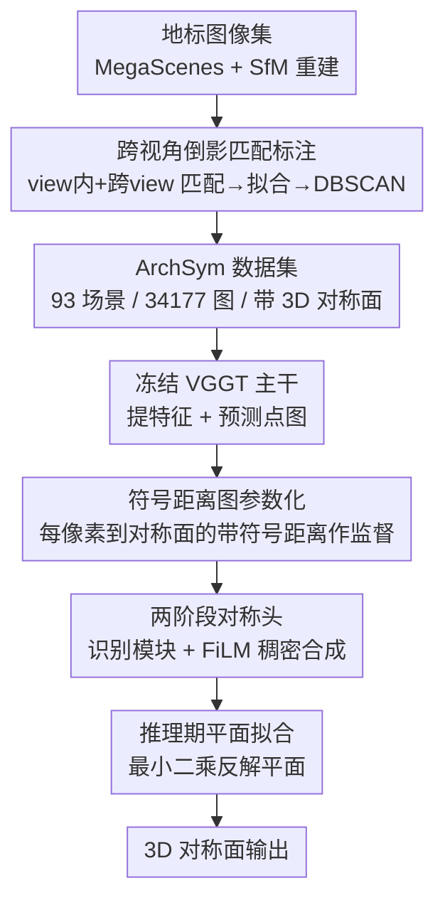

# ArchSym: Detecting 3D-Grounded Architectural Symmetries in the Wild

**会议**: CVPR 2026  
**论文**: [CVF Open Access](https://openaccess.thecvf.com/content/CVPR2026/html/Chen_ArchSym_Detecting_3D-Grounded_Architectural_Symmetries_in_the_Wild_CVPR_2026_paper.html)  
**代码**: 无  
**领域**: 3D视觉  
**关键词**: 对称检测, 单视图3D, 反射对称面, SfM自动标注, VGGT  

## 一句话总结
针对"野外真实场景里检测 3D 反射对称面"这一空白，本文先用跨视角倒影匹配从 SfM 重建里自动标注出大规模地标对称数据集 ArchSym，再训练一个把对称面参数化成"相对预测几何的符号距离图"的单视图检测器，从单张 RGB 图里准确地、带尺度地定位对称面，显著超过现有 SOTA。

## 研究背景与动机

**领域现状**：对称是计算机视觉里一个非常强的几何先验——它能帮 3D 重建补全遮挡部分、为位姿估计提供规范朝向、消解单目歧义。近年基于学习的方法（NeRD/NeRD++、Reflect3D）已经能从单张 RGB 图回归出对称面，比传统几何启发式方法泛化得好很多。

**现有痛点**：这些方法几乎全部只在 object-centric 或合成数据（ShapeNet、Objaverse）上训练和评测——干净、预分割、没有背景。一旦搬到真实"野外"场景（复杂环境、变化光照、遮挡），性能急剧退化。更要命的是，单目输入存在固有的**尺度歧义**，把对称面定位到 3D 是个病态问题，所以很多方法干脆只预测对称面的**朝向（法向）**，放弃定位面在空间中的位置（offset）。

**核心矛盾**：缺真实场景的 3D 对称标注数据是根因。但真实地标的对称标注极难获得——纯几何方法（ICP、点云对称检测）在 SfM 产出的噪声大、残缺点云上很容易失败，而且丢掉了原图的视觉信息；人工标注又不可扩展。

**本文目标**：分解成两个子问题——(1) 如何**可扩展地**自动标出真实地标的 3D 对称面；(2) 如何让单视图检测器**带尺度地**把对称面落到 3D，而不是只给个法向。

**切入角度**：作者抓住了 SfM 里一个被当作"麻烦"的现象——**doppelganger（幽灵匹配）**：图像匹配器经常在视觉相似但物理上不同的结构之间产生错误却几何一致的匹配。这个"bug"恰恰是发现对称的信号。同时作者注意到，新一代 3D 基础模型 VGGT 本身就预测场景几何（点图），天然提供了一个尺度一致的坐标系。

**核心 idea**：用"图像 vs 自己/相似图的水平倒影"的跨视角匹配把对称当 doppelganger 挖出来做标注；再把对称面参数化成"相对 VGGT 自己预测的点图的符号距离图"，用模型自洽的几何消解尺度歧义。

## 方法详解

### 整体框架
方法由两条管线串成：先是一条**离线数据标注管线**，从 SfM 重建自动产出 ArchSym 数据集；再用这份数据训练一个**单视图对称检测器**。检测器以冻结的 VGGT 为主干提特征+点图，对称头把每个潜在对称面预测成一张稠密的符号距离图，推理时再从符号距离图反解出显式平面参数。整条链路的关键在于：监督信号（符号距离图）是相对模型**自己预测的几何**定义的，因此天生尺度一致、与场景几何自洽。

### 关键设计

**1. 跨视角倒影匹配标注：把 doppelganger 这个 SfM 麻烦反过来当对称信号**

要训练真实场景检测器，先得有真实场景标注，而纯几何法在残缺点云上不靠谱。作者的做法是把每张图与"水平翻转后的图"做稠密匹配来抽对称：对图像 $I_i$，既匹配它自己的倒影 $I'_i$（**within-view 匹配**，只能挖出主立面这类最显著的对称），又用 ASMK 相似度采样一批视觉相似图像的倒影 $\mathcal{J}_i$ 与之匹配（**cross-view 匹配**，能恢复单一视角里看不全的对称，如凯旋门的前后对称）。匹配得到 2D 对应后，用 SfM 给的深度+相机参数把像素反投影成 3D 点对 $\mathcal{P}_i,\mathcal{P}_j$，再最小化"一组点与另一组点经对称反射后的残差"拟合候选平面：

$$(\mathbf{n}^*, d^*) = \arg\min_{\|\mathbf{n}\|=1,\, d} \sum_k \big\| \mathbf{p}^k_i - \mathcal{R}_{\mathbf{n},d}(\mathbf{p}^k_j) \big\|^2$$

其中 $\mathcal{R}_{\mathbf{n},d}$ 是法向 $\mathbf{n}$、offset $d$ 的反射算子。每张图对给一个带噪候选面，作者把每个场景成千上万个候选面用 DBSCAN 聚类，取大簇中心作高置信标注，最后人工过滤错误/局部对称、补漏全局对称。和纯几何法（LANGEVIN）比，本管线保留了图像视觉信息、对残缺点云鲁棒，能稳定抽出语义正确的二路/四路对称。

**2. 符号距离图参数化：用模型自己的预测几何消解尺度歧义**

单视图最大的麻烦是尺度歧义——直接回归 $(\mathbf{n},d)$ 里的 $d$ 是病态的。作者不直接回归平面参数，而是把对称检测转成**稠密预测任务**：对每个像素，预测它对应的 3D 点到对称面的**带符号距离**。具体地，给定冻结点头预测的点图 $\hat{\mathcal{P}}=\{\hat{\mathbf{p}}^k\}$ 与 GT 点图 $\mathcal{P}$，先算一个相似变换 $T$ 把 GT 几何对齐到预测几何（并把 GT 对称面也对齐过去），得到对齐后平面 $\pi=(\mathbf{n},d)$，监督用的符号距离图为：

$$s^k = \mathbf{n}^\top \hat{\mathbf{p}}^k + d$$

关键在于这个监督是相对**模型自己预测的固定点图**算的（而非 GT 几何），所以符号距离图在训练全程不变、尺度一致，且预测天然与场景几何自洽。推理时不需要 GT，只需对预测的高置信 3D 点 $\hat{\mathcal{P}}'$ 与其符号距离 $\hat{s}'$ 解一个约束最小二乘反解平面：

$$(\hat{\mathbf{n}}, \hat{d}) = \arg\min_{\|\mathbf{n}\|=1,\, d} \sum_{\mathbf{p},\, s} \big( (\mathbf{n}^\top \mathbf{p} + d) - s \big)^2$$

这比"在 VGGT 点图上跑两阶段几何对称检测"的朴素 baseline 更稳——因为 VGGT 只预测可见部分几何，点云残缺还常混进无关建筑，直接在上面跑几何法会失败；让对称头在冻结特征上隐式推理对称、再用符号距离图落地，避开了这个坑。

**3. 两阶段对称头 + 二分匹配：一张图里检出并对齐多个对称面**

一张图可能有多个对称面，既要全局推理"有哪些面"，又要像素级精度"每个面落哪"。对称头设计成两阶段。**识别模块**：一组 $M$ 个可学习 instance query 经轻量 transformer decoder 关注冻结 VGGT 末层特征 $\mathbf{F}^{\text{final}}$，refine 后每个 query 编码一个潜在对称面。**稠密合成模块**：用 DPT 风格的稠密预测头逐 instance 合成符号距离图——在四个特征融合块前，用从 instance 特征回归出的 scale/shift 经 FiLM 层（配 adaLN）把该 instance 的信息注入：

$$\mathbf{g}^{l}_{i,\text{cond}} = (1 + \boldsymbol{\gamma}^l_i)\cdot \mathrm{adaLN}(\mathbf{g}^l_i) + \boldsymbol{\beta}^l_i,\qquad \mathbf{g}^{l+1}_i = \mathrm{Fusion}(\mathbf{g}^{l}_{i,\text{cond}}, \mathbf{F}^l)$$

最终卷积头输出每个 instance 的符号距离图 $\hat{s}_i$ 与置信图 $c_i$。训练用 DETR 式**二分匹配**：在所有 GT 与预测面间算成对代价、用匈牙利算法求最优匹配，代价是置信加权的 L1 距离加一个置信正则项 $\mathrm{cost}_{ij}=\sum_k c^k_i\cdot |\hat{s}^k_i - s^k_j| - \alpha\log c^k_i$，最终损失取匹配对的平均代价。另有一个分类头预测 logits，把匹配上 GT 的面标正、其余标负，推理时按 logits 阈值过滤出有效面。

## 实验关键数据

### 主实验
ArchSym 93 个场景按**场景**（非按图）划成 74 训练 / 19 测试，避免数据泄漏、考察对未见地标的泛化。对比对象：SOTA 单视图检测器 REFLECT3D（R3D，仅预测法向，已在 ArchSym 上微调以公平对比）、以及简单 baseline DIRECT（DIR，用冻结 VGGT 特征直接回归平面参数）。Geo 为测地距离/角误差（↓，度），F@x° 为角阈值下的 F-score（↑），$E_{\text{dense}}$ 为稠密对称误差（↓）。

| 方法 | Geo↓ | F@1°↑ | F@5°↑ | F@15°↑ | E_dense↓ |
|------|------|-------|-------|--------|----------|
| REFLECT3D (R3D) | 10.46 | 0.07 | 0.34 | 0.55 | —（不预测 offset） |
| DIRECT (DIR) | 5.06 | 0.16 | 0.64 | 0.81 | 0.18 |
| **OURS** | **3.71** | **0.25** | **0.70** | **0.84** | **0.13** |

OURS 在法向预测（Geo、各 F@x°）和全平面预测（$E_{\text{dense}}$）上都最优：Geo 从 R3D 的 10.46 砍到 3.71，F@1° 从 0.07 提到 0.25。

### 消融实验
论文没有传统逐模块消融表，但 DIRECT 这条 baseline 本身就是对"符号距离图参数化"（设计 2）的消融——把它换成直接回归平面参数，其余主干相同。下表用主表数据重组出参数化方式的影响：

| 配置 | Geo↓ | E_dense↓ | 说明 |
|------|------|----------|------|
| OURS（符号距离图参数化） | 3.71 | 0.13 | 完整模型，平面朝向准且与几何对齐 |
| DIRECT（直接回归平面参数） | 5.06 | 0.18 | 去掉符号距离图 → 法向尚可但平面常与场景几何错位 |
| REFLECT3D（object-centric 法） | 10.46 | — | 仅法向、漏掉部分可见对称、产生冗余检测 |

### 关键发现
- **符号距离图参数化是涨点主力**：DIRECT 借了 VGGT 特征，法向已比 R3D 准（Geo 5.06 vs 10.46），但直接回归出的平面常与场景几何错位（$E_{\text{dense}}$ 0.18）；换成相对自身几何的符号距离图后定位明显更准（0.13）。
- **数据域是 R3D 崩盘主因**：R3D 即便在 ArchSym 上微调，仍只能识别最显著对称的朝向，对部分可见对称漏检、且冗余检测，说明 object-centric 先验难迁到野外场景。
- **标注管线对残缺点云鲁棒**：定性对比里纯几何法 LANGEVIN 在点云一侧缺失时（Isa Khan's Tomb、Frauenkirche）整面识别失败，还会在凯旋门这类立方体轮廓上检出"水平对称面"这种建筑学上不可能的结果；本管线靠图像匹配能稳定抽出二路/四路对称，八路对称（Isa Khan's Tomb）能直接匹配出 5 路、其余 3 路由交线后处理补齐。

## 亮点与洞察
- **把"系统 bug"变"标注信号"**：SfM 里 doppelganger 幽灵匹配一向被当成要被 Doppelganger++ 修掉的噪声，本文反手用它当对称发现器——这种"问题即信号"的视角很值得迁移到其他"歧义即结构"的任务。
- **监督锚在模型自己的几何上**：符号距离图相对 VGGT 自身预测点图（而非 GT 几何）定义，使预测自洽、尺度一致，是绕开单目尺度歧义的巧法；这套"相对自预测几何定义稠密监督"的思路可迁到单视图法向/平面/深度等其它病态回归。
- **DETR 式集合预测套到对称面检测**：用 instance query + 二分匹配 + FiLM 条件注入解决"一图多对称面"的多实例问题，把成熟的检测范式干净地复用到几何先验提取上。
- **即插即用补全**：检测出的对称面直接拿来把 VGGT 残缺点云沿对称面镜像，就能"幻想"出被遮挡的背面几何，证明对称作为下游几何先验的实用价值。

## 局限与展望
- 标注管线依赖**准确的 SfM 重建**，重建质量直接决定抽出的对称质量。
- 当前只做**反射对称**；作者指出改成"匹配未翻转的其它视角"即可扩展到旋转对称，但因建筑里纯旋转对称少见、且常可由反射对称组合导出，未优先做。
- 只发现**全局对称**（整个地标/完整立面），不检测局部对称（如单个窗户），后者是有意思的未来方向。
- 检测器性能与 VGGT 点头预测的几何强绑定：几何高度歧义时（严重遮挡、模糊）符号距离法可能给出偏差较大的平面；而直接回归法或许还能给个看似合理的朝向，但其能否被有意义地定位到 3D 存疑 ⚠️。

## 相关工作与启发
- **vs REFLECT3D [19]**：它用基础模型回归平面法向、训练在 object-centric 数据上，只给朝向不定位、对野外场景退化严重；本文给完整 3D 平面、训练在真实地标 ArchSym 上，且即便把 R3D 在 ArchSym 微调仍大幅领先。
- **vs NeRD/NeRD++ [21,48]**：它们用迭代地把图像特征在 3D 中反射来找对称面；本文不做显式迭代反射，而是把对称面编码进稠密符号距离图、交给网络隐式推理，再一次性反解。
- **vs LANGEVIN [13]（几何法标注）**：它在 COLMAP 稠密点云上用黎曼 Langevin 动力学找对称，纯几何、对残缺点云敏感、易出建筑学不合理面；本管线保留图像视觉信息、用跨视角倒影匹配，标注语义更正确。
- **vs DIRECT（本文 baseline）**：同样用 VGGT 特征但直接回归平面参数，法向可用却常与几何错位——印证"相对自预测几何的符号距离图"参数化的必要性。

## 评分
- 新颖性: ⭐⭐⭐⭐⭐ 首个野外单视图 3D-grounded 反射对称检测框架，且把 doppelganger 反用为标注信号
- 实验充分度: ⭐⭐⭐⭐ 主表对比清晰、定性丰富、有下游补全应用，但缺逐模块消融表
- 写作质量: ⭐⭐⭐⭐⭐ 动机—数据—模型逻辑层层递进，符号距离图的尺度自洽讲得透
- 价值: ⭐⭐⭐⭐⭐ ArchSym 数据集 + 检测器为野外 3D 重建/位姿提供可复用的对称先验

<!-- RELATED:START -->

## 相关论文

- [\[CVPR 2026\] Homaloidal parametrization for detecting critical two-view configurations](homaloidal_parametrization_for_detecting_critical_two-view_configurations.md)
- [\[CVPR 2026\] Scene Grounding In the Wild](scene_grounding_in_the_wild.md)
- [\[CVPR 2026\] GGPT: Geometry-Grounded Point Transformer](ggpt_geometry_grounded_point_transformer.md)
- [\[CVPR 2026\] GaussFusion: Improving 3D Reconstruction in the Wild with A Geometry-Informed Video Generator](gaussfusion_improving_3d_reconstruction_in_the_wild_with_a_geometry-informed_vid.md)
- [\[CVPR 2026\] ORBIT: Benchmarking SfM in the Wild with 360° Video](orbit_benchmarking_sfm_in_the_wild_with_360deg_video.md)

<!-- RELATED:END -->
