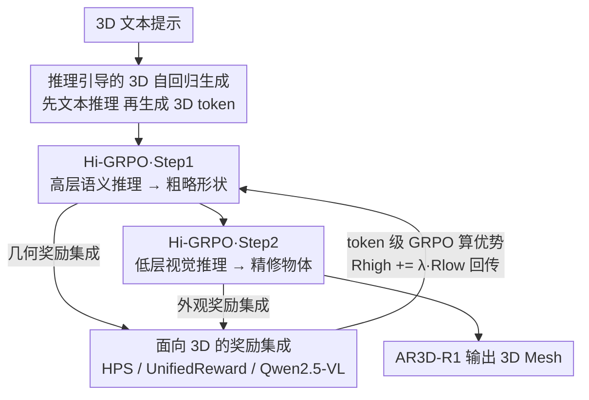

# Are We Ready for RL in Text-to-3D Generation? A Progressive Investigation

**会议**: CVPR 2026  
**论文**: [CVF Open Access](https://openaccess.thecvf.com/content/CVPR2026/html/Tang_Are_We_Ready_for_RL_in_Text-to-3D_Generation_A_Progressive_CVPR_2026_paper.html)  
**代码**: https://github.com/Ivan-Tang3D/3DGen-R1  
**领域**: 3D视觉 / 对齐RLHF  
**关键词**: 文本到3D生成, 强化学习, GRPO, 奖励模型, 自回归生成  

## 一句话总结
这篇论文第一次系统地把强化学习引入文本到 3D 自回归生成，从奖励设计、RL 算法、评测基准、RL 范式四个维度逐一拆解，最终提出分层 coarse-to-fine 的 Hi-GRPO 并训练出首个 RL 增强的文本到 3D 模型 AR3D-R1，在 Toys4K 和新基准 MME-3DR 上都超过 Trellis。

## 研究背景与动机

**领域现状**：RL（尤其是 GRPO 这类组相对策略优化）已经在 LLM、多模态理解、2D 自回归图像生成上证明有效——通过奖励模型对齐人类偏好、强化逐步生成过程。3D 自回归模型（如 ShapeLLM-Omni，把 3D 物体用 VQVAE 离散成 token 序列）目前却只停留在预训练和微调阶段。

**现有痛点**：2D 的 RL 配方不能直接搬到 3D。3D 资产把几何和纹理耦合在更高的空间维度里，要求全局几何一致 + 局部纹理精细，这让 RL 训练对奖励设计和算法选择异常敏感：奖励信号选错、token/sequence 粒度选错，都可能让训练崩或者只优化出"形状对但没纹理"的半成品。3D 物体还没有规范视角，单一奖励模型难以同时评估真实感、语义对齐和结构完整。

**核心矛盾**：3D 生成天然是分层的——先有全局几何骨架，再填局部纹理细节（这和人类感知 3D 的顺序一致）。但普通 GRPO 把整个生成过程当成一次扁平的 token 序列优化，奖励信号无法区分"几何阶段"和"纹理阶段"，导致两类目标互相干扰。

**本文目标**：回答"我们准备好在文本到 3D 上用 RL 了吗"，需要分解成四个子问题——(1) 什么奖励模型有效？(2) 哪种 GRPO 变体适合 3D？(3) 现有基准能否评出 3D 推理能力？(4) 能否设计更贴合 3D 分层本质的 RL 范式？

**切入角度**：作者借用 ShapeLLM-Omni 同时具备文本生成和 3D token 生成的能力，先让模型生成文本推理（理清用户意图、消歧、规划空间布局），再用推理引导 token 级 3D 生成——把 2D 上"reasoning-guided generation"的思路迁移到 3D，并据此做系统性消融。

**核心 idea**：用"全局几何→局部纹理"的分层 RL（Hi-GRPO）替代扁平 GRPO，每个阶段配专属奖励集成，把最终质量回传去监督全局规划。

## 方法详解

### 整体框架
论文本质是一篇"渐进式调查"，沿四条轴做实验：奖励模型（Sec.3）、RL 算法（Sec.4）、评测基准（Sec.5）、RL 范式（Sec.6），最终把所有结论收敛成 Hi-GRPO 范式和 AR3D-R1 模型。基座是 ShapeLLM-Omni（Qwen2.5-VL + 3D VQVAE），它把 3D 物体离散成 token 序列、支持文本与 3D token 的自回归预测。

整条生成-优化管线是：给定 3D 文本提示，模型先做**高层语义推理**（规划全局结构、确定部件空间布局），用它引导生成**粗略 3D 形状**；再以提示 + 语义推理为条件做**低层视觉推理**（细化纹理、部件数量、对称性），生成**精修 3D 物体**。每个 prompt 在一次迭代里采样 G=8 组，两步分别用各自的奖励集成算组相对优势，并把第二步奖励回传到第一步。

### 关键设计

**1. 推理引导的 3D 自回归生成：先想清楚再下笔，给 RL 留出优化空间**

3D 的痛点是直接生成 token 时模型没有"意图规划"，碰到复杂提示容易几何错乱。作者不让模型直接吐 3D token，而是先让它"想象"物体、产出 G 条文本描述（reasoning），再以每条描述为条件各生成一个 3D 物体。文本推理负责理解物体子类、确立关键部件的空间布局、把模糊词具象化。消融（Table 3）显示：在 HPS V2.1 奖励 + GRPO 下，无推理的 RL 把 CLIP Score 从基座 22.7 提到 23.4，加上文本推理进一步到 24.0——推理本身给 RL 创造了更大的提升空间，因为它把"生成什么"这个决策暴露成可被奖励塑形的中间步骤。

**2. 面向 3D 的奖励集成：单一奖励有系统性偏置，靠专家分工补齐多视角一致性**

3D 没有规范视角，单一奖励模型只能覆盖一个维度。作者把每个 3D 物体渲染成 6 个视角，再用三类互补的专家模型打分：(1) **人类偏好** HPS V2.1 取各视角最高分作为整体视觉质量；(2) **提示对齐 + 美学** UnifiedReward 给每个视角打"对齐/逻辑连贯/风格"三分求和取最大，或用通用 LMM（Qwen2.5-VL）联合所有视角给单一推理分；(3) **3D 一致性**——没有专门训练的 3D 一致性奖励模型，但 Qwen2.5-VL 表现出强跨视角理解，从"形状轮廓/外观/部件"三维各打 0–1 分求和。关键发现：人类偏好是核心信号，其它维度单独用收益有限但叠加在偏好上稳定增益；专门奖励模型在单一维度更鲁棒，而多视角的 3D 一致性目标上通用 LMM 泛化更好（用 Qwen2.5-VL 评 3D 一致性带来 0.6 CLIP 提升）。

**3. token 级 GRPO 优化：3D 生成的损失从 token 级平均受益最大，而非序列级**

GRPO 对一组 G 个回复，按组内归一化算优势：

$$A_i = \frac{R_i - \mathrm{mean}(\{R_i\}_{i=1}^{G})}{\mathrm{std}(\{R_i\}_{i=1}^{G})}$$

作者对比了三种变体在 3D 上的表现。**DAPO** 引入解耦裁剪、动态采样、token 级损失聚合、去掉 KL 正则；**GSPO** 把重要性采样和裁剪都移到序列级。结论很明确：3D 自回归更偏好 token 级策略——token 级平均能更好捕捉生成过程中的全局结构差异，而序列级操作收益有限。具体地（Table 2），动态采样把 vanilla GRPO 提升 0.6 且能稳住训练；但完全去掉 KL 惩罚反而掉 0.4（需要约束策略更新），更温和的解耦裁剪鼓励低概率 token 探索仍有正收益。这条结论直接决定了 Hi-GRPO 的损失沿用 token 级 DAPO 风格聚合。

**4. Hi-GRPO：把"全局几何→局部纹理"拆成两步分层 RL，让奖励对应到正确阶段**

普通 GRPO 把整个 3D 生成当一次扁平优化，几何和纹理的奖励混在一起互相干扰。作者观察到训练早期模型先收敛全局几何（step 200 只有粗糙轮廓），后期才精修纹理（step 600 出现座椅、车灯等细节）——这天然是 coarse-to-fine 的。Hi-GRPO 把每次迭代拆成两步：**Step 1** 在 3D 提示 + 高层指令引导下做语义规划，生成 $|s_i|$ 个语义 token，再喂入 `<mesh_start>` 逐格生成 $M$ 个 3D token 解码出粗略形状；**Step 2** 以提示 + 语义推理 + 低层视觉指令为条件生成视觉推理，再产出精修物体 token。两个改动是关键：(1) 第二步奖励回传到第一步 $R_{high} = R_{high} + \lambda \cdot R_{low}$，让最终质量通过可调权重 $\lambda$ 监督全局规划；(2) 每步独立从各自奖励算优势和策略损失，总损失

$$L = L_{high} + L_{low}$$

两步各配专属奖励集成（step1 偏全局对齐：HPS + UnifiedReward 几何对齐 + Qwen2.5-VL 类别一致性的 0/1 分；step2 偏局部精修：HPS + UnifiedReward 三维美学 + Qwen2.5-VL 外观一致性）。多奖励跨步分工还能有效防止 reward hacking。基于此训练出的 AR3D-R1 推理时确实呈现从粗糙形状到精细纹理的渐进过程。

### 损失函数 / 训练策略
基座 ShapeLLM-Omni；从多个 3D 数据集精选 8,400 条短描述作训练提示，随机取 Toys4K 800 样本作测试集。每次迭代 G=8，每个 prompt 先生成 G 条文本描述再各生成一个 3D 物体。奖励标准化为每个物体采样 6 个渲染视角。数据扩展（1.5×/2×/3×）持续增益（+0.4/+0.2/+0.4），训练迭代加倍提升 0.9 但三倍会因过拟合偏好特征导致泛化退化。

## 实验关键数据

### 主实验
在 MME-3DR（新基准）和 Toys4K 上与多个文本到 3D 模型对比（Table 4，KD ×100，越低越好）：

| 方法 | MME-3DR CLIP↑ | MME-3DR KD$_{incep}$↓ | Toys4K CLIP↑ | Toys4K KD$_{incep}$↓ |
|------|------|------|------|------|
| LGM | 16.3 | 1.507 | 20.6 | 1.192 |
| SAR3D | 16.7 | 1.374 | 20.0 | 0.650 |
| Trellis（SOTA 基线） | 23.4 | 0.302 | 26.8 | 0.175 |
| ShapeLLM-Omni（基座） | 19.8 | 0.451 | 22.7 | 0.249 |
| **AR3D-R1（本文）** | **28.5** | **0.194** | **29.3** | **0.156** |

AR3D-R1 把基座 ShapeLLM-Omni 在 Toys4K CLIP 从 22.7 拉到 29.3，并在两个基准上全面超过此前 SOTA 的 Trellis。

### 消融实验
奖励模型组合（Table 1，GRPO + G=8）与 RL 算法（Table 2）：

| 配置 | CLIP↑ | KD$_{incep}$↓ | 说明 |
|------|------|------|------|
| 基座（无 RL） | 22.7 | 0.249 | ShapeLLM-Omni |
| 仅 HPS | 24.0 | 0.241 | 人类偏好是核心信号 |
| HPS + Unified | 24.6 | 0.235 | 叠加对齐/美学 +0.6 |
| HPS + Unified + LMM$_{3D}$ | 25.2 | 0.228 | 加 3D 一致性最优 |
| + 动态采样（DAPO） | 25.8 | 0.219 | 稳训练 +0.6 |
| + token 级聚合 | 26.3 | 0.214 | token 级 > 序列级 |
| + 解耦裁剪（完整） | 26.5 | 0.210 | 鼓励低概率 token 探索 |
| + 去 KL 惩罚 | 25.9 | 0.213 | 反而掉 0.4，需约束策略 |

### 关键发现
- **人类偏好奖励是地基**：单奖励里 HPS V2.1 增益最强，其它维度单独用收益有限，但叠加在偏好上稳定提升；专门奖励模型在单维度更鲁棒，通用 LMM 在多视角 3D 一致性上泛化更好。
- **token 级 > 序列级**：相同奖励下 token 级平均的增益远大于 GSPO 的序列级重要性采样，因为它更能捕捉全局结构差异；动态采样足以稳住训练，但 KL 不能完全去掉。
- **现有基准高估了模型**：在简单提示上表现好，但在空间几何/机械可供性/生物有机体/世界知识罕见物/风格化五类推理密集场景上一致失败。MME-3DR（249 个物体跨五类）专门暴露隐式推理能力——RL 训练让 ShapeLLM-Omni 在五类上整体涨 5–6 分，风格化提升尤其明显。
- **缩放有上限**：数据扩展持续有效，迭代加倍 +0.9 但三倍反而退化（过拟合偏好特征）。

## 亮点与洞察
- **把"分层"从观察变成训练范式**：作者先观察到 RL 训练天然走 coarse-to-fine（step 200→600 可视化），再把它显式拆成 Hi-GRPO 两步 + 奖励回传，让范式设计有据可依，而不是拍脑袋分阶段。这种"先实证再设计"的思路可迁移到任何有内在层次的生成任务。
- **用通用 LMM 补专门奖励模型的空白**：3D 一致性没有专门奖励模型，作者发现 Qwen2.5-VL 的跨视角理解恰好能填，且在多视角目标上比专门模型泛化更好——给"没有现成 reward model 的新模态"提供了一条务实路径。
- **奖励跨步分工防 hacking**：把不同奖励分配到不同阶段（step1 管几何对齐、step2 管外观），天然限制了单一奖励被刷分的空间，这个工程 trick 在多阶段 RL 里通用。
- **MME-3DR 的双重价值**：既测生成质量又测隐式推理能力，按五类推理平衡采样，比随机抽 800 个 Toys4K 更能区分模型真实能力。

## 局限与展望
- 全部实验绑定 ShapeLLM-Omni 这一个自回归基座，结论是否迁移到其它 3D 表征（mesh tokenization、native 3D diffusion）未验证。
- 奖励集成重度依赖 HPS / UnifiedReward / Qwen2.5-VL，这些 2D/通用模型对 3D 的评估本身可能有系统偏置（论文也承认仅靠通用 LMM 做任务特定评估会引入偏置）。⚠️ 多视角渲染 6 视角的评估是否充分覆盖 3D 一致性，存疑。
- 迭代缩放三倍即退化说明 RL 优化窗口很窄，偏好过拟合风险高；$\lambda$（step2→step1 奖励回传权重）的敏感性正文未详细给出。
- 改进思路：引入真正的 3D-native 一致性奖励（如多视角几何重建误差）替代 LMM 打分，或把分层从两步扩展到更细粒度的"几何→拓扑→纹理→材质"多步。

## 相关工作与启发
- **vs Image Generation with CoT / 2D GRPO 工作**：他们在 2D 自回归图像上做 reasoning-guided 生成和 GRPO，本文把这套迁到耦合几何+纹理的 3D，并指出 2D 配方不能直接搬（3D 对奖励/算法更敏感、需分层联合优化）。
- **vs ShapeLLM-Omni（基座）**：基座只做预训练+微调的 3D 自回归，本文在其之上加 RL，Toys4K CLIP 从 22.7→29.3，证明 RL 能强化 3D 自回归的逐步生成。
- **vs Trellis（此前 SOTA）**：Trellis 是非自回归的强基线，在简单提示上甚至强于基座；AR3D-R1 通过 RL + 分层范式在 MME-3DR 和 Toys4K 两个基准上全面反超，说明隐式推理能力是关键差距。
- **vs DAPO / GSPO**：直接拿这两个 LLM 上的 GRPO 变体到 3D 上做对照，结论是 3D 偏好 token 级（DAPO 风格）而非序列级（GSPO），为 3D RL 的算法选择提供了第一手证据。

## 评分
- 新颖性: ⭐⭐⭐⭐⭐ 首个系统性把 RL 引入文本到 3D 自回归，Hi-GRPO 的分层范式 + 奖励回传是真创新
- 实验充分度: ⭐⭐⭐⭐⭐ 四个维度逐一消融，奖励/算法/缩放/基准都有对照表，还新建了 MME-3DR
- 写作质量: ⭐⭐⭐⭐ 调查式结构清晰、observation 提炼到位，但部分公式与符号依赖图示、细节略散
- 价值: ⭐⭐⭐⭐⭐ 为 3D 生成的 RL 化提供了第一份系统配方和可复现基线，方向影响力大

<!-- RELATED:START -->

## 相关论文

- [\[CVPR 2026\] Multimodal Semantic Bias Mitigation for Diverse Text-To-3D Generation](multimodal_semantic_bias_mitigation_for_diverse_text-to-3d_generation.md)
- [\[CVPR 2026\] Text–Image Conditioned 3D Generation](text-image_conditioned_3d_generation.md)
- [\[CVPR 2026\] ProgressiveAvatars: Progressive Animatable 3D Gaussian Avatars](progressiveavatars_progressive_animatable_3d_gaussian_avatars.md)
- [\[CVPR 2026\] PhysHead: Simulation-Ready Gaussian Head Avatars](physhead_simulation-ready_gaussian_head_avatars.md)
- [\[CVPR 2026\] PhysX-Anything: Simulation-Ready Physical 3D Assets from Single Image](physx-anything_simulation-ready_physical_3d_assets_from_single_image.md)

<!-- RELATED:END -->
