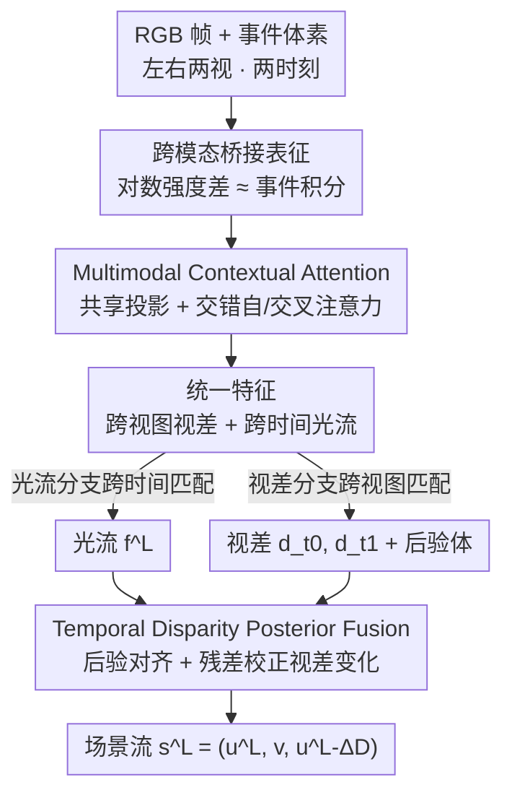

# ARES: Unifying Asymmetric RGB-Event Stereo for Probabilistic Scene Flow Estimation

**会议**: CVPR 2026  
**论文**: [CVF Open Access](https://openaccess.thecvf.com/content/CVPR2026/html/Lee_ARES_Unifying_Asymmetric_RGB-Event_Stereo_for_Probabilistic_Scene_Flow_Estimation_CVPR_2026_paper.html)  
**代码**: https://github.com/leejielong/ARES  
**领域**: 3D视觉  
**关键词**: 场景流, RGB-事件相机立体, 多模态融合, 视差后验, 概率建模  

## 一句话总结
用一个"事件相机 + RGB 相机"的非对称双目装置，先靠 Multimodal Contextual Attention 把异步事件的时间线索和 RGB 的空间结构融成统一表征同时估计光流与视差，再用 Temporal Disparity Posterior Fusion 概率地建模视差随时间的演化，从而恢复出几何一致、时间稳定的稠密场景流，在 RGB-事件立体设置下取得 SOTA 场景流精度。

## 研究背景与动机

**领域现状**：稠密场景流（per-pixel 3D 运动）天然耦合了「几何结构」和「时间动态」两件事，它等价于同时要把光流（2D 运动）和视差（深度）估准。主流做法要么用同步 RGB 双目，要么用事件双目。

**现有痛点**：这两类传感器恰好站在感知光谱的两端，各有死穴。RGB 双目空间纹理丰富、视差估得准，但帧率和曝光受限，高速运动下会运动模糊、时间混叠，光流就糊了；事件相机微秒级延迟、高动态范围，能在快速运动/强光变下精确捕捉时间运动，但事件只在亮度变化的运动边缘稀疏触发，没有全局纹理和绝对强度，稠密几何/视差恢复不出来。于是 RGB 双目擅长深度、事件双目擅长运动，没有哪一个能把完整 3D 运动场如实还原。

**核心矛盾**：场景流同时依赖准确视差和准确光流，但「强空间锚定」和「高时间分辨率」在单一传感器内是互斥的——这是一个传感器层面的 trade-off，没法靠单模态算法绕开。

**本文目标**：在一个非对称（asymmetric）立体装置里同时输出左视光流 $\mathbf{f}^L$、两个时刻的左视视差 $d^L_{t_0}, d^L_{t_1}$ 和左参考场景流 $\mathbf{s}^L$，让结果几何一致、时间稳定。

**切入角度**：作者不追求在静态深度上压过 RGB 双目、也不追求在瞬时运动上压过事件双目，而是刻意做「非对称配对」——一台事件相机当时间通道、一台 RGB 相机当空间锚点，让两者互补，去换取场景流上的几何-时间一致性（顺带 event-RGB 配对成本低、易同步标定）。

**核心 idea**：用「跨模态桥接 + 交错注意力」把异步事件与同步 RGB 融进统一对应空间来联合估计光流与视差，再用「视差后验随时间演化」的概率框架把视差变化（沿深度轴的运动）估出来，二者拼成场景流。

## 方法详解

ARES 输入是左右两视、$t_0/t_1$ 两个时刻的 RGB 帧 $I^v_t$ 与事件体素网格 $E^v_t$（$v\in\{L,R\}$），输出是左视的光流、视差和场景流。整条管线分两大块：MCA 负责把异构模态融成统一时空表征供光流/视差匹配，TDPF 负责把视差的时间演化概率建模出来得到度量一致的 3D 运动。

### 整体框架

先讲清场景流怎么从光流 + 视差变化拼出来，这是后面所有模块的目标函数。作者把左视场景流写成 $\mathbf{s}^L(x,y)=\big(u^L,\,v^L,\,u^R\big)$，其中右视水平分量 $u^R$ 通过视差变化跟左视运动挂钩：先用光流把 $t_1$ 的视差反向 warp 回 $t_0$ 得到 $\widetilde{d}^L_{t_1}=\mathcal{W}^{\mathrm{b}}(d^L_{t_1},u^L,v^L)$，定义视差变化 $\Delta d = d^L_{t_0}-\widetilde{d}^L_{t_1}$，于是 $u^R = u^L-\Delta d$。这一步把「3D 运动」拆成了「2D 光流」+「视差变化」两个可学的量，也解释了为什么必须同时估准光流和视差。

整体数据流是：三个模态编码器分别抽 RGB / 事件 / 桥接特征 → MCA 用交错的自/交叉注意力把它们融成视图无关的统一特征 $\{F^L_{t_0},F^R_{t_0},F^L_{t_1},F^R_{t_1}\}$ → 这组特征同时喂给光流分支（跨时间匹配）和视差分支（跨视图匹配），各自构相关体并迭代细化 → TDPF 把视差预测和它们的后验分布跨时间对齐融合，输出视差变化 $\Delta\hat{D}$ → 与光流拼成场景流 $\mathbf{s}^L$。

### 关键设计

**1. 跨模态桥接表征：给异步事件和同步 RGB 找一个共同度量**

直接拿事件流和 RGB 帧做跨模态融合是别扭的——一个异步连续、一个稀疏离散，物理量也不同。作者用亮度恒常假设把两者拉到同一个「随时间的亮度变化」空间。按事件成像模型，相邻帧强度满足 $I(\tau_{i+1})=I(\tau_i)\exp\big(c\int_{\tau_i}^{\tau_{i+1}} e(t)\,dt\big)$，两边取对数得到加性关系 $\Delta L_i = \log I(\tau_{i+1})-\log I(\tau_i)=c\int_{\tau_i}^{\tau_{i+1}} e(t)\,dt$。也就是说「相邻 RGB 帧的对数强度差」理论上等于「同一时间窗内事件的积分」，二者描述的是同一个物理过程，只是采样粒度不同。于是定义共享桥接模态 $\mathcal{B}_i=\log I(\tau_{i+1})-\log I(\tau_i)\approx c\int e(t)\,dt$：RGB 域用帧间时间差表达它、事件域用积分事件计数表达它。桥接图像对 $(B^L_{\text{evt}}, B^R_{\text{rgb}})$ 充当跨视锚点，把两种感知特性迥异的模态对齐到同一空间，是后续注意力融合能成立的物理前提。

**2. Multimodal Contextual Attention（MCA）：视图无关地交错融合空间与时间线索**

桥接表征虽然对齐了，但时间聚合和差分会丢掉精细时空细节；而且 RGB/事件在左右相机各自独立观测，直接跨模态融合本来要求严格视图对应。MCA 一并解决这两点。它先用三个专用编码器抽互补特征：RGB 编码器 $\Phi_{\text{RGB}}$ 用 ConvNeXt-DINOv3 backbone 配轻量残差 CNN adapter 出高层语义；事件编码器 $\Phi_{\text{EV}}$ 用递归 CNN + 特征金字塔抽多尺度时间运动特征；桥接编码器 $\Phi_{\text{BR}}$ 用轻量 CNN 抽稳定的结构线索。关键在于把桥接特征 $F^v_B$ 用「跨视图共享」的线性映射投到统一隐空间出 $Q^v,K^v,V^v$——投影权重 $(W_Q,W_K,W_V)$ 在左右视共享，让任何一支的 query 都能从对侧视图的 RGB/事件上下文取信息，融合因此变成视图无关、不带相机偏置。

每层 MCA 交错地做空间与时间推理：$F^v_1=\text{SelfAttn}(F^v_B)$ 先内部对齐 → $F^v_2=\text{CrossAttn}(Q{=}F^v_1, K{=}V{=}F_{\text{RGB}}^v)$ 注入 RGB 空间结构 → $F^v_3=\text{SelfAttn}(F^v_2)$ 再交换视内信息 → $F^v_4=\text{CrossAttn}(Q{=}F^v_3, K{=}V{=}F_{\text{EV}}^v)$ 注入事件运动动态。这种「交错」而非「先 RGB 后事件串行」的设计，让两种上下文轮流细化同一个不断演化的 query，配合中间的自注意力，避免某一模态主导融合，得到平衡的空间-时间整合（注意力层都用 Axial RoPE 独立编码横纵位置，提升跨分辨率泛化）。最终的 $\{F^L_{t_0},F^R_{t_0},F^L_{t_1},F^R_{t_1}\}$ 是一份统一表征：光流分支用它做跨时间匹配强调时间连贯，视差分支用它做跨视图匹配强调几何精度，两个任务互相正则——光流约束几何的时间演化，视差锐化光流赖以推断的空间结构。

**3. Temporal Disparity Posterior Fusion（TDPF）：概率地建模视差演化以恢复度量一致的深度运动**

MCA 给了时空对齐的特征，但没有显式建模「视差怎么随时间变」。要恢复完整 3D 场景流，必须估出视差变化 $\Delta\hat{D}=D_{t_1}-D_{t_0}$（沿深度轴的运动），而它跟光流不同——光不能只从图像空间对应里定，它同时依赖时间视差变化和立体几何。TDPF 的做法是融合「跨时间的视差后验」。每个视差相关体 $C^D_t\in\mathbb{R}^{H\times W\times W}$ 经 softmax 后就是每个像素在候选视差上的后验分布。TDPF 先用光流把 $t_1$ 的视差和后验反向 warp 到 $t_0$：$\widetilde{D}_{t_1\to0}=\mathcal{W}^{\mathrm{b}}(D_{t_1},\hat{\mathbf{f}}^L)$、$\widetilde{C}^D_{t_1\to0}=\mathcal{W}^{\mathrm{b}}(C^D_{t_1},\hat{\mathbf{f}}^L)$，保证融合前时空对齐；由于相关体的视差分辨率随图像尺寸变，再沿视差轴插值到固定 $K$ 个 bin 得到分辨率无关的后验。然后把对齐后的视差预测、它们的差、两个后验和左视特征沿通道拼成紧凑张量 $\mathcal{Z}=[\widetilde{D}_{t_1\to0},D_{t_0},\widetilde{D}_{t_1\to0}-D_{t_0},\widetilde{C}^D_{t_1\to0},\widetilde{C}^D_{t_0},F^L_{t_0},F^L_{t_1}]$，让网络同时对立体几何、时间对齐、后验不确定性联合推理。一个紧凑 2D 卷积网 $\Phi_{\text{TDPF}}$ 预测对粗视差变化的残差校正 $\Delta\hat{D}_{\text{res}}=\Phi_{\text{TDPF}}(\mathcal{Z})$，最终 $\Delta\hat{D}=(\widetilde{D}_{t_1\to0}-D_{t_0})+\Delta\hat{D}_{\text{res}}$。显式融合跨时间后验让模型在歧义区域捕获不确定性、并强制帧间时间一致；最后 $u^R=u^L-\Delta\hat{D}$ 保证左右视几何一致，把 2D 对应估计桥接到度量一致的 3D 运动重建。

### 损失函数 / 训练策略

场景流标注极稀疏（仅留作评估），所以训练用「稀疏监督 + 稠密自一致」组合：$\mathcal{L}=\lambda_f\mathcal{L}_f+\lambda_d\mathcal{L}_d+\lambda_p\mathcal{L}_p+\lambda_w\mathcal{L}_w$。其中 $\mathcal{L}_f$ 是有效像素上的 masked $\ell_1$ 光流损失、$\mathcal{L}_d$ 是 $\ell_1$ 视差监督；$\mathcal{L}_p$ 是光度一致性，用预测光流把 $I^L_1$ 前向 warp 重建 $\widetilde{I}^L_0$，组合 SSIM 与 $\ell_1$：$\mathcal{L}_p=\alpha\frac{1-\text{SSIM}(I^L_0,\widetilde{I}^L_0)}{2}+(1-\alpha)\|I^L_0-\widetilde{I}^L_0\|_1$（$\alpha=0.85$），在无纹理/无标注区正则光流；$\mathcal{L}_w$ 是时间视差-warping 损失，用 $\hat{D}_{t_0}+\Delta\hat{D}$ 经光流前向 warp（softmax splatting）得到 $\widetilde{D}_{t_0\to1}$，再与 $t_1$ 真值视差比，间接替代显式场景流监督、强制时间一致。

## 实验关键数据

### 主实验

在 DSEC 和 MVSEC 两个 event-RGB 双目数据集上评测，主指标是端点误差 EPE（越低越好），并报 >1px / >5px 离群率。基线含事件双目 EMatch、稠密对应法 RAFT-3D、零样本非对称 event-RGB 的 ZEST（只比视差），以及只用桥接表征、去掉 MCA/TDPF 的 ARES-Base。所有基线在同一训练划分上重训。

DSEC 上（高速运动 + 强光变，挑战大）：

| 方法 | 视差 EPE↓ | 光流 EPE↓ | 场景流 EPE↓ | 场景流 >5px↓ |
|------|-----------|-----------|-------------|--------------|
| ZEST | 0.683 | – | – | – |
| ARES-Base | 0.693 | 0.712 | 6.812 | 0.772 |
| EMatch | 0.565 | **0.452** | 6.225 | 0.671 |
| RAFT-3D | **0.486** | 0.533 | 5.131 | 0.544 |
| **ARES (本文)** | 0.502 | 0.485 | **4.608** | **0.300** |

MVSEC 上（户外、低光高噪）：

| 方法 | 视差 EPE↓ | 光流 EPE↓ | 场景流 EPE↓ | 场景流 >1px↓ |
|------|-----------|-----------|-------------|--------------|
| ZEST | 0.183 | – | – | – |
| ARES-Base | 0.159 | 1.221 | 1.191 | 0.339 |
| EMatch | 0.131 | **0.774** | 1.251 | 0.353 |
| RAFT-3D | 0.117 | 0.913 | 0.939 | 0.291 |
| **ARES (本文)** | **0.110** | 0.815 | **0.752** | **0.240** |

两个数据集上结论一致：单模态各有所长——事件双目 EMatch 光流最好（时间分辨率高），RGB 系 RAFT-3D 视差占优；ARES 在光流上稳居第二、视差与最强 RGB 法持平且大幅超事件法，但**场景流 EPE 全场最低**，离群率也最低。作者强调：哪怕单项光流/视差略有让步，联合几何-时间一致建模换来的场景流增益才是关键。（注：MVSEC 误差整体更低是因为它基线 10cm 比 DSEC 的 60cm 短，视差数值尺度小，属几何而非任务更易。）

### 消融实验

DSEC 上逐组件消融（EPE，越低越好）：

| 配置 | 视差 EPE↓ | 光流 EPE↓ | 场景流 EPE↓ | 说明 |
|------|-----------|-----------|-------------|------|
| Full ARES | 0.502 | 0.485 | 4.608 | 完整模型 |
| w/o MCA | 0.884 | 0.694 | 5.532 | 去 MCA，全项暴跌（尤其光流） |
| w/o TDPF | 0.507 | 0.491 | 6.340 | 去 TDPF，场景流剧增 |
| w/o SSL losses | 0.555 | 0.525 | 5.118 | 去自监督损失，视差/光流轻降 |
| ARES (No DINOv3) | 0.515 | 0.496 | 4.642 | 换掉 DINOv3 backbone，仅微降 |
| ARES-CA | 0.709 | 0.713 | 5.349 | 只用交叉注意力替 MCA |
| ARES RGB | 0.487 | 0.539 | 5.064 | 仅 RGB 单模态 |
| ARES Event | 0.565 | 0.458 | 4.973 | 仅事件单模态 |

### 关键发现
- **MCA 对融合质量最关键**：去掉后视差从 0.502 飙到 0.884、光流从 0.485 到 0.694；只留交叉注意力的 ARES-CA 同样退化，说明共享投影、桥接表征、交错交叉注意力三者缺一不可。
- **TDPF 专管场景流的时间一致**：去掉它视差/光流几乎不变（0.507/0.491），但场景流从 4.608 恶化到 6.340——证明显式建模视差演化才是度量一致 3D 运动的来源。
- **增益来自方法而非 backbone**：去掉 DINOv3 只掉到 4.642，说明性能主要来自 ARES 的公式设计而非强视觉骨干。
- **非对称融合不可省**：单 RGB 视差好（0.487）、单事件光流好（0.458），但两者场景流都明显差于完整模型，印证「RGB 管几何、事件管运动，必须非对称融合」的核心假设。

## 亮点与洞察
- **用亮度恒常把事件积分和 RGB 帧差画等号**：跨模态桥接表征不是工程拼接，而是从事件成像物理推出的「对数强度差 ≈ 事件积分」，给异步/同步两种感知一个共同度量，这个 trick 可迁移到任何 event-frame 融合任务。
- **把场景流概率化在「视差后验」上**：TDPF 没去回归一个确定的视差变化，而是把整条 softmax 后验跨时间 warp、对齐到固定 bin 再融合，让歧义区的不确定性进入推理——这是它在场景流上甩开确定性基线的根因。
- **「非对称」是设计哲学而非妥协**：作者明确放弃在单项上夺冠，转而优化几何-时间联合一致性，主实验里「单项让步、场景流登顶」正好印证这条思路对场景流这种耦合任务最划算。
- **共享跨视投影破掉视图对应约束**：把左右视的 query/key/value 投到共享空间，让融合视图无关，这点对任何非对称/不严格对齐的双目设置都有借鉴意义。

## 局限与展望
- 作者承认：依赖 DSEC 稀疏真值，监督密度和运动多样性有限，无纹理/低光区偶有过拟合。
- 桥接公式假设近同步感知，对模态间时间错位或标定漂移敏感——这在真实 event-RGB 部署里是个现实风险。⚠️
- TDPF 建了视差演化但没强制物理刚性或长程一致，未来可加几何先验或运动分割。
- 自己的观察：场景流没有直接监督、全靠时间 warping 损失间接约束，textureless/低光区的失败可能正源于此；另外主实验只比了 4 个基线、且都在自构的 hold-out 划分上重训，缺与官方 split 上公开数字的横向锚点，泛化结论还需更多数据集验证。

## 相关工作与启发
- **vs EMatch（事件双目）**：EMatch 也联合估光流与视差，靠多尺度相关细化、时间分辨率高所以光流最好；但它纯事件、缺稠密几何，场景流不如 ARES。ARES 引入 RGB 与多模态注意力补回几何，用非对称换场景流一致性。
- **vs RAFT-3D（RGB 场景流）**：RAFT-3D 预测 per-pixel SE(3) 运动，依赖稠密深度监督或准确立体输入；ARES 不依赖稠密深度，用概率视差演化在稀疏监督下得到时间一致场景流，且在事件加持下高速/强光变场景更鲁棒。
- **vs ZEST（零样本非对称 event-RGB）**：ZEST 用预训练图像模型做零样本视差，但只管静态深度、不建模时间运动；ARES 把非对称 event-RGB 立体扩到动态域，联合估视差、光流、场景流。
- **vs BEVFusion / Perceiver IO（多模态注意力）**：这些假设对称或同步输入；MCA 用交错交叉注意力 + 跨视共享投影专门处理非对称感知，是把通用多模态注意力适配到「一台事件一台 RGB」的具体落地。

## 评分
- 新颖性: ⭐⭐⭐⭐ 把「非对称 event-RGB 立体」从静态深度推到动态场景流，桥接表征 + 后验融合两个点都有物理依据。
- 实验充分度: ⭐⭐⭐ 两数据集 + 完整消融到位，但只比 4 个基线、自构划分、缺官方 split 横向锚点。
- 写作质量: ⭐⭐⭐⭐ 动机推导清晰，公式与模块对应工整，场景流分解讲得明白。
- 价值: ⭐⭐⭐⭐ 为低成本非对称多模态立体感知给出了一条几何-时间一致的可行路径，对高速 3D 感知有参考价值。

<!-- RELATED:START -->

## 相关论文

- [\[CVPR 2026\] Bidirectional Cross-Modal Prompting for Event-Frame Asymmetric Stereo](bidirectional_cross-modal_prompting_for_event-frame_asymmetric_stereo.md)
- [\[CVPR 2026\] AIMDepth: Asymmetric Image-Event Mamba for Monocular Depth Estimation](aimdepth_asymmetric_image-event_mamba_for_monocular_depth_estimation.md)
- [\[CVPR 2026\] Bi-CMPStereo: Bidirectional Cross-Modal Prompting for Event-Frame Asymmetric Stereo](bi_cmpstereo_bidirectional_cross_modal_prompting_for_event_frame_asymmetric_stereo.md)
- [\[CVPR 2026\] UniPixie: Unified and Probabilistic 3D Physics Learning via Flow Matching](unipixie_unified_and_probabilistic_3d_physics_learning_via_flow_matching.md)
- [\[CVPR 2026\] UniSH: Unifying Scene and Human Reconstruction in a Feed-Forward Pass](unish_unifying_scene_and_human_reconstruction_in_a_feed-forward_pass.md)

<!-- RELATED:END -->
