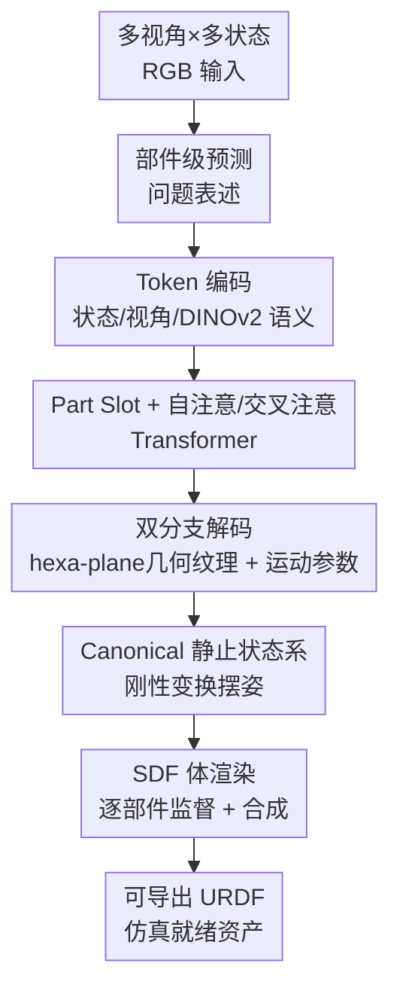

# ART: Articulated Reconstruction Transformer

**会议**: CVPR 2026  
**论文**: [CVF Open Access](https://openaccess.thecvf.com/content/CVPR2026/html/Li_ART_Articulated_Reconstruction_Transformer_CVPR_2026_paper.html)  
**代码**: [项目主页](https://kyleleey.github.io/ART/)（未见开源代码）  
**领域**: 3D视觉  
**关键词**: 铰接物体重建, 前馈Transformer, 部件级预测, 运动结构, 仿真资产

## 一句话总结
ART 把"铰接物体重建"重新表述成**部件级前馈预测**问题——用一组可学习的 part slot，从稀疏多视角、多状态 RGB 图像里一次性解码出每个刚性部件的几何、纹理和显式运动参数（轴/枢轴/运动类型），无需逐物体优化、跨类别通用，在部件级和整体几何指标上大幅超越前馈与优化两类基线。

## 研究背景与动机
**领域现状**：铰接物体（抽屉柜、微波炉、橱柜等带可动部件的日常物体）的数字孪生对 VR/AR、机器人和具身智能很关键。从图像重建它们，需要同时恢复**几何 + 纹理 + 底层运动学结构**（哪个部件能动、绕哪条轴动、是平移还是旋转）。

**现有痛点**：现有方法分两类，都不适配"稀疏输入"这个实用却困难的设定。① **逐物体优化**（PARIS、DTA、ArtGS 等做逆渲染/3DGS）虽精度高，但要约 100 个密集视角、依赖**脆弱的跨状态对应**，且每个实例都要长时间优化，对遮挡和初始化敏感；② **前馈方法**（URDFormer、SINGAPO 等）推理快，但训练数据局限于 PartNet-Mobility 这类小集合，只能覆盖少数类别、对未见物体泛化差。

**核心矛盾**：稀疏输入下既要快（前馈）又要跨类别泛化，但前馈方法被数据规模卡住、优化方法被密集视角与跨状态匹配卡住——速度、泛化、稀疏鲁棒性三者难以兼得。

**本文目标**：在**仅稀疏多状态 RGB**输入下，前馈、跨类别地重建出完整铰接物体（几何 + 纹理 + 运动参数），且产物可直接导出 URDF 等仿真格式。

**切入角度 / 核心 idea**：作者的关键洞察是——**铰接物体本质上就是一堆刚性部件的装配，运动定义了它们之间的运动学关系**。于是把重建从"逐像素优化整体场"改写成"**逐部件预测**"：借鉴大规模静态重建模型（LRM）的成功，用 Transformer 把图像 token 路由到一组可学习的 part slot，每个 slot 负责解码一个部件的统一表示。

## 方法详解

### 整体框架
ART 是一个类别无关的前馈模型。输入是已知相机内外参的多视角（V）× 多状态（T）图像集 $I=\{I_{v,t}\}$，物体被归一化到半径 $r$ 的包围球内；输出是 $P$ 个部件（含一个静止 base 部件）的统一表示。对每个部件 $p$ 预测 $X_p=\{\mathcal{T}_p,\mathcal{A}_p\}$，其中 $\mathcal{T}_p$ 是几何/纹理的 hexa-plane 参数，$\mathcal{A}_p=(B_p,C_p,D_p,O_p,S_p)$ 是运动参数。

整条 pipeline 是：把多视角多状态图像 patch 化成 token，拼上三类辅助信息（状态/视角/语义），送进 Transformer 与一组可学习 part slot 交互；slot 经多层注意力后分两路 MLP 头，一路解码 hexa-plane 几何纹理、一路解码运动结构向量；再用 SDF 体渲染把各部件按预测的运动参数摆到对应状态、合成出整物体图像做监督。所有部件都在**共享的 canonical 静止状态系**下预测，给定运动配置 $q$ 时用刚性变换 $T_p(q;C_p,D_p,O_p)$ 把部件摆到目标姿态。

### 关键设计

**1. 部件级前馈预测 + Part Slot：把整体重建拆成"每个 slot 管一个部件"**

这是 ART 的灵魂，直接针对"优化方法靠脆弱跨状态对应、前馈方法被类别绑死"的痛点。作者在网络里放 $P_0$ 个可学习的 part slot token，第一个 slot 固定给静止 base，其余建模可动部件；推理时按已知部件数 $P$ 取前 $P$ 个 slot（部件数可由现成 VLM 估计）。每个 slot 经注意力从图像 token 聚合信息后，解码出该部件的统一表示。这样重建变成"一组并行的部件预测"，天然产出物理可解释、可导出 URDF 的结构化输出，而不是一团需要再分解的体场——既继承了 LRM 的前馈速度，又因为是部件装配而跨类别通用。

**2. Canonical 静止状态系：用预定义 rest state 消除"同一物体被当成不同身份"的歧义**

如果按"第一帧观测"作为参考系来参数化运动，会引入严重歧义：同一物体的不同序列起始姿态不同（一条序列从关着开始、另一条从开着开始），导致同一物体的 part 包围盒和几何 GT 在不同序列里不一致，等于把同一物体当成多个身份来学。ART 改用每个物体实例**预定义的 rest state**（如所有抽屉关闭、微波炉关门，在数据构建时设定）作为 canonical 系，所有部件都在此系下预测。这保证了跨序列 GT 一致，带来更稳定的训练和明显更快的收敛——在铰接 3D 数据稀缺的现实下尤为关键。消融里去掉 rest-state 会让 PSNR 从 27.495 掉到 23.587。

**3. 自注意 + 交叉注意交错的 Transformer：把视觉信息精准路由到紧凑的 part slot**

多状态多部件输入比单物体设定多出大量 token。ART 用两类互补层：**自注意层**把图像与 part token 拼起来做全局注意，促进跨视角/状态/部件的全局上下文共享与部件间一致性；**交叉注意层**让图像 token 当 query、part token 当 key/value，把视觉信息显式路由到紧凑的 slot 集合，缓解部件间互相干扰。与多数只用自注意的 LRM 不同，作者把约 75% 的层替换成交叉注意，原因有二：(1) token 效率——交叉注意的有效注意窗口更小、更省算力；(2) 收敛与精度——交错交叉注意鼓励图像 token 与 part token 各司其职，加速收敛并提升最终质量，避免了纯自注意下 slot 专门化不稳定的问题。配套地，数据构建时强制**预定义部件顺序**，否则网络要同时学重建和部件匹配，会出现"slot collapse"（多个 slot 预测到同一位置），消融里去掉部件顺序掉点最严重（PSNR 27.495→22.588，dcDist 0.082→0.208）。

**4. 逐部件 SDF 体渲染监督 + 静态预训练 + 粗到细课程：在数据稀缺下学到强先验**

渲染用 SDF 体渲染以同时学几何与外观，关键是**所有渲染损失都在逐部件渲染上算，而非最终合成图**——只监督合成图会损害遮挡区域学习、并在部件边界附近扭曲几何/纹理。每个部件的渲染头用 RGB/mask 的 $L_2$ 加 LPIPS 感知损失；运动参数用交叉熵监督运动类型 $C_p$、MSE 监督 $B_p,D_p,O_p,S_p$。由于铰接数据远不如静态 3D 语料丰富，作者引入**静态预训练**：用 13 万个带部件分解的静态 3D 资产，只用渲染损失 + 部件包围盒中心/尺寸的 MSE 训练，学到几何、纹理与部件分解的强先验，下游全指标一致提升（消融去掉预训练 PSNR 28.678→27.495）。微调阶段再用**粗到细课程**：线性增大 SDF 标准差倒数逐步锐化表面，并把渲染监督分辨率从 128×128 退火到 256×256 以恢复更细几何。

### 损失函数 / 训练策略
总损失 = 渲染目标 + 运动参数直接监督。渲染侧：逐部件的 RGB/mask $L_2$ + RGB 的 LPIPS；运动侧：运动类型用 $L_{CE}$、其余参数用 MSE。训练分两阶段：静态预训练（仅渲染损失 + 包围盒 MSE）→ 铰接微调（粗到细课程：表面锐化 + 分辨率退火 128→256）。训练两个版本：多视角（V=4）对比优化方法，单目（V=1）对比前馈方法，固定 T=2（起始 & 结束两状态）。

## 实验关键数据

### 主实验

与**前馈基线**在 StorageFurniture 测试集（631 物体，单目，所有指标越低越好）：

| 方法 | dgIoU ↓ | dcDist ↓ | CD ↓ |
|------|---------|----------|------|
| URDFormer | 1.0710 | 0.1622 | 0.0536 |
| SINGAPO | 0.8306 | 0.0947 | 0.0059 |
| **ART (Ours)** | **0.4717** | **0.0538** | **0.0019** |

与**优化基线**在 PartNet-Mobility 测试集（4 视角 × 2 状态稀疏输入）：

| 方法 | PSNR ↑ | LPIPS ↓ | CD ↓ | F-Score ↑ |
|------|--------|---------|------|-----------|
| PARIS | 22.851 | 0.183 | 0.023 | 0.486 |
| DTA*（需深度） | 21.587 | 0.165 | **0.008** | **0.821** |
| ArtGS | 22.352 | 0.176 | 0.016 | 0.520 |
| **ART (Ours)** | **27.059** | **0.049** | 0.009 | 0.762 |

ART 在图像级指标（PSNR/LPIPS）上大幅领先。DTA 几何指标接近是因为它额外吃了深度输入，但其低 PSNR、高 LPIPS 暴露了外观恢复差；稀疏输入下优化方法依赖的密集跨状态对应难以建立，ArtGS 直接碎成噪声几何，而 ART 靠学到的先验给出连贯高保真网格。

### 消融实验
在 PartNet-Mobility 整体留出集（>130 个多视角多状态序列）上，以"w/o pre-train"（多视角从零训）为参考：

| 配置 | PSNR ↑ | dgIoU ↓ | dcDist ↓ | 说明 |
|------|--------|---------|----------|------|
| ART (Full) | 28.678 | 0.629 | 0.062 | 完整模型 |
| w/o pre-train | 27.495 | 0.665 | 0.082 | 去静态预训练，全指标退步 |
| monocular view | 25.961 | 0.731 | 0.086 | 单目，歧义增大明显掉点 |
| w/o rest-state | 23.587 | 0.878 | 0.113 | 按首帧参考，同物体被当多身份 |
| w/o part rendering loss | 24.465 | 0.681 | 0.075 | 只监督合成图，遮挡区学不好 |
| w/o defined part order | 22.588 | 1.118 | 0.208 | 掉点最严重，出现 slot collapse |

### 关键发现
- **部件顺序**贡献最大：去掉后掉点最严重（dgIoU 飙到 1.118、dcDist 0.208），印证了"不强制顺序则网络要同时学重建+匹配，相似部件多的柜子会 slot collapse"。
- **rest-state 与逐部件渲染损失**都很关键：前者解决跨序列身份歧义，后者解决遮挡区域与边界几何。
- **静态预训练**用大规模静态 3D 数据学先验，全指标一致提升，说明部件分解先验可从静态资产迁移到铰接重建。
- 多视角显著优于单目，符合稀疏视角下歧义需要多视角消解的直觉；真实图像（仅近似位姿、无背景 mask、零真实图训练）仍能恢复正确运动结构。

## 亮点与洞察
- **"铰接物体 = 刚性部件装配"这一表述**是全文支点：把难以前馈的"整体几何 + 运动学"拆成可并行预测的部件 slot，既得前馈速度又得跨类别泛化，且天然产出可导出 URDF 的结构化资产。
- **Canonical rest-state 的洞察很巧**：看似只是参考系选择，实则解决了"同一物体不同序列被当成不同身份"的数据级歧义，是稳定收敛的关键——这种"用一致 GT 定义换训练稳定性"的思路可迁移到任何多序列/多状态学习任务。
- **75% 交叉注意替换**是反 LRM 常规的工程选择：在多状态多部件这种 token 爆炸场景，交叉注意既省算力又强迫 image/part token 分工，避免 slot 专门化不稳定。
- **逐部件而非合成图监督**是处理遮挡的可复用 trick：在任何"组合体由部件构成、部件间互相遮挡"的重建任务里都值得借鉴。

## 局限与展望
- 作者承认：假设**部件数已知**、依赖**预标定相机位姿**。未来要做 pose-free 自标定变体、并把部件数估计集成进模型。
- 自己观察的局限：rest-state 需要在数据构建阶段人为设定（"所有抽屉关闭"），跨更开放的类别时"什么是 rest state"未必好定义；训练严重依赖大规模合成/采购的部件级标注资产（13 万静态 + 程序化生成数据），复现门槛高。
- 固定 T=2（起始&结束）两状态，对多自由度复杂运动序列的覆盖有限；图像统一 resize 到 128 也限制了最终几何精度上限。

## 相关工作与启发
- **vs SINGAPO / URDFormer（前馈）**: 它们预测运动学图再检索/拼装部件、受限于少数类别（尤其 storage-furniture）；ART 纯前馈直接预测部件几何/纹理 + 显式运动参数，训练数据更大更多样、跨类别通用，部件级与几何指标全面领先。
- **vs PARIS / DTA / ArtGS（优化）**: 它们靠密集多视角逐物体逆渲染 + 脆弱跨状态对应，稀疏输入下崩溃（ArtGS 碎成噪声）；ART 用学到的先验在 4 视角 2 状态下就给出连贯高保真结果，且无需测试时优化。
- **vs LRM 系静态重建**: ART 继承其 Transformer + 可微渲染范式，但把单一物体扩展为部件级结构化输出，并新增运动参数预测与逐部件监督，使输出兼具照片级真实与运动学可解释性。

## 评分
- 新颖性: ⭐⭐⭐⭐⭐ 把铰接重建重述为部件级前馈预测、配 part slot + canonical rest-state，范式清晰且首次在稀疏输入下跨类别打通。
- 实验充分度: ⭐⭐⭐⭐ 对前馈/优化两类基线、多套指标、五项消融都覆盖，但真实图像评测仅定性、测试集规模偏小。
- 写作质量: ⭐⭐⭐⭐⭐ 动机—表述—架构—消融逻辑顺畅，关键设计的"为什么"都讲清了。
- 价值: ⭐⭐⭐⭐⭐ 产物可直接导出仿真格式，对机器人/具身智能的资产生产有现实意义。

<!-- RELATED:START -->

## 相关论文

- [\[CVPR 2026\] Mirror Illusion Art](mirror_illusion_art.md)
- [\[CVPR 2026\] SPARK: Sim-ready Part-level Articulated Reconstruction with VLM Knowledge](spark_sim-ready_part-level_articulated_reconstruction_with_vlm_knowledge.md)
- [\[CVPR 2026\] SMVRT: Implicit Human 3D Modeling Using Sparse Multi-View Volumetric Reconstruction with Transformer Fusion](smvrt_implicit_human_3d_modeling.md)
- [\[CVPR 2026\] GGPT: Geometry-Grounded Point Transformer](ggpt_geometry_grounded_point_transformer.md)
- [\[CVPR 2026\] FreeArtGS: Articulated Gaussian Splatting Under Free-Moving Scenario](freeartgs_articulated_gaussian_splatting_under_free-moving_scenario.md)

<!-- RELATED:END -->
