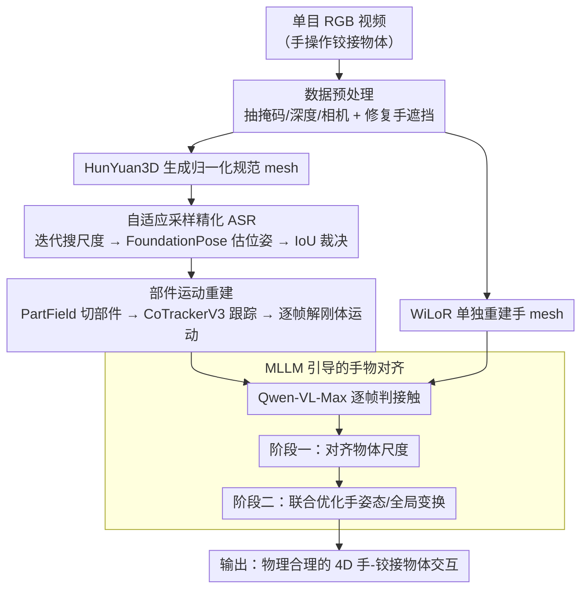

# ArtHOI: Taming Foundation Models for Monocular 4D Reconstruction of Hand-Articulated-Object Interactions

**会议**: CVPR 2026  
**arXiv**: [2603.25791](https://arxiv.org/abs/2603.25791)  
**代码**: [https://arthoi-reconstruction.github.io](https://arthoi-reconstruction.github.io)  
**领域**: 3D 视觉 / 手物交互重建  
**关键词**: Hand-Object Interaction, Articulated Object, 4D Reconstruction, Foundation Models, MLLM

## 一句话总结
ArtHOI 首次实现了从单目 RGB 视频重建手与铰接物体（如剪刀、眼镜、笔记本电脑）4D 交互的完整流水线，通过自适应采样精化（ASR）优化物体度量尺度和位姿、以及 MLLM 引导的手物对齐方法，在多个数据集上超越了需要预扫描物体几何的基线 RSRD。

## 研究背景与动机

**领域现状**：手物交互（HOI）重建在人体行为分析、机器人操作和增强现实中至关重要。早期方法依赖预定义物体模板或类别特定知识，泛化能力有限。

**现有方法的两大局限**：
   - HOI 方法（template-free）虽然泛化性提升，但**几乎只适用于刚体物体**
   - 铰接物体 4D 重建方法通常需要**预扫描物体**（获取规范形状）或**多视角视频**，无法应对自然场景

**核心挑战**：从单目视频重建手-铰接物体交互是高度病态问题——视觉线索有限、遮挡频繁、物体有内部自由度。

**切入角度**：借鉴人类"利用积累知识和经验来感知复杂交互"的能力，**利用多个基础模型的丰富先验**（image-to-3D、位姿估计、深度估计、跟踪、MLLM 等）来解决这一病态问题。

**核心矛盾**：简单集成多个基础模型会失败，因为：(1) image-to-3D 生成的 mesh 是归一化坐标系的，缺乏度量尺度；(2) 独立重建的手和物体存在空间不对齐。

## 方法详解

### 整体框架

ArtHOI 要做的事是：给一段单目 RGB 视频（手在操作剪刀、眼镜这类铰接物体），不依赖任何预扫描模板，重建出手和物体随时间变化的 4D 交互。它的思路不是从头训练一个端到端网络，而是把一堆现成的基础模型（image-to-3D、位姿估计、深度、跟踪、MLLM）当作"零件"组装起来，再用一套优化框架把这些零件各自不完美的预测对齐成一个物理合理的结果。

整条流水线分四步往下走。先做**数据预处理**：用基础视觉模型抽出物体掩码、深度图和相机参数，并对视频做修复，把手遮住物体的那部分补回来。然后重建**规范物体 mesh**：HunYuan3D 从单帧生成一个归一化坐标系下的 3D mesh，但它没有真实尺度，于是用 ASR（下面第 1 个设计）把度量尺度和初始位姿找回来。接着做**部件运动重建**：把 mesh 切成可动部件，用密集跟踪恢复每个部件逐帧的刚体运动。最后做**手物对齐**：单独重建出手的 mesh，再让 MLLM 判断每帧哪只手、哪些手指在接触物体，据此联合优化、消除穿透或脱离。

### 关键设计

**1. 自适应采样精化 ASR（Adaptive Sampling Refinement）：把归一化 mesh 的尺度找回来**

image-to-3D 模型吐出来的 mesh 处在归一化坐标系里，没有真实物理尺寸。如果直接拿它喂给 FoundationPose 估位姿，mesh 尺度和深度图对不上，位姿会算崩。ASR 的做法是把"找尺度"变成一个有反馈的搜索过程：先用反投影深度估一个粗略尺度作为起点，然后在它附近的自适应区间内迭代采样若干候选尺度；每试一个尺度就调一次 FoundationPose 估出位姿，把物体按这个位姿渲染成轮廓，和真实掩码算 IoU，谁的 IoU 高就留谁。关键在那个"自适应"——如果最近几轮 IoU 都没改善，说明真值可能在当前区间外，就把采样半径翻倍（$\delta \leftarrow 2\delta$）向外探；一旦在改善就保持当前区间精搜。这样既能在初值偏差大时跳出去，又能在接近真值时收敛，比一次性回归尺度鲁棒得多，因为它始终用"渲染轮廓对不对得上掩码"这个可验证的信号来裁决，而不是盲信任何单一模型的输出。

**2. 部件运动重建：让铰接物体的每个部件各自动起来**

铰接物体的麻烦在于它不是一个刚体——剪刀的两片刃、眼镜的两条腿会相对转动，整体一个 SE(3) 变换描述不了。ArtHOI 先用 PartField 把规范 mesh 切成若干语义部件，然后用 CoTrackerV3 在视频里密集跟踪每个部件表面点的 2D 轨迹，再借深度把这些轨迹提升到 3D，从而为每个部件单独解逐帧的刚体运动。优化目标同时管两件事：

$$\mathcal{L}_{motion} = \mathcal{L}_{track} + \lambda_{smooth}\,\mathcal{L}_{smooth}$$

其中 $\mathcal{L}_{track}$ 要求部件运动后投影回图像要和 CoTracker 的观测轨迹一致，$\mathcal{L}_{smooth}$ 用相邻帧的离散二阶差分惩罚加速度，约束运动在时间上平滑、不抖动。两项一起，既贴合观测又不会因单帧跟踪噪声而跳变。

**3. MLLM 引导的手物对齐：用语言模型当接触先验**

手和物体是分头重建的——手用 WiLoR、物体走前两步——各自坐标系和尺度都不一致，硬拼在一起常出现手指穿进物体或悬空脱离。要修这个，得知道"到底哪帧、哪只手、哪些手指真的在接触"，而这恰恰是几何信息里读不出来的。ArtHOI 的巧思是把这个判断外包给 MLLM：用结构化 prompt 查询 Qwen-VL-Max，逐帧推理接触状态。为压制 MLLM 的典型错误，它先问相机是自我中心还是外中心视角，避免左右手判反；又把相邻帧的 RGB 加上彩色化深度图拼在一起喂进去，给足上下文。拿到接触关系后分两阶段优化：阶段一只调物体尺度 $s_c^o$，借手已有的度量尺度先验把物体尺度对齐过来；阶段二固定物体尺度，联合优化手姿态 $\theta_i^h$ 和全局变换 $\mathbf{T}_i^h$，让接触点真正贴合。驱动对齐的接触损失把每个被判为接触的手指顶点拉向最近的物体表面点：

$$\mathcal{L}_{contact} = \sum_{i \in \mathbb{C}} \sum_{\mathbf{v}_t \in \mathbb{T}_i} \min_{\mathbf{v}_o \in \mathcal{G}_i^o} \|\mathbf{v}_o - \mathbf{v}_t\|_2$$

其中 $\mathbb{C}$ 是 MLLM 判定接触的帧/手指集合，$\mathbb{T}_i$ 是手指顶点，$\mathcal{G}_i^o$ 是对应的物体表面候选点。

### 一个完整示例

以一段 100 帧、960×540 的"手开合剪刀"视频为例，走一遍这四步。预处理先抠出剪刀掩码、估好深度和相机，并把手遮住的刃补回来；HunYuan3D 从一帧生成一把归一化的剪刀 mesh，但此刻它可能只有"单位 1"那么大，尺度全错。ASR 上场：从反投影深度估出粗略尺度后，以 $\delta=0.03$ 的初始区间采样候选尺度，每个尺度渲染轮廓和掩码比 IoU；前几轮若都没改善就把区间翻到 $0.06$ 向外探，命中后再回到细搜，约 20 次迭代锁定真实尺度和初始位姿。接着 PartField 把剪刀切成两片刃，CoTrackerV3 跟踪两片刃表面点并升到 3D，逐帧解出两片各自的开合运动。最后 WiLoR 重建出手，Qwen-VL-Max 逐帧判出"拇指与食指接触手柄环"，先用手的尺度把剪刀尺度对正，再联合优化手姿态把手指顶点贴到手柄环表面，得到没有穿透、开合自然的 4D 手-剪刀交互。

### 损失函数 / 训练策略
- 纯优化框架，无需训练神经网络
- 单视频处理约 1 小时（100 帧，960×540），A6000 GPU
- ASR：20 次迭代，初始范围 $\delta=0.03$
- 运动优化：每帧 500 次迭代，Adam，学习率从 0.02 线性衰减到 0.002
- HOI 对齐：800 步优化

## 实验关键数据

### 主实验（ArtHOI-RGBD 数据集）

| 物体 | 方法 | CD(mm)↓ | MSSD(mm)↓ | F10↑ | F5↑ |
|------|------|---------|-----------|------|-----|
| Headphone | RSRD (预扫描) | 14.71 | 41.06 | 41.67 | 20.91 |
| Headphone | **ArtHOI** | **8.12** | **30.43** | **69.68** | **42.19** |
| CD Drive | RSRD | 282.33 | 348.59 | 10.90 | 6.92 |
| CD Drive | **ArtHOI** | **3.33** | **9.71** | **96.01** | **78.75** |
| Stapler | RSRD | 288.70 | 363.92 | 0.80 | 0.34 |
| Stapler | **ArtHOI** | **4.49** | **20.15** | **91.63** | **67.94** |

### 消融实验（根据论文中 ARCTIC 数据集结果推断的关键模块贡献）

| 配置 | 说明 |
|------|------|
| 无 ASR | FoundationPose 直接估计尺度和位姿，因 mesh/深度不一致而不稳定 |
| 无 MLLM 对齐 | 手物构成出现穿透/脱离 |
| 完整 ArtHOI | 物理合理的 4D HOI 重建 |

### 关键发现
- ArtHOI **无需预扫描物体**，却在多数物体上超越了需要预扫描的 RSRD（CD Drive：CD 降低 80×）
- 在 RSRD 数据集上也有竞争力，某些物体（Scissor, Sunglasses）明显领先
- MLLM 接触推理的准确率足以指导优化，但仍存在左右手混淆等错误

## 亮点与洞察
- **"调和多个不完美先验"的范式**：每个基础模型的预测可能有误，但通过 ASR 和优化框架可以协调它们，非常具有启发性
- **MLLM 作为物理先验提供者**：用语言模型推理接触状态来约束物理优化，是 MLLM 在 3D 重建中的创新应用
- **两个新数据集**的贡献：ArtHOI-RGBD 和 ArtHOI-Wild 提供了铰接物体 HOI 的评测基准

## 局限与展望
- 处理单个视频约 1 小时，效率需大幅提升
- 依赖多个基础模型的级联，每个环节的错误会传播
- PartField 对部件分割的准确性直接影响运动重建质量
- MLLM 的接触推理仍有误差（尤其在遮挡严重时），可引入学习式方法替代

## 相关工作与启发
- RSRD 是直接竞品，但需要预扫描；ArtHOI 通过基础模型先验免去了这一需求
- 与 EasyHOI（逐帧 HOI 重建）相比，ArtHOI 利用时间一致性大幅提升
- "多基础模型协同"的范式可推广到其他复杂场景理解任务

## 评分
- 新颖性: ⭐⭐⭐⭐⭐ 首次实现单目铰接物体 HOI 4D 重建，方法论贡献显著
- 实验充分度: ⭐⭐⭐⭐ 三个数据集评估，但消融较少，部分模块贡献难以定量分离
- 写作质量: ⭐⭐⭐⭐ 框架清晰，但四阶段流水线细节较多
- 价值: ⭐⭐⭐⭐⭐ 开创性问题定义，对机器人、AR 应用有直接价值

<!-- RELATED:START -->

## 相关论文

- [\[CVPR 2026\] Clay-to-Stone: Phase-wise 3D Gaussian Splatting for Monocular Articulated Hand-Object Manipulation Modeling](clay-to-stone_phase-wise_3d_gaussian_splatting_for_monocular_articulated_hand-ob.md)
- [\[ICML 2026\] PhysHanDI: Physics-Based Reconstruction of Hand-Deformable Object Interactions](../../ICML2026/3d_vision/physhandi_physics-based_reconstruction_of_hand-deformable_object_interactions.md)
- [\[CVPR 2026\] Recovering Physically Plausible Human-Object Interactions from Monocular Videos](recovering_physically_plausible_human-object_interactions_from_monocular_videos.md)
- [\[CVPR 2026\] 4DEquine: Disentangling Motion and Appearance for 4D Equine Reconstruction from Monocular Video](4dequine_disentangling_motion_and_appearance_for_4d_equine_reconstruction_from_m.md)
- [\[CVPR 2026\] ForeHOI: Feed-forward 3D Object Reconstruction from Daily Hand-Object Interaction Videos](forehoi_feed-forward_3d_object_reconstruction_from_daily_hand-object_interaction.md)

<!-- RELATED:END -->
