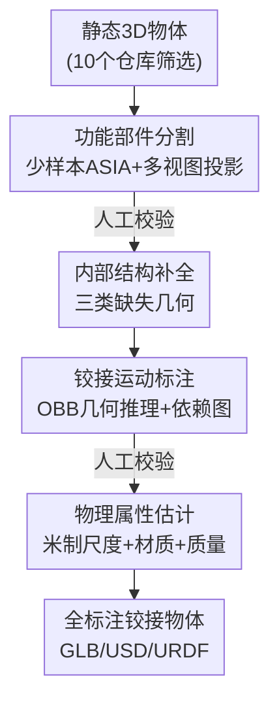

# Artiverse: A Diverse and Physically Grounded Dataset for Articulated Objects

**会议**: CVPR 2026  
**论文**: [CVF Open Access](https://openaccess.thecvf.com/content/CVPR2026/html/Iliash_Artiverse_A_Diverse_and_Physically_Grounded_Dataset_for_Articulated_Objects_CVPR_2026_paper.html)  
**代码**: 项目页 https://3dlg-hcvc.github.io/artiverse/ （数据/代码待发布）  
**领域**: 3D视觉  
**关键词**: 铰接物体, 3D数据集, 半自动标注, 物理属性, 运动学建模

## 一句话总结
Artiverse 用一条"少样本分割 + 几何推理 + 多阶段人工校验"的半自动标注流水线，从 10 个静态 3D 仓库筛出 5402 个高质量铰接物体（88 类、24607 个部件），逐部件标注功能语义、铰接关节（含多自由度）、材质/质量/米制尺度，把人工标注时间砍掉 30%+，并在部件运动分析、铰接物体生成、物理仿真三个下游任务上证明其价值。

## 研究背景与动机

**领域现状**：研究"可交互的功能性 3D 物体"（抽屉滑开、门转开、水龙头旋开）需要数据集同时具备三个维度——功能部件分解、运动学关系、物理落地（米制尺度/质量/材质/真实几何与纹理）。

**现有痛点**：现有 3D 资源各缺一块。大规模仓库（ShapeNet、Objaverse）几何多样但几乎都是静态形状；铰接数据集（PartNet-Mobility、AKB-48）标了部件可动性，但关节复杂度低（大多是单自由度旋转/平移）、部件结构与类别单一、纹理简化、内部几何缺失；物理属性更是几乎没人标——直到最近 ArtVIP 才给 206 个铰接物体做了物理数字孪生，PhysX-3D 给 PartNet 标了物理属性但主要是刚体。

**核心矛盾**：要在"规模"和"功能完整度"之间同时拿高分很难。纯人工标注（PartNet-Mobility 等）质量高但扩不动——识别可动部件边界、定义合理关节与运动范围、理顺运动学层级都需要 3D + 运动学专业知识；而纯 2D VLM 标注（PhysX-3D 用 VLM 看渲染图推属性）虽然便宜，但缺乏 3D 几何，在网格上分割部件、确定关节轴这类需要空间精度的任务上不可靠。

**本文目标**：造一个"又大又全"的铰接物体数据集，同时解决标注成本和专业门槛两个工程难题。

**核心 idea**：不押注纯人工也不押注纯 VLM，而是设计一条**人在环路的半自动流水线**——用少样本分割模型 + 几何启发式生成初始提案（部件分割、运动参数、物理属性），再让标注员在分割和运动两个关键阶段做多轮校验纠错，把自动结果当"草稿"、人当"审稿"，从而在保质量的前提下把标注规模推到数千个物体。

## 方法详解

### 整体框架
Artiverse 的产出物是一个数据集，但它的核心技术贡献是一条**半自动标注流水线**：每个被选中的物体在预处理后，依次流过四个阶段——① 功能部件分割、② （可选）内部结构补全、③ 铰接运动标注、④ 物理属性估计；其中分割和运动两个阶段末尾各插一道人工校验，把干净结果传给下游模块，最后再做一次总校验，输出可直接进仿真器的全标注铰接物体。整条线的设计哲学是"自动出提案、人工做审校"：学习模型/几何算法负责把 80% 的活干掉，人只负责确认和修正，从而既扩规模又保质量。

为保证语义一致，作者为每个物体类别预先定义**类别模板**（列出该类可能的部件标签、运动类型、依赖关系），模板由专家撰写、可在标注中按发现补充，同时指导自动推理和人工校验。

### 关键设计

**1. 功能部件分割：用少样本模型把"功能边界"投到 3D 网格上**

部件分割的难点在于：部件边界由**功能行为**而非视觉/语义相似性决定（同样是块板子，是抽屉面板还是固定背板，取决于它能不能动），通用 3D 分割器学不会这种依赖标签上下文的细微区分。作者因此选用支持少样本标签定制的 SOTA 模型 ASIA——只需在 3D 上手标十几个代表性形状、渲染多视图部件掩码当训练数据，ASIA 就能在多视图图像上产出"懂功能语义"的标签感知掩码，并按相似部件结构分组训练以减少冗余。

把 2D 分割投回 3D 网格分两步：先基于网格拓扑连通性预计算一个**过分割（over-segmentation）**，每个过分割块按多视图投影覆盖的像素数做"标签投票"；未被覆盖的内部表面用基于采样点物理邻近度的距离传播补标签。语义收敛后再用 **union-find 并查集**按局部几何连续性把每个语义组拆成互不相连的部件实例。最后标注员在 3D 部件标注 UI 上检查实例与标签、必要时修正并补充模板里没有的部件，专家再过一遍保证跨标注员一致。

**2. 内部结构补全：把静态资产里"看不见就没建模"的几何补回来**

静态数据集里绝大多数物体内部几何缺失，但内部结构往往正是功能所在（冰箱要有隔板才能放东西）。作者针对三类缺失分别处理：① **部分建模的铰接部件**——抽屉常只建了正面板、内箱缺失，用几何感知补全算法沿运动约束方向把几何延展出来，保证全运动范围内合理；② **完全缺失的铰接部件**——洗碗机的碗篮、微波炉的转盘、冰箱的活动隔层，用程序化算法**从同类其他物体引用相似部件**填进来；③ **缺失的交互可供性部件**——储物家具常被建成空壳，按类别模板程序化加入隔板、挂架、分隔等结构。三类都依赖类别模板保证几何一致和合理空间布局。

**3. 铰接运动标注：几何规则推关节参数 + 模板推运动学依赖**

这一阶段在已校验的分割和完整几何上做。自动提案部分设计了一套几何规则：对每个部件计算 **PCA 对齐的有向包围盒（OBB）**、在接触区域采样点，结合几何接触与碰撞关系推断不同运动类型的**关节类型、运动轴、关节限位**。部件间的运动学依赖（如"按按钮才能开微波炉门"这种耦合行为）则依据空间连通性和模板里定义的依赖选项推断；这套推理规则可跨类别复用、按部件类型注册，只需对特殊部件做小调整。人工校验阶段标注员在 web 界面上交互式可视化和调整铰接——确认补全的内部几何是否真实、提出的运动是否物理合理，界面还支持**相似部件间运动复制**和即时运动预览来提效。

**4. 物理属性估计：LLM 给尺度/密度先验 + 几何算体积反推质量**

为支持物理仿真，作者标注物体的米制尺度、部件的材质和质量。**米制尺度**优先取自原数据源，否则让 LLM 推每个子类别的合理物理尺寸范围、在范围内采样缩放——尺度必须在流水线早期定好，因为部件实例分解和内部补全的几何算法都依赖它的鲁棒性。**逐部件质量**estimate 为"近似体积 × 在估计材质密度范围内采样的密度"：预定义材质标签列表、让 LLM 给每种材质的合理密度范围，给每个部件标签分配默认材质当初始提案、最后人工核验。体积估计对表面网格非平凡（数据里混有实心壳体和无厚度空心件），因此按语义标签区分处理——实心件用四面体化（tetrahedralization）提取体网格直接算体积，空心件先沿法向向内偏移造壳再四面体化近似。

### 一个例子：一台搅拌机走完流水线
以图 2 里的手持搅拌机为例：① 分割阶段切出 head（头）、base（底座）、blade（搅拌头）、switch（开关）、trigger（触发器）等功能部件；② 内部补全检查无明显缺失；③ 运动标注给 blade 配 `continuous` 关节（轴 `[0,0,1]`、原点 `[0,0.34,-0.05]`），给某个部件配 `revolute` 关节（轴 `[0,1,0]`、限位 `[-40°,-40°]`），并建立 switch→blade 的功能依赖（按开关才转）；④ 物理属性给 jar 部件标材质 plastic、密度 1.20 g/cm³、体积 615 cm³、反推质量 0.74 kg。最终导出 GLB/USD/URDF，可直接丢进仿真器。

## 实验关键数据

### 数据统计与标注效率
Artiverse 含 5402 个人造铰接物体，源自 10 个仓库，覆盖 20 个超类、61 个主类、88 个子类。与两个主流数据集对比，规模和复杂度全面领先：

| 数据集 | #物体 | #类别 | 功能部件总数 | 铰接部件总数 | 关节总数 | 2-DoF关节 |
|--------|-------|-------|------------|------------|---------|-----------|
| PartNet-Mobility | 2,346 | 46 | 14,100 | 11,753 | 11,753 | 0 |
| ArtVIP | 205 | 29 | 1,784 | 705 | 705 | 0 |
| **Artiverse** | **5,402** | **88** | **38,608** | **24,607** | **24,120** | **480** |

标注效率方面，对比全人工标注（每类抽 5 个代表物体计时）：半自动流水线在**部件分割省 32.0%、运动标注省 33.5%** 的人工时间，平均人工纠错时间降到分割 1.5 分钟、运动 1.3 分钟，**50.12% 的部件自动结果无需任何人工调整**；专家一致性核验额外加约 0.8 分钟/物体。

### 下游任务一：部件运动分析（跨数据集泛化）
用 FPNGroupMot（来自 S2O）做交叉评测，分别在 Artiverse 和 PM 上训练、在两者测试集上评估（P/R/F1 为分割指标，+M/+MA/+MAO 为运动类型/轴/原点逐级细化的 F1）：

| 训练集 | 测试集 | P | R | F1 | +M | +MA | +MAO |
|--------|--------|------|------|------|------|------|------|
| PM | PM | 81.8 | 46.0 | 54.2 | 22.1 | 17.0 | 14.3 |
| Artiverse | PM | 82.2 | 47.9 | 55.8 | 22.4 | 15.9 | 8.7 |
| PM | Artiverse | 72.8 | 31.7 | 40.6 | 7.2 | 2.5 | 1.2 |
| Artiverse | Artiverse | 77.0 | 43.0 | 50.7 | 22.4 | 16.6 | 10.8 |

### 下游任务二：图像条件铰接物体生成
对比纯 VLM 的 Articulate-Anything（AA）和在 Artiverse 上重训的 SINGAPO（SG），RS/AS-dgIoU 越高越好、dcDist 与 AOR 反映重建/碰撞质量：

| 测试集 | 方法 | RS-dgIoU | AS-dgIoU | AOR↑ |
|--------|------|----------|----------|------|
| PM | SG | 0.756 | 0.768 | 0.022 |
| PM | AA | 1.172 | 1.179 | 0.024 |
| Artiverse | SG | 0.810 | 0.822 | 0.009 |
| Artiverse | AA | 1.250 | 1.258 | 0.042 |

### 关键发现
- **训在 Artiverse 普遍更能泛化**：两个任务上换成 Artiverse 训练，在 PM 测试集上分割和运动指标都涨（如 F1 54.2→55.8），说明数据多样性和标注完整度提升了模型泛化。
- **Artiverse 也是更难的 benchmark**：所有方法在 Artiverse 测试集上掉点明显（+MAO 从 14.3 级别掉到个位数），多自由度/依赖关节的复杂几何与运动暴露了现有方法的推理瓶颈——它既是更强训练资源，也是更苛刻的评测台。
- **VLM 先验在精细铰接上不够**：纯 VLM 的 Articulate-Anything 在 AS-gIoU 和 AOR 上持续落后于学结构先验的 SINGAPO，说明没有直接监督，VLM 抓不住细粒度铰接细节。
- **仿真就绪**：资产以 URDF/USD 发布，直接载入 Genesis 物理引擎即可训练策略开柜门，验证关节建模的准确性。

## 亮点与洞察
- **"自动出提案、人工做审校"的分工很务实**：把标注拆成可被学习模型/几何算法预填的提案 + 关键节点的人工校验，既不迷信纯 VLM 的空间精度，也不被纯人工的成本拖死——50% 部件零人工干预这个数字很能说明流水线设计到位。
- **少样本分割 + 拓扑过分割 + 并查集**这套把 2D 功能语义可靠投回 3D 实例的组合拳，是数据集论文里少见把"2D→3D 标签传播"工程细节讲清楚的，可迁移到任何需要在网格上做功能部件标注的场景。
- **用 LLM 当"物理常识先验源"而非直接标注器**：让 LLM 给尺度范围、材质密度范围当采样先验，再用几何算法（四面体化算体积）落地质量，规避了 VLM 直接读数不可靠的问题，是 LLM 融入几何流水线的一个干净范式。
- **多自由度/依赖关节**（480 个 2-DoF、按钮-门耦合）让数据集真正区别于"清一色单自由度旋转/平移"的前辈，也是它能当更难 benchmark 的根本。

## 局限与展望
- 作者承认现有方法在 Artiverse 复杂铰接上仍吃力，需要新模型来做统一的铰接行为推理；并计划持续扩大规模、多样性和物理真实度。
- ⚠️ 数据/代码截至论文仅给出项目页，复现依赖后续发布的资产与标注接口。
- 半自动流水线的质量上限仍受少样本分割模型（ASIA）和几何启发式规则的能力约束；类别模板需专家预先撰写，扩展到全新物体家族时模板成本不可忽略。
- 物理属性（密度、质量）来自 LLM 先验采样 + 几何近似而非真实测量，空心件体积用"法向偏移造壳"近似，对薄壁/异形件可能有偏差，用于精密力学仿真时需谨慎。

## 相关工作与启发
- **vs PartNet-Mobility**：PM 是最常用铰接数据集但几乎全是单自由度运动、缺纹理/物理属性；Artiverse 在类别（88 vs 46）、部件结构、多自由度关节和逐部件材质/质量上全面扩展，且证明在 PM 上训练的模型换到 Artiverse 训练泛化更好。
- **vs ArtVIP**：ArtVIP 给 206 个铰接物体做了高质量物理数字孪生，但规模小（5402 vs 205）；Artiverse 用半自动流水线把"带物理属性的铰接资产"推到数千量级。
- **vs PhysX-3D**：PhysX-3D 用 VLM 从 2D 渲染推物理属性、主要面向刚体；Artiverse 指出纯 2D VLM 在网格分割和关节轴这类需要空间精度的任务上不可靠，因此引入多视图少样本模型 + 几何启发式来利用完整 3D 结构。

## 评分
- 新颖性: ⭐⭐⭐⭐ 不是新模型而是新数据集+标注流水线，但"少样本分割+几何推理+人在环路+LLM 物理先验"的组合在铰接物体领域是首个把规模、功能完整度、物理落地同时拉满的工作。
- 实验充分度: ⭐⭐⭐⭐ 标注效率、部件运动分析、铰接生成、物理仿真四类验证齐全，且做了跨数据集交叉评测；但下游任务各只用 1-2 个 baseline。
- 写作质量: ⭐⭐⭐⭐ 流水线四阶段讲得清晰，2D→3D 投影、体积估计等工程细节有交代。
- 价值: ⭐⭐⭐⭐⭐ 为铰接物体理解、生成、具身仿真提供了更大更真实的训练与评测资源，且半自动流水线本身可复用。

<!-- RELATED:START -->

## 相关论文

- [\[CVPR 2026\] PhyGaP: Physically-Grounded Gaussians with Polarization Cues](phygap_physically-grounded_gaussians_with_polarization_cues.md)
- [\[CVPR 2026\] ICTPolarReal: A Polarized Reflection and Material Dataset of Real World Objects](ictpolarreal_a_polarized_reflection_and_material_dataset_of_real_world_objects.md)
- [\[CVPR 2026\] Part$^{2}$GS: Part-aware Modeling of Articulated Objects using 3D Gaussian Splatting](part2gs_part-aware_modeling_of_articulated_objects_using_3d_gaussian_splatting.md)
- [\[CVPR 2026\] 3DReflecNet: A Large-Scale Dataset for 3D Reconstruction of Reflective, Transparent, and Low-Texture Objects](3dreflecnet_a_large-scale_dataset_for_3d_reconstruction_of_reflective_transparen.md)
- [\[CVPR 2026\] OLATverse: A Large-scale Real-world Object Dataset with Precise Lighting Control](olatverse_a_large-scale_real-world_object_dataset_with_precise_lighting_control.md)

<!-- RELATED:END -->
