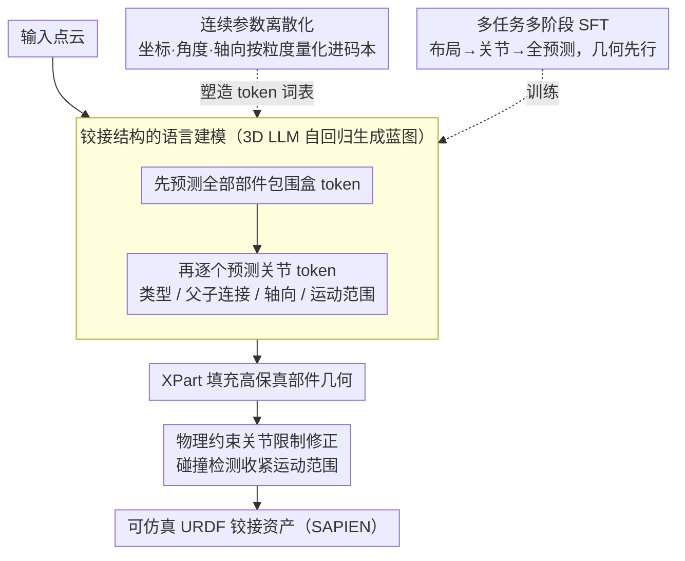

# ArtLLM: Generating Articulated Assets via 3D LLM

**会议**: CVPR 2026  
**arXiv**: [2603.01142](https://arxiv.org/abs/2603.01142)  
**代码**: [https://authoritywang.github.io/artllm](https://authoritywang.github.io/artllm)  
**领域**: 3D 视觉 / 铰接物体生成  
**关键词**: Articulated Object, 3D LLM, URDF, Autoregressive, Part-Aware Generation

## 一句话总结
ArtLLM 将铰接物体生成建模为语言生成问题，使用 3D 多模态 LLM 从点云自回归预测部件布局和运动关节参数（离散化为 token），再结合 XPart 生成高保真部件几何，在 PartNet-Mobility 数据集上显著超越现有方法（mIoU 0.69, 推理仅需 19 秒）。

## 研究背景与动机

**领域现状**：交互式数字环境（游戏、机器人、仿真）依赖铰接 3D 物体，其功能来源于部件几何和运动结构。现有方法存在根本局限。

**两类方法的痛点**：
   - **优化重建方法**（PARIS, VideoArtGS, ArtGS）：需要逐物体慢速关节拟合，通常只能处理单关节简单物体
   - **检索装配方法**（SINGAPO, CAGE, URDFormer）：从固定部件库中检索拼装，几何重复性高、泛化差

**3D 生成的断层**：通用 3D 生成模型（Trellis, Hunyuan3D）已能生成高质量几何，部件级生成（XPart, OmniPart）也取得进展。但这些模型**不理解运动结构**——生成的部件不知道该怎么动，导致几何和运动脱节。

**切入角度**：需要一个**统一理解几何和铰接的方案**。LLM 天然适合处理变长的结构化序列，利用 3D LLM 的序列建模和推理能力来自回归预测铰接蓝图。

**核心 idea**：将 URDF 铰接结构离散化为 token 序列，训练 3D LLM 从点云自回归生成"部件布局 + 运动关节"的统一蓝图，再驱动部件生成模型合成几何。

## 方法详解

### 整体框架
ArtLLM 要解决的是：给一个静态点云，怎么同时把它"切成会动的部件"并"标出每个部件怎么动"，最后还原成可直接放进仿真器的铰接资产。整篇的做法是把这个看似几何的任务彻底翻译成一个序列生成问题——先让一个 3D 多模态 LLM 读点云，自回归地吐出一串 token，这串 token 描述了每个部件的包围盒（bounding box）和它们之间的运动关节；这相当于先画出物体的"运动蓝图"。蓝图里的包围盒随后交给 XPart 去填充高保真几何，得到真正的部件 mesh；最后再做一道物理后处理，靠碰撞检测把每个关节的运动范围收紧到不会自穿模的程度。三步连起来，输入一个点云，输出一个能在 SAPIEN 里被驱动的 URDF 资产。

### 关键设计

**1. 铰接结构的语言建模：把 URDF 蓝图变成一句可生成的"话"**

铰接物体的难点在于它既是几何（部件长什么样）又是结构（部件怎么连、怎么转），传统方法很难用一个表示同时拿下两者。ArtLLM 的切入点是注意到 URDF 本身就是一段结构化的、变长的描述，天然契合 LLM 擅长的序列建模。于是每个部件被参数化成一个轴对齐包围盒 $\text{BBox}(x_{min}, y_{min}, z_{min}, x_{max}, y_{max}, z_{max})$，每个关节则展开成类型、父子连接、轴方向、轴位置和运动范围这几项，覆盖 Revolute、Continuous、Prismatic、Screw 四种关节。生成时按固定顺序展开：先把所有部件的 bounding box 一次性预测完，再逐个补上关节定义——先有"骨架"再连"关节"，让后面的运动推理能建立在已确定的部件布局之上。

**2. 连续参数离散化：让本质上只会吐 token 的 LLM 也能精确报坐标**

上一步把蓝图写成了序列，但包围盒坐标、旋转角度这些都是连续量，而 LLM 本质上是在离散词表上做分类，直接回归连续值会数值不稳定。ArtLLM 的办法是把每一类物理量按它的取值范围和需要的精度分别量化进不同粒度的 bin：包围盒坐标在 $[-1,1]$ 内量化成 128 个 bin，关节原点同样 128 个 bin，旋转角度范围在 $[-2\pi, 2\pi]$ 上用 48 个 bin，平移距离用 64 个 bin。最讲究的是关节轴方向——它没有简单地均匀撒点，而是构建了一个 128 条目的码本，先在 XY/YZ/XZ 三个平面上均匀采样把轴对齐方向铺密，再用 FPS 在 Fibonacci 球上补足其余方向。这种层级码本对现实物体里最常见的主轴对齐方向给了更密的覆盖，又不至于丢掉斜向关节的灵活性；消融里去掉离散化后 IoU 从 0.473 掉到 0.352，是所有改动里影响最大的一项。

**3. 多任务多阶段 SFT：把"看懂几何"和"想清运动"解耦着学**

直接端到端学"点云→完整蓝图"对小模型偏难，因为它要同时学会切部件和推关节两件难度不同的事。ArtLLM 把训练拆成三个任务——只预测部件布局、给定布局再预测关节、以及端到端全预测——并分两阶段推进：阶段一只训练部件布局预测，点云编码器用 P3SAM 的预训练权重初始化，先把部件级几何理解打扎实；阶段二再在三个任务上联合 SFT，让模型在已有几何基础上学运动推理。三个任务的数据按 3:2:5 混合。这种由易到难、几何先行的安排让运动推理有了可靠的几何根基，消融显示去掉多任务后除轴方向外的所有指标都退步，说明不同难度任务的共训确实互补。

**4. 物理约束关节限制修正：用碰撞检测补回单帧预测缺失的运动常识**

LLM 是在单个时间步上预测的，它能说出"这是个旋转关节、范围多大"，却感知不到部件转起来会不会撞到别的部件，于是预测的运动范围常常物理上不可行。这一步在生成之后做一道后处理：对旋转关节，在预测范围内把子部件真的铰接转一遍，逐角度计算它与其余静态部件的碰撞体积；当碰撞体积的导数出现尖峰，就意味着此刻刚好开始穿模，于是用层级搜索定位这个精确角度，把它设为修正后的限位，平移关节同理处理。这样修出来的关节范围保证子部件不会自穿模，定性结果显示自碰撞被有效消除，而且因为是离线后处理，并不拖慢推理速度。

### 损失函数 / 训练策略
- 标准交叉熵损失用于 SFT
- 多任务数据混合比 3:2:5
- 余弦学习率调度，最大 1e-5，warmup 0.03
- 数据增强：75% 概率随机缩放（$s \in [0.8, 1.05]$）和旋转（90°/180°/270°）
- 阶段一：8×H20 GPU，50 epoch（~8h）；阶段二：8×H20 GPU，30 epoch（~15h）
- 3D 编码器：Point Transformer v3；LLM 骨干：Qwen3 0.6B

## 实验关键数据

### 主实验（PartNet-Mobility，7 类 77 个物体）

| 方法 | mIoU↑ | CD↓ | Type Acc↑ | Joint-Axis-Err↓ | Joint-Pivot-Err↓ | Range-IoU↑ | Graph Acc↑ | Time(s) |
|------|-------|-----|-----------|-----------------|-------------------|------------|------------|---------|
| URDFormer | 0.123 | 0.249 | 0.607 | 0.738 | 0.610 | 0.703 | 0.079 | 183 |
| SINGAPO | 0.433 | 0.044 | 0.765 | 0.245 | 0.257 | 0.526 | 0.456 | 84 |
| ArtAny | 0.338 | 0.072 | 0.846 | 0.453 | 0.536 | **0.865** | 0.614 | 522 |
| **ArtLLM** | **0.688** | **0.028** | **0.908** | **0.127** | **0.080** | 0.740 | **0.774** | **19** |

### 消融实验

| 配置 | IoU | Type Acc | Axis Err | Pivot Err | Range IoU | Graph Acc |
|------|-----|----------|----------|-----------|-----------|-----------|
| Full | **0.473** | **0.898** | **0.141** | **0.135** | **0.582** | **0.780** |
| A: 无离散化 | 0.352 | 0.823 | 0.277 | 0.235 | 0.575 | 0.775 |
| B: 无多任务 | 0.464 | 0.825 | 0.289 | 0.131 | 0.510 | 0.737 |
| C: 无数据增强 | 0.412 | 0.894 | 0.142 | 0.138 | 0.577 | 0.754 |
| D: 无多阶段 | 0.463 | 0.890 | 0.143 | 0.175 | 0.511 | 0.780 |

### 关键发现
- ArtLLM 在推理速度上快一个数量级（19s vs 84-522s），适合大规模仿真环境
- 离散化（A）对坐标和方向相关属性的影响最大（IoU 0.352 vs 0.473）
- 多任务学习（B）提升了轴方向以外的所有指标，说明不同难度任务的共同训练有互补效果
- 物理限制修正有效消除了自碰撞（定性结果），且不影响推理速度
- Real2Sim 应用成功：重建的铰接资产在 SAPIEN 仿真器中复现了真实机器人操作行为

## 亮点与洞察
- **铰接 = 语言**：将 URDF 格式的运动结构自然映射为 token 序列，充分利用 LLM 的序列建模优势
- **离散化策略的精心设计**：关节轴方向的层级码本、不同物理量的不同量化精度，体现了对问题结构的深刻理解
- **多任务多阶段训练**：简单有效地解耦了几何理解和运动推理
- **端到端实用价值**：从图像/文本到可仿真的铰接资产的完整流水线

## 局限与展望
- 训练数据的物体类别仍有限（43 类），对车辆、机器人等复杂类别泛化不足
- 未建模物理属性（质量、摩擦系数等），可作为未来扩展
- 关节限制修正是后处理步骤，理想情况应在生成过程中感知碰撞
- 依赖 XPart 进行部件生成，包围盒预测不准时可能截断几何

## 相关工作与启发
- SINGAPO 和 URDFormer 是直接竞品，均基于固定部件库，ArtLLM 通过生成彻底摆脱此限制
- 与 SpatialLM 类似的 3D LLM 编码器-Projector 架构
- 离散化 + 自回归的思路可推广到其他结构化 3D 预测任务（如场景图生成、装配规划）

## 评分
- 新颖性: ⭐⭐⭐⭐⭐ 首次用 3D LLM 端到端生成多关节铰接资产，范式创新
- 实验充分度: ⭐⭐⭐⭐ 定量比较充分，消融完整，有 Real2Sim 验证
- 写作质量: ⭐⭐⭐⭐ 结构清晰，离散化设计描述详细
- 价值: ⭐⭐⭐⭐⭐ 对机器人学习和仿真有直接且显著的应用价值

<!-- RELATED:START -->

## 相关论文

- [\[CVPR 2026\] 3DrawAgent: Teaching LLM to Draw in 3D with Early Contrastive Experience](3drawagent_teaching_llm_to_draw_in_3d_with_early_contrastive_experience.md)
- [\[CVPR 2026\] ArtHOI: Taming Foundation Models for Monocular 4D Reconstruction of Hand-Articulated-Object Interactions](arthoi_taming_foundation_models_for_monocular_4d_reconstruction_of_hand-articula.md)
- [\[CVPR 2025\] MeshArt: Generating Articulated Meshes with Structure-Guided Transformers](../../CVPR2025/3d_vision/meshart_generating_articulated_meshes_with_structure-guided_transformers.md)
- [\[CVPR 2026\] Real2Edit2Real: Generating Robotic Demonstrations via a 3D Control Interface](real2edit2real_generating_robotic_demonstrations_via_a_3d_control_interface.md)
- [\[CVPR 2026\] FreeArtGS: Articulated Gaussian Splatting Under Free-Moving Scenario](freeartgs_articulated_gaussian_splatting_under_free-moving_scenario.md)

<!-- RELATED:END -->
