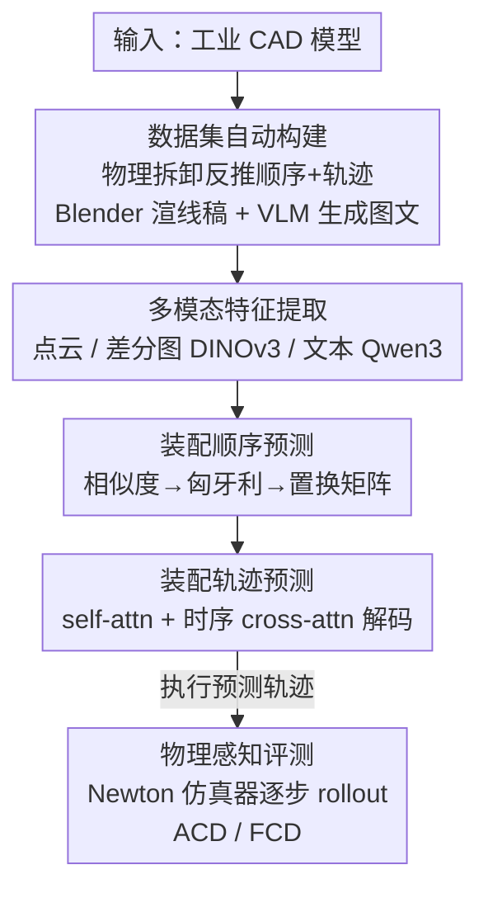

# AssemblyBench: Physics-Aware Assembly of Complex Industrial Objects

**会议**: CVPR 2026  
**arXiv**: [2605.12845](https://arxiv.org/abs/2605.12845)  
**代码**: https://merl.com/research/highlights/assemblybench (项目页)  
**领域**: 3D视觉 / 装配理解 / 多模态  
**关键词**: 工业装配, 6-DoF 轨迹预测, 多模态说明书, 物理仿真评测, 点云

## 一句话总结
针对现有装配数据集只关注「最终位姿、IKEA 家具」的局限，本文造了一个含 2789 件复杂工业物体、带分步图文说明书与 6-DoF 装配轨迹的合成数据集 AssemblyBench，配套一个一次前向就同时预测装配顺序+各零件运动轨迹的 Transformer 模型 AssemblyDyno，并首次用物理仿真器执行预测轨迹来评测「物理可行性」——同样设定下 AssemblyDyno 在仿真器里的装配成功率约 33%，而此前 SOTA 只有约 3%。

## 研究背景与动机
**领域现状**：「从零件装配出整体物体」是 CV 与机器人共同关心的任务。当前 SOTA 几乎都围绕 IKEA 风格家具——因为有大量现成的、用无文字示意图分步讲解的说明书，且家具零件被刻意设计得易区分、易拼接。于是这类数据集成了研究装配推理的便捷起点。

**现有痛点**：家具远不能覆盖真实装配的全部复杂度。电器（空调、吊扇、洗衣机）、工业设备（电机、齿轮箱、液压泵）乃至玩具，零件几何更复杂，常需要「插入+旋拧」这类精细机动。而绝大多数现有数据集（ManualPA、IKEA-Manual 等）只给**最终零件位姿**，根本不含装配过程中的**运动轨迹**；少数非家具数据集又缺标准化的零件/轨迹表示、缺分步说明书、缺统一评测协议。

**核心矛盾**：装配的难点恰恰在「怎么把零件移到位」——一条看似能对齐最终位姿的轨迹，实际执行时零件可能卡在中途、撞到别的零件，导致后续步骤无法进行。但所有主流评测都只比对**最终点云对齐**，对轨迹是否物理可行完全无感，于是「点云对得上」≠「装得起来」。

**本文目标**：(1) 造一个覆盖工业物体、含完整轨迹与图文说明书的数据集；(2) 给一个能联合预测装配顺序与 6-DoF 轨迹的模型；(3) 给一套能验证轨迹物理可行性的评测。

**切入角度**：工业 CAD 模型在机械设计里本就广泛存在。作者借用「装配即逆向拆卸」（assembly-by-disassembly）这一物理引擎技巧，从 CAD 自动反推出顺序与轨迹，再用 Blender + VLM 自动生成 IKEA 风格的图文说明书——整条标注流水线只需输入一个 CAD 模型即可泛化到任意工业物体。

**核心 idea**：用「物理引擎反向拆卸 + VLM 生成说明书」自动产出带真值轨迹的工业装配数据，并把「物理仿真器执行预测轨迹」作为评测闭环，逼模型学到隐式的物理约束。

## 方法详解

### 整体框架
全文由三块拼成：**数据集构建**（从 CAD 自动造出图文说明书+真值轨迹）、**AssemblyDyno 模型**（一次前向预测顺序+轨迹）、**物理感知评测**（仿真器执行轨迹判可行性）。

任务形式化：给定一组无序的 $N$ 个零件点云 $\{P_i\}_{i=1}^N$ 和一份含 $N$ 步的说明书 $(\mathcal{I}_1,\cdots,\mathcal{I}_N)$（每步加一个零件，含一张线稿示意图 + 一段文字），模型要 (i) 预测装配顺序 $(\hat\pi_1,\cdots,\hat\pi_N)$——把每个零件 ground 到对应指令；(ii) 为每步预测一条 $T$ 帧的 6-DoF 位姿轨迹 $(\hat R_i^k,\hat t_i^k)\in SE(3)$。零件数 $N$ 随物体变化（2~20，均值 6.7 步），轨迹帧数固定 $T=12$。

### 关键设计

**1. AssemblyBench 数据构建流水线：用物理引擎把 CAD 反推成带真值轨迹的图文说明书**

痛点是真实装配轨迹根本没人标——人工标 6-DoF 逐帧轨迹成本极高，所以现有数据集只能给最终位姿。本文的解法是「装配即逆向拆卸」：把 CAD 物体导入物理引擎，用深度优先搜索沿零件轴向施力、一次拆下一个零件直到分离，由此得到一条**拆卸顺序 + 每个零件的 6-DoF 拆卸轨迹**；把顺序与轨迹双双反向，就同时得到了**装配顺序与装配轨迹真值**（离散成 $T$ 步导入 Blender 做动画）。说明书则分两步自动生成：先用线稿（line-art、无颜色，模仿 IKEA 风格、固定等距相机视角）渲染每步示意图与分割图；再用 VLM（GPT-4.1）先看所有零件图给出**全局一致的零件命名**（如 "fastener" "wire frame"），再针对每步「高亮目标零件的图 + 全零件着色标注的图」生成该步文字指令。因为工业件常有遮挡、重复件（多颗相同螺丝），单视角难命名，所以作者用多视角渲染+视觉提示技巧来保证命名跨步一致。最终得到 2789 件、覆盖家具/电器/机械件的多模态说明书，且**只要给 CAD 就能泛化到任意工业物体**

**2. AssemblyDyno 多模态特征提取：用「差分图」聚焦每步新增的那个零件**

装配说明书是增量式的——第 $j$ 步和第 $j{+}1$ 步的示意图大部分一样，只多出一个新零件。直接编码整张图会让网络分不清「这步到底在装哪个」。作者的处理是对相邻两步取差分图 $|\mathcal{I}_j^{img}-\mathcal{I}_{j+1}^{img}|$，正好高亮新加入的零件相对于已装配部分的位置，再切成 $K$ 个 patch 过 DINOv3 编码得到 $f^{img}\in\mathbb{R}^{N\times K\times D}$。零件点云用轻量 PointNet 变体编码成 $f^{\mathcal{P}}\in\mathbb{R}^{N\times D}$，文字用冻结的 Qwen-3 embedding 得 $f^{txt}\in\mathbb{R}^{N\times D}$。图文融合是把文字沿 patch 维复制后与图特征拼接再线性投影，得指令特征 $f^{\mathcal{I}}\in\mathbb{R}^{N\times K\times D}$。这套设计的关键在「差分」二字——它把「找新增零件」这个本来要网络自己学的难点，直接用图像减法变成了显式信号

**3. 一次前向联合预测顺序与 6-DoF 轨迹：顺序→置换矩阵→时序解码**

经典运动规划（RRT/PRM）求一条物理可行轨迹既慢又需精确刻画环境约束，难泛化。AssemblyDyno 改成纯前馈监督学习、一次前向出全部步骤。顺序预测沿用 Manual-PA 思路：对零件特征与指令特征（在 patch 维 max-pool 后）算相似度矩阵，用匈牙利匹配转成预测顺序，再投影成置换矩阵 $M\in\{0,1\}^{N\times N}$。轨迹预测则把 $M$ 加位置编码后加到零件特征上送入 self-attention 解码器做零件间交互，再经一个带时序维的 cross-attention（注入位置编码的指令特征）产出形如 $\mathbb{R}^{N\times T\times D}$ 的轨迹隐特征，最后用位姿头解码成 $T$ 帧位姿序列（旋转用四元数）。整套零件的所有步骤在**单次前向**里联合预测，比逐步规划高效且更鲁棒；顺序与轨迹用两个同架构模型分别训练，训轨迹时始终喂真值顺序

**4. 物理感知评测：把预测轨迹丢进仿真器，用对称性鲁棒的 ACD/FCD 量物理可行性**

只比最终点云对齐会放过「轨迹中途卡死」这类致命错误。本文用 Newton 物理仿真器逐步执行预测轨迹：先按预测最终位姿摆好前序已装零件，再把当前零件放在其预测轨迹第一帧位姿，然后**把预测轨迹的速度序列当控制信号** rollout——令 $\Delta t$ 为每帧时长，依次施加 $v_1,v_2,\cdots$ 各运行 $\Delta t$，期间零件可能撞到别的零件而改变速度（本文为简化忽略重力）。执行完再把仿真出的位姿轨迹与真值比对。由于零件常有旋转对称、解不唯一，作者不直接算平移/旋转差，而是在点云上算 chamfer，定义两个新指标：**ACD（Average Chamfer Distance）**——每帧把执行位姿与真值位姿作用到点云算 chamfer，再对所有帧平均、报四分位；**FCD（Final Chamfer Distance）**——只取最后一帧的 chamfer，报中位数与四分位。这套评测把「装配顺序+轨迹+物理可实现性」一起验了，比单纯点云对齐严格得多

### 损失函数 / 训练策略
顺序模型用 InfoNCE 对比损失 $\mathcal{L}_{order}$，让正确匹配的指令特征 $f_i^{\mathcal{I}}$ 与零件特征 $f_{\sigma(i)}^{\mathcal{P}}$ 相似度更高（温度 $\tau$）。轨迹模型损失是多项加权和 $\mathcal{L}=\lambda_P\mathcal{L}_P+\lambda_T\mathcal{L}_T+\lambda_R\mathcal{L}_R+\lambda_{S_T}\mathcal{L}_{S_T}+\lambda_{S_R}\mathcal{L}_{S_R}$：

$$\mathcal{L}_P=\mathrm{CD}\Big(\bigcup_{i=1}^N(\hat R_i^{(T)}P_i+\hat t_i^{(T)}),\ \bigcup_{i=1}^N(R_i^{(T)}P_i+t_i^{(T)})\Big)$$

其中 $\mathcal{L}_P$ 是最终装配整体的双向 chamfer 距离；$\mathcal{L}_T$ 是逐帧平移 $\ell_2$ 损失；$\mathcal{L}_R$ 对旋转用点云 chamfer（因为零件有旋转对称、纯 $\ell_2$ 会漏掉正确解）；$\mathcal{L}_{S_T},\mathcal{L}_{S_R}$ 是平移/旋转的帧间「速度」平滑正则（惩罚相邻帧有限差分），鼓励轨迹时间上平滑。值得注意的是模型训练时**没有仿真器在环**，物理约束完全靠监督轨迹隐式学到。

## 实验关键数据

### 主实验
测试集（AssemblyBench test split）。两种设定：标准设定（模型自己预测顺序）与给真值顺序（GT order，隔离顺序误差）。SCD/ACD/FCD 越低越好，KD/PA/SR 越高越好。

| 设定 | 模型 | KD↑ | SCD(10⁻³)↓ | 最终位姿 PA(%)↑ | SR(%)↑ | 仿真器 PA(%)↑ | 仿真器 SR(%)↑ |
|------|------|-----|-----------|-----|--------|-----|--------|
| 标准 | **AssemblyDyno** | **0.819** | 3.91 | **71.21** | 34.64 | **42.76** | 13.57 |
| 标准 | ManualPA (ICCV'25) | 0.788 | 4.24 | 70.04 | 33.57 | 23.24 | 1.79 |
| GT 顺序 | **AssemblyDyno** | – | **3.87** | **79.69** | **44.29** | **70.15** | **33.57** |
| GT 顺序 | ManualPA (ICCV'25) | – | 4.15 | 77.40 | 39.28 | 31.33 | 2.14 |

关键对比：**物理仿真器里的 SR**——GT 顺序下 AssemblyDyno 33.57% vs ManualPA 仅 2.14%（约 33% vs 3%，差距悬殊）；标准设定下也是 13.57% vs 1.79%。即点云层面两者最终位姿 PA 接近（71 vs 70），一旦真去仿真器执行，基线几乎全军覆没，印证了「点云对得上 ≠ 装得起来」。论文也提到家具上能到约 60% 成功率的 SOTA 基线，搬到 AssemblyBench 上掉了近 30%，说明该数据集确实更难。

### 消融实验
标准设定下（节选自上表同组）：

| 配置 | 最终位姿 PA(%)↑ | SR(%)↑ | 仿真器 PA(%)↑ | 仿真器 SR(%)↑ | 说明 |
|------|-----|--------|-----|--------|------|
| Full (AssemblyDyno) | 71.21 | 34.64 | 42.76 | 13.57 | 完整模型 |
| w/o text | 70.28 | 35.00 | 41.77 | 15.00 | 去文本编码器 |
| w/o trajectory | 67.63 | 30.00 | 22.09 | 1.43 | 用启发式轨迹替代专用轨迹模块 |

GT 顺序下差距更清晰：w/o trajectory 的仿真器 SR 从 33.57 暴跌到 3.57，仿真器 PA 从 70.15 掉到 29.85——说明专用轨迹模块是物理可行性的命门；w/o text 在 GT 顺序下 SR 从 44.29 降到 42.86，文本有正向但边际贡献较小。

### 关键发现
- **轨迹模块贡献最大**：去掉专用轨迹模块（用「从最终位姿沿质心外推半个包围盒对角线」的启发式轨迹），仿真器 SR 在 GT 顺序下从 33.57 崩到 3.57，是所有消融里掉点最狠的，证明「能对齐最终位姿」和「轨迹物理可行」是两回事。
- **顺序预测是标准设定的瓶颈**：标准设定下所有方法都明显下滑，AssemblyDyno 对 w/o text 的优势也收窄——因为顺序错误会向下游轨迹/位姿传播；而分步示意图本身已强约束下一步操作，文本在顺序预测阶段的边际增益有限。
- **真到仿真（real-to-sim）迁移成立**：模型训练全程无仿真器在环，却能在仿真器里取得最高 PA/SR，说明监督轨迹隐式吃进了物理约束。
- **仿真器评测更严格**：预测轨迹误差与仿真执行误差都随帧下降，但仿真误差始终更高且后期差距拉大，暴露了碰撞、卡死等仅靠对比预测发现不了的隐藏失败模式。

## 亮点与洞察
- **「装配即逆向拆卸」是整条数据流水线的支点**：把难标注的装配轨迹，转化成物理引擎能自动求解的拆卸问题，再整体反向——一招同时拿到顺序与 6-DoF 轨迹真值，且只需 CAD 输入即可泛化，这是低成本造工业装配数据的可复用范式。
- **差分图聚焦新增零件**：用相邻两步示意图相减来定位「这步装哪个」，把一个需要网络学习的对齐难点变成显式图像信号，简单却切中增量式说明书的本质，思路可迁移到任何「分步增量」的视觉理解任务。
- **物理仿真器作为评测闭环**：跳出「最终点云对齐」的舒适区，第一次把「轨迹丢进仿真器执行」当成评测标准，并用对称性鲁棒的 ACD/FCD 量化——这个评测协议本身就是对装配/操作类任务的方法论贡献。
- **对称性鲁棒损失**：旋转损失用点云 chamfer 而非 $\ell_2$，绕开了旋转对称件「多个正确解」的陷阱，是处理几何对称的实用 trick。

## 局限与展望
- **作者承认顺序预测是短板**：标准设定下顺序误差会向下游传播，是限制整体成功率的主要瓶颈，未来需要更强的 order prediction。
- **忽略重力**：仿真评测为简化忽略了重力，真实装配中重力、摩擦、装夹力都会显著影响可行性，与真机执行仍有差距。
- **合成数据**：AssemblyBench 是合成数据集，线稿示意图与 VLM 生成文字虽模仿 IKEA 风格，但与真实工业手册、真实点云传感噪声之间存在 sim-to-real gap。
- **训练无仿真在环**：物理约束靠监督隐式学习，未利用仿真器反馈做闭环优化；把仿真器误差信号引入训练（如可微物理或 RL）可能进一步提升物理可行性。
- **固定帧数 $T=12$**：轨迹被离散成固定 12 帧，对需要更精细机动（如长距插入+旋拧）的零件可能不够细。

## 相关工作与启发
- **vs ManualPA [42] / IKEA 系数据集**：他们只预测装配顺序与**最终 6-DoF 位姿**、且聚焦家具；本文扩展到工业物体并补上**完整装配轨迹**与物理可行性评测。ManualPA 在家具上约 60% 成功率，搬到 AssemblyBench 掉约 30%，且仿真器 SR 仅约 2%，凸显「只对齐最终位姿」的评测掩盖了轨迹不可行的问题。
- **vs Assemble-Them-All (ATA) [31,32]**：本文基于 ATA 的工业 CAD + 物理拆卸轨迹来构建，但 ATA 缺分步说明书、缺标准化零件/轨迹表示、缺统一划分与评测协议；AssemblyBench 补齐了这些并加上图文说明书。
- **vs 经典运动规划 (RRT/PRM) [14,9]**：传统方法从预测最终位姿出发生成轨迹，计算昂贵且需精确刻画环境物理约束；本文只在**造数据**时用物理规划器，模型本身改成监督式一次前向预测，更快更鲁棒。
- **vs CheckManual [20] 等 VLM 说明书生成**：他们做操作手册生成，但装配涉及多零件交互、遮挡、复杂 3D 插入，手册生成更难；本文的 VLM 流水线针对这些（多视角、差分高亮、全零件标注）专门设计以保证命名与指令一致。

## 评分
- 新颖性: ⭐⭐⭐⭐⭐ 「物理引擎反向造数据 + 仿真器在环评测」组合切中装配评测的真实痛点，物理可行性评测是方法论级贡献
- 实验充分度: ⭐⭐⭐⭐ 标准/GT 顺序双设定 + 多消融，仿真器 SR 对比极有说服力；但仅一个强基线对比、缺真机验证
- 写作质量: ⭐⭐⭐⭐ 任务形式化清晰、流水线讲解到位；部分指标表格密集需对照读
- 价值: ⭐⭐⭐⭐⭐ 数据集+模型+评测协议三件套，为工业装配这一高价值自动化方向提供了可复用的基础设施

<!-- RELATED:START -->

## 相关论文

- [\[CVPR 2026\] BrickNet: Graph-Backed Generative Brick Assembly](bricknet_graph-backed_generative_brick_assembly.md)
- [\[CVPR 2026\] PAD-Hand: Physics-Aware Diffusion for Hand Motion Recovery](pad-hand_physics-aware_diffusion_for_hand_motion_recovery.md)
- [\[CVPR 2026\] Part$^{2}$GS: Part-aware Modeling of Articulated Objects using 3D Gaussian Splatting](part2gs_part-aware_modeling_of_articulated_objects_using_3d_gaussian_splatting.md)
- [\[CVPR 2026\] PhysGaia: A Physics-Aware Benchmark with Multi-Body Interactions for Dynamic Novel View Synthesis](physgaia_a_physics-aware_benchmark_with_multi-body_interactions_for_dynamic_nove.md)
- [\[NeurIPS 2025\] Gaussian-Augmented Physics Simulation and System Identification with Complex Colliders](../../NeurIPS2025/3d_vision/gaussian-augmented_physics_simulation_and_system_identification_with_complex_col.md)

<!-- RELATED:END -->
