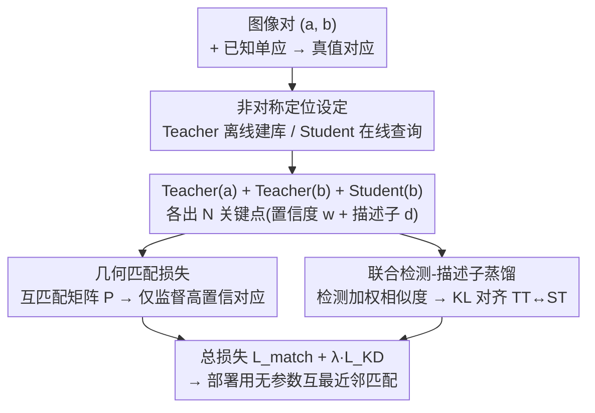

# AsymLoc: Towards Asymmetric Feature Matching for Efficient Visual Localization

**会议**: CVPR 2026  
**论文**: [CVF Open Access](https://openaccess.thecvf.com/content/CVPR2026/html/Omama_AsymLoc_Towards_Asymmetric_Feature_Matching_for_Efficient_Visual_Localization_CVPR_2026_paper.html)  
**代码**: 无（论文未公开仓库）  
**领域**: 3D视觉  
**关键词**: 视觉定位, 非对称特征匹配, 知识蒸馏, 边缘设备, 6-DoF位姿  

## 一句话总结
AsymLoc 提出"非对称视觉定位"——离线用大 Teacher 处理地图库图、在线用极小 Student 处理查询图，通过几何匹配损失 + 联合检测-描述子蒸馏把 Student 特征对齐到 Teacher，使两者能直接用无参数互最近邻匹配，在模型缩小一个数量级时仍保留约 95% 的 Teacher 定位精度。

## 研究背景与动机

**领域现状**：图像式视觉定位的主流管线是「视觉位置识别（VPR）粗检索候选库图 → 局部特征匹配求 6-DoF 位姿」。匹配这一步通常对查询图和库图用**同一个**特征提取器（SuperPoint、SiLK 等），再跑互最近邻；想更准就在上面接 SuperGlue / LightGlue 这类学习式匹配器。

**现有痛点**：边缘设备（智能眼镜、无人机、单板机）受电池和散热约束，算力极其有限。学习式匹配器代价高得离谱——LightGlue 比 SuperPoint 这类特征提取器还多十几倍参数（+13M 参数、~93ms/对）；直接换更小的特征模型又会明显掉精度。两条路都不满足「实时 + 高精度 + 低功耗」。

**核心矛盾**：定位精度依赖大模型的特征质量，而边缘部署逼着用小模型——精度和效率天然 trade-off。但作者注意到一个被忽略的不对称性：**库图可以离线预处理**，离线侧根本没有算力约束，只有查询侧才需要省电。

**本文目标**：让在线查询模型小到能在边缘跑，同时定位精度逼近大模型；且匹配步骤要保持「无参数、快」，不能引入重型学习式匹配器。

**切入角度**：既然库图离线、查询图在线，就该用两个不同的模型——离线大 Teacher 建库、在线小 Student 查询。难点随之而来：两个异构模型抽出的特征如何直接匹配？非对称设定在「图像检索」里被研究过（global descriptor），但**局部检测-描述子匹配**的非对称场景此前无人做过。

**核心 idea**：用蒸馏让 Student 的检测+描述子输出与冻结 Teacher **直接兼容**，从而匹配步骤退化为简单的互最近邻；对齐不在描述子空间单独做，而在「检测置信度调制描述子相似度」的**联合检测-描述子空间**里做。

## 方法详解

### 整体框架
AsymLoc 是首个由两个独立模型构成的定位框架：冻结的大 Teacher $T$ 离线抽库图特征，小 Student $S$ 在线抽查询图特征，部署时直接对二者做**无参数互最近邻匹配**估位姿。训练目标只有一个——让 Student 处理某图得到的特征，和 Teacher 处理同图得到的特征「可互换」，即非对称匹配 $T_{S(I_q)\to T(I_d)}$ 要逼近对称参考 $T_{T(I_q)\to T(I_d)}$。

训练用 COCO 单张图 + 随机单应生成图像对 $(a,b)$，自带真值对应 $M_{ab}$。对每对图：Teacher 处理 $a$，Student **和** Teacher 都处理 $b$；每个网络输出 $N$ 个关键点，每点带检测置信度 $w\in(0,1)$ 和描述子 $d\in\mathbb{R}^D$。Teacher-$a$ 与 Student-$b$ 的输出组成**互匹配矩阵**算几何匹配损失；同时构造两个检测加权相似度矩阵（Teacher-$a$×Student-$b$、Teacher-$a$×Teacher-$b$），把它们的分布用蒸馏损失对齐。作者发现「把同一张图喂两个网络、直接拉高输出相似度」的朴素蒸馏效果很差（与非对称检索文献结论一致），所以才设计下面这套几何 + 概率双监督。

### 关键设计

**1. 非对称视觉定位设定：把「库图离线、查询图在线」变成两套模型**

针对「精度要大模型、边缘要小模型」的死结，作者不再强求查询和库图用同一个对称模型，而是把管线拆成异构两半：离线无算力约束，放一个高性能 Teacher（SiLK 1M / SuperPoint 1.3M）预抽全库特征并存成地图；在线只放一个 0.04M~0.13M 的极小 Student 处理实时查询。这样在线推理只付小模型的代价（GFLOPs 降 7~13 倍），却能匹配到大模型质量的库特征。关键约束是：为了不引入 LightGlue 那种重型匹配器，Teacher 和 Student 的特征必须**原生兼容**，匹配步骤保持无参数互最近邻——这也是把全部难度转嫁给「训练时如何对齐两个模型」的根本原因。

**2. 几何匹配损失：用检测感知的互匹配矩阵，只在 Teacher 自信处监督**

光对齐描述子还不够，定位本质是要把空间对应点匹配对。作者不直接回归描述子，而是在「概率匹配」层面监督。先算 Teacher-$a$ 与 Student-$b$ 描述子的相似度矩阵 $S^{TS}_{ij}=\langle d^T_i(a), d^S_j(b)\rangle/\omega$（$\omega$ 为温度）。再用双方检测置信度加权、配合行/列双向 softmax，得到**互匹配矩阵**：

$$P^{TS}_{ij}=w^T_i(a)\,w^S_j(b)\,\sigma_r(S^{TS})_{ij}\,\sigma_c(S^{TS})_{ij}$$

其中 $\sigma_r,\sigma_c$ 分别是行、列方向 softmax。这样可靠关键点（高 $w$）自然主导对应分布。几何匹配损失在真值对应 $M_{ab}$ 上取负对数似然，且**只计入 Teacher 检测置信度超过阈值 $\theta_d$ 的点**：

$$L_{match}=-\!\!\sum_{(i,j)\in M_{ab},\,w^T_i(a)>\theta_d}\!\!\log P^{TS}_{ij}\;-\!\!\sum_{(i,j)\in M_{ab},\,w^T_i(b)>\theta_d}\!\!\log P^{ST}_{ij}$$

双向（TS 与 ST）都算，保证监督来自高质量对应、避开低置信噪声点。⚠️ 第二项下标按原文写作 $w^T_i(b)$，公式细节以原文为准。

**3. 联合检测-描述子蒸馏：在「检测调制描述子」的联合空间里对齐分布**

这是本文最核心的创新点。以往蒸馏要么只对齐描述子、要么把检测和描述子**独立**对齐，忽略了「检测可靠性会调制描述子相似度」这一耦合。AsymLoc 把二者拧进同一个概率空间：对原始相似度矩阵用检测置信度的温度幂加权，构造两个检测加权相似度矩阵——学生-教师对 $\bar{S}^{ST}_{ij}=(w^S_i/\omega_s)\,S^{ST}_{ij}\,(w^T_j/\omega_t)$ 和教师-教师对 $\bar{S}^{TT}_{ij}=(w^T_i/\omega_t)\,S^{TT}_{ij}\,(w^T_j/\omega_t)$（$\omega_s,\omega_t$ 为学生/教师检测温度）。把 $\bar{S}^{TT}$（理想的对称匹配分布）当老师、$\bar{S}^{ST}$（非对称分布）当学生，用行+列双向 KL 散度对齐：

$$L^{ST}_{KD}=\mathrm{KL}\!\big(\sigma_r(\bar{S}^{TT})\,\|\,\sigma_r(\bar{S}^{ST})\big)+\mathrm{KL}\!\big(\sigma_c(\bar{S}^{TT})\,\|\,\sigma_c(\bar{S}^{ST})\big)$$

对称地构造 $L^{TS}_{KD}$，总蒸馏损失 $L_{KD}=L^{ST}_{KD}+L^{TS}_{KD}$。它强迫 Student 在「查询→地图」和「地图→查询」两个方向上都复现 Teacher 的联合检测-描述子分布，于是 Student 特征不仅几何一致，连「哪里该被检测、相互如何匹配」的交互结构都和 Teacher 对齐——这正是无参数最近邻匹配能跨模型工作的关键。

### 损失函数 / 训练策略
总目标为 $L_{AsymLoc}=L_{match}+\lambda_{KD}\,L_{KD}$。训练时 Teacher 冻结，只优化 Student；用 COCO + 随机单应造对，Adam、50 epoch、初始 lr $1\times10^{-3}$，检测置信阈值 $\theta_d=0.65$、蒸馏权重 $\lambda_{KD}=2$（经验设定），辅以随机亮度/旋转/缩放/高斯噪声增广。Teacher 可换任意模型（实验用 SiLK、SuperPoint，附录另测 XFeat）；Student 设 4 档容量 0.04M~0.13M（CNN backbone + 检测头 + 描述子头），专门覆盖边缘场景。

## 实验关键数据

在 HPatches（单应估计）、ScanNet（室内相对位姿）、IMC2022（户外平均定位精度 MLA）、Aachen Day-Night（完整 HLoc 定位管线）四个跨域基准上评测。

### 主实验（SiLK 作 Teacher，部分代表性数字）

| 配置 | 在线/离线参数 | GFLOPs | HPatches 单应@ε=1 | ScanNet AUC@10° | IMC2022 MLA | Aachen 夜 (5m,10°) |
|------|--------------|--------|-------------------|-----------------|-------------|--------------------|
| Standard（0.13M 对称小模型） | 0.13M/0.13M | 6.6 | 0.56 | 29.7 | 0.45 | 80.0 |
| Naive Distill (Asym) | 0.13M/1M | 6.6 | 0.57 | 30.5 | 0.45 | 81.4 |
| CSD | 0.13M/1M | 6.6 | 0.57 | 32.1 | 0.48 | 82.4 |
| D3Still（检索 SOTA） | 0.13M/1M | 6.6 | 0.57 | 32.9 | 0.47 | 82.4 |
| **AsymLoc（本文 0.13M）** | 0.13M/1M | 6.6 | **0.60** | **32.9** | **0.51** | **84.4** |
| AsymLoc（本文 0.04M） | 0.04M/1M | 1.97 | 0.56 | 30.1 | 0.47 | 81.2 |
| SiLK Teacher（上界） | 1M/1M | 47.3 | 0.62 | 34.1 | 0.56 | 86.8 |

要点：0.13M 的 AsymLoc 比同尺寸对称 Standard 在 HPatches 上提升 4%，仅比 47.3 GFLOPs 的完整 SiLK 低 2%，却小 8 倍、省 7 倍 FLOPs；即便是 0.04M 的极小 Student，各指标仍全面碾压同尺寸 Standard。作为参照，SuperPoint+LightGlue 要 14M 参数 / 63.3 GFLOPs，LoFTR 要 28M / 223 GFLOPs。

### 消融实验（HPatches / ScanNet）

| $L_{match}$ | $L_{KD}$ | HPatches HEA(ε=1) | ScanNet AUC@10° |
|:---:|:---:|:---:|:---:|
| ✓ | | 0.53 | 21.6 |
| | ✓ | 0.57 | 30.0 |
| ✓ | ✓ | **0.59** | **31.5** |

### 关键发现
- **$L_{KD}$ 是主力，$L_{match}$ 单用反而有害**：只用 $L_{match}$ 时精度低于 Standard——因为它对检测缺少负样本信号，本质只是个「向 Teacher 自信区域重加权」的正则项；$L_{KD}$ 单用就大幅涨点，两者合用再提升，说明几何监督与概率对齐是**互补协同**关系。
- **蒸馏「相似度结构」比蒸描述子原值更重要**：朴素特征蒸馏几乎无增益，证明小模型无论怎么训，对称用于查询+库图都上不去；AML/RKD 引入非对称即有稳定收益，CSD 蒸相似度结构跃升明显；但 D3Still 那种再叠排序损失在此任务**不再有效**（与图像检索结论相反，仅 ScanNet@20° 比 AsymLoc 高 0.1%）。
- **效率-精度 Pareto 更平**：非对称训练的 Pareto 曲线随 GFLOPs 下降掉点更慢、参数效率（每 GFLOP 精度）随模型变小提升得比对称训练快得多，跨 SiLK/SuperPoint 两种 Teacher 都成立。结论中称 25× 更小的 Student 保留 96%+ Teacher 精度。⚠️ 主表展示的 Student 最大约 25× 小于 Teacher，"95% vs 96%"在摘要/正文/结论略有出入，以原文为准。

## 亮点与洞察
- **把「离线 vs 在线」的算力不对称当成可利用的结构**：定位天然有库图离线这一面，AsymLoc 直接据此拆成异构两模型，是个被忽视但极朴素的工程洞察——精度交给离线大模型，省电只发生在该省的在线侧。
- **联合检测-描述子空间对齐**：不把「哪里检测」和「怎么描述」拆开蒸，而是用检测置信度加权相似度，让蒸馏对象是「检测调制后的匹配交互分布」，这是它跑赢一众检索蒸馏 baseline 的根因，也是可迁移到任何检测-描述子联合任务的思路。
- **用 $\bar{S}^{TT}$ 当软目标**：把「Teacher 自己处理两张图」的对称匹配分布当作 Student 要逼近的金标准，比硬造标签更贴近最终最近邻匹配的真实使用方式。
- **几乎零部署成本**：所有增益都在训练侧完成，部署仍是无参数互最近邻，在线 FLOPs 与裸小模型一模一样——这对边缘落地极友好。

## 局限与展望
- 训练数据只用 COCO + 合成单应对，真值对应来自平面单应/对极几何；真实大视角、非平面、动态场景下的泛化未充分验证（主结果靠下游基准间接说明）。
- 蒸馏假设有一个强 Teacher 可用且需为每个 Teacher 重训对应 Student；换 Teacher 架构要重新蒸馏，不能即插即用。
- 多个温度超参（$\omega,\omega_s,\omega_t$）、阈值 $\theta_d$、权重 $\lambda_{KD}$ 都靠经验设定，敏感性分析在附录，正文未给主表外的鲁棒区间。
- ⚠️ 论文未放出代码，复现需自行实现互匹配矩阵与双向 KL 蒸馏细节。
- 可改进方向：把非对称思路推广到稠密匹配 / 跨模态（如不同传感器的 Teacher-Student），或让单个 Student 同时兼容多个异构 Teacher 地图。

## 相关工作与启发
- **vs 学习式匹配器（SuperGlue / LightGlue）**：它们用 GNN/Transformer 在两图间做全局推理提升匹配，但参数和延迟远超特征提取器本身；AsymLoc 把匹配难度前移到训练阶段的蒸馏，部署保持无参数最近邻，省掉整块匹配网络。
- **vs 稠密匹配（LoFTR / RoMa）**：稠密法需同时输入两图、无法预存地图描述子，天然不适合非对称设定且参数量大；AsymLoc 可离线预抽库特征，专为边缘设计。
- **vs 非对称图像检索（AML / RKD / CSD / D3Still）**：这些只对齐全局描述子；AsymLoc 首次把非对称蒸馏带到**局部检测-描述子**管线，需同时保证「在哪检测」和「怎么匹配」跨模型兼容，并发现检索里有效的排序蒸馏（D3Still）在此失效。
- **vs 朴素特征蒸馏**：直接最小化描述子余弦距离几乎无增益，印证了「相似度结构」比「原始特征值」更值得蒸的判断。

## 评分
- 新颖性: ⭐⭐⭐⭐⭐ 首次把非对称蒸馏引入局部检测-描述子定位管线，联合空间对齐设计扎实
- 实验充分度: ⭐⭐⭐⭐ 四基准 × 两 Teacher × 四 Student 尺寸覆盖全面，但部分鲁棒性/敏感性放在附录
- 写作质量: ⭐⭐⭐⭐ 动机清晰、公式完整，个别符号与百分比表述略有出入
- 价值: ⭐⭐⭐⭐⭐ 几乎零部署成本逼近大模型精度，对智能眼镜等边缘定位落地价值高

<!-- RELATED:START -->

## 相关论文

- [\[CVPR 2026\] ULF-Loc: Unbiased Landmark Feature for Robust Visual Localization with 3D Gaussian Splatting](ulf-loc_unbiased_landmark_feature_for_robust_visual_localization_with_3d_gaussia.md)
- [\[CVPR 2026\] Simple but Effective Triplet-Based Compression Strategies for Compact Visual Localization](simple_but_effective_triplet-based_compression_strategies_for_compact_visual_loc.md)
- [\[CVPR 2026\] CoLoR: The Devil is in Scene Coordinate Regression for Large-Scale Visual Localization](color_the_devil_is_in_scene_coordinate_regression_for_large-scale_visual_localiz.md)
- [\[CVPR 2026\] Towards Visual Query Localization in the 3D World](towards_visual_query_localization_in_the_3d_world.md)
- [\[CVPR 2026\] Lite Any Stereo: Efficient Zero-Shot Stereo Matching](lite_any_stereo_efficient_zero-shot_stereo_matching.md)

<!-- RELATED:END -->
