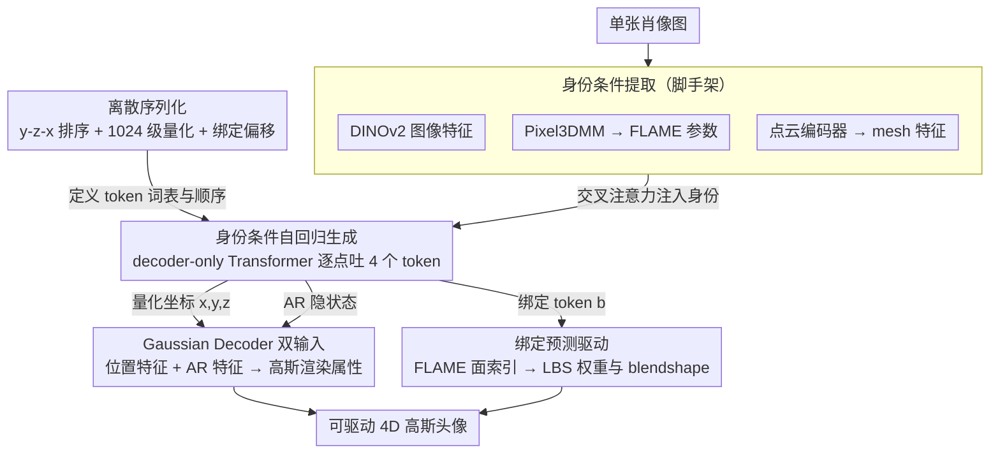

# AvatarPointillist: AutoRegressive 4D Gaussian Avatarization

**会议**: CVPR 2026  
**arXiv**: [2604.04787](https://arxiv.org/abs/2604.04787)  
**代码**: [https://kumapowerliu.github.io/AvatarPointillist](https://kumapowerliu.github.io/AvatarPointillist)  
**领域**: 3D 视觉 / 数字人生成  
**关键词**: 4D Avatar, Autoregressive, 3D Gaussian Splatting, Point Cloud Generation, One-shot

## 一句话总结
AvatarPointillist 提出了一种自回归（AR）生成框架来构建 4D 高斯头像：用 decoder-only Transformer 逐点生成 3DGS 点云（含绑定信息），再用 Gaussian Decoder 预测渲染属性，打破了固定模板拓扑的限制，实现了自适应点密度调整，在 NeRSemble 上全面超越 LAM、GAGAvatar 等基线。

## 研究背景与动机

**领域现状**：从单张肖像图生成可驱动的 3D 头像对 VR、远程呈现、电影等应用至关重要。现有方法分为 2D 动画（GAN/扩散）和 3D（NeRF/3DGS）两大范式。

**2D 方法的根本缺陷**：缺乏 3D 结构感知，极端姿态下出现几何扭曲，无法从任意视角渲染。

**3DGS 方法的核心矛盾**：
   - **GAGAvatar**：将 2D 特征提升到 3D，绕过完整点云表示，需辅助 2D 网络修复
   - **LAM**：使用固定 FLAME 顶点作为模板点云，所有人都使用相同数量的高斯——**这限制了模型自适应调整点密度**来捕捉身份特有特征（如胡须、特殊发型）
   - **问题本质**：固定拓扑丢失了 3DGS 最核心的优势——根据几何复杂度自适应控制点分布

**核心问题**：能否设计一个生成模型**直接学习 3DGS 点云分布**，不依赖固定模板？让模型自主决定在哪放点、放多少点。

**核心 idea**：将 3DGS 头像生成重新建模为**自回归序列生成任务**——逐点预测 3D 坐标和绑定索引，拥抱 3DGS 自适应动态特性。

## 方法详解

### 整体框架
论文要解决的是「从单张肖像图生成可驱动 4D 高斯头像」，而它的赌注是：与其像 LAM 那样套一张固定的 FLAME 模板点云，不如让一个生成模型自己决定点云长什么样。整条流水线因此被切成两段，且第二段依赖第一段的中间产物。第一段是一个 decoder-only Transformer 的**自回归点云生成器**：吃进肖像图的身份特征，像写句子一样逐 token 吐出量化后的点云，每个点由四个 token 描述——三个量化坐标 $(T_n^x, T_n^y, T_n^z)$ 加一个绑定 token $T_n^b$（指明这个高斯挂在 FLAME mesh 的哪个面上）。第二段是 **Gaussian Decoder**：把量化坐标反量化回连续空间，并取出 AR Transformer 在生成每个点时留下的隐状态，两者拼起来送进一个 Transformer，预测出每个点真正用于渲染的高斯属性（颜色、不透明度、缩放、旋转、位移偏移）。换句话说，AR 模型负责「点放在哪、放多少、挂到哪根骨头」，Gaussian Decoder 负责「这个点画出来该是什么样」。

### 关键设计

**1. 把点云排成可学习的离散序列：让「生成头像」变成「写一句话」**

要让自回归模型生成点云，先得把连续的 3DGS 变成离散 token 序列。作者用 GaussianAvatars 对 NeRSemble 里每个身份拟合 3DGS，每个高斯都绑定到 FLAME mesh 的某个面，再用规范 FLAME mesh 算出一套全局规范高斯点云。关键在于序列必须**确定性可复现**：同一份点云每次都要产生同一条序列，否则模型学不到稳定的生成顺序，于是所有点按 y-z-x 排序。坐标被量化成 1024 个离散级别（精度与序列长度的折中），绑定信息则通过偏移避开坐标的取值范围——$T_n^b = b_n + 1024$，其中 $b_n \in [0, 10143]$，相当于把坐标和面索引塞进同一个词表的两段区间，互不冲突。最终每个点摊开成 4 个 token，整张脸拼成 $(T_1^x, T_1^y, T_1^z, T_1^b, \dots, T_N^x, T_N^y, T_N^z, T_N^b)$ 一条长序列，两端再补上 Start/End/Padding 标记。这一步是整个范式的地基：只有点云被表述成「一句话」，自适应点密度才有可能从生成过程里自然涌现，而不是被模板锁死。

**2. 身份条件下的自回归生成：把「这个人长什么样」喂给每一步预测**

生成器是 decoder-only Transformer，每层叠交叉注意力、自注意力和 FFN，训练用最朴素的 next-token-prediction 目标 $p(T) = \prod_{n=1}^{4N} p(T_n \mid T_{<n})$。难点不在结构，而在如何把「身份」注入进去——毕竟同一套生成流程要对不同的人吐出不同的点云。作者用 DINOv2 抽肖像图的图像特征，用 Pixel3DMM 拿到该身份的 FLAME 参数，再过一个点云编码器提取 mesh 特征，三者拼接后通过交叉注意力一路喂给生成的每一步，让模型在决定「下一个点放哪」时始终带着这个人的脸型先验。还有一个绕不开的工程问题：一张脸展开后是数万个 token 的超长序列，整段回传既慢又吃显存，于是训练时用窗口大小 12000 的滑动窗口分段截断，只在窗口内做反传，把长序列的训练成本压下来。

**3. Gaussian Decoder 的双输入：坐标只说了点在哪，AR 隐状态才说清这点该是什么**

这是论文的核心创新。一个朴素做法是：拿到生成的坐标，直接回归出高斯属性就行——但作者发现光有坐标不够。Gaussian Decoder 因此同时吃两路信息：一路是**位置特征** $P_n$，把反量化后的坐标做位置编码再过 MLP；另一路是 **AR 特征** $F_n^p$，从 AR Transformer 取出生成该点时的最终隐状态，再用 MLP 把描述同一个点的 4 个 token 的隐特征聚合成单点特征，两路拼接后送进 Decoder。之所以非要这第二路，是因为 AR 隐状态里沉淀了生成过程中积累的语义上下文——模型「为什么在这里放点、这块属于头发还是皮肤」这类信息都藏在隐状态里，单凭一个孤立的坐标根本传不出来。消融也印证了这点：只用位置或只用 AR 特征，渲染质量都明显掉档（见实验表，LPIPS 分别退到 0.19 和 0.22），两路缺一不可。

**4. 绑定预测让点云天生可动画：生成的同时就知道每个点挂在哪根骨头上**

头像不只要好看，还要能驱动，而驱动需要知道每个高斯随表情/姿态如何运动。AvatarPointillist 的巧处在于把这件事提前到了生成阶段——AR 模型吐出的绑定 token $T_n^b$ 直接指明该点对应的 FLAME 面索引，于是无需任何额外网络后处理，就能通过重心坐标插值拿到每个点的 LBS 权重 $\hat{\mathbf{w}}_i$ 和表情 blendshape $\hat{\mathbf{S}}_i$。之后完全沿用标准 FLAME 形变流程：给定姿态参数 $\boldsymbol{\theta}$ 和表情参数 $\boldsymbol{\psi}$，点云就跟着动起来。绑定信息和几何坐标在同一条序列里被一并生成，是「自回归化」带来的顺带红利——可动画性不是事后补的，而是生成范式自带的。

### 损失函数 / 训练策略
- **AR 模型**：标准交叉熵损失，AdamW lr=1e-4，16×H20 GPU，50K steps，batch size 4
- **Gaussian Decoder**（冻结 AR 模型后训练）：
  $$\mathcal{L}_{total} = \lambda_{L1}\mathcal{L}_{L1} + \lambda_{SSIM}\mathcal{L}_{SSIM} + \lambda_{LPIPS}\mathcal{L}_{LPIPS} + \lambda_{Reg}\mathcal{L}_{Reg}$$
  - $\lambda_{L1}=1, \lambda_{SSIM}=0.5, \lambda_{LPIPS}=0.1, \lambda_{Reg}=0.1$
  - 8×H20 GPU，12500 steps

## 实验关键数据

### 主实验（NeRSemble 数据集）

| 方法 | LPIPS↓ | FID↓ | AKD↓ | APD↓ | Cross-FID↓ | Cross-CLIP↑ |
|------|--------|------|------|------|------------|-------------|
| Portrait4Dv2 | 0.20 | 123.02 | 5.32 | 34.53 | 191.13 | 0.63 |
| AvatarArtist | 0.21 | 118.94 | 6.87 | 39.58 | 175.69 | 0.61 |
| LAM | 0.24 | 136.01 | 4.37 | 61.83 | 238.54 | 0.54 |
| GAGAvatar | 0.18 | 111.76 | 3.93 | 27.94 | 181.22 | 0.71 |
| **Ours** | **0.15** | **95.18** | **2.38** | **22.86** | **160.74** | **0.75** |

### 消融实验

| 配置 | LPIPS↓ | FID↓ | AKD↓ | APD↓ | 说明 |
|------|--------|------|------|------|------|
| FLAME Position | 0.23 | 120.34 | 4.82 | 41.22 | 固定 FLAME 模板（类 LAM） |
| AR Feature only | 0.22 | 110.93 | 5.89 | 32.96 | 仅用 AR 隐特征 |
| AR Position only | 0.19 | 103.80 | 5.81 | 41.49 | 仅用位置编码 |
| **Full (Ours)** | **0.15** | **95.18** | **2.38** | **22.86** | 位置+AR特征双输入 |

### 关键发现
- AR 点云生成 vs 固定 FLAME 模板：FID 从 120.34 降到 95.18，证实自适应点分布的优势
- Gaussian Decoder 同时使用位置特征和 AR 特征至关重要——二者缺其一都有显著退化
- FLAME Position 基线无法捕捉身份特有几何（如马尾辫、浓密胡须），定性结果展示了明显差距
- 自回归生成的点云可视化显示了明显的自适应密度分布——几何复杂区域（头发、胡须）点更密集

## 亮点与洞察
- **将 3DGS 点云生成重构为自回归 token 预测**是一个范式创新，让生成模型真正拥有了"在哪放点、放多少点"的自由度
- **AR 隐特征传递给 Gaussian Decoder** 的设计很精妙——生成过程中积累的语义上下文极大提升了渲染质量
- 绑定预测使得生成的点云天然可动画化，无需额外后处理
- 命名"Pointillist"（点彩派）贴切——每个高斯点如同画家的一笔，自适应组合成完整画面

## 局限与展望
- 自回归生成序列很长（数万 token），推理速度相比一次性生成方法较慢
- 训练数据局限于 NeRSemble（419 个身份），泛化到更大规模和更多样的人群有待验证
- 依赖 GaussianAvatars 拟合来构建训练数据，数据质量受拟合质量影响
- 1024 级量化引入的离散化误差可能在极精细区域（如眼睛周围）造成瑕疵

## 相关工作与启发
- LAM 是最直接的对比——固定模板 vs 自回归生成的核心差异
- MeshGPT 将 mesh 生成建模为 AR 任务是直接启发
- 量化 + AR 的范式可推广到全身头像、场景级 3DGS 生成

## 评分
- 新颖性: ⭐⭐⭐⭐⭐ 首次将 AR 序列生成应用于 3DGS 头像，范式创新明确
- 实验充分度: ⭐⭐⭐⭐ 全面对比+详细消融，但仅在一个数据集上评估
- 写作质量: ⭐⭐⭐⭐ 动机阐述清晰，方法描述详细
- 价值: ⭐⭐⭐⭐⭐ 为 3DGS 头像生成提供了新方向，自适应点分布的优势具有普遍意义

<!-- RELATED:START -->

## 相关论文

- [\[CVPR 2026\] 4C4D: 4 Camera 4D Gaussian Splatting](4c4d_4_camera_4d_gaussian_splatting.md)
- [\[CVPR 2026\] Mark4D: Temporally-Consistent Watermarking for 4D Gaussian Splatting](mark4d_temporally-consistent_watermarking_for_4d_gaussian_splatting.md)
- [\[CVPR 2026\] Repurposing 3D Generative Model for Autoregressive Layout Generation](repurposing_3d_generative_model_for_autoregressive_layout_generation.md)
- [\[CVPR 2026\] LongStream: Long-Sequence Streaming Autoregressive Visual Geometry](longstream_long-sequence_streaming_autoregressive_visual_geometry.md)
- [\[CVPR 2026\] PackUV: Packed Gaussian UV Maps for 4D Volumetric Video](packuv_packed_gaussian_uv_maps_for_4d_volumetric_video.md)

<!-- RELATED:END -->
