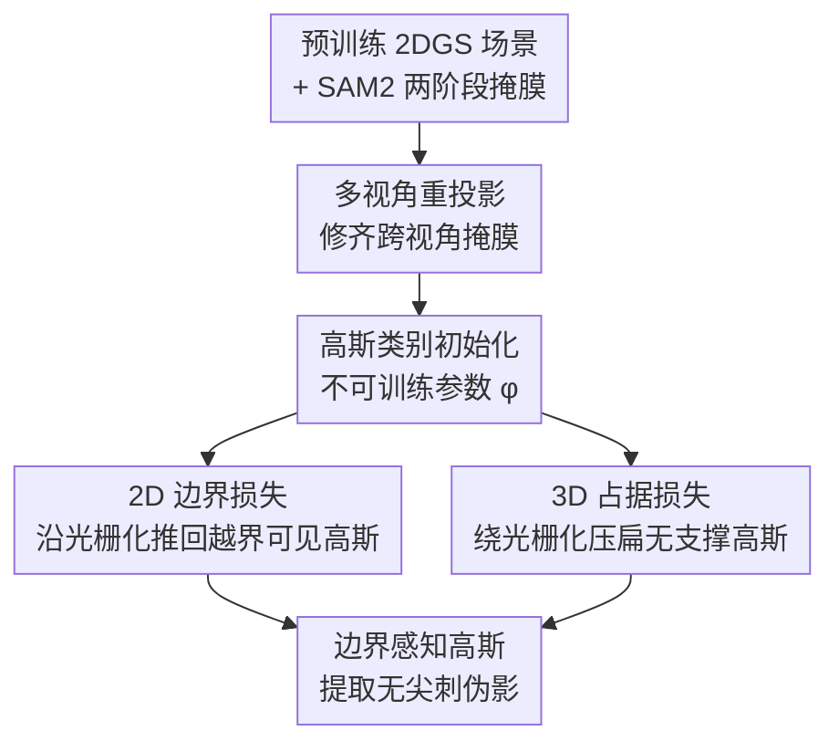

# BEA-GS: BEyond RAdiance Supervision in 3DGS for Precise Object Extraction

**会议**: CVPR 2026  
**arXiv**: [2605.09662](https://arxiv.org/abs/2605.09662)  
**代码**: 无（论文未公开）  
**领域**: 3D视觉  
**关键词**: 3D Gaussian Splatting, 物体提取, 语义分割, 边界损失, 占据先验

## 一句话总结
针对 3DGS 场景里"物体提取后冒出隐藏高斯尖刺"的痛点，BEA-GS 在 2DGS 优化中加了两个互补损失——可见区的 2D 边界损失（沿光栅化传梯度，把越界高斯推回边界）和非可见区的 3D 占据损失（绕过光栅化、直接对体素先验里"无支撑"的高斯采样点惩罚），在 4 个数据集 6 个指标上拿到迄今最干净的物体边界。

## 研究背景与动机

**领域现状**：3D Gaussian Splatting（3DGS）已经成为从多视角图像重建真实感 3D 场景的事实标准。为了支持"物体级编辑 / 资产提取"，主流做法是把 SAM、CLIP 这类 2D 视觉基础模型的语义提升（lift）到 3DGS 上，给每个高斯打语义标签。

**现有痛点**：早期方法（LangSplat、OpenGaussian 等）只给已有高斯**贴标签、冻结几何**，导致一个高斯往往横跨多个物体，3D 点级理解很差。后来一批方法（COB-GS、ObjectGS、Trace3D）意识到这点，开始**修改几何**让每个高斯只属于单一物体。但作者发现：即便这样，提取物体时仍有高斯"探出"预期边界——这些高斯在原场景里几乎不可见，一旦把物体抽出来放进新场景，它们就暴露成**尖刺状伪影（Gaussian spikes）**。

**核心矛盾**：前作全部依赖 alpha-blending 光栅化来传播语义梯度，**只有接收到足够辐射（radiance）的高斯才会被修改**。那些被表面遮住、透射率（transmittance）极低的"部分可见 / 不可见"高斯，拿不到梯度，就"卡"在物体表面之下原地不动。而 3DGS 不像 NeRF 那样几何与外观解耦——每个高斯的外观直接由它的形状和大小决定，只用光度损失训练时，高斯会**拉伸或漂移**到邻近甚至未见区域去凑颜色，而不是老老实实改外观参数。

**本文目标**：(1) 让可见高斯严格尊重语义边界；(2) 修正那些拿不到辐射监督、却会在提取时露出来的非可见高斯几何。

**切入角度**：既然光栅化梯度天生覆盖不到不可见区，那就**双管齐下**——可见部分继续用光栅化传梯度，不可见部分另起一条"绕过光栅化"的几何正则路径。

**核心 idea**：用"2D 边界损失（管可见）+ 3D 占据损失（管不可见）"这对互补损失，把整个高斯排布优化成对物体提取鲁棒的结构。

## 方法详解

### 整体框架

输入是一个预训练好的 **2DGS** 场景（用 2D 高斯而非 3D 椭球，几何更贴表面）加上用 SAM2 两阶段提取的多视角分割掩膜；输出是一组"边界感知"的高斯，提取任意物体时边界都干净无尖刺。整条流水线分三步：先用 **多视角重投影** 把跨视角不一致的掩膜修齐，再给每个高斯初始化一个**不可训练的类别参数** $\phi$，然后在标准 2DGS 训完 30K 步的基础上，额外训 3K 步，同时施加 **2D 边界损失** 和 **3D 占据损失**。两个损失分工明确：边界损失沿光栅化把越界的可见高斯推回去；占据损失绕过光栅化、靠一个预先算好的体素可见性网格，把"落在无几何支撑区"的高斯采样点压扁。

### 关键设计

**1. 多视角重投影：用 3D 结构把跨视角掩膜修齐**

SAM2 两阶段检索能缓解跟踪丢失，但解决不了**不同视角间的边界不一致**——同一物体在 A 视角缺了一块、在 B 视角又多了一块。作者的做法是先用 2DGS 的深度和相机参数从预训练模型生成一团 3D 点云，把每个 2D 像素 $u\in\mathbb{R}^2$ 提升（lift）到 3D 点 $x\in\mathbb{R}^3$ 并赋上初始掩膜里的语义标签；然后把这些点**重投影回所有视角**，对每个像素取被投到它身上的标签里**出现频率最高的那个**，得到修正后的掩膜 $M'=\mathrm{argmax}(M_\phi)$。这等于借 3D 几何做了一次跨视角"投票去噪"，既补回了被漏掉的区域，又把边界细节抠得更细，给后续损失提供干净的监督信号

**2. 2D 边界损失：只惩罚越界部分，单通道支持多类**

可见高斯越界是边界脏的直接来源。作者先给每个高斯加一个类别参数 $\phi$，按 FlashSplat 的方式初始化——对所有训练图做 splatting，按贡献加权统计每个高斯落到各类像素上的频率，取贡献最大的类作为它的类别，且**类别参数保持不可训练**，逼着高斯靠"调位置/形状/不透明度"而非"改类别"来适应场景。边界损失定义为：

$$\mathcal{L}_{bound}(u)=\sum_{i=1}^{N}H_i(u)\,\alpha_i\hat{\mathcal{G}}_i(x)\prod_{j=1}^{i-1}\bigl(1-\alpha_j\hat{\mathcal{G}}_j(x)\bigr),\quad H_i(u)=\begin{cases}0,&\phi_i=M'(u)\\1,&\phi_i\neq M'(u)\end{cases}$$

指示函数 $H_i$ 像个开关：高斯类别和像素监督类别一致就不罚（0），不一致才罚（1）。被罚时，损失鼓励它降低不透明度、改形状、或挪离边界。和 COB-GS、ObjectGS 的关键区别有两点：其一，**只需给每个高斯加单个额外通道**就天然支持多类分割，而 COB-GS 只能做二值提取、每个物体单独优化，ObjectGS 则要每类一个通道、显存和算力都涨；其二，前作把损失加在**整张掩膜**上，本文的损失**只被越界的那部分高斯激活**（图 2 里的 "2D Boundary Gradients"），更聚焦

**3. 3D 占据损失：绕过光栅化，给不可见高斯一条几何正则通路**

边界损失仍受透射率 $\prod_{j=1}^{i-1}(1-\alpha_j\hat{\mathcal{G}}_j(x))$ 调制，只能管可见部分；只用它提取物体还是不完美。要修不可见区，就得有一条**不靠辐射**的正则路径。做法是：对每个高斯在其 2D 表面（UV 空间）均匀采样 $Z$ 个点，判断这些点是落在"有效几何"上还是"该被罚的未见区"。判断依据是一个预先构建的**可见性体素网格**——把每张图按渲染深度反投影、按高斯语义类合并成类别专属点云 $P_\phi$，再体素化成网格 $V_\phi$（多类碰撞的体素视为空）。体素边长 $s$ 用**自适应**方式确定：希望每个体素平均含 $k$ 个点，借第 $k$ 近邻距离 $d_k$ 估局部密度 $\rho=k/(\tfrac{4}{3}\pi d_k^3)$，再解 $s=\sqrt[3]{k/\rho}$，让分辨率随场景点密度自动调。占据损失为：

$$\mathcal{L}_{occ}=\sum_{i=1}^{N}\sum_{r=1}^{Z}\frac{\alpha_i\hat{\mathcal{G}}_i(x'_r)\,Q_i(x'_r,V_\phi)}{N\cdot Z},\quad Q_i=\begin{cases}1,&D_{occ}(x'_r,V_\phi)=0\\0,&D_{occ}(x'_r,V_\phi)>0\end{cases}$$

其中 $D_{occ}$ 统计采样点所在体素及其 26 个邻居中被占据的个数（范围 $\{0..27\}$）；若中心加邻域全空（$D_{occ}=0$），就判定该采样点是"非可见点"，按它的不透明度 $\alpha_i$ 和密度 $\hat{\mathcal{G}}(x'_r)$ 加权惩罚。关键在于：这个损失**直接对高斯参数传梯度，不经过光栅化**，因此即便高斯几乎收不到任何透射光，照样能被压回有几何支撑的区域——这正是前作做不到、伪影的根源所在

### 损失函数 / 训练策略

两个新损失与原始 2DGS 损失联合，端到端优化所有参数：

$$\mathcal{L}=\mathcal{L}_{2DGS}+\lambda_{bound}\mathcal{L}_{bound}+\lambda_{occ}\mathcal{L}_{occ}$$

其中 $\mathcal{L}_{2DGS}=\mathcal{L}_{rgb}+\lambda_{depth}\mathcal{L}_{depth}+\lambda_{norm}\mathcal{L}_{norm}$。$\mathcal{L}_{bound}$ 经光栅化更新参数，$\mathcal{L}_{occ}$ 直接更新参数；让 $\mathcal{L}_{rgb}$ 同时在场，能保证"边界修改尊重渲染质量、外观修改尊重边界"。先按标准 2DGS 训 30K 步，再加上两个损失训 3K 步。超参：$\lambda_{bound}=0.5$、$\lambda_{occ}=10$、每高斯采 $Z=20$ 点、近邻数 $k=2000$ 跨所有场景固定（$Z$ 和 $k$ 对性能影响不大）。全部在单张 NVIDIA A100 上完成。

## 实验关键数据

评测覆盖 **4 个数据集**（Mip-NeRF 360、LeRF、LLFF、3DOVS）、**6 个指标**（Extracted 与 Rendered 两套 3D 指标，各含 Acc / IoU / BIoU）、对比 **12 个 SOTA**。所有方法用**同一套 SAM2 两阶段掩膜**，故部分数字与原论文不同（原论文更好时在括号内标注）。其中 BIoU 专门衡量边界质量。

### 主实验

Extracted 3D 指标（物体单独提取后渲染，最考验边界），BEA-GS 在三个数据集上全面登顶：

| 数据集 | 指标 | BEA-GS | COB-GS | Trace3D | FlashSplat |
|--------|------|--------|--------|---------|------------|
| Mip-NeRF 360 | Acc / IoU / BIoU | **99.1 / 92.0 / 85.8** | 98.5 / 86.9 / 78.0 | 98.6 / 87.1 / 75.4 | 98.7 / 87.4 / 78.6 |
| LeRF | Acc / IoU / BIoU | **99.2 / 89.4 / 83.6** | 98.8 / 83.0 / 75.6 | 98.3 / 85.9 / 80.1 | 99.0 / 80.4 / 72.5 |
| LLFF | Acc / IoU / BIoU | **98.6 / 93.0 / 80.7** | 98.3 / 91.4 / 75.1 | 97.3 / 86.1 / 60.1 | 98.4 / 91.8 / 76.5 |

3DOVS 数据集上（表 2），BEA-GS 的 Extracted 指标同样最优（Acc/IoU/BIoU = **99.7 / 93.2 / 87.3**），明显超过 Trace3D（99.4 / 90.2 / 81.1）；Rendered 指标上 ObjectGS 的 IoU/BIoU 略高（95.3 / 90.7），但综合 21/24 个评测情形 BEA-GS 都拿第一。BIoU 的提升尤其显著，印证了"提取时边界最干净"这一核心卖点。

**渲染质量几乎零损失**：修改几何最怕掉渲染质量，作者报告了 test 集 PSNR（前/后）——Mip-NeRF 360 (29.1/29.1)、LeRF (25.2/25.0)、LLFF (25.0/24.9)、3DOVS (26.7/26.5)，几乎无损。

### 消融实验

R = 多视角重投影，B = 边界损失，O = 占据损失（Extracted 指标，节选）：

| 配置 | Mip-NeRF 360 (Acc/IoU/BIoU) | LeRF (Acc/IoU/BIoU) | 说明 |
|------|------|------|------|
| ✗ ✗ ✗ | 98.1 / 83.9 / 72.8 | 98.3 / 66.3 / 56.6 | vanilla：只按频率贴最常见类 |
| R+B（✓✓✗） | 99.0 / 90.5 / 83.6 | 98.7 / 78.2 / 70.1 | 缺 O，不可见区修不到 |
| R+O（✓✗✓） | 98.9 / 90.1 / 81.9 | 99.2 / 85.0 / 77.2 | 缺 B，可见边界细节欠佳 |
| B+O（✗✓✓） | 99.0 / 90.9 / 84.5 | 99.2 / 86.6 / 80.3 | 缺 R，掩膜噪声未清 |
| **R+B+O（Full）** | **99.1 / 92.0 / 85.8** | **99.2 / 89.4 / 83.6** | 完整模型 |

### 关键发现
- **两个损失互补而非冗余**：B 修可见边界的精细细节（O 因体素离散化捕捉不了），O 罚 B 够不着的不可见区——同时去掉 LeRF 的 IoU 从 89.4 掉到 vanilla 的 66.3。
- **多视角重投影看场景类型**：在 Mip-NeRF 360、LeRF 这类 360° 多遮挡场景上提升明显（LeRF IoU 86.6→89.4），但在 LLFF、3DOVS 这类正面视角、遮挡少的场景上几乎无增益。
- **能解开隐藏高斯**：定性结果里，footstool 与 sofa 之间、桌面/地面上叠放物体之间的隐藏高斯都被正确分开，边界比所有对比方法都干净。

## 亮点与洞察
- **"绕过光栅化传梯度"是真正的破局点**：前作的天花板全卡在 alpha-blending——不可见就拿不到梯度。占据损失直接对高斯参数求导、用体素先验判定"该不该在这"，这个绕开主路径的思路值得迁移到任何"梯度被可见性门控"的可微渲染场景。
- **单通道支持多类**很优雅：靠不可训练类别参数 + 指示函数 $H_i$，只加一个通道就做多类，避开了 ObjectGS 每类一通道的显存膨胀，也比 COB-GS 逐物体二值优化省事。
- **自适应体素边长**用第 $k$ 近邻密度反推 $s=\sqrt[3]{k/\rho}$，让占据网格分辨率随场景密度走，不用手调，是个可复用的小工程技巧。
- **诚实的评测设定**让人信服：统一 SAM2 掩膜、原论文更好时括号标注真实差距、还报告 PSNR 证明几何修改不掉渲染质量。

## 局限与展望
- **吃初始重建质量**：方法只能在 2DGS 给的几何基础上微调，初始重建差就上不去。
- **不补全未见部分**：只把已见几何修干净，不 hallucinate 物体被遮挡的背面，提取出的资产是"残缺"的——作者建议接 InstaScene 这类扩散生成来补全。
- **不碰语言对齐与 mask ID 关联**：不像 Dr. Splat 那样把类别与语言 embedding 绑定，也无法判断两个分离掩膜是否属于同一物体（Trace3D 能）。
- 个人看法：占据损失依赖深度反投影构建的体素先验，深度不准时这个"地基"会歪；论文把深度鲁棒性分析放在了补充材料，正文里的体素先验可靠性边界讲得不够（⚠️ 细节以原文/补充为准）。

## 相关工作与启发
- **vs COB-GS [52]**：都沿光栅化传边界梯度，但 COB-GS 只能二值提取、逐物体单独优化，还靠启发式检测/分裂歧义高斯；BEA-GS 单通道天然多类，且把损失只激活在越界部分，更聚焦。两者都受透射率门控、管不到不可见区——这正是本文用占据损失补上的缺口。
- **vs ObjectGS [56]**：ObjectGS 也用渲染概率图监督几何、支持多类，但每类要一个额外通道，显存/算力更高；BEA-GS 只加单通道。Rendered 指标上 ObjectGS 在 3DOVS 略胜，但 Extracted（提取场景）BEA-GS 全面更优。
- **vs Trace3D [40]**：Trace3D 分析每个高斯对图像空间的贡献来分裂/剪枝跨多物体的高斯，并能判断两掩膜是否同物；但它和上面两者一样被辐射主导，提取时仍会冒尖刺。BEA-GS 不做 ID 关联，专攻"几何对提取鲁棒"这一点。
- **vs FlashSplat [41] / GaussianCut [17]**：这类不优化特征、靠 ILP 或图割直接给高斯分类的方法在 2D/渲染指标上不错，但不修几何，隐藏高斯问题原封不动；BEA-GS 借用了 FlashSplat 的类别初始化，再叠加几何优化。

## 评分
- 新颖性: ⭐⭐⭐⭐⭐ "绕过光栅化的占据损失"精准命中前作公认却没人解的盲区，思路干净
- 实验充分度: ⭐⭐⭐⭐⭐ 4 数据集 × 6 指标 × 12 SOTA，统一掩膜、补 PSNR、消融拆三件套，扎实
- 写作质量: ⭐⭐⭐⭐ 动机推导（3DGS 几何外观耦合→隐藏高斯）讲得透；体素先验可靠性等细节挪到补充，正文稍紧
- 价值: ⭐⭐⭐⭐ 物体级资产提取是 3DGS 编辑落地的关键一环，边界干净度直接决定能否复用；不补全未见区限制了完整资产场景

<!-- RELATED:START -->

## 相关论文

- [\[CVPR 2026\] GAI-GS：用几何代数注意力把光线-物体交互注入 3DGS 的无线信道预测框架](a_geometric_algebra-informed_3dgs_framework_for_wireless_channel_prediction.md)
- [\[CVPR 2026\] OLATverse: A Large-scale Real-world Object Dataset with Precise Lighting Control](olatverse_a_large-scale_real-world_object_dataset_with_precise_lighting_control.md)
- [\[CVPR 2026\] Turbo-GS: Accelerating 3D Gaussian Fitting for High-Resolution Radiance Fields](turbo-gs_accelerating_3d_gaussian_fitting_for_high-quality_radiance_fields.md)
- [\[CVPR 2026\] DINO Eats CLIP: Adapting Beyond Knowns for Open-set 3D Object Retrieval](dino_eats_clip_adapting_beyond_knowns_for_open-set_3d_object_retrieval.md)
- [\[CVPR 2026\] EvObj: Learning Evolving Object-centric Representations for 3D Instance Segmentation without Scene Supervision](evobj_learning_evolving_object-centric_representations_for_3d_instance_segmentat.md)

<!-- RELATED:END -->
