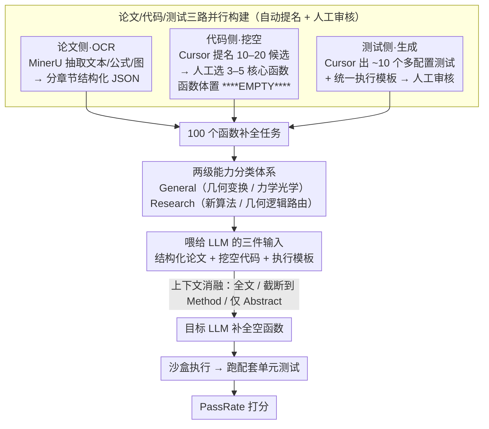

# GeoCodeBench: Benchmarking PhD-Level Coding in 3D Geometric Computer Vision

**会议**: CVPR 2026  
**arXiv**: [2603.30038](https://arxiv.org/abs/2603.30038)  
**代码**: [https://geocodebench.github.io/](https://geocodebench.github.io/)  
**领域**:3D视觉
**关键词**: 3D视觉代码生成, LLM评测, 几何算法实现, PhD级benchmark, 单元测试

## 一句话总结
首个面向3D几何计算机视觉的PhD级代码生成基准GeoCodeBench，包含100个从2025年顶会论文+代码库中精选的函数补全任务，配套自动化多样化单元测试，最强模型GPT-5仅36.6%通过率，揭示LLM在科学级3D代码实现上的巨大差距。

## 研究背景与动机

**领域现状**：AI辅助编程已重塑软件实践和研究工作流，但现有模型在复杂3D几何视觉代码上仍然挣扎。如果模型能可靠地编写这类代码，3D视觉研究将发生根本变革（自动原型设计、加速研究周期、民主化算法开发）。

**现有痛点**：(1) 现有代码基准（HumanEval/MBPP/SWE-bench）不覆盖3D几何实现——它们面向通用软件工程或竞赛编程；(2) 科学3D视觉代码需要数学精确的几何算子、物理建模和多视图推理——远超通用能力；(3) 论文-to-code的长上下文科学理解仍是未解问题。

**核心矛盾**：LLM已能生成通用代码，但无法可靠实现3D几何视觉的核心函数——这个差距有多大？瓶颈在哪里？

**切入角度**：模拟实际研究场景——给模型论文文本+函数骨架，要求填充实现，用单元测试自动评判。

**核心idea**：(1) 从2025年顶会论文官方仓库提取核心函数；(2) 自动工具提名+人工筛选确保质量；(3) 多样化边界测试覆盖几何退化配置；(4) 两级能力分类体系评估。

## 方法详解

### 整体框架
GeoCodeBench 把"读论文、实现算法"的真实研究场景搬进了一个可自动评判的任务里：每道题给模型一篇 3D 几何视觉论文的正文、一份被挖空了核心函数的代码，以及一个标准化的执行模板，要求模型把空函数补完整。补好的代码送进沙盒执行，跑配套的单元测试，按通过比例打分。整条流水线从原始论文 PDF 和官方代码库出发，经过论文 OCR、函数挖空、测试生成三条并行工序汇合成 100 个函数补全任务，再进入"喂输入→补全→执行→打分"的评测环路。

### 关键设计

**1. 论文/代码/测试三路并行构建：把"论文核心的 3D 几何函数"从顶会代码库里精准挖出来**

一个好的科学编码基准，难点不在收集代码，而在于挑出真正考验几何能力、又不至于 trivial 的那几个函数。论文把构建拆成三条并行的工序：论文侧用 MinerU 做 OCR，把文本、公式、图表抽出来并按章节组织成结构化 JSON；代码侧先用 Cursor 自动从每个仓库推荐 10–20 个候选函数，再交给 **3D 视觉研究者人工审核**，只保留 3–5 个核心几何函数，把它们的函数体替换成 `****EMPTY****` 占位符；测试侧同样先用 Cursor 自动生成约 10 个覆盖多种参数配置的测试用例，再人工审核保证可靠，并配上统一的执行模板（导入、输入输出定义）。这里人工审核是关键一环——自动提名效率高，但很容易选中辅助性或一眼可写的 trivial 函数，只有人来把关才能确保每道题都落在"论文真正的 3D 几何组件"上。为了压低数据泄露风险，所有论文都取自 2025 年的 CVPR / ICCV / ICLR，覆盖 3DGS、位姿估计、SLAM、重建、基于物理的建模、NeRF、3D 分割等子领域。

**2. 两级能力分类体系：把"会不会几何基础"和"能不能做研究级推理"分开诊断**

如果只报一个总通过率，看不出模型究竟是栽在基础几何知识上，还是栽在更高层的研究推理上。为此基准把 100 个任务划成两层四类。底层是 General 3D Capability，考的是基础几何知识，包括几何变换（坐标转换、投影、法向量、旋转参数化，占 24%）和力学/光学公式化（球谐函数、BRDF、运动方程、辐射度量，占 31%）；上层是 Research Capability，考的是研究级推理，包括新算法实现（论文核心新 idea 的函数级落地，占 34%）和几何逻辑路由（组合已有算子拼出新 pipeline，占 11%——许多有影响力的论文正是这样搭起来的）。这样分层后，每个模型的失分能定位到具体能力短板，而不是只剩一个笼统的分数。

**3. PassRate 指标与上下文消融：用通过率量化，再用输入裁剪探针定位瓶颈**

评分用 PassRate，即所有任务上"通过测试数占总测试数"的平均：

$$\text{PassRate} = \frac{1}{N}\sum_{i=1}^{N}\frac{p_i}{T_i}$$

其中 $p_i$ 是第 $i$ 题通过的测试数，$T_i$ 是该题的总测试数，$N$ 为任务总数。在此基础上，基准还设计了一组上下文消融：把喂给模型的论文内容在"全文 / 截断到 Method / 仅 Abstract"之间切换，用来探查到底是哪一部分文本真正帮助了实现——这组对照后来直接暴露出 LLM 在长上下文科学论文理解上的反常表现（见实验）。

## 实验关键数据

### 主实验（8个代表性模型）

| 模型 | 公司 | Overall | General | Research | Geo.Trans. | Algorithm |
|------|------|---------|---------|----------|------------|-----------|
| **GPT-5** | OpenAI | **36.6%** | **42.8%** | **29.1%** | 41.7% | 29.1% |
| Claude-Sonnet-4.5 | Anthropic | 31.1% | 37.2% | 23.7% | 38.3% | 19.7% |
| Gemini-2.5-Pro | Google | 30.4% | 33.8% | 26.2% | 41.9% | 25.3% |
| Kimi-K2-Instruct | Moonshot | 30.4% | 34.6% | 25.1% | 36.7% | 23.1% |
| Doubao-Seed-1.6 | ByteDance | 26.9% | 29.7% | 23.4% | 40.9% | 22.9% |
| Qwen3-Coder-480B | Alibaba | 23.5% | 22.7% | 24.6% | 29.0% | 21.8% |
| DeepSeek-R1 | DeepSeek | 21.0% | - | - | - | - |

### 上下文消融

| 输入上下文 | PassRate | 说明 |
|-----------|----------|------|
| 全文输入 | 基准 | 包含引言、相关工作等 |
| **截断到Method** | **统计显著更优** | 无关上下文干扰推理 |
| 仅Abstract | 显著下降 | 技术细节不足 |

### 关键发现
- **最强模型仅36.6%**：GPT-5在PhD级3D代码上距离可靠还有巨大差距
- **Research任务更难但与General正相关**：几何基础是研究级实现的必要非充分条件
- **截断到Method部分反而更好**：说明LLM在长上下文科学论文理解上存在严重困难——更多文本=更多干扰而非更多有用信息
- **创造性正确性**：某些成功案例中模型用完全不同但数学等价的方法通过测试——展示了超越复制的真正问题解决能力
- **Geometric Logic Routing（11%任务）**反映了许多经典3D视觉论文的构建方式——组合已有算子——这需要更高层的系统设计能力

## 亮点与洞察
- **首个3D视觉代码benchmark**：填补了AI编码评测在科学3D领域的空白。社区驱动的可扩展设计使其能随新论文持续生长
- **"更多上下文不是更好"的发现**：对LLM的长上下文科学理解能力提出了尖锐质疑。Method截断优于全文→LLM可能被引言/相关工作中的噪声误导
- **论文-to-code的研究范式**：GeoCodeBench的评测设置直接模拟"读论文→实现算法"的真实研究工作流，这是通向"自动3D视觉科学家"的第一步
- **单元测试的工程贡献**：为每个函数提供多样化、覆盖边界情况的自动化测试，这些测试本身就是3D几何的宝贵教学材料

## 局限与展望
- 100个函数的规模仍然有限——需要持续扩展
- 限于2025年论文可能随时间需要更新来规避数据泄露
- 单元测试的覆盖率可能不完全——通过测试不一定意味着完全正确的实现
- 仅评估函数级补全——完整的论文复现（包括训练循环、数据管线）更有挑战性

## 相关工作与启发
- **vs HumanEval/MBPP**: 通用编程基准，不涉及领域知识。GeoCodeBench需要深层3D几何推理
- **vs SWE-bench**: 仓库级issue解决，GeoCodeBench是函数级论文-to-code
- **vs PaperBench**: 完整论文复现评测，GeoCodeBench聚焦函数级核心组件——两者互补
- **vs ResearchCodeBench**: 也遮盖论文关键代码，但不聚焦3D几何且测试不够多样化

## 评分
- 新颖性: ⭐⭐⭐⭐⭐ 首个3D视觉代码benchmark，两级能力分类体系有洞察力
- 实验充分度: ⭐⭐⭐⭐⭐ 8个模型、上下文消融、分类分析、创造性案例研究
- 写作质量: ⭐⭐⭐⭐⭐ 构建流程透明可复现
- 价值: ⭐⭐⭐⭐⭐ 对3D视觉自动化研究和LLM科学编码能力评估有长远推动

<!-- RELATED:START -->

## 相关论文

- [\[ICLR 2026\] GIQ: Benchmarking 3D Geometric Reasoning of Vision Foundation Models with Simulated and Real Polyhedra](../../ICLR2026/3d_vision/giq_benchmarking_3d_geometric_reasoning_of_vision_foundation_models_with_simulat.md)
- [\[CVPR 2026\] PromptDepth: Efficient and Promptable Geometric 3D Vision Model for Embodied Intelligence](promptdepth_efficient_and_promptable_geometric_3d_vision_model_for_embodied_inte.md)
- [\[CVPR 2026\] SE(3)-Equivariance with Geometric and Topological Guidance for Category-Level Object Pose Estimation](se3-equivariance_with_geometric_and_topological_guidance_for_category-level_obje.md)
- [\[CVPR 2026\] Pano360: Perspective to Panoramic Vision with Geometric Consistency](pano360_perspective_to_panoramic_vision_with_geometric_consistency.md)
- [\[CVPR 2026\] Revisiting Optimal Coding for I-ToF under Practical Sensor Constraints](revisiting_optimal_coding_for_i-tof_under_practical_sensor_constraints.md)

<!-- RELATED:END -->
