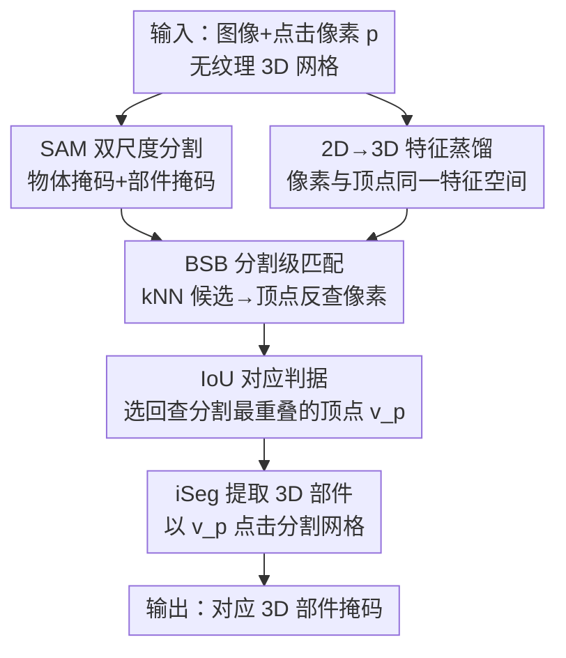

# Best Segmentation Buddies for Image-Shape Correspondence

**会议**: CVPR 2026  
**arXiv**: [2605.18193](https://arxiv.org/abs/2605.18193)  
**代码**: https://threedle.github.io/bsb/ (项目主页)  
**领域**: 3D视觉 / 分割 / 跨模态对应  
**关键词**: 图像-形状对应, 跨模态匹配, 特征蒸馏, 零样本分割, Best Buddies

## 一句话总结
本文提出 Best Segmentation Buddies（BSB），把"像素-顶点互为最近邻"这个在图像↔3D网格之间几乎无法成立的硬约束，松弛成"分割区域级别的互最近邻"，从而在无标注、零训练的情况下，把一张野外图像里点击的语义部件，对应到一个无纹理 3D 网格上的对应部件。

## 研究背景与动机

**领域现状**：对应（correspondence）是视觉与图形学的核心问题。传统工作大多停留在**同模态**：图像↔图像、3D↔3D；近年深度特征（DINO、扩散特征）把它推广到了**跨域但同模态**（比如鸟的图像对飞机的图像、人体网格对动物网格）。

**现有痛点**：真正"既跨模态又跨域"——2D 自然图像对 3D 无纹理网格——这条线几乎没人碰好。少数能做的方法要么依赖**强监督**（Continuous Surface Embeddings 需要密集标注），要么**绑死特定模板**（SHIC 做点到点的 canonical 映射，但缺部件语义、对局部形变不鲁棒）。图像有颜色纹理、网格只有几何；同一物体在两个模态里外观、几何、视角都差很远，甚至常常根本不是同一个物体（猫头鹰 vs 飞机）。

**核心矛盾**：要跨模态比较，必须把像素和顶点放进同一个特征空间。但即便用同一个 2D 视觉模型把特征"提升"到 3D 表面，模态鸿沟仍然存在——**像素和顶点几乎永远不是互为最近邻**（mutual nearest neighbor / best buddies）。直接套用经典的 best buddies 匹配会大面积失配。

**本文目标**：在不训练、不要标注、不限定物体/部件类型的前提下，建立 2D 图像区域 ↔ 3D 语义部件的**分割级**对应（segment-to-segment），而不是稀疏关键点或模板化的密集映射。

**切入角度**：作者观察到一个关键现象（Fig. 5）——当图像区域在网格上**真有对应部件**时，匹配回去的分割几乎和原始点击分割重合；**没有对应**时（比如吉他图上的音量旋钮，网格上根本没这个几何），匹配回去的分割几乎不相交。这意味着"分割重叠度"既能当匹配判据、又能当"对应是否存在"的开关。

**核心 idea**：把 best buddies 的硬约束**松弛到分割区域级别**——不要求点击像素 $p$ 是顶点 $v_p$ 的最近邻像素，只要求 $v_p$ 的最近邻像素落在 $p$ 所属的分割掩码内、且回查分割与 $p$ 的掩码 IoU 最大，就认定二者是"分割意义上的最佳搭档"。

## 方法详解

### 整体框架

输入是一张野外图像 + 用户在图像上点击的一个像素 $p$，以及一个无纹理 3D 网格；输出是网格上与 $p$ 所属语义部件对应的 3D 部件掩码 $M^{3D}_{v_p}$。整条流水线把两个现成的基础模型（2D 分割 SAM、2D 视觉特征 DINOv2）和一个蒸馏到 3D 的交互式分割模型 iSeg 串起来，中间用 BSB 这个匹配机制把"图像里的点击"和"网格上的顶点"对上。

流程是：先用 SAM 对点击像素同时拿到一个粗掩码 $M^{2D}_o$（整个物体）和一个细掩码 $M^{2D}_p$（部件）；再用 DINOv2 抽每像素特征、并蒸馏出每顶点特征，让像素和顶点可以算余弦相似度；然后用 BSB 在候选顶点里挑出"分割搭档"顶点 $v_p$；最后用 iSeg 以 $v_p$ 为点击在 3D 上分割出对应部件。

### 关键设计

**1. 2D→3D 特征蒸馏：把像素和顶点放进同一个可比较的特征空间**

跨模态匹配的第一道坎是"图像在 2D、网格在 3D，根本没法直接算相似度"。本文沿用 iSeg 的做法，用 2D 视觉模型 $\mathscr{F}^{2D}_{vis}$（DINOv2）对图像抽特征 $F_{vis}^{\mathcal{I}}\in\mathbb{R}^{w\times h\times d_{vis}}$（插值回原图分辨率拿到逐像素特征），再通过对网格多视角渲染、训练一个 MLP $\mathscr{F}^{3D}_{vis}:\mathbb{R}^{3}\rightarrow\mathbb{R}^{d_{vis}}$ 把同一个 2D 模型的特征"提升"到每个顶点 $F_{vis}^{\mathcal{V}}\in\mathbb{R}^{n\times d_{vis}}$。这样像素和顶点就处在同一语义特征空间，可以直接算余弦相似度 $s_{pv}$（式 3）。但作者明确指出：即便特征同源，模态差异（自然图像 vs 无纹理渲染、3D 特征是多视角平均得到）仍让两套特征对不齐——这正是后面要松弛约束的根因

**2. Best Segmentation Buddies：把"互最近邻"松弛到分割区域级**

经典 best buddies 要求像素 $p$ 和顶点 $v$ 互为特征最近邻，但跨模态下这几乎不成立，硬套会大面积失配。BSB 的做法是**反着找**：先取与点击像素 $p$ 余弦相似度最高的 $k$ 个候选顶点 $\mathcal{C}=\{v'\}$（取 $k$ 个而非 1 个，是为了容纳特征噪声）；对每个候选顶点 $v'$，在物体掩码 $M^{2D}_o$ 内找它的最近邻像素 $q'=\arg\max_{q\in M^{2D}_o} s_{v'q}$；只有当 $q'$ 落在点击像素的部件掩码内（$q'\in M^{2D}_p$）时，$v'$ 才算合格候选。换句话说，不要求 $p$ 是 $v_p$ 的最近邻，只要求 $v_p$ 的最近邻像素**落在 $p$ 所属的分割区域里**——这就是"分割意义上的最佳搭档"。这个松弛恰到好处：够松，能容忍模态鸿沟带来的特征偏移；又够紧，能把图像里有纹理、但网格上没有几何对应的元素（如吉他的音量旋钮）过滤掉

**3. IoU 对应判据：用分割重叠度同时做"选顶点"和"判存在"**

合格候选可能不止一个，到底选哪个顶点当 $v_p$？本文用回查分割的重叠度定胜负：对每个合格候选顶点对应的像素 $q'$，用 SAM 重新分割得到 $M^{2D}_{q'}$，与原始点击掩码 $M^{2D}_p$ 算 IoU（式 5），取 IoU 最大的 $q^*=\arg\max_{q'}\text{IoU}(M^{2D}_p,M^{2D}_{q'})$，其对应顶点即 $v_p$。更妙的是作者发现这个 IoU 还是"对应是否存在"的天然开关：在吉他图上均匀采 100 个像素，**有对应部件**的区域平均 IoU 高达 $0.98$，**纯纹理、无几何对应**的区域只有 $0.01$。也就是说同一个量既选出了最佳搭档，又判定了某个图像区域在网格上到底有没有对得上的部件——这是本文从现象观察里挖出来的核心机制

**4. iSeg 引导 3D 分割：用匹配顶点 bootstrap 出完整 3D 部件**

找到 $v_p$ 只是一个点，最终要的是一整块 3D 部件。本文直接复用 iSeg——它把 2D 分割模型蒸馏进 3D、能对给定顶点点击预测出对应网格部件掩码 $M^{3D}_v$。这里以 $v_p$ 为点击，得到的 $M^{3D}_{v_p}$ 就是图像分割 $M^{2D}_p$ 对应的 3D 部件，整套对应闭环完成。这一步让"点对点匹配"自举成"段对段对应"，也让方法天然双向：把图像和网格角色互换（点击顶点→分割网格→反查最佳搭档像素→分割图像），就能做 shape→image 的对应

### 一个完整示例

以电吉他图为例：用户点击吉他**琴颈**像素 $p$ → SAM 给出粗掩码（整把吉他）和细掩码（琴颈）→ DINOv2 取 $p$ 特征，在网格顶点里挑出 $k=100$ 个最相似候选 → 对每个候选顶点反查它在图像物体区域内的最近邻像素 $q'$，只保留 $q'$ 落在琴颈掩码内的 → 对这些合格候选用 SAM 重分割、与琴颈掩码算 IoU，IoU≈$0.98$ 的胜出，定为 $v_p$ → iSeg 以 $v_p$ 分割出网格上的琴颈部件。若改点击**音量旋钮**：所有候选顶点的最近邻像素都落在旋钮区域外，回查分割 IoU≈$0.01$，系统据此判定"网格上没有对应部件"，正确地拒绝匹配。

## 实验关键数据

### 主实验

由于不存在跨模态图像-形状段对应的标注数据集，作者借鉴 iSeg，把 PartNet 部件分割数据集改造为评测集：取 265 个网格，随机采顶点、渲染可见该顶点的视角，用 ControlNet 基于深度生成彩色图像，把 3D 顶点投影成 2D 像素作为"点击"，再看方法能否把该像素映回顶点真值所属的 3D 部件。指标为**对应成功率**。两个图像基线 NBB、DIFT 各报"不同视角 / 同视角"两种设置。

| 方法 | 类型 | 成功率 ↑ |
|------|------|---------|
| NBB [3] | 稀疏互最近邻像素匹配 | 0.64 / 0.66 |
| DIFT [53] | 扩散特征相似度匹配 | 0.39 / 0.48 |
| **BSB（本文）** | 分割级互最近邻 + 3D 直接匹配 | **0.74** |

BSB 即使对比基线"用同视角渲染"这种更宽松设置（NBB 0.66 / DIFT 0.48）仍明显领先。NBB 因模态鸿沟下稀疏互最近邻不准而失配；DIFT 的扩散特征对"有纹理图像 vs 无纹理渲染"的剧烈外观差异敏感，对齐错误。

### 消融 / 分析实验

| 配置 / 对照 | 关键指标 | 说明 |
|------------|---------|------|
| 有对应部件的图像区域 | 平均 IoU = 0.98 | 匹配回查分割几乎与原点击重合 |
| 无几何对应的纹理区域 | 平均 IoU = 0.01 | 回查分割几乎不相交，判为"无对应" |
| 2D 特征用 DINOv2 vs DIFT 特征 [53] | 均可工作 | 方法不绑死某个特征提取器 |
| 2D 分割 SAM vs SAM2 [48] | 结果无显著差异 | 因 iSeg 用 SAM，故 backbone 选 SAM |
| 候选数 $k=100$ | —（消融见附录） | 取相似度最高的 100 个顶点为候选 |

### 关键发现

- **IoU = 0.98 vs 0.01** 这个对比是全文最有信息量的数据：同一个量既当匹配评分、又当"对应存在性"判据，说明分割级一致性确实强相关于真实语义对应。
- 方法对 backbone 不敏感（特征可换 DIFT、分割可换 SAM2），说明 BSB 的增益来自**松弛匹配机制本身**而非某个强 backbone。
- 单次图像点击的对应推理约 **4 秒**（Nvidia A40），零样本、无需训练标注。
- 强鲁棒性：同一图像可匹配到几何差异很大的不同网格；副产物是无监督地得到跨域**图像↔图像**对应（海龟壳 ↔ 滑雪护背），因为两张图都对到同一网格部件上。

## 亮点与洞察

- **把硬约束"恰到好处地"松弛**：best buddies 在跨模态下太硬、直接放弃约束又太松，BSB 落在"分割区域级"这个中间点——比稀疏关键点信息多、又对局部形变鲁棒，这个 sweet spot 的选择很见功力。
- **一个量两用**：IoU 同时充当"选哪个顶点"和"到底有没有对应"两个角色，是从 Fig. 5 现象观察里反推出来的设计，而非工程拼凑，最让人"啊哈"。
- **纯组合现成模型、零训练**：SAM + DINOv2 + iSeg 三块都是现成的，本文的创新全在中间的匹配协议，复现门槛低、迁移性强。这套"反查最近邻像素是否落在掩码内"的思路可迁移到任何"两个模态特征对不齐、但各自能分割"的匹配场景（如图像↔点云、图像↔NeRF）。
- **天然双向**：图像↔形状角色对称，不需额外设计就支持 shape→image，且对野外图像里的干扰物体/背景仍能定位到正确部件。

## 局限与展望

- **依赖蒸馏特征质量与 iSeg**：整条链路建立在"2D 特征能成功蒸馏到 3D 顶点"和"iSeg 能从顶点点击分出合理部件"之上，若网格几何退化或 iSeg 失败，对应也会崩。
- **纹理/几何缺失即拒绝**：对图像中有纹理但网格无几何对应的区域，方法是"正确拒绝"而非"近似匹配"——在需要软对应的场景（如部分遮挡、部件缺失但仍想近似对齐）可能过于保守。
- **评测代理性较弱**：缺乏真实跨模态段对应标注，主指标靠 ControlNet 生成图 + 投影像素构造，与真正的野外图像分布有差距；野外结果主要靠定性图和感知研究（在附录）支撑。
- **作者展望**：用段对段对应反过来更新预训练视觉特征使其"对应感知"；扩展到视频、3D 高斯、NeRF 等更多模态；以及图像/视频驱动的 3D 局部形变。

## 相关工作与启发

- **vs NBB [3]（Neural Best-Buddies）**：NBB 在特征空间找稀疏互最近邻像素。本文继承"best buddies"思想，但指出像素-顶点互最近邻在跨模态下几乎不成立，故松弛到分割级；实验上 BSB 0.74 > NBB 0.64/0.66。
- **vs DIFT [53]**：DIFT 用扩散特征算相似度做对应，对"纹理图 vs 无纹理渲染"外观差异敏感；BSB 直接在 3D 上匹配并用分割回查校验，成功率 0.74 > 0.39/0.48。
- **vs SHIC [52] / Continuous Surface Embeddings [40]**：前者无需标注但绑模板、做点到点 canonical 映射、缺部件语义；后者要密集监督。BSB 既不要标注也不绑模板，产出的是分割级、带部件语义的对应。
- **vs iSeg [27]**：iSeg 解决的是"3D 交互分割"本身；本文把 iSeg 当工具，用分割来**计算对应**，是目的层面的差异。

## 评分
- 新颖性: ⭐⭐⭐⭐⭐ 首个同时跨模态（图像-形状）且跨域（猫头鹰-飞机）的零训练段对应方法，"分割级 best buddies"松弛是干净有力的新点子
- 实验充分度: ⭐⭐⭐⭐ 定量对比 + IoU 现象分析 + 鲁棒性/双向/纹理迁移应用齐全，但缺真值数据、主指标靠生成图代理
- 写作质量: ⭐⭐⭐⭐⭐ 从现象观察推导到机制设计，公式与图示清晰，故事讲得顺
- 价值: ⭐⭐⭐⭐ 零样本、可换 backbone、能驱动局部纹理迁移，思路对跨模态匹配有较强启发与可迁移性

<!-- RELATED:START -->

## 相关论文

- [\[CVPR 2026\] SGSoft: Learning Fused Semantic-Geometric Features for 3D Shape Correspondence via Template-Guided Soft Signals](sgsoft_learning_fused_semantic-geometric_features_for_3d_shape_correspondence_vi.md)
- [\[CVPR 2026\] UniCorrn: Unified Correspondence Transformer Across 2D and 3D](unicorrn_unified_correspondence_transformer_across_2d_and_3d.md)
- [\[CVPR 2026\] Image-to-Point Cloud Feature Back-Projection for Multimodal Training of 3D Semantic Segmentation](image-to-point_cloud_feature_back-projection_for_multimodal_training_of_3d_seman.md)
- [\[CVPR 2026\] PatchAlign3D: Local Feature Alignment for Dense 3D Shape Understanding](patchalign3d_local_feature_alignment_for_dense_3d_shape_understanding.md)
- [\[CVPR 2025\] Denoising Functional Maps: Diffusion Models for Shape Correspondence](../../CVPR2025/3d_vision/denoising_functional_maps_diffusion_models_for_shape_correspondence.md)

<!-- RELATED:END -->
