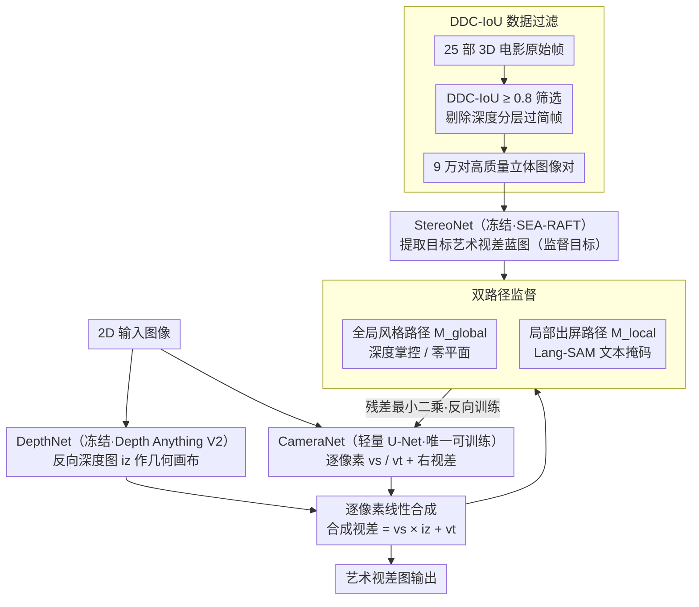

# Beyond Geometry: Artistic Disparity Synthesis for Immersive 2D-to-3D

**会议**: CVPR 2026  
**arXiv**: [2603.05906](https://arxiv.org/abs/2603.05906)  
**代码**: 无（暂未开源）  
**领域**: 3D视觉  
**关键词**: 2D-to-3D转换, 艺术视差合成, 立体电影, 双路径架构, 深度风格

## 一句话总结
提出"艺术视差合成"新范式（Art3D），将2D-to-3D转换目标从几何精度转向艺术表达，通过双路径架构解耦全局深度风格与局部艺术效果，从专业3D电影数据中学习导演意图。

## 研究背景与动机
**领域现状**：当前2D-to-3D转换方法（如扩散模型方法StereoCrafter、Eye2Eye）已实现几何精度，但缺乏艺术沉浸感——与专业3D电影（如《阿凡达》）的观影体验存在显著差距。

**现有痛点**：几何重建范式（MonoDepth、MiDaS等）将专业3D电影中的艺术视差调整视为"噪声"来抑制，导致"艺术贫乏"问题——几何正确但叙事贫瘠。

**核心矛盾**：专业3D电影后期的三大艺术操作——全局深度掌控（Global Depth）、零平面选择（Zero-Plane）、局部效果雕刻（Local Sculpting）——都被编码在视差图中，但现有方法无法学习这些艺术意图。

**本文目标** 如何从2D图像生成包含导演艺术意图的视差图，而非仅仅物理正确的视差图。

**切入角度**：将视差图视为艺术表达的载体，从专业3D电影中间接学习全局深度风格和局部出屏效果。

**核心 idea**：用双路径监督机制解耦全局导演宏观意图和局部"艺术笔触"，通过间接监督从专业3D电影中学习艺术视差风格。

## 方法详解

### 整体框架

Art3D 要做的不是几何上正确的视差，而是带导演艺术意图的视差——把2D-to-3D转换从“几何重建”挪到“艺术视差合成”。它用三网络架构：冻结的 DepthNet（Depth Anything V2）提供几何画布，冻结的 StereoNet（SEA-RAFT）从专业3D电影里提取目标艺术蓝图，唯一可训练的 CameraNet（轻量U-Net）合成虚拟相机参数。核心建模是把艺术蓝图看成几何画布的逐像素线性变换：

$$\hat{d}^L = vs \cdot iz + vt$$

其中 $vs$、$vt$ 是逐像素的缩放和偏移张量，$iz$ 是反向深度图——也就是说艺术效果被拆成“对几何深度做缩放+平移”，让网络学这两张参数图就行。监督信号来自 DDC-IoU 过滤后的专业3D电影，经 StereoNet 提取成目标视差蓝图，再由双路径监督反向训练 CameraNet。

### 关键设计

**1. 双路径监督：把全局深度风格和局部出屏效果拆开各自监督**

专业3D电影的视差里混着两类艺术操作——全局的深度掌控/零平面选择，和局部的出屏雕刻，直接一起学会互相干扰。Art3D 把监督信号 $d^L$ 分解为全局风格路径（掩码 $M_{global}$）和局部效果路径（掩码 $M_{local}$）：局部掩码用 Lang-SAM 以文本 prompt 生成（如“前景角色出屏”），全局掩码则取 StereoNet 左右一致性检查的有效区域再挖掉局部区域，$M_{global} = M_{valid} \cdot (1 - M_{local})$。这个拆分对误差天然鲁棒——局部掩码漏检的出屏区域会自然退化到全局路径监督而不会丢，全局掩码稀疏时又等同于数据增强。

**2. CameraNet：唯一可训练且极简的合成器**

为了证明效果来自框架设计而非堆网络容量，Art3D 把可训练部分压到最小：CameraNet 是轻量编码器-解码器（3次下采样 + 3次上采样），只输出3通道——$vs$、$vt$ 和右视差图 $\hat{d}^R$，是整个框架唯一需要训练的组件。其余感知网络全冻结，艺术风格的学习压力全落在这3通道上。

**3. DDC-IoU 数据过滤：剔除深度分层太简单的低质量帧**

3D电影原始帧质量参差，有些帧深度分层过于简单、结构对齐差，直接拿来训会污染风格学习。作者提出 Depth-Disparity Consistency IoU 指标衡量深度图与视差图的一致性，阈值设 0.8，从25部3D电影里筛出9万对高质量立体图像对。实验里能看到原始数据中部分帧 DDC-IoU 为0，正说明这步过滤的必要性。

### 损失函数 / 训练策略

核心损失 $\mathcal{L}_{Art}$ 是双路径掩码最小二乘残差之和：

$$\mathcal{L}_{Art} = \mathcal{L}_{path}(M_{global}) + \mathcal{L}_{path}(M_{local}) + \mathcal{L}_{st}$$

其中 $\mathcal{L}_{path}(M) = \min_{s,t} \sum_k M_k \cdot \|d^L_k - (s \cdot \hat{d}^L_k + t)\|^2$，即在每条路径的掩码内用最小二乘拟合出缩放/平移再算残差。全局风格正则 $\mathcal{L}_{st} = \|s-1\|^2 + \|t\|^2$ 鼓励合成视差直接反映全局监督信号；另有平滑性损失和左右一致性损失作辅助。训练50 epoch，单卡A800，batch size 32，输入512×512。

## 实验关键数据

### 主实验：全局深度风格评估

| 方法 | 全局深度 $s$ (均值/标准差) | 零平面 $t$ (均值/标准差) |
|------|--------------------------|------------------------|
| Baseline (w/o $\mathcal{L}_{Art}$) | 0.030 / 0.018 | 6.98 / 2.35 |
| **Art3D (Ours)** | **0.020 / 0.009** | **6.08 / 1.80** |
| Ground Truth | 0.013~0.023 / 0.010~0.020 | 4.35~5.28 / 2.09~4.68 |

Art3D的标准差（$\sigma$）显著降低，表明学到了稳定一致的艺术风格而非随机几何视差。

### 消融实验：范式对比

| 方法 | 全局控制(零平面) | 局部雕刻(艺术) |
|------|-----------------|----------------|
| StereoCrafter | 手动(全局平移) | 无 |
| Eye2Eye | 物理(复现) | 无 |
| **Art3D (Ours)** | **学习(全局风格)** | **有(学习)** |

### 几何一致性验证（DDC-IoU）
Art3D在右视图坐标系下的DDC-IoU稳定达到0.83~0.89，证明艺术风格学习未破坏底层几何一致性。而原始3D电影数据中质量不一——部分帧DDC-IoU为0（结构对齐差），强调了数据过滤的必要性。

### 关键发现
- 去除 $\mathcal{L}_{path}(M_{local})$ 后模型仅能学到全局风格，无法产生局部出屏效果
- Art3D在DDC-IoU指标上稳定达到0.83-0.89，证明艺术风格学习未损害几何一致性
- 专业3D软件Owl3D在不同场景间的3D感知不一致，而Art3D保持稳定的出屏效果

## 亮点与洞察
- **范式创新**：首次明确提出从"几何重建"到"艺术视差合成"的范式转移，将视差图定位为电影叙事的载体
- **间接监督巧妙**：不直接用像素级GT监督，而通过最小二乘拟合提取风格参数 $(s, t)$ 分布来评估艺术一致性
- **鲁棒性设计精巧**：双路径掩码互补——局部掩码漏检退化为全局监督，全局掩码稀疏等同数据增强- **Avatar案例引入生动**：用《阿凡达》的Jake/Ikran飞行场景具体说明三层艺术意图，使动机极具说服力
- **CameraNet设计极简**：仅有的可训练组件，3次下采样+3次上采样+1个输出层，证明框架设计起主要作用而非网络大小

## 局限与展望
- 论文自称"preliminary exploration"，CameraNet架构较简单（仅6层），生成能力受限
- 局部出屏效果数据仅201个片段/15K帧，数据量有限
- 仅在3D电影数据上验证，对非电影场景（如AR/VR内容）的泛化能力未知
- 评估指标仍以统计分布对比为主，缺少用户主观研究- 未探索与现有扩散模型生成管线（如StereoCrafter）的强化配合方案
- 未对不同类型的电影（动画、科幻、现代）分别训练专属模型，而是用统一模型覆盖所有风格

## 相关工作与启发
- 传统启发式视差重映射（非线性重映射、显著性编辑）需要立体对输入，无法泛化到单目
- 几何重建范式（Deep3D、MonoDepth→StereoCrafter、Eye2Eye）虽用了扩散模型，仍是几何驱动
- Art3D填补了启发式艺术编辑与几何重建之间的空白，实现单目输入下的跨电影3D风格迁移
- StereoCrafter在数据处理时统一零平面位置，主动丢弃了导演的原始艺术意图
- Eye2Eye虽能产生出屏效果，但学习自物理正确的VR180数据，其效果是物理视差的复现而非艺术设计
- 本文定义的三层艺术意图（全局深度/零平面/局部雕刻）为后续3D视觉创作研究提供了清晰的分析框架

## 数据构建细节
- 从25部知名3D电影选取（如《雨果》、《超凡蜘蛛侠》、《了不起的盖茨比》），遵循Ranftl等人的数据协议
- DDC-IoU≥0.8过滤后保留90K对1080P立体图像，80K训练+10K测试
- 局部出屏数据从YouTube手动收集201个片段，处理后约15K帧补充到训练集
- 正负视差均被StereoNet提取，保留了完整的出屏/入屏信息

## 评分 ⭐
- 新颖性: ⭐⭐⭐⭐⭐ — 范式级创新，首次将"艺术意图"纳入2D-to-3D转换
- 实验充分度: ⭐⭐⭐ — 消融充分但缺少与SOTA的定量对比和主观评测
- 写作质量: ⭐⭐⭐⭐ — 动机阐述非常有说服力，Avatar案例引入生动
- 价值: ⭐⭐⭐⭐ — 开辟新方向，但初步探索阶段，实际应用需后续完善

<!-- RELATED:START -->

## 相关论文

- [\[CVPR 2026\] MatSpray: Fusing 2D Material World Knowledge on 3D Geometry](matspray_fusing_2d_material_world_knowledge_on_3d_geometry.md)
- [\[CVPR 2026\] Fast3Dcache: Training-free 3D Geometry Synthesis Acceleration](fast3dcache_training-free_3d_geometry_synthesis_acceleration.md)
- [\[CVPR 2026\] DINO Eats CLIP: Adapting Beyond Knowns for Open-set 3D Object Retrieval](dino_eats_clip_adapting_beyond_knowns_for_open-set_3d_object_retrieval.md)
- [\[CVPR 2026\] MeshFlow: Efficient Artistic Mesh Generation via MeshVAE and Flow-based Diffusion Transformer](meshflow_efficient_artistic_mesh_generation_via_meshvae_and_flow-based_diffusion.md)
- [\[CVPR 2026\] BEA-GS: BEyond RAdiance Supervision in 3DGS for Precise Object Extraction](bea-gs_beyond_radiance_supervision_in_3dgs_for_precise_object_extraction.md)

<!-- RELATED:END -->
