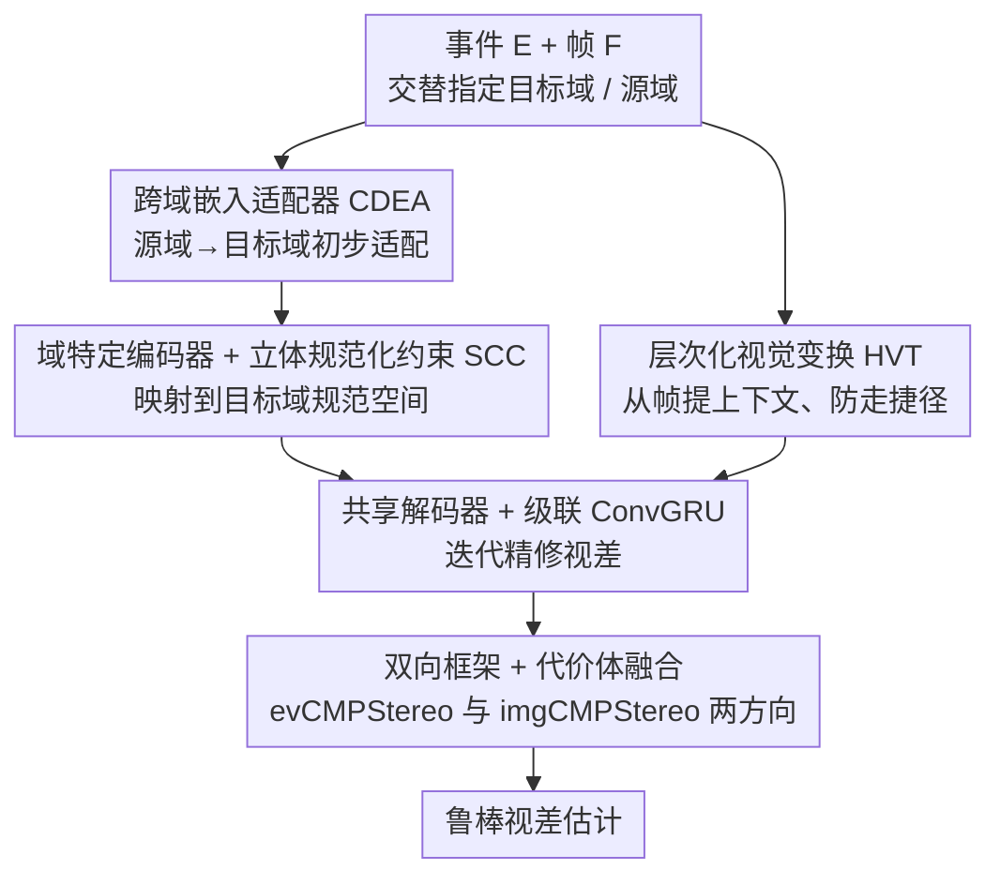

# Bi-CMPStereo: Bidirectional Cross-Modal Prompting for Event-Frame Asymmetric Stereo

**会议**: CVPR 2026  
**arXiv**: [2604.15312](https://arxiv.org/abs/2604.15312)  
**代码**: [github.com/xnh97/Bi-CMPStereo](https://github.com/xnh97/Bi-CMPStereo)  
**领域**: 3D视觉  
**关键词**: event camera, stereo matching, cross-modal, asymmetric stereo, depth estimation

## 一句话总结

提出 Bi-CMPStereo，一种双向跨模态提示框架，交替将事件和帧设为目标域进行立体规范化约束和跨域嵌入适配，同时利用两个方向的代价体实现鲁棒的事件-帧非对称立体匹配。

## 研究背景与动机

事件相机的高时间分辨率和高动态范围与帧相机的丰富上下文信息互补，使事件-帧非对称立体在高速运动和极端光照下很有前景。然而模态差距严重：现有方法要么通过域级对齐（统一表示+Siamese 特征提取）要么通过特征级对齐（独立编码器+共享嵌入）来缓解，但都可能边缘化域特有的判别性线索。关键挑战是学习表达性表示而不进行信息损失的边缘化。

## 方法详解

### 整体框架

事件-帧非对称立体的难点是模态差距大：以往要么做域级对齐（统一表示 + Siamese 提特征），要么做特征级对齐（独立编码器 + 共享嵌入），但都倾向于把某一模态特有的判别线索“边缘化”掉。Bi-CMPStereo 的思路是不强求一个折中的共同空间，而是交替把事件和图像分别设为目标域与源域：CMPStereo 在目标域的规范空间里学对齐的立体表示，实例化成 evCMPStereo（以事件为目标）和 imgCMPStereo（以图像为目标）两个互补配置，最后同时用两个方向的代价体融合出鲁棒视差。每个 CMPStereo 内部的数据流是：CDEA 先在源域做一遍初步的源到目标适配，域特定编码器配合 SCC 把源、目标都映射到目标域的规范空间，共享解码器产出多尺度立体特征后交给级联 ConvGRU 迭代精修；上下文则单独用 HVT 从帧图像里提取，避免模型走捷径只盯着帧。

### 关键设计

**1. 跨域嵌入适配器（CDEA）：先把源域里被弱编码的目标域线索扶正**

源域里那些原本编码得很弱的目标域线索（比如图像里唾手可得的颜色，要从事件里提取却很费劲），如果不先补强，在后续对齐里会被进一步淹没。CDEA 是一个轻量适配器，在特征级别先做一遍源到目标的初步适应，再把结果交给域特定编码器深入提取，相当于先把弱信号“扶正”再编码，避免一上来就丢信息。

**2. 立体规范化约束（SCC）：在目标域规范空间里做高保真跨模态对齐**

模态对齐时最怕把源域特有线索压成无差别的共同表示。SCC 作为正则化项，强制网络从事件和帧两种模态里都学到目标域的判别性特征，把源、目标统一映射到目标域的规范空间完成高保真对齐——既对齐，又确保从源域提取的特征仍带着目标域的区分性表达，而不是被磨平。

**3. 层次化视觉变换（HVT）：防止模型走捷径直接靠帧绕过事件**

帧图像上下文丰富，模型很容易偷懒只用帧、忽略事件，结果一到高速运动或极端光照就退化。提取上下文特征时改用 HVT，打断这种捷径学习、增强跨场景泛化，让事件信息真正参与匹配。

**4. 双向框架与代价体融合：交替目标域，两方向代价体互补**

只把一个模态固定当目标域的单向配置，仍会牺牲另一方向的判别线索。Bi-CMPStereo 把 CMPStereo 实例化成 evCMPStereo（事件为目标）和 imgCMPStereo（图像为目标）两个方向，各自产出一组代价体，再融合两方向的匹配置信度。两个方向互为补充，避免任一模态的特有线索被边缘化，最终在级联 ConvGRU 精修下得到鲁棒视差。

### 损失函数 / 训练策略

迭代精修的视差损失，两个方向的代价体各自产出视差后融合；SCC 约束作为正则化项在训练中一并施加。

## 实验关键数据

### 主实验

在 DSEC 和 MVSEC 基准上评估：

| 基准 | 指标 | 先前SOTA | Bi-CMPStereo |
|------|------|---------|-------------|
| DSEC | 各项指标 | 基线 | **显著超越** |
| MVSEC | 各项指标 | 基线 | **显著超越** |

在准确性和泛化性上均显著超越 SOTA。

### 消融实验

- 双向框架优于任一单向配置
- SCC 约束对跨模态特征质量提升关键
- CDEA 有效补充了源域中缺失的目标域线索

### 关键发现

- 交替设置目标域有效避免了信息边缘化
- 双向代价体提供了互补的匹配置信度
- 保留域特有线索比追求统一表示更有效

## 亮点与洞察

- "交替目标域"的双向设计理念新颖——不是寻找折中的共同空间，而是两个方向各自充分利用
- SCC 将立体匹配的几何约束与跨模态对齐结合
- HVT 防止模型走捷径直接用帧信息绕过事件信息

## 局限与展望

- 双向框架意味着两倍的计算开销
- 事件表示的选择（event concentration）可能不是最优的
- 仅在两个立体基准上验证

## 相关工作与启发

- 交替目标域框架可推广到其他跨模态融合任务
- SCC 的域提示思路借鉴了 NLP 中的 prompting
- 对事件-帧融合的系统性方案为神经形态传感器应用提供参考

## 评分

7/10 — 方法设计系统完整，实验改进显著，是非对称立体领域的有力推进。

<!-- RELATED:START -->

## 相关论文

- [\[CVPR 2026\] Bidirectional Cross-Modal Prompting for Event-Frame Asymmetric Stereo](bidirectional_cross-modal_prompting_for_event-frame_asymmetric_stereo.md)
- [\[CVPR 2026\] ARES: Unifying Asymmetric RGB-Event Stereo for Probabilistic Scene Flow Estimation](ares_unifying_asymmetric_rgb-event_stereo_for_probabilistic_scene_flow_estimatio.md)
- [\[CVPR 2026\] GS-ASM: 2DGS-Supervised Active Stereo Matching](gs-asm_2dgs-supervised_active_stereo_matching.md)
- [\[CVPR 2026\] AIMDepth: Asymmetric Image-Event Mamba for Monocular Depth Estimation](aimdepth_asymmetric_image-event_mamba_for_monocular_depth_estimation.md)
- [\[CVPR 2026\] AffordGrasp: Cross-Modal Diffusion for Affordance-Aware Grasp Synthesis](affordgrasp_cross-modal_diffusion_for_affordance-aware_grasp_synthesis.md)

<!-- RELATED:END -->
