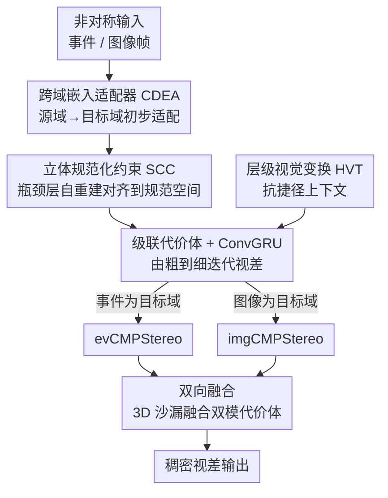

# Bidirectional Cross-Modal Prompting for Event-Frame Asymmetric Stereo

**会议**: CVPR 2026  
**论文**: [CVF Open Access](https://openaccess.thecvf.com/content/CVPR2026/html/Xu_Bidirectional_Cross-Modal_Prompting_for_Event-Frame_Asymmetric_Stereo_CVPR_2026_paper.html)  
**代码**: https://github.com/xnh97/BiCMPStereo  
**领域**: 3D视觉  
**关键词**: 事件相机, 非对称立体匹配, 跨模态对齐, 视差估计, 跨模态提示  

## 一句话总结
针对"一只眼是事件相机、另一只眼是普通 RGB 相机"的非对称立体匹配，本文提出 Bi-CMPStereo：用一个跨域适配器 + 自重建约束把两个模态都拉到"同一个目标域的规范空间"里对齐，且让事件和图像轮流当目标域、双向各跑一遍再融合，在 DSEC / MVSEC / M3ED 上精度和泛化都显著超过此前 SOTA（如 ZEST）。

## 研究背景与动机
**领域现状**：立体匹配（双目找对应点、算视差→深度）在 RGB 相机上已经很成熟，RAFT-Stereo 那类迭代细化方法是主流。事件相机（event camera）是仿生神经形态传感器，逐像素异步检测亮度变化，微秒级时间分辨率、120 dB 高动态范围，在高速运动和极端光照下比帧相机强很多。但纯事件双目（symmetric event stereo）在静止/弱纹理区域因事件稀疏而难以稠密估计，且两台事件相机成本高。于是"一只事件 + 一只 RGB"的**非对称立体（asymmetric stereo）**成了兼顾鲁棒与成本的方案。

**现有痛点**：非对称配置里两个视图模态完全不同——事件是稀疏的亮度变化、帧是稠密的强度图像。立体匹配模型本质上假设左右视图在同一特征空间里可比相似度，而事件和帧之间存在巨大的**模态鸿沟（modality gap）**，直接破坏了这个对齐假设。

**核心矛盾**：现有缓解办法分两类——① 域级对齐：把事件和帧统一成一种共同表示喂给 Siamese 提取器；② 特征级对齐：各用各的提取器再求共享嵌入。两类都在**追求跨模态的共性**，结果把"只在一个域显著、在另一个域很难提取"的判别性域特有线索（domain-specific cues）给**边缘化（marginalize）**掉了。典型例子：图像里唾手可得的颜色线索，要从事件里提取得靠复杂网络，对齐时就容易被抹掉。这种信息损失让非对称方法始终打不过同构输入的对称事件立体。

**本文目标 + 核心 idea**：学到既对齐、又不丢域特有判别信息的表示。作者的切入点是**不强行找一个折中的公共空间，而是轮流指定一个模态当"目标域（target domain）"、把它的域作为对齐的规范空间（canonical space）**，让另一个源域（source domain）模态被"提示/拉拢"到这个规范空间里，同时用自重建逼模型保住细节。再把"事件当目标域"和"图像当目标域"两个方向各跑一遍、融合互补——这就是 Bidirectional Cross-Modal Prompting。

## 方法详解

### 整体框架
系统要解决的是：给定标定好的事件-帧非对称双目，估计稠密视差。核心组件 **CMPStereo** 学到在"某个目标域规范空间"里对齐的立体表示；它有两个对称实例：**evCMPStereo**（事件当目标域 $X_t$，用事件浓度图 E 表示；帧当源域 $X_s$）和 **imgCMPStereo**（图像帧当目标域，事件编码成体素网格 V 当源域）。两个单域网络各自端到端训好后，再冻结当特征提取器，由 **Bi-CMPStereo** 把两条分支的多尺度代价体融合，做最终视差细化。

单个 CMPStereo 内部的流向是：源域模态先过 **跨域嵌入适配器（CDEA）** 做初步的"源→目标"适配 → 源域和目标域各过自己的域专属编码器 $F_s(\cdot)$、$F_t(\cdot)$，并由 **立体规范化约束（SCC）** 在瓶颈层逼它们落到同一个目标域规范空间 → 共享解码器 $F_D(\cdot)$ 产出多尺度立体特征 → 构建组相关代价体 → 级联 ConvGRU 迭代细化视差。上下文特征单独从图像帧用 **层级视觉变换（HVT）** 提取，防止网络走"只靠帧上下文"的捷径。

### 关键设计

**1. 跨域嵌入适配器 CDEA：把源域模态主动"激活"成目标域线索**

痛点是：源域模态（如 evCMPStereo 里的帧）里其实潜藏着目标域需要的判别线索，但直接编码很难把它们激活出来。CDEA 在源域分支起点放一个 U 形适配器 $A_{s2t}(\cdot)$，把源域 $X_s$ 映射到一个与目标域对齐的嵌入空间，显式地把源表示里潜在的目标域判别线索激活出来，便于后续细粒度对齐。

为了引导适配器学到目标域的嵌入分布、并保证 evCMPStereo 与 imgCMPStereo 两个变体彼此独立互补，作者用**一个共享的域分类器 $C(\cdot)$** 来区分事件嵌入和帧嵌入，并以它监督源→目标的适配：

$$L_{cdea} = \ell_{ce}(C(E), 1) + \ell_{ce}(C(F), 0) + \ell_{ce}(C(A_{s2t}(X_s)), Y_t)$$

其中 $\ell_{ce}$ 是二元交叉熵，$E$、$F$ 分别是事件/帧表示，$Y_t$ 是目标域标签。共享同一个分类器，意味着每个适配器都被逼着把自己的源域专门往"它指定的目标域"那一侧映射，从而让两个变体在各自规范空间里学到互补表示。值得注意的是 CDEA 做的是**域级适配而非像素级翻译**——像素级翻译（image-to-image translation）往往产生模糊表示、削弱立体特有特征；且只用单一分类器、不搞对抗学习，训练更稳。

**2. 立体规范化约束 SCC：用自重建逼编码器别把判别线索抹平**

痛点是：立体匹配在代价体上联合优化时，确实会隐式驱动编码器收敛到一个公共潜空间，但这个潜空间容易"塌缩"成过度相似的表示，把判别性线索边缘化掉——这正是前述非对称方法的通病。SCC 的关键洞察是：一个有表达力的中间表示，应该能在目标域空间里**忠实重建出原始输入**。于是在瓶颈层加一个训练期重建约束，用共享的轻量解码器 $F_R(\cdot)$ 把源域、目标域表示都映回各自的目标域重建：

$$L_{scc} = \lVert F_R(F_s(A_{s2t}(X_s))) - X_s^{(t)} \rVert_1 + \lVert F_R(F_t(X_t)) - X_t \rVert_1$$

其中 $X_s^{(t)} := W(X_t, d_{gt})$ 是把目标域对应物用真值视差 $d_{gt}$ 做 warp、表达在目标域空间里的源域模态（⚠️ 公式中的括号配对以原文为准，原文此处排版略有出入）。$F_R$ **故意设计得很轻**，防止它"脑补"出缺失细节，从而逼编码器把细粒度线索真正保留在潜空间里。这个约束有三重收益：① 目标域模态的自重建保住域特有判别特征；② 源域模态的跨域重建强制细粒度的源→目标对齐，把网络拉进目标空间运作；③ 共享重建解码器把两个域专属编码器一起正则到统一的规范潜空间。SCC **只在训练期用、推理时不参与**，零额外运行开销。

**3. 层级视觉变换 HVT：堵住"只靠帧上下文"的捷径**

上下文特征对 ConvGRU 更新器很关键（初始化隐状态、每轮提供场景先验），而上下文是从语义丰富的图像帧上提的。痛点是：跨模态立体里，网络可能**过度依赖帧上下文来绕开困难的跨模态对齐**，学到捷径式启发而非真正的立体对应，泛化很差。HVT 对原帧 $F$ 在全局/局部/像素三个层级施加三种变换 $\{T_G(F), T_L(F), T_P(F)\}$ 合成一组增广视图，强制上下文特征在这些视图间不变，从而堵住表层捷径。为保证变换带来足够大的视觉差异，先最小化原帧与变换帧的视觉相似度：

$$L_{sim} = \sum_{J} \mathrm{Cos}(\phi(T_J(F)), \phi(F)), \quad J \in \{G, L, P\}$$

$\phi(\cdot)$ 提低层视觉特征度量像素级相似度。再约束变换前后上下文特征一致：$L_{dist} = \sum_J \lVert F_c(T_J(F)) - F_c(F) \rVert_2$。合起来 $L_{HVT} = \lambda_{hvt,1} L_{sim} + \lambda_{hvt,2} L_{dist}$。同样只作训练期正则，不影响推理效率。

**4. 双向融合（Bi-CMPStereo）+ 级联视差细化：让事件和图像轮流当老师再合并**

单向 CMPStereo 只把一个模态当目标域，互补信息没吃满。Bi-CMPStereo 把训好的 evCMPStereo 与 imgCMPStereo **冻结**当立体特征提取器，对同一场景各产出域内+跨模态表示、构建两套多尺度代价体；在 1/16 和 1/8 尺度直接拼接两套代价体以高效合并双模信息，在 1/4 尺度用 **3D 沙漏网络** 聚合互补匹配线索。融合后的多尺度代价体配合 HVT 上下文，走和 CMPStereo 一样的级联细化。

级联细化本身是"由粗到细"：粗尺度感受野大、跨模态一致性更高、匹配更鲁棒，把粗视差当先验缓解高分辨率歧义，让粗尺度（模态鸿沟更窄处）的语义一致性经共享解码器传播到高分辨率得到细粒度结构对齐。各尺度用组相关（group-wise correlation，$N_g=8$ 组）构代价体 $C^i_{gwc}$，再做 3/2/1 层金字塔池化都降到 1/16，每级用单层 ConvGRU 查表迭代、隐状态由上下文初始化、每轮卷积投影出残差视差更新当前估计；上一尺度的视差经 convex upsampling 当下一级初始化。

### 损失函数 / 训练策略
视差损失用指数加权的 Smooth L1，作用在所有尺度的全部更新视差 $\{d_i\}_{i=1}^N$ 上：$L_d = \sum_{i=1}^N \gamma^{N-i} \lVert d_i - d_{gt} \rVert_1$。

CMPStereo 预训练总目标 $L_{pre} = L_d + \lambda_1 L_{cdea} + \lambda_2 L_{scc} + \lambda_3 L_{HVT}$（$\lambda_1, \lambda_2, \lambda_3 = 0.5, 2, 1$；$\lambda_{hvt,1}, \lambda_{hvt,2} = 1, 0.5$；$\gamma = 0.9$）。融合阶段冻结两条单域分支，只训 3D 沙漏、ConvGRU 更新器和 HVT 上下文网络：$L_{final} = L_d + \lambda_3 L_{HVT}$。Adam，初始学习率 5e-4 余弦退火；evCMPStereo / imgCMPStereo 各预训练 100 epoch（batch 8），再训 Bi-CMPStereo 100 epoch；两张 RTX 3090；推理 640×480 约 0.1s/帧。

## 实验关键数据

### 主实验
DSEC 数据集（户外驾驶，640×480 事件 + RGB；左强度帧 + 右事件流，按 [4] 切 31 训练 / 10 测试），指标 MAE / 1PE / 2PE / RMSE（越低越好），下表取 All 列：

| 方法 | MAE↓ | 1PE↓ | 2PE↓ | RMSE↓ | 说明 |
|------|------|------|------|-------|------|
| ZEST† [41]（同配置重训） | 0.763 | 20.382 | 4.646 | 1.438 | 前 SOTA 非对称 |
| SEVFI [18] | 0.711 | 16.932 | 4.307 | 1.509 | 形变卷积非对称 |
| evCMPStereo（本文单域） | 0.577 | 12.309 | 2.909 | 1.310 | 事件当目标域 |
| imgCMPStereo（本文单域） | 0.565 | 11.432 | 2.790 | 1.292 | 图像当目标域 |
| **Bi-CMPStereo（本文）** | **0.532** | **10.613** | **2.415** | **1.210** | 双向融合 |
| SE-CFF [48]（对称事件） | 0.612 | 12.477 | 3.288 | 1.445 | 同构双目对照 |
| DTC [84]（对称事件） | 0.621 | 12.069 | 3.018 | 1.508 | 同构双目对照 |

关键点：本文连**单域**变体都已超过此前所有非对称基线，双向融合再进一步；而且非对称的 Bi-CMPStereo 反超了用同构输入的对称事件立体（SE-CFF / DTC）——正是因为它把每个模态的判别特征保住了。DSEC 在线榜单上 Bi-CMPStereo 也以 MAE 0.475 / 1PE 8.557 优于 SE-CFF、DTC 和多帧门控方法 Zhuang et al.（0.488）。

跨数据集泛化（DSEC 训练，直接测 MVSEC / M3ED，越低越好）：

| 数据集 | 指标 | ZEST [41] | Bi-CMPStereo |
|--------|------|-----------|--------------|
| MVSEC (All) | MAE↓ | 5.220 | **1.858** |
| MVSEC (All) | 2PE↓ | 46.190 | **32.121** |
| M3ED | MAE↓ | 2.060 | **1.557** |
| M3ED | 2PE↓ | 29.020 | **17.044** |

ZEST 靠大规模图像预训练的基础模型有不错的零样本泛化，但 Bi-CMPStereo 仅在 DSEC 上训练就全指标反超，MVSEC 上 MAE 几乎砍到 ZEST 的 1/3。

### 消融实验
imgCMPStereo 上逐模块消融（DSEC，越低越好）：

| 配置 | MAE↓ | 1PE↓ | 2PE↓ | 说明 |
|------|------|------|------|------|
| w/o CDEA & SCC | 0.594 | 12.232 | 3.040 | 都去掉 |
| w/o CDEA | 0.583 | 12.118 | 2.968 | 去适配器 |
| w/o SCC | 0.589 | 12.054 | 2.945 | 去自重建约束 |
| w/o cascades | 0.588 | 11.927 | 2.994 | 只在 1/4 尺度 10 次迭代 |
| **full imgCMPStereo** | **0.565** | **11.432** | **2.790** | 完整 |

Bi-CMPStereo 上：w/o CDEA → MAE 0.546、w/o SCC → 0.551，full → 0.532。HVT 的价值在泛化上才显出来：DSEC→MVSEC 评测里 w/o HVT MAE 2.093 / 2PE 36.005，加上 HVT 降到 1.858 / 32.121。

### 关键发现
- **SCC 是精度主力，HVT 是泛化主力**：同域评测里去掉 SCC/CDEA 掉点明显（SCC 贡献尤其大），但 HVT 在同域几乎无感、要到跨数据集才体现——说明它确实在治"走帧上下文捷径导致泛化差"这个病，而非提升拟合。
- **级联架构不可省**：把多尺度级联换成只在 1/4 尺度跑同样迭代次数，MAE 从 0.565 退到 0.588，验证了由粗到细传播粗尺度跨模态一致性的必要性。
- **非对称反超对称**：传统认知里同构双目（对称事件立体）应更容易，但本文非对称方法因保住了双模判别线索，反而在 DSEC / 在线榜上压过 SE-CFF、DTC。

## 亮点与洞察
- **"轮流当目标域"这个视角很巧**：不去发明一个中立的公共空间（那样必然丢域特有信息），而是让每个模态都有机会当"标准答案空间"，再把两个方向融合。这把"对齐"和"保留判别性"这对看似矛盾的目标拆到了两个方向上分别满足。
- **用轻量自重建解码器当正则器**：SCC 的精髓在于"故意做弱"——重建器太强会脑补细节、放过编码器；做弱反而逼编码器把细节保在潜空间。这个"限制容量来逼真表示"的思路可迁移到很多表示对齐场景。
- **SCC/CDEA/HVT 全是训练期约束、推理零开销**：三个核心模块都只在训练时生效，部署时网络和普通级联立体一样轻，工程上很友好。
- **共享单分类器替代对抗学习**：用一个共享域分类器既监督源→目标适配、又保证两个变体互补，绕开了 GAN 式对抗训练的不稳定，是个实用的稳定性 trick。

## 局限与展望
- 整套流程偏重：要先各训 100 epoch 两个单域网络、再训 100 epoch 融合网络，三阶段训练成本不低；推理虽 0.1s/帧但跑的是冻结双分支 + 3D 沙漏融合，显存/算力需求不小。
- 强依赖**真值视差**：SCC 里用 $d_{gt}$ 做 warp 得到 $X_s^{(t)}$，无标注或弱标注场景下这个监督拿不到，自/半监督扩展是开放问题。
- 评测集中在驾驶类数据（DSEC/MVSEC/M3ED），室内、强遮挡、超高速等更极端场景的表现未充分展示；MVSEC 上 2PE 仍高达 32%，绝对精度在难序列上仍有空间。
- 论文未给与对称非对称方法的**参数量/延迟**横向对照，"零额外推理开销"是相对训练期约束而言，整体模型相对单分支基线的开销没量化。⚠️

## 相关工作与启发
- **vs ZEST [41]**：ZEST 把事件和帧的表示对齐后，借助在海量图像上预训练的单目/立体基础模型做视觉提示来实现零样本泛化；本文不靠外部大模型，而是用 SCC/CDEA 在内部保住域特有线索，仅 DSEC 训练就在精度和跨数据集泛化上全面反超 ZEST（包括其重训版 ZEST†）。
- **vs 域级/特征级对齐方法（如 Siamese 统一表示、各自提取器求共享嵌入）**：它们追求跨模态共性、易边缘化判别线索；本文用"目标域规范空间 + 双向"的方式显式保留域特有特征。
- **vs Zhuang et al. [89]**：后者靠帧序列的时序特征门控来缓解域鸿沟（多帧输入）；本文单帧即可，且在 DSEC 在线榜上更优。
- **vs 对称事件立体 SE-CFF [48] / DTC [84]**：它们用同构双事件输入、受事件稀疏限制；本文非对称配置反而在多数指标上超过它们，说明"保住模态互补性"比"输入同构"更重要。

## 评分
- 新颖性: ⭐⭐⭐⭐⭐ "轮流当目标域 + 双向跨模态提示 + 轻量自重建保细节"是一套自洽且少见的非对称立体新范式
- 实验充分度: ⭐⭐⭐⭐⭐ DSEC/MVSEC/M3ED 三库 + 在线榜 + 多组消融，单域/双向逐项验证
- 写作质量: ⭐⭐⭐⭐ 动机和三重收益讲得清楚，个别公式排版（SCC 括号配对）略有瑕疵
- 价值: ⭐⭐⭐⭐ 高动态/低光下鲁棒深度感知对自动驾驶、机器人很实用，且推理零额外开销利于落地

<!-- RELATED:START -->

## 相关论文

- [\[CVPR 2026\] Bi-CMPStereo: Bidirectional Cross-Modal Prompting for Event-Frame Asymmetric Stereo](bi_cmpstereo_bidirectional_cross_modal_prompting_for_event_frame_asymmetric_stereo.md)
- [\[CVPR 2026\] AIMDepth: Asymmetric Image-Event Mamba for Monocular Depth Estimation](aimdepth_asymmetric_image-event_mamba_for_monocular_depth_estimation.md)
- [\[CVPR 2026\] Geometry-Aware Cross-Modal Graph Alignment for Referring Segmentation in 3D Gaussian Splatting](geometry-aware_cross-modal_graph_alignment_for_referring_segmentation_in_3d_gaus.md)
- [\[CVPR 2026\] EventHub: Data Factory for Generalizable Event-Based Stereo Networks without Active Sensors](eventhub_data_factory_for_generalizable_event-based_stereo_networks_without_acti.md)
- [\[CVPR 2026\] ARES: Unifying Asymmetric RGB-Event Stereo for Probabilistic Scene Flow Estimation](ares_unifying_asymmetric_rgb-event_stereo_for_probabilistic_scene_flow_estimatio.md)

<!-- RELATED:END -->
