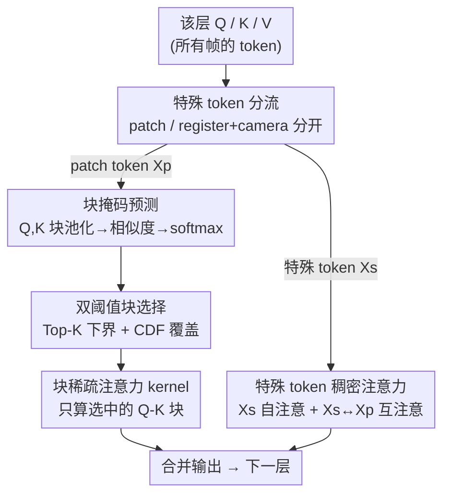

# Block-Sparse Global Attention for Efficient Multi-View Geometry Transformers

**会议**: CVPR 2026  
**论文**: [CVF Open Access](https://openaccess.thecvf.com/content/CVPR2026/html/Wang_Block-Sparse_Global_Attention_for_Efficient_Multi-View_Geometry_Transformers_CVPR_2026_paper.html)  
**代码**: 项目页 https://vision.rwth-aachen.de/sparse-vggt （未见公开代码仓库）  
**领域**: 3D视觉  
**关键词**: 多视图几何, 块稀疏注意力, 前馈重建, 推理加速, VGGT  

## 一句话总结
针对 VGGT / π³ / MapAnything 这类前馈多视图几何 Transformer，作者发现其全局注意力矩阵高度稀疏（概率质量集中在少数对应跨视图几何匹配的 patch 对上），于是用一个**免训练**的块稀疏注意力直接替换稠密全局注意力，推理加速 3×（长序列上更多），而重建/位姿精度基本不掉。

## 研究背景与动机
**领域现状**：从多张图像前馈重建 3D 几何与相机运动，是 SfM 的"学习版"。VGGT 用一个交替「帧内注意力 + 全局注意力」的 Aggregator，在单次前向里一次性对所有视图做场景级推理，在重建、点图、点跟踪上都达到 SOTA；π³ 在其上去掉相机 embedding 换来排列不变性，MapAnything 则换了一套支持可选几何输入的 Transformer。它们的共同骨架就是**全局注意力**。

**现有痛点**：全局注意力对 token 数是二次复杂度。多视图场景里 token 数 = 帧数 × 每帧 patch 数，随帧数线性增长，于是注意力开销随帧数**二次膨胀**。作者实测（图 1，H100 + FlashAttention2，分辨率 518²）：帧数一多，全局注意力很快就盖过 patch 化、帧内注意力和 FFN，成为绝对瓶颈，直接卡死了"喂更多图"的可扩展性。10 帧 294×518 的注意力矩阵就有 ~1.2×10⁸ 个元素（半精度 >100MB），1000 帧时要 >1TB。

**核心矛盾**：全局注意力既是 VGGT 拿场景级一致性的关键（要让远处视图互相对齐、消歧），又是它扩展不上去的根因——一致性 vs 算力的二次方 trade-off。

**切入角度**：作者去看了一眼 VGGT 中层（layer 15）的 post-softmax 注意力图（图 3、图 4），发现**绝大多数 entry 接近零，概率质量只集中在极少数 patch-patch 对上，而且这些高激活 entry 恰好对应几何上有意义的跨视图对应**——注意力图长得像传统 SfM 里 SIFT 的稀疏对应矩阵。换句话说，模型其实在用全局注意力做"穷举式对应搜索"，但真正用上的只有一小撮 token 对。

**核心 idea**：既然稠密注意力里 75%+ 都是浪费，那就**免训练地**预测一个块稀疏 mask，只算"重要的块"，把全局注意力换成块稀疏版本——成本随激活块数（而非全二次规模）增长，从而提速且不掉点。

## 方法详解

### 整体框架
方法不动 VGGT/π³/MapAnything 的 encoder 和任务头，只在 Aggregator 的**全局注意力层**里做替换。一层全局注意力的处理流程是：先把这一层的 Q、K 以块大小 $b$ 做平均池化得到低分辨率近似，用池化后的 Q/K 算块间相似度并 softmax，得到每个块的重要性分布；再用 **Top-K + CDF 双阈值**把分布转成二值块 mask；最后把这个 mask 喂给标准块稀疏注意力 kernel（实现上复用 SpargeAttention 的 kernel，但机制与之解耦），只计算被选中的 Q-K 块。一个关键工程点是：register / camera 这些**特殊 token 不走稀疏路径**，单独拿出来做稠密注意力。

整个替换是局部的、逐层的，下面这张图描述的是"一层稠密全局注意力如何被改成块稀疏全局注意力"：

### 关键设计

**1. 块掩码预测：用低分辨率注意力图近似稀疏结构**

痛点是：稀疏注意力的前提是"知道哪些块重要"，但精确算出 $QK^\top$ 再判断就失去了省算力的意义。作者的做法是**先降采样再判断**：对 Q、K 按块大小 $b$ 做平均池化得到 $P_b(Q)$、$P_b(K)$，在这个低分辨率上算块间相似度 $S = P_b(Q) P_b(K)^\top$，再 softmax 得到块的概率分布。这相当于花极小代价先看一张"缩略版注意力图"，从而对候选块做排序、决定真正要算哪些块。作者试过在池化后再加一层线性投影，但相比直接池化没有提升，所以保持极轻量——这也是它"免训练、不需要额外标注或反传"的关键：整个 mask 预测没有任何需要学习的参数。

标准稠密自注意力是

$$\text{Attention}(\mathbf{Q},\mathbf{K},\mathbf{V}) = \text{softmax}\!\left(\frac{\mathbf{Q}\mathbf{K}^\top}{\sqrt{d_h}}\right)\mathbf{V}$$

块稀疏版本则在 $QK^\top$ 上乘一个二值 mask $\mathbf{M}$：

$$\text{SparseAttn}(\mathbf{Q},\mathbf{K},\mathbf{V}) = \text{softmax}\!\left(\frac{(\mathbf{Q}\mathbf{K}^\top)\odot\mathbf{M}}{\sqrt{d_h}}\right)\mathbf{V}$$

其中 $\odot$ 是逐元素积。用**块**结构而非任意稀疏，是因为块状 mask 对现代加速器（FlashAttention 式的分块计算）友好，内存访问和并行都高效。

**2. Top-K + CDF 双阈值块选择：对不同稀疏度的层都稳**

只用单一阈值会出问题：纯 CDF 阈值 $\tau$ 保证选中的块至少覆盖 $\tau$ 比例的累计概率，但在"很均匀"的层里，达到这个覆盖可能要选很多块、省不下来；纯固定稀疏率 $\rho$ 又可能在某些层选太少、伤精度。作者让两者**互补**：CDF 阈值 $\tau$ 作为**覆盖下限**（保证选的块累计概率够），稀疏率 $\rho$ 作为**块数下界**——强制至少保留 $k = \lfloor B\cdot(1-\rho)\rfloor$ 个排名最高的块（$B$ 为总块数）。在均匀层里 CDF 把覆盖兜住，在稀疏层里稀疏率保证不会因为阈值瞬间满足就只留极少块。这是它在**高稀疏率（>75%）**下仍比只用 CDF 的 SpargeAttention 更稳的直接原因。这里"有效稀疏率"定义为：实际计算的注意力 entry 数 / 全部 entry 数；随帧数增大，稀疏率 $x$ 带来的理论加速逼近 $\frac{1}{1-x}$。

**3. 特殊 token 走稠密路径：register/camera 不能和 patch 一起池化**

VGGT 给每帧拼了 1 个 camera token + 4 个 register token，用来区分参考帧/辅助帧并承载相机信息。作者发现这些特殊 token 的注意力行为和普通 patch token **本质不同**（图 4 里 patch-patch 交互随层剧烈变化，而涉及特殊 token 的交互跨层稳定），把它们和 patch token 一起池化做稀疏会在同等稀疏率下显著掉点。于是把 token 切成两组：patch token $X_p$ 和特殊 token $X_s$（register + camera）。**只对 $X_p$ 预测并使用块稀疏 mask**，而 $X_s$ 的自注意力、以及 $X_s\leftrightarrow X_p$ 的交叉注意力全部保持稠密。消融显示（图 10）这一步是避免大幅掉点的必要条件——去掉"dense special"后高稀疏率下精度明显恶化。

> 与 SpargeAttention 的区别：作者复用了它的块稀疏 kernel，但**砍掉了**自相似度筛选、Hilbert 曲线重排、稀疏在线 softmax 这些机制，改用纯 Top-K + CDF 选块 + 特殊 token 稠密。这样 mask 预测与具体 kernel 解耦（kernel-agnostic），实现更简单、跨 GPU 代际更好维护。

### 损失函数 / 训练策略
**无训练**。整套方法是即插即用的推理期替换：不改 encoder、不改任务头、不需要任何反传或重新标注，直接把预训练好的 VGGT/π³/MapAnything 的全局注意力换成块稀疏版即可。唯一可调的是块选择超参（CDF 阈值 $\tau$、稀疏率 $\rho$、块大小 $b$）。

## 实验关键数据
在三个大重建模型 VGGT、π³、MapAnything 上加装本方法，覆盖相对位姿估计（Real Estate 10K、CO3Dv2、TUM、ScanNet）、点图估计（7Scenes、NRGBD、DTU、ETH3D）和场景级位姿（Tanks & Temples）。论文主结果以"稀疏度–性能"曲线（图 7）呈现，下表为对其趋势的归纳。

### 主实验：稀疏度 vs 精度 / 加速

| 任务 / 数据集 | 指标 | 现象（随有效稀疏率↑） |
|--------------|------|----------------------|
| 相对位姿 (CO3Dv2, RealEstate10K) | AUC@30 ↑ | 位姿精度随稀疏率连续小幅下降，但即使高稀疏率仍与 Fast3r/CUT3R/FLARE 等 SOTA 相当 |
| 位姿 (TUM, ScanNet) | ATE ↓ | 高稀疏率下保持可接受水平 |
| 点图 (7Scenes, NRGBD, DTU) | Chamfer dist. ↓ | 退化很小；ETH3D 上的"反而变好"作者归因于随机性，不预期稀疏模型超过 baseline |
| 长序列 (Tanks & Temples, 200 帧) | AUC@30 ↑ | 75% 有效稀疏率下退化极小 |
| 端到端速度 (长序列, H100) | wall-clock | >3× 加速；200 帧 π³ + 75% 稀疏 ≈ baseline 两倍速，序列越长加速越大 |

### 消融实验（图 10）

| 配置 | 关键现象 | 说明 |
|------|---------|------|
| Ours (Top-K + CDF + dense special) | 高稀疏率下最稳 | 完整方法 |
| Ours w/o Dense Special | 高稀疏率明显掉点 | 特殊 token 一起稀疏化 → 验证设计 3 必要 |
| CDF only | 稀疏率升高后比 Ours 掉得快 | 缺 Top-K 下界，等同 SpargeAttention 主机制 |
| SpargeAttn / w/ high sim thr. | 低稀疏率与 Ours 接近，高稀疏率落后 | 自相似度筛选在大稀疏率下不够稳 |
| Random / Random w/ dense special | 稀疏率一升就崩 | 证明稀疏结构必须"选对块"，不是随便丢 |

层重要性分析（图 5，layer-drop）：跳过 Aggregator 的早层/末层模型相当鲁棒，但**跳掉中间单层会显著掉点**——印证"中层集中了跨视图信息交换"，也解释了为何要做自适应（中层稀疏度高、激活强，是省算力的主战场）。

### 关键发现
- **稀疏来自几何对应，不是随机**：高激活 entry 与跨帧几何对应吻合，相当于学出来的"穷举对应搜索"——这是方法成立的物理依据，也是 Random baseline 崩掉的反证。
- **中层最关键**：max 激活在 Aggregator 中部达峰、且主要由 patch-patch 交互贡献；特殊 token 交互跨层稳定，所以才把两类 token 分开处理。
- **加速随规模放大**：因全局注意力占比随帧数/分辨率上升，稀疏带来的端到端收益在长序列、高分辨率下越发可观（分辨率翻倍 → patch 数 4× → 全局注意力算力 16×）。
- **泛化性**：同一机制无缝套到架构不同的 MapAnything 上，三模型呈现相似的精度–效率折中，说明这是"全局跨视图注意力"的通用性质而非 VGGT 特例。

## 亮点与洞察
- **把 LLM 的稀疏注意力迁到视觉几何**：LLM 稀疏注意力多依赖因果掩码 / KV-cache / 时空连续性，这些在多视图连续 2D token 网格上都不成立；作者绕开这些假设，靠"注意力图≈几何对应矩阵"这个领域观察找到稀疏来源，迁移得很干净。
- **免训练即插即用**：不碰权重、不反传、不加标注，直接换层就 3× 提速——对已部署的大重建模型是几乎零成本的加速路径，可复用性极强。
- **"双阈值"是简单但关键的稳态设计**：Top-K 兜下界 + CDF 兜覆盖，用两个互补约束适配不同层的稀疏分布，比单阈值在极端稀疏率下稳得多，思路可迁移到任何"自适应选块/选 token"的稀疏化场景。
- **特殊 token 分流**这个细节很实用：提醒人们 register/camera 这类承载全局信息的 token 不能和内容 token 同等稀疏化，否则会伤场景级一致性。

## 局限与展望
- 作者明确：不预期稀疏模型**超过** baseline，ETH3D 上的提升归因于随机性——这是加速方法，不是涨点方法。
- 端到端加速依赖"全局注意力占比"，帧数少 / 分辨率低时全局注意力本就不是瓶颈，收益有限；真正的甜区是大图集 / 高分辨率长序列。
- ⚠️ 报告的 >3× 主要在长序列 / 大规模场景；不同任务、不同稀疏率下的精度–速度折中不能直接横向比大小（图 7 各子图量纲/难度不同）。
- 块大小 $b$、$\tau$、$\rho$ 是需要按模型/场景调的超参，论文正文未给系统的敏感性分析（放在附录），实际部署仍需调参。
- 展望：块稀疏与 FlashAttention 正交，可叠加；也可把稀疏注意力**放进训练**进一步减小精度损失；并可用于加速高分辨率输入（瓶颈更严重）。

## 相关工作与启发
- **vs SpargeAttention [49]**: 同属块稀疏范式且复用其 kernel，但作者砍掉自相似度筛选、Hilbert 重排、稀疏在线 softmax，改用 Top-K+CDF 选块 + 特殊 token 稠密。优势是 kernel-agnostic、实现简单、跨硬件好维护，且在 >75% 稀疏率下更稳；代价是少了一些可能进一步压缩的机制。
- **vs SeerAttention [15] / PixelatedButterfly [5]**: 它们靠学习的门控 / 静态模式 + 可学习参数，**需要优化训练**；本方法完全免训练，零额外参数。
- **vs 两视图 + 全局对齐 (DUSt3R/MASt3R 系) [24,43]**: 那条线把多视图拆成图像对再做全局对齐后处理，开销大且引入额外误差源；VGGT/π³ 走"一次性全局注意力"路线，本文则让这条路线在大图集上也跑得起来。
- **vs 增量式迭代重建 (Light3r-SfM/CUT3R) [13,40,42]**: 迭代式对输入顺序敏感、易累积漂移；全局注意力模型能在单次前向里整体对齐远处视图，本文保住了这一优点同时去掉了它的二次开销负担。

## 评分
- 新颖性: ⭐⭐⭐⭐ 把"注意力图≈几何对应矩阵"的领域观察转成免训练块稀疏加速，迁移角度新颖，但块稀疏 kernel 本身借自 SpargeAttention。
- 实验充分度: ⭐⭐⭐⭐ 三模型 × 多任务 × 多数据集 + 长序列 + 充分消融，覆盖很广；正文以曲线为主、精确数值表放附录。
- 写作质量: ⭐⭐⭐⭐⭐ 从注意力可视化 → 层重要性分析 → 方法 → 实验的论证链条清晰，动机扎实。
- 价值: ⭐⭐⭐⭐ 对前馈多视图几何模型的可扩展性是直接、零训练成本的加速方案，实用价值高。

<!-- RELATED:START -->

## 相关论文

- [\[CVPR 2026\] FlashVGGT: Efficient and Scalable Visual Geometry Transformers with Compressed Descriptor Attention](flashvggt_efficient_and_scalable_visual_geometry_transformers_with_compressed_descr.md)
- [\[CVPR 2026\] Any Resolution Any Geometry: From Multi-View To Multi-Patch](any_resolution_any_geometry_from_multi-view_to_multi-patch.md)
- [\[CVPR 2026\] Uni3R: Unified 3D Reconstruction and Semantic Understanding via Generalizable Gaussian Splatting from Unposed Multi-View Images](uni3r_unified_3d_reconstruction_and_semantic_understanding_via_generalizable_gau.md)
- [\[CVPR 2026\] CaliTex: Geometry-Calibrated Attention for View-Coherent 3D Texture Generation](calitex_geometry-calibrated_attention_for_view-coherent_3d_texture_generation.md)
- [\[CVPR 2026\] Scaling View Synthesis Transformers (SVSM)](scaling_view_synthesis_transformers.md)

<!-- RELATED:END -->
