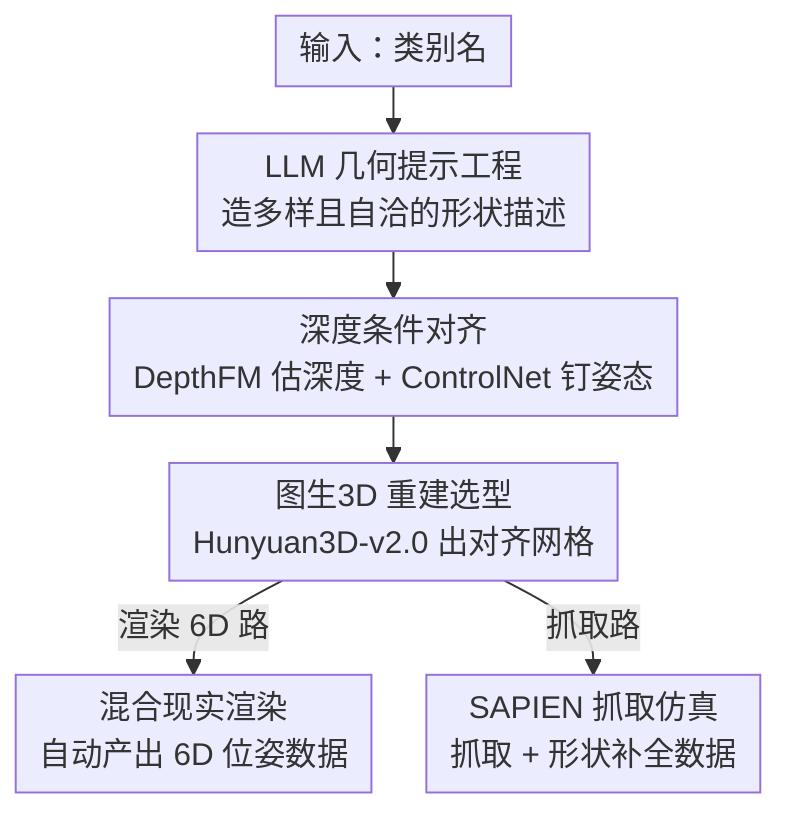

# Breaking the 3D Dataset Bottleneck: Fast Scalable Generation of Aligned 3D Assets from Scratch for Category 6D Pose Estimation and Robotic Grasping

**会议**: CVPR 2026  
**论文**: [CVF Open Access](https://openaccess.thecvf.com/content/CVPR2026/html/Guillaume_Breaking_the_3D_Dataset_Bottleneck_Fast_Scalable_Generation_of_Aligned_CVPR_2026_paper.html)  
**代码**: https://genomni3d.github.io/  
**领域**: 3D视觉  
**关键词**: 3D资产生成, 6D位姿估计, 规范对齐, 深度条件生成, 机器人抓取  

## 一句话总结
只给一个类别名，就能用「文本→图像→3D」的全自动流水线在 3 分钟内造出一个规范对齐的纹理网格，并配套生成 6D 位姿与抓取数据集——核心靠深度条件生成把姿态一致率从 57% 拉到 96%，让生成的 153K 网格直接可用于零样本 sim2real 位姿估计和真机抓取。

## 研究背景与动机
**领域现状**：2D 视觉靠 ImageNet 这类大规模数据集起飞，但 3D 视觉一直被「高质量、规范对齐的标注数据稀缺」卡着脖子。类别级 6D 位姿估计（不依赖实例模型、直接从单张 RGB-D 预测物体的位置和朝向）是这个困境的典型代表：它既需要海量类内形状/纹理变化，又要求所有实例在同一个规范坐标系下对齐。

**现有痛点**：造这种数据集有三道坎。① **资产采集**：靠人工 3D 扫描（每个物体 15–60 分钟）或现成仓库——合成数据集不真实、高质量扫描数据集规模太小、互联网仓库（Objaverse 等）网格质量参差、对齐差、类别覆盖稀疏（比如 Objaverse1.0 里只有 127 个杯子）。② **网格对齐**：跨实例的规范对齐要大量人工，根本没法规模化，导致方法只能退而求其次去做跨类别迁移，而非每个类别的强学习。③ **位姿标注**：真实世界 6D 标注要预扫描资产加迭代优化（如 ICP），容易出错、难以跨类别跨场景扩展。

**核心矛盾**：现有的「先有 3D 资产、再标注」范式里，规模、对齐质量、真实感三者无法同时满足——要规模就丢对齐（Objaverse），要对齐就丢规模（扫描数据集），而最相关的生成式做法（GenVegeFruits3D）只能处理对称的果蔬，回避了任意形状的姿态难题，且姿态一致率只有 57%。

**本文目标**：完全绕过「需要已有 3D 资产」这件事，从纯文本类别描述出发，端到端地生成 ①规范对齐的 3D 网格、②类别级 6D 位姿数据集、③机器人抓取数据集。

**切入角度**：作者观察到，图生3D 模型生成网格的朝向几乎完全由输入图像的视角决定。于是「让 3D 对齐」这个难题就被转化成「让 2D 生成阶段的物体姿态保持一致」——而后者可以用深度图作为强条件信号来钉死。

**核心 idea**：用「深度条件的可控文生图」把规范对齐内建进生成过程（depth-conditioned generation），再接图生3D 重建和混合现实渲染，把整条「类别名 → 对齐网格 → 6D/抓取数据」的链路全自动化。

## 方法详解

### 整体框架
整篇方法可以拆成两大段：前半段（论文第 3 节）是**资产生成**——从一个类别名造出一批规范对齐的纹理网格；后半段（第 4–5 节）是**数据集合成**——把这些网格喂进渲染器和机器人仿真器，自动产出带完整标注的 6D 位姿数据和抓取数据。

资产生成本身是一条四阶段的串行流水线：LLM 写几何提示 → 扩散模型生成图像并估计深度 → 用深度图做条件、批量生成纹理变体 → 图生3D 重建出对齐网格。其中真正解决「对齐」这个核心痛点的是第二、三阶段的**深度条件生成**：先用 DepthFM 从少量筛选过的图像估计深度图，再用 ControlNet 把这张深度图当条件去驱动后续所有纹理变体的生成，从而保证同一类别下所有图像的物体姿态高度一致，进而保证重建出的网格在同一规范坐标系下对齐。整条流水线每个物体 3 分钟、比扫描快 5–20×，每个类别只需约 100 张深度图就能扩展出 1000 个对齐网格，人工筛选量比前作降低 15× 以上。

拿到对齐网格后，作者把它们分别接进两条下游：BlenderProc 的**混合现实渲染**生成 6D 位姿数据集（RGB-D、实例/语义掩码、NOCS 图、6D 位姿），SAPIEN 仿真器生成抓取数据集。

### 关键设计

**1. LLM 几何提示工程：让一个类别名长出多样又自洽的形状**

痛点是：如果只用一句模板化的文本提示去喂扩散模型，生成的图像要么形状千篇一律、缺乏类内多样性，要么跑偏成不像这个类别的东西。作者让大语言模型针对每个类别生成「带随机化形状描述」的提示词——同一个「mug」会被展开成各种把手形状、口径、高矮的具体描述，从而在源头注入类内形状多样性。关键是 LLM 还会对生成的提示做**自我校验**（self-verification），检查描述的真实感和类别一致性，过滤掉不合理或离题的描述。这一步只负责「形状内容」，不管姿态，姿态交给下一步。

**2. 深度条件对齐：把规范对齐"焊死"在 2D 生成阶段**

这是全文的题眼，直接针对「跨实例规范对齐要海量人工」这道坎。作者先指出问题根源：图生3D 模型生成网格的朝向由输入图像视角决定，所以对齐难题等价于「让 2D 生成的姿态一致」。而纯文本条件生成做不到——实验显示文本条件对对称物体（瓶、碗）只有约 80% 姿态一致，对相机、笔记本这类复杂非对称物体骤降到低至 20%，逼得你要生成 5000+ 张图才能挑出 1000 张可用的。根因有两点：扩散模型在文生图时缺乏对 3D 结构的显式理解；自然语言对姿态的描述本身就是模糊的。

作者的解法是：先用 DepthFM 从一小批人工筛选过（每类 <10 分钟）、姿态正确的图像里估计出深度图，再把这张深度图作为 ControlNet 的条件信号，去驱动后续所有纹理变体的生成。深度图的妙处在于它「只约束全局结构和空间朝向、不约束局部几何与纹理细节」——既钉死了姿态，又放开了形状/纹理的多样性。形式化地，把姿态一致率定义为「生成图像中物体姿态落在规范朝向的比例」，深度条件把 NOCS 6 类的平均姿态一致率从纯文本的 57% 拉到 97%，在 Omni6Dpose 的 153 个类别上达到 96%，证明这套对齐是类别无关的。作者也试过 Canny 边缘做条件，但边缘会因为缺失/多余而引入伪影、还保留了无关纹理细节，效果不如深度图。

**3. 图生3D 重建选型：用 Hunyuan3D-v2.0 免去人工筛网格**

有了姿态一致的图像，还要选一个靠谱的图生3D 模型把它变成网格。作者按三条标准（生成速度 <1 分钟、质量适合机器人抓取、跨类别可靠）横评了 FS3D、SPAR3D、InstantMesh、Hunyuan3D-v2.0 四个方法。结论是：FS3D/SPAR3D 最快（<10s）但质量不稳，对杯子这类凹面物体尤其差；InstantMesh 质量更好（<1min）但搞不定抓取关键的非凸几何；Hunyuan3D-v2.0 整体质量最好、在大规模生成中最可靠，能直接省掉人工筛网格这一步。这里有个细节值得注意：包括 Hunyuan3D 在内的现代图生3D 模型自带的「规范对齐」其实只能保证 90° 的旋转对齐，对类别级精对齐远远不够——这恰恰反证了设计 2 的深度条件在图像层面控姿是必要的。

**4. 混合现实渲染：让 6D 标注随渲染自动生成**

最后一道坎是位姿标注——真实标注靠预扫描加 ICP 迭代，又慢又易错。作者把对齐网格接进 BlenderProc，复现并开源了两条渲染管线：一条是 Omni6D 式的**全 3D 仿真**（把扫描的真实场景整体载入、随机摆放物体、采 10 个视角、5 个随机光源）；另一条是 Omni6Dpose 式的**混合现实渲染**——在 BlenderProc 里对齐相机视角到背景图，用多视角射线投射按真实平面摆物体并施加重力保证姿态物理合理，再用「把场景渲染成不可见但保留物体投下的阴影」的技巧，把只含物体+阴影的渲染图叠加到真实背景与真实深度上，最后还用部分合成深度去补全真实深度传感器在暗色物体上的缺失。因为物体姿态在渲染时已知，RGB-D、实例/语义掩码、NOCS 图、6D 位姿这些标注全是自动产出的，无需任何人工标注。实验证明混合现实+阴影是缩小 sim2real 差距的关键。

### 一个完整示例
以「mug（杯子）」为例走一遍：① LLM 生成上百条带随机把手/口径/高矮描述的提示并自校验；② 扩散模型出一批图，人工筛 <10 分钟挑出姿态正确的，DepthFM 对选中图估深度；③ 每张深度图配 ControlNet 再加 LLM 纹理提示，生成 10 个纹理变体——100 张深度图就扩成 1000 张姿态一致、纹理多样的图；④ Hunyuan3D-v2.0 把每张图重建成网格，得到 1000 个规范对齐的 mug 网格；⑤ 这些网格进 BlenderProc 混合现实渲染出带 6D 标注的图像，或进 SAPIEN 做 V-HACD 凸分解后用于抓取仿真。整条链全自动，单物体 3 分钟，整个 NOCS3D 数据集只花约 2 小时人工。

## 实验关键数据

### 数据集规模对比
| 3D 数据集 | 类型 | #物体 | #类别 | #物体/类 | 对齐 | 单物体耗时 |
|-----------|------|-------|-------|----------|------|------------|
| OmniObject3D | 真实扫描 | 6K | 190 | 32 | 是 | 15m–1h |
| Objaverse1.0 | 真实+合成 | 800K | – | 100 | 否 | – |
| GenVegeFruits3D | 生成 | 100K | 100 | 1000 | 是 | 15min |
| **GenOmni3D（本文）** | 生成 | **153K** | **153** | **1000** | 是 | **3min** |

GenOmni3D 同时拿到「大规模 + 内建对齐 + 高质量 + 快」，单类实例数比此前对齐真实数据集多 >40×。

### NOCS REAL275 零样本 sim2real 位姿估计（DualPoseNet 基线）
| 训练数据 | IoU75 | 10°5cm | Avg |
|----------|-------|--------|-----|
| Replica 全合成 | 34.33 | 17.12 | 33.10 |
| Mix-syn（原 NOCS 网格 + 阴影） | 31.50 | 17.81 | 33.24 |
| **Mix-SAI（本文网格 + 阴影）** | **35.42** | **22.19** | **34.75** |
| Mix-SAI（无阴影） | 28.86 | 14.13 | 30.83 |

三组对照分别验证：混合现实 > 全合成（34.75 vs 33.10）、本文网格 > 原 NOCS 网格（合成验证集 23.91 vs 15.66）、有阴影 > 无阴影（30.83→34.75）。完全不用真实训练数据，就能逼近用真实数据训练的水平。

### 抓取与形状补全（SAPIEN，CenterGrasp 框架）
| 方法 | 抓取成功率 ↑ | 双向误差 bi ↓ | IoU ↑ |
|------|-------------|--------------|-------|
| GIGA | 0.638 | 55.2 | 0.146 |
| CenterGrasp | 0.790 | 27.0 | 0.314 |
| **Custom-CG（本文，原生纹理）** | **0.868** | **23.5** | **0.475** |

本文最佳模型抓取成功率 87.8%，形状补全 IoU 0.475，远超 CenterGrasp（0.314）和 GIGA（0.146）。

### 关键发现
- **深度条件是对齐的命门**：姿态一致率从纯文本 57% → 96%，且对相机（30%→97%）、笔记本（20%→90%）这类非对称难物体提升最大——文本条件正是在这些类别上崩。
- **阴影对 sim2real 至关重要**：对本文网格和原 NOCS 网格，开阴影都稳定显著优于关阴影，说明建模真实光照现象是缩小 sim2real 差距的必要项。
- **对齐网格是抓取成功的前提**：真机实验里笔记本（Laptop）在基线下检测/抓取成功率均为 0%，换成本文专门化数据后冲到 100%，作者据此论证规范对齐的网格对机器人操作不可或缺。

## 亮点与洞察
- **把「3D 对齐」问题降维成「2D 姿态一致」问题**：抓住了「图生3D 网格朝向由输入图视角决定」这条因果链，从而能用成熟的 ControlNet + 深度条件去解决一个原本要海量人工的 3D 难题——这是最漂亮的一步。
- **深度图作为条件的取舍恰到好处**：它强约束全局朝向、弱约束局部几何，正好满足「姿态要齐、形状要多样」这对看似矛盾的需求；对比 Canny 的失败反衬出条件信号选择的重要性。
- **完整生态而非单点**：不止生成网格，还顺手把 6D 标注（混合现实渲染自动出标注）和抓取（SAPIEN + V-HACD 凸分解）两条下游打通并开源，data scarcity 被「从头无限生成」整体解决。
- **可迁移思路**：「用某个强条件信号在 2D 生成阶段钉死某个 3D 属性」这套路子可以推广——比如想要尺度一致、关节一致，或许也能找到对应的条件图来在生成时约束。

## 局限与展望
- **依赖少量人工筛选**：每类仍需 <10 分钟人工挑出姿态正确的种子图，并非完全无人；种子图选偏会把错误姿态传播到 1000 个变体。
- **质量受限于现成模型**：姿态一致率（DepthFM 深度质量、ControlNet 条件强度）和网格质量（Hunyuan3D-v2.0）都被上游开源模型的能力天花板锁住，对极复杂或高度自遮挡的类别可能仍吃力。⚠️ 论文未给出按类别细分的失败案例统计。
- **抓取仿真规模受限**：因计算开销，抓取数据集每类只做到 100 个物体（共 600 网格），远小于位姿数据集的 1000/类。
- **改进思路**：把种子图筛选也交给一个姿态判别器实现全自动；或引入多视角一致性约束进一步提升非对称物体的对齐上限。

## 相关工作与启发
- **vs GenVegeFruits3D**：同样是「生成式造 3D 资产」，但前者只能处理对称果蔬、回避任意形状的姿态难题，CPU 纹理管线开销大，姿态一致率 57%；本文用深度条件把任意非对称类别的对齐做到 96%，单物体 3min（前者 15min），人工筛选量降 15×。
- **vs Objaverse / ObjaverseXL**：互联网大规模仓库胜在数量（800K–10.2M），但网格质量参差、对齐差、类别覆盖稀疏；本文以「按需从头生成」换来内建对齐和稠密的单类实例数（1000/类）。
- **vs Omni6D / Omni6Dpose**：这两个 6D 基准依赖 OmniObject3D 扫描资产，实例多样性受限、且渲染管线闭源不可复现；本文不依赖预扫描资产，并开源了两条渲染管线，可无限生成任意类别。

## 评分
- 新颖性: ⭐⭐⭐⭐⭐ 把 3D 规范对齐难题转化为 2D 深度条件控姿，first automated text-to-aligned-3D 框架。
- 实验充分度: ⭐⭐⭐⭐ 覆盖数据规模、sim2real 位姿、抓取、真机四条线，但失败案例与类别级误差分析略少。
- 写作质量: ⭐⭐⭐⭐ 三道坎→四阶段流水线→两条下游的结构清晰，表格信息密度高。
- 价值: ⭐⭐⭐⭐⭐ 开源最大对齐网格/6D 数据集 + 完整管线，直接缓解 3D 数据稀缺，对 3D 基础模型有基建意义。

<!-- RELATED:START -->

## 相关论文

- [\[CVPR 2026\] Exploring 6D Object Pose Estimation with Deformation](exploring_6d_object_pose_estimation_with_deformation.md)
- [\[CVPR 2026\] SE(3)-Equivariance with Geometric and Topological Guidance for Category-Level Object Pose Estimation](se3-equivariance_with_geometric_and_topological_guidance_for_category-level_obje.md)
- [\[CVPR 2026\] SCAPO: Self-Supervised Category-Level Articulated Pose Estimation from a Single 3D Observation](scapo_self-supervised_category-level_articulated_pose_estimation_from_a_single_3.md)
- [\[ECCV 2024\] Omni6D: Large-Vocabulary 3D Object Dataset for Category-Level 6D Object Pose Estimation](../../ECCV2024/3d_vision/omni6d_large-vocabulary_3d_object_dataset_for_category-level_6d_object_pose_esti.md)
- [\[CVPR 2026\] DICArt: Advancing Category-level Articulated Object Pose Estimation in Discrete State-Spaces](dicart_advancing_category-level_articulated_object_pose_estimation_in_discrete_s.md)

<!-- RELATED:END -->
