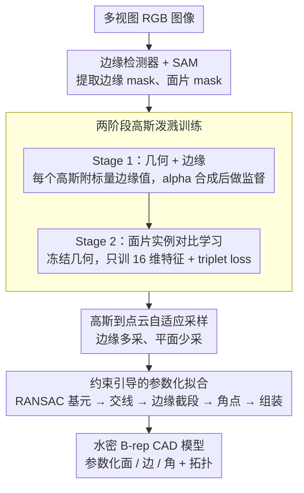

# BRepGaussian: CAD Reconstruction from Multi-View Images with Gaussian Splatting

**会议**: CVPR 2026  
**arXiv**: [2602.21105](https://arxiv.org/abs/2602.21105)  
**代码**: 即将开源 (待接收后发布)  
**领域**: 3D视觉  
**关键词**: CAD重建, B-rep, 高斯泼溅, 参数化表面拟合, 对比学习

## 一句话总结

BRepGaussian 首次实现了从多视图图像直接重建完整 B-rep CAD 模型，通过两阶段的 2D 高斯泼溅学习边缘和面片特征，再经参数化拟合生成水密的边界表示，无需点云监督。

## 研究背景与动机

**领域现状**：CAD 重建（逆向工程）是计算机视觉和图形学的经典问题。传统方法主要以高质量点云为输入，先做语义分割获取面片标签，再拟合参数化基元。学习 based 方法如 SPFN、ParSeNet 等已取得较好效果。

**现有痛点**：高质量点云的获取成本高昂，依赖专业设备；现有方法需要大量人工标注；且对新形状的泛化能力有限，严重依赖数据集特定的网络设计。

**核心矛盾**：图像数据远比点云更容易获取和扩展，但从图像到参数化 3D 建模之间存在巨大鸿沟——现有方法都跳不过"先获取高质量点云"这一步骤。

**本文目标**：如何直接从多视图 RGB 图像恢复出包含拓扑关系的完整 B-rep 表示（参数化的面、边、角点以及它们的拓扑连接）？

**切入角度**：利用 2D 高斯泼溅（2DGS）作为中间表示——它的扁平盘状基元天然契合 CAD 模型中的平面/低曲率表面，且每个高斯可携带可学习的语义特征。

**核心idea**：将 2DGS 扩展为边缘+面片感知的表示，通过两阶段训练分离几何/边缘学习与面片实例学习，再从带标签点云做参数化拟合得到 B-rep 模型。

## 方法详解

### 整体框架

输入为 CAD 物体的多视图 RGB 图像。整个 Pipeline 分四步：(1) 用边缘检测器和 SAM 从 2D 图像提取边缘 mask 和面片 mask；(2) 两阶段 2DGS 训练——先学几何+边缘特征，再学面片实例特征；(3) 将高斯基元转化为带标签的密集点云；(4) 约束引导的参数化拟合模块，将点云组装为水密 B-rep 模型。输出为包含参数化面（平面/圆柱/球面）、边（直线/曲线）和角点的完整 B-rep CAD 模型。

### 关键设计

**1. 两阶段高斯泼溅训练：把几何重建和面片识别拆开学，互不干扰**

最朴素的想法是让一个网络同时学好几何、边缘和面片标签，但作者发现这样做时面片对比学习产生的复杂梯度会反过来破坏几何重建质量。于是把训练切成两段。Stage 1 只管几何和边缘：每个 2DGS 高斯除了常规属性外，再附加一个标量边缘值 $e_i \in [0,1]$，渲染时和颜色一样走 alpha 合成得到边缘图 $E(u) = \sum_i w_i e_i$，用 2D 边缘检测器的结果做 L2 监督，让高斯学会哪里是 CAD 模型的棱边。Stage 2 则把位置 xyz、球谐系数等所有几何参数全部冻结，只为每个高斯新训一个 16 维特征向量 $\mathbf{f}_i \in \mathbb{R}^{16}$ 来编码面片归属。这样每个阶段只盯一个目标，几何先稳下来，面片再在固定几何上叠语义，实验证明比联合训练稳定得多。

**2. 面片实例的对比学习：在没有跨视角对应关系的前提下，把同一个面片的高斯聚到一起**

难点在于面片是实例级标签而非语义类别——不同视角下 SAM 切出的 mask 各自独立编号，第 1 视角的"3 号面"和第 2 视角的"3 号面"根本不是同一块，无法直接建立一一对应。作者转而在特征空间用对比学习自动完成聚类。具体用 triplet loss：在每个 mask 区域 $\mathcal{M}_k$ 内采一个 anchor $\mathbf{p}_a$ 和一个正样本 $\mathbf{p}_p$，再到其他 mask 里挑特征距离最近、最容易混淆的像素作最难负样本 $\mathbf{p}_n$。距离用余弦形式 $d(\mathbf{p}_i, \mathbf{p}_j) = 1 - \tilde{\mathbf{f}}_{\mathbf{p}_i} \cdot \tilde{\mathbf{f}}_{\mathbf{p}_j}$ 度量，损失为

$$\mathcal{L}_{\text{tri}} = \max\big(0,\; d(\mathbf{p}_a, \mathbf{p}_p) - d(\mathbf{p}_a, \mathbf{p}_n) + m\big).$$

它逼着同一面片的特征靠拢、不同面片的特征推开，于是即使各视角 mask 编号毫无关联，三维空间里属于同一物理面片的高斯也会在特征上自然汇成一簇。

**3. 高斯到点云的自适应采样：让采样密度跟着几何走，边缘多采、平面少采**

训练完的高斯要先转成带边缘/面片标签的密集点云，才能喂给后续拟合。若只取每个高斯的中心点，问题出在边缘——棱边附近往往是大量细长椭圆高斯，平坦区则是少量近球形高斯，一律只取中心会让边缘区域严重欠采样，拖累拟合精度。作者的做法是按高斯形状自适应：每个高斯都取中心点，对那些长短轴比不极端的椭圆高斯，再额外沿椭圆边缘补采 4 个点。这样点的疏密就和真实表面的曲率分布对齐，棱边处有足够密的点支撑参数化拟合。

**4. 约束引导的参数化拟合：把带标签点云自底向上组装成水密 B-rep**

有了带面片/边缘标签的点云后，这一步负责把它变成真正的参数化 CAD 模型，分五步走。先对每个面片分别用 RANSAC 拟合平面、圆柱、球面三种基元、选最优；接着两两计算基元之间的交线或交曲线；再用边缘点云去约束这些交线/曲线的有效参数范围，截出真正存在的线段而非无限延伸的整条交线；然后把三平面或两线的交点聚类定出角点；最后自底向上（面→边→角）组装，用布尔运算清理成水密的 B-rep。整个流程的关键在于它充分吃进了前面高斯训练得到的面片和边缘标签——边缘标签决定线段范围、面片标签决定基元归属，分层提取才得以成立。

### 损失函数 / 训练策略

- **Stage 1**: $\mathcal{L}_{\text{stage1}} = \mathcal{L}_{\text{geo}} + 0.1 \mathcal{L}_{\text{edge}}$，其中 $\mathcal{L}_{\text{geo}} = (1-\lambda)\mathcal{L}_1 + \lambda\mathcal{L}_{\text{D-SSIM}}$
- **Stage 2**: triplet loss $\mathcal{L}_{\text{tri}}$ 使用硬负样本挖掘和 margin 超参数 $m$

## 实验关键数据

### 主实验

在 ABC-NEF 数据集上评估面片分割（Precision/Recall/F1）：

| 方法 | 输入 | Prec ↑ | Rec ↑ | F1 ↑ |
|------|------|--------|-------|------|
| ParSeNet | GT点云 | 0.511 | 0.265 | 0.349 |
| PCER-Net | GT点云 | 0.876 | 0.912 | 0.894 |
| SED-Net | GT点云 | 0.949 | 1.000 | 0.974 |
| ParSeNet | 稠密化点云 | 0.623 | 0.236 | 0.343 |
| PCER-Net | 稠密化点云 | 0.536 | 0.792 | 0.639 |
| **BRepGaussian** | **多视图图像** | **0.890** | **0.918** | **0.904** |

CAD 重建质量对比（$D_c$: Chamfer Distance $\times 10^{-2}$, $D_h$: Hausdorff Distance $\times 10^{-1}$）：

| 方法 | 输入 | CD(Surface) | CD(Curve) | HD(Surface) | HD(Curve) |
|------|------|-------------|-----------|-------------|-----------|
| Point2CAD | 本文标签 | 3.38 | 5.42 | 2.413 | 3.858 |
| Point2CAD | PCER-Net | 7.08 | 20.45 | 3.394 | 7.276 |
| Split-and-Fit | 稠密化 | 6.23 | 13.98 | 3.523 | 4.962 |
| **BRepGaussian** | **本文点云** | 4.90 | **5.01** | **3.351** | **3.626** |

### 消融实验

| 配置 | 效果 | 说明 |
|------|------|------|
| 两阶段训练 | 最优 | 几何不被面片学习破坏 |
| 单阶段联合训练 | 下降 | 面片梯度干扰几何重建 |
| 特征维度 d=16 | 最优 | 面片实例的最佳特征空间大小 |
| 仅中心采样 | 下降 | 边缘区域欠采样 |
| 椭圆自适应采样 | 最优 | 边缘覆盖充分 |

### 关键发现

- BRepGaussian 从图像出发的面片分割 F1 (0.904) 超过了 PCER-Net 使用 GT 点云的结果 (0.894)，说明通过对比学习从多视图学到的特征比直接在点云上的分割更有效。
- 曲线重建指标整体最优（CD=5.01, HD=3.626），边缘检测为后续参数化拟合提供了决定性引导。
- Point2CAD 使用本文标签时表面 CD 略低（3.38 vs 4.90），但定性分析显示其产生了冗余面片，实际重建质量反而不如 BRepGaussian 的紧凑结果。

## 亮点与洞察

- **首个从图像到 B-rep 的端到端框架**：完全跳过了点云获取环节，将高斯泼溅的优势延伸到结构化 3D 建模任务。这个范式转换证明了 GS 不仅能做渲染，还能做工程级别的参数化重建。
- **冻结几何+只训特征的两阶段策略**：简单但有效地解耦了几何和语义学习，避免了多任务训练中的梯度冲突。这个思路可以迁移到任何需要在已有几何上叠加语义的 GS 任务。
- **2DGS 的选择精妙**：扁平盘状基元与 CAD 模型的平面/低曲率表面天然对齐，表面采样质量远优于 3DGS。

## 局限与展望

- 仅支持平面、圆柱、球面三种基元类型，无法处理 B-spline/NURBS 等自由曲面
- SAM 在低纹理 CAD 图像上的 mask 质量不高，需要人工修正（~3分钟/物体），自动化程度待提升
- 仅在 ABC-NEF 子集上评估，未验证对真实拍摄 CAD 零件的泛化能力
- 基元拟合采用传统 RANSAC，可探索可微分拟合方法实现端到端优化

## 相关工作与启发

- **vs Point2CAD**: 纯拟合方法，依赖外部标签。用本文标签后 Surface CD 最低但产生冗余面片，BRepGaussian 的约束引导拟合产出更干净的结果。
- **vs SED-Net**: 使用 GT 点云达到最高 F1 (0.974)，但无法泛化到从图像重建的稠密化点云。BRepGaussian 从图像出发，泛化性更强。
- **vs Curve-Aware GS**: 该工作只恢复参数化曲线，BRepGaussian 进一步恢复了完整的面+边+角+拓扑结构。

## 评分

- 新颖性: ⭐⭐⭐⭐⭐ 首个从图像到 B-rep 的完整管线，开创性工作
- 实验充分度: ⭐⭐⭐⭐ ABC-NEF 上对比充分，但缺少真实场景验证
- 写作质量: ⭐⭐⭐⭐ 结构清晰，pipeline 图直观
- 价值: ⭐⭐⭐⭐⭐ 为 CAD 逆向工程开辟了从图像出发的新范式

<!-- RELATED:START -->

## 相关论文

- [\[CVPR 2025\] CADDreamer: CAD Object Generation from Single-view Images](../../CVPR2025/3d_vision/caddreamer_cad_object_generation_from_single-view_images.md)
- [\[CVPR 2026\] UniSplat: Learning 3D Representations for Spatial Intelligence from Unposed Multi-View Images](unisplat_3d_representations_unposed.md)
- [\[CVPR 2026\] Coherent Human-Scene Reconstruction from Multi-Person Multi-View Video in a Single Pass](coherent_humanscene_reconstruction_from_multiperso.md)
- [\[CVPR 2026\] MV-RoMa: From Pairwise Matching into Multi-View Track Reconstruction](mv-roma_from_pairwise_matching_into_multi-view_track_reconstruction.md)
- [\[ECCV 2024\] MVSplat: Efficient 3D Gaussian Splatting from Sparse Multi-View Images](../../ECCV2024/3d_vision/mvsplat_efficient_3d_gaussian_splatting_from_sparse_multi-view_images.md)

<!-- RELATED:END -->
