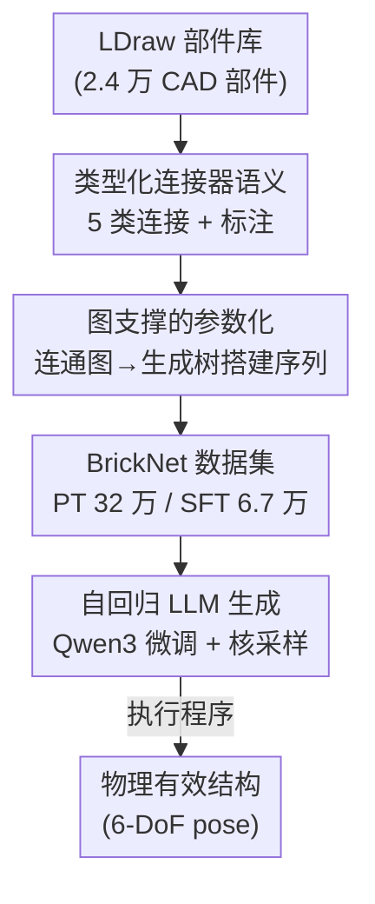

# BrickNet: Graph-Backed Generative Brick Assembly

**会议**: CVPR 2026  
**arXiv**: [2604.22984](https://arxiv.org/abs/2604.22984)  
**代码**: https://kulits.github.io/BrickNet (项目主页，数据集与模型公开)  
**领域**: 3D视觉 / 程序化生成 / LLM 序列建模  
**关键词**: LEGO 积木装配, 图参数化, 自回归生成, LDraw 数据集, 连接器语义

## 一句话总结
本文把 LEGO 积木的搭建序列当作"程序"让 LLM 自回归生成，关键是放弃直接回归每块砖的 6-DoF 坐标、改用一种以"连接关系"为一等公民的图支撑参数化（生成树），配合首次构建的 32 万样本大规模人工设计 LDraw 数据集 BrickNet，使生成序列的连通有效步数从 < 50 步提升到 94+ 步。

## 研究背景与动机
**领域现状**：很多物体天然是"部件 + 部件如何配置"的产物，3D 生成领域近年开始显式建模这种关系——部件图、可执行 shape program 等。LEGO 积木的顺序装配是这个大问题的一个紧凑实例：一个砖块结构不仅由部件的排布定义，还由它的"搭建过程"定义，每加一块都要满足离散的连接规则。

**现有痛点**：已有的生成式积木装配工作都被限制在"玩具子集"里——假设一个离散网格、只用少数几种砖型（如 BrickGPT 只用 8 种砖、限制在 $20\times20\times20$ 体素网格），把三角网格体素化来造训练样本。这种设定丢掉了 LEGO 真正吸引人的表达力：上千种部件、丰富的连接多样性与语义。

**核心矛盾**：一旦从网格扩展到真实样本，就出现表示困境。在简单网格里"上就是上"、旋转坐标系恒定，预测坐标很自然；但真实样本不遵守这些假设。以论文里的蜻蜓为例（Fig.2b），要从部件 1 自回归装到部件 5，模型必须在中间一直追踪每块砖的 6-DoF pose、沿着不断偏移的旋转坐标系累积变换——这变成一个**数值精度**问题，直接预测 pose 时搭几步序列就失效了。

**本文目标**：(1) 解决缺少合适训练数据的问题；(2) 找到一种能处理任意连接性、又不会精度爆炸的结构表示；(3) 在此之上训练能生成物理有效序列的自回归模型。

**切入角度**：作者的洞察是——虽然部件被放在 3D 空间里，但定义整体的是**部件之间的空间关系**。所以应该让"连接性"成为一等公民，而不是去预测绝对坐标。

**核心 idea**：用"类型化连接器 + 连接图的生成树"来参数化结构，把每条边变成一个可执行的、决定两个部件间局部 $SE(3)$ 变换的指令，从而把"精度累积"问题转化为"离散连接选择"问题。

## 方法详解

### 整体框架
BrickNet 的管线是：先给 LDraw 标准部件库的每个部件标注**类型化连接器**（5 类连接语义），再把一个无序部件集合按配对语义连成**连通图**，从图里采样**生成树**得到一条搭建序列（每条边是一个离散放置 action），最后把序列文本化、用它微调 LLM 做自回归生成。推理时模型一步步吐出"加哪个部件 + 怎么连"，执行这段"程序"即可恢复每块砖的 6-DoF pose。关键在于：坐标从不被直接预测，而是由连接关系执行后算出来。

### 关键设计

**1. 类型化连接器语义：把 6-DoF 连接压成几个离散/低维参数**

直接预测 pose 之所以崩，是因为要在浮点空间里精确累积旋转平移。本文的应对是给每个部件标注带类型的连接器，并把砖与砖的连接归纳成 5 个家族，每类只需极少参数就能确定两部件间的 $SE(3)$ 变换：**Stud**（凸点-孔）最常见，确定哪个 stud 插哪个孔后，只剩 1 个偏航角 yaw 参数；**Hinge**（铰链）在 1 个旋转自由度之外再加一个布尔"flip"（相当于拆开转 180° 再接回）；**Axle**（轴）在铰链基础上再加沿轴的"滑移"标量；**Ball**（球）有 3 个旋转自由度；**Fixed**（固定，如轮毂插轮胎）无任何自由度，知道谁配谁就够了。每个家族下还细分子类（如 stud 又分 standard/open/hole/tube/post），并规定配对规则（如 pin 只配 pin socket、axle 可配 pin 与 axle socket）。

标注靠"程序化 + 人工"混合完成：LDraw 部件由分层子部件定义，通过在原语层级里识别 `stud.dat` 并核对组合旋转矩阵里的尺度，就能推断出精确的连接器位置。难点在碰撞检测——真实砖必须靠塑性形变才能咬合，所以"良好连接"本身就带一定碰撞；而砖的连接高度非凸（tube 紧套 stud 时四面都碰），且部件多为非水密（non-watertight），VHACD 这类凸分解用不了。作者为此设计了一条多阶段管线把部件网格"补成水密"，再用改良版 PFPOffset 把所有面内缩 0.25 LDU（0.1mm），得到可用于标准碰撞检测的网格。

**2. 图支撑的参数化：用生成树把结构序列化成可执行程序**

有了类型化连接器，本设计回答"怎么把整个结构紧凑地表示成一条序列"。给定一个无序部件实例集合，按配对语义把连接器两两配对、形成边，**每条边恰好定义两个配对部件之间完整的局部 $SE(3)$ 变换**；所有边一起构成连接图。由于单条边就足以确定相对变换，整个结构可以被这张图的**生成树**紧凑且可解释地表示。从任意根部件出发采样一串搭建步骤——每步指定"加哪个部件 + 它如何连到已有结构上"——这串步骤就是一个程序，执行后产出带 6-DoF pose 的部件集合。序列化时把旋转参数四舍五入到最近的度、滑移标量到最近的 LDU。

这正是它优于直接预测 pose 的根本原因：连通性被**直接编码进表示**里，模型不需要在浮点空间累积变换、维持长程数值精度，只需做离散的"选连接器、选配对、选少量低维参数"。生成的概率被写作标准链式分解 $p(x)=\prod_{i=1}^{n}p(s_i\mid s_1,\ldots,s_{i-1})$。代价是表示要求模型预先知道这个领域——每个部件上连接器的位置必须靠预训练学到，因此换到新部件词表的泛化是个挑战。

**3. BrickNet 大规模人工设计数据集：补上"真实积木"训练数据的空白**

这套表示要落地，必须有真实、复杂、人工设计的积木结构来训练，而这正是过去稀缺、无法像体素那样轻松 bootstrap 的部分。作者从公开在线来源整理出 BrickNet：320,808 个样本、9,743 种独特部件、累计 40,549,969 块放置的砖。它被划成两个重叠子集：**BrickNet-PT**（预训练）保留长尾、可含上千块砖的超大结构；**BrickNet-SFT**（微调）含 67,185 个样本，每个 4–100 块、满足部件-颜色-类型多样性、且整体零碰撞，并用 8 视角渲染 + Gemini 2.5 生成文字描述。另留 512 个同标准样本作评测集。相比之下 BrickGPT 只有 8 种砖、OMR 仅 1,814 样本，BrickNet 在规模与表达力上都大一个量级。

**4. 自回归 LLM 微调与核采样：让通用 LLM 学会"搭积木程序"，并绕开全温度采样的崩塌**

最后把上述序列喂给 LLM。作者微调 Qwen3 的 0.6b/1.7b/4b/8b/14b instruct 模型，序列长度上限 4096 token，只用标准的 next-token 交叉熵。一个关键工程发现是：在 4096 长度下用真·全温度祖先采样（AS），哪怕只有 0.1% 概率质量落在非法续写上，采到一条完整有效序列的概率也 < 1.7%，所以大多数生成都被"垃圾 token"毁掉。改用**核采样（NS，top-k=20、top-p=0.95）**后连通有效性直接翻倍，作者后续实验都采用 NS。文本条件生成则是在 PT 模型上用 BrickNet-SFT 继续微调、目标函数不变。

### 损失函数 / 训练策略
训练目标全程是标准自回归 next-token-prediction 交叉熵（公式 1），无额外结构/物理约束损失。两阶段：先在 BrickNet-PT 上做无条件预训练，再在 BrickNet-SFT 上做文本条件微调；采样阶段统一用核采样（top-k=20、top-p=0.95）并在无条件实验里抑制 EOS 强制生成满 100 步。

## 实验关键数据

### 主实验
无条件生成（Tab.2）：每个模型采 $2^{16}$ 条满长度（100 块）序列，报告"直到出现失效步前的平均成功搭建步数"。图参数化（Graph）相比直接 pose 预测（Pose）在连通性上优势巨大；碰撞维度两者相近。

| 模型规模 | 连通性 Graph (NS) | 连通性 Pose (NS) | 碰撞 Graph (NS) | 碰撞 Pose (NS) |
|---------|------------------|-----------------|----------------|----------------|
| 0.6b | 94.1 | 31.8 | 16.0 | 14.5 |
| 1.7b | 95.1 | 35.5 | 16.6 | 16.1 |
| 4b | 96.9 | 45.1 | 18.0 | 20.3 |
| 8b | 97.0 | 44.9 | 18.7 | 20.1 |
| 14b | 96.9 | 49.9 | 19.1 | 22.4 |

文本条件生成（Tab.3，512 评测样本）：$P_{\text{inv}}$ 为非法放置比例，VQAScore/PE/SigLIP 2 为图文相似度。相比 BrickGPT 的图文相似度有数量级提升，但模型规模与感知质量的关系并不单调。

| 模型 | $P_{\text{inv}}$↓ | VQAScore↑ | PE↑ | SigLIP 2↑ |
|------|------|-----------|-----|-----------|
| BrickGPT | 0.063 | 0.050 | 0.157 | 0.052 |
| 0.6b | 0.256 | 0.557 | 0.279 | 0.603 |
| 1.7b | 0.260 | 0.593 | 0.282 | 0.631 |
| 4b | 0.239 | 0.615 | 0.283 | 0.639 |
| 8b | 0.233 | 0.608 | 0.284 | **0.647** |
| 14b | **0.231** | 0.602 | 0.283 | 0.625 |

### 消融实验
训练阶段消融（Tab.4a，困惑度，越低越好）：PT→SFT 两阶段始终优于"无 PT 直接 SFT"，证明无条件预训练学到的先验可迁移。

| 模型 | PT (无条件) | PT + SFT (条件) | No-PT + SFT |
|------|------------|-----------------|-------------|
| 0.6b | 1.331 | 1.298 | 1.343 |
| 4b | 1.307 | **1.274** | 1.311 |
| 14b | 1.300 | **1.266** | 1.298 |

数据量消融（Tab.4b，14b，困惑度）：PT 与 SFT 数据越多越好，呈一致单调趋势。

| PT＼SFT | Full | Half | Quarter | None |
|---------|------|------|---------|------|
| Full | **1.266** | 1.279 | 1.288 | 1.300 |
| Half | 1.273 | 1.284 | 1.296 | 1.318 |
| Quarter | 1.276 | 1.292 | 1.305 | 1.361 |

### 关键发现
- **图参数化是胜负手**：在连通有效性上 Graph (94+ 步) 几乎是 Pose (< 50 步) 的两倍，且 Pose 的有效性随步数陡峭衰减（Fig.7），而 Graph 不出现这种悬崖——因为连通性被直接写进表示。
- **碰撞仍是瓶颈**：一旦把无碰撞也算进有效性，两种表示都只到约 20 步，说明长序列避碰是公认未解难题。
- **规模收益递减且不单调**：0.6b 始终最差，但更大模型对有效性的提升边际递减；文本条件下感知质量甚至非单调（1.7b 在某指标上超过 14b）。作者据此推测瓶颈不在模型容量，而可能是**训练目标（被正确最小化的 next-token）与采样任务之间的错配**——困惑度随规模/数据单调下降，但感知质量没跟上。
- **采样策略至关重要**：全温度祖先采样几乎必崩，核采样让平均连通有效性翻倍，是让这套方法可用的关键工程点。

## 亮点与洞察
- **"让连接性成为一等公民"是核心洞察**：把绝对坐标回归换成离散连接选择，把"长程数值精度"难题转成"离散组合"难题——这是整篇论文最让人"啊哈"的地方，也是 Graph 对 Pose 碾压的根因。
- **生成树序列化既紧凑又可执行**：每条边自带完整局部 $SE(3)$，所以一棵生成树就能无损还原任意结构，且天然可被 LLM 当作 token 序列吃下，把 3D 装配问题优雅地转成语言建模问题。
- **把工程细节（水密化 + PFPOffset 内缩 0.25 LDU）讲透**：积木碰撞的非凸 + 非水密特性让常规碰撞检测失效，作者老老实实给出补救管线，这类"脏活"经验对做物理可行性约束的生成任务很可复用。
- **训练-采样目标错配的诚实诊断**：用困惑度单调 vs 感知质量非单调的对照，指出"正确最小化的损失"未必对齐"采样任务"，这个观察对所有"自回归生成 + 感知评测"的工作都有启发。

## 局限与展望
- **作者承认**：模型难以在不引入部件间碰撞的情况下生成长序列（无碰撞有效步数仅约 20）；表示要求模型预先知道部件连接器位置，闭集词表里能靠预训练学到，但**换新领域/新部件的泛化是硬伤**；为控制算力，搭建序列被限制在 100 块，而真实套装无此上限。
- **SFT 评测被刻意做得简单**（聚焦数据与表示），作者自承用更强 post-training 技术很可能大幅提升。
- **自己发现的局限**：文本条件下规模与感知质量非单调，说明现有评测/目标可能还抓不住"搭得像不像"的关键；困惑度本身是参数化相关的，无法直接用来比较 Pose 与 Graph 两种表示的优劣，跨表示比较需谨慎。⚠️ 部分指标解读以原文为准。
- **改进思路**：作者建议引入推理时（inference-time）解码引导来主动避碰、提升模型本身的空间理解；探索给定部件集合或额外约束下的生成；以及把学到的先验迁移到重建、编辑等下游任务。

## 相关工作与启发
- **vs BrickGPT**: 同样把砖块放置序列化成文本微调 LLM，但 BrickGPT 预测体素坐标、限制在 8 种砖与 $20^3$ 网格；本文用图支撑参数化 + 上千种真实部件，图文相似度有数量级提升、有效序列长得多。
- **vs Peysakhov & Regli / Thompson et al.**: 前者也用图参数化但只建模矩形块的卡扣连接、且用遗传算法演化而非学习组合；后者用图自回归 GNN 但限制在单一砖型、网格对齐位置。本文把连接器扩展到 5 大类型化家族、覆盖任意连接性。
- **vs Walsman et al. (LDCad snap 系统)**: 同样用更广部件集且非生成任务，靠视觉选点定位连接位置，但连接器覆盖不全；本文针对生成、且给出系统化的类型化连接器标注。
- **vs ShapeAssembly / StructureNet / CSGNet (程序合成 3D)**: 都用可执行程序/图建模 3D 结构，本文把积木结构序列化为"类型化连接图上的生成树"，每条边是可实现局部 $SE(3)$ 变换的指令，是这条思路在 LEGO 顺序装配上的具体实例。

## 评分
- 新颖性: ⭐⭐⭐⭐⭐ "连接性为一等公民 + 生成树序列化"把 3D 精度难题转成离散组合，思路干净且首次覆盖任意连接性
- 实验充分度: ⭐⭐⭐⭐ 覆盖 5 个模型规模 × 无条件/文本条件 × 训练阶段与数据量消融，但避碰长序列与下游任务尚未充分验证
- 写作质量: ⭐⭐⭐⭐ 动机推导清晰、工程细节诚实，连接器语义与图参数化讲得透
- 价值: ⭐⭐⭐⭐⭐ 公开 32 万样本数据集 + 标注 + 模型，为生成式积木装配/部件级 3D 生成奠定数据与表示基础

<!-- RELATED:START -->

## 相关论文

- [\[CVPR 2026\] AssemblyBench: Physics-Aware Assembly of Complex Industrial Objects](assemblybench_physics-aware_assembly_of_complex_industrial_objects.md)
- [\[CVPR 2026\] Repurposing 3D Generative Model for Autoregressive Layout Generation](repurposing_3d_generative_model_for_autoregressive_layout_generation.md)
- [\[CVPR 2026\] Variational Graph-based Normal Integration](variational_graph-based_normal_integration.md)
- [\[CVPR 2026\] Affostruction: 3D Affordance Grounding with Generative Reconstruction](affostruction_3d_affordance_grounding_with_generative_reconstruction.md)
- [\[CVPR 2026\] NeuROK: Generative 4D Neural Object Kinematics](neurok_generative_4d_neural_object_kinematics.md)

<!-- RELATED:END -->
