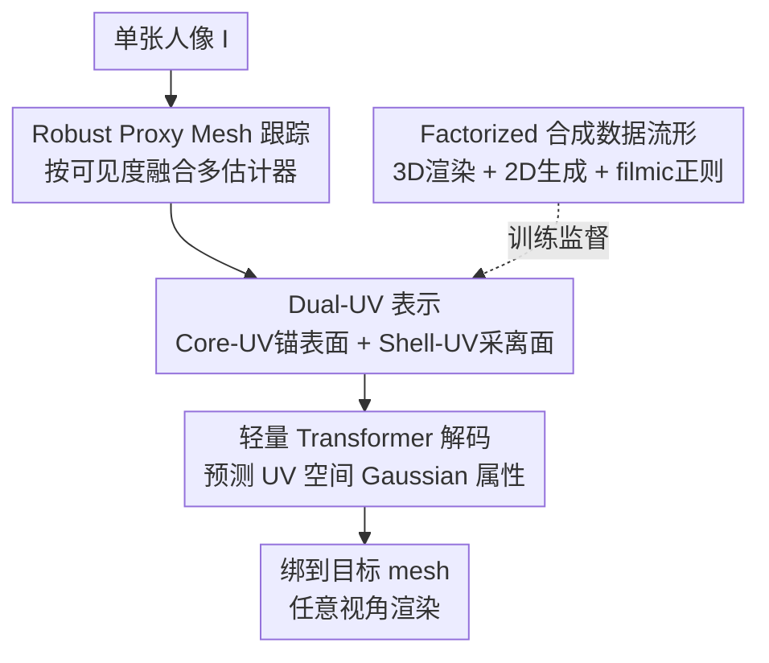

# Bringing Your Portrait to 3D Presence

**会议**: CVPR 2026  
**论文**: [CVF Open Access](https://openaccess.thecvf.com/content/CVPR2026/html/Zhang_Bringing_Your_Portrait_to_3D_Presence_CVPR_2026_paper.html)  
**代码**: 待确认  
**领域**: 3D视觉  
**关键词**: 单图3D Avatar、Dual-UV表示、3D Gaussian、合成数据、proxy mesh跟踪

## 一句话总结
用一个把图像特征投到规范 UV 空间的 **Dual-UV 表示**，配上一套「3D 渲染 + 2D 生成」的因子化合成数据和鲁棒的 proxy mesh 跟踪器，做到只用单张人像（头部 / 半身 / 全身都行）就能重建出可驱动的 3D Gaussian avatar，且只在合成数据上训练就能泛化到真实照片。

## 研究背景与动机

**领域现状**：从单张人像重建可驱动 3D avatar 是 telepresence / VR 的核心需求。近年主流是 LRM（Large Reconstruction Model）范式——LAM、LHM 这类把输入图编码成 patch-level 特征，再用一组可学习 token 通过 cross-attention 去查询，单次前向就出 3D，不需显式几何/纹理优化。

**现有痛点**：这套范式有三个老大难。① **表示对 pose / 取景敏感**：ViT 编码器没有严格平移不变性，要求输入图对齐到固定参照，但人像 pose 变化大、还经常半身/局部可见，对齐天然不稳，decoder 既要关联 patch 与 3D、又要适应 token 分布漂移，结果是身份漂移、纹理畸变。② **数据难规模化**：高质量多视角人像要昂贵的同步相机棚拍；真实单目视频要大量人工清洗；传统渲染几何可控但外观多样性差、域差距大；2D 生成模型够真够多样，但缺身份和跨视角一致性，没法直接当 3D 监督。③ **proxy mesh 估计不鲁棒**：现有 tracker 普遍假设全身可见（有的还要求两只手或完整轮廓），而真实抓拍多是上半身视角。

**核心矛盾**：LRM 范式把表示**绑死在图像特征空间**——它必须从带 pose 的图里隐式恢复规范结构，而 proxy mesh 其实已经提供了形变场，decoder 等于在重学几何映射、浪费容量；同时「half-body」定义本身就含糊（从肩到腰还是到大腿），导致空间对应关系不一致。

**本文目标**：用**一个模型**统一处理头部 / 半身 / 全身输入，放宽对输入完整度和训练数据的要求，推进到真正 in-the-wild 的单图 avatar 重建。

**核心 idea**：与其让网络在图像空间里硬学几何对齐，不如用一个**非学习的闭式投影**把图像特征确定性地搬到规范 UV 空间（Dual-UV），从根上消除 pose/取景引起的 token 漂移，让网络只需专注于身份和外观细节。

## 方法详解

### 整体框架

给定单张 RGB 人像 $I$，目标是重建一组 3D Gaussian $G=\{g_i=(\mu_i,\Sigma_i,c_i,\alpha_i)\}_{i=1}^N$。作者把隐空间拆成两块互补部分 $z=\{z_{uv}, z_{mesh}\}$：$z_{uv}$ 是 Dual-UV 表示，在规范 UV 空间里编码几何对齐的外观与可见性；$z_{mesh}$ 是由 proxy mesh 参数化的 latent，负责 pose 相关形变。整体映射写成

$$f_\theta: I \to z_{uv}, \qquad G = \Phi(z_{uv}, z_{mesh}),$$

其中 $f_\theta$ 是重建网络，$\Phi$ 把 latent 转成带 pose 的 3D Gaussian。

整条 pipeline 是三块协同：① **Dual-UV 重建模型**先把冻结编码器的图像特征沿可见射线采样、确定性地散布（scatter）进规范 UV 网格，得到 Core-UV / Shell-UV 两路特征，再用一个轻量 transformer 融合解码出 UV 空间的 Gaussian 属性，最后绑到目标 mesh 上从任意视角渲染；② 训练全靠 **因子化合成数据流形**（3D 渲染 + 2D 生成两支）提供监督；③ 重建依赖的 proxy mesh 由一个 **分层跟踪器** 在不同输入完整度下稳定产出。三者缺一不可：UV 投影需要可靠的 proxy mesh 作锚，而合成数据决定了模型能否泛化到真实照片。

### 关键设计

**1. Dual-UV 表示：用闭式投影把图像特征搬进规范 UV 空间，根除 pose/取景漂移**

这是全系统的核心，专治痛点①——LRM 把表示绑死在图像空间导致的身份漂移。作者不再用可学习 token 去 cross-attention 查询，而是建立**图像像素与规范 mesh 表面的确定性对应**。利用人体 mesh 的 UV 布局，定义一个可微的「反参数化」$(u,v)=M^{-1}(p;M)$，把每个表面点 $p$ 唯一映射到 UV 坐标。

具体分两路。**Core-UV（锚在表面）**：在 mesh $M$ 上均匀采 $N$ 个表面点，预存它们的 face index 和重心坐标；给定图像 $I$ 和标定相机 $\Pi$，用冻结的 Sapiens-1B 编码器抽特征 $F=E(I)$，再把 $M$ 在 $\Pi$ 下做带背面剔除和 z-buffer 的光栅化来判可见性。对每个可见点 $p_i$ 投到图像 $x_i=\Pi(p_i)$，用可微双线性采样取特征 $f_i=S(F,x_i)$（$m_i\in\{0,1\}$ 为可见 mask），然后散布到规则 UV 网格 $\tilde U \in \mathbb{R}^{H_U\times W_U\times C}$：

$$\tilde U(u,v)=\frac{\sum_i m_i\, k\big((u,v)-(u_i,v_i)\big)\, f_i}{\sum_i m_i\, k\big((u,v)-(u_i,v_i)\big)+\varepsilon},$$

其中 $k(\cdot)$ 是紧凑聚合核（实践用最近邻），$\varepsilon$ 保稳定。这样就得到一张几何对齐的 Core-UV 特征图，提供图像观测与 mesh 表面坐标之间一对一、可微的链接。**Shell-UV（采离面细节）**：body mesh 表达不了头发、宽松衣物这类体积细节，于是沿顶点法线外推一层壳 $M^+=\{p+\delta\, n(p)\mid p\in M\}$，对 $M$ 和 $M^+$ 都光栅化得可见 mask，取「壳可见但不在 $M$ 投影内」的区域 $m_{shell}=m_{M^+}\cdot(1-m_{M})$ 来只采离面像素，特征同样用上式的核聚合落到一张较粗的 $\tilde U_{shell}$。

为什么有效：因为 token 锚在规范表面而非图像坐标，pose/对齐变化引起的 token 分布漂移被直接消掉，一个模型就能稳健吃下头部、半身、全身三种输入。

**2. MAE 对齐的轻量解码器：把「只填可见 UV 格」当成 masked token，用小 decoder 补全**

承接设计 1 之后的解码。Core-UV 和 Shell-UV token 拼接后过一个**浅层 transformer 栈**，再 unpatch 成 UV 属性，由各自的 head 预测 Gaussian 的颜色 $c$、不透明度 $o$、偏移 $d$、旋转 $r$、尺度 $s$。这里的关键观察是：投影后的图像特征**只填满可见的 UV 格，被遮挡区域留空**——这天然对应 MAE 里的 masked token。于是一个紧凑 transformer 的任务就是把信息从可见区传播到缺失区，正好复用了 Sapiens 这类「强编码器 + 轻解码器」的预训练非对称性。相比 LHM/IDOL 用大 decoder + 可学习 query（把预训练编码器只当被动特征提取器），本设计用远少的 decoder 参数（< 0.1B，8 层 self-attention）就拿到高质量 avatar。

**3. 因子化合成数据流形：3D 渲染锚几何 + 2D 生成扩外观，用「单向跨视角一致性」稳训练**

专治痛点②的数据规模化困境，全程不用任何真实 3D 监督。两支互补：**合成渲染支**用参数化人体模型在 HDRI 环境下程序化采样身份/pose/服装/光照，从多个标定视角渲染，提供几何一致的多视角监督，是训练数据的结构骨架（生成 150K 主体，各渲 12 个偏上半身视角）。**生成支**反其道而行——不去 fine-tune 扩散模型逼它多视角一致（那样会损真实度和多样性），而是发挥 2D 生成的强项（丰富身份、自然外观）。它把每个样本描述成可解释维度（时段、光照、景别、构图、服装、发型、角色、地域、动作）的组合：先用 GPT-5 拼成简洁文本，再用 Qwen2.5-14B-Instruct 当「**realism regularizer**」把 prompt 投到物理自洽的 filmic 空间（消解矛盾属性、补上取景/打光/影调的电影化线索），交给 Wan2.2 文生视频出短人像片段，每段选一帧代表帧，再用 Qwen-Image-Edit 补侧/背视图（合成 300K 片段）。

精髓在训练时的**有向跨视角一致性**：把生成帧当作「弱相关视图」而非 ground-truth 对应，只让约束从更可靠流向更不可靠（侧→背、前→背），**避免环形约束**——环形会放大身份漂移和纹理混叠。这种非对称设计既稳了训练，又保留了视角感知的连贯性。

**4. 鲁棒 proxy mesh 估计：先测各估计器的可靠区间，再按可见度分层融合**

治痛点③。可靠的 proxy mesh 是规范重建的前提，但单个预训练估计器各有假设的裁剪视角和坐标系。作者不赌单一模型，而是先 benchmark 多个估计器在头部 / 半身 / 全身下的稳定区间——经验上 OSX 擅长半身可见、Multi-HMR 在全身可见时准、EMICA 对头部主导稳、HaMeR 只有手可见时手部关节才准——得到一张「各模型可靠工作区」的经验图。据此设计**分层框架**：按检测到的可见度激活并融合多个估计器的输出，再用关键点重投影 + 稠密顶点对齐联合 refine。结果是从头部特写到全身、真实与生成图都能产出稳定且解剖一致的 mesh，把对全身可见的依赖降下来。

### 损失函数 / 训练策略
训练用 AdamW（学习率 $1\times10^{-4}$）、混合精度、梯度裁剪（norm 1.0），在 4 张 A100 80G 上跑 3 天，per-GPU batch 8。解码器输出 unpatch 成 $8\times8$ patch、拼成 $512\times512$ 的 Gaussian 属性图（262K 个 Gaussian）。数据 19:1 划分训练/验证。具体 loss 细节作者放在补充材料（正文未给）⚠️ 以原文为准。

## 实验关键数据

### 主实验
对比 LHM、LHM-HF、IDOL、LAM、GUAVA，在 Upper-body（真实 OpenHumanVid 100 clip + 合成 Upper-Wan 200 clip）、Head（RenderMe360 50 talking clip）、Full-Body（SHHQ 100 subject）三类设置下评测。注意本文**仅在上半身为主的合成数据上训练**。

| 设置 | 指标 | 本文 | 最强基线 | 对比 |
|------|------|------|----------|------|
| Upper-Wild | PSNR↑ / SSIM↑ / LPIPS↓ | 21.09 / 0.851 / 0.143 | GUAVA 20.59 / 0.786 / 0.196 | LPIPS 显著更低，纹理保真+身份保持更好 |
| Upper-Wan | PSNR↑ / SSIM↑ / LPIPS↓ | 20.38 / 0.787 / 0.164 | GUAVA 20.24 / 0.722 / 0.194 | 全面领先 |
| Head | PSNR↑ / SSIM↑ / LPIPS↓ | 24.53 / 0.864 / 0.092 | IDOL 18.51 / 0.875 / 0.126；LAM† 17.19 | PSNR/LPIPS 大幅领先，且能重建肩部以下（LAM 做不到） |
| Full-Body | PSNR↑ / SSIM↑ / LPIPS↓ | 19.04 / 0.853 / 0.161 | LHM 21.53 / 0.915 / 0.073；IDOL 18.51 | 没见过下半身仍有竞争力，验证对未见身体部位的泛化 |

要点：Upper-body 上对 LRM 系（IDOL、LHM-HF）的纹理保真和身份保持全面占优；GUAVA 虽在可见区有竞争力，但它**强制要求手可见**，手遮挡时 pose 不稳、有伪影，而本文不做任何 2D refinement 仍鲁棒。Full-body 上虽不及专门方法 LHM，但考虑到本文几乎没见过下半身，competitive 的结果说明 Dual-UV 表示有很强的部位外推泛化。

### 消融实验
在上半身合成 clip 上评测（Tab. 2）：

| 配置 | PSNR↑ | SSIM↑ | LPIPS↓ | 说明 |
|------|-------|-------|--------|------|
| Decoder 2 层 | 20.31 | 0.785 | 0.181 | 浅 |
| Decoder 4 层 | 20.36 | 0.786 | 0.179 | 中 |
| Decoder 8 层（默认）| 20.38 | 0.787 | 0.164 | 加深稳定提升，LPIPS 改善最明显 |
| w/o shell token | 20.35 | 0.785 | 0.180 | 去掉壳 token，离面细节变差 |
| w/ shell token（默认）| 20.38 | 0.787 | 0.164 | shell 明显增益 |
| 数据 3% | 20.25 | 0.783 | 0.189 | 数据越多越好 |
| 数据 33% | 20.33 | 0.786 | 0.180 | |
| 数据 95%（默认）| 20.38 | 0.787 | 0.164 | |
| 仅 syn（纯渲染）| 19.57 | 0.758 | 0.242 | 泛化最差 |
| 仅 gen（含增强图）| 20.38 | 0.786 | 0.173 | 缓解明显 |
| gen*（仅视频生成、无增强侧/背图）| 20.34 | 0.785 | 0.179 | 比 gen 差，说明侧/背增强有用 |
| full（全数据源）| 20.38 | 0.787 | 0.164 | 最佳 |

### 关键发现
- **数据组合 > 单一来源**：只用合成渲染（syn）泛化最差（LPIPS 0.242）；加入生成数据（gen）大幅缓解；但只用视频生成、缺侧/背增强（gen*）又退化。说明「精确 3D 渲染锚几何 + 多样 2D 视图补外观」缺一不可，这是本文数据设计的核心论点。
- **shell token 确有用**：去掉后 LPIPS 从 0.164 退到 0.180，印证它对头发/衣物等离面区域的局部建模贡献。
- **decoder 加深和数据扩大都单调受益**，但收益不算剧烈——说明瓶颈更多在表示和数据而非解码容量，这也支撑了「轻量 decoder 足够」的设计哲学。

## 亮点与洞察
- **把对齐问题从「学」变成「算」**：用闭式、非学习的 image→UV 投影替代可学习 query，pose/取景的 token 漂移被几何地消掉而不是靠数据硬学，这是它能用 < 0.1B 小 decoder 还泛化好的根因，思路可迁移到其它「有 proxy 几何先验」的重建任务。
- **「不强求多视角一致」的数据哲学很反直觉但合理**：与其 fine-tune 扩散模型逼一致（损真实度），不如用 LLM 当 realism regularizer + 单向跨视角一致性，把 2D 生成的多样性留住、把不一致风险用有向约束压住。
- **Core/Shell 双 UV** 把「贴在表面的身份纹理」和「飘在表面外的头发衣物」分开建模，比单 UV 或额外 template 分支（如 GUAVA 还需后续 refine 融合）更简洁。
- **多视角输入近乎免费**：直接对各图的 UV 特征做线性混合就能融合多视角，不需要专门的 alternating attention。

## 局限与展望
- 作者承认：依赖 proxy mesh，极端/高度铰接 pose 下 mesh 会失败，导致明显重建误差；合成数据流形虽身份多样，但视角仍稀疏（侧/背视角有限），训练时视点覆盖不全。
- 自己看：Full-body 指标明显落后专门方法 LHM（PSNR 19.04 vs 21.53），「competitive」更多是泛化层面的好故事，绝对精度上下半身仍是短板；主表里部分单元格缺失（如 Upper-Wild 下 LHM/某些方法空缺），横向比较需谨慎。loss 细节全在补充材料，正文无法核验。
- 改进方向：作者提出探索弱 pose 依赖的表示来缓解 proxy 依赖，并提升视点覆盖。

## 相关工作与启发
- **vs LHM / LAM（LRM 系）**：它们用可学习 token + cross-attention 在图像特征空间查询，对 pose/取景敏感、靠大 decoder；本文用确定性 UV 投影 + 轻量 MAE 式 decoder，从几何上消漂移，半身/部位泛化更好。
- **vs IDOL**：IDOL 也用 2D 生成模型做数据 curation，但 fine-tune 它去多视角合成，引入多样性偏置且几何一致性仍不可靠；本文保留 2D 生成的原始纹理丰富度和多样性，不依赖其多视角有效性。
- **vs GUAVA**：同样用 UV 分支做外观，但 GUAVA 需要独立 template 分支编码输入、靠后续 refine 模块融合两支 Gaussian，且强制手可见；本文 Dual-UV 单框架、无 2D refinement、对手遮挡鲁棒。
- **vs 其它用 UV 的 avatar 方法（StyleGAN / cross-attention 调制 UV）**：本文用非学习闭式投影，纹理迁移更忠实、身份保持更强，无生成式幻觉。

## 评分
- 新颖性: ⭐⭐⭐⭐⭐ 把「图像→规范 UV」做成闭式确定性投影 + MAE 式补全，从根上换掉 LRM 的可学习 query 范式，思路干净有力。
- 实验充分度: ⭐⭐⭐⭐ 头/半身/全身三设置 + 数据来源消融到位，但主表多处空缺、full-body 落后专门方法，比较略不齐整。
- 写作质量: ⭐⭐⭐⭐⭐ 三大瓶颈→三大设计一一对应，方法叙述清晰，公式给得明确。
- 价值: ⭐⭐⭐⭐⭐ 单图、跨取景、纯合成数据训练就能 in-the-wild 泛化，对 telepresence/avatar 落地实用价值高。

<!-- RELATED:START -->

## 相关论文

- [\[CVPR 2026\] Iris: Bringing Real-World Priors into Diffusion Model for Monocular Depth Estimation](iris_bringing_realworld_priors_into_diffusion_model_for_monocular_depth_estimation.md)
- [\[CVPR 2025\] PERSE: Personalized 3D Generative Avatars from A Single Portrait](../../CVPR2025/3d_vision/perse_personalized_3d_generative_avatars_from_a_single_portrait.md)
- [\[CVPR 2026\] Bringing a Personal Point of View: Evaluating Dynamic 3D Gaussian Splatting for Egocentric Scene Reconstruction](bringing_a_personal_point_of_view_evaluating_dynamic_3d_gaussian_splatting_for_e.md)
- [\[CVPR 2025\] Coherent 3D Portrait Video Reconstruction via Triplane Fusion](../../CVPR2025/3d_vision/coherent_3d_portrait_video_reconstruction_via_triplane_fusion.md)
- [\[ICCV 2025\] Tune-Your-Style: Intensity-Tunable 3D Style Transfer with Gaussian Splatting](../../ICCV2025/3d_vision/tune-your-style_intensity-tunable_3d_style_transfer_with_gaussian_splatting.md)

<!-- RELATED:END -->
