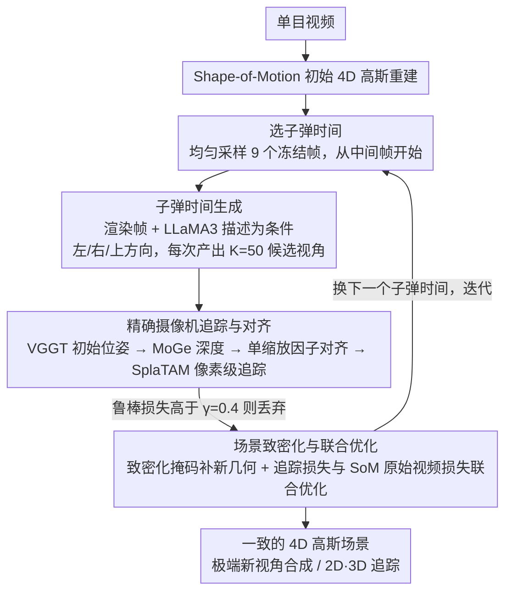

# BulletGen: Improving 4D Reconstruction with Bullet-Time Generation

**会议**: CVPR 2026  
**arXiv**: [2506.18601](https://arxiv.org/abs/2506.18601)  
**代码**: 无（内部模型）  
**领域**: 4D 重建 / 3D 视觉  
**关键词**: 4D重建, 子弹时间, 视频扩散模型, 高斯喷溅, 新视角合成

## 一句话总结
提出 BulletGen，在选定的"子弹时间"冻结帧用静态视频扩散模型生成新视角，精确定位后用于监督 4D 高斯场景优化，在仅有单目视频输入的情况下实现极端新视角合成和 2D/3D 追踪的 SOTA。

## 研究背景与动机
**领域现状**: 从单目视频重建动态 4D 场景是高度欠约束的问题。Shape-of-Motion 等方法利用深度先验和 2D 追踪轨迹取得了不错的重建效果，但在极端新视角下仍然失败。

**现有痛点**: 单目视频在每个时间步只有一个视角，4D 重建严重欠约束，导致方法只能找到局部最优解。现有生成式方法（CAT4D、Vivid4D）直接生成多视角视频后解耦优化，缺乏精确的摄像机控制和时空一致性。

**核心矛盾**: 纯优化方法缺乏未见区域的信息来源，纯生成方法缺乏全局一致性约束。如何将不一致的 2D 生成结果鲁棒地融入一致的 4D 表示？

**本文要解决**: 将视频扩散模型的生成能力与逐场景优化的全局一致性优势结合。

**切入角度**: "子弹时间"——在选定时刻冻结场景，生成该冻结时刻的新视角（相当于静态场景新视角生成），然后将生成结果融入 4D 重建。

**核心idea**: 用丰富的静态训练数据（而非稀缺的动态视频数据）训练扩散模型，在冻结时刻生成新视角，通过迭代优化将 2D 生成结果融入全局 3D 表示。

## 方法详解

### 整体框架

BulletGen 要解决的是单目视频做 4D 重建时极端欠约束的问题——每个时刻只有一个视角，未见区域全靠猜。它的思路是先用 Shape-of-Motion (SoM) 跑出一个初始 4D 高斯重建打底，然后在时间轴上挑出若干"子弹时间"冻结帧，把这些时刻当成静态场景，用图像-视频扩散模型生成它们的新视角，再把生成的视角精确对齐回 4D 重建、做高斯致密化，最后用联合损失把生成内容和原始视频一起优化进同一个全局表示。整个过程在多个子弹时间上迭代，逐步把未见区域填实。

### 关键设计

**1. 子弹时间生成：把动态重建拆成多个静态新视角生成**

单目动态视频缺的是未见区域的信息，而直接训练动态多视角扩散模型既缺数据又难保证质量。BulletGen 的取巧之处是把问题降维：在选定时刻 $t$ 冻结整个场景，此刻问题退化成"静态场景的新视角生成"——这是一个数据充裕、质量成熟的任务。扩散模型以当前渲染帧加上 LLaMA3 生成的描述性文本为条件，支持左、右、上三种运动方向，每个子弹时间执行 $n_G=7$ 次生成。这样做的本质优势是用海量静态训练数据（比动态视频数据丰富几个数量级）换取了高质量新视角，避开了动态扩散模型的高算力负担。

**2. 精确摄像机追踪与对齐：让生成的 2D 图像和 3D 场景严丝合缝**

生成视角再好，只要和现有 4D 重建对不齐就会引入伪影，所以这一步是成败关键。流程是先用 VGGT 估计初始相对位姿，MoGe 给出精确单目深度，再用单一缩放因子对齐到当前 4D 重建，最后用 SplaTAM 做像素级追踪、优化外参 $\mathbf{E}_k$。对齐用的鲁棒损失把多种线索加权融合：

$$\mathcal{L} = \alpha_1 \text{L1} + \alpha_2 \text{LPIPS} + \alpha_3 \text{CLIP} + \alpha_4 \text{L1}_{depth}$$

因为生成图像在像素级的 3D 一致性并不完美，权重特意把语义/感知项压到最高（$\alpha_2=\alpha_3=0.1$），让对齐更看重整体语义而非逐像素硬贴。生成的视角还要过质量关——只有损失低于阈值 $\gamma=0.4$ 的才保留，把对不齐的生成结果直接丢掉。

**3. 场景致密化与联合优化：把生成内容稳稳缝进全局表示**

光对齐还不够，未见区域需要真正长出新几何，且不能破坏已有重建。致密化掩码锁定两类区域：密度不足的地方，以及新几何出现在当前几何前方的地方；新生高斯按最近邻标签继承静态/动态属性，动态高斯的运动基权重也从最近邻初始化。优化时用联合损失交替进行——生成视角的追踪损失加上 SoM 原始视频损失，跑 100 epochs，batch 为 8（生成与原始各 8）。这种"生成—对齐—致密化—联合优化"的迭代很像 SLAM/BA 的思路：把一批独立的 2D 预测通过反复的全局优化融成一致的 4D 表示，而不是像 CAT4D/Vivid4D 那样先一次性生成多视角再解耦优化。

### 一个完整示例

以一段单目猫咪视频为例：SoM 先重建出初始 4D 场景，但猫的背面始终没被任何视角拍到。BulletGen 均匀采样 9 个子弹时间，从中间帧开始；在某个冻结时刻向"右"生成，扩散模型一次产出 $K=50$ 个候选新视角，VGGT+MoGe+SplaTAM 把它们逐一对齐，损失高于 $\gamma=0.4$ 的被筛掉，剩下 $K'\le K$ 个高质量视角进入致密化，在猫背面长出新高斯。换下一个子弹时间重复，几轮后猫的背面、滑冰者背后的墙这些原本空缺的区域都被填实，且和原视频保持一致。

### 损失函数 / 训练策略
- 摄像机追踪: L1 + LPIPS + CLIP 余弦相似度 + 深度 L1，100 epochs
- 场景更新: 上述追踪损失（全图计算） + SoM 的默认损失，100 epochs
- 时间选择: 均匀采样 $n_S=9$ 个子弹时间，从中间帧开始
- 每次生成 $K=50$ 个视角，筛选后保留 $K' \leq K$ 个

## 实验关键数据

### 主实验（iPhone 数据集，新视角合成）

| 方法 | PSNR↑ | SSIM↑ | LPIPS↓ | CLIP-I↑ |
|------|-------|-------|--------|---------|
| HyperNeRF | 15.99 | 0.59 | 0.51 | 0.87 |
| Shape-of-Motion | 16.72 | 0.63 | 0.45 | 0.86 |
| CAT4D (no code) | 17.39 | 0.61 | 0.34 | - |
| **BulletGen** | **16.78** | **0.64** | **0.39** | **0.90** |

### 3D/2D 追踪（iPhone 数据集）

| 方法 | EPE↓ | $\delta_{3D}^{.05}$↑ | $\delta_{3D}^{.10}$↑ | AJ↑ |
|------|------|---------------------|---------------------|-----|
| TAPIR + DA | 0.114 | 38.1 | 63.2 | 27.8 |
| Shape-of-Motion | 0.082 | 43.0 | 73.3 | 34.4 |
| **BulletGen** | **0.071** | **51.6** | **77.6** | **36.6** |

### 消融实验（Vivid4D 子集，iPhone）

| 方法 | PSNR↑ | SSIM↑ | LPIPS↓ |
|------|-------|-------|--------|
| Shape-of-Motion | 14.56 | 0.46 | 0.53 |
| Vivid4D (no code) | 15.20 | 0.50 | 0.49 |
| **BulletGen** | **16.38** | **0.51** | **0.45** |

### 关键发现
- BulletGen 在所有 2D/3D 追踪指标上取得 SOTA，因为生成视角为几何提供了更多约束
- 在 Vivid4D 子集（挑战性场景）上优势更明显（PSNR +1.82 vs SoM）
- 生成的内容能无缝融入静态和动态场景组件（如猫的背面、滑冰者背后的墙）
- CLIP-I 指标 0.90 远超所有基线，说明语义一致性最好
- 使用仅 5-9 个子弹时间即可有效改善整个动态场景

## 亮点与洞察
- "子弹时间 + 静态扩散"的策略极其巧妙——将动态重建问题转化为多个静态新视角生成
- 利用静态训练数据（相比动态视频数据丰富几个数量级），避免了动态扩散模型的高计算负担
- 迭代式生成-优化循环类似 SLAM/BA 的思路，将独立预测通过全局优化融合
- 3D 追踪性能的大幅提升验证了生成新视角对几何约束的贡献

## 局限与展望
- 使用内部不公开的扩散模型，可复现性受限
- 平均优化时间 ~3 小时/序列（含 1.5 小时 SoM），远非实时
- 生成模型只支持静态场景和有限方向（左、右、上），无下方视角
- 不同子弹时间的生成可能存在不一致，全靠全局优化掩盖
- 未建模视角依赖的光照变化

## 相关工作与启发
- Shape-of-Motion 提供了强大的初始 4D 重建基础，BulletGen 在其上增添生成增强
- CAT4D/Vivid4D 的"先生成后优化"策略强解耦，BulletGen 的迭代交替更紧密
- SplaTAM 的高斯 SLAM 为精确摄像机追踪提供了关键工具
- 启示：当数据不足时，"用生成模型造数据 → 全局优化融合"是通用有效范式

## 评分
- 新颖性: ⭐⭐⭐⭐⭐ 子弹时间 + 静态扩散的思路非常创新，巧妙利用数据不平衡
- 实验充分度: ⭐⭐⭐⭐ 新视角合成 + 追踪双重评测，多基线对比，但依赖不公开模型
- 写作质量: ⭐⭐⭐⭐ 管线描述清晰,图示优秀
- 价值: ⭐⭐⭐⭐⭐ 为单目 4D 重建提供了实用的生成增强方案

<!-- RELATED:START -->

## 相关论文

- [\[CVPR 2026\] Selfi: Self-improving Reconstruction Engine via 3D Geometric Feature Alignment](selfi_self-improving_reconstruction_engine_via_3d_geometric_feature_alignment.md)
- [\[CVPR 2026\] 4D Primitive-Mâché: Glueing Primitives for Persistent 4D Scene Reconstruction](4d_primitive-mache_glueing_primitives_for_persistent_4d_scene_reconstruction.md)
- [\[CVPR 2026\] Complet4R: Geometric Complete 4D Reconstruction](complet4r_geometric_complete_4d_reconstruction.md)
- [\[CVPR 2026\] RetimeGS: Continuous-Time Reconstruction of 4D Gaussian Splatting](retimegs_continuous-time_reconstruction_of_4d_gaussian_splatting.md)
- [\[ICCV 2025\] Vivid4D: Improving 4D Reconstruction from Monocular Video by Video Inpainting](../../ICCV2025/3d_vision/vivid4d_improving_4d_reconstruction_from_monocular_video_by_video_inpainting.md)

<!-- RELATED:END -->
