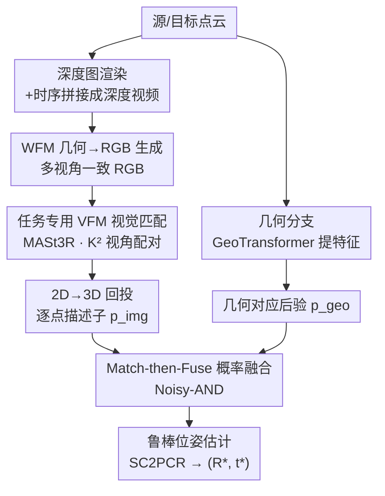

# C-GenReg: Training-Free 3D Point Cloud Registration by Multi-View-Consistent Geometry-to-Image Generation with Probabilistic Modalities Fusion

**会议**: CVPR 2026  
**arXiv**: [2604.16680](https://arxiv.org/abs/2604.16680)  
**代码**: https://github.com/yuvalH9/CGenReg （有）  
**领域**: 3D视觉 / 点云配准 / 扩散与生成先验  
**关键词**: 点云配准, 训练无关, World Foundation Model, 视觉基础模型, 概率融合

## 一句话总结
C-GenReg 用一个预训练的 World Foundation Model（Cosmos-Transfer）把输入点云的几何渲染成「多视角一致的 RGB 视图」，再交给为稠密匹配预训练的 VFM（MASt3R）提对应，并用一套 Noisy-AND 概率融合把图像分支和原始几何分支的对应后验合并起来——全程零训练、即插即用，首次让生成式配准框架成功跑在真实室外 LiDAR 上。

## 研究背景与动机

**领域现状**：点云配准的标准流水线是「特征提取 → 特征匹配 → 鲁棒位姿估计（如 RANSAC）」。深度学习时代，FCGF、Predator、GeoTransformer、RoITr 等学到的 3D 描述子已经取代了 FPFH、SHOT 这类手工特征，但流水线骨架没变，性能瓶颈仍在「特征匹配不准」。

**现有痛点**：学到的 3D 特征强烈依赖采集域——传感模态、点云密度、采集环境一变就掉点。在室内 RGB-D 上训得好的方法，换个传感器或搬到室外 LiDAR 就明显退化，跨域泛化能力差。

**核心矛盾**：图像域早已靠 Vision Foundation Model（VFM）在海量异构数据上预训练而基本攻克了泛化问题，但**3D 点云至今没有一个对应的基础模型**。于是「域依赖的 3D 特征」和「想要的零样本泛化」之间存在结构性鸿沟。

**本文目标**：在不做任何微调的前提下，把 3D 配准问题「搬」到 VFM 擅长的图像域，同时不丢掉原始点云里的几何信息，最终在室内 RGB-D 和室外 LiDAR 上都能零样本工作。

**切入角度**：几何→图像的迁移要有效，生成的 RGB 必须同时满足两点——(i) 源/目标两个视角之间**多视角一致**，(ii) 与底层 3D 结构**几何相干**。否则生成图会发散或引入几何畸变，对应就不可靠。作者观察到近年的 World Foundation Model（WFM，如 Cosmos-Transfer）天然编码了世界级先验和多视角几何推理，能从深度控制信号「开箱即用」地生成跨视角一致的 RGB——而且生成图**不必和真实场景外观一致**（颜色纹理可以不同），只要几何在不同视角间被保持。这正好满足配准所需。

**核心 idea**：用预训练 WFM 把几何转成多视角一致的 RGB（替代以往需微调才能保证一致性的单视角扩散），再用任务专用 VFM 提匹配，最后用概率融合（而非简单特征拼接）把图像分支和几何分支的对应后验合并——三者全是冻结的现成模型，零训练。

## 方法详解

### 整体框架
给定源点云 $P\in\mathbb{R}^{N\times3}$ 和目标点云 $Q\in\mathbb{R}^{M\times3}$，目标是估计刚体变换 $(R,t)\in SE(3)$ 把 $P$ 对齐到 $Q$。一旦有了可靠对应集，最优变换有闭式解（式 (1) 的最小二乘）；难点全在「怎么建立可靠对应」。C-GenReg 用**双分支 + 概率融合**来建对应：一条**生成-RGB 分支**把几何搬到图像域借 VFM 之力，一条**几何分支**直接吃原始点云保留几何归纳偏置，两条分支各自产出一张对应后验图，再被「Match-then-Fuse」融合成统一后验，最后采样互最近邻匹配、用 SC2PCR 鲁棒估计出 $(R,t)$。

### 关键设计

**1. WFM 几何→RGB 生成：用世界模型零训练换来多视角一致的辅助图像通道**

以往的生成式配准（如 GPCR）多用单视角扩散模型，缺乏处理多个几何相关视角的机制，因此**需要微调**来强制跨视角一致，否则一致性差、对应不稳。C-GenReg 直接换用 World Foundation Model——具体是 Cosmos-Transfer（Depth），它支持从分割/边缘/深度等多种模态做可控世界生成，尤其擅长从深度控制信号产出多视角一致的 RGB 视频。做法上，3DMatch/ScanNet 的点云本就是把一段时序深度帧 $\{D\}_{l=1}^{L}$ 聚合成体素/TSDF 得到的，作者就把这段时序深度序列当作 Cosmos-Transfer 的条件信号；由于 WFM 期望深度视频输入，便把源、目标两段深度序列**在时间维拼接**成一段深度视频喂进去，让模型把它当成两段相关序列联合生成。对 LiDAR 数据则挂一台虚拟相机、把 3D 点投影成深度图，模拟同样的输入格式。关键在于它**开箱即用**就保证了跨视角几何一致，从而把配准从「需要微调」推进到「零样本」，并带来跨数据集、跨传感模态的泛化。生成图的颜色纹理可以和真实场景不符——只要几何在视角间被保持就够用，因此提示词只起轻量语义稳定作用（实验证明粗略甚至最小提示几乎不掉点，只有语义完全错误的提示才显著伤精度）

**2. 任务专用 VFM 视觉匹配：用为稠密匹配预训练的 MASt3R 而非通用 VFM 提对应**

生成出 RGB 后，从图里提什么特征决定了对应质量。通用 VFM（如 DINOv2）的表征和「匹配」这个目标并不对齐，作者改用**任务专用** VFM——MASt3R，它专门为稠密、对应感知的特征而训练，归纳偏置正好压在配准最需要的地方。这里有个细节叫**视角选择**：MASt3R 通过基于交叉注意力的解码器成对处理源、目标图像，同一张源图配不同目标图会得到**不同**的特征图。为利用这一点，作者从每个域采样 $K$ 个视图、评估全部 $K^2$ 对组合，得到每域 $K^2$ 张条件化特征图（$F^{img}_n\in\mathbb{R}^{K^2\times N_n\times d_{img}}$）；由于序列内 $L$ 帧高度相关，取很小的 $K\ll L$ 就有足够视角多样性（实现里 $K=4$、$L=50$）。提完 2D 特征后再经 **2D→3D 回投**：生成 RGB 本就源自深度，用已知深度相机内参把图像特征抬回 3D，每个 3D 点取其最近图像像素的特征；因为稠密图像特征数远多于体素下采样后的点数，用最近邻查询把两个模态对齐到一致大小。消融显示任务专用 VFM 比通用模型 mean RRE/RTE 好 2–3 倍

**3. Match-then-Fuse 概率融合：先各自匹配再按概率合并，保住每个模态的归纳偏置**

把图像分支和几何分支合起来时，以往（GPCR、ZeroMatch）常做**简单特征拼接**（Fuse-then-Match），作者认为这忽略了各模态的归纳偏置和对应预测的概率本质。C-GenReg 反过来做「**先匹配、再融合**」：每个模态先各自算源-目标相似度矩阵——几何分支 $S^{geo}=F^{geo}_{src}(F^{geo}_{tgt})^\top$，图像分支取 $K^2$ 个视角对里逐点对的**最大**相似度 $S^{img}=\max_{k}F^{img}_{src,k}(F^{img}_{tgt,k})^\top$（捕获最佳跨视角匹配）——再按行 softmax 转成模态对应后验 $p^m_{ij}=\mathrm{Softmax}_j(S^m_{ij}/\tau_m)$，$\tau_m$ 是温度。两个后验在「给定真对应时条件独立」假设下做联合融合。主用的 **Noisy-AND**（Joint Posterior Fusion）偏好被两个模态**共同支持**的对应，等价于「互相印证才提高置信」：

$$p^{fuse}_{ij}=\frac{p^{img}_{ij}\,p^{geo}_{ij}(1-\pi_{ij})}{p^{img}_{ij}\,p^{geo}_{ij}(1-\pi_{ij})+\bigl(1-p^{img}_{ij}\bigr)\bigl(1-p^{geo}_{ij}\bigr)\pi_{ij}}$$

其中 $\pi_{ij}\triangleq\Pr(M_{ij}=1)$ 是先验匹配概率（无先验时取均匀 $\pi_{ij}=1/(N_{src}N_{tgt})$）。作者还给了一个 **Noisy-OR**（Disjunctive，$p^{Noisy\text{-}OR}_{ij}=1-(1-p^{img}_{ij})(1-p^{geo}_{ij})$）变体，它只要任一模态强支持就提升置信；消融里 Noisy-AND 精度略高、产出更高精度的点匹配，而配准本就靠少量高可靠对应，故定为默认。这套融合全程不训练、保留两个冻结模型各自的先验，给出**校准过**的鲁棒对应——这正是它优于早期特征拼接的根本原因

### 损失函数 / 训练策略
没有任何训练损失：WFM、VFM、几何特征提取器三者都用公开预训练权重并**全程冻结**，融合模块是闭式概率公式、不可学。实现上用 Cosmos-Transfer-v1 (Depth) 作 WFM、MASt3R 作 VFM、GeoTransformer 作几何骨干、Noisy-AND 作融合；特征维度 $d_{img}=24$、$d_{geo}=256$，VFM 分支取 $K=4$ 视图（从 $L=50$ 帧里选）、温度 $\tau_m=0.1$；位姿用 SC2PCR 鲁棒估计。整体是即插即用模块，可搭配多种配准导向的几何特征提取器。

## 实验关键数据

### 主实验

3DMatch（室内，RRE 单位 deg / RTE 单位 cm，Accuracy 为阈值内配准对占比）：

| 方法 | 输入 | RRE@5↑ | RRE@10↑ | RRE mean↓ | RTE@25↑ | RTE mean↓ |
|------|------|--------|---------|-----------|---------|-----------|
| FPFH（手工） | PC | 41.4 | 56.7 | 39.2 | 35.1 | 50.9 |
| GeoTransformer | PC | 88.9 | 91.8 | 12.0 | 90.1 | 24.6 |
| FCGF | PC | 90.4 | 93.7 | 9.4 | 91.0 | 19.2 |
| GPCR（生成式） | PC | **94.3** | 96.7 | 4.5 | 93.1 | 12.5 |
| **C-GenReg** | PC | 94.2 | **97.5** | **3.8** | **95.7** | **11.9** |
| C-GenReg-Oracle（真 RGB） | RGB-D | 95.1 | 99.6 | 2.1 | 98.3 | 7.3 |

C-GenReg 在仅用点云输入下，把 mean RRE 相比 GeoTransformer 几乎砍半（12.0 → 3.8），并在多数指标上超过同为生成式的 GPCR（仅在 RRE@5 落后 0.1pp、median RTE 略逊）。Oracle 用真实 RGB 替换生成图，给出了本流水线潜力的经验上界。

Waymo（室外 LiDAR，RRE 单位 deg / RTE 单位 m，所有学习基线在 KITTI 上训练）：

| 方法 | RRE@1↑ | RRE@2↑ | RRE mean↓ | RTE@0.6↑ | RTE mean↓ |
|------|--------|--------|-----------|----------|-----------|
| GeoTransformer | 17.0 | 39.6 | 7.3 | 2.2 | 4.1 |
| Predator | 21.0 | 49.0 | 10.0 | 1.4 | 4.9 |
| **C-GenReg** | **61.8** | **76.2** | **2.4** | **41.1** | **1.7** |

学习基线因传感器差异（光束模式/密度不同）在 Waymo 上严重退化，而 C-GenReg 的旋转/平移精度大幅领先——这是论文最大卖点：**首次让生成式配准框架在真实室外 LiDAR（无图像可用）上成功运行**。ScanNet（跨数据集泛化）上 C-GenReg 在 ScanNet Hard 取得 RRE@5=88.7、mean RRE=7.8，多数指标第一或第二。

### 消融实验（3DMatch，MASt3R 为 VFM）

| 配置 | RRE@5↑ | RRE mean↓ | RTE mean↓ | 说明 |
|------|--------|-----------|-----------|------|
| DINOv2（通用 VFM，仅图像分支） | 57.6 | 27.4 | 73.3 | 通用模型与匹配目标不对齐 |
| MASt3R（任务专用，仅图像分支） | 82.7 | 11.7 | 32.5 | 任务专用 VFM，mean RRE 好 ~2.3× |
| MASt3R + GeoTrans + Concat | 79.4 | 21.9 | 60.1 | 简单特征拼接（Fuse-then-Match） |
| MASt3R + GeoTrans + Noisy-OR | 94.2 | 3.9 | 12.1 | 概率融合（并式） |
| **MASt3R + GeoTrans + Noisy-AND（完整）** | **94.2** | **3.8** | **11.9** | 默认配置 |

### 关键发现
- **任务专用 VFM 是第一性的**：DINOv2 换成 MASt3R/RoMa，mean RRE 从 27.4 降到 9–12（约 2–3×），说明特征要和「匹配」目标对齐，而非泛泛的语义表征。
- **概率融合 >> 特征拼接**：在 GeoTransformer 几何特征上，Concat 的 mean RRE 21.9 → Noisy-AND 3.8，最高约 5× 提升；Noisy-AND 比 Noisy-OR 精度略高、点匹配更精确，因为「相互印证才提高置信」更契合「配准靠少量高可靠对应」的本质。
- **几何骨干可换**：把生成-RGB 分支接到 FCGF/Predator/GeoTransformer 上都比各自原始基线涨点，说明 C-GenReg 是通用的「性能增强器」；其中 GeoTransformer 最好，定为默认。
- **提示词鲁棒**：把详细场景描述换成「一个厨房」乃至「室内场景」几乎不掉点，只有语义完全错误的「雪林」才显著伤精度——说明只需粗略语义上下文（通常可从元数据/采集环境推断）。

## 亮点与洞察
- **「生成图不必逼真、只需几何一致」是关键解放**：把生成目标从「外观保真」降到「跨视角几何相干」，正好踩在 WFM 开箱即用的能力上，从而摆脱了 GPCR 那种为多视角一致而做的微调——这是它能零样本跨域的根因。
- **拿配准任务专用的 MASt3R 当 VFM，而不是热门的 DINOv2**，把 VFM 的归纳偏置精准对齐到「找稠密对应」，消融里 2–3× 的差距很有说服力，可迁移到任何「先生成图、再在生成图上做匹配/几何任务」的设置。
- **Match-then-Fuse 概率框架**：把多模态融合从「拼特征」抬到「拼后验」，用条件独立假设导出 Noisy-AND/Noisy-OR 两个闭式公式，既保留各模态先验又给校准置信、零训练——这套思路可复用到任何需要融合多个独立预测器的零样本系统。
- **首次跑通真实 LiDAR**：在没有真实图像的室外场景，用虚拟相机投影深度→WFM 生成 RGB，硬是把「图像域 VFM 的红利」引到了 LiDAR 配准，Waymo 上对学习基线碾压式领先。

## 局限与展望
- **计算开销**：$K^2$ 视角对组合 + WFM 视频生成都不便宜，作者靠 $K\ll L$（$K=4$）压成本，但相比纯几何方法的额外推理代价（WFM + VFM 两个大模型前向）仍可观，论文把 runtime 分析放进附录。
- **依赖 WFM 的多视角一致性**：整套方法的可靠性建立在 Cosmos-Transfer「开箱即用就跨视角一致」这一前提上；若场景超出 WFM 世界先验覆盖（极端稀疏、强反光、非常规几何），生成图一致性能否维持值得存疑。
- **LiDAR 适配是简化设置**：室外用单个前向虚拟相机投影深度，视场受限；多相机/全景投影下的表现、以及低重叠极端工况（部分放在附录）还需更多验证。
- **Oracle 与生成版的差距**：C-GenReg-Oracle（真 RGB）明显优于生成版（mean RRE 2.1 vs 3.8），说明生成图与真实图仍有质量差，提升生成保真/几何相干度有进一步空间。

## 相关工作与启发
- **vs GPCR（首个几何→图像生成式配准）**：GPCR 用扩散模型从深度合成 RGB，但要**微调**来强制跨视角一致，且用简单特征拼接融合。C-GenReg 改用预训练 WFM 开箱即用拿多视角一致（零微调）、用任务专用 VFM 提对应、用概率 Match-then-Fuse 替代拼接——更泛化、能跨模态、首次上 LiDAR。
- **vs ZeroMatch / FreeReg**：两者也用生成先验，但都**依赖真实 RGB 观测**（ZeroMatch 用 SD 增强真实 RGB 做 RGB-D 跨视配准；FreeReg 桥接 RGB↔depth 模态差），任务和「仅点云输入」的 C-GenReg 不同。C-GenReg 不需要任何真实图像。
- **vs 纯几何学习法（GeoTransformer / FCGF / Predator / RoITr）**：这些方法域依赖、跨传感器/室内外迁移即退化；C-GenReg 借图像域 VFM 的泛化把它们当可插拔的几何分支，并稳定地涨点，相当于给现有几何配准器加了一个零训练的增强模块。
- **vs RGB-D 多模态法（PointMBF / ColorPCR）**：它们联合真实彩色和几何做匹配，但都需真实 RGB 输入和任务专用训练；C-GenReg 在「只有点云」时用生成 RGB 顶上，且零训练。

## 评分
- 新颖性: ⭐⭐⭐⭐⭐ 用 WFM 拿多视角一致 RGB + 任务专用 VFM + 概率 Match-then-Fuse 的组合是清晰的新范式，首次跑通真实 LiDAR。
- 实验充分度: ⭐⭐⭐⭐ 室内（3DMatch/ScanNet）+ 室外（Waymo）+ VFM/几何骨干/融合算子三组消融 + 提示鲁棒性都覆盖，仅低重叠等放在附录。
- 写作质量: ⭐⭐⭐⭐⭐ 动机层层递进、概率融合公式推导清楚、图文对应到位。
- 价值: ⭐⭐⭐⭐⭐ 零训练即插即用、能给现有几何配准器通用增强、并打开了「生成式配准上 LiDAR」的实用大门。

<!-- RELATED:START -->

## 相关论文

- [\[CVPR 2026\] Hg-I2P: Bridging Modalities for Generalizable Image-to-Point-Cloud Registration via Heterogeneous Graphs](hg-i2p_bridging_modalities_for_generalizable_image-to-point-cloud_registration_v.md)
- [\[CVPR 2026\] SuP: Sub-cloud Driven Point Cloud Registration](sup_sub-cloud_driven_point_cloud_registration.md)
- [\[CVPR 2026\] MHopReg: Efficient Hierarchical Multi-Hop Graph Search for Point Cloud Registration](mhopreg_efficient_hierarchical_multi-hop_graph_search_for_point_cloud_registrati.md)
- [\[CVPR 2026\] Generalized-CVO: Fast and Correspondence-Free Local Point Cloud Registration with Second Order Riemannian Optimization](generalized-cvo_fast_and_correspondence-free_local_point_cloud_registration_with.md)
- [\[CVPR 2026\] Intrinsic Image Fusion for Multi-View 3D Material Reconstruction](intrinsic_image_fusion_for_multi-view_3d_material_reconstruction.md)

<!-- RELATED:END -->
