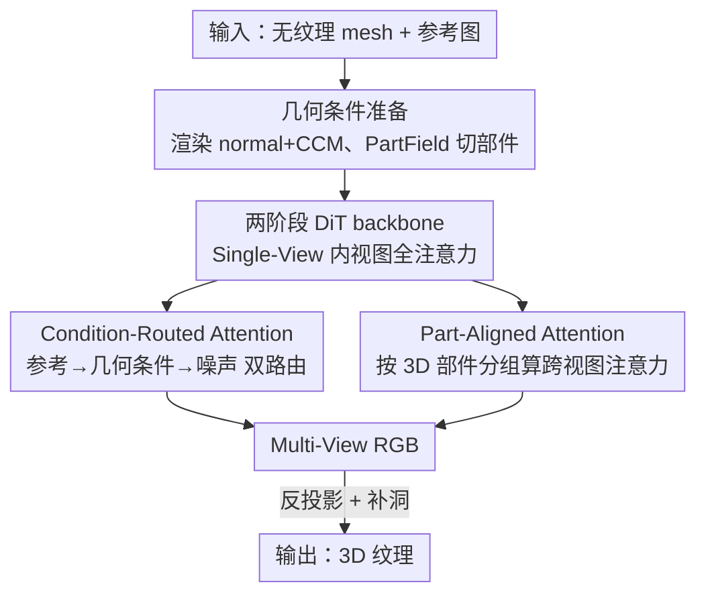

# CaliTex: Geometry-Calibrated Attention for View-Coherent 3D Texture Generation

**会议**: CVPR 2026  
**论文**: [CVF Open Access](https://openaccess.thecvf.com/content/CVPR2026/html/Liu_CaliTex_Geometry-Calibrated_Attention_for_View-Coherent_3D_Texture_Generation_CVPR_2026_paper.html)  
**代码**: 项目页 <https://calitex-project.github.io>（未见开源 repo）  
**领域**: 3D视觉 / 扩散模型  
**关键词**: 3D纹理生成, 多视图扩散, 注意力机制, 几何一致性, 部件先验

## 一句话总结
CaliTex 把"跨视图纹理不一致"的根因诊断为多视图扩散里**无差别全注意力造成的注意力歧义**，提出两种几何校准的注意力——Part-Aligned Attention（按 3D 语义部件分组算跨视图注意力）和 Condition-Routed Attention（让参考图外观先经几何条件中转再注入噪声），在两阶段 DiT 上把几何一致性变成网络的内在行为，纹理保真度与跨视图一致性全面超过开源和商业基线。

## 研究背景与动机

**领域现状**：当前主流的 3D 纹理生成走"两阶段"范式——先生成几何，再以几何为条件生成纹理。具体做法是用图像扩散模型（FLUX、SD 等）的 2D 先验合成多张视图图像，再把它们反投影（reprojection）回 mesh 表面拼成纹理图。这条线借助强大的 2D 生成先验，外观质量很高。

**现有痛点**：这套流程经常在**跨视图一致性**上崩掉——同一块表面区域在不同生成视图里长得不一样，反投影回去后就出现接缝（seam）和模糊。作者强调这类瑕疵不是渲染问题，而是模型内部"表示层面的对不齐"。

**核心矛盾**：现有 SOTA（UniTEX、MV-Adapter 等）简单地把**全注意力**无差别地撒在所有 token 和所有视图上，假设"对应关系会自己涌现"。但这个前提不成立，反而带来两类注意力歧义：① **跨视图歧义**——几何相似但语义不同的区域（如左肢和右肢）会互相 attend，模型把它们当成同一处，生成几乎一样的局部纹理，混合反投影后落到不一致的表面区域，产生接缝；② **跨模态歧义**——噪声 token 时而 attend 参考图、时而 attend 几何条件，导致要么外观过拟合（直接抄参考图视觉模式）、要么几何过度依赖（丢外观保真度），生成"看着真但几何不对"的纹理。

**本文目标**：在不引入额外监督或手工先验的前提下，让纹理生成的几何一致性从"训练副产品"变成"网络固有属性"。

**切入角度**：作者认为几何一致性不会自动从训练中产生，需要**架构层面的校准**。与其加监督，不如**重新设计注意力本身让它几何感知**——告诉模型"该看哪里"以及"信息怎么在模态间流动"。

**核心 idea**：用"几何校准的注意力"代替"无差别全注意力"，从空间（按部件分组）和信息流（按几何条件路由）两个层面，把 3D 结构显式注入注意力计算。

## 方法详解

### 整体框架

CaliTex 要解决的是：给一个无纹理 mesh 和一张参考图，生成 6 张几何对齐、跨视图一致的视图图像，再反投影+补洞拼成纹理。整体仍是"多视图扩散 + 反投影"的骨架，关键创新落在**两阶段 DiT 的注意力设计**上。

输入侧：从 mesh 在 6 个预定义视角渲染 normal map 和 canonical coordinate map（CCM），二者取平均后经 VAE 编码成几何条件 latent $z_{\text{cond}}$；参考图编码成 $z_{\text{ref}}$ 并复制 6 份；噪声 latent 记为 $z_t$。三者沿序列维拼接得 $\hat{z}_t \in \mathbb{R}^{6\times 3L\times C}$（$L$ 为每视图 token 数，$C$ 为特征维，6 个视图铺在 batch 维）。同时用 PartField 把 mesh 切成语义部件并渲染成"部件着色图"，给每个 token 打上部件标签，供后续 PAA 用。

两阶段处理：**Single-View DiT** 先做 batch-wise 全注意力，在每个视图内部捕捉噪声/条件/参考三者的局部语义；随后展开 batch 维、把所有视图的噪声+条件 latent 和视图平均的参考 latent 拼成 $\tilde{z}_{\text{mv}} \in \mathbb{R}^{1\times 13L\times C}$，送入 **Multi-View DiT**，这里用 **Condition-Routed Attention（CRA）**和 **Part-Aligned Attention（PAA）**强制跨视图与跨模态一致。最后把噪声 latent 部分 $z'_{\text{img}}$ 解码成 6 张多视图 RGB，反投影到表面、补洞，得到最终纹理。整网用 flow-matching 目标训练。

### 关键设计

**1. 两阶段 DiT backbone：先把"视图内"和"视图间"两件事拆开做**

痛点是：如果一上来就在所有视图、所有模态间做全注意力，模型既要管视图内的局部语义、又要管跨视图对齐，两件难度不同的事搅在一起，正是注意力歧义的温床。CaliTex 基于 FLUX.1-Kontext 微调，把过程拆成两段：Single-View DiT 阶段把 6 个视图铺在 batch 维，做 **batch-wise 全注意力**，只在单个视图内部对齐噪声、几何条件、参考三种 latent，先把"视图内语义"这件相对容易的事做扎实；Multi-View DiT 阶段才展开 batch 维、把所有视图的噪声+条件 latent 与视图平均参考 latent 拼成长序列 $\tilde{z}_{\text{mv}} \in \mathbb{R}^{1\times 13L\times C}$，专门处理"跨视图、跨模态一致"。几何条件用 normal map 和 CCM 平均后 VAE 编码而非额外网络，保持轻量；整个 backbone 只加 rank=16 的 LoRA 适配器。这个拆分让后面两个校准注意力有清晰的作用边界——它们都只装在 Multi-View DiT 里。

**2. Condition-Routed Attention（CRA）：让参考图的外观必须"过一遍几何条件"再去指导生成**

针对的是跨模态歧义——噪声 token 在参考图和几何条件之间摇摆，要么照抄参考视觉、要么丢外观。CRA 的做法是把 Multi-View DiT 里原本的全注意力改成**两条并行路径**，强制外观信息"以几何为中介"流动。具体把 token 分成两组：① **condition–reference 组**，先在几何条件与参考 token 间做自注意力，把参考图的视觉先验和几何先验融合，捕捉"几何条件下应有的外观"：

$$\text{Attn}_{\text{c-r}} = \text{Softmax}\!\left(\frac{Q_{\text{c-r}} K_{\text{c-r}}^{\top}}{\sqrt{d}}\right) V_{\text{c-r}}$$

② **noise–condition 组**，把上一步得到的几何感知特征再注入噪声 latent，引导生成朝几何对齐的方向走（这一支的注意力 $\text{Attn}_{\text{n-c}}$ 由 PAA 实现，见设计 3）。两支输出合并为

$$\text{Attn}_{\text{CRA}} = \text{Attn}_{\text{n-c}} \cup \text{Attn}_{\text{c-r}}$$

其中 $\cup$ 表示每对 token 之间只算一次注意力。这套双路由贯穿 Multi-View DiT 的全部 38 个注意力块：每块里参考 token 的视觉先验先融进几何条件 token，下一块再用融合后的条件 token 去指导生成。关键在于：噪声 token **不再直接** attend 参考图，参考外观永远被几何条件"过滤"一遍，从而压住"直接抄参考"，让纹理始终贴合底层 3D 表面。

**3. Part-Aligned Attention（PAA）：按 3D 语义部件给跨视图注意力划"势力范围"**

针对跨视图歧义——左肢/右肢这种几何相似但语义不同的区域会跨视图互相 attend，被当成同一处。PAA 的思路是用**部件级几何先验**把跨视图注意力约束在同一个 3D 语义部件内。先用 PartField 把 mesh $M$ 分解成 $K$ 个语义部件（取 $K=20$，适配大多数常见物体）：$M = \{P_1, \dots, P_K\}$，每个面 $f \in P_k$ 拿到部件索引 $k$；渲染时同一部件的所有面在 6 个视图里着同一种颜色，得到"部件着色图"。在 latent 准备阶段，把条件/参考图经 VAE（下采样因子 $F$）编码、再切成 $P\times P$ 的 patch（每个 token 对应一块 $FP\times FP$ 的图像区域）。对每个 token $t_i$，只要它对应 patch 内有任一像素属于部件 $k$，就把它归入组 $G_k$：

$$G_k = \{t_i \mid \exists\, p \in \text{Patch}(t_i),\ c(p) = k\},\quad k=1,\dots,K$$

注意一个 token 可同时属于多个部件组（落在部件边界时）。然后**在每个部件组内**对噪声+条件 latent 做自注意力 $\text{Attn}_k = \text{Softmax}(Q_k K_k^{\top}/\sqrt{d})\,V_k$，把所有组的结果并起来得 $\text{Attn}_{\text{PAA}} = \bigcup_{k=1}^{K}\text{Attn}_k$。为了不丢全局感知，再对每个视图内部保留一份视图内全注意力 $\text{Attn}^{(v)}_{\text{intra}}$，最终噪声–条件支的注意力为

$$\text{Attn}_{\text{n-c}} = \text{Attn}_{\text{PAA}} \cup \text{Attn}_{\text{intra}}$$

这样跨视图注意力被限制在"小而语义连贯的 3D 局部"里，相似但不同的部件不会再互相串扰，对称/自遮挡物体的纹理因此一致。

### 损失函数 / 训练策略
噪声 latent 部分 $z'_{\text{img}}$ 作为预测目标，用 flow-matching 目标训练：$\mathcal{L}(\theta) = \mathbb{E}_{t,z_0,\epsilon}\big[\lVert z'_{\text{img}} - (\epsilon - z_0)\rVert^2\big]$。backbone 从 FLUX.1-Kontext 初始化，仅训练 rank=16 的 LoRA。训练数据从 Objaverse-XL 和 Texverse 选 80k 物体，每个渲染 6 个预定义视角（768×768）作 GT 多视图，另随机渲一个视角作参考；反投影+补洞模块沿用 Lumitex。8 卡约 600 GPU 小时。

## 实验关键数据

### 主实验
在 Objaverse 物体 + 高质量游戏资产的测试集上评估，每个 mesh 从 32 视角渲染与 GT albedo 对比；为公平对比 PBR 方法，用无光照 albedo 渲染作参考图。指标含 FID / CLIP-FID / CMMD / CLIP-I / LPIPS，外加 25 人用户研究（1–5 分，评纹理质量 Qual、几何对齐 GeoAlign、多视图一致性 MV-Cons）。

| 方法 | FID↓ | CLIP-FID↓ | CMMD↓ | CLIP-I↑ | LPIPS↓ | Qual↑ | GeoAlign↑ | MV-Cons↑ |
|------|------|-----------|-------|---------|--------|-------|-----------|----------|
| Step1X-3D | 254.1 | 28.23 | 3.914 | 0.8433 | 0.3154 | 2.06 | 2.09 | 2.07 |
| UniTEX | 176.2 | 17.19 | 1.156 | 0.8818 | 0.3335 | 3.10 | 3.21 | 3.15 |
| MV-Adapter | 169.4 | 13.61 | 0.747 | 0.8975 | 0.2939 | 3.02 | 3.03 | 2.88 |
| Hunyuan3D-2.1 | 167.4 | 16.21 | 1.067 | 0.8867 | 0.3215 | 2.48 | 2.60 | 2.51 |
| **CaliTex（本文）** | **157.8** | **12.85** | **0.672** | **0.9106** | **0.2508** | **4.53** | **4.47** | **4.52** |

CaliTex 在全部 5 个客观指标和 3 个主观维度上均最优；用户研究的差距尤其大（Qual 4.53 vs 次优 3.10），说明在人眼感知上"无接缝、几何对齐"的优势远比客观指标显示的更明显。定性对比中，MV-Adapter / Hunyuan3D 在复杂几何区域纹理发糊、UniTEX 过度平滑丢细节且有可见接缝，而 CaliTex 几乎保留参考图所有细节、接缝最少。

### 消融实验
作者自定义 **MV-MSE**（Multi-View Mean Squared Error）衡量像素级跨视图一致性：对 6 个视角中每对视图 $(i,j)$，在"3D 位置对应"的像素集 $\Omega_i(j)$ 上算 $\lVert I_i(p) - I_j(\pi_j(X_p))\rVert_2^2$ 并平均（$X_p$ 是像素 $p$ 的 3D 位置，$\pi_j$ 投到视图 $j$）：

$$\text{MV-MSE} = \frac{2}{N(N-1)}\sum_{(i,j)} \frac{1}{|\Omega_i(j)|}\sum_{p\in\Omega_i(j)} \lVert I_i(p) - I_j(\pi_j(X_p))\rVert_2^2$$

| 配置 | MV-MSE↓ | 说明 |
|------|---------|------|
| Full（本文） | **0.0384** | 完整模型 |
| w/o Part-Aligned | 0.0415 | 去掉 PAA，跨视图一致性变差（+0.0031） |
| w/o Condition-Routed | 0.0403 | 去掉 CRA，几何-纹理对齐变差（+0.0019） |

### 关键发现
- **PAA 对跨视图一致性贡献更大**：去掉 PAA 后 MV-MSE 升幅（+0.0031）大于去掉 CRA（+0.0019），与"PAA 直接约束跨视图注意力、CRA 主要管跨模态对齐"的分工一致；定性上去掉 PAA 会让几何相似区域被错误对齐成同一处，产生伪影。
- **CRA 主治几何-纹理失配**：去掉 CRA 后生成视图与几何条件不一致，正是"参考外观没经几何中转"导致的直接抄袭/几何偏移。
- **两模块互补**：一个管"空间该看哪里"（PAA），一个管"信息怎么流"（CRA），合起来才把对称、自遮挡这类最难的几何也做对。

## 亮点与洞察
- **把工程瑕疵（接缝）追溯到注意力机制层面**：作者没有像很多工作那样去改反投影/补洞后处理，而是论证接缝源于"无差别全注意力"造成的表示对不齐，从根因下手——这个诊断本身就是论文最有价值的洞察。
- **几何先验注入注意力的两种正交方式**：PAA 改"注意力的连接结构"（按部件分组限制 attend 范围），CRA 改"注意力的信息流向"（强制外观经几何中转）。空间维 + 信息流维的拆分干净利落，可迁移到任何"多模态 + 多视图"的生成任务（如多视图 PBR 材质、4D 生成）。
- **零额外监督、靠架构拿一致性**：不加 loss、不加手工先验，只重排注意力的分组与路由，就把几何一致性变成网络固有行为，工程上很轻（只加 rank-16 LoRA，600 GPU 小时）。

## 局限与展望
- 部件数 $K=20$ 是手工固定值，作者称"适配大多数常见物体"，但对部件数远超 20 的超复杂场景（如密集机械、植被）是否够用、$K$ 敏感性如何，论文未给消融。⚠️ 以原文为准。
- PAA 依赖 PartField 的 3D 分割质量——若部件分割本身出错（边界乱、过分割），错误会直接传导到注意力分组里，论文未讨论分割失败时的鲁棒性。
- 评测虽含游戏资产，但训练/测试都偏 Objaverse 系，对真实扫描 mesh（噪声几何、非流形）的泛化未验证。
- CRA 的双路径合并 $\cup$（每对 token 只算一次注意力）的具体工程实现放在补充材料，正文只给了概念式融合，复现需依赖补充细节。

## 相关工作与启发
- **vs UniTEX**：UniTEX 走两阶段"多视图扩散 + 基于 transformer 的 Large Texturing Model 在 3D 空间预测纹理函数"，能规避自遮挡但受限于 3D 纹理训练数据稀缺、质量偏低且过度平滑、跨视图有接缝；CaliTex 仍借 2D 生成先验保质量，但靠几何校准注意力把一致性补上，FID 157.8 vs 176.2、用户 Qual 4.53 vs 3.10。
- **vs Romantex / AlignTex**：Romantex 用 3D-aware RoPE 注入空间信息 + 几何相关 CFG 增强对齐，AlignTex 在扩散过程里融合图像与几何特征；它们都在"特征层"增强几何感知，CaliTex 则直接改"注意力的分组与路由结构"，更显式地控制 token 之间能不能 attend、信息往哪流。
- **vs SeqTex / Elevate3D**：SeqTex 直接在 UV 空间生成纹理绕开反投影，但依赖自动 UV 展开（xatlas）易碎片化降质；Elevate3D 迭代精修单视图并改几何保持一致，可能无意改动原始几何细节。CaliTex 不改 UV 流程也不改几何，只在多视图生成阶段把一致性做对。

## 评分
- 新颖性: ⭐⭐⭐⭐⭐ 把跨视图接缝追溯到注意力歧义，并用部件分组 + 条件路由两个正交机制系统化解决，诊断与方法都很到位。
- 实验充分度: ⭐⭐⭐⭐ 客观+主观指标齐全、对比含商业模型，但消融只有 MV-MSE 一个量化表，$K$ 与分割质量的敏感性缺失。
- 写作质量: ⭐⭐⭐⭐⭐ 问题诊断（两类歧义）→ 两个机制对应解决，逻辑闭环、图文清晰。
- 价值: ⭐⭐⭐⭐⭐ 接缝/几何对齐是 3D 纹理生成的核心痛点，方法轻量易迁移，对工业级资产生成有直接价值。

<!-- RELATED:START -->

## 相关论文

- [\[CVPR 2026\] NaTex: Seamless Texture Generation as Latent Color Diffusion](natex_seamless_texture_generation_as_latent_color_diffusion.md)
- [\[CVPR 2026\] Block-Sparse Global Attention for Efficient Multi-View Geometry Transformers](block-sparse_global_attention_for_efficient_multi-view_geometry_transformers.md)
- [\[CVPR 2026\] MatLat: Material Latent Space for PBR Texture Generation](matlat_material_latent_space_for_pbr_texture_generation.md)
- [\[CVPR 2026\] Human Geometry Distribution for 3D Animation Generation](human_geometry_distribution_for_3d_animation_generation.md)
- [\[CVPR 2026\] FlashVGGT: Efficient and Scalable Visual Geometry Transformers with Compressed Descriptor Attention](flashvggt_efficient_and_scalable_visual_geometry_transformers_with_compressed_descr.md)

<!-- RELATED:END -->
