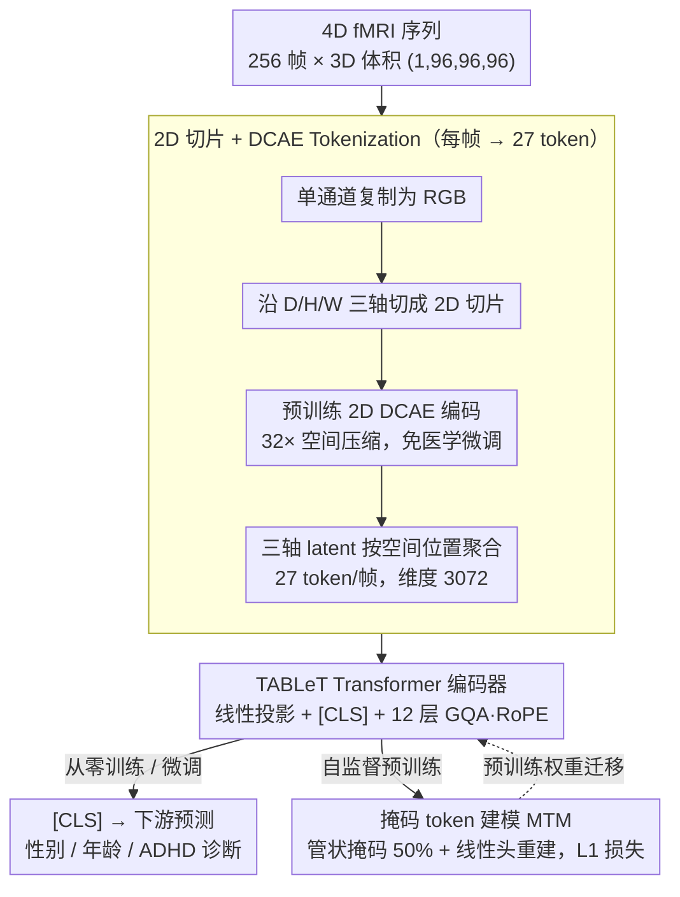

# Can Natural Image Autoencoders Compactly Tokenize fMRI Volumes for Long-Range Dynamics Modeling?

**会议**: CVPR 2026  
**arXiv**: [2604.03619](https://arxiv.org/abs/2604.03619)  
**代码**: [GitHub](https://github.com/beotborry/TABLeT)  
**领域**: 3D视觉  
**关键词**: fMRI分析, 自编码器迁移, 长序列建模, Transformer, 掩码token建模

## 一句话总结
提出 TABLeT，利用预训练的 2D 自然图像自编码器（DCAE）将 3D fMRI 体积压缩为仅 27 个连续 token，配合简单 Transformer 编码器实现前所未有的长时序建模（256 帧），在 UKB、HCP、ADHD-200 上多任务超越 SOTA 体素方法，且计算效率大幅提升。

## 研究背景与动机
**领域现状**: fMRI 分析方法分为 ROI 方法和体素方法。ROI 方法（BrainNetCNN、BNT 等）高效但损失空间信息；体素方法（TFF、SwiFT）保留完整信息但内存需求极大，只能处理 ~20 个时间帧。

**现有痛点**: fMRI 是 4D 信号（3D 空间 + 时间），体素方法因显存限制只能处理极短时间窗口（20 帧），无法捕捉重要的长程时序动态（如超慢 BOLD-LFP 耦合、全脑觉醒波）。

**核心矛盾**: 要建模长时序就需要压缩空间维度，但过度压缩会丢失关键空间信息（ROI 方法的老问题）。如何实现高压缩比同时保留足够信息？

**本文要解决**: 设计一种 fMRI 体积的紧凑 tokenization 方案，使 Transformer 能在有限显存下处理显著更长的时间序列。

**切入角度**: 一个反直觉的发现——自然图像预训练的 2D 自编码器（未经任何医学数据微调）可以有效地 tokenize fMRI 体积！

**核心idea**: 将 3D fMRI 体积沿三个轴切片为 2D 图像，用预训练 DCAE（32× 空间压缩比）编码，再重组为 27 个 token/帧，实现 256 帧长序列输入。

## 方法详解

### 整体框架

这篇论文要解决 fMRI 长时序建模的老大难：体素方法保留完整空间信息但显存爆炸，只能处理 ~20 帧。TABLeT 的思路是把空间维度狠狠压缩出来、腾出预算给时间。整条 pipeline 分三段：① **tokenization**——把 4D fMRI 逐帧沿三个轴切成 2D 图像，用一个**预训练的 2D 自然图像自编码器**（DCAE，未在医学数据上微调）编码，再按空间位置聚合成每帧仅 27 个 token；② **Transformer 编码器**——压缩既已在 tokenization 阶段完成，下游只用一个标准 Transformer 吞下 256 帧 × 27 token 的超长序列，用 [CLS] token 做下游预测；③ **自监督预训练**——直接在 token 空间做掩码重建（MTM），再迁移到下游微调。其中"自然图像 AE 竟能直接 tokenize fMRI"是支撑整套方案成立的反直觉前提：它让昂贵的医学专用 AE 训练变得不必要。

### 关键设计

**1. 2D 切片 + DCAE Tokenization：把每帧压到 27 个 token**

这是 TABLeT 的命门，对应框架图的 `TOK` 分组——压缩重任全压在这一段。体素方法每帧上万个 token，根本喂不进长序列。做法是把单通道 fMRI 复制为 RGB，**沿 D/H/W 三轴分别切片**，用 DCAE 把每个 2D 切片编码为 $C' \times \frac{H}{32} \times \frac{W}{32}$ 的潜在表示，再把三轴的 latent 按"同一空间位置"聚合、拼接。$H=W=D=96$、$C'=32$ 时，三轴聚合后落在同一个 $\frac{96}{32}\times\frac{96}{32}\times\frac{96}{32}=3\times3\times3=27$ 的下采样网格上，每帧仅 **27 个 token**、每个 token 维度 $96 \times C' = 96 \times 32 = 3072$（对比 SwiFT 的约 12K 体素 token）。

这套方案能成立靠的是一个**反直觉的经验发现**：未经任何医学数据微调的 2D DCAE，在 fMRI 上的重建质量竟与专门训练的 3D DCAE 相当，粗粒度空间细节和全局功能模式都保留得住（见消融）。原因在于自然图像预训练的 AE 学到的是**通用的低级空间特征提取能力**，跨域可迁移，并不依赖"见过脑图像"——于是既省去了昂贵又数据饥渴的医学专用 AE 训练，又靠三轴切片让每个空间位置被三个方向覆盖、压这么狠也没丢关键信息。tokenization 只跑一次并缓存，后续训练几乎零额外开销。

**2. TABLeT Transformer 架构：tokenization 扛了压缩，下游用标准件即可**

对应框架图的 `F` 节点。既然 tokenization 已经完成压缩，下游就不需要花哨结构。这里用标准 Transformer 编码器（12 层、14 个注意力头、2 个 KV 头的分组查询注意力 GQA）配现代 LLM 组件：旋转位置编码 RoPE、`F.scaled_dot_product_attention`。输入 token 先归一化、经线性投影降维，前缀一个 [CLS] token 再做一次归一化稳定训练，直接处理 $T=256$ 帧（对比 SwiFT 的 $T=20$）。GQA 用更少的 KV 头换长序列下的显存与速度，是能把序列拉到 256 帧的关键工程选择。训练时每次随机采 256 帧，验证时把全序列分段过模型再平均。

**3. 自监督预训练（掩码 token 建模 MTM）：直接在 token 空间做掩码重建**

对应框架图的 `H` 分支。受 SimMIM 的掩码图像建模（MIM）启发，但**不在像素/patch 上掩码，而是直接掩码 DCAE 输出的 token**：随机把 50% 的 token 替换为可学习的 [MASK] token，让 Transformer + 线性头重建被掩的 token，损失只算在被掩 token 上 $L = \frac{1}{\Omega(\mathbf{Z}_M)} \|\mathbf{y}_M - \mathbf{Z}_M\|_1$。关键技巧是**管状掩码**（tube masking，同一空间位置的掩码模式跨帧一致），防止模型靠相邻帧同位置的未掩 token"作弊"。直接在已压缩的 token 空间做 MTM，省去了反复加载图像编码器/解码器，整个预训练流程被大幅简化；在 UKB 上预训练后迁到下游微调即可。

### 损失函数 / 训练策略
- 分类任务: 交叉熵损失
- 回归任务: MSE 损失
- 预训练: $\ell_1$ 掩码重建损失
- 训练时随机采样 256 帧，验证时分段处理全序列并平均

## 实验关键数据

### 主实验

| 方法 | UKB Sex ACC | UKB Age MAE↓ | HCP Sex ACC | HCP Age ρ↑ | ADHD ACC |
|------|------------|-------------|------------|-----------|---------|
| BNT (ROI) | 92.4 | 0.588 | 86.3 | 0.444 | 63.6 |
| SwiFT (T=20) | 97.4 | 0.480 | 93.1 | 0.450 | 63.3 |
| SwiFT (T=50) | 98.1 | 0.477 | 92.2 | 0.460 | 63.9 |
| **TABLeT (T=256)** | 97.7 | **0.466** | **93.8** | **0.473** | **65.8** |

### 消融实验（预训练效果，HCP）

| 配置 | Sex ACC | Age ρ↑ | Intelligence ρ↑ |
|------|---------|--------|-----------------|
| TABLeT 从零训练 | 93.8 | 0.473 | 0.392 |
| TABLeT 预训练+微调 | **95.3** | **0.552** | **0.435** |

| 对比 | HCP Sex | ADHD Diagnosis | 说明 |
|------|---------|---------------|------|
| 2D DCAE tokenizer | **93.8** | **65.8** | 自然图像 AE |
| 3D DCAE tokenizer | 93.5 | 65.6 | fMRI 专用 AE |

### 关键发现
- TABLeT 在多数任务上超越或持平所有基线（ROI + 体素方法）
- 长时序建模（256 vs 20 帧）在智力预测和 ADHD 诊断上提升最大，说明这些任务需要更长的时间依赖
- 2D 自然图像 DCAE 与 3D fMRI DCAE 效果几乎相同——验证了核心假设
- 预训练显著提升下游性能，特别是在年龄回归（ρ 从 0.473 到 0.552）
- 计算效率: 相同输入规模下，TABLeT 内存和计算远低于 SwiFT

## 亮点与洞察
- "自然图像 AE 可 tokenize fMRI"的发现本身就很有启发性，暗示低级视觉特征提取能力具有跨域迁移性
- 27 token/帧的极致压缩使长序列建模成为现实（256 帧 vs 20 帧）
- 管状掩码策略的设计防止了时序维度的信息泄漏
- 实验覆盖三个大规模数据集（UKB 8K+、HCP 1K+、ADHD-200 533）和多种任务

## 局限与展望
- 整体提升较为温和（作者坦承）——可能因为静息态 fMRI 本身信号较弱
- 仅在静息态 fMRI 上验证，任务态 fMRI（更强的时序动态）可能收益更大
- DCAE 冻结不微调，可能丢失 fMRI 特有的低级特征
- 空间信息在 tokenization 中被大幅压缩，精细空间分析能力受限
- 可探索将 TABLeT 用于脑功能连接组学分析

## 相关工作与启发
- SwiFT 是最强体素基线，但受限于 4D 窗口注意力的内存需求
- DCAE 的 32× 压缩在图像生成领域被设计用于加速扩散模型，这里用于 fMRI 是新应用
- MAE/VideoMAE 的掩码预训练范式被成功迁移到 fMRI token 空间
- 启示：预训练模型的迁移能力可能比我们想象的更强——即使跨越"自然图像"和"脑功能成像"

## 评分
- 新颖性: ⭐⭐⭐⭐⭐ "自然图像 AE tokenize fMRI"的发现和验证非常新颖
- 实验充分度: ⭐⭐⭐⭐ 三个数据集、多种任务、预训练消融、AE 对比，但提升幅度温和
- 写作质量: ⭐⭐⭐⭐ 问题动机清晰，实验设计严谨
- 价值: ⭐⭐⭐⭐ 为 fMRI 长序列建模开辟了新路径，核心发现有广泛启示

<!-- RELATED:START -->

## 相关论文

- [\[CVPR 2026\] MoRel: Long-Range Flicker-Free 4D Motion Modeling via Anchor Relay-based Bidirectional Blending with Hierarchical Densification](morel_long-range_flicker-free_4d_motion.md)
- [\[CVPR 2026\] Long-SCOPE: Fully Sparse Long-Range Cooperative 3D Perception](long_scope_fully_sparse_long_range_cooperative_3d_perception.md)
- [\[CVPR 2026\] Modeling Spatiotemporal Neural Frames for High Resolution Brain Dynamics](modeling_spatiotemporal_neural_frames_for_high_resolution_brain_dynamic.md)
- [\[CVPR 2026\] VENI: Variational Encoder for Natural Illumination](veni_variational_encoder_for_natural_illumination.md)
- [\[CVPR 2026\] RnG: A Unified Transformer for Complete 3D Modeling from Partial Observations](rng_a_unified_transformer_for_complete_3d_modeling_from_partial_observations.md)

<!-- RELATED:END -->
