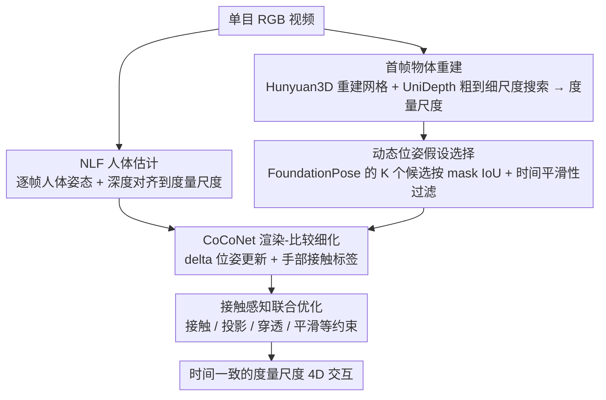

# CARI4D: Category Agnostic 4D Reconstruction of Human-Object Interaction

**会议**: CVPR 2026  
**arXiv**: [2512.11988](https://arxiv.org/abs/2512.11988)  
**代码**: [项目页面](https://nvlabs.github.io/CARI4D/)  
**领域**: 三维视觉 / 人体理解  
**关键词**: 人物交互重建, 类别无关, 单目视频, 4D跟踪, 接触推理

## 一句话总结

提出CARI4D，首个类别无关的方法，从单目RGB视频中重建度量尺度的4D人物交互——包括物体形状重建、位姿跟踪、手部接触推理和物理约束优化，零样本泛化到未见类别。

## 研究背景与动机

从单目视频捕获人物交互对游戏、机器人学习和人体理解至关重要，但面临三大挑战：人体和物体的形状/姿态变化巨大；缺乏深度信息难以恢复尺度；需要在严重遮挡下推理形状、尺度、姿态和动态。

现有方法的局限：
- VisTracker需要已知物体模板
- InterTrack只能处理训练类别
- PICO（图像方法）在视频中时间不一致，且接触检索受限于标注类别

基础模型（形状重建、位姿估计、深度估计）各自取得了很大进展，但它们的预测在不同坐标系中，受噪声影响，且不考虑细粒度接触。本文的核心思路是：精心对齐基础模型的预测以获得鲁棒初始化，然后训练交互特定模型来推理接触并进一步优化。

## 方法详解

### 整体框架

CARI4D 要解决的是一个很难的逆问题：只给一段单目 RGB 视频，就要恢复出度量尺度下人和物体随时间变化的完整 4D 状态——物体长什么样、人怎么摆姿势、两者相对位置如何、手在哪一帧碰到了物体。难点在于物体类别事先未知、没有深度信息、还经常被手和身体遮挡。

整篇的思路是「先用基础模型搭一个粗骨架，再训练一个交互专用网络把骨架对齐到真实接触」。具体地，从首帧出发：Hunyuan3D 从单张图重建出物体网格，UniDepth 配合粗到细的尺度搜索把它放到度量尺度；接着 FoundationPose 逐帧跟踪物体位姿、NLF 估计人体并做深度对齐，得到一个有噪声但大致正确的初始化；最后 CoCoNet 用「渲染-比较」反复细化人-物相对位姿并预测手部接触，再做一次接触感知的联合优化，输出时间一致的度量尺度 4D 交互。三个真正吃力的环节——物体怎么稳住、人物怎么贴合、训练怎么不被噪声带偏——对应下面三个关键设计。

> 第三个关键设计「训练时深度对齐」是只在训练阶段对 CoCoNet 生效的策略（测试时无 GT 不做），故不出现在上面的推理流程图里。

### 关键设计

**1. 动态位姿假设选择：不信 top-1，从候选堆里挑对的那个**

直接拿 FoundationPose 的最优预测在交互场景里经常翻车——物体被手遮住、深度有噪声，top-1 位姿会突然跳飞，物体 CD 能飙到 1565cm 这种离谱量级。但作者观察到一个关键现象：正确的位姿其实往往就藏在 FoundationPose 内部生成的 $K$ 个候选里，只是没被排到第一。于是这里不取 top-1，而是对这 $K$ 个候选做动态过滤打分，依据两条标准：一是 mask IoU（且要先减去被人体遮挡的区域，避免遮挡把好候选误判成差的），二是时间平滑性，用相邻帧旋转之间的测地距离衡量，跳变太大的直接淘汰。如果某一帧所有候选都被过滤光了，就先前向跳到下一个有可用候选的帧，再从那里反向跟踪回来补齐。正是这套挑选机制把物体 CD 从 1565cm 拉回到 16.85cm，是整条流水线的命门。

**2. CoCoNet：用渲染-比较的方式推理类别无关的接触**

基础模型各管各的——物体重建不知道有人、人体估计不知道有物体，拼在一起后物体常常悬浮在半空或穿透进身体，更别说判断手到底碰没碰到。CoCoNet 用「渲染-比较」范式来纠正：把当前估计的人体（SMPL 顶点染上彩色纹理便于网络读取对应关系）和物体一起渲染成 RGB、深度、mask，再和输入观测做对比，通过时空注意力同时输出两样东西——一个 delta 位姿更新（把人-物相对位姿往正确方向推一点）和一组二值的手部接触标签。因为整个判断走的是渲染外观而非物体类别先验，所以天然类别无关，换一个没见过的物体也能推理接触，这正是「Category Agnostic」的来源。

**3. 训练时深度对齐：先抹掉深度的绝对误差，逼网络去学相对关系**

训练数据混合了多个数据集，而不同数据集上的深度估计器误差模式各不相同。如果直接拿带误差的估计深度训练，CoCoNet 会偷懒去过拟合这些数据集特有的误差模式，而不是真正学会推理人物相对位姿。作者的做法是：训练时先把估计深度对齐到 GT 深度——基于中位数算出一个尺度 $s$ 和偏移 $t$，对齐后再用来初始化位姿，相当于把绝对深度误差抹平，只留下网络该关心的相对结构；测试时没有 GT，自然就不做这步对齐。消融显示这一步很关键，去掉对齐后人体 CD 反而恶化，说明网络确实被深度误差带偏了。

### 损失函数 / 训练策略

- CoCoNet训练：L1位姿损失 + BCE接触损失 + 对称物体的对称损失
- 联合优化：接触距离损失 + 2D关节投影损失 + 遮挡感知mask损失 + 穿透损失 + 加速度平滑损失

## 实验关键数据

### 主实验（BEHAVE测试集）

| 方法 | CD-h(cm)↓ | CD-o(cm)↓ | CD-c(cm)↓ | Acc-o↓ |
|------|-----------|-----------|-----------|--------|
| InterTrack | 25.71 | 47.66 | 30.20 | 5.64 |
| VisTracker (需模板) | 13.52 | 18.29 | 14.22 | 0.77 |
| CARI4D (ours) | 7.74 | 12.05 | 9.23 | 0.35 |

### 零样本泛化（InterCap，未见数据集）

| 方法 | CD-h↓ | CD-o↓ | CD-c↓ |
|------|-------|-------|-------|
| VisTracker | 16.12 | 27.41 | 20.17 |
| CARI4D (ours) | 11.06 | 15.69 | 12.88 |

### 消融实验

| 配置 | CD-c↓ | 说明 |
|------|-------|------|
| Raw NLF + FP tracking | 405.13 | 直接使用FP跟踪完全失败 |
| 本文初始化 | 10.79 | 假设选择大幅改善 |
| + CoCoNet(无对齐) | 9.95 | 细化有效但受深度误差影响 |
| + CoCoNet(有对齐) | 8.62 | 对齐消除深度误差 |
| + 联合优化 | 9.35 | 平滑性和接触一致性提升 |

### 关键发现

- 位姿假设选择算法将物体CD从1565.42降至16.85，是整个方法的关键
- 深度对齐训练策略对CoCoNet至关重要（无对齐时人体CD反而恶化）
- 联合优化主要改善运动平滑性（Acc-o从3.78降至0.38）和接触一致性
- 使用GT物体网格或深度时，仅有小幅改善，说明方法已接近上界

## 亮点与洞察

- 首个类别无关的全身人物4D交互重建方法，可零样本泛化到野外视频
- 巧妙整合多个基础模型（Hunyuan3D, FoundationPose, UniDepth, NLF）的预测
- CoCoNet的渲染-比较范式和SMPL彩色顶点纹理设计值得借鉴
- 在NVIDIA的工作中展示了基础模型组合的巨大潜力

## 局限与展望

- 假设物体在首帧基本可见，限制了应用场景
- Hunyuan3D重建的物体网格不够完美，尤其是复杂形状
- 联合优化后CD略有上升（8.62→9.35），可能因为正则化过强
- 未处理多物体交互和非刚体物体变形

## 相关工作与启发

- **vs VisTracker**: 需要已知物体模板，无法泛化新类别；CARI4D从单张图像重建物体
- **vs InterTrack**: 只能处理训练类别，输出为点云无表面；CARI4D类别无关且输出完整网格
- **vs PICO**: 图像方法，时间不一致，依赖接触检索库；CARI4D视频方法，时间一致，类别无关

## 评分

- 新颖性: ⭐⭐⭐⭐ 首个类别无关4D人物交互重建，位姿假设选择和CoCoNet设计独特
- 实验充分度: ⭐⭐⭐⭐⭐ 分布内/零样本/野外视频全覆盖，消融详细，可视化丰富
- 写作质量: ⭐⭐⭐⭐ 方法流水线清晰，每个模块的设计动机阐述充分
- 价值: ⭐⭐⭐⭐⭐ 对机器人学习和AR/VR有直接应用价值，展示了基础模型组合的范式

<!-- RELATED:START -->

## 相关论文

- [\[CVPR 2025\] Category-Agnostic Neural Object Rigging](../../CVPR2025/3d_vision/category-agnostic_neural_object_rigging.md)
- [\[CVPR 2026\] Human Interaction-Aware 3D Reconstruction from a Single Image](human_interaction-aware_3d_reconstruction_from_a_single_image.md)
- [\[CVPR 2026\] ForeHOI: Feed-forward 3D Object Reconstruction from Daily Hand-Object Interaction Videos](forehoi_feed-forward_3d_object_reconstruction_from_daily_hand-object_interaction.md)
- [\[CVPR 2026\] 4D Primitive-Mâché: Glueing Primitives for Persistent 4D Scene Reconstruction](4d_primitive-mache_glueing_primitives_for_persistent_4d_scene_reconstruction.md)
- [\[CVPR 2026\] Recovering Physically Plausible Human-Object Interactions from Monocular Videos](recovering_physically_plausible_human-object_interactions_from_monocular_videos.md)

<!-- RELATED:END -->
