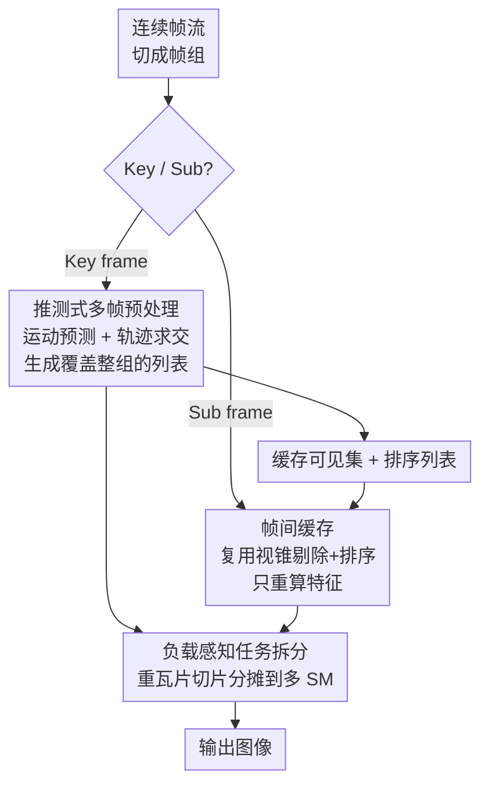

# CaT-GS: Efficient 3DGS Rendering for Large-Scale Scenes with Inter-frame Caching and Tile Scheduling

**会议**: CVPR 2026  
**论文**: [CVF Open Access](https://openaccess.thecvf.com/content/CVPR2026/html/Zhang_CaT-GS_Efficient_3DGS_Rendering_for_Large-Scale_Scenes_with_Inter-frame_Caching_CVPR_2026_paper.html)  
**代码**: 待确认（论文未给出仓库链接，UAV 数据集承诺后续开源）  
**领域**: 3D视觉  
**关键词**: 3D高斯泼溅, 实时渲染, 帧间缓存, 推测式预处理, 负载均衡  

## 一句话总结
CaT-GS 把 3DGS 的渲染流水线从「逐帧从头算」改成「按帧组复用」：用推测式多帧预处理 + 帧间缓存把连续帧里重复的视锥剔除/排序/瓦片求交全部省掉，再用一个负载感知的 CUDA 核拆分重瓦片来均衡 GPU 占用，在大规模场景上相对原版 3DGS 提速最高 10×、相对此前 SOTA 最高再快 70%。

## 研究背景与动机
**领域现状**：3DGS 把场景表示成一堆 3D 高斯，渲染时走「预处理（视锥剔除 + 特征计算 + 瓦片求交）→ 按深度排序 → 光栅化 alpha 混合」三段式流水线，靠瓦片级并行吃满 GPU，质量和速度都显著超过 NeRF，已经被用在自动驾驶、沉浸式串流、虚拟漫游等交互场景。

**现有痛点**：场景一旦放大到城市级（高斯数量上千万），渲染延迟急剧上升，难以维持高帧率。已有加速方法分两路，但都没打到点上：一路（模型压缩 / 剪枝）只减高斯数量、不优化渲染流水线，而且**需要重训练**才能拿到高效表示，部署很不实用；另一路（ADR-GS、Flash-GS）只在**光栅化阶段**做文章，靠更紧的 AABB 包围盒或不透明度剪枝来缩短求交列表，优化的全是**帧内冗余**。

**核心矛盾**：交互式渲染本质是**连续视频流**——相机位姿逐帧缓慢变化，相邻帧的预处理结果（哪些高斯可见、它们的深度排序）几乎不变。但现有方法把每帧当独立静态图来渲，每帧都重做视锥剔除和排序。作者实测（论文 Fig.2）发现预处理 + 排序在大场景里占了渲染时间相当大的一块，这部分**帧间冗余**被完全忽略了。另一个被忽略的是**瓦片负载不均**：高频细节区域的高斯密集，10% 的瓦片可能扛了 50%+ 的计算量，重瓦片卡在单个 SM 上拖慢整体并行。

**本文目标**：在不重训练、不掉质量的前提下，(1) 消除连续帧之间的预处理/排序冗余；(2) 均衡光栅化阶段的瓦片负载，提升 GPU 利用率。

**核心 idea**：把连续帧切成「帧组」，组内第一帧（key frame）做一次完整的、覆盖整组运动范围的推测式预处理，后续子帧（sub frame）直接复用缓存的可见集和排序列表跳过这些阶段；同时把重瓦片任务拆细分摊到多个 SM 上。

## 方法详解

### 整体框架
CaT-GS 不再逐帧渲染，而是把输入的连续帧按 motion 切成**帧组**，组内分两种帧、走两条流水线：

- **Key frame（关键帧）**：跑一遍完整但「加宽」的预处理——先做**运动预测**估出这组帧里相机会怎么动，再按高斯被运动扫出的「轨迹区域（Gaussian trail）」做细粒度瓦片求交，使得这一次生成的可见高斯列表 + 排序结果能**覆盖整组帧**所需的所有高斯。
- **Sub frame（子帧）**：靠**帧间缓存**，直接复用关键帧的视锥剔除结果和排序列表，**跳过**视锥剔除、瓦片求交、排序，每帧只重算视角相关的特征（颜色/形状/不透明度）然后光栅化。

最后无论 key 还是 sub 帧，光栅化阶段都过一个**负载感知的拆分核**：把超过平均负载 2× 的「重瓦片」切成多个小任务，分摊到多个 SM 并行，避免单个 SM 卡死。

### 关键设计

**1. 推测式多帧预处理：一次算好覆盖整组运动的可见列表**

帧间缓存能成立的前提是「关键帧算出的列表必须包含整组帧需要的所有高斯」，否则子帧复用时会漏渲。CaT-GS 的做法是先**运动预测**：把相机瞬时运动拆成平移、缩放、旋转三类，测量短时间窗口内平移向量 $T$ 和旋转矩阵 $R$ 的变化，用仿射变换 $\begin{bmatrix}u & v & 1\end{bmatrix}^\top = \frac{1}{z_c}K(R\cdot(x_g,y_g,z_g)^\top + T)$ 把每个高斯中心投影到像素坐标，得到它在这组帧里扫过的像素位移 $(\Delta u, \Delta v)$，这条扫掠轨迹叫 **Gaussian trail**。

然后做**细粒度轨迹求交**：不再像旧方法逐高斯判交，而是判「整条扫掠区域」与哪些瓦片相交。轨迹边界由四段组成——首尾两个半椭圆（中心分别在 $(u,v)$ 和 $(u+\Delta u, v+\Delta v)$）加两条沿运动方向连接切点的平行线。半椭圆用 2D 逆协方差 $\Sigma^{-1}=\begin{bmatrix}a&b\\c&d\end{bmatrix}$ 和裁剪边界参数 $p$ 隐式定义为 $ax^2+bxy+cy^2=2p$，直线段由切点沿 $(\Delta u, \Delta v)$ 参数化给出。一个瓦片若与任一边界相交、或其中心落在两椭圆中心连成的矩形内，就算有效。这样一次求交就把整组帧需要的高斯一网打尽，子帧才敢放心复用。

**2. 运动自适应调度：运动太猛时自动缩小帧组**

推测式预处理的隐患是相机动得太快时，轨迹会扫出一大片，列表里塞进大量当前视角根本用不到的高斯，冗余爆炸。CaT-GS 设了一个边界条件来兜底：高斯的像素位移取决于它的投影深度 $z_c$（越近的高斯随相机动得越厉害），所以只考察深度超过阈值 $d$ 的高斯。初始把推测窗口设为 $W_{\text{initial}}$ 帧（1 个关键帧 + 后续子帧），若有深于 $d$ 的高斯位移 $M=\sqrt{\Delta u^2+\Delta v^2}$ 超过瓦片边长 $l$，就认为运动过猛，把窗口缩到 $\lfloor W_{\text{initial}}\cdot \frac{l}{M}\rfloor$；若相邻两帧之间运动就已经让这个值算成 0，当前帧直接放弃推测、退回逐帧渲染。这把「复用带来的冗余」控制在可接受范围（实测渲染列表只比 Flash-GS 长约 10%）。

**3. 帧间缓存：子帧跳过视锥剔除与排序，直接复用关键帧结果**

原版预处理三步里只有**特征计算**（颜色/形状/不透明度）是强视角相关、必须逐帧做的，另两步可以缓存。**Frustum caching**：关键帧做完视锥剔除后，把可见高斯的哈希索引存下来，子帧不再遍历整个模型算仿射变换判可见性，直接用这个预剔好的子集——大场景里可见集通常只占整个模型一小部分，省得越多。**Sort caching**：相机在高帧率下位姿变化极小，高斯的深度顺序在短时间内基本不变，于是关键帧排好序、生成列表后缓存，子帧跳过排序直接用缓存列表光栅化。更关键的是，sort caching 还连带省掉了子帧的瓦片求交和 key-duplication，这才是整体提速的大头。

**4. 负载感知任务拆分 + 高效渲染核：把重瓦片切片分摊到多个 SM**

GPU 上每个瓦片块只能在启动它的那个 SM 上跑完，重瓦片就会卡死单个 SM、拖慢整体。直觉是把重瓦片拆小分给多个 SM，但 alpha 混合（式 2）天然是有序的、像素级不可并行。CaT-GS 的办法是**重构光栅化**：把一个像素 $N$ 个有序 splat 的混合拆成 $k$ 段子集 $N_1,\dots,N_k$，并行算各段再合并：

$$C = \sum_{i=1}^{k}\Big(\sum_{j=1}^{|N_i|} c_j \omega_j T_j\Big) R_i, \qquad R_i = \prod_{m=1}^{i-1}(1-A_m),\quad A_m = \sum_{j=1}^{|N_m|}\omega_j T_j.$$

每个块只处理一段 $N/k$，算完存自己的片色 $C_k$ 和片透射残差 $A_k$，最后合成整图。实现时是**负载感知**的：渲染列表总长 $L$、瓦片数 $t$，平均负载 $l=L/t$，凡含高斯数超过 $2l$ 的瓦片判为大瓦片，按目标尺寸 $l$ 切分；光栅化时按切分后的总任务数启动线程块，每块带一个瓦片索引 $t$ 和切片索引 $k$。这样密集区域被多个 SM 协同渲染，避免负载堆在单 SM 上。

### 损失函数 / 训练策略
CaT-GS 是**纯推理期（渲染期）**的流水线优化，不改高斯模型、不引入任何额外训练或约束损失，直接复用现成的 3DGS 训练权重——这正是它相对 ADR-GS（需重训练且掉质量）的卖点之一。实现约 3K 行 CUDA + Python，基于 PyTorch CUDA 扩展编译光栅化核；块尺寸 16×16，目标帧率 $F_{\text{target}}=120$，深度阈值 $d=0.4$，初始窗口 $W_{\text{initial}}=4$ 帧。

## 实验关键数据

测试平台 RTX 5090 + Ryzen 9 9950X；数据集含标准集（Tanks & Temples、MipNeRF360、Deep Blending）和自采的 UAV 城市重建集（高斯量 590 万–830 万）。每个模型采集 10 条 2000 帧的用户交互轨迹（含平移/缩放/旋转），120 FPS、1920×1080 录制。指标用平均 FPS（效率）+ PSNR/SSIM（质量）。

### 主实验（平均 FPS，节选）
| 场景（高斯量） | 3DGS | ADR-GS | Flash-GS | CaT-GS | 相对 SOTA |
|------|------|--------|----------|--------|------|
| Train (1.0M) | 89.4 | 482.1 | 528.3 | **892.2** | +68% |
| Garden (4.2M) | 92.6 | 204.1 | 201.1 | **295.5** | +46% |
| UAV-1 (6.9M) | 25.2 | 116.8 | 129.2 | **241.5** | +83% |
| UAV-2 (7.2M) | 23.2 | 98.3 | 113.1 | **202.5** | +78% |
| UAV-5 (7.4M) | 36.1 | 111.1 | 132.3 | **217.3** | +65% |

所有 UAV 大场景 CaT-GS 都过 200 FPS，而其他基线连 120 FPS 都保不住。规模越大优势越明显：标准集（1–4M 高斯）相对 SOTA 约 +50%，UAV（>7M）普遍 +60%~+80%，相对原版 3DGS 最高 10×。

### 质量（PSNR/SSIM，节选）
| 模型 | 3DGS | Flash-GS | CaT-GS-Key | CaT-GS-Sub |
|------|------|----------|-----------|-----------|
| Truck PSNR | 28.21 | 28.19 | 28.19 | 28.16 |
| UAV-1 PSNR | 30.15 | 30.09 | 30.09 | 30.05 |
| UAV-3 PSNR | 29.53 | 29.50 | 29.50 | 29.46 |

关键帧与 Flash-GS 同策略、质量完全一致；子帧因推测过程中少数高斯轻微错位，PSNR 仅掉 0.03~0.05，肉眼可忽略。对比之下 ADR-GS 因重训练反而把质量掉回甚至低于原版 3DGS。

### 消融实验
| 配置 | Garden | Truck | UAV-1 | UAV-2 | 说明 |
|------|--------|-------|-------|-------|------|
| Ours-Full | 295.5 | 736.5 | 241.5 | 202.5 | 完整模型 |
| w/o 帧间缓存 | 242.4 | 494.4 | 155.3 | 133.2 | 掉最多，最高 −80% |
| w/o 任务拆分 | 279.4 | 672.3 | 210.3 | 178.4 | 掉 10%+ |

分阶段加速（相对原版 3DGS）：子帧预处理 6.8×（只需算选中组的特征）、排序 7.2×（子帧完全不排序，表里标 0*）、光栅化平均 5×（相对 SOTA 再快约 30%）。渲染列表长度上，关键帧推测式预处理因要覆盖运动只比 Flash-GS 长约 10%，被细粒度求交 + 运动自适应压在可接受范围。

### 关键发现
- **帧间缓存是绝对主力**：去掉它最多掉 80%，因为它一举省掉了子帧的视锥剔除 + 排序 + 瓦片求交三块；任务拆分是「锦上添花」的 10%+，但它保证了即使没缓存（worst case，Ours-w/o）大场景也能稳过 120 FPS。
- **规模越大越赚**：复杂模型预处理和排序更重，被缓存省掉的绝对量更大，所以 CaT-GS 在 UAV 大场景上相对优势远超标准集。
- **质量几乎零代价**：子帧 PSNR 仅降 0.03~0.05，证明「用运动预测覆盖整组」的推测策略是安全的，没有把不该渲的高斯渲进来造成可见错误。

## 亮点与洞察
- **把「单帧静态渲染」重新定义成「视频流渲染」**：最核心的洞察是交互式渲染天然是连续帧，相邻帧预处理高度冗余——这个被所有帧内优化忽略的维度，正是大场景提速的金矿。
- **Gaussian trail（扫掠轨迹）求交很巧**：不是简单地把每帧的可见集求并集，而是用运动向量把高斯椭圆「拉成胶囊形」一次性判交，既覆盖整组又不至于把无关高斯全收进来，用几何方式精确控制冗余。
- **有序 alpha 混合拆段并行的技巧可迁移**：式 (7)(8) 把不可并行的有序混合拆成 $k$ 段、各段算局部色与透射残差再合并，这套「分段 + 残差合成」思路对任何需要保序累积又想并行的渲染/扫描类任务都有借鉴价值。
- **纯推理期、即插即用**：不重训练、不改权重、不掉质量，直接套现成 3DGS 模型，部署友好度远高于需要重训的压缩/剪枝路线。

## 局限与展望
- **强依赖帧间相似性**：方法成立的前提是相机平滑运动、高帧率。运动自适应调度虽能在剧烈运动时退回逐帧，但这种场景下 CaT-GS 退化为「关键帧逐帧渲染」，收益主要只剩任务拆分那 10%。
- **运动预测假设近似**：把高斯投影形状随旋转的变化当作「可忽略」近似处理，⚠️ 旋转较大或近景高斯密集时这个近似可能引入更多错位，作者也承认子帧质量轻微下降源于此。
- **代码/数据未即时开放**：论文未给出代码仓库，UAV 数据集承诺「未来开源」，复现门槛偏高（自定义 CUDA 核 + 自采轨迹）。
- **可改进**：帧组大小目前由运动幅度启发式决定，可探索基于内容/质量预算的自适应组长；以及把推测式预处理与可学习的运动预测结合，进一步压低子帧错位。

## 相关工作与启发
- **vs 3DGS 原版**：原版逐帧完整跑预处理+排序+光栅化，CaT-GS 复用流水线结构但按帧组缓存复用，大场景提速最高 10×、质量几乎不变。
- **vs Flash-GS（前 SOTA）**：Flash-GS 用自适应求交 + 不透明度剪枝压**帧内**冗余，只动光栅化；CaT-GS 在它之上额外吃掉**帧间**冗余（关键帧策略与它一致、质量持平），再叠负载均衡，最高再快 70%。
- **vs ADR-GS**：ADR-GS 靠重训练 + 瓦片感知约束损失缓解负载不均，代价是**质量下降**且需重训；CaT-GS 用纯推理期的任务拆分核解决负载，不重训、不掉质量。

## 评分
- 新颖性: ⭐⭐⭐⭐⭐ 首个针对大场景交互式渲染、系统性利用帧间冗余的 3DGS 流水线，视角维度切入很新。
- 实验充分度: ⭐⭐⭐⭐ 标准集 + 自采 UAV 大场景、FPS/PSNR/SSIM + 分阶段加速 + 冗余分析齐全，略缺与更多近期渲染加速工作的横向对比。
- 写作质量: ⭐⭐⭐⭐ 流水线与缓存机制讲得清晰，公式到位；个别符号（如轨迹边界推导）偏简略。
- 价值: ⭐⭐⭐⭐⭐ 即插即用、不重训不掉质量、大场景 10× 提速，对城市级实时渲染部署有直接落地价值。

<!-- RELATED:START -->

## 相关论文

- [\[CVPR 2026\] GAI-GS：用几何代数注意力把光线-物体交互注入 3DGS 的无线信道预测框架](a_geometric_algebra-informed_3dgs_framework_for_wireless_channel_prediction.md)
- [\[CVPR 2026\] OLATverse: A Large-scale Real-world Object Dataset with Precise Lighting Control](olatverse_a_large-scale_real-world_object_dataset_with_precise_lighting_control.md)
- [\[CVPR 2026\] VAD-GS: Visibility-Aware Densification for 3D Gaussian Splatting in Dynamic Urban Scenes](vad-gs_visibility-aware_densification_for_3d_gaussian_splatting_in_dynamic_urban.md)
- [\[CVPR 2026\] BEA-GS: BEyond RAdiance Supervision in 3DGS for Precise Object Extraction](bea-gs_beyond_radiance_supervision_in_3dgs_for_precise_object_extraction.md)
- [\[CVPR 2026\] FilterGS: Traversal-Free Parallel Filtering and Adaptive Shrinking for Large-Scale LoD 3D Gaussian Splatting](filtergs_traversal-free_parallel_filtering_and_adaptive_shrinking_for_large-scal.md)

<!-- RELATED:END -->
