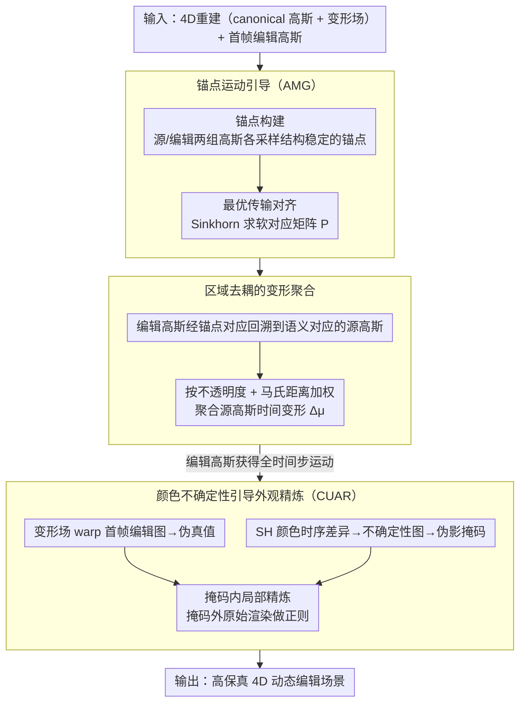

# Catalyst4D: High-Fidelity 3D-to-4D Scene Editing via Dynamic Propagation

**会议**: CVPR 2026  
**arXiv**: [2603.12766](https://arxiv.org/abs/2603.12766)  
**代码**: 无  
**领域**: 3D视觉  
**关键词**: 4D编辑, 3DGS, 动态场景, 运动传播, 最优传输, 颜色不确定性

## 一句话总结

提出Catalyst4D框架，通过锚点运动引导（AMG，基于最优传输建立区域级对应）和颜色不确定性引导外观精炼（CUAR，自动识别并修复遮挡伪影），将成熟的3D静态编辑结果传播到4D动态高斯场景中，在CLIP语义相似度上一致性超越现有方法。

## 研究背景与动机

**领域现状**：3DGS的静态场景编辑已相当成熟——DGE、DreamCatalyst、SGSST等方法支持精细物体操作和全局风格迁移，具有良好的空间一致性。4D场景重建也取得显著进展（Swift4D、4DGS等），通常采用canonical 3D Gaussian + 学习到的变形场 $\mathcal{F}_\theta$ 表示动态。

**现有痛点**：动态4D场景编辑仍然困难重重。现有方法（Instruct 4D-to-4D、CTRL-D、Instruct-4DGS）主要依赖2D扩散模型对逐帧图像进行编辑再拟合4D表示，导致：(1) 空间失真——2D编辑缺乏几何推理；(2) 时间闪烁——帧间2D编辑不一致；(3) 非目标区域被意外修改——2D扩散模型的全局影响。

**核心矛盾**：3D编辑质量高但仅限静态；4D表示的变形网络仅在原始几何上训练，编辑后的高斯（经过克隆、分裂、剪枝）已偏离原始分布，变形网络无法推断其运动——新高斯没有运动先验。

**本文目标** 将成熟的3D静态编辑能力迁移到4D动态场景，同时维持几何精度和时间一致性。

**切入角度**：解耦空间编辑与时间传播——先用成熟的3D编辑器编辑首帧，再通过几何感知的运动传播将编辑结果扩展到全部时间步。

**核心 idea**：用锚点匹配+最优传输建立编辑前后高斯的区域级运动对应，将源高斯的已知变形聚合传播到编辑高斯，再用颜色不确定性驱动外观精炼修复时序伪影。

## 方法详解

### 整体框架

这篇论文要解决的是动态4D场景的编辑：3D静态编辑已经做得很好，4D动态重建也成熟，但把"编辑"塞进动态场景却一直别扭——逐帧用2D扩散模型修图再重新拟合4D，既会几何失真又会帧间闪烁。Catalyst4D的取巧之处是把"编辑"和"动起来"彻底拆开：先用现成的3D编辑器把**首帧**编好，再想办法让这份编辑结果沿着原场景的运动规律"自己动起来"。

具体地，输入是一份已有的4D重建 $(\mathcal{G}_c, \mathcal{F}_\theta)$（canonical 高斯 + 变形场）和首帧编辑后的高斯 $\mathcal{G}_{\text{edit}}^1$，整条流水线走两步。第一步是运动传播：在原始首帧高斯 $\mathcal{G}^1$ 和编辑高斯 $\mathcal{G}_{\text{edit}}^1$ 上各自提一组锚点，用最优传输把两组锚点对齐（锚点运动引导 AMG），再让每个编辑高斯顺着对应源高斯的已知变形"借"来全时间步的运动（区域去耦的变形聚合）。第二步是外观修补（CUAR）：编辑高斯动起来后遮挡关系变了，会暴露出没编辑过的颜色，于是借变形场把首帧编辑图warp到后续帧当伪真值，只对颜色变化大的地方做局部精炼。整套方法不重训变形网络，且对Swift4D（多相机）和4DGS（单目）两种4D表示都适用。

### 关键设计

**1. 锚点运动引导（AMG）：让新高斯沿着旧场景的运动规律动起来**

编辑后的高斯经过克隆、分裂、剪枝，已经偏离了变形网络训练时见过的分布，直接喂给变形网络推不出合理运动；而逐点 KNN 去原场景找最近邻"抄"运动，又会因为点级噪声把不相干部位的运动串到一起。AMG 的思路是退一步、在**区域级**建立对应。它先在原始和编辑两组高斯上各自构建锚点：在点云的最小包围球上均匀采样点对生成候选射线，用半径 $\delta=\frac{\sqrt{3}}{2}d_{\text{mean}}$ 的圆柱体测试筛出真正穿过局部邻域 $\mathcal{N}_{ei}$ 的射线，再取距离加权质心 $\mathbf{p}=\frac{\sum_{\mathbf{x}\in\mathcal{N}_{ei}}d_x\mathbf{x}}{\sum d_x}$ 作为锚点——这样得到的锚点是结构稳定、空间上有代表性的参考点。两组锚点 $A_{\text{src}}, A_{\text{edit}}$ 之间用非平衡最优传输（Sinkhorn 求解）算出软对应矩阵 $P\in\mathbb{R}^{n\times m}$。最优传输的好处是它给出的是语义一致的整体匹配，天然不会把手的运动错配到躯干上，从源头堵住了跨部件的运动纠缠。

**2. 区域去耦的变形聚合：每个编辑高斯只继承语义对应区域的运动**

有了锚点对应还不够，最后落到单个编辑高斯上的运动需要一条清晰的"继承链"，否则仍可能从不相干的源高斯那里捡到运动。这一步以锚点对应作中介：对每个编辑高斯 $\mathbf{g}$，先找到影响它的锚点 $A_{\text{edit}}^{\text{sub}}$，经对应矩阵映射到源侧锚点 $A_{\text{src}}^{\text{sub}}$，再回溯贡献于这些源锚点的源高斯 $\mathcal{G}_{\text{src}}^{1,\text{sub}}$，把它们的时间变形 $\Delta\boldsymbol{\mu}^t$ 加权聚合过来。权重既看不透明度也看空间贴近程度（Mahalanobis 距离），

$$w_{\mathbf{g}'}=\sigma_{\mathbf{g}'}\exp\!\Big(-\tfrac{1}{2}(\boldsymbol{\mu}_{\mathbf{g}'}-\boldsymbol{\mu}_{\mathbf{g}})^{\!\top}\boldsymbol{\Sigma}_{\mathbf{g}'}^{-1}(\boldsymbol{\mu}_{\mathbf{g}'}-\boldsymbol{\mu}_{\mathbf{g}})\Big)$$

于是每个编辑高斯"看到"的只有语义匹配区域的运动信号。相比 KNN 直接在全局找最近邻，多绕这一层锚点中介正是为了避免那种跨部件的运动串扰。

**3. 颜色不确定性引导外观精炼（CUAR）：自动找出动起来后露馅的颜色，只补这些地方**

编辑必然会动到物体内部的高斯，等它们随场景运动、遮挡关系一变，原本藏着的、没编辑过的颜色就会暴露成伪影。CUAR 不去请扩散模型做后期修补（那会引入新的帧间不一致），而是直接拿可信度最高的首帧编辑结果做监督：用变形场渲出首帧到第 t 帧的光流 $F_{1\to t}^v$，把首帧编辑图 warp 到后续帧当伪真值。哪些地方需要修，则由每个高斯的颜色不确定性来判断——它度量的是该高斯在 t 帧和首帧的球谐颜色差异，

$$\xi_t^v=1-\exp\!\big(-\|SH(\mathbf{sh},\mathbf{v})_t-SH(\mathbf{sh},\mathbf{v})_1\|_1\big)$$

经 $\alpha$-blending 合成像素级不确定性图 $U_t^v$，再用均值阈值二值化成伪影掩码 $M_t^v=\big(U_t^v>\epsilon\cdot\text{mean}(U_t^v)\big)$。精炼只作用在掩码内的高不确定性区域（L1+SSIM 对齐 warp 伪真值），掩码外则用原始渲染做正则，防止把没问题的地方也改坏。这样修补全程绑在首帧编辑结果上，保住了与 3D 编辑的一致性。

### 损失函数 / 训练策略

精炼损失 $L_{\text{refine}}=(1-\zeta)L_{\text{fore}}+\zeta L_{\text{back}}$，其中 $L_{\text{fore}}$ 为掩码区域内渲染图与warp伪真值的L1+SSIM（$\eta=0.2$），$L_{\text{back}}$ 为非掩码区域渲染图与精炼前渲染的L1正则化。超参数 $\zeta=0.3$, $\epsilon$ 控制掩码覆盖范围。不需重新训练变形网络。锚点构建<30s，Sinkhorn求解~15s，运动引导~1min，CUAR 25-35min，总训练时间~50min/场景。

## 实验关键数据

### 主实验

| 场景 | 方法 | CLIP Sim↑ | Consistency↑ | 时间↓ |
|------|------|----------|-------------|------|
| Sear-steak | **Catalyst4D** | **0.252** | 0.983 | 50min |
| Sear-steak | CTRL-D | 0.249 | **0.985** | 55min |
| Sear-steak | Instruct-4DGS | 0.220 | 0.980 | 40min |
| Sear-steak | IN4D | 0.246 | 0.962 | 2h(2GPU) |
| Coffee-martini | **Catalyst4D** | **0.249** | **0.986** | 50min |
| Coffee-martini | CTRL-D | 0.246 | 0.983 | 55min |
| Trimming | **Catalyst4D** | **0.251** | **0.967** | 40min |
| Trimming | CTRL-D | 0.248 | 0.962 | 50min |

### 消融实验

| 配置 | CLIP Sim↑ | Consistency↑ | 说明 |
|------|----------|-------------|------|
| Full model | **0.252** | **0.971** | AMG+CUAR完整模型 |
| w/o AMG | 0.245 | 0.966 | 缺失运动引导导致语义和时序下降 |
| w/o CUAR | 0.248 | 0.969 | 缺失外观精炼导致颜色伪影 |
| KNN-Guide | — | — | 跨部件运动纠缠（手的运动影响躯干） |
| DeformNet-Guide | — | — | 编辑高斯偏离训练分布产生几何伪影 |

### 关键发现

- AMG是核心贡献——去掉后CLIP Sim降0.007，比去掉CUAR（降0.004）影响更大
- KNN基线出现典型的跨语义运动纠缠（Figure 6可视化），验证了区域级锚点对应的必要性
- 直接用变形网络推断编辑高斯运动失败——编辑操作使高斯偏离canonical训练分布
- Catalyst4D在语义保真度（CLIP Sim）上一致最优，时间一致性（Consistency）竞争力强
- 训练时间50min，优于IN4D（2h需双卡），与CTRL-D持平

## 亮点与洞察

- "先编辑3D，再传播到4D"的解耦策略优雅地规避了直接4D编辑的困难，继承了成熟3D编辑方法的质量
- 最优传输建立区域级对应比逐点KNN更稳定、语义更一致——是3D对应建立的优质工具
- CUAR的颜色不确定性估计是自动识别需修复区域的巧妙方法——无需额外标注，直接利用SH颜色时序差异
- 同时支持单目和多相机场景，兼容多种4D表示（Swift4D/4DGS），通用性好

## 局限与展望

- 编辑质量上限受首帧3D编辑方法制约——输入什么3D编辑就传播什么
- 不修改变形网络或重新优化高斯密度，当底层4D重建质量差时运动引导可能局部失效
- 严重拓扑变化场景（物体出现/消失）可能挑战锚点对应
- D-NeRF trex场景出现失败案例——背景高斯漂入编辑前景区域
- 仅在3个数据集上评估，更大规模场景和更多编辑类型（如光照、材质）的泛化能力尚需进一步验证

## 相关工作与启发

- **vs Instruct 4D-to-4D / Instruct-4DGS**: 依赖2D扩散模型逐帧编辑，缺乏精细定位。Catalyst4D从3D编辑出发通过梯度直接约束高斯，定位更精确且不修改非目标区域
- **vs CTRL-D**: 使用DreamBooth微调的2D-to-4D路线，视觉接近但2D到4D的重建gap导致模糊和过度平滑，且非编辑区域（桌上物体等）被意外修改
- **vs 静态3D编辑方法（DGE/DreamCatalyst/SGSST）**: Catalyst4D将这些方法的编辑能力从静态扩展到动态，是互补而非替代关系

## 评分

- 新颖性: ⭐⭐⭐⭐ 3D-to-4D传播范式和锚点+最优传输机制有清晰创新点
- 实验充分度: ⭐⭐⭐⭐ 三个数据集、四种对比方法、AMG/CUAR独立消融、失败案例诚实披露
- 写作质量: ⭐⭐⭐⭐ 逻辑清晰，图示直观，数学表述规范
- 价值: ⭐⭐⭐ 4D编辑是前沿问题但应用场景偏窄，方法对其他跨表示传递任务有启发

<!-- RELATED:START -->

## 相关论文

- [\[CVPR 2026\] CustomTex: High-fidelity Indoor Scene Texturing via Multi-Reference Customization](customtex_high-fidelity_indoor_scene_texturing_via_multi-reference_customization.md)
- [\[CVPR 2026\] 4D Reconstruction from Sparse Dynamic Cameras](4d_reconstruction_from_sparse_dynamic_cameras.md)
- [\[CVPR 2026\] 4D Primitive-Mâché: Glueing Primitives for Persistent 4D Scene Reconstruction](4d_primitive-mache_glueing_primitives_for_persistent_4d_scene_reconstruction.md)
- [\[CVPR 2026\] HyperGaussians: High-Dimensional Gaussian Splatting for High-Fidelity Animatable Face Avatars](hypergaussians_high-dimensional_gaussian_splatting_for_high-fidelity_animatable_.md)
- [\[CVPR 2026\] High-Fidelity Mobile Avatars with Pruned Local Blendshapes](high-fidelity_mobile_avatars_with_pruned_local_blendshapes.md)

<!-- RELATED:END -->
