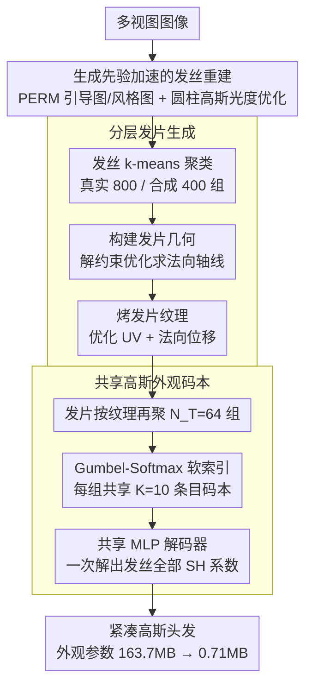

# CGHair: Compact Gaussian Hair Reconstruction with Card Clustering

**会议**: CVPR 2026  
**arXiv**: [2604.03716](https://arxiv.org/abs/2604.03716)  
**代码**: [项目页](https://humansensinglab.github.io/CGHair/)  
**领域**: 3D Vision  
**关键词**: 3D高斯溅射, 头发重建, 发片聚类, 紧凑表示, 外观压缩

## 一句话总结

提出 CGHair，通过发片（hair card）引导的分层聚类和共享高斯外观码本，在保持可比视觉质量的同时实现 200 倍以上的外观参数压缩和 4 倍发丝重建加速。

## 研究背景与动机

**领域现状**：基于 3DGS 的头发重建方法（如 GaussianHair）通过圆柱高斯链建模发丝，实现了高保真实时渲染。但密集头发建模需要数百万个高斯基元，导致存储和渲染成本巨大。

**现有痛点**：GaussianHair 等方法为每根发丝独立分配球谐系数，忽略了头发在同一发型中具有强结构和外观冗余的特性，导致严重的参数冗余。

**核心矛盾**：高保真度要求大量独立参数 vs 实际部署需要紧凑表示。

**本文目标**：利用头发的内在结构相似性，设计紧凑的高斯头发表示。

**切入角度**：借鉴游戏和影视工业中广泛使用的"发片（hair card）"概念——将相似发丝聚类为发片并共享纹理。

**核心 idea**：分层聚类 + 共享外观码本，实现发丝级高保真与极致压缩的兼得。

## 方法详解

### 整体框架

CGHair 要解决的核心问题是：一头密集头发动辄上百万根发丝，逐根分配高斯外观参数会撑出几百 MB 的存储，可实际上同一发型里的发丝在几何走向和颜色上高度雷同——这份冗余完全没被利用。它的思路是把这份冗余一层层"挤"出来：先用生成先验把发丝几何快速重建出来，再把成千上万根发丝聚成几百张"发片"（hair card，影视游戏里早就在用的头发简化单元），然后让一组组发片共享同一本外观码本，最后多视图优化补回视觉细节。整条管线从"每根发丝独立"逐步收敛到"一本码本管一片发丝"，存储随之从 163.7MB 降到 0.71MB。

### 关键设计

**1. 生成先验加速的发丝重建：用 PERM 的几何先验绕开昂贵的扩散正则化**

最朴素的做法是直接在潜在纹理上优化发丝几何，但这条路收敛慢、还得靠昂贵的扩散正则化兜住合理性。CGHair 改用参数化头发模型 PERM 作为先验：在头皮 UV 空间里，头发被表示成一张引导图 $\mathbf{G} = \mathcal{D}_{guide}(\alpha)$ 和一张风格图 $\mathbf{S} = \mathcal{D}_{style}(\beta)$，分别由预训练的 StyleGAN2 与 VAE 解码器生成。重建时联合优化发型编码 $\alpha, \beta$ 和解码器本身，沿发丝铺上圆柱高斯做光度监督。因为 PERM 已经把"头发该长成什么样"的强几何先验喂进来了，优化只需在合理流形上微调，相比 GaussianHaircut 拿到了约 4 倍加速，而且全程自动，不像 GaussianHair 还要手动介入。

**2. 分层发片生成：把发丝按工业标准聚成发片，直接吃掉几何和外观冗余**

重建出发丝后，CGHair 借用影视游戏里成熟的"发片"概念——一张贴了头发纹理的薄片代替一束发丝——来显式压缩冗余。这一步分三小步走。先是发丝聚类：把每根发丝的 3D 点串成一个长向量，用 k-means 聚成 $N_c$ 组（真实头发取 800 组，合成头发取 400 组），同一组发丝走向相近，正好对应一张发片。接着构建发片几何：以聚类中心那根发丝当轴线，解一个约束优化求发片的法向量

$$\{n_k^*\} = \arg\min \sum_k \sum_{p_i} \|(p_i - \bar{p}_k) \cdot n_k\|$$

让这张片的平面尽量贴住组内所有发丝。最后生成纹理：优化每根发丝的 UV 坐标和法向位移 $\delta_i$，把 3D 发丝投影到发片表面，烤出一张抗锯齿的纹理图。这样一张发片就同时编码了它那束发丝的几何走向和外观，冗余被显式地折叠进了纹理里。

**3. 共享高斯外观码本：让一组发片共用一本低维码本 + 共享解码器，把外观参数压到极致**

发片虽然减了数量，但若每张发片仍存一套完整球谐（SH）系数，外观参数还是大。CGHair 再往上聚一层：把 $N_c$ 张发片按纹理特征重新聚成 $N_T=64$ 组，每组共享一本含 $K=10$ 个特征条目、维度 $D=64$ 的外观码本。具体到每根发丝，用 Gumbel-Softmax 做软索引，从码本里加权挑出自己的特征

$$\mathbf{F}_{strand} = \sum_{k=1}^K \pi_k \cdot \mathbf{F}_k$$

其中 $\pi_k$ 是软索引权重。这个 64 维特征再喂给一个全局共享的 MLP 解码器 $\phi_{dec}$，一次解码出这根发丝上所有高斯的 SH 系数

$$[\mathbf{SH}_1, ..., \mathbf{SH}_{|\mathcal{S}|}] = \phi_{dec}(\mathbf{F}_{strand})$$

关键在于绕开了"码本条目直接映射成全部高斯 SH"这条路——后者维度会膨胀到 4k 以上。换成"低维潜码 + 共享解码器"，真正存的只有几十维的码本和一个解码器，外观参数因此被压到 0.71MB。用 Gumbel-Softmax 而非硬量化，还让整条索引可微、能端到端训练，顺带避开了 VQ 里常见的码本坍缩。

### 一个完整示例：一根发丝怎么被压到 0.71MB

跟着一根真实头发的发丝走一遍。重建阶段，PERM 先验把它和其余上百万根发丝一起快速恢复出几何（4 倍于 GaussianHaircut 的速度）。发片生成阶段，k-means 把这上百万根聚成 800 张发片，这根发丝落进其中某张片，几何被它所属发片的轴线 + 纹理代表。紧凑表示阶段，800 张发片又按纹理聚成 64 组，这根发丝所在的发片归到第 $t$ 组，于是它只能在第 $t$ 组那本 $K=10$ 条目的码本里选——Gumbel-Softmax 给出一组软权重 $\pi$，加权得到一个 64 维特征，全局 MLP 把它解码回这根发丝上每个高斯的 SH。最终全场景的外观从"每根发丝一套独立 SH"的 163.7MB，收敛成"64 本小码本 + 一个共享解码器"的 0.71MB，约 230 倍压缩，而渲染 PSNR 只掉了约 1.6dB。

### 损失函数 / 训练策略

$$\mathcal{L} = \mathcal{L}_p + \mathcal{L}_a + \mathcal{L}_o$$
- $\mathcal{L}_p$：L1 + D-SSIM 光度损失
- $\mathcal{L}_a$：alpha 掩码监督损失
- $\mathcal{L}_o$：不透明度平滑正则化
- 前 7k 迭代冻结几何参数，之后以较小学习率联合优化

## 实验关键数据

### 主实验 — 发丝重建质量

| 指标 | CGHair | 仅 $\mathcal{D}_{PCA}$ | 冻结 $\alpha,\beta$ | 仅 $\mathcal{D}_{style}$ |
|------|--------|-------------------|-------------------|---------------------|
| Pos. Error ↓ | **0.148** | 0.162 | 0.159 | 0.182 |
| Cur. Error ↓ | **6.73** | 9.12 | 6.98 | 7.48 |

### 消融实验 — 紧凑表示

| 方法 | PSNR↑ | SSIM↑ | LPIPS↓ | Size(MB)↓ | 压缩比↑ |
|------|-------|-------|--------|----------|---------|
| Unique (每发丝独立SH) | 33.99 | 0.982 | 0.019 | 163.7 | 1.0 |
| 无发片聚类 | 28.00 | 0.938 | 0.042 | 22.42 | 7.30 |
| Single-SH | 30.48 | 0.958 | 0.037 | 0.46 | 355.9 |
| **Latents (完整)** | **32.40** | **0.970** | **0.026** | **0.71** | **230.6** |

### 关键发现

1. 完整 CGHair 仅用 0.71MB 外观参数即达到 PSNR 32.40，相比独立 SH（163.7MB）压缩 230 倍，PSNR 仅降 1.59。
2. 发片聚类是关键：无聚类时全局共享PSNR 仅 28.00，证明发片级结构化聚类的必要性。
3. 码本大小 $K=10$ 已足够，增至 90 仅提升微小 PSNR 但存储急增。
4. 潜在维度 $D=64$ 是最优平衡点。

## 亮点与洞察

- 将工业中成熟的"发片"概念优雅地引入学术头发重建，实现了结构先验与数据驱动重建的统一。
- 分层压缩策略：发丝→发片→发片组→共享码本，每层利用不同粒度的冗余。
- 可插拔设计：CGHair 模块可直接叠加到 GaussianHair 的重建发丝上，作为后处理压缩模块。
- Gumbel-Softmax 软索引设计允许端到端训练，避免了 VQ 中常见的 codebook collapse。

## 局限与展望

- 聚类数量 $N_c, N_T$ 为手动设定，可考虑自适应确定。
- 当前仅支持静态头发，未处理动态/运动场景。
- 压缩后 PSNR 仍比无压缩低 ~1.6dB，对细节要求极高的场景可能不足。
- 依赖 PERM 预训练先验，对非常规发型的泛化未充分验证。

## 相关工作与启发

- CompGS 等通用 3DGS 压缩方法未利用头发特有的结构冗余，CGHair 是领域特化压缩的范例。
- VQVAE 的量化编码思路被成功迁移到 3D 头发表示。
- 对其他具有强结构冗余的 3D 重建任务（如织物、植被）有启发意义。

## 评分

- 新颖性: ⭐⭐⭐⭐ 发片聚类+共享码本的组合新颖，但各技术组件相对成熟
- 实验充分度: ⭐⭐⭐⭐⭐ 多粒度消融非常充分
- 写作质量: ⭐⭐⭐⭐ 管线清晰，图示丰富
- 价值: ⭐⭐⭐⭐ 200倍压缩对实际部署有重大意义

<!-- RELATED:START -->

## 相关论文

- [\[CVPR 2026\] Prune Wisely, Reconstruct Sharply: Compact 3D Gaussian Splatting via Adaptive Pruning and Difference-of-Gaussian Primitives](prune_wisely_reconstruct_sharply_compact_3d_gaussian_splatting_via_adaptive_prun.md)
- [\[ECCV 2024\] Human Hair Reconstruction with Strand-Aligned 3D Gaussians](../../ECCV2024/3d_vision/human_hair_reconstruction_with_strand-aligned_3d_gaussians.md)
- [\[CVPR 2026\] Urban-GS: A Unified 3D Gaussian Splatting Framework for Compact and High-Fidelity Aerial-to-Street Reconstruction](urban-gs_a_unified_3d_gaussian_splatting_framework_for_compact_and_high-fidelity.md)
- [\[CVPR 2026\] 3D Gaussian Splatting at Arbitrary Resolutions with Compact Proxy Anchors](3d_gaussian_splatting_at_arbitrary_resolutions_with_compact_proxy_anchors.md)
- [\[CVPR 2026\] Learning Compact 3D Representations from Feed-Forward Novel View Synthesis](learning_compact_3d_representations_from_feed-forward_novel_view_synthesis.md)

<!-- RELATED:END -->
