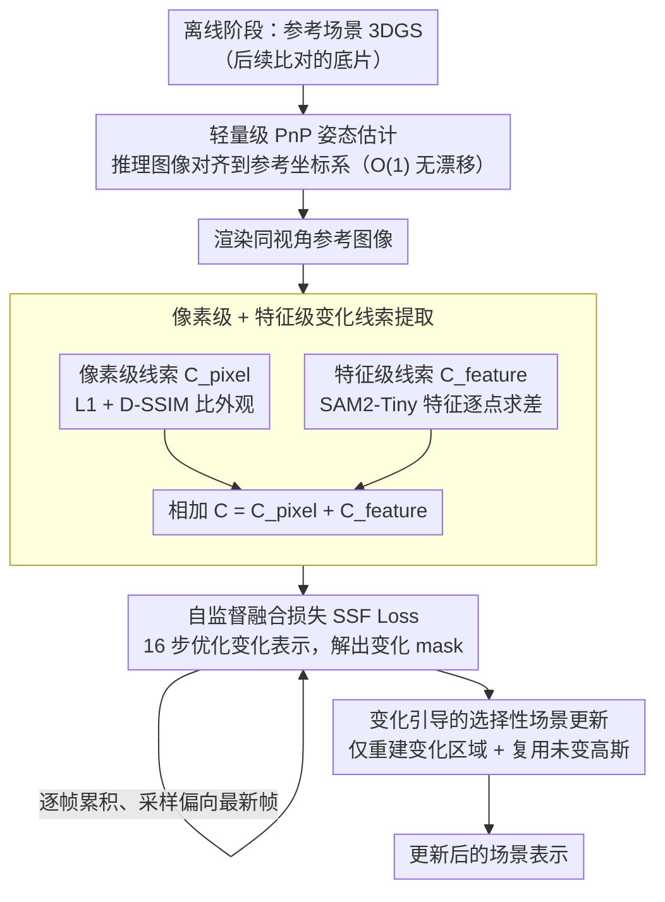

# Changes in Real Time: Online Scene Change Detection with Multi-View Fusion

**会议**: CVPR 2026  
**arXiv**: [2511.12370](https://arxiv.org/abs/2511.12370)  
**代码**: [https://chumsy0725.github.io/O-SCD/](https://chumsy0725.github.io/O-SCD/)  
**领域**: 3D视觉  
**关键词**: 场景变化检测, 3D高斯泼溅, 在线推理, 自监督融合, 场景更新

## 一句话总结

提出首个同时具备在线、姿态无关、无标注、多视角一致性的场景变化检测（SCD）方法，通过自监督融合损失将像素级和特征级变化线索集成到 3DGS 变化表示中，在超过 10 FPS 的实时速率下超越了所有已有离线方法的检测精度。

## 研究背景与动机

**领域现状**：场景变化检测（SCD）是场景理解的核心任务，应用于环境监测、基础设施检查和损伤评估。近年来方法利用 NeRF 和 3DGS 构建场景的三维表示来实现姿态无关的 SCD。

**现有痛点**：
   - 最强的 SCD 方法（如 MV3DCD、GeSCD）都是**离线**的——需要预先收集所有前后时刻的观测数据才能推理，不适用于实时决策场景。
   - 现有在线方法精度远低于离线方法，且多数无法维持实时性能（<1 FPS）。
   - MV3DCD 使用硬阈值和交集启发式融合变化线索，容易丢失细微但重要的变化信号。

**核心矛盾**：在线场景下需要实时、逐帧地检测变化，同时还要保持跨视角一致性，但现有方法要么牺牲精度（在线方法），要么牺牲实时性（离线方法）。

**本文目标**：(a) 如何在线实时推理变化？(b) 如何避免硬阈值导致的信息丢失？(c) 如何高效更新场景表示？

**切入角度**：用 3DGS 的变化表示作为跨视角的"持久记忆"，配合自监督损失自动学习融合多视角变化线索，同时设计基于 PnP 的轻量级姿态估计和变化引导的选择性场景更新。

**核心idea**：用一个自监督融合损失替代硬阈值启发式，让变化信息在 3DGS 表示中自然积累和传播，同时仅重建变化区域来实现秒级的场景更新。

## 方法详解

### 整体框架

这篇论文要解决的是：机器人在现场巡检时，如何**边走边实时判断**当前场景相比参考状态哪里变了，而不必像离线方法那样等所有前后观测都采集完再统一推理。系统先在离线阶段为参考场景建一份标准 3DGS 表示，作为后续比对的"底片"。到了在线阶段，每来一帧推理图像就走一条流水线：先把它注册到参考坐标系（估姿态），渲染出同视角下的参考图像，从这对图像里抽取像素级和特征级两路变化线索，再把线索融合进一个专门的"变化表示"里并解出当前帧的变化 mask。等一次巡检的所有观测都处理完，再用累积下来的变化 mask 只对变化区域做选择性重建，把参考场景更新成最新状态。

### 关键设计

**1. 轻量级 PnP 姿态估计：把每帧推理图像快速、无漂移地对齐到参考坐标系**

在线 SCD 的第一道关卡是定位——只有知道推理图像是从哪个视角拍的，才能渲染出对应的参考图像来比对。像 SplatPose 那样直接对 3DGS 反向优化相机位姿虽然准，但每帧都要跑一轮优化，慢到不足 1 FPS。这里改成纯几何匹配：离线阶段用 XFeat 提取参考图像的关键点与描述符，预先三角化成一组 3D 点。在线时对每帧推理图像同样提描述符，匹配最相近的 top-4 参考帧，用 PnP + RANSAC 建立 2D-3D 对应关系解出位姿，再用 GPU 并行的 miniBA 精化一遍。关键在于姿态估计始终只针对**固定大小**的参考帧集合，所以单帧开销是 $O(1)$，也不会像逐帧累积的里程计那样产生漂移。

**2. 像素级 + 特征级变化线索提取：用两路互补信号兜住彼此的盲区**

光看一种线索容易漏判。像素级线索直接比对推理图像和渲染图像的外观差异，$C_{\text{pixel}}^k = (1-\lambda)L_1 + \lambda L_{\text{D-SSIM}}$，能捕捉细粒度的纹理变化，但对光照、反射、阴影这类非真实变化也很敏感；特征级线索则用 SAM2-Tiny 抽密集特征图后逐点求差，$C_{\text{feature}}^k = \sum_i |f_{\text{inf}}^{k,i} - f_{\text{ren}}^{k,i}|$，对这些干扰更鲁棒，代价是可能漏掉语义相似物体之间的细微变化。两者恰好互补，所以最终线索就是简单相加 $C^k = C_{\text{pixel}}^k + C_{\text{feature}}^k$。这里特意不学 MV3DCD 那套——它对两路线索各自硬阈值化再取交集，只要一种线索没把某处变化框进来，交集就会把它丢掉；相加则把两路证据都保留下来，交给后面的自监督损失去自动权衡。

**3. 自监督融合损失（SSF Loss）：让 3DGS 充当变化的"持久记忆"，自己学会跨视角融合**

有了每帧的变化线索 $C^k$，还需要把多个视角的线索汇总成一份 3D 一致的变化判断。做法是从参考 3DGS 初始化一份变化表示 $\mathcal{R}_{\text{change}}$：丢掉原本的颜色参数，换上一个可学习的变化参数 $c$。对每帧推理图像，用 SSF Loss 优化 $n=16$ 步：

$$L_{\text{SSF}} = C^i \odot (1 - \tilde{M}^i) + \log(1 + \text{mean}(\tilde{M}^i)^2)$$

第一项是"数据项"——在变化线索强的地方，若预测的变化概率 $\tilde{M}^i$ 偏低就受罚，逼模型在那里预测高变化概率；第二项是正则项，压低整张 mask 的均值，防止模型偷懒输出处处为 1 的平凡解 $\tilde{M}=1$。每步优化时随机采一帧历史帧 $i$（约 1/3 概率偏向最新帧 $k$），于是 $\mathcal{R}_{\text{change}}$ 会把所有已观测视角的变化证据持续累积进同一份 3D 表示里，天然保证了多视角一致性，也彻底绕开了硬阈值和交集带来的信息损失。

**4. 变化引导的选择性场景更新：只重建变了的地方，把更新从几分钟压到几十秒**

巡检结束后还要把参考场景刷新成当前状态。最朴素的做法是从零重建整个场景，但绝大部分区域其实没变，重算纯属浪费。这里用精化后的变化 mask 把推理图像里的未变化像素抠掉 $\hat{I}_{\text{inf}}^k = I_{\text{inf}}^k \odot M_{\text{refined}}^k$，只对变化区域重建出一组新高斯 $\mathcal{R}_{\text{change}}^*$，再和直接复用的未变化参考高斯 $\mathcal{R}_{\text{ref}}^*$ 拼到一起。最后只做一轮受限的全局优化——自适应密度控制只作用在变化像素对应的那些高斯上。因为待优化的高斯数量大幅减少，渲染能跑到 400 FPS 以上，整体更新在数十秒内完成，比从头重建快 8–13 倍，而未变化区域沿用的是参考阶段已经收敛好的高质量高斯。

### 损失函数 / 训练策略

- **SSF Loss**: $L_{\text{SSF}} = C^i \odot (1 - \tilde{M}^i) + \log(1 + \text{mean}(\tilde{M}^i)^2)$
- 参考场景构建：标准 3DGS（Speedy-Splat 加速版）+ SfM 姿态估计
- 在线推理：每帧 16 步优化变化表示，采样偏向最新帧
- 场景更新：标准 3DGS 优化 pipeline + 受限密度控制

## 实验关键数据

### 主实验

在 PASLCD 数据集（10 个室内外房间级场景，20 个实例）上的 SCD 结果：

| 方法 | 无标注 | 姿态无关 | 多视角 | 在线 | mIoU ↑ | F1 ↑ | 速度 |
|------|--------|---------|--------|------|--------|------|------|
| GeSCD (离线) | ✓ | ✗ | ✗ | ✗ | 0.477 | 0.611 | 298s |
| MV3DCD (离线) | ✓ | ✓ | ✓ | ✗ | 0.478 | 0.628 | 479s |
| **Ours (离线)** | ✓ | ✓ | ✓ | ✗ | **0.552** | **0.694** | 156s |
| SplatPose+ (在线) | ✓ | ✓ | ✗ | ✓ | 0.237 | 0.358 | <1 FPS |
| CS+CYWS2D (在线) | ✗ | ✗ | ✗ | ✓ | 0.243 | 0.360 | 8.2 FPS |
| **Ours (在线)** | ✓ | ✓ | ✓ | ✓ | **0.486** | **0.638** | 11.2 FPS |

场景表示更新（PASLCD + CL-Splats）：

| 方法 | PSNR ↑ | SSIM ↑ | LPIPS ↓ | 时间(s) ↓ |
|------|--------|--------|---------|-----------|
| 3DGS (从零) | 22.21 | 0.756 | 0.243 | 550 |
| 3DGS-LM | 22.26 | 0.756 | 0.242 | 340 |
| CLNeRF | 22.27 | 0.624 | 0.391 | 451 |
| **Ours** | **23.70** | **0.787** | **0.249** | **42** |

### 消融实验

| 变体 | mIoU ↑ | F1 ↑ |
|------|--------|------|
| Full model | 0.486 | 0.638 |
| 去掉 $L_1$ | 0.320 | 0.464 |
| 去掉 $L_{\text{D-SSIM}}$ | 0.447 | 0.620 |
| 仅用 $C_{\text{pixel}}$ | ✗ (不收敛) | ✗ |
| 仅用 $C_{\text{feature}}$ | ✗ (不收敛) | ✗ |
| 去掉正则化项 | ✗ (平凡解) | ✗ |
| 用 MV3DCD 硬阈值+交集 | 0.350 | 0.495 |

### 关键发现

- **像素级和特征级线索缺一不可**：单独使用任何一种都无法让 SSF loss 收敛，说明两种线索提供了互补的监督信号。
- **SSF Loss vs 硬阈值**：用 MV3DCD 的硬阈值+交集替换 SSF Loss，F1 从 0.638 降到 0.495，说明自监督融合显著优于启发式方法。
- **在线模型甚至超过离线 SOTA**：在线版本的 mIoU (0.486) 已超过所有离线竞争者中的最强方法 MV3DCD (0.478)，这是一个非常有意义的结果。
- **速度-精度 tradeoff**：减少融合迭代次数可以在 11-20 FPS 之间调节，F1 仅下降 3.6%。
- **场景更新比从零重建快 8-13 倍**：复用未变化区域的高斯是关键，同时还能获得更好的 PSNR。

## 亮点与洞察

- **3DGS 作为变化的持久记忆**：将变化参数嵌入 3DGS 基元中，使得多视角变化信息自然地在 3D 空间中累积和传播。这个设计既简洁又有效，可以迁移到任何需要在 3DGS 中做时序信息融合的任务。
- **SSF Loss 设计精妙**：仅两项的简单损失就实现了端到端的多模态线索融合 + 多视角一致性 + 防平凡解，无需任何人工标注。核心洞察是让损失函数"学习融合"而非"手动融合"。
- **选择性重建+融合的更新策略**：变化区域仅需少量高斯就能建模，渲染速度 >400 FPS，极大加速优化。这为长周期场景监控提供了实用方案。

## 局限与展望

- XFeat 在极端外观变化（如季节变换）下匹配可能失败，影响姿态估计
- 当前仅使用 SAM2-Tiny 的特征作为语义线索，更强的视觉基础模型可能进一步提升检测精度
- 场景更新策略假设变化在单次巡检内是静态的，不适用于持续动态场景
- 在小物体级别的变化检测上仍有提升空间

## 相关工作与启发

- **vs MV3DCD**: 最直接的竞争者。MV3DCD 使用硬阈值+交集启发式融合，本文用可学习的 SSF Loss 替代，mIoU 提升约 15%，同时在线版本也能超越之。
- **vs SplatPose/SplatPose+**: 这些方法直接对 3DGS 优化相机位姿，导致速度极慢（<1 FPS）。本文的 PnP 方案 O(1) 复杂度且无漂移。
- **vs CL-Splats/GaussianUpdate**: 场景更新方面的竞争者，它们需要更长的训练时间。本文的选择性重建策略简单高效。

## 评分

- 新颖性: ⭐⭐⭐⭐⭐ 首个集成在线+姿态无关+无标注+多视角一致的 SCD 方法
- 实验充分度: ⭐⭐⭐⭐⭐ 全面对比在线/离线 baseline，消融详实，速度分析到位
- 写作质量: ⭐⭐⭐⭐⭐ 逻辑清晰，图表丰富，问题-方案对应关系明确
- 价值: ⭐⭐⭐⭐⭐ 对机器人巡检和长期场景监控有直接实用价值

<!-- RELATED:START -->

## 相关论文

- [\[CVPR 2026\] Intrinsic Image Fusion for Multi-View 3D Material Reconstruction](intrinsic_image_fusion_for_multi-view_3d_material_reconstruction.md)
- [\[CVPR 2026\] SRGCD: Stability-Driven Region Growth Framework for 3D Change Detection](srgcd_stability-driven_region_growth_framework_for_3d_change_detection.md)
- [\[CVPR 2026\] Real-Time Dynamic Scene Rendering with Controlled Compressibility and Contact Awareness](real-time_dynamic_scene_rendering_with_controlled_compressibility_and_contact_aw.md)
- [\[CVPR 2026\] Seele: A Unified Acceleration Framework for Real-Time Gaussian Splatting on Mobile Devices](seele_a_unified_acceleration_framework_for_real-time_gaussian_splatting_on_mobil.md)
- [\[CVPR 2026\] SMVRT: Implicit Human 3D Modeling Using Sparse Multi-View Volumetric Reconstruction with Transformer Fusion](smvrt_implicit_human_3d_modeling.md)

<!-- RELATED:END -->
