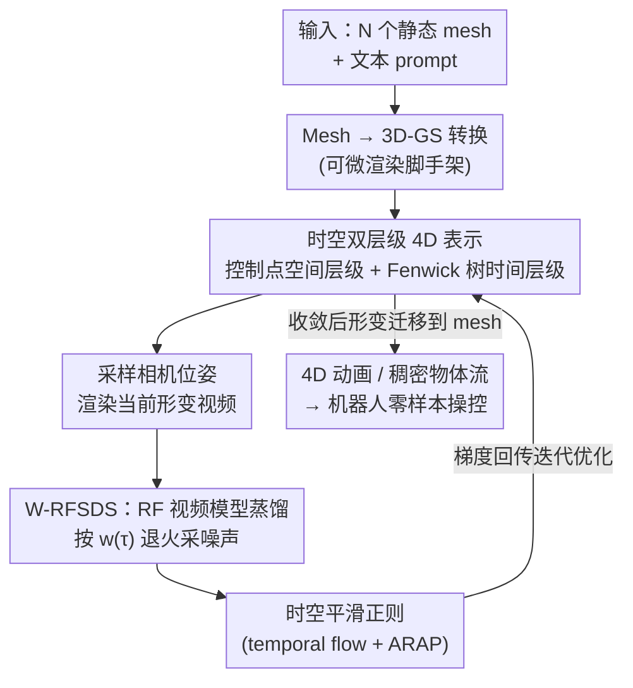

# Choreographing a World of Dynamic Objects

**会议**: CVPR 2026  
**论文**: [CVF OpenAccess](https://openaccess.thecvf.com/content/CVPR2026/html/Lyu_Choreographing_a_World_of_Dynamic_Objects_CVPR_2026_paper.html)  
**代码**: 项目主页 https://yanzhelyu.github.io/chord （未明确开源代码，⚠️ 以原文为准）  
**领域**: 3D视觉 / 4D生成  
**关键词**: 4D 场景生成, Score Distillation, Rectified Flow, 3D Gaussian Splatting, Fenwick 树

## 一句话总结
CHORD 把静态 3D 物体当"演员"、把视频生成模型当"编舞", 通过一套为 rectified-flow 视频模型定制的蒸馏目标 + 时空双层级的 4D 运动表示, 仅凭 3D 形状和一句文本就能生成多物体相互交互的、物理合理的 4D 场景动画, 并能直接驱动真实机器人做零样本操控。

## 研究背景与动机

**领域现状**: 给一个由多个动态物体组成的静态场景"加上时间维度"——让它们形变、运动、互相交互, 生成 4D(3D+时间)动态——是构建机器人/具身智能世界模型的关键能力。传统做法靠图形学规则管线: 先为每类物体定 category-specific 的骨骼/运动学模型(rigging), 再在其上生成运动; 近期则有数据驱动的端到端 4D 生成器。

**现有痛点**: 规则管线依赖类别特定的启发式, 需要大量人工建模和专家标注, 不可扩展; 数据驱动方法又卡在数据上——现有 4D 数据集(如 DeformingThings)绝大多数只覆盖**单个物体的内部形变**, 几乎没有**物体之间的交互**, 同时描述形变和交互的场景级 4D 数据极其稀缺。结果是现有数据驱动方法只会动单个物体, 且训练数据被类人模型主导, 难以泛化到任意类别。

**核心矛盾**: 想要"通用、任意类别、含交互"的 4D 生成, 但既拿不到对应的 4D 监督数据, 又不想退回类别特定的硬编码。这是一个"目标普适性"与"监督信号可得性"之间的根本冲突。

**本文目标**: 给定多物体的静态 3D 快照 + 一句描述场景如何随时间变化的文本(如"男人用手压低台灯的灯头"), 生成一段驱动各物体的时序形变, 使最终 3D 动画与文本对齐, 且不依赖任何类别先验或大规模 4D 数据。

**切入角度**: 通用视频生成模型(如 Wan 2.2)已经在海量真实视频上学到了世界如何运动的丰富先验。这些先验以 **Eulerian(欧拉, 逐像素观察)** 形式藏在 2D 视频里, 而我们需要的是 **Lagrangian(拉格朗日, 逐物质点追踪)** 的 3D 形变轨迹。作者的赌注是: 可以用蒸馏(distillation)把视频模型当成一个"高层编舞", 让它对渲染出的形变结果打分, 从而把欧拉表示里的运动信息"翻译"成拉格朗日形变。

**核心 idea**: 用 Score Distillation 把视频生成模型的运动先验"逼问"出来去优化一个 4D 形变表示——但要让它真正可行, 必须解决两个拦路虎: (1) 4D 形变空间维度极高、时间上几乎没有正则约束, 优化极不稳定; (2) 现代视频模型是 rectified-flow 架构, 和经典 SDS 算法不兼容。CHORD 用"时空双层级 4D 表示"治第一个病, 用"为 RF 模型重推的加权 SDS 目标"治第二个病。

## 方法详解

### 整体框架

CHORD 是一个**迭代优化**的蒸馏管线, 没有任何训练数据集, 只有"输入场景 + 文本 prompt"。流程是: 先把输入的 N 个 mesh 转成 3D Gaussian Splatting(3D-GS)表示以获得可微渲染; 用 3D-GS 初始化一个时空双层级的 4D 运动表示; 然后反复地——采样相机位姿、把当前 4D 形变渲染成一段视频、加噪后送进视频模型、用模型给出的 W-RFSDS 梯度更新 4D 表示, 同时叠加时空平滑正则。优化收敛后, 学到的形变可以从 Gaussian 直接迁移到 mesh 顶点上, 产出最终 4D 动画; 进一步还能把生成的稠密 3D 物体流当作引导信号去驱动真实机器人。

三个核心组件分别对应论文 Sec 3.2 / 3.3 / 3.4: **为 RF 视频模型定制的蒸馏目标**(怎么从视频模型取梯度)、**时空双层级 4D 表示**(梯度作用在什么参数上才稳)、**时空平滑正则**(进一步压住抖动)。

### 关键设计

**1. W-RFSDS：为 rectified-flow 视频模型重推的加权 SDS 目标**

经典 SDS(Score Distillation Sampling)是为图像/视频**扩散模型**设计的: 从资产渲染图像 $z$, 加噪得到 $z_\tau$, 让扩散模型预测噪声 $\hat\epsilon$, 用 $\nabla_\theta \mathcal{L}_{SDS}=\mathbb{E}_{\tau,\epsilon}[w(\tau)(\hat\epsilon(z_\tau;\tau,y)-\epsilon)\frac{\partial z}{\partial\theta}]$ 更新参数。但现代视频模型(如 Wan 2.2)是 rectified-flow 架构, 网络预测的是**速度场** $\hat v$ 而非噪声, 经典 SDS 直接套不上。作者仿照 SDS 推导思路, 把优化目标对齐到 RF 模型的训练损失, 推出 RF 版梯度:

$$\nabla_\theta \mathcal{L}_{RFSDS}=\mathbb{E}_{\tau,\epsilon}\Big[w(\tau)\big(\hat v(z_\tau;\tau,y)-\epsilon+z\big)\tfrac{\partial z}{\partial\theta}\Big]$$

其中 $z_\tau=(1-\tau)z+\tau\epsilon$ 是 RF 的线性插值加噪。但更关键的是**噪声采样策略**: 作者观察到形变只在**高噪声 $\tau$** 下才会被显著激发(噪声小时模型只会微调外观、动不起来), 因此不再均匀采 $\tau$, 而是按 $w(\tau)$ 的归一化形式 $\hat w(\tau)$ 采样。这一改动让加权项被消掉, 得到无偏的 W-RFSDS:

$$\nabla_\theta \mathcal{L}_{W\text{-}RFSDS}=\mathbb{E}_{\tau\sim\hat w(\tau),\epsilon}\Big[\big(\hat v(z_\tau;\tau,y)-\epsilon+z\big)\tfrac{\partial z}{\partial\theta}\Big]$$

实现上用**退火噪声调度**: 第 $i$ 步(共 $I$ 步)解 $h(\tau_i)=1-\frac{i}{I+1}$(其中 $h$ 是 $\hat w$ 的 CDF), 使 $\tau$ 随训练逐渐变小——早期高噪声搭出粗运动骨架, 后期低噪声精修细节。消融显示去掉这个采样策略会出现"笔记本电脑悬浮在桌面上"这类不自然运动, 说明它是把视频模型先验真正注入 4D 表示的关键。

**2. 控制点空间层级：把高维形变场压成由稀疏控制点驱动的低维参数**

形变场 $T_i^t$ 空间维度极高, 直接优化每个 Gaussian 的运动会因监督信号太噪而崩。受 SC-GS 启发, 作者用一组稀疏的**控制点**(各自带均值 $p$ 和协方差 $\Sigma$, 决定影响半径)来驱动局部区域的形变, 每个控制点维护一段 SE(3) 形变序列 $(R^t,T^t)$。任一 Gaussian 的形变由其 $K$ 个最近控制点经**线性混合蒙皮(LBS)** 加权得到:

$$\mu^t=\sum_{k\in\mathcal{N}}\beta_k\big(R_k^t(\mu-p_k)+p_k+T_k^t\big),\quad q^t=\big(\sum_{k\in\mathcal{N}}\beta_k r_k^t\big)\otimes q$$

混合权重 $\beta_k\propto\exp(-\frac12(\mu-p_k)\Sigma_k^{-1}(\mu-p_k)^\top)$ 后归一化。更关键的是这里做了**粗-细两级**: 粗控制点决定物体大致怎么动, 细控制点叠加残差细节($\mu_{final}^t=\Delta\mu^t+\mu^t$, $q_{final}^t=\Delta q^t\otimes q^t$)。两级的引入时机与噪声调度耦合——$\tau$ 大(梯度噪、但能产生大运动)时只优化粗级搭骨架, $\tau$ 退火变小(梯度稳、但动不大)后才引入细级精修。消融里去掉细控制点就抓不出"抓取"这类精细动作, 去掉粗控制点则整体扭曲, 一开始就上细级又因早期噪声无法被平滑而出 artifact。训练后这套形变可直接把 Gaussian 均值替换成 mesh 顶点迁移到 mesh 上。

**3. Fenwick 树时间层级：用累积区间结构强制长程时间一致性**

如果每帧的 $(R^t,T^t)$ 独立建模, 后面的帧极难学好——因为所有形变初始化为零、首帧被冻结, 越往后偏移越大、误差累积。作者借用算法竞赛里经典的 **Fenwick 树(树状数组, BIT)**: 为每个控制点 $k$ 维护一组节点 $F_k=\{(r_k^{[j]},T_k^{[j]})\}_{j=1}^T$, 每个节点编码**某段连续帧区间上的累积形变**(如节点 $[6]$ 编码第 5–6 帧的累积形变)。任一帧 $t$ 的形变由 Fenwick 查询返回的活跃节点集 $\mathrm{BIT}(t)$ 组合而成:

$$T_k^t=\sum_{j\in\mathrm{BIT}(t)}T_k^{[j]},\quad r_k^t=\mathrm{norm}\Big(\sum_{j\in\mathrm{BIT}(t)}r_k^{[j]}\Big)$$

其中 norm 保证四元数合法。这种基于区间的分解让相邻帧**通过重叠区间共享参数**——改一个节点会同时影响一整段帧——从而隐式强制时间连贯、显著提升长程运动的可学习性。消融里去掉 Fenwick 树, 后段帧立刻出现严重 artifact, 印证了"独立逐帧建模学不动后面的帧"这一诊断。

**4. 时空平滑正则：用渲染 3D 流 + ARAP 进一步压抖动与扭曲**

蒸馏梯度本身带噪, 仅靠表示设计还不够稳。**时间正则**: 渲染 RGB 视频的同时, 把 Gaussian 颜色属性换成相邻帧均值差 $\mu_i^t-\mu_i^{t+1}$ 渲一张 3D flow map $F$, 损失 $\mathcal{L}_{temp}=\sum_t\sum_p\|F_p^t\|_2^2$ 直接惩罚过大的逐像素运动, 抑制闪烁(去掉它会出现"尾巴突然冒出来"的 flicker)。**空间正则**: 在每个物体表面附近用 SDF 取近表面体素中心生成均匀点云, 用学到的运动形变它, 对形变序列算 As-Rigid-As-Possible(ARAP)损失 $\mathcal{L}_{ARAP}=\sum_{i,t,x,y}\|x-y-\hat R_x(x^t-y^t)\|_2^2$($\hat R_x$ 为局部估计旋转), 鼓励局部刚性、防止几何被拉扯变形。两者去掉分别导致闪烁和扭曲。

## 实验关键数据

### 主实验
在 6 个跨类别场景("男人摸狗""猫踩垫子""海狮顶球""方块落蹦床""两人握手""机器人抓方块")上, 与四类代表性 baseline 对比: Animate3D(A3D)、AnimateAnyMesh(AAM)、MotionDreamer(MD)、TrajectoryCrafter(TC)。评测含 99 人用户研究(Alignment/Realism 的偏好占比)+ VideoPhy-2 自动指标(Semantic Adherence 语义贴合 SA, Physical Commonsense 物理常识 PC)。

| 方法 | 用户偏好 Alignment ↑ | 用户偏好 Realism ↑ | SA ↑ | PC ↑ |
|------|------|------|------|------|
| Animate3D | 0.34% | 0.51% | 3.83 | 3.42 |
| AnimateAnyMesh | 1.01% | 0.51% | 3.5 | **4.5** |
| MotionDreamer (DC) | 0.51% | 0.84% | 3.42 | 4.08 |
| MotionDreamer (Wan) | 0.84% | 0.34% | 3.5 | 3.83 |
| TrajectoryCrafter | 9.60% | 10.44% | 4.17 | 3.83 |
| **CHORD (Ours)** | **87.71%** | **87.37%** | **4.33** | 4.25 |

> ⚠️ 用户偏好列为"被选为最佳的占比", 各方法相加约 100%; CHORD 在 Alignment/Realism 上以 ~87% 碾压所有 baseline。SA 拿第一; PC 屈居第二, 但作者指出 AnimateAnyMesh 的 PC 最高是因为它常见失败模式是**物体根本不动**——静止确实"物理合理", 却完全不跟随 prompt, 属于指标的反向利用。

### 消融实验
全部为定性消融(论文以 Figure 8/9/10 展示, 无独立数值表):

| 配置 | 现象 | 说明 |
|------|------|------|
| Full model | 自然、跟随 prompt | 完整模型 |
| w/o 噪声采样策略 | 笔记本悬浮、运动不自然 | 均匀采噪声覆盖不到能注入运动的高噪声区 |
| w/o Fenwick 树 | 后段帧严重 artifact | 逐帧独立建模学不动后面的帧 |
| w/o 细控制点 | 抓取等精细动作消失 | 缺少局部细节自由度 |
| w/o 粗控制点 | 整体扭曲 | 缺少大尺度形变骨架 |
| w/o 时间正则 | flicker(尾巴突然出现) | 缺少逐帧运动平滑约束 |
| w/o 空间正则 | 几何扭曲变形 | 缺少局部刚性(ARAP)约束 |

### 关键发现
- 贡献最大的两块是**噪声采样策略**和 **Fenwick 树**: 前者决定运动能否被激发, 后者决定长程时间一致性, 二者缺一会直接出"悬浮/后段崩坏"这类硬伤。
- 控制点的**粗→细引入时机**必须和噪声退火耦合: 一开始就上细级反而因早期噪声无法平滑而出 artifact, 说明"先骨架后细节"不是可有可无的工程 trick 而是稳定性的必要条件。
- PC 指标会被"静止不动"的退化解骗高分, 提醒做 4D 生成评测时不能只看物理常识分, 必须配上语义对齐与人评。

## 亮点与洞察
- **把视频模型当"编舞"而非"画师"**: 不让视频模型直接出 2D 视频(那样只有 2.5D、无法 360° 自由视角), 而是把它当成对 3D 形变结果打分的高层裁判, 产物始终是可任意视角渲染的 3D-GS/mesh 4D 内容——这是它区别于"先生视频再做 4D 重建"路线的根本之处。
- **欧拉→拉格朗日的视角转换**: 视频里的运动信息是逐像素(欧拉)的, 而下游(尤其机器人)需要逐物质点(拉格朗日)的轨迹。CHORD 整条管线本质是把藏在视频里的欧拉运动蒸馏成拉格朗日形变轨迹, 这也解释了它为何能直接喂给运动规划器去驱动真机。
- **Fenwick 树这种"算法竞赛数据结构"被搬进 4D 生成**很出人意料却很贴切: 时间维度需要"区间共享 + 累积查询"来强制连贯, 这正是树状数组的拿手好戏, 是个可迁移到其他时序优化问题的巧思。
- **零样本机器人操控**: 生成的稠密物体流可直接当引导——用现成抓取规划器选抓点, 在刚性附着前模型约束下让运动规划器求解一串末端位姿, 最小化"点流对齐 + 可达性 + 位姿平滑"目标, 对刚体/铰接体/可变形物体都能 work, 把生成质量直接变成可执行的操控能力。

## 局限与展望
- **逐场景优化、非前馈**: CHORD 是对每个输入场景做迭代蒸馏优化, 推理成本高、速度慢, 不像端到端 4D 生成器那样一次前向出结果(论文未报具体耗时, ⚠️ 以原文为准)。
- **强依赖视频模型的运动先验上限**: 生成质量被底层视频模型(Wan 2.2)的能力封顶——视频模型不懂或会出错的运动/交互, 蒸馏也救不回来。
- **需要静态 3D 输入**: 必须先有多物体的 3D mesh/扫描, 拿不到 3D 资产的场景用不了; mesh→3D-GS 转换本身也是一层近似。
- **评测规模偏小**: 主实验只有 6 个场景, 自动指标依赖 VideoPhy-2, 且该指标存在被"静止解"骗分的已知漏洞, 大规模、更客观的 4D 运动评测仍待建立。
- **改进方向**: 把逐场景优化蒸馏成可前馈的 amortized 模型以提速; 引入显式物理/接触约束让交互更可信; 扩展到更长、更多物体的开放场景。

## 相关工作与启发
- **vs Animate3D / AnimateAnyMesh(数据驱动 4D 生成)**: 它们靠在 4D 数据集上(有监督/RF 预测)学生成器, 受限于数据集以类人模型为主, 面对多物体交互场景几乎不跟随 prompt; CHORD 不需要任何 4D 数据集, 靠视频模型蒸馏获得通用性, 在多物体交互上优势明显。
- **vs MotionDreamer(扩散特征匹配)**: MD 先按 prompt 生一段视频, 再用扩散特征匹配把 mesh 拟合上去, 匹配误差导致严重 artifact; CHORD 用可微 SDS 梯度端到端优化 4D 表示, 不依赖脆弱的特征对应。
- **vs TrajectoryCrafter(视频重定向 + 4D 重建)**: TC 路线先生视频、再换相机轨迹生多视角视频、再做 4D 重建, 但不同轨迹视频之间不一致, 结果时间抖动大、动态不自然, 且本质是 2.5D; CHORD 直接蒸馏到统一 3D-GS 表示, 天然多视角一致、支持完整 360° 合成——作者据此论证"蒸馏视频模型"比"重建视频模型输出"更优。
- **vs SC-GS(空间控制点)/ 传统 4D 形变场**: CHORD 把控制点思想从"空间降维"扩展到**时空双层级**, 在时间域用 Fenwick 树注入低维层级结构, 使表示在噪声监督下依然稳定可优化, 是对该谱系表示的实质性强化。

## 评分
- 新颖性: ⭐⭐⭐⭐⭐ 首个无类别先验、无 4D 数据的场景级多物体交互 4D 生成; W-RFSDS 与 Fenwick 树时间表示都是有原创性的关键设计。
- 实验充分度: ⭐⭐⭐⭐ 用户研究 + 自动指标 + 详尽消融 + 真机操控应用都到位, 但主实验仅 6 场景、自动指标偏弱, 规模可更大。
- 写作质量: ⭐⭐⭐⭐⭐ 两个挑战 → 两个对应创新的叙事干净利落, 公式推导与图示(控制点/Fenwick 树)讲得清楚。
- 价值: ⭐⭐⭐⭐⭐ 打通"视频先验 → 4D 生成 → 真机操控", 为可扩展 4D 世界建模和具身智能提供了一条不依赖 4D 数据的现实路径。

<!-- RELATED:START -->

## 相关论文

- [\[CVPR 2026\] ICTPolarReal: A Polarized Reflection and Material Dataset of Real World Objects](ictpolarreal_a_polarized_reflection_and_material_dataset_of_real_world_objects.md)
- [\[CVPR 2026\] OLATverse: A Large-scale Real-world Object Dataset with Precise Lighting Control](olatverse_a_large-scale_real-world_object_dataset_with_precise_lighting_control.md)
- [\[CVPR 2026\] Wanderland: Geometrically Grounded Simulation for Open-World Embodied AI](wanderland_geometrically_grounded_simulation_for_open-world_embodied_ai.md)
- [\[CVPR 2026\] Paparazzo: Active Mapping of Moving 3D Objects](paparazzo_active_mapping_of_moving_3d_objects.md)
- [\[CVPR 2026\] Towards Visual Query Localization in the 3D World](towards_visual_query_localization_in_the_3d_world.md)

<!-- RELATED:END -->
