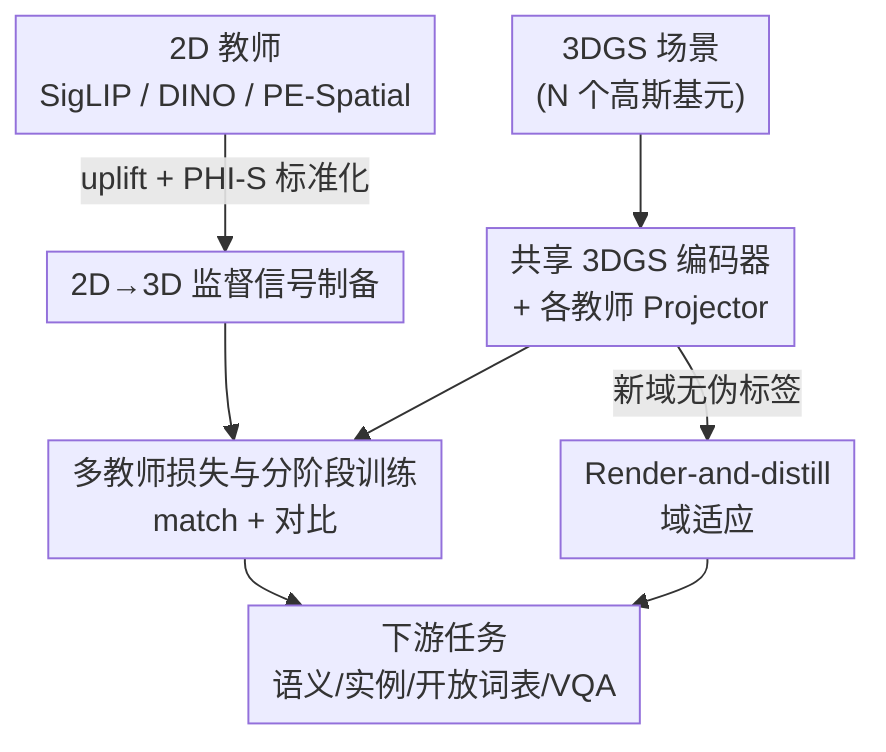

# Chorus: Multi-Teacher Pretraining for Holistic 3D Gaussian Scene Encoding

**会议**: CVPR 2026  
**论文**: [CVF Open Access](https://openaccess.thecvf.com/content/CVPR2026/html/Li_Chorus_Multi-Teacher_Pretraining_for_Holistic_3D_Gaussian_Scene_Encoding_CVPR_2026_paper.html)  
**代码**: 有（原文称 code 与 model 已开源，具体 URL 以 CVF 论文页为准 ⚠️）  
**领域**: 3D视觉  
**关键词**: 3D高斯泼溅, 多教师蒸馏, 场景编码预训练, 开放词表分割, 跨模态蒸馏  

## 一句话总结
Chorus 把语言对齐（SigLIP2）、通用视觉（DINOv3）、物体感知（PE-Spatial）三类 2D 基础模型当老师，用「共享 3DGS 编码器 + 各教师独立 projector」一次性蒸馏出一个全能的前馈 3D 高斯场景编码器，在语义/实例分割、开放词表、VQA 等一大批任务上同时刷到 SOTA，且训练场景比点云预训练基线少 8.32×～39.9×。

## 研究背景与动机
**领域现状**：3DGS（3D Gaussian Splatting）已经是高保真、可实时可微渲染的主流场景表示。围绕它，社区做了大量「给 3DGS 挂语义」的工作——把 2D 的视觉-语言特征 lift 到高斯上做开放词表分割。代表作 SceneSplat 确立了「先 lift 后对齐」（lift-then-align）的范式：把稠密 2D 语言特征提升到 3D 高斯当伪标签，训一个前馈 3DGS 编码器。

**现有痛点**：SceneSplat 这类方法基本只对齐了**语义信息**、只在语义分割上验证，编码器学到的特征偏单一——实例分组、细粒度结构、推理（VQA）这些能力几乎没被开发。换句话说，3DGS 本身作为「一种可以直接挖掘通用可迁移特征的模态」被严重低估了，大家只把它当渲染容器，没把它当表征源。

**核心矛盾**：单老师/单目标的蒸馏天然只能教会编码器一种 prior。要想得到一个真正"holistic"（全能）的 3D 编码器，就得让它同时吸收互补的信号；但不同 2D 基础模型的特征尺度、分布差异很大，简单堆在一起会互相打架、loss 难以平衡。

**本文目标**：训练一个**原生 3DGS** 的前馈编码器，让它的嵌入空间同时覆盖高层语义、实例分组、细粒度空间结构，并能既服务 3DGS 输入、也能迁移到只支持点云的任务。

**切入角度**：作者借用 2D 领域已经验证过的「multi-teacher 蒸馏比单老师更强」的经验，第一次把它专门搬到 3DGS 上——并利用 3DGS 自带的渲染能力，让"换新数据域"这件事变得便宜。

**核心 idea**：用「一个共享 3D 主干 + 每个老师一个轻量 projector」，把语言对齐、通用、物体感知三类互补老师的知识同时蒸进同一个 3D 嵌入空间。

## 方法详解

### 整体框架
Chorus 的目标是预训练一个前馈高斯场景编码器 $g_\theta$：输入一个 3DGS 场景（一堆高斯基元的参数），输出每个高斯的潜在特征 $Z \in \mathbb{R}^{N\times d_z}$。整条管线分四步：（1）先把三个 2D 老师的特征图 **uplift** 到 3D 高斯上当监督信号，并做跨老师的尺度标准化；（2）共享编码器出 $Z$ 后，每个老师挂一个独立 projector 把 $Z$ 投到该老师的特征空间，用多教师损失逼近 uplift 来的伪标签；（3）老师之间**分阶段**加入、损失里可选地加对比正则；（4）面对没有伪标签的新数据域，用 render-and-distill 在线渲染 2D 视图、在线跑老师做监督，轻量 finetune。训练好后只用编码器（或某个 projector）接下游 head，就能做语义/实例分割、开放词表、VQA。

### 关键设计

**1. 三教师互补蒸馏：一个共享主干同时学语义、实例、空间结构**

这是 Chorus 的灵魂，直接针对"SceneSplat 只学到语义、特征太单一"的痛点。作者挑了三个**功能互补**的 2D 老师：SigLIP2 提供语言对齐的语义（支撑开放词表），DINOv3 提供通用视觉特征（泛化好），PE-Spatial（Perception Encoder 的空间变体，把自对齐和 SAM-logit 对齐结合）提供物体感知的细空间结构（支撑实例分组）。架构上用一个**共享 3DGS 编码器** $g_\theta$ 出每高斯特征 $Z = g_\theta(\mathcal{G}) \in \mathbb{R}^{N\times d_z}$，再给每个老师 $t\in\{\text{lang}, \text{dino}, \text{pe}\}$ 配一个轻量 projector $h_t$（2 层 MLP + LayerNorm + GELU），产出对该老师的预测 $\hat{F}^{(t)}=h_t(Z)$。

为什么这样有效？共享主干强迫不同老师的知识压进**同一个嵌入空间**，逼出"breadth + complementarity"——编码器既要让语义可分、又要让实例能分组、还要保住空间结构；而 projector 让各老师有各自的出口、互不挤占主干容量。这跟单老师只能教一种 prior 的做法形成本质区别，也是它一个编码器能横扫多任务的根因。

**2. 把 2D 老师特征 uplift 到 3DGS 并做 PHI-S 标准化：让监督信号既准又可平衡**

要蒸馏就得先有 3D 上的监督目标，痛点在于 2D 特征怎么"落"到每个高斯上、以及三个老师量纲不一致没法统一加权。作者复用 3DGS 渲染本身的合成权重来做 uplift：3DGS 把一个像素的颜色渲染为沿视线深度排序高斯的加权和 $\mathbf{C}(\mathbf{u}\mid p)=\sum_{i} w_i(p,\mathbf{u})\,\mathbf{c}_i$，其中 $w_i = T_i\,\alpha_i$（$T_i$ 是透射率）。把颜色换成 2D 老师特征 $F_{p,\mathbf{u}}$，用**同一套归一化权重**反向得到每个高斯的目标特征：

$$f_i = \sum_{(p,\mathbf{u})\in \mathcal{S}_i} \bar{w}_i(p,\mathbf{u})\,F_{p,\mathbf{u}}, \qquad \bar{w}_i(p,\mathbf{u}) = \frac{w_i(p,\mathbf{u})}{\sum_{(p',\mathbf{u}')\in \mathcal{S}_i} w_i(p',\mathbf{u}')}$$

即"渲染权重的加权平均"，$\mathcal{S}_i$ 是所有对高斯 $i$ 有贡献的视图-像素对。拿到三个老师的 uplift 特征后，因为它们的激活尺度/方差差异很大，作者用 **PHI-S**（PCA 旋转 + 各向同性 Hadamard 缩放）把每个通道的平均方差归一、同时保住跨通道关系，得到标准化特征 $\widetilde{F}_{p,\mathbf{u}}$。这一步的实际收益很关键：标准化之后**三个老师可以用相等权重** $\lambda_t$，省掉了多教师蒸馏最头疼的 loss 调权工程。

**3. 多教师损失 + 分阶段训练：兼顾角度对齐、幅值保真与实例/语义结构**

有了监督信号，怎么逼近？基础匹配损失同时管"方向"和"大小"——cosine 负责角度对齐、SmoothL1 负责保住幅值：

$$\mathcal{L}_{\text{match}}^{(t)} = \frac{1}{|M^{(t)}|}\sum_{i\in M^{(t)}}\Big[\lambda_1\big(1-\cos(\hat{F}^{(t)}_i,\widetilde{F}^{(t)}_i)\big) + \lambda_2\,\mathrm{SmoothL1}(\hat{F}^{(t)}_i,\widetilde{F}^{(t)}_i)\Big]$$

其中 $M^{(t)}$ 是由特征范数/可见性导出的有效掩码，cosine 项前会先做 $\ell_2$ 归一化。当数据集带语义/实例标签时，再加**可选的对比正则** $\mathcal{L}_{\text{con}}^{(t)}$：对 SigLIP2 老师做类级别（按类池化均值、类内拆 A/B 两半做双向 InfoNCE），对 PE-Spatial 老师做实例级别（按实例池化均值再 InfoNCE），进一步拉开类间/实例间的可分性。三个老师不是一起上，而是**分阶段**激活——令 $\mathcal{A}(e)$ 为第 $e$ 个 epoch 的活跃老师集（如先 {lang, dino}、之后再加 pe），总目标为

$$\mathcal{L}_{\text{total}}(e) = \sum_{t\in \mathcal{A}(e)} \lambda_t\Big(\mathcal{L}_{\text{match}}^{(t)} + \eta_t\,\mathcal{L}_{\text{con}}^{(t)}\Big)$$

实现里取 $\lambda_t=1.0$、$\eta_t=0.02$。分阶段引入（尤其是把物体感知的 PE 单独晚一步加入）在消融里被证明带来稳定增益——让编码器先稳住语义和通用特征、再叠加更精细的空间/实例信号，避免一开始就被难老师带偏。

**4. Render-and-distill 域适应：换新数据域不用预算 1TB 伪标签**

uplift 范式有个现实痛点：换一个新数据域就要离线预算 3D 伪标签，存储和预处理极贵（800 个场景要约 1TB、预处理 + uplift 几个小时）。Chorus 利用 3DGS 自带渲染能力把这步搬到**在线**：给定新场景，采样相机位姿、做可见性剔除，对渲染出的 RGB 在线跑 2D 老师拿特征图，同时用当前编码器+projector 预测、再用同一套合成权重 $w_i(p,\mathbf{u})$ 把每高斯预测**渲染回 2D 特征图** $\hat{F}^{(t)}_{p,\mathbf{u}}=\sum_i w_i(p,\mathbf{u})\,\hat{F}^{(t)}_i$，然后在像素平面上复用同样的 match 损失（cosine + SmoothL1）做监督。视图怎么选也有讲究：先用最远点采样（FPS）选覆盖全场景且不贴着几何/不严重遮挡的相机位置，再按可见高斯的重叠分数配对成训练对，保证跨视图一致性。这套 render-and-distill 把预处理从 3.4h 砍到 0.2h、存储从 ~1080GB 砍到 8GB，每视图只多 <0.1s 的栅格化开销，让 OOD finetune 变得轻量可用。

### 损失函数 / 训练策略
主干用改自 Sonata 的 5-stage transformer 编码器、bottleneck 维度 512；老师为 SigLIP2-so400m-p16-512、DINOv3-ViTL16、PE-Spatial-L14-448；预训练数据来自 SceneSplat-7K 的 3DGS 场景，并为每个老师重新生成伪标签。标准模型（记 ✾）用全部高斯参数（center/color/opacity/quaternion/scale）作输入；另训一个**点云变体**（记 •）只用高斯的 center、color、估计的 normal 作输入、其余设置不变，专门用来跟点云编码器对比。此外还有一组 **3DGS-aware 增强**专门替代不适配的点云增强：点云的 jitter/dropout 会乱改高斯的 $\alpha_i$ 和 $T_i$，对基于 splat 的渲染没有意义、实测掉点。作者提出两种 splat 感知扰动——Rendering-Equivalent（给低不透明度 splat 注入协方差感知的小位移噪声，使渲染近似不变）和 Immature-Manifold（选择性放大 per-splat 协方差以模拟优化早期更糊的状态），都从渲染方程出发，消融中带来增益。

## 实验关键数据

### 主实验
零样本开放词表语义分割（前景 mIoU / mAcc，✾=3DGS 输入）：

| 数据集 | 指标 | Chorus(联合训练) | SceneSplat(联合) | 提升 |
|--------|------|------|----------|------|
| ScanNet200 | f-mIoU | 24.6 | 22.5 | +2.1 |
| ScanNet200 | f-mAcc | 47.7 | 41.7 | +6.0 |
| Matterport3D | f-mIoU | 18.7 | 14.0 | +4.7 |
| ScanNet++ | f-mIoU | 29.6 | 28.6 | +1.0 |
| InteriorGS(新域) | f-mIoU | 15.7 | 10.0 | +5.7 |
| InteriorGS(新域) | f-mAcc | 24.1 | 18.3 | +5.8 |

而且 Chorus 只用 SceneSplat 的训练数据规模、却比点云预训练的 Mosaic3D 少用 **8.32×** 训练场景。开放词表实例分割（ScanNet200，仅 3D 输入）上 Chorus 取得 3D-only 方法中最好的 mAP25=19.6，尾部 66 个稀有类上 **+7.6 mAP**，说明语义理解切实迁移到了实例级。VQA 上把 GaussianVLM 的 3D backbone 换成 Chorus（只喂最后一层特征），ScanQA 与 Nr3D 全面提升（如 Nr3D Sim 20.8→22.5、R 19.2→28.8），且训练时间只要 ~0.68×。

点云任务上的迁移（线性探针 lin. / 全量 finetune f.t.，mIoU）：

| 设置 | 数据集 | • Chorus | Sonata | 提升 |
|------|--------|----------|--------|------|
| 线性探针 | ScanNet200 | 36.0 | 28.8 | +7.2 |
| 线性探针 | ScanNet++ | 48.8 | 40.7 | +8.1 |
| 全量 finetune | ScanNet200 | 40.9 | 34.4 | +6.5 |
| 全量 finetune | ScanNet | 79.4 | 78.6 | +0.8 |

最反直觉的是：这个**只吃 point cloud 输入**的变体，竟和自监督点云 SOTA Sonata 打成平手甚至超过，却少用 **39.9×** 训练场景。

### 消融实验
| 配置 | 现象 | 说明 |
|------|------|------|
| Full model | 最佳 | 三教师 + match + 对比 + 分阶段 + 增强 |
| 去 SmoothL1（只 cosine） | 掉点 | 幅值信息丢失 |
| 去 3DGS-aware 增强 | 掉点 | 点云式 jitter 反而有害 |
| PE 与 lang/dino 同时启动（非分阶段） | 掉点 | 难老师早入会带偏 |
| 去实例级对比项 | 掉点 | 实例可分性下降 |
| 数据效率：20 标注点/场景 | +4.5 mAP vs Sonata | 低数据域优势更明显 |

域适应上（Tab.7/Fig.6）：在 InteriorGS 额外 100 个场景上跑 render-and-distill，线性探针 +2.7% mIoU；即便用低到 30×40 分辨率的 DINOv3 特征也有清晰增益。Tab.8 的点云→扰动点云实例检索里，Chorus 变体 R@1 85.4% > Sonata 79.8%，佐证「3DGS 预训练相当于点云的强增强、特征更抗噪」。

### 关键发现
- **互补老师 + 共享空间是吃多任务的根因**：单一编码器能同时拿语义、实例、VQA 的 SOTA，正是因为三类互补信号被压进同一个嵌入空间。
- **PHI-S 标准化解锁等权训练**：把多教师 loss 调权这件苦差直接消掉，$\lambda_t$ 全取 1 即可。
- **点云变体的意外强迁移**：作者自己也"surprised"——3DGS 预训练对点云像一种噪声鲁棒的强增强，加上 multi-teacher 比自监督更数据高效，二者叠加让它少 39.9× 数据还能打平 Sonata。
- **render-and-distill 把 OOD 适配的存储/预处理成本砍掉两个数量级**（1080GB→8GB），是工程上极实用的一招。

## 亮点与洞察
- **把 3DGS 当"一种模态"而非渲染容器**：直接从高斯基元里挖通用可迁移特征，是对 lift-then-align 范式的实质升级——巧在它没有引入新表征，而是榨干 3DGS 已有的渲染权重来同时做 uplift 和 render-back。
- **"渲染权重既用于 uplift、也用于 render-and-distill"的对称复用**很优雅：训练监督和域适应共用同一套 $w_i(p,\mathbf{u})$，概念统一、实现复用。
- **PHI-S + 分阶段引入老师**这套"让多教师不打架"的组合拳可直接迁移到任何 multi-teacher 蒸馏场景（不限 3D）：先标准化解耦尺度、再按难度排课式地加入老师。
- **3DGS-aware 增强提醒了一个常被忽视的点**：3DGS 是优化后的参数空间、不是 i.i.d. 点集，照搬点云增强会破坏渲染语义——增强要按渲染方程设计。

## 局限与展望
- **依赖现成 2D 老师的质量与覆盖**：三类老师决定了 3D 编码器能力的上界，老师在某领域（如室外/非室内场景）弱，蒸出来的编码器大概率也弱；论文评测以室内场景（ScanNet 系列、Matterport3D、InteriorGS）为主，室外泛化未充分验证 ⚠️。
- **对比项、分阶段、增强的若干细节放在 supplement**：如对比损失完整公式、增强的具体扰动方程、view pairing 的阈值，从正文复现有一定不确定性。
- **点云变体的"意外强迁移"目前仍是经验性 + 两条假设**（强增强 / 更数据高效），retrieval 实验只是侧证，机理层面没有给出充分理论解释。
- **改进方向**：把老师扩展到几何/法向/深度专用模型以补强结构信号；探索 render-and-distill 在真正跨域（室内→室外、合成→真实）下的极限；研究 projector 之外让老师知识在主干内更深融合的方式。

## 相关工作与启发
- **vs SceneSplat**：同属 3DGS 前馈编码器、同走 lift-then-align，但 SceneSplat 单语义老师、只验证语义分割；Chorus 用三互补老师做 multi-teacher 蒸馏，把能力扩到实例、开放词表、VQA，并补了 render-and-distill 域适应。本文是对该范式的"全能化"泛化。
- **vs Sonata（自监督点云预训练）**：Sonata 靠自监督避免几何捷径；Chorus 的点云变体靠跨模态 multi-teacher 蒸馏，结果用 39.9× 更少场景就追平/超过，说明"蒸 2D 基础模型"比"纯 3D 自监督"更数据高效。
- **vs Mosaic3D 等点云开放词表方法**：它们多需 3D+2D 双输入、要昂贵的多视图处理；Chorus 是纯 3D 输入的前馈编码器，尾部稀有类上 +7.6 mAP，强调 feed-forward 的部署友好。
- **vs 2D 多教师蒸馏（如 AM-RADIO 一类）**：把"多教师聚合"的成熟经验首次专门移植到 3DGS，并结合 3DGS 渲染特性做 uplift/适配——是"已验证范式 + 新模态特性"的有效嫁接。

## 评分
- 新颖性: ⭐⭐⭐⭐⭐ 首个把 multi-teacher 蒸馏系统性搬到 3DGS 的工作，渲染权重对称复用 + PHI-S 等权训练都很巧。
- 实验充分度: ⭐⭐⭐⭐⭐ 语义/实例/开放词表/VQA/点云迁移/数据效率/域适应全覆盖，8 张表 + 多组消融。
- 写作质量: ⭐⭐⭐⭐ 方法叙述清晰、动机扎实；部分公式与增强细节压在 supplement，正文略紧。
- 价值: ⭐⭐⭐⭐⭐ 一个编码器横扫多任务 + 极高数据效率 + 轻量域适应，对 3DGS 表征学习是很实用的范式样板。

<!-- RELATED:START -->

## 相关论文

- [\[CVPR 2026\] SPE-MVS: Spatial Position Encoding Enhanced Multi-View Stereo with Monocular Depth Priors](spe-mvs_spatial_position_encoding_enhanced_multi-view_stereo_with_monocular_dept.md)
- [\[CVPR 2026\] Changes in Real Time: Online Scene Change Detection with Multi-View Fusion](changes_in_real_time_online_scene_change_detection_with_multi-view_fusion.md)
- [\[CVPR 2026\] VDFE: Difference-Aware 3D Scene Editing with Non-Intrusive Video Diffusion Priors for Multi-View Consistency and Efficiency](vdfe_difference-aware_3d_scene_editing_with_non-intrusive_video_diffusion_priors.md)
- [\[CVPR 2026\] Confidence-Guided Multi-Scale Aggregation for Sparse-View High-Resolution 3D Gaussian Splatting](confidence-guided_multi-scale_aggregation_for_sparse-view_high-resolution_3d_gau.md)
- [\[CVPR 2026\] Uni3R: Unified 3D Reconstruction and Semantic Understanding via Generalizable Gaussian Splatting from Unposed Multi-View Images](uni3r_unified_3d_reconstruction_and_semantic_understanding_via_generalizable_gau.md)

<!-- RELATED:END -->
