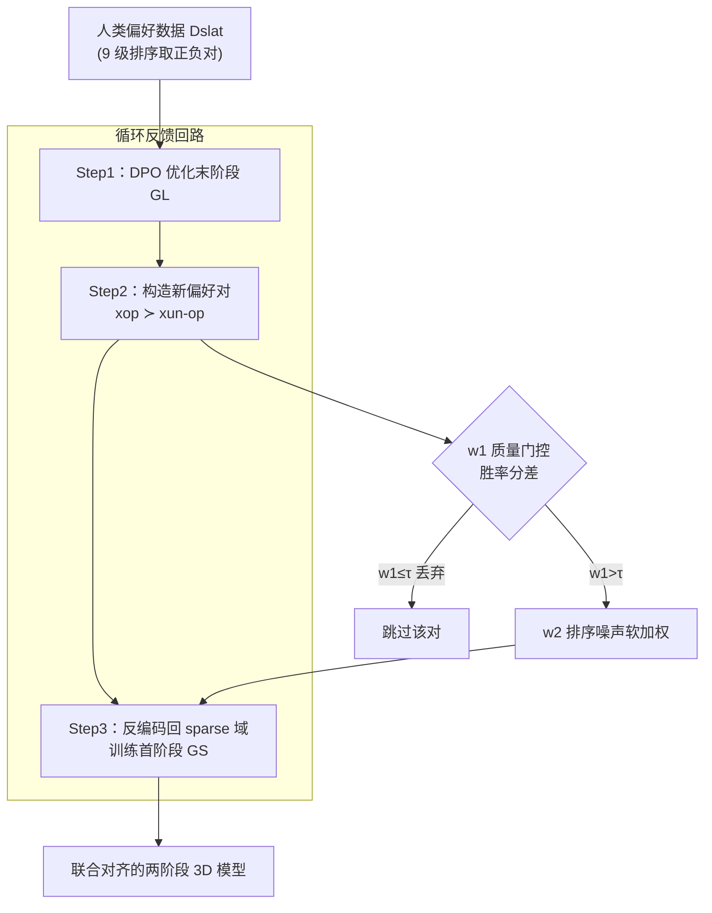

# Circular-DPO: Aligning Multi-Stage 3D Generative Models via Preference Feedback Loop

**会议**: CVPR 2026  
**论文**: [CVF Open Access](https://openaccess.thecvf.com/content/CVPR2026/html/Li_Circular-DPO_Aligning_Multi-Stage_3D_Generative_Models_via_Preference_Feedback_Loop_CVPR_2026_paper.html)  
**代码**: 无（论文未公开）  
**领域**: 3D视觉 / 对齐RLHF / 扩散模型  
**关键词**: 3D生成, 偏好对齐, DPO, 多阶段流水线, Trellis  

## 一句话总结
针对 Trellis 这类「先生成稀疏结构、再填充局部细节」的两阶段 3D 生成模型，作者用一个「数据回路」把末阶段 DPO 对齐后产生的偏好信号绕过中间不可微的离散化操作、反编码回首阶段去训练，再配合两道噪声过滤权重，让几何与纹理被联合对齐——ImageReward 比 Trellis 基线提升 35.15%、Reward3D 提升 21.44%。

## 研究背景与动机
**领域现状**：当前高质量 3D 生成主流走「多阶段」路线——把几何结构和纹理细节解耦到不同阶段分别生成。以 Trellis 为代表的 3D native 方法是典型的两阶段：第一阶段用 Rectified Flow Transformer $G_S$ 生成稀疏体素结构 $x_{sparse}$ 勾勒物体表面，第二阶段在该结构条件下用稀疏卷积 Transformer $G_L$ 生成结构化隐变量 $x_{slat}$（编码细粒度几何与纹理），二者通过 SLAT 表示耦合。

**现有痛点**：这些模型生成的 3D 内容常常对不上人类审美/功能偏好。最自然的修法是用 DPO 对齐，但只能作用在最终输出（即第二阶段 $G_L$）上。

**核心矛盾**：多阶段之间存在**不可微操作**。Trellis 第一阶段输出连续特征网格，解码后被离散化成「活跃体素索引集合」交给第二阶段当条件——这个离散化+索引过程不可微，直接切断了计算图。于是末端 DPO 的梯度**无法回传到决定几何骨架的首阶段**。而如果对两个阶段各自单独做 DPO（stage-wise），又会产生几何—纹理不一致（non-manifold 几何、纹理细节丢失）。

**本文目标**：在不可微的多阶段流水线里，把人类偏好信号从最终 3D 资产**贯通地**传播回早期阶段，实现整链联合对齐，同时抗住偏好数据里的噪声。

**切入角度**：既然梯度过不去，那就**不传梯度、传数据**——把「对齐后模型 vs 对齐前模型」生成结果的差异，显式构造成新的偏好对，作为「无法回传的梯度」的替代信号喂给前一阶段。

**核心 idea**：用一个「偏好反馈回路（Circular-DPO）」——末阶段 DPO 对齐 → 用优化前后两个模型采样出新偏好对 → 反编码回稀疏域训练首阶段——把不可微的断点桥接起来。

## 方法详解

### 整体框架
方法是对一个已训练好的两阶段 3D 生成流水线（以 Trellis 为载体）做后训练对齐。输入是一份人类排序的偏好数据集 $D_{slat}$，输出是一个几何与纹理被**联合对齐**到人类偏好的两阶段模型。

整条流水线分三步走，本质是一个绕过不可微断点的「数据回路」：先对末阶段 $G_L$ 做 DPO，再用「优化后模型」和「原始参考模型」对同一 prompt 各采样一个资产、配成新的偏好对，最后把这对资产反编码回稀疏域去训练首阶段 $G_S$。两步训练之间，所有偏好对都要先过 $w_1$ 质量门控（硬过滤）和 $w_2$ 排序噪声软加权（重加权），再进入 DPO 损失。

整套方法建立在 Flow-Matching 版 DPO 之上。Flow Matching 学一个时变向量场 $v_\theta(x,t)$ 把先验 $p_0$ 输运到数据分布 $p_1$，条件流匹配用线性插值定义路径 $x(t)=(1-t)x_0+tx_1$，并以时刻 $t$ 的 MSE 衡量预测向量场与目标向量场的差距：$\text{MSE}_t(x_0,x_1;\theta)=\lVert v_\theta((1-t)x_0+tx_1,t)-(x_1-x_0)\rVert_2^2$。Flow-DPO 则证明 DPO 目标里的对数似然比可以用这个 MSE 近似，从而把对齐写成一个对偏好对 $x^w\succ x^l$ 的分类式损失。本文统一用如下带权重 $w_2$ 的通用 DPO 损失（对任意子数据集 $D'$、生成器 $G$）：

$$\mathcal{L}_{DPO}(D';G)=-\mathbb{E}_{(x_0^w,x_1^w),(x_0^l,x_1^l)\sim D',\,t}\,\log\sigma\Big(\beta T w_2\big[\big(\text{MSE}_t(x_0^w,x_1^w;G_{ref})-\text{MSE}_t(x_0^w,x_1^w;G_{opt})\big)-\big(\text{MSE}_t(x_0^l,x_1^l;G_{ref})-\text{MSE}_t(x_0^l,x_1^l;G_{opt})\big)\big]\Big)$$

直觉上它在「拉高 winning 样本相对参考模型的似然、压低 losing 样本似然」，$\beta$ 是 DPO 温度。三步流程只是把这个同一损失分别套在 $G_L$、$G_S$ 上、喂不同的数据。

### 关键设计

**1. 循环反馈回路：用「数据」替代过不去的「梯度」桥接不可微断点**

这是全文的骨架，针对「末端 DPO 梯度无法回传到首阶段」这个核心矛盾。回路分三步：

- **Step1 优化末阶段**：在预处理好的人类偏好数据 $D_{slat}$ 上，对第二阶段隐变量生成器 $G_L$ 做 DPO，即 $\min_{G_L}\mathcal{L}_{DPO}(D_{slat},G_L)$，得到一个直接对齐了最终细节的策略模型 $\theta_{opt}^{slat}$。
- **Step2 构造新偏好对**：对每个 prompt，用 Step1 得到的优化模型采一个资产 $x_{op}$，用原始参考模型采一个 $x_{un\text{-}op}$，配成新偏好对 $(x_{op}, x_{un\text{-}op})$，并令 $x_{op}\succ x_{un\text{-}op}$。这对资产的**差异**就编码了「对齐 vs 未对齐」二阶段模型之间的偏好方向，正好充当那个回传不了的梯度的替身。
- **Step3 指导前置阶段**：这对资产是 VAE 解码后的 3D 模型，要传给稀疏结构模型 $G_S$，必须先**反编码回稀疏域**——把它们重新走一遍数据准备流程（体素化 + VAE 编码）得到 $x_{sparse}$，再以 $x_{op}$ 为正、$x_{un\text{-}op}$ 为负，对首阶段做 $\min_{G_S}\mathcal{L}_{DPO}(\{(x_{op},x_{un\text{-}op})\},G_S)$。

之所以有效：偏好信号不再依赖连续梯度路径，而是被「物化」成数据样本，再借助 Trellis 自带的体素化/编码管线无损地搬回稀疏域，于是离散化断点对它透明。相比单独对每阶段做 DPO，这种「末阶段对齐结果反向定义首阶段偏好」的做法保证了几何骨架与纹理细节朝同一个偏好方向更新，避免了 stage-wise 对齐的几何—纹理不一致。

**2. w1 质量门控：用全局胜率分差过滤不可靠的偏好对**

新构造和原始的偏好对里都混有「固有数据噪声」（低质量或标错的对）。作者设计一个质量分数做**硬过滤**。对某 prompt $c$，从优化策略 $\theta_{opt}^{slat}$ 采 $k$ 个资产、从参考策略 $\theta_{ref}^{slat}$ 采 $N-k$ 个，共 $N$ 个候选，用预训练奖励模型 $R_\phi(I_i,c)$ 给每个打分；统计每个资产在所有两两比较中的胜场数 $C_i$，转成偏好概率

$$P(I_i)=\frac{2C_i}{N(N-1)}$$

再做 $G_i=2P(I_i)-1$ 放大分差，最终一对 $(I_{op},I_{un\text{-}op})$ 的质量分为 $w_1=G_{op}-G_{un\text{-}op}$。$w_1$ 越大说明这对的质量差距越明确、越可信。作者直接用它过滤：阈值 $\tau=0$，凡 $w_1\le\tau$ 的对一律丢弃（图 3 里「$w_1>0$ 才 Train，否则 SKIP」）。这等于剔除掉那些「赢家其实没比输家好」的脏对，避免它们把 DPO 带偏。

**3. w2 排序噪声软加权：按奖励模型可信度对保留下来的对再调权**

即便过了 $w_1$ 门控，仍可能有「排序噪声」——偏好顺序本身可疑的对。作者引入一个动态软权重 $w_2$ 来**降权**这些可疑对，而不是直接扔掉（保留数据多样性）。它基于奖励模型 $r$ 下该偏好对的对数似然：

$$h(c,x^w,x^l)=\log\sigma\big(r(c,x^w)-r(c,x^l)\big)$$

$$w_2(c,x^w,x^l)=\frac{\exp(h)}{\mathbb{E}_D[\exp(h)]}$$

即「奖励模型认为越可能成立的偏好对，权重越高」，并按整个数据集做归一化。这个 $w_2$ 正是上面通用损失里乘在括号外的那个系数。最终损失把两道机制合起来——只对过了 $w_1$ 门的对计算 DPO、并按 $w_2$ 加权：

$$\mathcal{L}_{\text{Circular-DPO}}=\begin{cases}\mathcal{L}_{DPO} & \text{if } w_1>\tau\\[2pt]0 & \text{if } w_1\le\tau\end{cases}$$

$w_1$ 是硬门、$w_2$ 是软秤，二者一刀切一微调，互补地压住两类噪声。

### 一个例子：一对资产怎么走完回路
拿 prompt「a 3d model of a modern black leather chair with a metal base」为例：Step1 先在 $D_{slat}$ 上把 $G_L$ 对齐成 $\theta_{opt}^{slat}$；Step2 用对齐后模型采出一个椅背更协调的 $x_{op}$、用原模型采出一个较差的 $x_{un\text{-}op}$，配成偏好对；这对资产先过 $w_1$——奖励模型若判定 $x_{op}$ 的全局胜率确实高于 $x_{un\text{-}op}$（$w_1>0）$ 就保留，否则跳过；保留下来的对算 $w_2$ 决定它在 batch 里的话语权；最后把这对 3D 资产体素化+编码回 $x_{sparse}$，以 $x_{op}\succ x_{un\text{-}op}$ 训练首阶段 $G_S$，让它学会「生成更靠近对齐版」的几何骨架。一轮下来，几何与纹理朝同一偏好方向被更新。

### 损失函数 / 训练策略
- 统一损失即上文 $\mathcal{L}_{DPO}(D';G)$，Step1 套在 $G_L$、Step3 套在 $G_S$，括号外乘 $w_2$、由 $w_1$ 门控（式 12）。
- 偏好数据来自 DreamReward（1000 prompt，每个 9 个排序资产），取高排序为正、低排序为负组成对。
- 方法是 **off-policy**：从固定数据集学习，作者明确说不研究多轮训练性能，只评估其在固定数据上的学习效率。

## 实验关键数据

评测集为新构造的 100 个 prompt（30 个取自 3DRewardDB + Gemini 2.5 Pro 基于全库生成 70 个），用 ImageReward(IR)、HPSv2、Reward3D(R3D)、CLIP Score 四个指标，并做 20 人用户研究。作者把方法同时挂在 Trellis（3D native）和 MVDream（2D 监督）两类载体上。

### 主实验（表 1，节选，↑ 越大越好）

| 方法 | IR↑ | HPSv2↑ | R3D↑ | CLIP↑ |
|------|------|--------|------|-------|
| Trellis（基线） | -0.4596 | 0.1991 | -0.7137 | 0.3183 |
| **OURS-Trellis** | **-0.3146** | **0.2024** | **-0.5607** | **0.3290** |
| MVDream（基线） | -0.3948 | 0.2013 | -0.4292 | 0.3231 |
| **OURS-MVDream** | -0.3747 | **0.2030** | **-0.1047** | **0.3265** |
| DreamReward | -0.1930 | 0.1985 | 0.2733 | 0.3182 |
| DreamDPO | -0.3774 | 0.2013 | -0.1767 | 0.3234 |

在 Trellis 载体上，相对基线 IR 提升 35.15%、R3D 提升 21.44%；HPSv2 / CLIP 也分别比次优方法高 1.6% / 1.4%。作者坦言：方法稳定优于自己的基线，但**并未超过基于 score-distillation 的方法**（如 DreamReward 的 R3D 仍明显更高），这是该框架当前的天花板。

### 消融实验（表 2，指标 IR / R3D 为主）

| 配置 | IR↑ | R3D↑ | 说明 |
|------|------|------|------|
| (a) 完整 Circular-DPO | **-0.3146** | **-0.5607** | 全套 |
| (b) w/o-bridge | -0.3663 | -0.5969 | 去掉跨阶段桥接（不构回路） |
| (c) dpo-only s1 | -0.3748 | -0.6338 | 只对首阶段 DPO |
| (d) dpo-only s2 | -0.5512 | -0.7112 | 只对末阶段 DPO（即朴素 DPO） |
| (e) only s1 | -0.4187 | -0.6912 | 仅训首阶段 |
| (f) only s2 | -0.4410 | -0.6770 | 仅训末阶段 |
| (g) w/o-w1 | -0.3246 | -0.6199 | 去掉质量门控 |
| (h) w/o-w2 | -0.4908 | -0.6661 | 去掉排序软加权 |
| (i) Trellis | -0.4596 | -0.7137 | 原始模型 |

相比「对两阶段各自单独做 DPO」，完整方法 IR 提升 14.11%、R3D 提升 6.06%，印证回路带来的联合优化优于 stage-wise 拼接。

### 关键发现
- **回路桥接是主贡献**：去掉桥接 (b) 后 IR 从 -0.3146 退到 -0.3663；而朴素只对末阶段 DPO (d) 直接掉到 -0.5512，几乎等于没怎么改善——说明只对最终输出对齐远不够，几何骨架必须一起动。
- **$w_2$ 比 $w_1$ 更关键**：去掉 $w_2$ (h) IR 大跌到 -0.4908（接近原始 Trellis），而去掉 $w_1$ (g) 仅微降到 -0.3246。即排序噪声的软加权对稳定性贡献远大于质量硬门控。
- **用户研究**：20 名有 3D 建模经验者参与，约 **69% 偏好本方法**生成的资产，且在文本-资产对齐、3D 合理性、纹理细节、几何细节等所有维度平均分都高于 Trellis。

## 亮点与洞察
- **"传数据不传梯度"**：面对不可微断点，多数工作想办法把操作改可微（gumbel/straight-through 等），本文反其道——把偏好信号物化成「对齐前后两个模型的输出差」当成梯度替身，再借模型自带的编码管线无损搬回前一阶段。这个思路可迁移到任何「阶段间有离散/采样断点」的多阶段生成（如先检索后生成、先布局后渲染）。
- **两道噪声拆开治**：把偏好对噪声明确拆成「质量噪声（赢家不够好）」和「排序噪声（顺序本身可疑）」，分别用硬门控 $w_1$ 和软加权 $w_2$ 处理，消融显示二者贡献不对称，是个干净可复用的偏好数据清洗范式。
- **自举式偏好对**：Step2 用「优化后 vs 原始」模型自采样造对，不需额外人工标注就把末阶段的对齐增量传导给前阶段，省标注成本。

## 局限与展望
- **天花板明显**：作者自己承认不及 score-distillation 路线（DreamReward 的 R3D 高出一截），绝对指标 IR/R3D 仍多为负值，说明对齐幅度有限。
- **off-policy 单轮**：明说不研究多轮训练，回路只跑一圈。⚠️ 若多轮迭代是否会累积偏差或继续提升，论文未给答案，存疑。
- **依赖奖励模型质量**：$w_1$（$R_\phi$）和 $w_2$（$r$）都重度依赖预训练奖励模型，若奖励模型本身有偏，两道过滤会一起被带歪。
- **强绑定 Trellis 式结构**：Step3 的「反编码回 sparse 域」依赖 Trellis 的体素化+VAE 管线，换一种无对应可逆编码的多阶段架构时迁移成本未知。

## 相关工作与启发
- **vs 朴素 Diffusion/Flow-DPO**：它们只能对齐最终输出（这里的 dpo-only s2），无法触及决定几何的早期阶段；本文用回路把偏好传到首阶段，消融 (d)→(a) 即这一差距。
- **vs stage-wise 单独对齐**：对每阶段各自 DPO 会导致几何—纹理不一致（non-manifold、纹理丢失）；本文以「末阶段对齐结果」反向定义首阶段偏好，强制两阶段同向更新。
- **vs DreamReward / DreamDPO**：同样做 3D 偏好对齐，但它们走 2D 监督/score-distillation 路线且通常面向单阶段优化；本文专门解决「多阶段、阶段间不可微」这一结构性难题，是正交贡献，但绝对效果尚不及前者。

## 评分
- 新颖性: ⭐⭐⭐⭐ 「物化梯度走数据回路桥接不可微断点」的范式新颖、问题定位精准。
- 实验充分度: ⭐⭐⭐⭐ 双载体 + 八组消融 + 用户研究较完整，但缺多轮/多架构验证。
- 写作质量: ⭐⭐⭐ 思路清楚，但原文公式/图注排版较乱、部分指标解读偏笼统。
- 价值: ⭐⭐⭐⭐ 为多阶段 3D 生成的偏好对齐提供了可复用框架，尽管绝对性能尚未登顶。

<!-- RELATED:START -->

## 相关论文

- [\[ICML 2025\] D-Fusion: Direct Preference Optimization for Aligning Diffusion Models with Visually Consistent Samples](../../ICML2025/3d_vision/d-fusion_direct_preference_optimization_for_aligning_diffusion_models_with_visua.md)
- [\[ICCV 2025\] DSO: Aligning 3D Generators with Simulation Feedback for Physical Soundness](../../ICCV2025/3d_vision/dso_aligning_3d_generators_with_simulation_feedback_for_physical_soundness.md)
- [\[CVPR 2026\] GenMatter: Perceiving Physical Objects with Generative Matter Models](genmatter_perceiving_physical_objects_with_generative_matter_models.md)
- [\[ICML 2025\] ADHMR: Aligning Diffusion-based Human Mesh Recovery via Direct Preference Optimization](../../ICML2025/3d_vision/adhmr_aligning_diffusion-based_human_mesh_recovery_via_direct_preference_optimiz.md)
- [\[CVPR 2026\] OMGTex: One-stage Multi-style Facial Texture Reconstruction without Geometry Guidance](omgtex_one-stage_multi-style_facial_texture_reconstruction_without_geometry_guid.md)

<!-- RELATED:END -->
