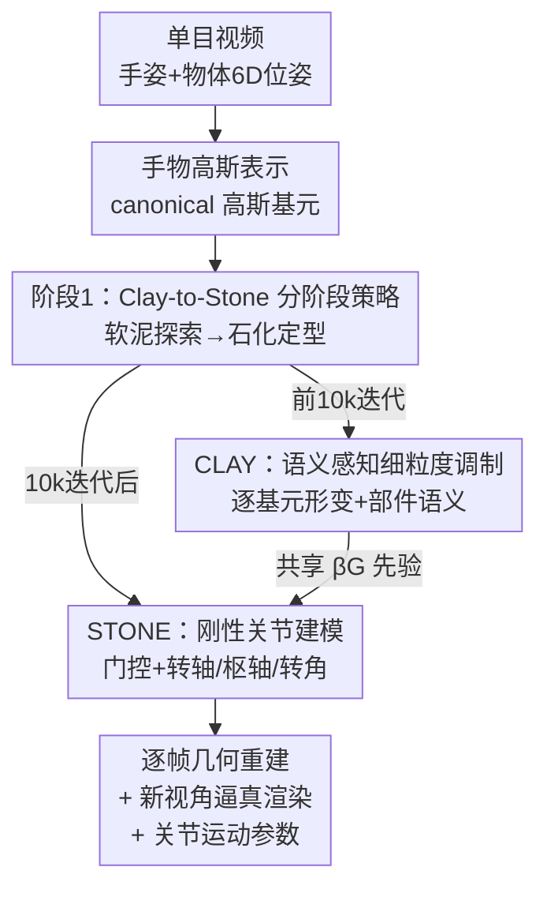

# Clay-to-Stone: Phase-wise 3D Gaussian Splatting for Monocular Articulated Hand-Object Manipulation Modeling

**会议**: CVPR 2026  
**论文**: [CVF Open Access](https://openaccess.thecvf.com/content/CVPR2026/html/Liu_Clay-to-Stone_Phase-wise_3D_Gaussian_Splatting_for_Monocular_Articulated_Hand-Object_Manipulation_CVPR_2026_paper.html)  
**代码**: https://github.com/ru1ven/ARGS  
**领域**: 3D视觉  
**关键词**: 手物交互, 关节物体建模, 3D高斯泼溅, 单目重建, 分阶段优化  

## 一句话总结
针对单目视频里"几何形状"与"关节运动"强耦合导致优化不稳定的问题，本文提出 Clay-to-Stone 双阶段 3DGS 框架——先用"软泥"阶段（CLAY）做细粒度、语义感知的自由形变去探索结构与运动，再用"石化"阶段（STONE）施加刚性约束、显式估计转轴/枢轴/转角，在 ARCTIC 关节物体数据集上同时拿到 SOTA 的几何重建与逼真渲染。

## 研究背景与动机
**领域现状**：从单目 RGB 视频重建手-物交互是 AR/VR 与机器人操作的核心能力。近年 HOLD、BIGS 等方法用 NeRF / 3DGS 把手和物体重建得很逼真，3DGS 还因为显式几何表示而高效。

**现有痛点**：这些方法几乎都假设"刚性抓握 + 物体几何静止"。可现实里大量日常物体是带铰链的关节体——翻盖手机、容器盖、剪刀、笔记本电脑。一旦物体在被操作过程中关节连续转动、部件持续形变，这类静态假设就彻底失效。另一条路线（针对人体衣物的非刚性形变方法）虽能建模动态形状，但它们是"以人体为中心"、靠预定义骨架和"视觉相似的表面拟合"驱动局部形变，无法区分关节物体里"哪些部件该动、哪些不该动"的语义/功能角色，会把不同部件的形变混在一起。

**核心矛盾**：单目观测下，物体的**内在几何**与**动态关节运动**互相混淆（mutually confounding）。运动带来的视觉变化会放大形状歧义；而形状没建好时又没法可靠估计运动。如果一上来就同时优化几何和关节、并过早施加关节约束，优化会变得既歧义又不稳定，反而压制了对复杂结构的探索。

**本文目标**：在只有单目视频、关节参数未知的条件下，同时恢复出（i）逐帧的高保真几何、（ii）物理合理的关节结构与运动参数（转轴、枢轴、逐帧转角）。

**切入角度**：作者认为既然几何和运动相互纠缠，就**不要从一开始就联合刚性建模**，而应"分阶段、按粒度递进"——先在松弛粒度下凭数据驱动的视觉/语义一致性启发式地发现运动规律，等语义与运动先验浮现后，再在刚性粒度下固化结构、显式求解参数。这正对应"黏土塑形 → 石化定型"的隐喻。

**核心 idea**：用一个 phase-wise 的 3DGS 框架，把建模粒度从"柔软、分布式的自由形变"逐步收紧到"清晰、刚性的部件结构"，以此解耦几何-运动纠缠。

## 方法详解

### 整体框架
输入是一段单目 RGB 操作视频，已知 MANO 手部姿态与物体 6-DoF 位姿（关节参数未知）；输出是逐帧几何重建、新视角逼真渲染，以及关节运动参数。手和物体都用 canonical 空间下的 3D 高斯基元表示：左右手 $\{\mathcal{G}_l\}$、$\{\mathcal{G}_r\}$ 与物体 $\{\mathcal{G}_o\}$，每个高斯由均值 $\mu$ 和协方差 $\Sigma=\mathbf{R}\mathbf{S}\mathbf{S}^\top\mathbf{R}^\top$ 参数化，最终像素颜色由所有高斯按深度顺序 alpha 合成 $C=\sum_{i\in\mathcal{N}_\text{ho}}\mathbf{c}_i\alpha_i\prod_{j=1}^{i-1}(1-\alpha_j)$。手部用线性混合蒙皮（LBS）从 canonical 变换到 posed 状态，物体用刚性 6D 变换。

整条 pipeline 的精髓在于"分两阶段、共享同一套高斯"：前 10,000 次迭代是 CLAY 阶段，让物体高斯做细粒度、语义感知的自由形变，凭 2D 光度与语义一致性去探索"哪块在动、怎么动"；第 10,000 次迭代后激活 STONE 阶段，把前一阶段学到的语义/运动先验固化成刚性关节结构，并显式回归转轴、枢轴与逐帧转角。两阶段靠一组全局共享的调制因子 $\beta_\mathcal{G}$ 串起来——它在 CLAY 里既调形变幅度又编码部件语义分数，在 STONE 里被转成"运动资格"门控信号。

### 关键设计

**1. Clay-to-Stone 双阶段策略：用"递进的建模粒度"解耦几何-运动纠缠**

这一条是全文的灵魂，直接对应"一上来就联合刚性优化会歧义又不稳"的核心痛点。作者把建模过程切成两个粒度递进的阶段：CLAY 阶段（"软泥"）在松弛粒度下允许高斯自由形变，凭视觉一致性启发式地探索局部形状与运动模式，**不施加任何预定义关节规则**，从而不会过早地把优化锁死在错误结构上；当语义和运动先验在形变过程中逐渐浮现后，STONE 阶段（"石化"）才施加刚性约束，把柔性形变固化成物理合理的关节结构并显式求参。实现上以迭代步数作为相位切换点（前 10k 步 CLAY，之后激活 STONE）。它和"从一开始就联合建模"的区别在于：先探索、后约束，让形状/运动在没有刚性枷锁时充分展开，等可靠先验出现再收紧——消融里"从头就上刚性约束"（w/o Clay）反而做不出合理关节，正说明了这个顺序的必要性。

**2. CLAY 阶段——逐基元调制 + 语义一致性：让每个高斯"按语义角色"形变**

CLAY 要解决的是"非刚性形变方法分不清部件语义、会把该动的和不该动的混在一起"。作者给每个物体高斯关联一个可学习的调制因子 $\beta\in\mathbb{R}$，全部 $N$ 个高斯构成 $\beta_\mathcal{G}\in\mathbb{R}^N$，它身兼两职：调制每个高斯相对 canonical 的形变幅度，同时编码部件级语义分数。形变编码本身是"像素对齐"的：用预训练 ViT 抽视觉特征 $\mathbf{I}_\mathcal{F}^t$，把 3D 高斯点投影到 2D 取 $\mathbf{I}_\mathcal{F}^t(\pi(\mathbf{x}))$，与多级 hash-grid 特征 $\mathbf{h}$ 一起喂 MLP 得到潜形变编码

$$\mathbf{Z}_t = \text{MLP}\big(\mathbf{I}_\mathcal{F}^t(\pi(\mathbf{x})),\ \mathbf{h}\big),$$

再用调制因子逐元素作用产生语义感知形变 $(\delta\mathbf{x}_t,\delta\mathbf{s}_t,\delta\mathbf{q}_t,\delta\mathbf{c}_t)=\text{sigmoid}(\beta_\mathcal{G})\cdot\mathbf{Z}_t$。关键在于：$\mathbf{Z}_t$ 是逐帧独立算的，但 $\beta_\mathcal{G}$ 是**跨帧全局共享**的，这就强制了"同一部件在不同帧里以一致方式形变"的时序一致性——比只靠时间编码做逐帧形变的旧方法更能锁住部件级运动模式。为把 $\beta_\mathcal{G}$ 对齐到真实 3D 语义，作者加了两路监督：光度一致性（像素偏差大处给更高调制权重，对应"正在形变"的部件）与部件级语义一致性（把 $\beta_\mathcal{G}$ 经 Gumbel sigmoid 变成近二值权重后 alpha 渲染出部件掩码 $M_\text{part}^t$，再和 SAM2 给的 2D 部件分割对齐）。

**3. STONE 阶段——刚性门控 + 转动关节参数估计：把自由形变"石化"成可解释的运动**

CLAY 学到的自由形变虽然视觉/几何上合理，却抓不到"功能交互所需的受约束机械运动"。STONE 的第一步是**刚性门控**：复用 $\beta_\mathcal{G}$ 经 Gumbel sigmoid 得到运动资格信号 $\mathbf{e}=g(\beta_\mathcal{G})$，它决定每个高斯被允许运动的程度，确保只有语义上有效的可动区域才参与关节运动；Gumbel sigmoid 提供了可微的近二值门控，既能对静态部件做硬遮罩、又保持端到端可训练。第二步是**转动关节参数估计**：本文聚焦 revolute joint（转动关节），用 3D 转轴 $\mathbf{l}$（$\|\mathbf{l}\|=1$）、枢轴点 $\mathbf{p}$ 和逐帧转角 $\theta_t$ 参数化。由于枢轴和转轴是物体几何固有、跨操作不变的，可从高斯点的空间分布（hash-grid 特征）稳定回归：枢轴是高斯位置的加权和 $\mathbf{p}=\sum_i w_i\mathbf{x}_i$、权重由 $\text{softmax}(\text{MLP}_\text{pivot}(\mathbf{h}_i))$ 给出；转轴取这些高斯平均 hash 特征过 $\text{MLP}_\text{axis}$ 后归一化。而逐帧转角反映瞬时形变状态，用 CLAY 的 $\mathbf{Z}_t$、门控信号 $\mathbf{e}$ 与可学习时间嵌入 $\phi_t$ 一起算出一个 2D 旋转嵌入再取角度：

$$\mathbf{v}_t=\text{MLP}_\text{angle}(\mathbf{e}\cdot\mathbf{Z}_t,\ \phi_t),\qquad \theta_t=\arctan2(\mathbf{v}_{t,y},\mathbf{v}_{t,x}).$$

一旦转动关节被准确推断，几何-关节的耦合歧义就被缓解，于是作者**联合优化关节参数与高斯属性**，让运动和几何互相强化、协同细化——这正是分阶段策略想换取的"先验浮现 → 稳定收敛"。

### 损失函数 / 训练策略
总优化目标在 alpha 合成渲染上同时施加光度、语义、时序三类一致性：光度上用 L1 颜色损失 $\mathcal{L}_\text{RGB}$、掩码不透明度损失 $\mathcal{L}_\text{mask}$、以及用 AlexNet 算 LPIPS 的感知损失 $\mathcal{L}_\text{perc}$；部件语义上用 $\mathcal{L}_M=\|M_\text{part}-\hat{M}\|_1$ 对齐 SAM2 分割，配合 $\mathcal{L}_\text{reg}=\|\beta_\mathcal{G}\|_2^2$ 抑制无谓形变，再加 as-isometric-as-possible 约束（$\mathcal{L}_\text{iso-pos}$、$\mathcal{L}_\text{iso-cov}$）保持同部件内邻近高斯的相对距离与协方差、维持局部刚性；时序上用速度+加速度正则 $\mathcal{L}_t=\sum_t\|\theta_t-\theta_{t-1}\|_2^2+\lambda_\text{acc}\sum_t\|\theta_t-2\theta_{t-1}+\theta_{t-2}\|_2^2$ 约束转角平滑。每个序列共 25,000 次迭代、STONE 在第 10,000 次后激活，单序列在 RTX 4090 上约 3 小时。

## 实验关键数据

### 主实验
在 ARCTIC 真实双手操作数据集上评测（11 个关节物体，每个由转动关节连接两个刚性部件，View 1 训练 / View 8 新视角评测）。几何用 Chamfer 距离（cm²，ICP 对齐）与 F-score@5mm/10mm，渲染用 PSNR/SSIM/LPIPS（LPIPS ×1000）。下表为 11 物体平均：

| 任务 | 指标 | 3DGS-Avatar | w/o CLAY | w/o STONE | 本文 |
|------|------|-------------|----------|-----------|------|
| 几何重建 | CD ↓ | 3.83 | 4.22 | 2.82 | **1.97** |
| 几何重建 | F@5 ↑ | 0.677 | 0.663 | 0.680 | **0.741** |
| 几何重建 | F@10 ↑ | 0.831 | 0.819 | 0.848 | **0.884** |
| 渲染 | PSNR ↑ | 27.51 | 27.63 | 27.77 | **28.17** |
| 渲染 | SSIM ↑ | 0.9584 | 0.9600 | 0.9597 | **0.9606** |
| 渲染 | LPIPS ↓ | 39.13 | 37.88 | 37.46 | **35.43** |

与刚性抓握基线（在 9 个物体上、排除剪刀/手机等小物体）对比，本文 canonical 态重建全面领先：

| 方法 | CD ↓ | F@5 ↑ | F@10 ↑ |
|------|------|-------|--------|
| HOLD | 2.07 | 0.371 | 0.639 |
| BIGS | 1.28 | - | 0.839 |
| 本文 - canonical | **0.79** | **0.783** | **0.915** |
| 本文 - articulated（逐帧） | 2.32 | 0.703 | 0.869 |

注意逐帧 articulated 的 CD（2.32）在极端关节角下会升高——作者解释 CD 对部件空间错位敏感，但 F-score 仍很高，说明整体重建质量被保住了。⚠️ 横向比较时 canonical 与 articulated 是不同难度设定，不宜直接拿数字大小下结论。

### 消融实验
模块级消融（box / notebook / waffle iron 三物体平均渲染指标）：

| 配置 | PSNR ↑ | SSIM ↑ | LPIPS ↓ | 说明 |
|------|--------|--------|---------|------|
| w/o 调制因子 $\beta_\mathcal{G}$ | 26.73 | 0.9652 | 34.41 | 掉点最猛，语义调制是核心 |
| w/o 视觉嵌入 $\mathbf{I}_\mathcal{F}$ | 28.32 | 0.9660 | 33.18 | 主要影响渲染感知质量 |
| w/o 分割损失 $\mathcal{L}_M$ | 27.76 | 0.9659 | 31.95 | SAM2 监督维持语义一致 |
| w/o 时序损失 $\mathcal{L}_t$ | 28.48 | 0.9665 | 29.44 | 平滑性略降 |
| 完整模型 | **28.57** | **0.9666** | **29.09** | — |

### 关键发现
- **两个阶段缺一不可，且顺序重要**：只用 CLAY 在观测视角好看、但新视角出现明显纹理畸变（自由形变缺乏物理约束）；而"从头就强加刚性约束"（w/o CLAY）做不出合理关节结构——这正是分阶段策略的实验背书。
- **调制因子 $\beta_\mathcal{G}$ 贡献最大**：去掉后 PSNR 从 28.57 掉到 26.73、LPIPS 从 29.09 升到 34.41，掉点幅度远超其他消融项，说明"逐基元语义调制 + SAM2 监督"是维持可形变区域语义一致性的关键。视觉嵌入则主要提升渲染观感而非结构。
- **失败案例**：当部件颜色相近或被遮挡时，转轴可能估错（如翻盖瓶盖被误判成滑盖）；严重手部遮挡和单目深度歧义会让某些帧出现局部角度误差。

## 亮点与洞察
- **"黏土→石化"的相位隐喻把课程式优化讲得很直观**：先在无约束的软粒度下让结构/运动自由浮现、再石化定型，本质是用"延迟施加刚性约束"换取优化稳定性——这套"先探索后约束"的思路可迁移到任何"几何与运动强耦合、联合优化易崩"的重建问题。
- **一个 $\beta_\mathcal{G}$ 串起两阶段是最巧的设计**：同一组全局共享因子在 CLAY 里当"形变幅度 + 语义分数"、在 STONE 里经 Gumbel sigmoid 当"运动资格门控"，既保证了跨帧时序一致，又天然把"语义发现"与"刚性门控"绑定，不需要额外的部件分割网络。
- **用 SAM2 的 2D 部件分割反监督 3D 高斯语义**是个可复用 trick：通过 alpha 渲染把 $\beta_\mathcal{G}$ 投成 2D 掩码再和 SAM2 对齐，把强大的 2D 基础模型先验"蒸"进 3D 部件语义里。
- 把转轴/枢轴（几何固有、跨帧不变）与转角（逐帧瞬时）**解耦回归**，前者从空间分布稳定求、后者从形变编码动态求，是对 revolute joint 物理结构的合理利用。

## 局限与展望
- 作者承认：方法面向"交互中心、关节结构相对简单（单转动关节连两刚体）、运动连续频繁"的手-物场景，**不适用于复杂多部件物体**的关节重建，也不做新实例生成。
- 依赖已知的 MANO 手姿与物体 6D 位姿作初始化（主实验用 GT，仅项目页给了用现成姿态估计器的 in-the-wild demo）；位姿估计误差对最终关节建模的影响未在正文充分量化。
- 仅在 ARCTIC 单一数据集、S0 单受试者的 11 个 use 序列上评测，物体类别和被试多样性有限；只建模 revolute joint，未涉及 prismatic（平移）等其他关节类型。
- 单序列训练约 3 小时，离实时/在线应用还有距离；颜色相近或遮挡场景下转轴估计仍会失败，可考虑引入更强的几何先验或多帧一致性投票来缓解。

## 相关工作与启发
- **vs HOLD / BIGS（手持物体重建）**：它们假设刚性抓握、物体几何静止，只报 canonical 态误差；本文在关节连续变化的操作序列上训练，既报 canonical 又报逐帧几何，canonical 态 CD 0.79 显著优于二者（2.07 / 1.28）。
- **vs 3DGS-Avatar（人体衣物非刚性形变）**：它以人体为中心、靠视觉相似的表面拟合驱动局部形变，分不清部件语义；本文用逐基元调制 + SAM2 语义监督显式区分可动/静态部件，几何与渲染全面更优，且新视角下关节物理一致而非几何错乱。
- **vs PARIS / ArticulatedGS / VideoArtGS 等关节物体建模**：它们多需要多视角、或离散稳定的关节配置（全开/全闭）、或一段静态 canonical 参考帧；本文直面"自然操作中部件处于瞬时、连续变化运动态"的单目设定，无需 canonical 参考帧即可恢复关节。

## 评分
- 新颖性: ⭐⭐⭐⭐⭐ "黏土→石化"分阶段粒度递进 + 单一调制因子贯穿语义发现与刚性门控，是对单目关节手物建模问题很贴切的新解法。
- 实验充分度: ⭐⭐⭐⭐ ARCTIC 上几何/渲染双指标、与刚性基线及非刚性基线对比、分阶段与模块级消融都齐全；但仅一个数据集、单受试者、仅 revolute joint。
- 写作质量: ⭐⭐⭐⭐⭐ 动机推导（几何-运动耦合→分阶段）清晰，相位隐喻好记，公式与图示对应到位。
- 价值: ⭐⭐⭐⭐ 把关节物体重建从"多视角/静态参考"推进到"单目/连续操作态"，对 AR/VR 与机器人灵巧操作有直接价值。

<!-- RELATED:START -->

## 相关论文

- [\[CVPR 2026\] Part$^{2}$GS: Part-aware Modeling of Articulated Objects using 3D Gaussian Splatting](part2gs_part-aware_modeling_of_articulated_objects_using_3d_gaussian_splatting.md)
- [\[CVPR 2026\] ArtHOI: Taming Foundation Models for Monocular 4D Reconstruction of Hand-Articulated-Object Interactions](arthoi_taming_foundation_models_for_monocular_4d_reconstruction_of_hand-articula.md)
- [\[CVPR 2026\] ForeHOI: Feed-forward 3D Object Reconstruction from Daily Hand-Object Interaction Videos](forehoi_feed-forward_3d_object_reconstruction_from_daily_hand-object_interaction.md)
- [\[CVPR 2026\] Glove2Hand: Synthesizing Natural Hand-Object Interaction from Multi-Modal Sensing Gloves](glove2hand_synthesizing_natural_hand-object_interaction_from_multi-modal_sensing.md)
- [\[CVPR 2026\] eRetinexGS: Retinex Modeling for Low-Light Scene Enhancement via Event Streams and 3D Gaussian Splatting](eretinexgs_retinex_modeling_for_low-light_scene_enhancement_via_event_streams_an.md)

<!-- RELATED:END -->
